# FutureProof Data

Data pipeline for FutureProof — an AI career guidance tool that maps school + major to career outcomes and AI exposure analysis. Built on the [Brightsmith](https://github.com/jcernauske/brightsmith) data pipeline framework.

## Data Sources

- **College Scorecard** (Department of Education) — program-level earnings, debt, and employment outcomes by institution
- **BLS Occupational Outlook Handbook** — occupation descriptions, salary, growth projections, employment outlook
- **O*NET** — task-level occupation data, work activities, work context, career pathways
- **CIP-SOC Crosswalk** (NCES/BLS) — maps academic programs (CIP codes) to occupations (SOC codes)

## Setup

```bash
uv sync
uv run pytest
```

## MCP Server

This project ships one MCP (Model Context Protocol) server: `src/mcp_server/futureproof_server.py`. It exposes the Gold-zone consumable tables as eight callable tools any MCP-aware LLM client can use — Claude Desktop, ChatGPT with MCP, Cursor, or your own application.

### Tools exposed

| Tool | Description |
|------|-------------|
| `get_school_programs` | Fuzzy school search → list programs with earnings/debt |
| `get_career_paths` | Core query: school + major → career outcomes with 5-stat pentagon + boss scores |
| `get_occupation_data` | BLS occupation detail for a SOC code |
| `get_task_breakdown` | O*NET task-level profile for a SOC code |
| `get_career_branches` | Stage 3 branching paths from a SOC code |
| `get_ai_exposure` | Karpathy/Gemma blended AI exposure score for a SOC code |
| `get_regional_price_parity` | BEA cost-of-living adjustment by US state |
| `compare_purchasing_power` | Compare salary purchasing power between two states |

Full descriptions and JSON Schemas live in `src/mcp_server/futureproof_server.py::get_tools()`.

### Run the server

```bash
# From the repo root, after `uv sync`
uv run python -m brightsmith.serve
```

The server speaks the MCP protocol over stdio. It will block on stdin reading MCP requests; that's correct behavior — your MCP client connects and drives the conversation.

The server reads:
- `data/catalog/catalog.db` — Iceberg catalog pointing at the gold-zone tables (override with `FUTUREPROOF_CATALOG_PATH`)
- `data/warehouse/` — warehouse path placeholder (override with `FUTUREPROOF_WAREHOUSE_PATH`; reads come from the catalog's absolute paths)

If either is missing, the data pipeline hasn't been built yet — run the Brightsmith pipeline (`uv run` against the specs in `docs/specs/`) to populate the gold zone first.

### Connect Claude Desktop

1. Locate your Claude Desktop config file:
   - **macOS:** `~/Library/Application Support/Claude/claude_desktop_config.json`
   - **Windows:** `%APPDATA%\Claude\claude_desktop_config.json`
2. Add the FutureProof server to the `mcpServers` block (create the file if it doesn't exist):

   ```json
   {
     "mcpServers": {
       "futureproof": {
         "command": "uv",
         "args": [
           "--directory",
           "/absolute/path/to/futureproof-data",
           "run",
           "python",
           "-m",
           "brightsmith.serve"
         ]
       }
     }
   }
   ```

   Replace `/absolute/path/to/futureproof-data` with the absolute path to your local clone (e.g., `/Users/you/code/futureproof-data`). Claude Desktop launches the server as a subprocess and communicates with it over stdio.

3. Quit and relaunch Claude Desktop. Open a new chat. The hammer/tool icon at the bottom of the input box should show eight tools beginning with `get_` and `compare_`. If it doesn't, check Claude Desktop's logs:
   - **macOS:** `~/Library/Logs/Claude/mcp*.log`

4. Ask Claude something the tools can answer, e.g.:
   > "Use FutureProof to look up the career paths for Biology majors at Indiana University Bloomington (unitid 151351, CIP 26.05). Summarize the top three by median wage."

   Claude will call `get_career_paths`, parse the result, and narrate. You'll see the tool invocation rendered inline in the conversation.

### Connect other MCP clients

Any client that speaks the MCP stdio transport works the same way. The command + args contract is identical: launch `uv run python -m brightsmith.serve` from the repo root and pipe MCP JSON-RPC over stdin/stdout. See the [MCP specification](https://modelcontextprotocol.io) for client implementations.

### Troubleshooting

| Symptom | Likely cause |
|---|---|
| Tools list is empty in Claude Desktop | Server crashed at startup. Check `~/Library/Logs/Claude/mcp*.log` for the traceback — usually a missing `data/catalog/catalog.db` (run the pipeline) or an import error (run `uv sync`). |
| Tool call returns "no data" for a real school | The Gold-zone tables don't have that `unitid` × `cipcode` combination — try `get_school_programs` first to see what programs the school reports. |
| Server hangs on startup with no log output | Ollama isn't running and a tool that requires Gemma at startup is being initialized — only relevant if you've added Gemma-dependent tools. The default eight tools are pure DuckDB reads, no Gemma at startup. |
| Stdio transport works, but the in-process backend bypasses it | Expected today — the FutureProof FastAPI backend currently imports the MCP server's handlers directly (see `backend/app/services/mcp_client.py`). Real Gemma-driven tool calling from inside the backend ships in `docs/specs/feature-chip-dispatch-mcp-tool-calling.md`. |

## Pipeline

This project follows the Brightsmith spec-driven pipeline. Start with:

```
/bs:run raw-ingest-college-scorecard
```

See `docs/specs/` for available specs and `CLAUDE.md` for full workflow details.

## Data Models

The FutureProof pipeline is modeled at three levels: conceptual (business entities and relationships), logical (attributes and types), and physical (DuckDB/Iceberg implementation). Models cover all sources: College Scorecard, BLS OOH, O*NET, CIP-SOC Crosswalk, and the unified FutureProof Engine.

### Conceptual Model

#### Silver: College Scorecard Base

Shows the business entities and how they relate. The central entity is the **Program Offering** — a specific academic program at a specific institution at a specific credential level. Earnings, debt, and completions are modeled as separate concepts because they suppress independently due to federal privacy rules.

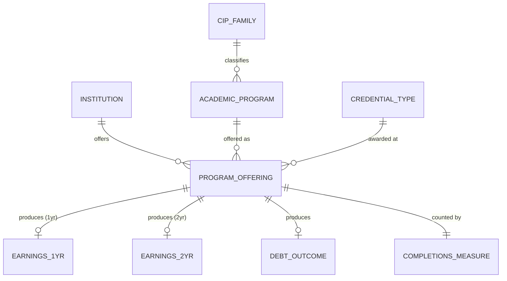

#### Gold: Career Outcomes

The Gold conceptual model adds derived analytics on top of Silver. A **Career Outcome** enriches each program offering with percentile bands (how a program compares across institutions in the same discipline), financial assessments (debt-to-earnings ratios, value indices), and data confidence metadata.

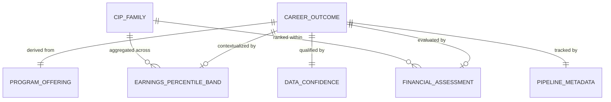

### Logical Model

#### Silver: College Scorecard Base

Flattens the conceptual entities into a single denormalized table suitable for the Silver Base zone. All attributes are grouped by conceptual origin. NK = natural key component.

```mermaid
erDiagram
    COLLEGE_SCORECARD {
        identifier record_id PK
        identifier unitid NK
        text institution_name
        text institution_control
        identifier cipcode NK
        text program_name
        identifier cip_family
        text cip_family_name
        numeric credential_level NK
        text credential_description
        numeric earnings_1yr_median
        numeric earnings_2yr_median
        numeric debt_median
        numeric completions_count_1
        numeric completions_count_2
        boolean small_cohort_flag
        date source_load_date
        timestamp ingested_at
    }
```

#### Gold: Career Outcomes

Denormalized consumable table with same grain as Silver (institution x program x credential). Adds 17 derived columns: percentile bands, financial ratios, rankings, and confidence metadata.

```mermaid
erDiagram
    CAREER_OUTCOMES {
        identifier record_id PK
        identifier unitid NK
        text institution_name
        text institution_control
        identifier cipcode NK
        text program_name
        identifier cip_family
        text cip_family_name
        numeric credential_level NK
        numeric earnings_1yr_median
        numeric earnings_2yr_median
        numeric debt_median
        numeric completions_count
        boolean small_cohort_flag
        numeric earnings_1yr_p25
        numeric earnings_1yr_p75
        numeric earnings_2yr_p25
        numeric earnings_2yr_p75
        numeric debt_p25
        numeric debt_p75
        numeric debt_to_earnings_annual
        text debt_to_earnings_tier
        numeric earnings_growth_rate
        numeric cip_family_earnings_rank
        numeric program_value_index
        text confidence_tier
        boolean has_earnings
        boolean has_debt
        numeric outcome_completeness
        date source_load_date
        timestamp promoted_at
    }
```

### Physical Model

#### Silver: College Scorecard Base

The actual DuckDB/Iceberg table implementation with concrete types and constraints.

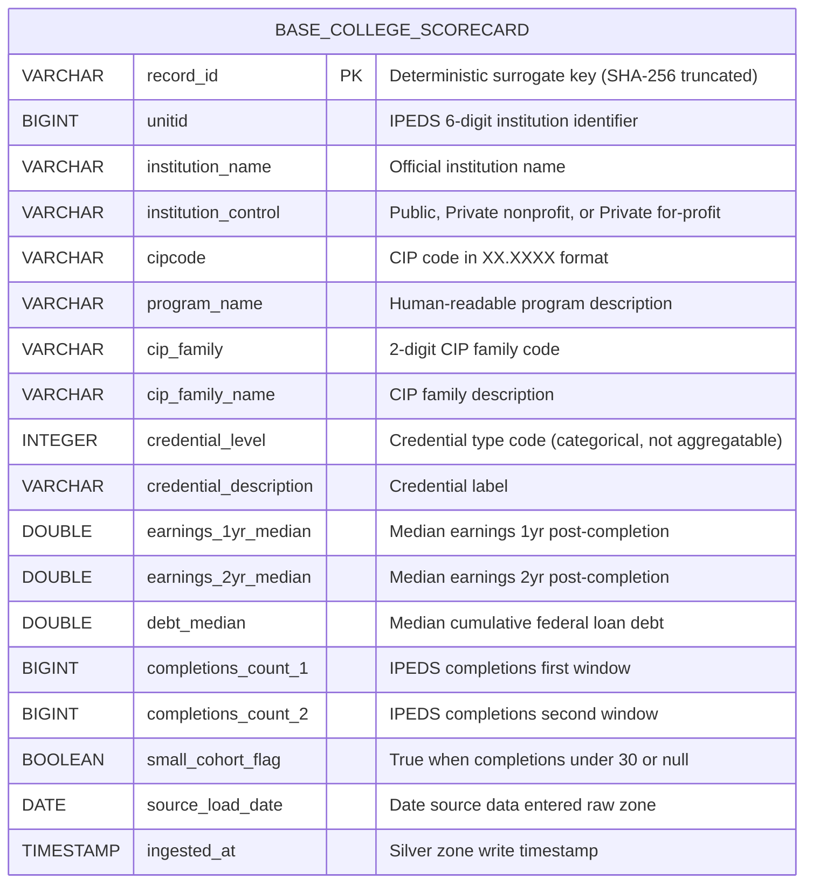

#### Gold: Career Outcomes

The consumable DuckDB/Iceberg table with 30 columns (13 carried from Silver, 17 derived).

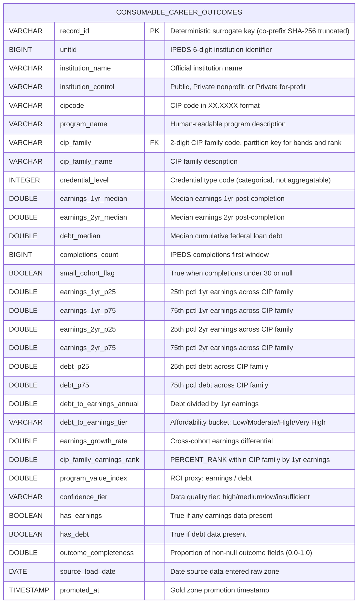

#### Silver: O*NET Base (4 tables)

Shows the O*NET occupation data at BLS SOC granularity. The central entity is the **Occupation** -- a BLS-level occupation aggregated from one or more O*NET detailed codes. Activity Profiles rate human skill importance (HMN stat), Context Profiles measure work environment stress (Burnout boss fight), and Career Transitions map occupational similarity (Stage 3 branching).

##### Conceptual Model

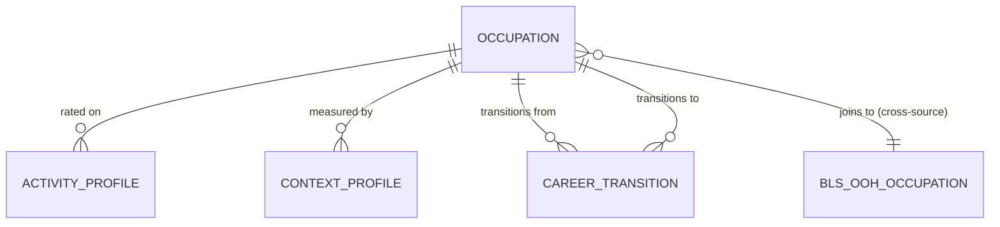

##### Logical Model

```mermaid
erDiagram
    ONET_OCCUPATIONS {
        identifier record_id PK
        identifier bls_soc_code NK
        text primary_title
        text description
        text onet_detail_codes
        numeric onet_detail_count
        boolean multi_detail_flag
        boolean has_work_activities
        boolean has_work_context
        boolean has_tasks
        boolean has_related
        text data_completeness_tier
        date source_load_date
        timestamp ingested_at
    }

    ONET_ACTIVITY_PROFILES {
        identifier record_id PK
        identifier bls_soc_code FK
        identifier element_id NK
        text element_name
        numeric importance
        numeric importance_rank
        boolean is_high_importance
        numeric onet_details_averaged
        boolean suppress_flag
        date source_load_date
        timestamp ingested_at
    }

    ONET_CONTEXT_PROFILES {
        identifier record_id PK
        identifier bls_soc_code FK
        identifier element_id NK
        text element_name
        identifier scale_id
        numeric context_value
        boolean is_burnout_element
        numeric onet_details_averaged
        boolean suppress_flag
        date source_load_date
        timestamp ingested_at
    }

    ONET_CAREER_TRANSITIONS {
        identifier record_id PK
        identifier bls_soc_code FK
        identifier related_bls_soc_code FK
        numeric best_index
        text relatedness_tier
        boolean is_primary
        text relationship_type
        date source_load_date
        timestamp ingested_at
    }

    ONET_OCCUPATIONS ||--o{ ONET_ACTIVITY_PROFILES : "rated on"
    ONET_OCCUPATIONS ||--o{ ONET_CONTEXT_PROFILES : "measured by"
    ONET_OCCUPATIONS ||--o{ ONET_CAREER_TRANSITIONS : "transitions from"
    ONET_OCCUPATIONS ||--o{ ONET_CAREER_TRANSITIONS : "transitions to"
```

##### Physical Model

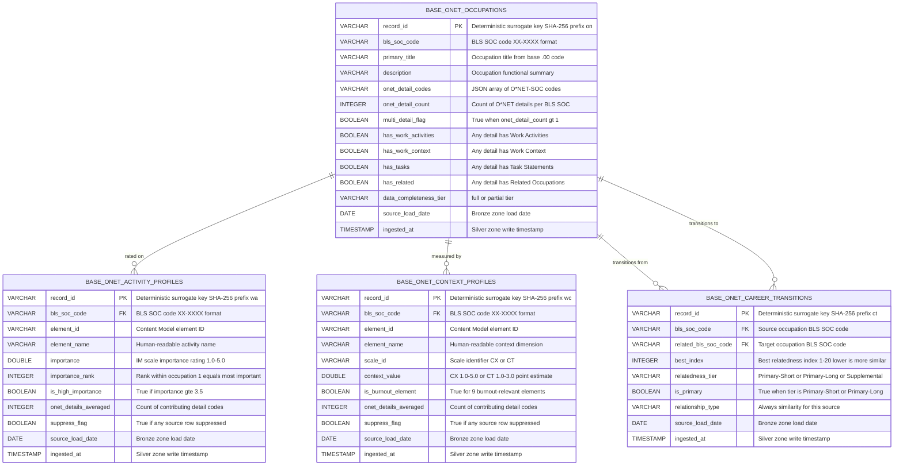

#### Gold: O*NET Work Profiles and Career Transitions

The Gold O*NET conceptual model takes the Silver occupation data (activity profiles, context profiles, career transitions) and derives two consumable products: a **Work Profile** per occupation (with HMN and Burnout scores) and a **Career Transition Graph** (occupation-to-occupation similarity for branching). The Work Profile joins to the BLS OOH Occupation Profile to give a complete picture of each career.

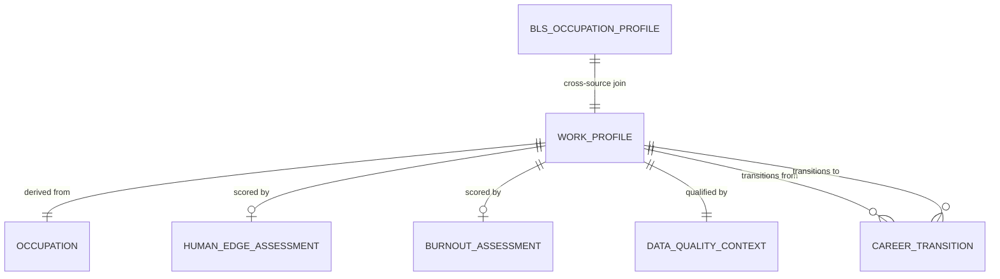

#### Gold: O*NET Work Profiles (Logical)

Two denormalized Gold tables. The Work Profile pivots 41 activity rows and 57 context rows per occupation into a single occupation-level record with derived scores. Career Transitions enriches the Silver similarity graph with titles and work profile availability flags.

```mermaid
erDiagram
    ONET_WORK_PROFILES {
        identifier record_id PK
        identifier bls_soc_code NK
        text primary_title
        text description
        boolean multi_detail_flag
        text data_completeness_tier
        numeric hmn_score
        integer hmn_score_rounded
        text top_human_activities
        integer human_activity_count
        numeric burnout_score
        integer burnout_score_rounded
        text burnout_drivers
        numeric time_pressure
        numeric work_hours
        numeric consequence_of_error
        numeric activity_importance_mean
        text top_5_activities
        boolean activity_profile_available
        boolean context_profile_available
        text confidence_tier
        numeric suppress_pct_activities
        numeric suppress_pct_context
        text backs_stats
        text backs_bosses
        date source_load_date
        timestamp promoted_at
    }

    CAREER_TRANSITIONS {
        identifier record_id PK
        identifier bls_soc_code NK
        text source_title
        identifier related_bls_soc_code NK
        text related_title
        integer best_index
        text relatedness_tier
        boolean is_primary
        text relationship_type
        boolean source_has_work_profile
        boolean related_has_work_profile
        text backs_feature
        date source_load_date
        timestamp promoted_at
    }

    ONET_WORK_PROFILES ||--o{ CAREER_TRANSITIONS : "transitions from"
    ONET_WORK_PROFILES ||--o{ CAREER_TRANSITIONS : "transitions to"
```

#### Gold: O*NET Work Profiles (Physical)

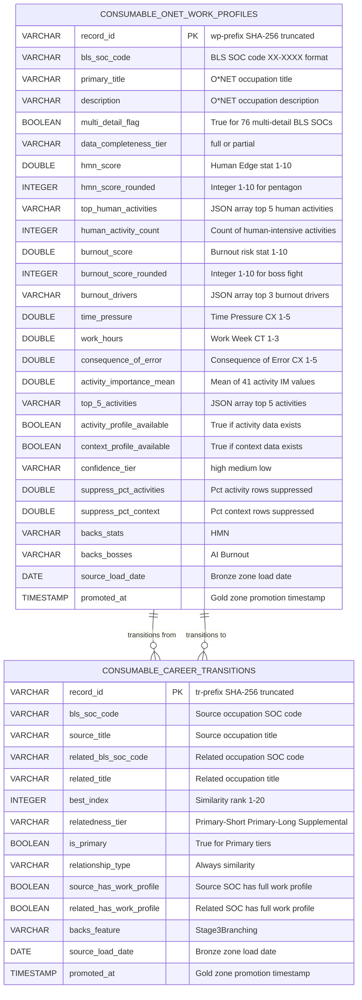

#### Gold: BLS OOH Occupation Profiles (Physical)

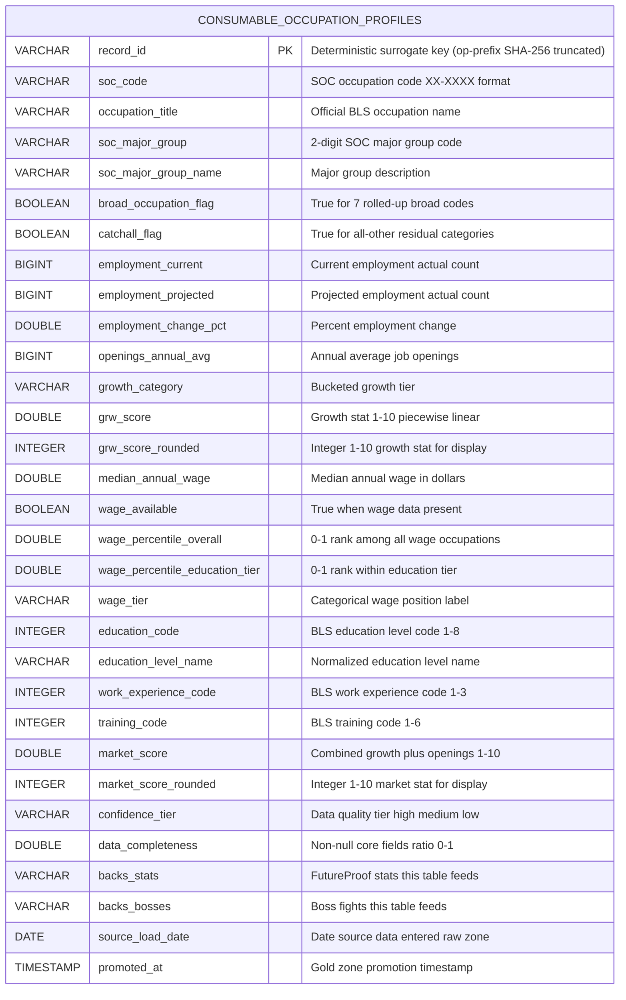

#### Silver/Bronze: CIP-SOC Crosswalk (Physical)

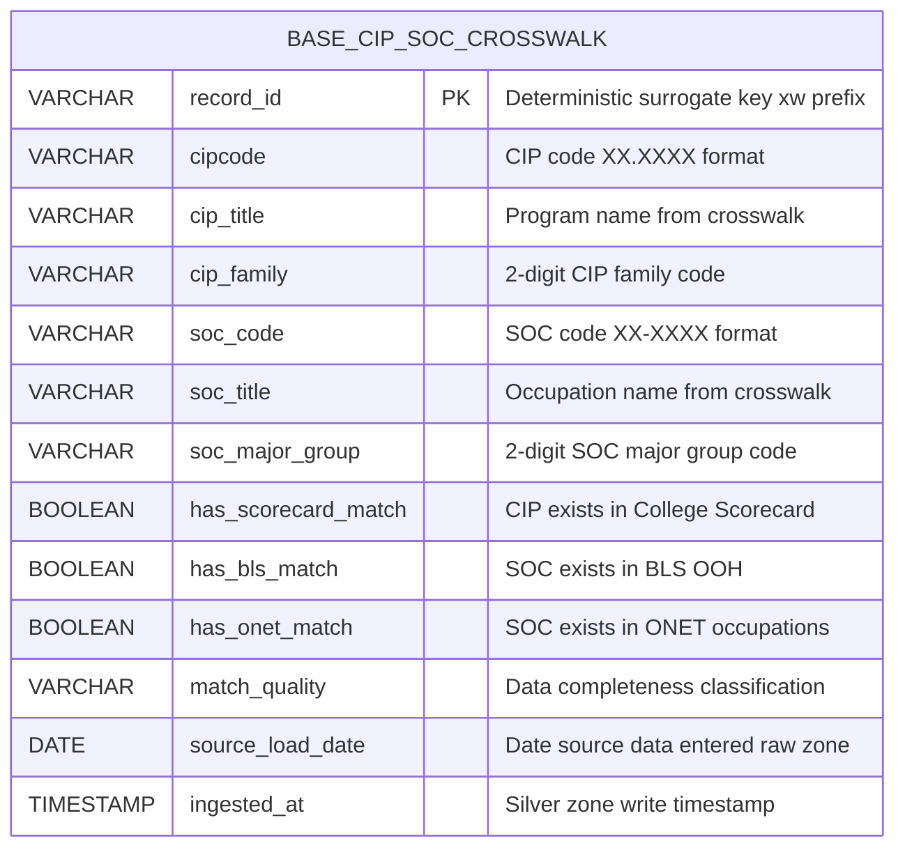

### FutureProof Engine (Gold: Unified Cross-Source Product)

The FutureProof Engine is the culminating Gold product that joins College Scorecard, BLS OOH, O*NET, and the CIP-SOC crosswalk into two queryable tables: one for the core school+major->career query, and one for career branching exploration.

#### Conceptual Model

The central entity is the **Program Career Path** -- one row per school x major x career combination, carrying a five-stat pentagon, boss fight profile, and data quality assessment. The **Career Branch** entity captures occupation-to-occupation similarity for career pivoting exploration.

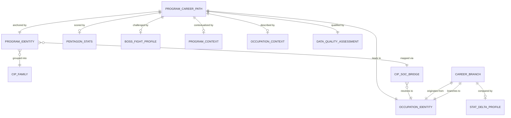

#### Logical Model

Two denormalized tables. Program Career Path flattens program identity, pentagon stats, boss fights, program context, occupation context, and data quality into a single wide row. Career Branch enriches the career transition graph with stats from both source and target occupations plus deltas for at-a-glance comparison.

```mermaid
erDiagram
    PROGRAM_CAREER_PATH {
        identifier record_id PK
        identifier unitid NK
        text institution_name
        identifier cipcode NK
        text program_name
        identifier cip_family
        text cip_family_name
        identifier soc_code NK
        text occupation_title
        text soc_major_group_name
    }
    PENTAGON_STATS {
        identifier grain_ref PK
        numeric stat_ern
        numeric stat_roi
        numeric stat_res
        numeric stat_grw
        numeric stat_hmn
    }
    BOSS_FIGHT_PROFILE {
        identifier grain_ref PK
        numeric boss_ai_score
        numeric boss_loans_score
        numeric boss_market_score
        numeric boss_burnout_score
        numeric boss_ceiling_score
    }
    PROGRAM_CONTEXT {
        identifier grain_ref PK
        numeric earnings_1yr_median
        numeric earnings_1yr_p25
        numeric earnings_1yr_p75
        numeric debt_median
        numeric debt_to_earnings_annual
        text confidence_tier_program
    }
    OCCUPATION_CONTEXT {
        identifier grain_ref PK
        numeric median_annual_wage
        text growth_category
        numeric employment_current
        text education_level_name
        text top_5_activities
        text top_human_activities
        text burnout_drivers
        numeric time_pressure
        numeric work_hours
    }
    DATA_QUALITY {
        identifier grain_ref PK
        text match_quality
        numeric stats_available_count
        numeric bosses_available_count
        text overall_confidence
    }
    CAREER_BRANCH {
        identifier record_id PK
        identifier soc_code NK
        text source_title
        identifier related_soc_code NK
        text related_title
        numeric best_index
        text relatedness_tier
        boolean is_primary
    }
    STAT_DELTAS {
        identifier branch_ref PK
        numeric grw_delta
        numeric hmn_delta
        numeric burnout_delta
        numeric wage_delta
        boolean branch_has_full_data
    }
    PROGRAM_CAREER_PATH ||--o| PENTAGON_STATS : "scored by"
    PROGRAM_CAREER_PATH ||--o| BOSS_FIGHT_PROFILE : "challenged by"
    PROGRAM_CAREER_PATH ||--o| PROGRAM_CONTEXT : "contextualized by"
    PROGRAM_CAREER_PATH ||--o| OCCUPATION_CONTEXT : "described by"
    PROGRAM_CAREER_PATH ||--|| DATA_QUALITY : "qualified by"
    CAREER_BRANCH ||--|| STAT_DELTAS : "compared by"
```

#### Physical Model

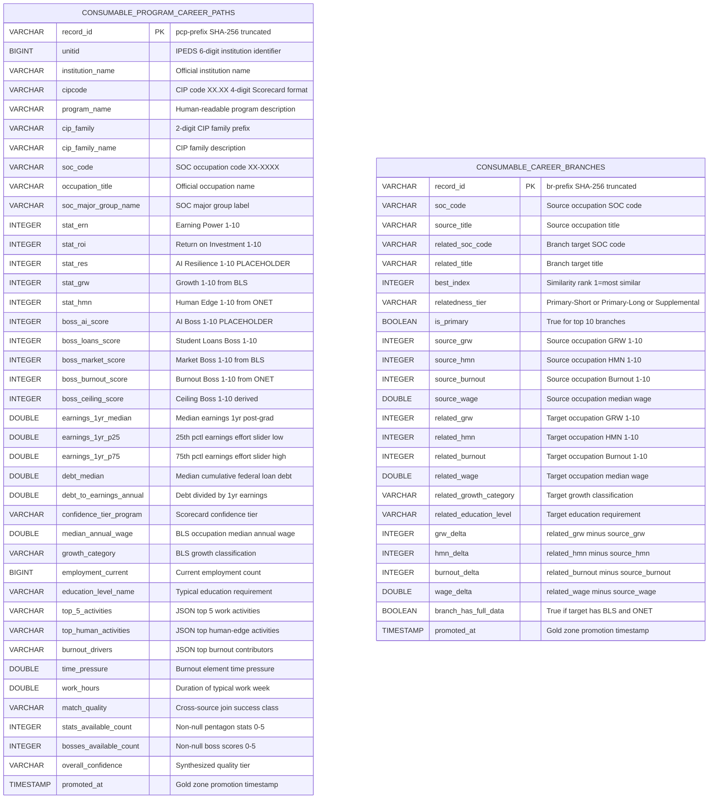

## Tables

| Table | Zone | Rows | Grain | Description |
|-------|------|------|-------|-------------|
| `raw.college_scorecard` | Bronze | 69,947 | unitid x cipcode x credlev | Raw College Scorecard data as ingested from the Department of Education |
| `base.college_scorecard` | Silver | 69,947 | unitid x cipcode x credential_level | Clean, modeled base table with normalized CIP codes, business-meaningful column names, and small cohort flags |
| `consumable.career_outcomes` | Gold | 69,947 | unitid x cipcode x credential_level | Career outcomes data product with percentile bands, debt-to-earnings ratios, earnings rankings, and confidence tiers |
| `raw.onet_occupations` | Bronze | 1,016 | onetsoc_code | Raw O*NET occupation titles and descriptions at O*NET-SOC granularity |
| `raw.onet_work_activities` | Bronze | 73,308 | onetsoc_code x element_id x scale_id | Raw O*NET Generalized Work Activity ratings (IM and LV scales) |
| `raw.onet_work_context` | Bronze | 297,676 | onetsoc_code x element_id x scale_id | Raw O*NET Work Context measurements (CX, CT, CXP, CTP scales) |
| `raw.onet_related_occupations` | Bronze | 18,460 | onetsoc_code x related_onetsoc_code | Raw O*NET Related Occupations similarity data |
| `raw.onet_task_statements` | Bronze | 18,796 | onetsoc_code x task_id | Raw O*NET task-level descriptions per occupation |
| `base.onet_occupations` | Silver | 798 | bls_soc_code | Master O*NET occupation reference at BLS SOC granularity, with data completeness flags |
| `base.onet_activity_profiles` | Silver | 31,734 | bls_soc_code x element_id | Work Activity importance ratings (IM scale 1-5) backing the HMN stat |
| `base.onet_context_profiles` | Silver | 44,118 | bls_soc_code x element_id | Work Context point estimates (CX/CT scales) backing the Burnout boss fight |
| `base.onet_career_transitions` | Silver | 15,944 | bls_soc_code x related_bls_soc_code | Career similarity graph for Stage 3 branching |
| `consumable.onet_work_profiles` | Gold | 798 | bls_soc_code | Occupation work profiles with HMN score (Human Edge), Burnout score, activity/context summaries, and confidence tiers |
| `consumable.career_transitions` | Gold | 15,944 | bls_soc_code x related_bls_soc_code | Career transition graph enriched with titles and work profile availability flags for Stage 3 branching |
| `raw.bls_ooh` | Bronze | 832 | soc_code | Raw BLS Occupational Outlook Handbook data: employment, wages, growth projections, education requirements |
| `base.bls_ooh` | Silver | 832 | soc_code | Clean BLS OOH base table with normalized SOC codes, growth categories, and education level mappings |
| `consumable.occupation_profiles` | Gold | 832 | soc_code | Occupation profiles with GRW score (Growth), market score, wage percentiles, and education requirements |
| `raw.cip_soc_crosswalk` | Bronze | 5,903 | cipcode x soc_code | Raw CIP-SOC crosswalk mapping academic programs to occupations |
| `base.cip_soc_crosswalk` | Silver | 5,903 | cipcode x soc_code | Enriched crosswalk with join-readiness flags (has_scorecard_match, has_bls_match, has_onet_match) and match quality classification |
| `consumable.program_career_paths` | Gold | 626,406 | unitid x cipcode x soc_code | The core FutureProof query table: school + major + career with five pentagon stats (ERN, ROI, RES, GRW, HMN), five boss fights, and cross-source data quality assessment |
| `consumable.career_branches` | Gold | 15,944 | soc_code x related_soc_code | Career branching table with source/target occupation stats and deltas for the branch tree visualization |

## Business Glossary (93 terms)

The following business terms are defined in `governance/business-glossary.json` and govern the meaning of fields across the pipeline. Showing key terms by source; see the glossary file for the complete list.

### College Scorecard Terms (BT-001 through BT-026)

| Term ID | Name | Category | Definition |
|---------|------|----------|------------|
| BT-001 | UNITID | Entity | A unique 6-digit identifier assigned to every postsecondary institution by the Integrated Postsecondary Education Data System (IPEDS). Stable across reporting years. |
| BT-003 | CIP Code | Classification | A Classification of Instructional Programs code that categorizes academic programs. Standard format is XX.XXXX (2-digit family + 4-digit detail). Defined by the NCES CIP 2020 taxonomy. |
| BT-009 | Median Earnings 1-Year Post-Completion | Measurement | The median earnings of graduates 1 year after completion. Cohort-level aggregate. The 1yr and 2yr figures come from different cohorts and are NOT longitudinal. |
| BT-011 | Median Debt at Completion | Measurement | The median cumulative federal loan debt of students who completed a program. Represents typical total borrowing for graduates. |
| BT-015 | Record ID | Derived | A deterministic hash-based identifier computed from grain fields. Provides a stable surrogate key. Prefixed per table ('cs', 'co', 'on', 'wa', 'wc', 'ct', 'ooh'). |
| BT-019 | Debt-to-Earnings Ratio (Annual) | Measurement | Ratio of median debt to median 1yr earnings (debt/earnings). Below 1.0 is manageable; above 2.0 is concerning. Related to the Dept. of Education Gainful Employment rule. |
| BT-024 | Confidence Tier | Classification | Four-level data quality rating: high (large cohort + all data), medium (large cohort + partial), low (small cohort + some data), insufficient (no outcome data). |

### BLS OOH Terms (BT-027 through BT-054)

| Term ID | Name | Category | Definition |
|---------|------|----------|------------|
| BT-027 | SOC Code | Classification | The Standard Occupational Classification code (XX-XXXX) that uniquely identifies a U.S. occupation. The primary cross-source join key connecting BLS, O*NET, and College Scorecard data. |
| BT-028 | Occupation Title | Entity | The official name of an occupation as published by BLS or O*NET. Display label; the SOC code is the authoritative identifier. |
| BT-036 | Median Annual Wage (Occupation) | Measurement | The median annual wage for an occupation as reported by BLS. Some occupations are capped at >= $239,200. |
| BT-041 | Growth Category | Derived | Classification of projected employment growth: decline, little-or-no-change, slower-than-average, as-fast-as-average, faster-than-average, much-faster-than-average. |
| BT-051 | Market Score | Derived | Combined BLS-based occupation attractiveness metric integrating growth projections, wage levels, and opening volume. |

### O*NET Terms (BT-055 through BT-065)

| Term ID | Name | Category | Definition |
|---------|------|----------|------------|
| BT-055 | O*NET-SOC Code | Classification | A more granular version of the SOC code (XX-XXXX.XX) used by O*NET to classify occupations at the detailed specialization level. Silver zone aggregates these to BLS SOC level (XX-XXXX). |
| BT-056 | Content Model Element ID | Classification | A hierarchical identifier (e.g., '4.A.1.a.1') for O*NET's Content Model taxonomy that uniquely identifies a measured dimension of work. Section 4.A = 41 Work Activities, Section 4.C = 57 Work Context elements. |
| BT-057 | Work Activity Importance | Measurement | A rating on the O*NET Importance (IM) scale (1.0-5.0) measuring how important a Generalized Work Activity is to a given occupation. Backs the HMN (Human Edge) stat. |
| BT-058 | Work Context Value | Measurement | A point-estimate rating on the CX scale (1.0-5.0) or CT scale (1.0-3.0) measuring environmental and structural conditions of occupations. Backs the Burnout boss fight. |
| BT-059 | Burnout Element | Classification | One of 9 Work Context elements identified as burnout-relevant (Time Pressure, Consequence of Error, etc.). Subject to human approval. |
| BT-060 | Career Transition (Similarity) | Entity | A directional relationship indicating two occupations share similar skill/knowledge profiles. Based on occupational similarity, not observed career moves. Powers Stage 3 branching. |
| BT-061 | Relatedness Tier | Classification | Three-tier classification of career similarity: Primary-Short (index 1-5, closest), Primary-Long (index 6-10), Supplemental (index 11-20). |
| BT-062 | Suppress Flag | Derived | A flag indicating O*NET marked the underlying survey data as potentially unreliable (recommend_suppress = 'Y'). Data is preserved but flagged. |
| BT-063 | Multi-Detail Aggregation | Derived | The condition where multiple O*NET detailed codes (XX-XXXX.XX) map to one BLS SOC (XX-XXXX), requiring averaging of numeric ratings. 76 BLS SOCs are multi-detail. |
| BT-064 | Data Completeness Tier (O*NET) | Classification | Classification of how much O*NET data exists for an occupation: 'full' (all 4 data types), 'partial' (some), or 'none' (excluded from Silver). |
| BT-065 | Importance Rank | Derived | Rank of a Work Activity within an occupation by importance (1 = most important, 41 = least). Derived from the importance value. |

### Gold O*NET Terms (BT-066 through BT-072)

| Term ID | Name | Category | Definition |
|---------|------|----------|------------|
| BT-066 | HMN Score (Human Edge) | Derived | A 1-10 score measuring how much an occupation relies on distinctly human skills (interpersonal judgment, creativity, physical presence, emotional intelligence). Derived from the ratio of human-intensive activity importance to total activity importance. Backs the HMN pentagon stat. |
| BT-067 | Human-Intensive Activity | Classification | A Work Activity classified as requiring human skills that are difficult for AI to replicate (e.g., coaching others, creative thinking, caring for others). 14 of the 41 O*NET Work Activities are classified as human-intensive. Subject to human approval. |
| BT-068 | Burnout Score | Derived | A 1-10 score measuring occupational burnout risk, derived from the normalized average of 9 burnout-relevant Work Context elements (time pressure, work hours, consequence of error, etc.). Higher = more burnout risk. Backs the Burnout boss fight. |
| BT-069 | Burnout Driver | Derived | The top 3 Work Context elements contributing most to an occupation's burnout score. Explains WHY an occupation has its burnout risk level (e.g., high time pressure, long work hours). Powers Gemma's burnout narrative. |
| BT-070 | Work Profile | Entity | A comprehensive occupation-level record combining HMN score, Burnout score, activity summaries, and context summaries. One per BLS SOC code. The unit of analysis for the O*NET Gold data product. |
| BT-071 | Work Profile Confidence Tier | Classification | Three-level quality rating for work profiles: high (full data, <5% suppression), medium (full data, >=5% suppression), low (partial data only). |
| BT-072 | Activity Importance Mean | Derived | The average importance rating across all 41 Work Activities for an occupation (IM scale 1-5). Measures overall activity intensity. |

### CIP-SOC Crosswalk Terms (BT-073 through BT-076)

| Term ID | Name | Category | Definition |
|---------|------|----------|------------|
| BT-073 | CIP-SOC Crosswalk | Classification | A reference table maintained by NCES/BLS that maps CIP codes (academic programs) to SOC codes (occupations). The critical bridge between education and labor market data. |
| BT-074 | No Match Sentinel | Classification | A crosswalk row where either the CIP or SOC code is the sentinel value "99-9999" or "99.9999", indicating no mapped occupation or program exists. |
| BT-075 | Join-Readiness Flag | Derived | Boolean flags on crosswalk rows indicating whether the CIP or SOC code exists in a target dataset (College Scorecard, BLS OOH, or O*NET). |
| BT-076 | Match Quality | Classification | A classification of how many target datasets a crosswalk row can join to: full (all 3), partial (some), or minimal (none). |

### FutureProof Engine Terms (BT-077 through BT-093)

| Term ID | Name | Category | Definition |
|---------|------|----------|------------|
| BT-077 | Pentagon Stats | Entity | The five-stat scoring profile (1-10 scale each) that powers the pentagon visualization: ERN (Earning Power), ROI (Return on Investment), RES (AI Resilience), GRW (Growth), HMN (Human Edge). |
| BT-078 | Earning Power (stat_ern) | Derived | A pentagon stat on a 1-10 scale measuring combined program-level and occupation-level earnings attractiveness. Blends 60% program earnings rank (school-specific) with 40% occupation wage percentile (career-level). |
| BT-079 | Return on Investment (stat_roi) | Derived | A pentagon stat on a 1-10 scale measuring how efficiently a program converts debt into earnings. Derived from debt-to-earnings ratio via piecewise linear mapping aligned with Gainful Employment guidance. |
| BT-080 | AI Resilience (stat_res) | Derived | A pentagon stat on a 1-10 scale measuring how resistant an occupation is to AI automation. PLACEHOLDER in MVP -- set to null pending Karpathy AI exposure score integration. |
| BT-081 | Boss Fight Score | Entity | A 1-10 integer score representing the strength of a career challenge. Higher score means a stronger "boss" (worse for the student). Five boss fights: AI, Student Loans, Market, Burnout, and Ceiling. |
| BT-082 | Program Career Path | Entity | The central consumable entity: one row per school + major + career combination. Joins four Gold sources through the CIP-SOC crosswalk to produce a unified record with pentagon stats, boss fights, and data quality assessment. |
| BT-083 | Boss AI Score | Derived | AI Boss strength (1-10). PLACEHOLDER in MVP -- set to null pending Karpathy integration. Higher score means greater AI automation threat. |
| BT-084 | Boss Loans Score | Derived | Student Loans Boss strength (1-10). Computed as 11 minus stat_roi, making it the inverse of ROI. A program with excellent ROI has an easy Loans boss. |
| BT-085 | Boss Ceiling Score | Derived | Ceiling Boss strength (1-10). Measures how constrained an occupation's earnings are within its education tier. Derived from wage percentile within education tier. |
| BT-086 | CIP Prefix Match | Derived | The cross-taxonomy join strategy that truncates 6-digit crosswalk CIP codes to 4 digits to match Scorecard's format. Achieves 91% CIP coverage vs 0% with strict matching. |
| BT-087 | Stats Available Count | Derived | Count (0-5) of non-null pentagon stats on each program career path row. Maximum 4 in MVP since stat_res is always null. |
| BT-088 | Bosses Available Count | Derived | Count (0-5) of non-null boss fight scores on each program career path row. Maximum 4 in MVP since boss_ai_score is always null. |
| BT-089 | Overall Confidence | Classification | Synthesized quality tier (high/medium/low) from stats_available_count and match_quality. Controls how prominently the product displays results. |
| BT-090 | Career Branch | Entity | A pre-computed career transition pair enriched with stat profiles for both source and target occupations, plus stat deltas for at-a-glance comparison. Powers the Stage 3 branch tree visualization. |
| BT-091 | Stat Delta | Derived | The computed difference between source and target occupation stats across a career branch (grw_delta, hmn_delta, burnout_delta, wage_delta). Positive = branch target scores higher. |
| BT-092 | Branch Has Full Data | Derived | Boolean flag indicating the branch target occupation has both BLS and O*NET data (related_grw and related_hmn are both non-null). |
| BT-093 | Match Quality (Gold Engine) | Classification | Classification of cross-source join success at Gold time: full (BLS + O*NET), partial_no_onet, partial_no_bls, or scorecard_only. Derived from actual join results, NOT from crosswalk Silver flags. |

## Governance

All governance artifacts live under `governance/`:

| Artifact | Path |
|----------|------|
| Data Dictionary | `governance/data-dictionary.json` |
| Business Glossary | `governance/business-glossary.json` |
| Data Contracts | `governance/data-contracts/` |
| DQ Rules | `governance/dq-rules/` |
| DQ Scorecards | `governance/dq-scorecards/` |
| Lineage | `governance/lineage/` |
| Data Models | `governance/models/` |
| Audit Trail | `governance/audit-trail/` |

## Key Design Decisions

1. **CIP codes normalized in Silver** — Raw stores 4-digit codes (e.g., '5202'); Silver normalizes to XX.XXXX format (e.g., '52.02') per the NCES standard.
2. **md_earn_wne dropped** — This institution-level metric is 100% null at the field-of-study grain and is removed in Silver.
3. **Small cohorts flagged, not excluded** — Programs with fewer than 30 completers get `small_cohort_flag = True` but remain in the dataset. Downstream consumers decide how to handle them.
4. **1yr and 2yr earnings are NOT longitudinal** — They come from different graduating cohorts. It is valid for 2yr to be lower than 1yr.
5. **Privacy suppression preserved as null** — The pipeline does not attempt to impute or estimate suppressed values.
6. **Percentile bands are cross-institution** — The 25th/75th percentile bands in Gold are computed across institutions within a CIP family, not across individual earners within a cohort. They answer "what range of outcomes do programs in this discipline produce?"
7. **Minimum sample guard for percentile bands** — CIP families with fewer than 3 non-null values get null percentile bands to avoid misleading statistics from tiny samples.
8. **Debt-to-earnings thresholds from Gainful Employment** — The tier boundaries (0.75, 1.5, 2.5) are informed by Department of Education Gainful Employment rule guidance and industry convention.
9. **All Silver rows carried to Gold** — The Gold table has the same row count as Silver (69,947). Programs are flagged with confidence tiers, not filtered out. Filtering happens at query time.
10. **O*NET aggregated to BLS SOC level** — O*NET classifies 1,016 occupations at XX-XXXX.XX granularity; Silver aggregates to 798 BLS SOC codes (XX-XXXX) because all cross-source joins use BLS SOC as the common key. 76 BLS SOCs have multi-detail aggregation (unweighted averaging).
11. **69 structurally empty BLS SOCs excluded from O*NET Silver** — "All Other" and Military occupations with zero data in all O*NET child tables are excluded. The 24 partial-data occupations (tasks + related only) are retained with flags.
12. **IM scale only for Work Activities** — Silver retains only the Importance (IM) scale, not Level (LV). FutureProof needs "how important" for HMN scoring, not "how complex." Cuts data volume in half.
13. **CX/CT scales only for Work Context** — Silver retains only point-estimate scales (CX/CT), dropping 82% of Bronze Work Context data (CXP/CTP category percentages) retained for post-hackathon depth.
14. **Career transitions are similarity, not observed moves** — O*NET Related Occupations measures occupational similarity, not actual career transitions. The relationship_type field documents this distinction.
15. **9 burnout elements EDA-corrected** — 4 of 9 burnout-relevant element IDs proposed in the spec were incorrect. The EDA validated the corrected IDs against actual Bronze data.
16. **HMN score uses importance ratio, not absolute values** — The Human Edge score computes what fraction of an occupation's important work is human-intensive, normalizing across occupations with different overall activity intensity. This prevents jobs with many high-importance activities from all scoring similarly.
17. **Burnout elements equally weighted** — All 9 burnout-relevant Work Context elements contribute equally to the Burnout score. Equal weighting is simpler and more defensible than subjective weighting of individual stress factors.
18. **14 human-intensive activities classified by nature** — The classification of which Work Activities are "human-intensive" (requiring judgment, creativity, interpersonal skill, or physical presence) is static across all occupations. This is the most subjective decision in the pipeline and was confirmed through adversarial auditing.
19. **24 partial-data occupations carry null scores** — Occupations with incomplete O*NET data get null HMN and Burnout scores rather than estimated values. The confidence_tier field flags these as "low" so downstream consumers can handle them appropriately.
20. **Career transitions are directional similarity, not observed career moves** — The career_transitions table represents O*NET's occupational similarity measurements, not actual career change data. The relationship_type field documents this distinction for all consumers.
21. **CIP prefix join (4-digit) bridges the granularity mismatch** — College Scorecard stores CIP codes as 4-digit (XX.XX) while the CIP-SOC crosswalk stores them as 6-digit (XX.XXXX). Strict matching yields 0% coverage. Truncating crosswalk CIPs to 4 digits achieves 91% CIP coverage and 97% row coverage. This is intentionally coarser than the crosswalk was designed for.
22. **ERN stat weighted 60/40 program vs. occupation** — The Earning Power stat weights school-specific earnings at 60% and occupation-level wages at 40%. This captures the school premium (a Stanford CS grad earns more than average even though Software Developer median wage is the same everywhere).
23. **ROI piecewise breakpoints from Gainful Employment guidance** — The debt-to-earnings ratio thresholds that map to stat_roi scores (0.25, 0.75, 1.5, 2.5, 4.0) are informed by Department of Education Gainful Employment rule guidance.
24. **RES stat and AI Boss are null placeholders** — The AI Resilience pentagon stat and AI boss fight score are set to null in the MVP. They require Karpathy AI Exposure Scores and task-level Gemma scoring from a separate spec. The product ships with 4/5 stats and 4/5 bosses.
25. **match_quality derived at Gold time, NOT from crosswalk Silver** — The crosswalk Silver's has_scorecard_match flag is FALSE for all 5,903 rows due to the 6-digit strict matching. The FutureProof Engine derives match_quality from actual join results (which BLS/O*NET joins succeeded).
26. **Dedup after CIP prefix fan-out** — The 4-digit prefix join may produce duplicate (unitid, cipcode, soc_code) rows if the same SOC appears via multiple 6-digit crosswalk CIPs. Dedup on grain keeps the row with the most non-null stat values.
27. **Boss Ceiling uses simplified formula** — Computed as ROUND(10.0 - 9.0 * wage_percentile_education_tier). A more sophisticated approach would use BLS experience-level salary data, but the simplified version is defensible for the hackathon.
