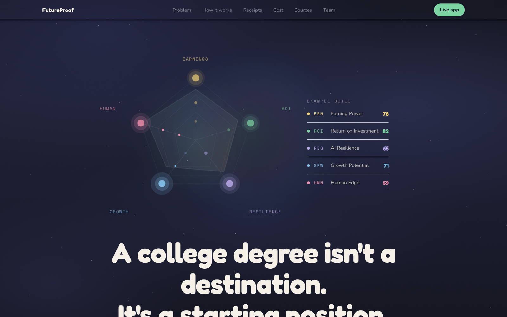
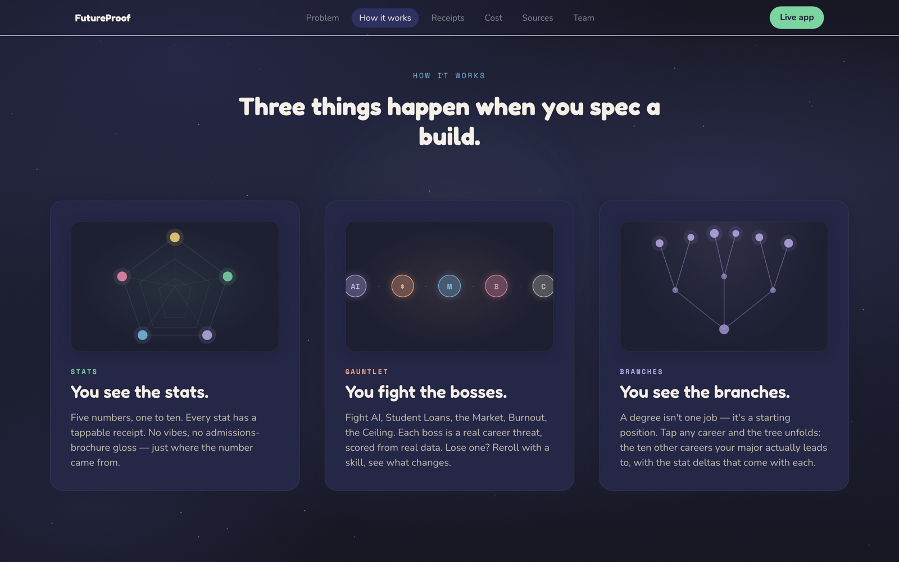
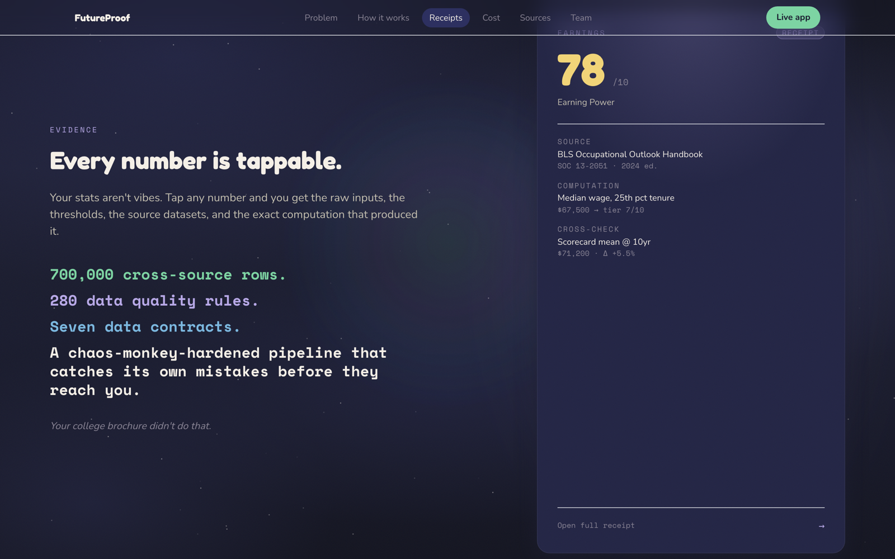
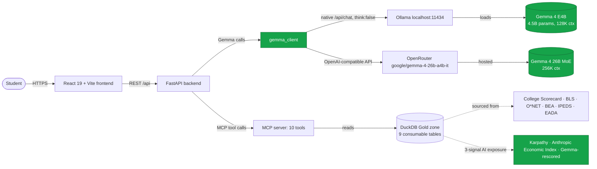

<h1 align="center">FutureProof</h1>

<p align="center"><i>An RPG-style career planning tool that shows high schoolers where a college degree actually leads — powered by Gemma 4, runnable on a school's own laptop.</i></p>

<p align="center">
  
  
  
  
  
  
</p>



> Submission to the [Gemma 4 Good Hackathon](https://www.kaggle.com/competitions/gemma-4-good-hackathon) — Tracks: **Main**, **Future of Education**, **Digital Equity & Inclusivity**, and the **Ollama** special track.

---

## The problem

A 17-year-old picks a college and a major from a brochure. The brochure shows graduation gowns and a salary range. It does not show how exposed the career on the other side is to AI automation, that the wage ceiling can be locked by the credential level, or that the loan math depends on assumptions the brochure never names. A private-school senior gets this analysis from a $400-an-hour college counselor. A first-generation community-college applicant gets a pamphlet.

FutureProof grew out of a real family decision. I am the parent of a high-school senior, and we were trying to compare college choices without reducing the decision to brochure salary ranges or vibes. The questions were concrete: what does this major actually lead to, how much debt does this path imply, how exposed is the career to AI, and which numbers can we verify?

FutureProof closes that gap. A student types a school and a free-text major, picks from data-backed career paths, and sees a five-stat pentagon — Earning Power (ERN), Return on Investment (ROI), AI Resilience (RES), Growth Outlook (GRW), and Brand Gravity (AURA) — computed from federal labor data, a three-signal AI-exposure composite (Karpathy + Anthropic Economic Index + Gemma-rescored), and an institution-level brand model. Then five boss fights — Fight AI, Fight Student Loans, Fight the Market, Fight Burnout, Fight the Ceiling — model the threats the brochure left out. Every number is tappable; every claim has a source.

The same codebase runs on a school's own hardware via Ollama. No per-query cost. No student data leaves the building.

---

## Demo

- **3-minute walkthrough video:** _TBD before submission_ — will be linked here and in the Kaggle writeup.
- **Live web demo:** _TBD before submission_ — hosted frontend + cloud backend running Gemma 4 on managed inference.
- **Local Gemma 4 demo:** Follow [Quickstart](#quickstart) — same product, runs entirely on your laptop with Ollama.
- **Screenshots:** [`docs/screenshots/`](docs/screenshots/)

| | |
|---|---|
|  |  |
| Career paths split into direct undergraduate paths and postgraduate paths. | Receipts: every stat opens a panel showing inputs, thresholds, and the public dataset it came from. |

---

## Features

- Resolves a free-text major like "pre-med" or "deaf education" to a real CIP program with Gemma 4, then validates the result against real school programs and the CIP/SOC crosswalk before scoring.
- Computes a five-stat pentagon (ERN, ROI, RES, GRW, AURA) from College Scorecard, BLS, O\*NET, BEA cost-of-living, an institution-level brand model, and a three-signal AI-exposure composite that blends Karpathy's index, the Anthropic Economic Index, and a Gemma-rescored occupation-level signal.
- Runs a five-boss gauntlet (Fight AI, Fight Student Loans, Fight the Market, Fight Burnout, Fight the Ceiling) plus a composite final fight (Fight the Future), with deterministic scoring and Gemma-generated narratives.
- Uses Gemma 4 to resolve messy student major intent and explain why certain career paths appear, while the UI separates direct undergraduate paths from careers that typically require postgraduate education.
- Turns lost or drawn boss fights into skill plans — Gemma generates 3–5 career-grounded stat-delta buffs, so a student sees why a path is risky and what deliberate work could change the outcome.
- Renders a dynamic career branch tree from O\*NET pathway data, up to three hops deep, with stat deltas at every node.
- Surfaces a tappable receipt on every score — raw inputs, thresholds, and the public dataset it came from.
- Generates a Spotify Wrapped-style share sequence (1080×1920) optimized for Instagram Stories, server-rendered with Playwright.
- Switches between cloud and local Gemma 4 by changing one environment variable — no code change.

---

## Architecture

**At a glance.**


**Detailed view.**



**Why this stack.** Career data is public, but the right answers require joining seven federal datasets — plus a three-signal AI-exposure composite — through a CIP↔SOC crosswalk, and explaining the result in language a 17-year-old will read. The first half is deterministic — DuckDB on the Brightsmith Gold zone gives reproducible scores with full data lineage. The second half is generative — Gemma 4 resolves intent, explains career paths, narrates fights, and crafts skills. Splitting the work this way means scores never hallucinate and narratives stay grounded. Pointing the same `gemma_client` at Ollama instead of OpenRouter swaps the entire model layer in one config change, so a school district can run the product offline on its own hardware with no per-query cost and no student data leaving the building.

---

## Tech stack

| Layer | Technology |
|---|---|
| Frontend | React 19, Vite 6, TypeScript 5.6, Tailwind 3.4, Framer Motion, React Query, React Router, Zustand, @xyflow/react |
| Backend | FastAPI 0.115, Python 3.11, Pydantic 2.10 |
| Model runtime (local) | [Ollama](https://ollama.com) 0.x via native `/api/chat` with `think:false` |
| Model runtime (cloud) | [OpenRouter](https://openrouter.ai) via OpenAI-compatible chat completions |
| Default model (local) | `gemma4:e4b` — 4.5B effective params, 128K context |
| Default model (cloud) | `google/gemma-4-26b-a4b-it` — 26B MoE, 256K context |
| Data store | DuckDB 1.1 (Gold zone) over Apache Iceberg-style Bronze/Silver lake |
| Data pipeline | [Brightsmith](https://github.com/jcernauske/brightsmith) — Bronze → Silver → Gold → MCP |
| Public data sources | College Scorecard, BLS OOH, O\*NET, NCES CIP↔SOC crosswalk, BEA Regional Price Parities, IPEDS finance, EADA |
| AI exposure signals | Karpathy AI Exposure Index, Anthropic Economic Index, Gemma-rescored occupation-level signal (`gemma4:26b-a4b` at pipeline time) |
| Wrapped renderer | Playwright (headless Chromium) |
| Test | pytest (backend + pipeline), vitest (frontend), ruff, mypy |

---

## Methodology: How We Score Programs

### The 15-year window

FutureProof's ROI score uses a fixed 15-year earnings window for every program in the database. This is a deliberate choice. The federal standard repayment plan is 10 years, but in reality the median bachelor's-degree borrower takes 17–21 years to pay off their loans (Education Data Initiative, The College Investor 2026, ELFI). Fifteen years splits the difference between contractual ideal and lived experience. It also matches the OBBBA Tiered Standard term for a typical $25–50K debt load and captures the years when career trajectory becomes clear — by year 15, lawyers make partner, doctors finish residency, and engineers reach senior IC. Long-horizon outcomes beyond this window — late-career earnings, market projections, full lifetime trajectory — are captured by the GRW stat and the Stage 3 career tree, not by ROI. Keeping ROI focused on a fixed comparison window is what makes the compare screen actually useful for picking between schools.

### The ROI formula

ROI is computed as a payback multiplier: cumulative 15-year earnings (starting from each program's actual year-one median salary, applied at a flat 3% nominal annual growth — the long-run U.S. wage-growth average) divided by the program's 4-year sticker cost (residency-aware for public schools). A multiplier of 5x means a graduate of this program will earn 5x the cost of the degree over the typical 15-year repayment window. The multiplier is mapped to a 1–10 stat using calibrated thresholds. ROI is **financing-agnostic**: it doesn't matter whether the student pays cash, takes loans, or has a full scholarship — the question "is this program priced fairly relative to what it produces?" has the same answer regardless of who's paying. Financing realities show up in two other places: Boss Debt (where the loan slider scales the boss's power based on actual interest paid) and the First Home Race visualization.

### What ROI does and doesn't model

ROI projects 15 years of earnings starting from the program's actual year-one median salary, applied at flat 3% annual nominal growth. **It does not model career progression, promotions, or the gap between entry-level and senior pay.** Those depend on what graduates do after they're hired — certifications, performance, switching employers, going to grad school — none of which are properties of the program itself. ROI is a measure of what the *degree* delivers, which is the first job. What students do with that first job is up to them. We chose this conservative approach deliberately: modeling career progression we can't honestly project would mean the stat measures graduate effort instead of program quality. If you want to understand long-horizon outcomes, look at the Stage 3 career tree, which explicitly branches on grad-school and career-pivot decisions.

For the full technical specification including formula derivation, threshold calibration, and migration notes, see [`docs/specs/roi-net-lifetime-value.md`](docs/specs/roi-net-lifetime-value.md).

---

## Quickstart

Five commands once prerequisites are installed. Total time is dominated by the first `ollama pull gemma4:e4b` model download.

### Prerequisites

- Node.js ≥ 20
- Python ≥ 3.11
- [`uv`](https://docs.astral.sh/uv/) (pipeline) and `pip` (backend)
- [Ollama](https://ollama.com) running on `localhost:11434`
- Several GB free disk for `gemma4:e4b` weights, 8 GB RAM minimum

### 1. Clone and install

```bash
git clone https://github.com/jcernauske/futureproof-data.git
cd futureproof-data
uv sync                                          # pipeline deps
( cd backend && pip install -e ".[dev]" && playwright install chromium )
( cd frontend && npm install )
```

### 2. Pull Gemma 4

```bash
ollama pull gemma4:e4b
```

### 3. Configure environment

```bash
cp docs/env-template.txt .env
# Default config (INFERENCE_BACKEND=ollama) needs no edits to run locally.
```

### 4. Run the backend

```bash
cd backend
python -m uvicorn app.main:app --host 0.0.0.0 --port 8000
```

### 5. Run the frontend (separate terminal)

```bash
cd frontend
npm run dev
```

Open [http://localhost:5173](http://localhost:5173). The landing screen renders within a few seconds; the first build call warms Ollama, subsequent calls are faster.

---

## Configuration

| Variable | Required | Default | Description |
|---|---|---|---|
| `INFERENCE_BACKEND` | yes | `ollama` | `ollama` for local inference, `openrouter` for hosted |
| `OPENROUTER_API_KEY` | only when `INFERENCE_BACKEND=openrouter` | — | OpenRouter key used to call `google/gemma-4-26b-a4b-it` |
| `OLLAMA_BASE_URL` | no | `http://localhost:11434/v1` | Override if Ollama runs on a different host or port. Keep the `/v1` suffix; the native Ollama client derives `/api/chat` from it. |
| `OLLAMA_MODEL` | no | `gemma4:e4b` | Override the local Gemma 4 variant; pull it first with `ollama pull` |
| `OPENROUTER_MODEL` | no | `google/gemma-4-26b-a4b-it` | Override the hosted Gemma 4 model slug |

A complete annotated reference lives at [`docs/env-template.txt`](docs/env-template.txt). Copy it to `.env` (or `.env.example`, then `.env`) at the repo root.

---

## Project structure

```
.
├── src/
│   ├── raw/             # Brightsmith Bronze zone — raw ingestors
│   ├── silver/          # Silver zone — normalization
│   ├── gold/            # Gold zone — consumable tables
│   └── mcp_server/      # MCP server exposing 10 Gemma-callable tools
├── backend/
│   └── app/
│       ├── routers/     # FastAPI routes (builds, gauntlet, ask_gemma, wrapped, …)
│       ├── services/    # Stat engine, boss fights, gemma_client, skill_pool, …
│       └── models/      # Pydantic v2 API contracts
├── frontend/
│   └── src/
│       ├── components/  # menu/, gauntlet/, build-results/, landing/, …
│       ├── api/         # Typed fetchers
│       └── lib/         # Hooks, formatters, design tokens
├── data/                # DuckDB Gold zone (gitignored)
├── domain/              # Brightsmith domain config
├── glossaries/          # Business glossary terms
├── governance/          # Data contracts, DQ rules, chaos manifests
├── docs/
│   ├── futureproof_hackathon_prd_v8.md
│   ├── reference/       # voice-guide.md, world-class-readme-criteria.md, …
│   ├── img/             # README hero
│   └── screenshots/
├── LICENSE_SOURCES.md   # Licenses for every external dataset
└── README.md
```

The data pipeline is built on [Brightsmith](https://github.com/jcernauske/brightsmith); the Brightsmith CLAUDE.md describes the agent workflow, governance model, and zone architecture.

---

## Why Gemma 4 matters

FutureProof is not a chatbot wrapped around a dataset. It uses Gemma 4 where deterministic code is weak: interpreting messy student language, choosing the right governed data tool, producing structured outputs, and explaining tradeoffs in plain language. Gemma 4's local runtime path is also central to the deployment model. Schools and community programs often cannot budget for open-ended per-token API usage, especially for repeated counseling sessions. Running `gemma4:e4b` through Ollama turns inference into a fixed local hardware cost instead of a metered cloud bill, without the risk of private student data ever leaving the building.

| Gemma 4 capability | How FutureProof uses it | Why it matters |
|---|---|---|
| Reasoning | Resolves inputs like "pre-med", "deaf education", and broad CIP ambiguity | Students type goals, not federal taxonomies |
| Function calling / tools | Calls governed school, career, AI exposure, regional cost, and AURA tools | Gemma explains real data instead of guessing |
| Structured JSON | Produces validated intent, skills, and tool arguments | Model output stays product-safe and testable |
| Local Ollama runtime | Runs `gemma4:e4b` locally with the same app path used by hosted inference | Schools avoid per-token API costs and can keep student inputs on their own hardware |
| Long context | Loads build context into Ask Gemma and explanation flows | Follow-up guidance can use the student's full decision context |
| Multilingual guidance | Generates Spanish and Arabic student-facing guidance while preserving official school, occupation, source, and numeric terms | Spanish and Arabic are the top non-English home languages among U.S. public-school English learners; high-stakes decisions should happen in the language a student or family is most comfortable using |
| Multimodal input | Not used in this release | Kept as future work for course catalogs, transcripts, worksheets, and counselor documents |
| Thinking mode | Disabled for student-facing latency | Bounded guidance flows favor responsiveness over long hidden reasoning traces |

The project stresses Gemma 4's strongest fit for this problem: reasoning, structured tool use, local deployment, long-context guidance, and multilingual explanation. It does not use multimodal input or fine-tuning in this release.

---

## Technical depth

FutureProof is built as a grounded Gemma 4 system, not a prompt-only demo.

| Area | Implementation | Why it matters |
|---|---|---|
| Grounded scoring | Deterministic SQL over governed Gold tables computes ERN, ROI, RES, GRW, AURA, and boss outcomes | Gemma explains scores; it does not invent them |
| Tool use | Gemma calls ten governed MCP-style tools for school, career, occupation, AI exposure, cost-of-living, and institution data | Answers are grounded in public data rather than model memory |
| Structured outputs | Intent, tool arguments, skill deltas, and JSON-like model outputs are parsed and validated | Model output can safely drive the UI |
| Local inference | One `gemma_client` supports Ollama `gemma4:e4b` and OpenRouter `google/gemma-4-26b-a4b-it` | The same product path supports school-local and hosted demos |
| Privacy and cost | Ollama mode runs on school hardware | Schools avoid per-token bills, and private student context can stay inside the building |
| Observability | Gemma calls are logged with backend, model, latency, prompt, response, and call-site metadata | Judges can inspect real model behavior instead of trusting screenshots |
| Spec-driven delivery | Product changes are tracked in `/docs/specs/`, with completed specs, review notes, test plans, and follow-up reports | Judges can see auditable engineering work, not a one-off demo script |
| Resilience | Narrow degraded paths keep model failures from corrupting scores or structured state | Robust engineering without making Gemma optional |
| Reproducibility | Quickstart, env template, tests, screenshots, and data-source license ledger are included | A judge can run and verify the system |

---

## How Gemma 4 is used

Gemma 4 is not a chat layer pasted on top of a search engine. It drives the product experience: resolving messy student intent, choosing data-grounded tools, turning scores into plain-language guidance, and helping students understand what to do next. Deterministic scoring, schema validation, and narrow degraded paths keep the app auditable, but the high-value experience depends on Gemma.

| # | Surface | What Gemma does | Why deterministic code is not enough |
|---|---|---|---|
| 1 | Intent resolution | Maps free-text major input ("pre-med", "deaf education") to a CIP program | Students describe goals in human language, not official CIP codes |
| 2 | Intent validation | Checks Gemma's mapped CIP against real school programs and the CIP/SOC crosswalk before scoring | A model can interpret messy language, but the scored path must still exist in governed data |
| 3 | Career-path explanation | Explains why the shown careers appear for the student's school and major, including missing or surprising paths | Crosswalk results need context to be understandable to a 17-year-old |
| 4 | Gemma's Take | Writes a 4–6 sentence coaching narrative leading the build reveal | Students need an interpretation of the build, not just five numbers |
| 5 | Boss fight narratives | Explains each fight result: Fight AI, Fight Student Loans, Fight the Market, Fight Burnout, and Fight the Ceiling | Threat scores are more useful when translated into concrete tradeoffs |
| 6 | Reroll commentary | Explains how an equipped skill changes a fight outcome | The student needs to understand why an action changed the result |
| 7 | Skill pool generation | Creates 3–5 skills per losing boss with machine-readable stat deltas | Losing a fight should teach risk and agency: the student sees what makes the path dangerous, then what work could make them harder to replace |
| 8 | Skill recommendations | Suggests courses, certificates, internships, and minors that can improve the build | Recommendations should be grounded in the student's selected path |
| 9 | Next Steps checklist | Produces concrete post-gauntlet action items with the RPG metaphor dropped | A student needs an actionable plan they can take to a counselor or family member |
| 10 | Ask Gemma | Answers follow-up questions with the full build context loaded | Counseling-style questions depend on the whole decision context |
| 11 | Skill-based boss rematches | Turns equipped Gemma-generated skills into structured stat deltas that the boss engine rescores live | Students learn that risky paths are not destiny, but surviving them takes deliberate work |

If a model call fails, FutureProof degrades gracefully with deterministic copy or validated defaults. Those paths are safeguards, not the intended product experience.

**Variant.** `gemma4:e4b` (4.5B effective parameters, 128K context window) is the default for local inference because it keeps the product offline, zero-cost per query, and realistic on school-owned hardware. Latency depends heavily on the machine and prompt path; recorded local spikes in this repo range from fast short generations to ~24s p50 for tool-calling and ~46s average for one intent-resolution benchmark. The hosted demo uses `google/gemma-4-26b-a4b-it` (26B MoE, 256K context) for higher-quality narrative work and lower demo latency.

**Inference path.** Local: Ollama on `localhost:11434` via native `/api/chat` with `think:false`, because Ollama's OpenAI-compatible endpoint does not reliably disable Gemma 4 thinking tokens for the non-streaming chat path. Cloud: OpenRouter on `openrouter.ai/api/v1` via the OpenAI-compatible API. The single abstraction lives in [`backend/app/services/gemma_client.py`](backend/app/services/gemma_client.py); switching backends is a `.env` edit, not a code change.

**Function calling.** Gemma calls into a Model Context Protocol (MCP) server that exposes the Brightsmith Gold zone as ten tools: `get_school_programs`, `get_career_paths`, `get_occupation_data`, `get_task_breakdown`, `get_career_branches`, `get_ai_exposure`, `get_regional_price_parity`, `compare_purchasing_power`, `get_schools_for_career`, and `get_institution_aura`. Tool schemas live alongside the server in [`src/mcp_server/`](src/mcp_server/). This is what keeps every score reproducible — Gemma routes and explains, the deterministic Gold tables score.

**Multimodal.** Text only. Multimodal input is on the roadmap; nothing in the shipped product depends on it.

**Thinking mode.** Off. The use cases are conversational and latency-bounded; thinking adds tokens with no measurable quality lift on this task set.

**Sampling.** Default temperature 0.7 (set in `gemma_client.py`); `top_p` and `top_k` are left at the provider default. Per-call overrides are passed through unchanged.

**Why local-first matters.** Career planning intersects with sensitive context: family income, special education needs, mental-health work, military aspirations. The Ollama path means a school district can run the entire product on its own hardware. No per-query cost. No student inputs traversing a third-party API. A district CIO who would never approve sending student data to a frontier-model API can approve a binary that runs on a workstation.

---

## Model card

**Intended use.** Career exploration support for high school and early-college students (roughly 14–22). The product surfaces public federal labor data, scores it deterministically, and uses Gemma 4 to translate the result into plain language.

**Out-of-scope use.** Not financial advice. Not a substitute for a licensed school counselor, college admissions officer, or career counselor. Not a placement tool, an admissions decision tool, or an automated screening tool.

**Inputs and outputs.** Inputs are short text strings (school name, free-text major, slider positions) and structured selections. Outputs are numeric stat scores, deterministic boss-fight outcomes, Gemma-generated narratives bounded to 4–6 sentences, and structured skill suggestions with stat deltas.

**Limitations.**
- Stats are computed from public data with reporting lag — College Scorecard and BLS data trail the current calendar year by 1–3 years.
- AI exposure scores are a composite estimate. They blend Karpathy's published index, the Anthropic Economic Index (observed Claude usage at occupation level — empirical but Claude-specific), and a Gemma-rescored occupation-level signal. Treat the score as an informed estimate, not a measurement.
- Modeled outcomes are population-level, not individual predictions. A given student's outcome can sit anywhere in the distribution.
- Coverage is U.S.-only and limited to the institutions present in the College Scorecard release used at build time.

**Safety mitigations.** Scores never come from Gemma — they come from deterministic SQL over governed Gold tables. Gemma routes, explains, narrates. CIP validation, schema validation, and narrow degraded paths keep model failures or non-program-like inputs from corrupting scores or structured state.

**Privacy.** No login, no account, no analytics tracking, no PII collection. The "profile" is a randomly generated three-word name (e.g., `dancing happy bear 🐻`); no email, no password. Run the product through Ollama and inputs never leave the host machine.

**Responsible AI.** This project follows Google's [Gemma Prohibited Use Policy](https://ai.google.dev/gemma/prohibited_use_policy) and the [Responsible Generative AI Toolkit](https://ai.google.dev/responsible).

---

## Testing

```bash
uv run pytest                        # data pipeline tests
( cd backend && pytest )             # FastAPI services + routers
( cd frontend && npx vitest run )    # React components
```

Coverage is highest on the deterministic layer — stat engine, boss fights, MCP tool wrappers — and lighter on Gemma surfaces, which are exercised through fixture-based prompt regression tests in `backend/tests/services/`. Lint and type checks:

```bash
uv run ruff check src/ tests/
( cd backend && ruff check . && mypy app/ )
( cd frontend && npx tsc --noEmit )
```

---

## Deployment

The hackathon submission ships two parallel deployment paths.

**Hosted demo.** Frontend on Vercel. Backend on a managed Python host with the model layer pointed at OpenRouter's `google/gemma-4-26b-a4b-it`. This path lets a judge use the product without installing anything.

**Local-first (Ollama).** Same codebase. Set `INFERENCE_BACKEND=ollama`, run `ollama pull gemma4:e4b`, run the backend and frontend locally, and the product is fully functional offline. This is the path a school district takes — and the path the Ollama special track demonstrates.

A `Dockerfile` for the backend lives in [`backend/Dockerfile`](backend/Dockerfile). The Wrapped share renderer requires Chromium; the image installs it via `playwright install chromium` during build.

---

## Roadmap and known limitations

- **AI exposure is a three-signal composite — receipts disclose which signals were available.** Every RES score is computed from up to three sources: Karpathy's published index, Anthropic's Economic Index (observed Claude usage), and a Gemma-rescored occupation-level signal run at pipeline time. The receipt names the exact method used per row (`gemma_plus_anthropic`, `karpathy_only`, `gemma`, `two_signal_no_anthropic`, or a Karpathy + O\*NET fallback) so a student can see which signals the score rests on. Where Anthropic or Gemma data is missing for a given SOC, the receipt says so.
- **Multimodal is not used.** Gemma 4 supports image and audio input; the shipped product is text-only. A future build could let a student photograph a course catalog page and ask "what does this mean."
- **Wrapped requires Chromium.** The 1080×1920 share renderer is server-side Playwright. The `playwright install chromium` step is a 150–280 MB one-time download — required, not optional.
- **Latency depends on variant, hardware, and prompt path.** The local `gemma4:e4b` path is built for offline school hardware, not raw speed. Cloud `google/gemma-4-26b-a4b-it` is built for narrative quality and smoother public-demo latency. Tok/s figures will be measured on the demo machine and added to the Kaggle writeup before submission.
- **Career tree depth is bounded at three hops.** Beyond three hops the O\*NET transition graph fans out faster than the UI can render usefully.

---

## Team

- **Jeff Cernauske** — solo build for the Gemma 4 Good Hackathon — [github.com/jcernauske](https://github.com/jcernauske)

---

## License

Released under the [Apache License 2.0](LICENSE). Gemma 4 is also Apache 2.0; weights remain subject to Google's [Gemma Terms of Use](https://ai.google.dev/gemma/terms) and [Prohibited Use Policy](https://ai.google.dev/gemma/prohibited_use_policy).

External datasets carry their own licenses, documented in [`LICENSE_SOURCES.md`](LICENSE_SOURCES.md). Notable: O\*NET data is CC BY 4.0 (USDOL/ETA, attribution required); Anthropic Economic Index is CC BY 4.0 (attribution required); College Scorecard, BLS OOH, NCES CIP-SOC crosswalk, and BEA Regional Price Parities are U.S. public domain.

---

## Acknowledgments

Built on [Gemma 4](https://ai.google.dev/gemma) by Google DeepMind. Thanks to [Ollama](https://ollama.com) for the local inference runtime, [OpenRouter](https://openrouter.ai) for the hosted backstop, and the [Kaggle](https://www.kaggle.com) team for hosting the hackathon.

Public data sources powering the pentagon and the boss fights: [U.S. Department of Education College Scorecard](https://collegescorecard.ed.gov), [Bureau of Labor Statistics Occupational Outlook Handbook](https://www.bls.gov/ooh/), [O\*NET OnLine](https://www.onetonline.org), [NCES CIP↔SOC crosswalk](https://nces.ed.gov/ipeds/cipcode/), [BEA Regional Price Parities](https://www.bea.gov/data/prices-inflation/regional-price-parities-state-and-metro-area), [IPEDS](https://nces.ed.gov/ipeds/) finance, and [EADA](https://ope.ed.gov/athletics/).

The RES stat is a three-signal composite: Andrej Karpathy's published [AI exposure scores from `karpathy/jobs`](https://github.com/karpathy/jobs), the [Anthropic Economic Index](https://www.anthropic.com/economic-index) (observed Claude usage at occupation level), and a Gemma-rescored occupation-level signal run at pipeline time using `gemma4:26b-a4b`.

Data pipeline built on [Brightsmith](https://github.com/jcernauske/brightsmith).

The previous data-pipeline-focused README is preserved at [`README-DEPRECATED.md`](README-DEPRECATED.md) for operators and data engineers.

---

*Hackathon submission. Not an official Google product.*
