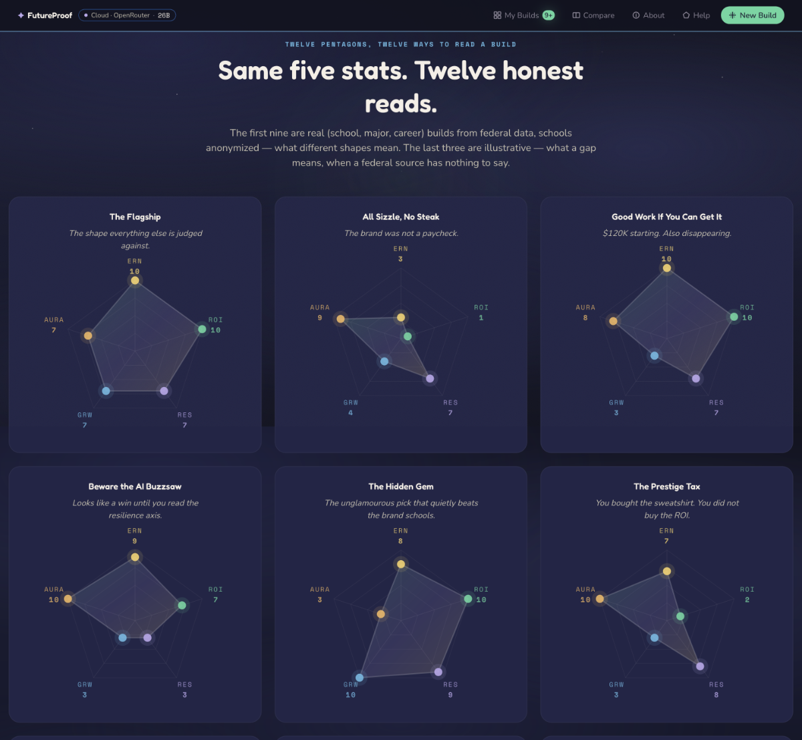
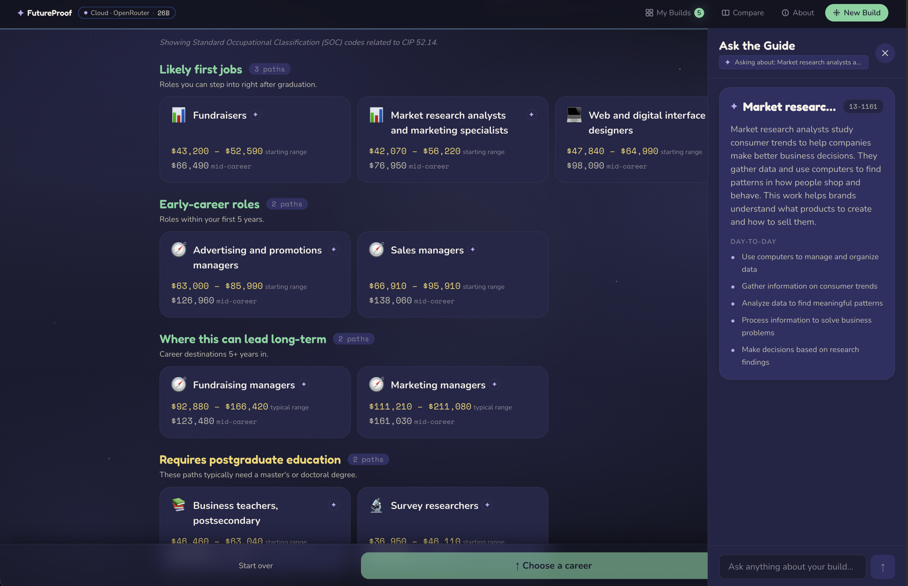
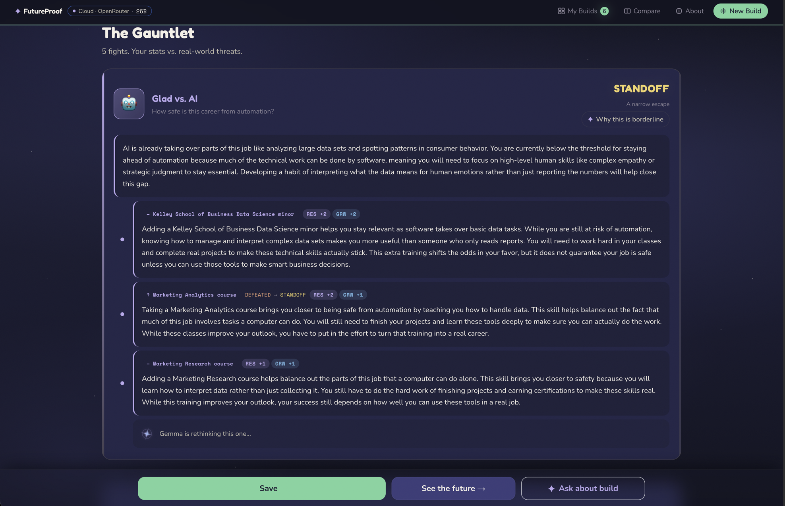
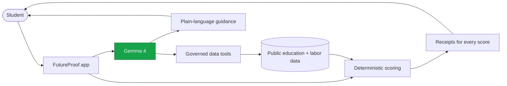
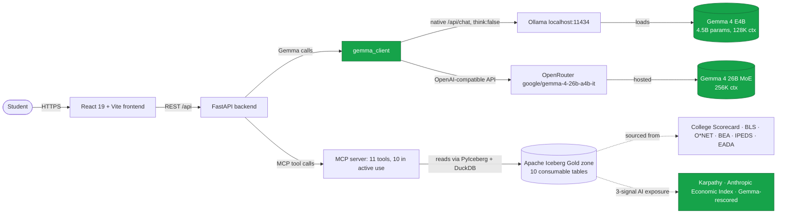

<h1 align="center">FutureProof</h1>

<p align="center"><i>An RPG-style career planning tool that shows high schoolers where a college degree actually leads — powered by Gemma 4, runnable on a school's own laptop.</i></p>

<p align="center">
  <a href="https://youtu.be/ekmOs2eLHnA"></a>
  <a href="https://futureproof.hyenastudios.com"></a>
  
  
  
  
</p>



> Submission to the [Gemma 4 Good Hackathon](https://www.kaggle.com/competitions/gemma-4-good-hackathon).

---

## The problem

A 17-year-old picks a college and a major from a brochure. The brochure shows graduation gowns and a salary range. It does not show how exposed the career on the other side is to AI automation, that the wage ceiling can be locked by the credential level, or that the loan math depends on assumptions the brochure never names. A private-school senior gets this analysis from a $400-an-hour college counselor. A first-generation community-college applicant gets a pamphlet. The result, in aggregate: **$1.77 trillion in U.S. student loan debt, roughly a third of graduates working jobs that don't require their degree, and a high-school counseling system running on anecdote.**

FutureProof grew out of a real family decision. My 17-year-old daughter O. was choosing between three majors at five schools, with 15 minutes of one-on-one time from a counselor responsible for 400 students — 60% more than the 250 the American School Counselor Association recommends. We were trying to compare college choices without reducing the decision to brochure salary ranges or vibes. The questions were concrete: what does this major actually lead to, how much debt does this path imply, how exposed is the career to AI, and which numbers can we verify?

FutureProof closes that gap. A student types a school and a free-text major, picks from data-backed career paths, and sees a five-stat pentagon — Earning Power (ERN), Return on Investment (ROI), AI Resilience (RES), Growth Outlook (GRW), and Brand Gravity (AURA) — computed from federal labor data, a three-signal AI-exposure composite (Karpathy + Anthropic Economic Index + Gemma-rescored), and an institution-level brand model. Then five boss fights — Fight AI, Fight Student Loans, Fight the Market, Fight Burnout, Fight the Ceiling — model the threats the brochure left out. Every number is tappable; every claim has a source.

The same codebase runs on a school's own hardware via Ollama. No per-query cost. No student data leaves the building.

---

## Demo

- **3-minute walkthrough video:** [Watch on YouTube](https://youtu.be/ekmOs2eLHnA)
- **Live web demo:** [futureproof.hyenastudios.com](https://futureproof.hyenastudios.com) — hosted frontend + cloud backend running Gemma 4 on managed inference.
- **Local Gemma 4 demo:** Follow [Quickstart](#quickstart) — same product, runs entirely on your laptop with Ollama.
- **Screenshots:** [`docs/screenshots/`](docs/screenshots/)

| | |
|---|---|
|  |  |
| Career picker grouped by experience requirement, with Ask the Guide explaining each path. | Fight AI boss: deterministic score + Gemma-generated narrative + 3 skill plans to close the gap. |

---

## Features

- Resolves a free-text major like "pre-med" or "deaf education" to a real CIP program with Gemma 4, then validates the result against real school programs and the CIP/SOC crosswalk before scoring.
- Computes a five-stat pentagon (ERN, ROI, RES, GRW, AURA) from College Scorecard, BLS, O\*NET, BEA cost-of-living, an institution-level brand model, and a three-signal AI-exposure composite that blends Karpathy's index, the Anthropic Economic Index, and a Gemma occupation-level exposure score that reasons over each role's O\*NET task list.
- Runs a five-boss gauntlet (Fight AI, Fight Student Loans, Fight the Market, Fight Burnout, Fight the Ceiling) with deterministic scoring and Gemma-generated narratives.
- Uses Gemma 4 to resolve messy student major intent and explain why certain career paths appear, while the UI separates direct undergraduate paths from careers that typically require postgraduate education.
- Turns lost or drawn boss fights into skill plans — Gemma generates 3–5 career-grounded stat-delta buffs, so a student sees why a path is risky and what deliberate work could change the outcome.
- Renders a dynamic career branch tree from O\*NET pathway data, up to three hops deep, with stat deltas at every node.
- Surfaces a tappable receipt on every score — raw inputs, thresholds, and the public dataset it came from.
- Switches between cloud and local Gemma 4 by changing one environment variable — no code change.

---

## Architecture

**At a glance.**



**Detailed view.**



**Why this stack.** Career data is public, but the right answers require joining seven federal datasets (College Scorecard, BLS, O\*NET, NCES CIP↔SOC, BEA RPP, IPEDS finance, EADA) with two external AI-exposure datasets (Karpathy + Anthropic Economic Index) — nine ingested datasets in total — plus a Gemma-scored occupation-level signal that re-reads the underlying O\*NET task list, all stitched through a CIP↔SOC crosswalk and explained in language a 17-year-old will read. The first half is deterministic — Iceberg via DuckDB on the Brightsmith Gold zone gives reproducible scores with full data lineage. The second half is generative — Gemma 4 resolves intent, explains career paths, narrates fights, and crafts skills. Splitting the work this way means scores never hallucinate and narratives stay grounded. Pointing the same `gemma_client` at Ollama instead of OpenRouter swaps the entire model layer in one config change, so a school district can run the product offline on its own hardware with no per-query cost and no student data leaving the building.

### Iceberg tables by zone

The Brightsmith pipeline produces **66 Iceberg tables across 10 namespaces**. The app reads only from the **10 consumable Gold tables**; everything else is the pipeline that produces them.

**Namespace breakdown.**

| Namespace | Count | Role |
|---|--:|---|
| `raw` + `bronze` | 23 | Ingestion landings — source-aligned, no joins |
| `base` | 16 | Silver — per-source normalization |
| `consumable` | 10 | Gold — joins and blends powering the app |
| `governance` + `mcp` | 7 | DQ runs, lineage, pipeline events, MCP tool registry |
| `shadow_*` + `gold`/`silver` (legacy) | 10 | Dev shadows + legacy namespaces, not read by the app |
| **Total** | **66** | |

**Ingestion is source-aligned.** Each input lands in one or more raw/bronze tables — 1:1 with its source, no joins. Nine of the ten rows below are externally ingested datasets; the last is the Gemma 4 in-house exposure scoring produced by [`scripts/gemma_ai_exposure_scorer.py`](scripts/gemma_ai_exposure_scorer.py) and treated by the pipeline as a Bronze landing for symmetry.

| Source | Ingestion tables |
|---|---|
| U.S. Dept of Ed College Scorecard | `raw.college_scorecard`, `bronze.college_scorecard`, `bronze.college_scorecard_institution` |
| O\*NET OnLine | 11 tables across `raw.onet_*` and `bronze.onet_*` (occupations, related occupations, task statements, work activities, work context, experience) |
| BLS | `bronze.bls_ooh`, `bronze.bls_oews` |
| NCES CIP↔SOC crosswalk | `raw.cip_soc_crosswalk` |
| BEA Regional Price Parities | `bronze.bea_rpp` |
| IPEDS Finance | `bronze.ipeds_finance` |
| EADA (Athletics) | `bronze.eada` |
| Karpathy AI Exposure | `bronze.karpathy_ai_exposure` |
| Anthropic Economic Index | `raw.anthropic_economic_index` |
| Gemma 4 in-house scoring | `bronze.raw_gemma_ai_exposure` |

**Silver normalizes per-source.** Sixteen `base.*` tables clean, type, and dedupe one ingest each. Same grain as raw; no cross-source joins.

**Gold is where the blends live.** Every stat and boss score the app shows is computed from one of these ten tables — and most of them are joins across multiple sources.

| Gold table | Sources joined | Powers in the UI |
|---|---|---|
| `consumable.program_career_paths` | career_outcomes × occupation_profiles × onet_work_profiles × career_transitions × cip_soc_crosswalk | **The core table.** School+major→career with all 5 stats and 5 boss scores |
| `consumable.career_outcomes` | college_scorecard ⨝ college_scorecard_institution | ERN, ROI, debt-to-earnings |
| `consumable.occupation_profiles` | bls_ooh | GRW, Ceiling boss, Market boss |
| `consumable.onet_work_profiles` | onet_occupations × activity_profiles × context_profiles | HMN, Burnout boss |
| `consumable.career_transitions` | onet_career_transitions ⨝ onet_occupations ⨝ onet_work_profiles | Stage 3 branching graph |
| `consumable.career_branches` | built alongside `program_career_paths` (same join graph) | Stage 3 branches with stat deltas |
| `consumable.ai_exposure` | gemma_ai_exposure × karpathy_ai_exposure × anthropic_observed_exposure | RES stat, Fight AI boss |
| `consumable.institution_aura` | ipeds_finance FULL OUTER JOIN eada | AURA stat |
| `consumable.ipeds_finance_profile` | ipeds_finance (shaping only) | Tuition, endowment lineage |
| `consumable.regional_price_parities` | bea_rpp | Cost-of-living adjustment by state |

### Data quality and lineage

Every Iceberg table is governed by a data contract and a set of executable DQ rules. The framework is [Brightsmith](https://github.com/hyena-studios/brightsmith); the artifacts live in `governance/`:

| Artifact | Count | Path |
|---|--:|---|
| Data contracts (one per product-surface table) | 42 | `governance/data-contracts/` |
| DQ rule files (each contains many rules) | 41 | `governance/dq-rules/` |
| Chaos tests (manifests + runners) | 48 files | `governance/chaos-manifests/` |
| DQ execution results (run history) | 254 | `governance/dq-results/` |
| Golden datasets | 10 | `governance/golden-datasets/` |

Contracts cover the **42 product-surface tables** — raw ingestion, silver normalization, Gold consumable, and the MCP exposure layer. The other ~24 tables in the catalog (dev shadows, legacy namespaces, internal governance metadata) don't carry contracts because they're not part of what the app reads.

Each rule carries a SQL check, a priority (**P0** blocks promote, **P1** blocks release, **P2** is tracked completeness), a rationale tied to the EDA findings for that source, and a human-approval audit trail. Chaos runners verify the rules actually catch what they claim to: for each source, a Python script intentionally corrupts the data in specific ways and asserts the rule fires.

This is Brightsmith's stance: every datum in the Gold zone has lineage back to a raw ingest, every transformation has a logical model, every model has a contract, every contract has rules, every rule has been run and has results on disk.

**How to verify.** Result JSONs in `governance/dq-results/` are the run-history record — each carries a snapshot ID, row count, rule-pass-by-priority breakdown, executor, and timestamp. To re-run rules against a specific source, per-source executors live at `scripts/dq_execute_<source>.py` (one per zone-level table; no unified runner today). Chaos runners in `governance/chaos-manifests/*_chaos_runner.py` exercise the negative tests.

---

## Tech stack

| Layer | Technology |
|---|---|
| Frontend | React 19, Vite 6, TypeScript 5.6, Tailwind 3.4, Framer Motion, React Query, React Router, Zustand, @xyflow/react |
| Backend | FastAPI 0.115, Python 3.11, Pydantic 2.10 |
| Model runtime (local) | [Ollama](https://ollama.com) 0.x via native `/api/chat` with `think:false` |
| Model runtime (cloud) | [OpenRouter](https://openrouter.ai) via OpenAI-compatible chat completions |
| Default model (local) | `gemma4:e4b` — 4.5B effective params, 128K context |
| Default model (cloud) | `google/gemma-4-26b-a4b-it` — 26B MoE, 256K context |
| Data layer | Apache Iceberg (Bronze / Silver / Gold, 66 tables), queried via PyIceberg + DuckDB 1.1 |
| Data pipeline | [Brightsmith](https://github.com/hyena-studios/brightsmith) — Bronze → Silver → Gold → MCP |
| Public data sources | College Scorecard, BLS OOH, O\*NET, NCES CIP↔SOC crosswalk, BEA Regional Price Parities, IPEDS finance, EADA |
| AI exposure signals | Karpathy AI Exposure Index, Anthropic Economic Index, Gemma occupation-level exposure scores (`gemma4:26b-a4b` at pipeline time — one 0–10 score per SOC, with the automatable/human-essential task split stored as receipts) |
| Test | pytest (backend + pipeline), vitest (frontend), ruff, mypy |

---

## Quickstart

Two commands once prerequisites are installed. Total time is dominated by the first `ollama pull gemma4:e4b` model download.

### Prerequisites

- Node.js ≥ 20
- Python ≥ 3.11
- [`uv`](https://docs.astral.sh/uv/) (pipeline + backend)
- [Ollama](https://ollama.com) running on `localhost:11434`
- Several GB free disk for `gemma4:e4b` weights, 8 GB RAM minimum

### Install and run

```bash
git clone https://github.com/jcernauske/futureproof-data.git
cd futureproof-data
./scripts/setup.sh   # prereq check, deps install, .env, ollama pull
./scripts/dev.sh     # starts backend + frontend together
```

Open [http://localhost:5173](http://localhost:5173). The landing screen renders within a few seconds; the first build call warms Ollama, subsequent calls are faster.

To verify the install separately from running the app: `./scripts/smoke.sh`.

### Manual install (if you'd rather not use the scripts)

```bash
uv sync                                          # pipeline deps
( cd backend && uv sync --extra dev )
( cd frontend && npm install )
ollama pull gemma4:e4b
cp docs/env-template.txt .env                    # default config: INFERENCE_BACKEND=ollama

# Two terminals:
( cd backend && uv run uvicorn app.main:app --host 0.0.0.0 --port 8000 )
( cd frontend && npm run dev )
```

---

## Configuration

| Variable | Required | Default | Description |
|---|---|---|---|
| `INFERENCE_BACKEND` | yes | `ollama` | `ollama` for local inference, `openrouter` for hosted |
| `OPENROUTER_API_KEY` | only when `INFERENCE_BACKEND=openrouter` | — | OpenRouter key used to call `google/gemma-4-26b-a4b-it` |
| `OLLAMA_BASE_URL` | no | `http://localhost:11434/v1` | Override if Ollama runs on a different host or port. Keep the `/v1` suffix; the native Ollama client derives `/api/chat` from it. |
| `OLLAMA_MODEL` | no | `gemma4:e4b` | Override the local Gemma 4 variant; pull it first with `ollama pull` |
| `OPENROUTER_MODEL` | no | `google/gemma-4-26b-a4b-it` | Override the hosted Gemma 4 model slug |
| `OPENROUTER_PROVIDER_ONLY` | no | — | Comma-separated allowlist of OpenRouter provider display names (e.g. `Google`). When set, every request is pinned to those providers and `allow_fallbacks` defaults to `false` — predictable behavior but will 503 if every pinned provider is at capacity. See [Inference path](#inference-path) for why we pin in the hosted demo. |
| `OPENROUTER_PROVIDER_SORT` | no | `throughput` | Provider ranking strategy when not pinned. Accepts `throughput`, `latency`, `price`, or `off` to disable provider routing entirely. |
| `OPENROUTER_PROVIDER_ALLOW_FALLBACKS` | no | `true` (default) / `false` (when pinned) | Whether OpenRouter may fall back to non-preferred providers if the top choice is at capacity. |
| `OPENROUTER_PROVIDER_REQUIRE_PARAMS` | no | `true` | When `true`, OpenRouter only routes to providers that advertise support for every parameter in the request (tools, response_format, seed). |
| `OPENROUTER_QUANTIZATIONS` | no | `bf16,fp16` | Comma-separated allowlist of acceptable quantizations when not pinned. Defaults exclude fp8 because fp8-quantized Gemma 4 26B providers were observed dropping required tool-call arguments. Set to `any` to disable the filter. |
| `GEMMA_HEDGE_DELAY_S` | no | `8.0` | Tail-latency hedge delay for OpenRouter chat completions. If the primary call hasn't returned within this many seconds, a backup request fires in parallel; first response wins. Set to `0` to disable hedging. |
| `GEMMA_MAX_CONCURRENCY` | no | `8` | Module-wide cap on simultaneous Gemma calls. Prevents the `/build` fan-out from tripping OpenRouter per-key RPM limits. |

A complete annotated reference lives at [`docs/env-template.txt`](docs/env-template.txt). Copy it to `.env` (or `.env.example`, then `.env`) at the repo root.

---

## Project structure

```
.
├── src/
│   ├── raw/             # Brightsmith Bronze zone — raw ingestors
│   ├── silver/          # Silver zone — normalization
│   ├── gold/            # Gold zone — consumable tables
│   └── mcp_server/      # MCP server: 11 tools registered, 10 in active product use
├── backend/
│   └── app/
│       ├── routers/     # FastAPI routes (builds, gauntlet, ask_gemma, …)
│       ├── services/    # Stat engine, boss fights, gemma_client, skill_pool, …
│       └── models/      # Pydantic v2 API contracts
├── frontend/
│   └── src/
│       ├── components/  # menu/, build-results/, landing/, …
│       ├── api/         # Typed fetchers
│       └── lib/         # Hooks, formatters, design tokens
├── data/                # Apache Iceberg lake (Bronze/Silver/Gold) + catalog, shipped in-repo
├── domain/              # Brightsmith domain config
├── glossaries/          # Business glossary terms
├── governance/          # Data contracts, DQ rules, chaos manifests
├── docs/
│   ├── futureproof_hackathon_prd_v8.md
│   ├── reference/       # voice-guide.md, world-class-readme-criteria.md, …
│   ├── img/             # README hero
│   └── screenshots/
├── LICENSE_SOURCES.md   # Licenses for every external dataset
└── README.md
```

The data pipeline is built on [Brightsmith](https://github.com/hyena-studios/brightsmith); the Brightsmith CLAUDE.md describes the agent workflow, governance model, and zone architecture.

---

## Why Gemma 4 matters

FutureProof is not a chatbot wrapped around a dataset. It uses Gemma 4 where deterministic code is weak: interpreting messy student language, choosing the right governed data tool, producing structured outputs, and explaining tradeoffs in plain language. Gemma 4's local runtime path is also central to the deployment model. Schools and community programs often cannot budget for open-ended per-token API usage, especially for repeated counseling sessions. Running `gemma4:e4b` through Ollama turns inference into a fixed local hardware cost instead of a metered cloud bill, without the risk of private student data ever leaving the building.

| Gemma 4 capability | How FutureProof uses it | Why it matters |
|---|---|---|
| Reasoning | Resolves inputs like "pre-med", "deaf education", and broad CIP ambiguity | Students type goals, not federal taxonomies |
| Function calling / tools | Calls governed school, career, AI exposure, regional cost, and AURA tools | Gemma explains real data instead of guessing |
| Structured JSON | Produces validated intent, skills, and tool arguments | Model output stays product-safe and testable |
| Local Ollama runtime | Runs `gemma4:e4b` locally with the same app path used by hosted inference | Schools avoid per-token API costs and can keep student inputs on their own hardware |
| Long context | Loads build context into Ask the Guide and explanation flows | Follow-up guidance can use the student's full decision context |
| Multilingual guidance | Generates Spanish and Arabic student-facing guidance while preserving official school, occupation, source, and numeric terms | Spanish and Arabic are the top non-English home languages among U.S. public-school English learners; high-stakes decisions should happen in the language a student or family is most comfortable using |
| Multimodal input | Not used in this release | Kept as future work for course catalogs, transcripts, worksheets, and counselor documents |
| Thinking mode | Disabled for student-facing latency | Bounded guidance flows favor responsiveness over long hidden reasoning traces |

The project stresses Gemma 4's strongest fit for this problem: reasoning, structured tool use, local deployment, long-context guidance, and multilingual explanation. It does not use multimodal input or fine-tuning in this release.

---

## Technical depth

FutureProof is built as a grounded Gemma 4 system, not a prompt-only demo.

| Area | Implementation | Why it matters |
|---|---|---|
| Grounded scoring | Deterministic SQL over governed Gold tables computes ERN, ROI, RES, GRW, AURA, and boss outcomes | Gemma explains scores; it does not invent them |
| Tool use | The MCP server registers 11 governed tools; 10 are in active use across deterministic backend services and Gemma tool-calling flows | Answers are grounded in public data rather than model memory |
| Structured outputs | Intent, tool arguments, skill deltas, and JSON-like model outputs are parsed and validated | Model output can safely drive the UI |
| Local inference | One `gemma_client` supports Ollama `gemma4:e4b` and OpenRouter `google/gemma-4-26b-a4b-it` | The same product path supports school-local and hosted demos |
| Privacy and cost | Ollama mode runs on school hardware | Schools avoid per-token bills, and private student context can stay inside the building |
| Observability | Gemma calls are logged with backend, model, latency, prompt, response, and call-site metadata | Judges can inspect real model behavior instead of trusting screenshots |
| Spec-driven delivery | Product changes are tracked in `/docs/specs/`, with completed specs, review notes, test plans, and follow-up reports | Judges can see auditable engineering work, not a one-off demo script |
| Resilience | Narrow degraded paths keep model failures from corrupting scores or structured state | Robust engineering without making Gemma optional |
| Reproducibility | Quickstart, env template, tests, screenshots, and data-source license ledger are included | A judge can run and verify the system |

---

## How Gemma 4 is used

Gemma 4 is not a chat layer pasted on top of a search engine. It drives the product experience: resolving messy student intent, choosing data-grounded tools, turning scores into plain-language guidance, and helping students understand what to do next. Deterministic scoring, schema validation, and narrow degraded paths keep the app auditable, but the high-value experience depends on Gemma.

| # | Surface | What Gemma does | Why deterministic code is not enough |
|---|---|---|---|
| 1 | Intent resolution | Maps free-text major input ("pre-med", "deaf education") to a CIP program | Students describe goals in human language, not official CIP codes |
| 2 | Intent validation | Checks Gemma's mapped CIP against real school programs and the CIP/SOC crosswalk before scoring | A model can interpret messy language, but the scored path must still exist in governed data |
| 3 | Career-path explanation | Explains why the shown careers appear for the student's school and major, including missing or surprising paths | Crosswalk results need context to be understandable to a 17-year-old |
| 4 | The Take | Writes a 4–6 sentence coaching narrative leading the build reveal | Students need an interpretation of the build, not just five numbers |
| 5 | Boss fight narratives | Explains each fight result: Fight AI, Fight Student Loans, Fight the Market, Fight Burnout, and Fight the Ceiling | Threat scores are more useful when translated into concrete tradeoffs |
| 6 | Reroll commentary | Explains how an equipped skill changes a fight outcome | The student needs to understand why an action changed the result |
| 7 | Skill pool generation | Creates 3–5 skills per losing boss with machine-readable stat deltas | Losing a fight should teach risk and agency: the student sees what makes the path dangerous, then what work could make them harder to replace |
| 8 | Skill recommendations | Suggests courses, certificates, internships, and minors that can improve the build | Recommendations should be grounded in the student's selected path |
| 9 | Next Steps checklist | Produces concrete post-gauntlet action items with the RPG metaphor dropped | A student needs an actionable plan they can take to a counselor or family member |
| 10 | Ask the Guide | Answers follow-up questions with the full build context loaded | Counseling-style questions depend on the whole decision context |
| 11 | Skill-based boss rematches | Turns equipped Gemma-generated skills into structured stat deltas that the boss engine rescores live | Students learn that risky paths are not destiny, but surviving them takes deliberate work |

If a model call fails, FutureProof degrades gracefully with deterministic copy or validated defaults. Those paths are safeguards, not the intended product experience.

**Variant.** `gemma4:e4b` (4.5B effective parameters, 128K context window) is the default for local inference because it keeps the product offline, zero-cost per query, and realistic on school-owned hardware. Per-surface E4B latencies are in the [Evaluation](#evaluation) section's baseline table (single source of truth). The hosted demo uses `google/gemma-4-26b-a4b-it` (26B MoE, 256K context) due to OpenRouter availability.

**Inference path.** Local: Ollama on `localhost:11434` via native `/api/chat` with `think:false`, because Ollama's OpenAI-compatible endpoint does not reliably disable Gemma 4 thinking tokens for the non-streaming chat path. Cloud: OpenRouter on `openrouter.ai/api/v1` via the OpenAI-compatible API. The single abstraction lives in [`backend/app/services/gemma_client.py`](backend/app/services/gemma_client.py); switching backends is a `.env` edit, not a code change.

**OpenRouter provider routing.** OpenRouter rotates each model slug across roughly 10 underlying GPU providers, and provider quality varies on three independent axes: raw throughput (some providers ran us at 2 tok/s, others at 100 tok/s on the same slug), quantization (fp8 vs. bf16 — fp8 providers were observed dropping required tool-call arguments under load), and parameter-honoring strictness (some providers advertise `response_format: json_object` support but treat it as a hint). Three layers of control in [`backend/app/services/gemma_client.py`](backend/app/services/gemma_client.py) keep this manageable: (1) a `provider` object on every request that defaults to `sort: "throughput"` with a `quantizations: ["bf16", "fp16"]` filter so we avoid fp8 nodes; (2) tail-latency **hedging** — if a chat completion hasn't returned within `GEMMA_HEDGE_DELAY_S` seconds (default 8), a backup request fires in parallel and first response wins; (3) optional **strict provider pinning** via `OPENROUTER_PROVIDER_ONLY` for demos that need a single known-good provider. The hosted demo at [futureproof.hyenastudios.com](https://futureproof.hyenastudios.com) is pinned to Google (first-party host of `google/gemma-4-26b-a4b-it`) so every Gemma call has the same parameter-honoring behavior — strict JSON-mode enforcement, reliable tool-call argument generation, no provider-rotation surprises. The trade is some raw tok/s and graceful degradation if Google is at capacity; the demo prioritizes predictability over peak throughput. All four levers are env vars — no code change to switch providers, disable pinning, change quant filter, or tune the hedge.

**Function calling.** A Model Context Protocol (MCP) server in [`src/mcp_server/`](src/mcp_server/) registers **12 tools** over the Brightsmith Gold zone. **11 are in active product use**; the 12th (`get_ai_exposure`) is registered and queryable but not yet wired into a product flow — RES is currently computed from the AI-exposure Gold table via direct SQL in the stat engine. Tools serve two patterns: **deterministic backend calls** (the stat engine, school search, career tree, and branch tree call the MCP layer directly) and **Gemma-callable tool flows** (Ask the Guide chat and the Set Your Course CIP resolution loop). Most tools serve both patterns. This split is what keeps every score reproducible — Gemma routes and explains, the deterministic Gold tables score.

| Tool | Status | How it's used |
|---|---|---|
| `get_school_programs` | In use | Direct backend call — backs the school search route |
| `get_career_paths` | In use | Direct (stat engine) + Gemma-callable (Ask the Guide, Set Your Course) |
| `get_occupation_data` | In use | Direct + Gemma-callable (Ask the Guide) |
| `get_task_breakdown` | In use | Direct (career descriptions) + Gemma-callable (Ask the Guide) |
| `get_career_branches` | In use | Direct (career + branch trees) + Gemma-callable (Ask the Guide) |
| `get_schools_for_career` | In use | Direct (reverse school lookup) + Gemma-callable (Ask the Guide) |
| `get_institution_aura` | In use | Direct (stat engine, builds) + Gemma-callable (Ask the Guide) |
| `get_regional_price_parity` | In use | Gemma-callable only (Ask the Guide cost-of-living follow-ups) |
| `compare_purchasing_power` | In use | Gemma-callable only (Ask the Guide cross-state comparisons) |
| `rank_states_by_purchasing_power` | In use | Gemma-callable only (Ask the Guide — "where could I live most affordably on this salary" questions; returns all 51 states sorted, no input state required) |
| `get_occupation_education_requirements` | In use | Gemma-callable only (Set Your Course CIP resolution) |
| `get_ai_exposure` | **Registered, not currently used** | RES is read from the Gold AI-exposure table via direct SQL today; the tool remains available for future Gemma-driven AI-exposure follow-ups |

**Multimodal.** Text only. Multimodal input is on the roadmap; nothing in the shipped product depends on it.

**Thinking mode.** Off. The use cases are conversational and latency-bounded; thinking adds tokens with no measurable quality lift on this task set.

**Sampling.** Default temperature 0.7 (set in `gemma_client.py`); `top_p` and `top_k` are left at the provider default. Per-call overrides are passed through unchanged.

**Why local-first matters.** Career planning intersects with sensitive context: family income, special education needs, mental-health work, military aspirations. The Ollama path means a school district can run the entire product on its own hardware. No per-query cost. No student inputs traversing a third-party API. A district CIO who would never approve sending student data to a frontier-model API can approve a binary that runs on a workstation.

---

## Model card

**Intended use.** Career exploration support for high school and early-college students (roughly 14–22). The product surfaces public federal labor data, scores it deterministically, and uses Gemma 4 to translate the result into plain language.

**Out-of-scope use.** Not financial advice. Not a substitute for a licensed school counselor, college admissions officer, or career counselor. Not a placement tool, an admissions decision tool, or an automated screening tool.

**Inputs and outputs.** Inputs are short text strings (school name, free-text major, slider positions) and structured selections. Outputs are numeric stat scores, deterministic boss-fight outcomes, Gemma-generated narratives bounded to 4–6 sentences, and structured skill suggestions with stat deltas.

**Limitations.**
- Stats are computed from public data with reporting lag — College Scorecard and BLS data trail the current calendar year by 1–3 years.
- AI exposure scores are a composite estimate. They blend Karpathy's published index, the Anthropic Economic Index (observed Claude usage at occupation level — empirical but Claude-specific), and a Gemma-scored occupation-level signal (0–10 per SOC, reasoning over the role's O\*NET task list). Treat the score as an informed estimate, not a measurement.
- Modeled outcomes are population-level, not individual predictions. A given student's outcome can sit anywhere in the distribution.
- Coverage is U.S.-only and limited to the institutions present in the College Scorecard release used at build time.

**Safety mitigations.** Scores never come from Gemma — they come from deterministic SQL over governed Gold tables. Gemma routes, explains, narrates. CIP validation, schema validation, and narrow degraded paths keep model failures or non-program-like inputs from corrupting scores or structured state.

**Privacy.** No login, no account, no analytics tracking, no PII collection. The "profile" is a randomly generated three-word name (e.g., `dancing happy bear 🐻`); no email, no password. Run the product through Ollama and inputs never leave the host machine.

**Responsible AI.** This project follows Google's [Gemma Prohibited Use Policy](https://ai.google.dev/gemma/prohibited_use_policy) and the [Responsible Generative AI Toolkit](https://ai.google.dev/responsible).

---

## Testing

```bash
make test                            # backend lint + types + pytest, frontend types + vitest
```

Or run each surface individually:

```bash
uv run pytest                        # data pipeline tests
( cd backend && uv run pytest )      # FastAPI services + routers
( cd frontend && npx vitest run )    # React components
```

Coverage is highest on the deterministic layer — stat engine, boss fights, MCP tool wrappers — and lighter on Gemma surfaces, which are exercised through fixture-based prompt regression tests in `backend/tests/services/`. Lint and type checks:

```bash
uv run ruff check src/ tests/
( cd backend && uv run ruff check . && uv run mypy app/ )
( cd frontend && npx tsc --noEmit )
```

---

## Evaluation

FutureProof instruments **21 distinct Gemma call sites** in production (canonical inventory: [`eval/instrumentation/call_site_map.py`](eval/instrumentation/call_site_map.py)) — career intent resolution, the Ask the Guide chat, sub-specialty verification (CHIP), the five per-stat explain receipts, boss narratives, career tiering, skill pool generation, compare, soc expansion, and more. The "How Gemma 4 is used" table above groups these into product-level surfaces; the eval harness scores them at the call-site grain. We evaluate them on four axes:

- **Schema validity** — does the production output parse as the declared Pydantic model?
- **Field-level accuracy** — do CIP codes, stat codes, and scores match labeled ground truth?
- **Narrative quality** — a five-axis rubric (relevance, specificity, voice, accuracy, length) scored 1–5 by **Claude Opus 4.7** as an external judge. We use Claude, not Gemma-as-judge, to avoid the "grading your own homework" critique.
- **Latency** — p50 / p95 / p99 from existing production instrumentation in `logs/gemma.jsonl`, per surface (each record carries `model_tag` so `gemma4:e4b` and `google/gemma-4-26b-a4b-it` latencies stay separable).

### Baseline — 215 labeled cases, Ollama + `gemma4:e4b`

The eval measures what Gemma **actually decides** at each surface. For the five `explain_*` surfaces, the pentagon stat scores are computed deterministically in `stat_engine.py` from precomputed Gold-zone data; Gemma's job is the prose explanation. For `career_intent` Gemma picks the CIP code from a candidate list. For `skill_pool` Gemma generates concrete skills the student could take at their named school.

| Surface | n | Result | p50 lat | p99 lat |
|---------|--:|--------|--------:|--------:|
| `career_intent` | 100 | **100/100 field accuracy** (CIP membership across happy / OOD / typo / adversarial / low-signal) | 2.8 s | 22.2 s |
| `explain_ern` | 20 | 20/20 stat_code · 40/40 length · 17/20 directional | 1.8 s | 5.9 s |
| `explain_roi` | 20 | 20/20 · 40/40 · 18/20 | 1.7 s | 4.1 s |
| `explain_res` | 20 | 20/20 · 40/40 · 13/20 | 2.4 s | 4.7 s |
| `explain_grw` | 20 | 20/20 · 40/40 · 8/20 | 1.8 s | 3.2 s |
| `explain_aura` | 20 | 20/20 · 40/40 · 10/20 | 1.7 s | 5.0 s |
| `skill_pool` | 15 | 111 skills · **100% boss-relevance** · **100% voice compliance** · 65% specific titles · school named in 42% of skills (40% in title, 5% in rationale) | 3.4 s | 12.6 s |

**Three real findings the eval produced:**

1. **`career_intent` is rock-solid.** 100/100 across 100 cases including OOD inputs ("deaf education" → `13.1003`; "sign language interpreter" → `16.1601`; "mortuary science" → `12.0301`), typos, conversational input, and intentional nonsense. The single failure (`"..."` input) gracefully returns a clarification request — not a fabricated CIP. **Confidence calibration is correct**: the 5 deliberately low-signal cases all returned "low" or "medium" confidence, never "high".
2. **Skill_pool: structural integrity is bulletproof, prose discipline is partial.** Across 111 generated skills: 100% boss-delta alignment, 100% voice compliance (no stat codes, no game framing). The model demonstrably knows real school-specific programs and uses them (Kelley@IU, Stern@NYU, Tisch@NYU, Purdue ME course codes, Formula SAE) — but only in titles, not rationales. The production prompt explicitly asks for school-attributed rationales; Gemma follows that 5% of the time. Real prompt-tuning finding.
3. **explain_* surfaces: structural metrics are 100%.** 100% schema validity, 100% stat_code identification, 100% prose-length compliance across all 100 explain_* runs. *Prose quality* itself is not yet scored — the Claude-Opus-4.7 rubric scorer is built but not run (requires Anthropic API spend).

**Are the generated skills real?** A Claude-Opus-4.7-as-judge fact-check pass on all 111 skill_pool outputs rated them **4.50/5 on realism** (mean of "plausible existence at this school" + "factual accuracy"): **87% very likely to exist** at the named school, **91% factually accurate**, **5 confident fabrications flagged** (~4.5%) — including a fake school name ("Columbia School of Advanced Studies"), a credential-type error (a "minor" at a community college), and a course-content mis-attribution ("MIT 6.830 Machine Learning" — 6.830 is actually Database Systems). Pattern: famous-school confidence cuts both ways — Gemma correctly cites Kelley/Stern/Tisch/UROP/6.034/6.824/Siebel Scholars, and confidently invents at the same kinds of famous schools. Full fact-check section + per-skill judgments: see the v3 report linked below.

### Read the full results

| Document | What it is |
|---|---|
| **[`reports/eval-v3-2026-05-13.md`](reports/eval-v3-2026-05-13.md)** | **Primary eval report.** Headline numbers, per-surface findings, the Claude-as-judge fact-check, the 5 named hallucinations, methodology iteration history. Start here. |
| [`eval/README.md`](eval/README.md) | Eval harness methodology — how the scorers work, how to add a new surface, what we measure vs. what we deliberately don't. |
| [`docs/specs/completed/gemma-eval-harness.md`](docs/specs/completed/gemma-eval-harness.md) | The spec the eval was built from (§1–§11 structure: goals, design decisions, surface inventory, success criteria). |
| [`eval/results/factcheck-2026-05-13-claude-direct/factcheck_judgments.json`](eval/results/factcheck-2026-05-13-claude-direct/factcheck_judgments.json) | Raw per-skill fact-check JSON — 111 entries with per-axis scores, reasons, and flagged hallucinations. |
| [`reports/eval-baseline-v2-2026-05-13.md`](reports/eval-baseline-v2-2026-05-13.md), [`reports/eval-baseline-2026-05-13.md`](reports/eval-baseline-2026-05-13.md) | Earlier iterations, preserved deliberately. Each was rebuilt in response to a methodology bug the eval itself surfaced (documented in v3's iteration history). |

### Reproducing

```bash
make eval-test                # 26 scorer unit tests, ~1 sec
make eval-latency             # latency aggregation from existing production logs, ~5 sec, $0
make eval-p0-no-rubric        # 215 cases against Ollama, ~7-15 min, $0
```

Full setup: clone the repo, `(cd backend && uv sync --extra dev)`, set `INFERENCE_BACKEND=ollama` and `ollama pull gemma4:e4b`, then run any `make eval-*` target. Production latency is captured automatically from `logs/gemma.jsonl` — 2,933 real call records dominated by hosted-demo `google/gemma-4-26b-a4b-it` traffic (~76% at snapshot), with the rest local `gemma4:e4b` development calls, across 12 of the 21 instrumented surfaces (the others fire less often in production and don't yet have meaningful sample sizes).

---

## Deployment

The hackathon submission ships two parallel deployment paths.

**Hosted demo.** Live at [futureproof.hyenastudios.com](https://futureproof.hyenastudios.com). Frontend on Vercel. Backend on a managed Python host with the model layer pointed at OpenRouter's `google/gemma-4-26b-a4b-it`. This path lets a judge use the product without installing anything.

**Local-first (Ollama).** Same codebase. Set `INFERENCE_BACKEND=ollama`, run `ollama pull gemma4:e4b`, run the backend and frontend locally, and the product is fully functional offline. This is the path a school district takes — and the path the Ollama special track demonstrates.

A `Dockerfile` for the backend lives in [`backend/Dockerfile`](backend/Dockerfile).

---

## Roadmap and known limitations

- **AI exposure is a three-signal composite — receipts disclose which signals were available.** Every RES score is computed from up to three sources: Karpathy's published index, Anthropic's Economic Index (observed Claude usage), and a Gemma occupation-level exposure score (0–10 per SOC, produced at pipeline time by reasoning over each role's O\*NET task list). The receipt names the exact method used per row (`gemma_plus_anthropic`, `karpathy_only`, `gemma`, `two_signal_no_anthropic`, or a Karpathy + O\*NET fallback) so a student can see which signals the score rests on. Where Anthropic or Gemma data is missing for a given SOC, the receipt says so.
- **Multimodal is not used.** Gemma 4 supports image and audio input; the shipped product is text-only. A future build could let a student photograph a course catalog page and ask "what does this mean."
- **Localized in three languages today.** English, Spanish, and Arabic — the top three home languages among U.S. public-school English learners. Additional locales (notably Mandarin, Vietnamese, and Tagalog, which round out the top six) are post-hackathon work; the Gemma language-instruction layer is parameterized on locale, so adding one is data and interface work, not engineering.
- **`gemma4:e4b` needs variant-specific accommodations under Ollama.** The compact local model has two known weaknesses we work around in `backend/app/services/gemma_client.py`. **(1) Function calling is unreliable** — E4B frequently embeds JSON in the assistant content field instead of producing a real tool-call object. Every Gemma-callable surface runs through a three-tier fallback: native tool calling → content-JSON extraction (parse the assistant content as the tool-call payload) → re-prompt with a more structural instruction. Each fallback firing is logged to `logs/gemma.jsonl` for analysis. On the hosted 26B model via OpenRouter the native path almost never falls through; on E4B locally, the second tier fires routinely. **(2) Compressed prompts.** System prompts on the E4B path are abbreviated relative to the 26B path — same product semantics, fewer tokens — to keep latency tolerable on consumer hardware. Both variant-specific decisions are isolated in the `runtime_profile` layer so the rest of the codebase stays model-agnostic.
- **Latency depends on variant, hardware, and prompt path.** Local `gemma4:e4b` is built for offline school hardware; hosted `google/gemma-4-26b-a4b-it` (via OpenRouter) is built for narrative quality and smoother public-demo latency. Reference benchmark on a MacBook Pro M4 with 24 GB unified memory: `gemma4:e4b` via Ollama generates at **~29 tokens/sec** with prompt eval at **~217 tokens/sec** (warm cache) — a typical 250-token stat receipt completes in ~9 seconds end-to-end. Full per-surface p50/p99 distribution from production logs is in the [Evaluation](#evaluation) section.
- **Caching is intentionally minimal.** Aggressively caching Gemma outputs would have been the obvious way to shave latency, but minimizing Gemma calls at a Gemma hackathon didn't seem like a smart move — the point is to show what the model actually does on every surface. Performance is on the edge of acceptable today; a production deployment could push it further with a real caching layer (school-level pre-warmed receipts for the most-searched programs) or an asynchronous build pattern (submit a build, keep working on the next one, get a notification when it's ready) to make local `gemma4:e4b` feel snappier without giving up the live model trace.
- **Career tree depth is bounded at three hops.** Beyond three hops the O\*NET transition graph fans out faster than the UI can render usefully.
- **No accounts, no rate limiting.** The live demo is deliberately friction-free so judges can land, click, and use the product without a signup wall — and so the "no PII collected" privacy posture in the Model Card stays true. Production auth, per-IP throttling, and abuse protection are post-hackathon work; for the Ollama local-first path the question is moot, since inference and storage never leave the school's hardware.

---

## Team

- **Jeff Cernauske** — solo build for the Gemma 4 Good Hackathon — [github.com/jcernauske](https://github.com/jcernauske) with additional support by Claude, Codex, Gemini and Gemma. 

---

## License

Released under the [Apache License 2.0](LICENSE). Gemma 4 is also Apache 2.0; weights remain subject to Google's [Gemma Terms of Use](https://ai.google.dev/gemma/terms) and [Prohibited Use Policy](https://ai.google.dev/gemma/prohibited_use_policy).

External datasets carry their own licenses, documented in [`LICENSE_SOURCES.md`](LICENSE_SOURCES.md). Notable: O\*NET data is CC BY 4.0 (USDOL/ETA, attribution required); Anthropic Economic Index is CC BY 4.0 (attribution required); College Scorecard, BLS OOH, NCES CIP-SOC crosswalk, and BEA Regional Price Parities are U.S. public domain.

---

## Acknowledgments

Built on [Gemma 4](https://ai.google.dev/gemma) by Google DeepMind. Thanks to [Ollama](https://ollama.com) for the local inference runtime, [OpenRouter](https://openrouter.ai) for the hosted backstop, and the [Kaggle](https://www.kaggle.com) team for hosting the hackathon.

Public data sources powering the pentagon and the boss fights: [U.S. Department of Education College Scorecard](https://collegescorecard.ed.gov), [Bureau of Labor Statistics Occupational Outlook Handbook](https://www.bls.gov/ooh/), [O\*NET OnLine](https://www.onetonline.org), [NCES CIP↔SOC crosswalk](https://nces.ed.gov/ipeds/cipcode/), [BEA Regional Price Parities](https://www.bea.gov/data/prices-inflation/regional-price-parities-state-and-metro-area), [IPEDS](https://nces.ed.gov/ipeds/) finance, and [EADA](https://ope.ed.gov/athletics/).

The RES stat is a three-signal composite: Andrej Karpathy's published [AI exposure scores from `karpathy/jobs`](https://github.com/karpathy/jobs), the [Anthropic Economic Index](https://www.anthropic.com/economic-index) (observed Claude usage at occupation level), and a Gemma occupation-level exposure score (0–10 per SOC, produced at pipeline time by `gemma4:26b-a4b` reasoning over each role's O\*NET task list).

Data pipeline built on [Brightsmith](https://github.com/hyena-studios/brightsmith), also by Jeff Cernauske / Hyena Studios, LLC. 

---

*Hackathon submission. Not an official Google product.*
