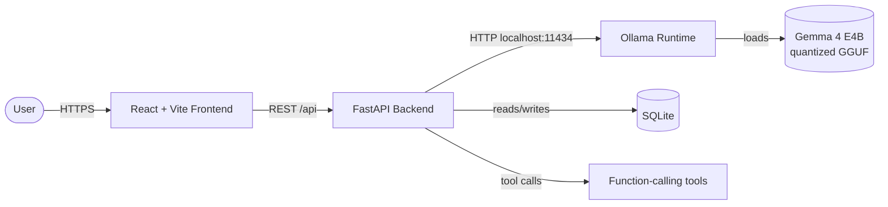

# The World-Class README: A Practical Guide for the Gemma 4 Good Hackathon

A field-tested, publication-ready playbook for writing a README that survives a Google engineer's 60-second skim and a Kaggle hackathon judge's reproducibility check. Synthesizes Google's published documentation standards, structural patterns from flagship Google open-source repos, and the specific submission constraints of the Gemma 4 Good Hackathon (Kaggle × Google DeepMind, deadline May 18, 2026).

> **Note on the prize pool.** The user's brief mentions "up to $80K." The competition's publicly announced total prize pool is **$200,000 USD**, distributed across general, impact-focused, and technical categories. Treat $80K as one possible category top prize; design your README assuming you are competing for the largest tier.

---

## TL;DR

- **Above the fold wins or loses the submission.** A judge decides in roughly 60 seconds whether to keep reading. Put a one-sentence value proposition, a screenshot or GIF, badges, a two-minute video link, and a single `quickstart` command block in the first viewport — everything else is supporting evidence.
- **Google's own published rule for READMEs is short and strict.** Per `google.github.io/styleguide/docguide/READMEs.html`, every package-level README must cover (1) what's in the package and what it's for, (2) points of contact, (3) status, (4) how to use it (with copyable commands and sample code), and (5) links to deeper docs. Google's voice rules add: second person, active voice, imperative mood, conversational-but-not-frivolous tone, no "please," US English, present tense.
- **For the Gemma 4 Good Hackathon specifically, the README must do four jobs at once:** (a) prove a *meaningful* real-world problem in one of the five tracks (Education, Health, Digital Equity, Global Resilience, Safety); (b) make the Gemma 4 integration *technically credible* (size choice, function calling, multimodal use, edge/offline rationale); (c) make the project *reproducible* end-to-end (frontend + backend + Ollama/Gemma 4 weights); and (d) point to the demo video, working hosted demo, and a model/limitations card. Submissions are judged on impact, technical execution, and clarity of use case — your README is the primary surface for all three.

---

## Key Findings

### 1. Google's actual published README standard is minimalist and prescriptive

The canonical source is `google.github.io/styleguide/docguide/READMEs.html` (mirrored at `github.com/google/styleguide/blob/gh-pages/docguide/READMEs.md`). Three rules are non-negotiable:

1. **The file must be named `README.md`** — the `.md` extension is required and case-sensitive (so it renders on both GitHub and Google's internal Gitiles).
2. **It must live at the top level of the codebase**, not inside `/docs`.
3. **It must, at minimum, contain or link to:**
   - What is in this package and what it's used for
   - Points of contact (maintainers/owners)
   - Status (active, deprecated, alpha, not for general release, etc.)
   - How to use the package — *with copyable commands and sample code*
   - Links to user-facing or team-facing documentation

That's the *floor*. Google's broader documentation best-practices doc (`google.github.io/styleguide/docguide/best_practices.html`) frames the README as orientation: it should "orient the new user to the directory and point to more detailed explanation and user guides." The companion `google/new-project` template (the boilerplate Google uses to seed new open-source repos) defaults to Apache 2.0 license, requires Apache headers in every source file, and ships with `docs/contributing.md` from day one.

### 2. Google's voice and tone rules (developers.google.com/style)

These apply to *every* word you write in the README:

| Rule | Recommended | Avoid |
|---|---|---|
| Person | Second person (`you`, `your`) | First person plural (`we`, `our`, `us`) — except sparingly to refer to your team |
| Voice | Active (`Send a query to the service`) | Passive (`A query is sent`) |
| Mood | Imperative for instructions (`Click Submit`, `Run npm install`) | Hedged phrasing (`You should click...`, `You'll need to run...`) |
| Politeness | Direct (`To view the document, click View`) | `please` in instructions |
| Tense | Present | Future (`will be saved`) |
| Tone | Conversational, friendly, respectful, not frivolous | Marketing puff, slang, in-jokes |
| Sentences | Short. One idea per sentence. | Compound, hedging, multi-clause |
| Audience | Address one persona, declared near the top | Switching between developer/sysadmin/end-user |
| Spelling | US English | Mixed UK/US |
| Links | Descriptive link text (`see the installation guide`) | "click here," bare URLs |

The official **Highlights** page (`developers.google.com/style/highlights`) is the single most useful one-page reference. The blog post making the guide public ([Google Developers Blog, Sept 2017](https://developers.googleblog.com/making-the-google-developers-documentation-style-guide-public/)) explicitly frames it as the reference for Kubernetes, AMP, Dart, and other Google-affiliated open-source projects — i.e., it is the implicit standard a Google-judged hackathon will measure you against.

### 3. Patterns shared by flagship Google open-source READMEs

Reviewing the top-level READMEs of `google-deepmind/gemma`, `google/gemma_pytorch`, `google-deepmind/recurrentgemma`, `tensorflow/tensorflow`, `flutter/flutter`, `protocolbuffers/protobuf`, `google/eng-practices`, and `google/new-project`, six patterns recur:

1. **Single-sentence identity statement.** First non-heading line is always a crisp definition: *"TensorFlow is an end-to-end open source platform for machine learning."* / *"Gemma is a family of open-weights Large Language Model (LLM) by Google DeepMind, based on Gemini research and technology."* / *"Protocol Buffers (a.k.a., protobuf) are Google's language-neutral, platform-neutral, extensible mechanism for serializing structured data."*
2. **A minimal copy-pasteable code block within the first 30 lines.** The Gemma repo shows a 10-line `from gemma import gm` snippet that produces output. Protobuf shows a one-line install. Flutter links to a getting-started guide. The pattern: prove it works before explaining how it works.
3. **Status / disclaimer line.** Gemma's README ends with "This is not an official Google product." RecurrentGemma names the architecture, license (Apache 2.0), and Kaggle download path explicitly. Hackathon submissions should imitate this with "Hackathon submission — Gemma 4 Good Hackathon (Kaggle, May 2026)."
4. **License declared in the README itself, not just in a `LICENSE` file.** Apache 2.0 is the Google default and is also the Gemma 4 license — match it unless you have a strong reason not to.
5. **Hardware/runtime requirements stated up front for ML projects.** Gemma's README gives explicit memory floors ("8GB+ RAM on GPU for the 2B checkpoint, 24GB+ RAM on GPU for the 7B checkpoint"). RecurrentGemma ships a hardware-vs-feature compatibility matrix as a table.
6. **Pointers, not encyclopedias.** Google READMEs are short. Long-form material lives in `/docs`, on dedicated documentation sites, or in linked Colabs. The README is a router.

### 4. What Kaggle/Gemma 4 Good Hackathon judges actually need

The Kaggle competition page (`kaggle.com/competitions/gemma-4-good-hackathon`) and supporting coverage establish the hard requirements:

- **Submissions must include:** a working prototype/demo, a public code repository, a technical write-up explaining how Gemma 4 was applied, and a short demonstration video.
- **Tracks:** Future of Education, Health and Sciences, Digital Equity, Global Resilience, and Safety.
- **Judging criteria, weighted heavily on:** impact (does it solve a real problem for real people?), technical execution (is the Gemma 4 use credible and non-trivial?), and communication clarity (can a judge understand the use case quickly?). Practical deployment readiness is favored over architectural complexity.
- **License default:** Apache 2.0 (matching Gemma 4 itself).
- **Models in scope:** E2B, E4B (edge), 26B MoE, 31B Dense — multimodal, native function calling, 128K–256K context. The hackathon explicitly invites edge/offline/privacy-constrained scenarios.
- **Final deadline:** May 18, 2026, 23:59 UTC.

The implication: judges scanning dozens of repos need to determine *in under a minute* (a) what real problem you solve, (b) why Gemma 4 specifically, (c) that it actually runs, and (d) where to watch the video. A README that buries any of these is dead on arrival.

### 5. AI/ML-specific README expectations (model cards, Hugging Face conventions)

The de-facto standard, propagated by Hugging Face and aligned with Google's own Gemma model cards (`ai.google.dev/gemma/docs/core/model_card`, `deepmind.google/models/model-cards/`), expects READMEs of AI projects to include a **model/usage card section** covering:

- **Intended use** (what the system is for, who it's for)
- **Inputs and outputs** (modalities, formats, prompt structure)
- **Model details** (which Gemma 4 variant: E2B/E4B/26B/31B; quantization; context length used; whether thinking mode is on; chat template handling)
- **Hardware requirements** (RAM, VRAM, disk, network)
- **Evaluation/benchmarks** if you ran any (even informal latency or quality checks)
- **Limitations** (where it fails — hallucinations, latency, language support, modality gaps)
- **Ethical considerations and safety** (biases, misuse vectors, mitigations, link to Gemma Prohibited Use Policy and the Responsible Generative AI Toolkit)
- **Privacy posture** (because Gemma 4 enables on-device inference, this is a genuine differentiator — say so explicitly)

Recent academic analysis ([arXiv:2406.18071](https://arxiv.org/html/2406.18071), [arXiv:2507.06014](https://arxiv.org/html/2507.06014v1)) finds that most open-source AI READMEs *underweight* limitations and ethics. Doing this section well is a low-effort, high-signal differentiator for hackathon judges from a company (Google) with strong responsible-AI messaging.

---

## Details

### A. Executive summary of principles

Use these as your editing test. If the README violates any, fix it.

1. **One-sentence test:** A stranger reading only the first sentence understands what your project is and who it's for.
2. **30-second test:** A judge reading only what fits above the fold (roughly the first viewport on github.com) can: name the problem, name the solution, name the user, see the stack, see a screenshot/GIF, find the demo video, and find the quickstart.
3. **Reproducibility test:** Following the README cold on a fresh machine produces a running app. No tribal knowledge. No "and then ask the team." (For local-LLM projects this means: how to install Ollama, how to pull `gemma4:e4b` or `gemma4:26b`, what env vars to set, what ports are used, in what order.)
4. **Google-voice test:** Read the README aloud. If you hear "we provide," "please run," "you'll want to," or "this should work" — rewrite as second person, imperative, active. Replace "we provide a CLI" with "Use the CLI."
5. **Truth-in-advertising test:** Don't claim features you didn't ship. If audio doesn't work yet, say "audio is not supported in this release." Judges respect honest scope; they punish demos that don't match the README.
6. **Maintenance test:** Every command in the README was actually run today. Outdated `npm install` commands, wrong port numbers, and missing env vars are the most common reason judges (and reviewers) give up.
7. **Scannable, not skimmable-only:** Use H2 sections, tables for matrices (model size × hardware), fenced code blocks with language tags, and short paragraphs. Walls of prose lose to bullet lists.
8. **License + status declared on the page itself:** Apache 2.0 is the right default for the Gemma 4 Good Hackathon (matches Gemma 4's license).

### B. Recommended section-by-section template (with rationale)

Below is the structural template. Copy it, then delete what doesn't apply. Sections marked **★** are non-negotiable for this hackathon.

#### B.1 Top of file (above the fold) — *the 30 seconds that matter*

```
<h1 align="center">ProjectName</h1>
<p align="center"><i>One-sentence value proposition. Who it's for. Why it matters.</i></p>

<p align="center">
  <a href="…demo video…"></a>
  <a href="…live demo…"></a>
  
  
  
</p>


```

**Rationale:** This block is what a judge sees first. It must answer four questions in seven seconds: (1) name, (2) what does it do, (3) is it real (badge → live demo, badge → video), (4) is it the right kind of project (badge → hackathon, badge → license). The hero asset is the single biggest determinant of whether the judge keeps scrolling. If you have nothing else, ship a 5–10 second screen-recorded GIF (compressed, < 5 MB).

#### B.2 The problem and the user **★**

A short paragraph (3–6 sentences) that names a *specific* user in a *specific* context with a *specific* pain — and then states what changes when they use your project. Avoid phrases like "leverage AI to empower." Specifics win. Map explicitly to one of the five hackathon tracks (Education / Health / Digital Equity / Global Resilience / Safety). The Medium retrospective on the hackathon makes this point bluntly: judges will reject "fake UIs" and "mocked-up chatbots" — they want a clear pain and a clear payoff.

#### B.3 Demo **★**

```markdown
## Demo

- 📺 **2-minute walkthrough video:** [YouTube link]
- 🌐 **Live web demo:** [URL] — frontend deployed at Vercel/Netlify; backend on …
- 🖼️ **Screenshots:** see [`/docs/screenshots`](docs/screenshots/)
```

Three artifacts is the minimum: video (required by Kaggle rules), live URL (proves the thing runs), screenshots (for judges who don't click). If hosting the full stack publicly is impractical because Gemma 4 weights are large, host the *frontend* publicly, mock the model responses on the demo, and explain in one sentence: "The hosted demo uses recorded model responses; for live Gemma 4 inference, run locally — see Quickstart."

#### B.4 Features (bulleted, scannable)

5–8 bullets, each one verb-led and concrete. Not "powerful," "cutting-edge," "intelligent." Use specifics: "Runs entirely offline once Gemma 4 is pulled (last network access: model download)." "Supports image input via Gemma 4's vision modality (max 1120 visual tokens per image)." "Function-calling tool registry: 4 built-in tools, JSON-schema-validated."

#### B.5 Architecture **★**

A Mermaid diagram is the right choice for a hackathon README: it renders natively on GitHub, lives in version control with the code, and signals technical seriousness. Use the C4 Context level — show user, frontend, backend, Gemma 4 inference layer, and any data store. Example:

````markdown
## Architecture



**Why this stack:** Gemma 4 runs locally via Ollama, so no user data leaves the device. The backend exposes a typed REST API used by the React frontend. Function-calling uses Gemma 4's native tool support.
````

**Rationale:** Mermaid renders inline on GitHub (no extra tooling), survives reviews, and is much easier for judges to scan than prose. Per Google's own engineering practices doc, "If a CL changes how users build, test, interact with, or release code, check that it also updates associated documentation, including READMEs" — a diagram makes architectural changes reviewable in PRs.

#### B.6 Tech stack table

A two-column table is denser than prose: `Layer | Technology`. List frontend framework, backend framework, model runtime (Ollama / llama.cpp / vLLM / Transformers), model variant (e.g., `gemma4:e4b` or `gemma-4-26b-a4b-it`), database, deployment target, key libraries.

#### B.7 Quickstart **★** (the Google-mandated "How to use" section)

This is the most important section for reproducibility. Structure it as a numbered procedure (Google style: imperative, second person, present tense). For a full-stack monorepo with Gemma 4 via Ollama, the canonical structure is:

````markdown
## Quickstart

### Prerequisites
- Node.js ≥ 20
- Python ≥ 3.11
- [Ollama](https://ollama.com) (for local Gemma 4 inference)
- ~10 GB free disk for Gemma 4 E4B weights, or ~18 GB for 26B MoE
- 8 GB RAM minimum (E4B) / 20 GB+ RAM (26B MoE)

### 1. Clone and install
```bash
git clone https://github.com/<you>/<repo>.git
cd <repo>
npm install               # installs frontend + backend workspaces
```

### 2. Pull the Gemma 4 model
```bash
ollama pull gemma4:e4b    # default; 4.5B effective params, 128K context
# OR for higher quality:
# ollama pull gemma4:26b  # 26B MoE, 256K context, needs 20 GB+ RAM
```

### 3. Configure environment
```bash
cp .env.example .env
# Edit .env — see "Configuration" below for variable reference
```

### 4. Run
```bash
npm run dev               # starts frontend on :5173 and backend on :8000
```

Open http://localhost:5173 and you should see the welcome screen within ~10 seconds.
````

**Rationale:** Numbered, imperative steps with copy-pasteable code blocks satisfy the Google style guide *and* maximize reproducibility. The hardware requirements line front-loads the most common reason setup fails. The model-pull step explicitly references `gemma4:e4b` as the default — judges should not have to guess which size you used.

#### B.8 Configuration

A single table of every environment variable: `Variable | Required | Default | Description`. Ship a `.env.example` file in the repo. Never document a secret; never commit a real `.env`.

#### B.9 Project structure

A short ASCII tree of the top two levels only. For a monorepo:

```
.
├── frontend/        # React + Vite UI
├── backend/         # FastAPI server, Gemma 4 client
├── model/           # Gemma 4 prompts, function schemas, evals
├── docs/            # Architecture notes, screenshots, model card
├── scripts/         # Setup, eval, deployment helpers
├── .env.example
├── LICENSE          # Apache 2.0
└── README.md
```

#### B.10 How Gemma 4 is used **★** (hackathon-specific)

This is the section a Google judge will read most carefully. Cover, in order:

- **Variant chosen and why** (E2B/E4B/26B/31B; tradeoff rationale: edge constraint, latency, quality, memory)
- **Inference path** (Ollama / llama.cpp / Transformers / Hugging Face Inference Endpoint / Google AI Studio / Kaggle Models)
- **Multimodal use** (text only / + image / + audio — and which code path)
- **Function calling** (list the tools you registered, link to JSON schemas)
- **Thinking mode** (on or off, why)
- **Prompt strategy** (system prompt — quote it or link the file; chain-of-thought / few-shot / RAG / fine-tuning)
- **Context window usage** (how much of the 128K/256K you actually consume)
- **Sampling configuration** (temperature, top_p, top_k — match Gemma 4's recommended defaults unless you have a reason)
- **Latency and resource numbers** (tokens/sec on your test hardware, p95 round-trip)

Doing this section well is the single biggest signal of technical credibility. The Medium retrospective on the hackathon explicitly warns: "If you want to do well, you cannot treat Gemma 4 like a random backend model."

#### B.11 Model card / responsible AI

A short card-style block (Hugging Face convention) covering: intended use, out-of-scope use, known limitations, safety mitigations, evaluation methodology, and a link to Google's Gemma Prohibited Use Policy and the Responsible Generative AI Toolkit. For a hackathon, 150–300 words is enough; longer goes in `docs/MODEL_CARD.md`.

#### B.12 Testing

How to run the test suite — frontend (`npm test`), backend (`pytest`), and any model-quality evals you ran. If you have no tests, say so and explain why (time constraint) rather than hiding it. Judges respect candor.

#### B.13 Deployment

A short paragraph + diagram of how the live demo is hosted. If the backend requires a GPU and you couldn't host it publicly, *say so explicitly* and provide a one-command Docker Compose or a Modal/Replicate config that reproduces the deployment.

#### B.14 Roadmap / known limitations

A 3–5 bullet list. This is where you preempt judge questions. ("Currently text-only — image input planned for v2." "26B MoE recommended; E4B works but quality drops on multi-step reasoning." "Latency on CPU is 8–12 tok/s; acceptable for chat, not for streaming.")

#### B.15 Team / acknowledgments

Names, roles, links. Acknowledge Gemma 4, Google DeepMind, Kaggle, and any libraries you depend on heavily.

#### B.16 License **★**

```markdown
## License

Released under the [Apache License 2.0](LICENSE). Gemma 4 is also Apache 2.0;
weights remain subject to Google's [Gemma Terms of Use](https://ai.google.dev/gemma/terms)
and [Prohibited Use Policy](https://ai.google.dev/gemma/prohibited_use_policy).
```

#### B.17 Citation / footer

For an AI project, include a BibTeX-style citation (or a "How to cite this work" block) — a small touch that signals professionalism. End with the disclaimer pattern Google uses on its own DeepMind repos: "This is not an official Google product. Submitted to the Gemma 4 Good Hackathon (Kaggle, 2026)."

### C. Google-specific style and tone guidance — the editing pass

After drafting, run these find-and-replace passes:

| Find | Replace with | Reason |
|---|---|---|
| `we provide` / `we built` | `This project provides` / restructure to put the action first | Avoid first person |
| `please run` / `please install` | `Run` / `Install` | No "please" in instructions |
| `you'll need to` / `you should` | imperative verb | Hedging |
| `is configured by` / `gets set` | active voice | Passive |
| `click here` | descriptive link text | Accessibility + SEO |
| `simple` / `easy` / `just` | delete | Condescending; nothing is "just" anything |
| `cutting-edge` / `state-of-the-art` / `powerful` | concrete capability | Marketing puff |
| `etc.` | finish the list, or use "such as X, Y, Z" | Vagueness |
| Future tense (`will save`) | present (`saves`) | Google convention |

Two specific Google conventions worth knowing:

- **Capitalize the established convention.** `README.md` is all-caps because that's the historical convention; Google's style guide explicitly says to keep it that way.
- **Prefer fenced code blocks with language tags** (```` ```bash ```` not 4-space indents). Google's Markdown style guide makes this explicit because it enables syntax highlighting and avoids ambiguous block boundaries.

### D. Hackathon-specific tactical advice

1. **The README is read alongside the video, not instead of it.** Assume a judge watches the 2-minute video first, then opens the repo to verify reproducibility. Your README's job is to make the verification fast: copy-pasteable commands, exact model tags, env var matrix, a single architecture diagram.
2. **Lead with the user, not the model.** Open with the problem and the user, not "We use Gemma 4 26B MoE with thinking mode and function calling." The model details belong in section B.10.
3. **Show, don't claim, "real-world impact."** A screenshot of an actual user (a teacher, a clinician, a community health worker) in a real workflow beats a dashboard mock. If you can't get one, a 30-second user-walkthrough GIF works.
4. **Make the "why Gemma 4 specifically" argument explicit.** The hackathon is fundamentally about open weights, on-device inference, privacy, and edge deployment. If your project would work just as well calling GPT-4o, judges will notice. Spell out the offline / privacy / cost / edge angle in one paragraph.
5. **Match the tone of `google-deepmind/gemma`.** Brief, code-first, declarative. End with "This is not an official Google product." (or the hackathon-equivalent disclaimer). It signals you've actually read Google repos.
6. **Reproducibility is the cheapest way to look senior.** Most hackathon submissions break on `npm install` or have undocumented env vars. A README that runs cleanly on a fresh machine puts you in the top 10%.
7. **Don't over-engineer the README.** 600–1500 lines is fine for a top hackathon submission; 3000+ is a red flag. Push deep content into `docs/`.
8. **Apache 2.0 is the default; don't pick something exotic.** Gemma 4 itself is Apache 2.0; your project should be too unless you have a strong reason.
9. **Reference the competition explicitly.** A small line like *"Submission to the [Gemma 4 Good Hackathon](https://www.kaggle.com/competitions/gemma-4-good-hackathon) — Track: Health and Sciences"* helps judges contextualize quickly.
10. **Have a teammate run the README cold.** If they can't get to the running app in under 10 minutes from a clean clone, the README isn't ready.

### E. AI/ML documentation specifics for the Gemma 4 context

The Gemma 4 family (E2B, E4B, 26B MoE, 31B Dense) and its Ollama integration give you specific things to document well. In addition to the model-card section in B.11, include:

- **Exact model tag and quantization.** `ollama pull gemma4:e4b` is not the same as `gemma4:26b`. Name it.
- **Chat template handling.** Gemma 4 introduces native system prompts and uses `<|think|>` for thinking mode. If you use the Ollama `/api/chat` endpoint, the template is handled for you — say so. If you call the model directly through Transformers, document the template explicitly.
- **Function-calling schemas.** Commit them to the repo as JSON files, link to them. Gemma 4 has native tool use; demonstrating you exercise it is a strong technical signal.
- **Evals, even informal ones.** A 50-prompt internal eval set with pass/fail counts is more credible than vague "works well" claims. A small markdown table is enough.
- **Prompt versions.** If you iterate on the system prompt, version it (`v1`, `v2`) in the repo and note which version the demo video uses.
- **Multimodal token budget.** For image inputs, Gemma 4 supports configurable visual token budgets (70/140/280/560/1120). Document which you use and why (lower = faster; higher = better OCR/chart understanding).
- **Hardware floor for the demo.** A line like *"Tested on M2 Pro (16 GB unified memory) at 22 tok/s on `gemma4:e4b`"* anchors expectations.

### F. Concrete checklist (use this as your final gate)

Above the fold:
- [ ] Project name as H1
- [ ] One-sentence value proposition
- [ ] Hero screenshot or GIF (≤ 5 MB, in `docs/img/`)
- [ ] Badges: license, hackathon, demo video, live demo, build status (if CI exists)
- [ ] Link to 2-minute video in the first viewport

Required sections:
- [ ] Problem + user + which hackathon track
- [ ] Demo (video + live URL + screenshots)
- [ ] Features (5–8 concrete bullets)
- [ ] Architecture diagram (Mermaid, renders on GitHub)
- [ ] Tech stack table
- [ ] Quickstart (numbered, imperative, copy-pasteable, ≤ 5 commands)
- [ ] Configuration (.env table)
- [ ] How Gemma 4 is used (variant, prompts, tools, thinking mode, hardware)
- [ ] Model card / responsible AI block
- [ ] Project structure tree
- [ ] Testing instructions
- [ ] Roadmap / known limitations
- [ ] Team / acknowledgments
- [ ] License (Apache 2.0)
- [ ] Disclaimer ("Hackathon submission. Not an official Google product.")

Repo hygiene:
- [ ] `LICENSE` file present (Apache 2.0)
- [ ] `.env.example` present, no real secrets committed
- [ ] `CONTRIBUTING.md` (even if just "This is a hackathon submission; not accepting external PRs until after judging")
- [ ] Source headers on code files (Apache header — Google's convention)
- [ ] `docs/MODEL_CARD.md` for longer responsible-AI content
- [ ] Video uploaded publicly (YouTube unlisted is fine)
- [ ] Repo set to public

Voice and style pass:
- [ ] Second person throughout (`you`, not `we`)
- [ ] Imperative for instructions
- [ ] Active voice
- [ ] No "please," "just," "simply," "easy"
- [ ] Present tense
- [ ] Short sentences, scannable structure
- [ ] All links have descriptive text
- [ ] Every command was actually run today on a fresh checkout
- [ ] Spelled in US English

The 30-second skim test:
- [ ] Without scrolling past viewport 1, a stranger can name the problem, the user, the stack, and find the demo

The reproducibility test:
- [ ] A teammate cloned the repo on a clean machine and reached the running app in ≤ 10 minutes

### G. Exemplar READMEs to study (and what to steal from each)

| Repository | What to learn from it |
|---|---|
| `github.com/google-deepmind/gemma` | The canonical Gemma README. Steal: brief description, immediate code snippet, hardware floor, "not an official Google product" disclaimer. |
| `github.com/google-deepmind/recurrentgemma` | The hardware-vs-feature compatibility table. Apt for documenting which Gemma 4 sizes work on which judging hardware. |
| `github.com/google/gemma_pytorch` | Multiple installation paths (Docker / pip / source) cleanly separated, with explicit command blocks. |
| `github.com/google/new-project` | The official Google open-source repo template — Apache 2.0 header pattern, `docs/contributing.md` location, structure expectations. |
| `github.com/tensorflow/tensorflow` | Pattern for projects that span many platforms: install pointer + community + governance signals. |
| `github.com/flutter/flutter` | Strong opening pitch + value-proposition framing for end-user-facing projects. |
| `github.com/protocolbuffers/protobuf` | Crisp identity sentence; tight, focused install instructions; explicit guidance on supported releases vs. HEAD. |
| `github.com/google/eng-practices` | Google's own engineering-practices doc — internalize the section ordering, glossary placement, and the "this is what we look for" style. |
| `google.github.io/styleguide/docguide/READMEs.html` | The actual rule. Re-read it before publishing. |
| `developers.google.com/style/highlights` | The voice and tone one-pager — print it and put it next to your monitor. |
| `huggingface.co/google/gemma-4-E4B` | The Gemma 4 model card itself — ideal source for limitations, ethical considerations, and intended-use phrasing you can adapt (with attribution). |
| `github.com/matiassingers/awesome-readme` | A curated catalog of standout READMEs from the wider OSS world — useful for visual-design ideas (badges, hero layouts, table-of-contents patterns). |

---

## Caveats

- **Prize-pool figure.** The user brief states "$80K"; the publicly announced total prize pool for the Gemma 4 Good Hackathon is **$200,000 USD** across multiple categories. The $80K figure is plausible as a single top-prize tier but is not the total. Treat the $200K as the authoritative figure when calibrating effort.
- **Hackathon page is gated.** `kaggle.com/competitions/gemma-4-good-hackathon` requires Kaggle login to read full rules; the requirements above are reconstructed from secondary coverage (EdTech Innovation Hub, The Inner Detail, Algo Mania, the Kaggle Twitter/X announcement, and a public participant submission template at `github.com/johnsonhk88/Kaggle-The-Gemma-4-Good-Hackathon`). Re-read the official rules on Kaggle before submitting; rule details (eligibility, IP, video duration limits, judging weights) take precedence over this guide if they conflict.
- **Some "Gemma 4" coverage is recent and partly speculative.** The model family was announced April 2, 2026; some third-party blog posts about Gemma 4 + Ollama / LM Studio / WebGPU integrations were written within days of release and may contain minor inaccuracies (model tag spellings, exact memory floors). Cross-check specifics against the official Gemma model card on Hugging Face (`huggingface.co/google/gemma-4-E4B`) and the Ollama library page (`ollama.com/library/gemma4`) before quoting numbers in your README.
- **Google's style guide is not law.** It is the *editorial* standard Google uses for its own developer docs. Following it is a strong signal to a Google-affiliated judge, but rigid adherence is less important than clarity, accuracy, and reproducibility. If a project-specific convention conflicts with the Google guide, the Google guide itself recommends following the project-specific convention first.
- **README length is a tradeoff.** Hackathon judges have limited time, but reproducibility requires detail. The resolution is structural: short top section (above the fold), required sections in the middle, and deep material pushed into `docs/`. A README that is too short hides important information; one that is too long is unread. Aim for a length where every H2 section is justified by a real reader need.
- **Generative AI documentation norms are still evolving.** Recent academic work (arXiv:2406.18071, arXiv:2507.06014) finds that most open-source AI READMEs underweight ethical considerations and limitations. Treating this as an *opportunity to differentiate* — rather than a checkbox — is a defensible interpretation but not yet a settled industry standard.