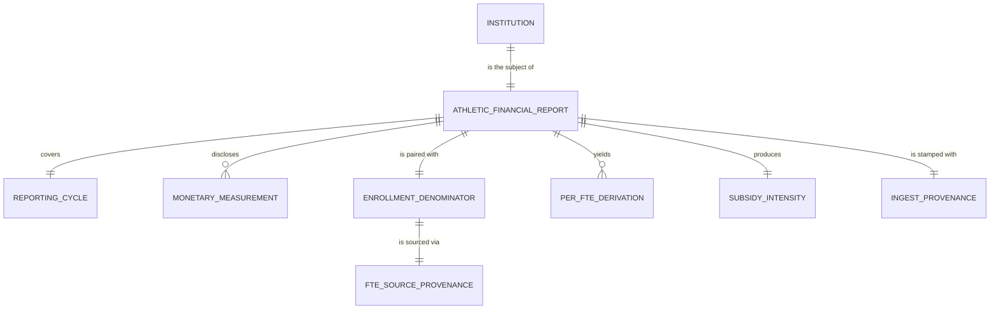

# Conceptual Model: base-eada

**Status:** PROPOSED
**Mode:** Greenfield
**Zone:** Silver (Base)
**Domain:** U.S. higher-education intercollegiate athletics financial reporting (Equity in Athletics Disclosure Act, §485g HEA)
**Spec:** [docs/specs/full-pipeline-eada.md](../../docs/specs/full-pipeline-eada.md) §5 (Option-C amendment, 2026-04-30)
**Bronze conceptual model:** [raw-eada-conceptual.md](raw-eada-conceptual.md)
**Author:** @doc-generator
**Date:** 2026-04-30
**Approval:** Pending human review (REQUIRE_HUMAN_APPROVAL = true)

---

---

## Entity Descriptions

| Entity | Business Concept | Business Term | Is CDE | Is PII |
|--------|-----------------|---------------|--------|--------|
| Institution | A U.S. postsecondary institution that operates intercollegiate athletics and is mandated to file an EADA disclosure under §485g HEA. Identified by the IPEDS UNITID — the canonical key joining EADA to every other institution-keyed table in the FutureProof graph. | BT-001 (UNITID), BT-002 (Institution Name) | true (UNITID) | false |
| Athletic Financial Report | The institution-level row in the EADA Athletics Disclosure Survey for a single academic reporting cycle, promoted 1:1 from Bronze to Base with Option-C FTE enrichment and three per-FTE derivations layered in. | (proposed) BT-119 — Athletic Financial Report | false | false |
| Reporting Cycle | The academic year (Jul–Jun) the report covers. Carried forward verbatim from Bronze (`reporting_year=2022` in the current load). Single-vintage invariant inherited from RAW-EAD-010. | (proposed) BT-120 — EADA Reporting Cycle | false | false |
| Monetary Measurement | A dollar-denominated grand-total disclosed on the report — `total_athletic_expenses`, `total_athletic_revenue`, or `recruiting_expenses`. Carried forward verbatim from Bronze as the *numerator inputs* for the per-FTE derivations and the subsidy-ratio derivation. | (proposed) BT-EAD-ATHLETIC-SUBSIDY-RATIO is downstream of two of these | false at Base (the analytical CDE flag is on the per-FTE derivation, not the raw input — see Per-FTE Derivation below) | false |
| Enrollment Denominator | The 12-month total full-time-equivalent enrollment (`total_fte_enrollment`). **Hybrid in this zone (Option-C amendment):** preferred from `base.ipeds_finance.total_fte_enrollment` (annualized FTE) and falling back to `bronze.eada.eada_fte_headcount` (12-month headcount, EADA's in-file `EFTotalCount`). NULL only when both sources are missing — observed `'none'` rate is < 1% (BSE-EAD-009 P0). The two FTE definitions are **not identical**, which is why FTE Source Provenance (next entity) is first-class. | (proposed) BT-IPF-PER-FTE (the convention; this column is the denominator) | true (universal denominator for every per-FTE derivation; downstream coverage trip-wire) | false |
| FTE Source Provenance | An explicit per-row stamp recording **which** FTE source produced the denominator value: `'ipeds_finance'` (preferred — annualized), `'eada_fte_headcount'` (fallback — 12-month headcount), or `'none'` (both sources missing). Two boolean coverage flags (`has_ipeds_finance_fte`, `has_eada_fte`) carry the per-source presence. This entity exists because the two FTE definitions are methodologically different — Knight Commission's per-FTE athletic-spend benchmarks already use EADA's `EFTotalCount`, so the fallback is analytically defensible — but downstream consumers who require methodological homogeneity must be able to filter or stratify on source. The provenance columns make that decision tractable. | (methodological provenance, not a business term — see §6 of this document) | true (the `fte_source` column IS the cross-source-mix governance signal; BSE-EAD-013 P0 asserts the IPEDS-preference invariant against it) | false |
| Per-FTE Derivation | A per-student normalization of one of the three monetary measurements: `athletic_spend_per_fte`, `athletic_revenue_per_fte`, `recruiting_per_fte`. Computed in Silver as `measurement / total_fte_enrollment`. NULL when either operand is NULL or `total_fte_enrollment ≤ 0`. **No imputation.** Each derivation inherits the `fte_source` of its denominator. The BSE-EAD-008 arithmetic invariant pins computation correctness at rest (`spend_per_fte × fte ≈ expenses` within $1). | (proposed) BT-IPF-PER-FTE | true (`athletic_spend_per_fte` is the EADA-side aura input per spec §6 Decision 11; the other two are context columns) | false |
| Subsidy Intensity | The institution-level athletic subsidy ratio, `(total_athletic_expenses − total_athletic_revenue) / NULLIF(total_athletic_expenses, 0)`. Independent of FTE source. Positive = subsidized (revenue < expenses); near 0 = self-sustaining; negative = profitable. **Domain caveat:** EADA convention requires reported revenue ≥ expense at the grand-total grain (deficits are booked as a separate `direct_institutional_support` field which we do not ingest), so the empirical distribution is bunched at zero — observed P5=−0.157 / P50=0.0 / P95=0.0 / min=−2.92 / max=0.0 (BSE-EAD-007 calibrated to `[-3.0, 1.0]`, BSE-EAD-010 calibrated to `P50==0 ∧ P5<0 ∧ P95==0`). | (proposed) BT-EAD-ATHLETIC-SUBSIDY-RATIO | true (consumable CDE per spec §6 amendment; carried as a context column on `consumable.institution_aura` but **not** an aura_score input per Decision 11) | false |
| Ingest Provenance | The pipeline-stamped record of where each Base row came from: `source_load_date` (passthrough of the Bronze `load_date`) and `ingested_at` (the Base promotion timestamp). Required on every Base row by the Brightsmith governance contract. | — | false | false |

---

## Relationship Descriptions

| Relationship | From | To | Cardinality | Description |
|-------------|------|-----|-------------|-------------|
| is the subject of | Institution | Athletic Financial Report | one-to-one (per cycle) | Every institution that operates intercollegiate athletics submits exactly one institution-totals report per reporting cycle. The Base table is loaded for one cycle at a time, so the relationship is functionally one-to-one within a single load. |
| covers | Athletic Financial Report | Reporting Cycle | many-to-one | Multiple institutions' reports cover the same academic year. Current load covers `reporting_year=2022` (the 2022–23 cycle). Single-vintage invariant inherited from Bronze (RAW-EAD-010 P0). |
| discloses | Athletic Financial Report | Monetary Measurement | one-to-many (3 measurements) | Each report carries the three Bronze monetary fields verbatim — institution-grand-total expenses, revenue, and recruiting. All three are USD; all three reach a downstream derivation. 100% non-null in the 2022–23 cycle. |
| is paired with | Athletic Financial Report | Enrollment Denominator | one-to-one (NULL-allowed; < 1%) | Every report is paired with an FTE denominator via the §5 Option-C COALESCE. 100% of reports have a pairing attempted; the `'none'` residual is bounded by BSE-EAD-009 (P0, ≤ 1%). The 55 NULL rows would NULL-cascade through every per-FTE derivation, but Option-C raises hybrid coverage from 74.5% (IPEDS-only) to ~99.99%. |
| is sourced via | Enrollment Denominator | FTE Source Provenance | one-to-one | Every non-NULL FTE value carries an explicit source stamp: `'ipeds_finance'` for the preferred annualized path, `'eada_fte_headcount'` for the 12-month-headcount fallback. NULL FTE rows stamp `'none'`. **Distribution observed:** ipeds_finance ~74.5% / eada_fte_headcount ~25.5% / none < 1% (BSE-EAD-011 P1, ±5pp tolerance). The IPEDS-preference invariant (BSE-EAD-013 P0) asserts that every UNITID present in `base.ipeds_finance` with a non-null FTE stamps `'ipeds_finance'` — catches partial silent LEFT-JOIN failures. |
| yields | Athletic Financial Report | Per-FTE Derivation | one-to-many (3 derivations) | Each report yields three per-FTE derivations: `athletic_spend_per_fte`, `athletic_revenue_per_fte`, `recruiting_per_fte`. Each is a pure division of one Bronze numerator by the COALESCE'd FTE denominator, computed in Base for the first time. The arithmetic invariant BSE-EAD-008 (`spend_per_fte × fte ≈ expenses` within $1) pins correctness. Each derivation inherits the `fte_source` of its denominator — downstream consumers who want methodological homogeneity can filter on `fte_source = 'ipeds_finance'`. |
| produces | Athletic Financial Report | Subsidy Intensity | one-to-one (NULL-allowed) | Each report produces exactly one `athletic_subsidy_ratio` value (or NULL when either monetary operand is NULL or expenses is exactly 0). Independent of FTE source. The OPE/EADA ledger convention bunches the empirical distribution at zero — see the entity description for the recalibrated DQ thresholds. |
| is stamped with | Athletic Financial Report | Ingest Provenance | one-to-one | Every Base row carries `source_load_date` (from Bronze) plus a fresh `ingested_at` Base-promotion timestamp. Both are required at the Iceberg level. |

---

## Key Business Concepts

### Grain

The fundamental unit is **one institution in a single EADA reporting cycle**. The current Base load (2022–23 cycle) has **2,040 rows** — exactly the same row count as Bronze (BSE-EAD-001 P0 conservation invariant). Grain is enforced by BSE-EAD-002 (`unitid` uniqueness, P0) and the dedup grain `[unitid]`. Per spec §5, the deterministic record_id is computed via `compute_grain_id(row, ['unitid'], prefix='ead')`.

### Promotion Pattern

This Base zone is a **1:1 shaping promote** with cross-source FTE enrichment. Of the 18 Base columns:

- **6 are passthroughs** from `bronze.eada` (`unitid`, `institution_name`, `reporting_year`, `total_athletic_expenses`, `total_athletic_revenue`, `recruiting_expenses`, `eada_fte_headcount`) — landed verbatim with no rescaling, no rounding, and no NULL-substitution.
- **1 is the COALESCE'd hybrid** (`total_fte_enrollment`) — sourced from `base.ipeds_finance.total_fte_enrollment` (preferred) or `bronze.eada.eada_fte_headcount` (fallback) per the Option-C rule.
- **3 are FTE-source provenance** (`fte_source`, `has_ipeds_finance_fte`, `has_eada_fte`) — newly minted in Base; surface the methodological mix.
- **4 are derivations** (`athletic_spend_per_fte`, `athletic_revenue_per_fte`, `recruiting_per_fte`, `athletic_subsidy_ratio`) — pure arithmetic on Bronze numerators and the COALESCE'd denominator (or, for the subsidy ratio, on two Bronze numerators).
- **2 are provenance** (`source_load_date`, `ingested_at`) — the Bronze load_date passthrough and the Base promotion timestamp.
- **1 is the deterministic surrogate key** (`record_id`) — the SHA-256-based grain ID with prefix `ead`.

This shape — passthrough numerators and the FTE denominator alongside their derivations — is deliberate: every per-FTE rate downstream is auditable against the source dollar value and the chosen denominator in the same row, and the BSE-EAD-008 arithmetic invariant enforces that at rest.

### Why Option-C COALESCE, Not Single-Source IPEDS-Finance FTE

The original spec used `base.ipeds_finance.total_fte_enrollment` as the sole FTE source. EDA found that path covered only **74.5%** of EADA institutions (1,519 / 2,040), NULL-ing per-FTE derivations for the **521 institutions** missing from IPEDS Finance — predominantly 2-year colleges (NJCAA / CCCAA / NWAC / NCCAA / USCAA). That left a quarter of EADA reporters with NULL `aura_score` downstream, defeating the purpose of widening the addressable surface.

The §5 Option-C amendment (2026-04-30) adopted a hybrid: **prefer** IPEDS-Finance FTE (annualized; the project standard) and **fall back** to EADA's in-file `EFTotalCount` (12-month headcount; available on every EADA row). The fallback is methodologically defensible — Knight Commission's per-FTE athletic-spend benchmarks already use `EFTotalCount` — but the two definitions are **not** identical, so the `fte_source` column makes the methodological mix explicit at the row level. Hybrid coverage: ~99.99% (residual `'none'` < 1%).

The trade-off is documented at the conceptual level via the FTE Source Provenance entity: downstream consumers who require methodological homogeneity can filter on `fte_source = 'ipeds_finance'` and accept the 74.5% coverage; consumers who want maximum coverage at the cost of a methodological mix can use the COALESCE'd value as-is. Both choices are auditable from the same row.

### Why Per-FTE Derivations Live in Base, Not Consumable

Per-FTE rates are the **canonical institution-scale athletic-finance signal**. Carrying the raw dollar values without per-FTE normalization would force every downstream consumer (the `consumable.institution_aura` fusion, future receipts/comparison specs) to repeat the same division — risking formula drift and re-introducing the FTE-vs-headcount source-selection bug at every read site. Computing per-FTE once in Base, with the chosen denominator and its provenance present in the same row, is the single source of truth for institution-scale athletic-finance comparison.

The placement is also consistent with the sibling pattern from `base.ipeds_finance` — the three IPEDS per-FTE derivations and `marketing_ratio` live there for the same reason.

### Why Subsidy Ratio Lives in Base, Not Consumable

The athletic-subsidy ratio is a cross-field derivation that does not depend on FTE. It could plausibly live anywhere from Base to Consumable. Placing it in Base alongside the per-FTE values is the right call because:

- It is mechanically deterministic from two Bronze fields (no judgment).
- It is computable on rows where FTE is NULL (broader coverage than per-FTE values).
- The downstream `consumable.institution_aura` carries it as a context column (not an aura input — see spec §2 Decision 11), and a consumable context column should pull from a Base column, not be re-derived inline at the consumable promote.

### NULL Semantics — No Imputation

All derivations follow the no-substitution rule per spec §2 Decision #8 and the standing user constraint:

- Per-FTE values are NULL when either the numerator is NULL or `total_fte_enrollment ≤ 0`.
- `athletic_subsidy_ratio` is NULL when either monetary operand is NULL or `total_athletic_expenses = 0`.
- The COALESCE'd FTE denominator is NULL only when **both** IPEDS-Finance and EADA-headcount sources are missing (`fte_source = 'none'`, < 1%).
- No imputation, no fallback values, no sentinel substitutes. Missing data stays missing through the entire pipeline.

### The OPE/EADA Ledger Convention and the Subsidy Distribution

EADA convention requires reported revenue ≥ expense at the grand-total grain — institutions book any operating deficit as `direct_institutional_support` (a separate column we do **not** ingest). The empirical effect at the institution-grand-total grain is that **~63% of rows have revenue exactly equal to expenses** and **0% of rows have revenue < expenses**. The `athletic_subsidy_ratio` distribution is therefore bunched at zero (P5 = −0.157, P50 = 0.0, P95 = 0.0, max = 0.0, min = −2.92). The original spec said "P50 > 0 (most athletic programs lose money)" — empirically falsified during silver-EDA on 2026-04-30.

This is **not** a data defect. It is a structural feature of the federal disclosure convention. BSE-EAD-007 (calibrated `[-3.0, 1.0]`) and BSE-EAD-010 (calibrated `P50==0 ∧ P5<0 ∧ P95==0`) reflect the recalibrated empirical distribution. The four institutions with strongly negative ratios (Binghamton −2.92, Haskell Indian Nations −2.56, Kennedy-King −1.57, Rust College −1.43) reflect institutional-transfer accounting and are not data defects per fp-data-reviewer §7.

The "athletics loses money" intuition needs the unbundled `direct_institutional_support` field — out of scope for this Bronze ingest. Flag for any future spec amendment that wants the subsidy signal to behave intuitively.

---

## Cross-Source Integration Role

`base.eada` is the single-row-per-institution athletics-finance fact table. It joins downstream into the FutureProof graph at exactly one point in this spec:

| Consumer | Join Key | Role |
|----------|----------|------|
| `consumable.institution_aura` | `unitid` (via FULL OUTER JOIN against `base.ipeds_finance`) | Athletic-side input to the `aura_score` composite (specifically `athletic_spend_per_fte` per Decision 11); also carries `athletic_revenue_per_fte` and `athletic_subsidy_ratio` as context columns; surfaces `athletic_fte_source` so downstream consumers can stratify on FTE methodology |

UNITID overlap with `base.ipeds_finance` is **74.5%** (1,519 / 2,040) — the exact figure that calibrates BSE-EAD-011 (`fte_source = 'ipeds_finance'` rate ≈ 74.5%, ±5pp). The 25.5% of EADA reporters without an IPEDS-Finance FTE row fall through to `eada_fte_headcount` and are still per-FTE-derivable.

---

## Modeling Decisions

1. **`Institution` and `Athletic Financial Report` carried unchanged from Bronze.** Same as the IPEDS-Finance Base layer: the grain, the natural key, and the cycle scoping are all the same as Bronze. The Base zone does not change what an institution-cycle row *is* — it adds derivations and a hybrid denominator.

2. **`FTE Source Provenance` modeled as a first-class entity, not buried as three free-floating attributes.** The §5 Option-C amendment introduces a methodological mix that the conceptual model must surface explicitly. Treating `fte_source` / `has_ipeds_finance_fte` / `has_eada_fte` as one entity (a) makes the cross-source-mix decision visible at the conceptual level, (b) anchors the BSE-EAD-009/011/012/013 family of governance rules to a single concept, and (c) signals to downstream consumers that the FTE column carries a methodological tag, not just a number.

3. **`Enrollment Denominator` modeled as one-to-one with `Athletic Financial Report`, with NULL allowed.** The COALESCE produces at most one FTE per row. The NULL case (both sources missing) is bounded by BSE-EAD-009 (≤ 1%) and is honest data — those institutions are unusable for per-FTE comparison even if their dollar fields are populated.

4. **`Per-FTE Derivation` modeled as a first-class entity, separate from `Monetary Measurement`.** Although each per-FTE value is mechanically derived from exactly one monetary measurement plus the FTE denominator, treating them as a distinct entity makes three things explicit at the conceptual level: (a) the derivation is *new* in this zone (not a Bronze passthrough), (b) the per-FTE value is the canonical institution-scale comparison signal (not the raw dollar), and (c) each derivation inherits the `fte_source` of its denominator — a property the raw dollar does not have.

5. **`Subsidy Intensity` modeled as its own entity, not folded into `Per-FTE Derivation`.** The subsidy ratio is *not* a per-FTE rate — it is a cross-field ratio with no enrollment dependency. Folding it into `Per-FTE Derivation` would mis-state the dependency graph (it doesn't need FTE) and would conflate two structurally different kinds of derived signals. This mirrors the `base.ipeds_finance` decision to separate `marketing_ratio` from the per-FTE family.

6. **`Monetary Measurement` retains its Bronze CDE-flag posture (`unitid` CDE; the three monetary fields are CDE at Bronze per the upstream-feeder lens, but the *analytical* CDE flag at Base lives on the per-FTE derivation, not the raw input).** This is the same pattern used at `base.ipeds_finance`. Downstream consumers compare per-FTE rates across institutions; the raw dollars are operational/audit fields at this zone.

7. **Provenance extended with `source_load_date` from Bronze.** Same pattern as `base.ipeds_finance` — preserves the original Bronze ingest date so downstream freshness DQ can reach it after multiple Silver/Gold promotion timestamps stack up.

8. **No new entities for `coverage_tier`.** That signal is a Gold-zone synthesis of multiple Base fields and lives in the `consumable.institution_aura` model, not here. Base is where the *inputs* live; Consumable is where the *summary* lives. The two boolean coverage flags (`has_ipeds_finance_fte`, `has_eada_fte`) at Base are precursors to (not substitutes for) the Gold-zone coverage tier.

9. **No SCD2; no history.** Same as Bronze: single-cycle snapshot, full-table replacement on cycle refresh. Future multi-cycle backfill would require partitioning on `reporting_year` and extending the dedup grain to `[unitid, reporting_year]`.

---

## Scope and Boundaries

- This conceptual model covers the `base.eada` Iceberg table only.
- Bronze raw data (`bronze.eada`) is the source for six passthrough columns and one COALESCE fallback; it is fully modeled in `raw-eada-conceptual.md`.
- The cross-source IPEDS-Finance LEFT-JOIN source (`base.ipeds_finance.total_fte_enrollment`) is consumed here but is fully modeled in `base-ipeds-finance-conceptual.md`.
- The downstream Gold fusion (`consumable.institution_aura`) is a downstream consumer, not part of this model. It will be modeled in `consumable-institution-aura-conceptual.md` once the aura-score EDA finalizes the formula.
- No imputation, no substitution. Standing user constraints re-affirmed.
- PII: None. EADA is institution-level disclosure by design; no individual identifiers are present (confirmed by `governance/pii-scans/base-eada-pii-scan.md`).
