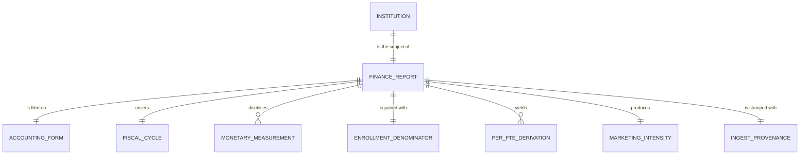

# Conceptual Model: base-ipeds-finance

**Status:** PROPOSED
**Mode:** Greenfield
**Zone:** Silver (Base)
**Domain:** U.S. higher-education institutional finance reporting (IPEDS Finance Survey)
**Spec:** [docs/specs/full-pipeline-ipeds-finance.md](../../docs/specs/full-pipeline-ipeds-finance.md) §5
**Bronze conceptual model:** [raw-ipeds-finance-conceptual.md](raw-ipeds-finance-conceptual.md)
**Author:** @doc-generator
**Date:** 2026-04-30
**Approval:** Pending human review (REQUIRE_HUMAN_APPROVAL = true)

---

---

## Entity Descriptions

| Entity | Business Concept | Business Term | Is CDE | Is PII |
|--------|-----------------|---------------|--------|--------|
| Institution | A 4-year postsecondary institution that grants a bachelor's degree or higher and reports to IPEDS. Identified by the IPEDS UNITID — the canonical key joining IPEDS Finance to every other institution-keyed table in the pipeline. Filtered upstream at Bronze by `ICLEVEL = 1 AND HLOFFER >= 5`. | BT-001 (UNITID), BT-002 (Institution Name) | true (UNITID) | false |
| Finance Report | The institution-level row in the IPEDS Finance Survey for a single fiscal year, promoted 1:1 from Bronze to Base with no row-grain change. | (proposed) BT-IPF-FINANCE-REPORT | false | false |
| Accounting Form | The IPEDS form variant the institution filed on — F1A (public, GASB), F2 (private nonprofit, FASB), or F3 (private for-profit). Carried forward unchanged from Bronze; segments per-FTE comparisons by accounting basis. | (proposed) BT-IPF-ACCOUNTING-FORM | false | false |
| Fiscal Cycle | The IPEDS fiscal year the report covers (e.g., FY23 = academic year 2022–23). Carried forward unchanged from Bronze. | (proposed) BT-IPF-FISCAL-CYCLE | false | false |
| Monetary Measurement | A dollar-denominated financial measurement disclosed on the report — instruction expenses, institutional support expenses, or endowment value end-of-year. Carried forward verbatim from Bronze as the *numerator inputs* for the per-FTE derivations and the marketing-ratio derivation. F3 endowment is structurally NULL (no `F3H` family). | BT-IPF-INSTRUCTION-EXPENSES, BT-IPF-INSTITUTIONAL-SUPPORT-EXPENSES, BT-IPF-ENDOWMENT-VALUE | false at Base (CDE flag is on the per-FTE derivation, not the raw input — see Per-FTE Derivation below) | false |
| Enrollment Denominator | The 12-month total FTE enrollment (`total_fte_enrollment`) sourced from the IPEDS EFIA survey at Bronze ingest time. Carried forward verbatim. The denominator for every per-FTE derivation. NULL when EFIA had no row for the UNITID (97.94% non-null observed). | BT-IPF-PER-FTE (the convention) | true (denominator for every per-FTE derivation; downstream coverage trip-wire) | false |
| Per-FTE Derivation | A per-student normalization of one of the three monetary measurements: `institutional_support_per_fte`, `instruction_per_fte`, `endowment_per_fte`. Computed in Silver as `measurement / total_fte_enrollment`. NULL when either operand is NULL or `total_fte_enrollment ≤ 0`. **No imputation.** Each derivation is mechanically deterministic from one Bronze numerator and the Bronze FTE denominator; the BSE-IPF-008/009 arithmetic invariants pin the computation correctness at rest. | (proposed) BT-IPF-PER-FTE | true (each per-FTE value is a CDE candidate at the consumable layer; promoted unchanged) | false |
| Marketing Intensity | The cross-field ratio `institutional_support_expenses / NULLIF(instruction_expenses, 0)`. Higher = relatively more spending on administration / fundraising / marketing vs. teaching. Computed in Silver from two Bronze measurements with no FTE dependency, so it is computable on rows where FTE is NULL. NULL when either operand is NULL or instruction is 0. The most analytically loaded derivation in this zone — the BSE-IPF-010 arithmetic invariant pins the computation correctness; per-form P99 distribution sits well above naive expectations because public state-system administrative offices report system-wide overhead with no instruction. | (proposed) BT-IPF-MARKETING-RATIO | true (downstream consumer-facing signal; CDE candidate at consumable per spec §6 Data Contract) | false |
| Ingest Provenance | The pipeline-stamped record of where each Base row came from: `source_load_date` (passthrough of the Bronze load_date) and `ingested_at` (the Base promotion timestamp). Required on every Base row by the Brightsmith governance contract. | — | false | false |
| Imputation Provenance (v1.4) | The IPEDS-published flag for `endowment_value`, carried verbatim from `bronze.ipeds_finance.endowment_value_flag` as a passthrough. **Authoritative semantics (corrected v1.2):** `R` = Reported by institution; `A` = **Not applicable** (no endowment fund — exact `A`↔NULL coupling on `endowment_value`); `N` = **Imputed using Nearest Neighbor procedure**; `P` = Imputed prior year; `Z` = Imputed zero. NULL on F3 by structure. Validated at base by BSE-IPF-018 (P0 passthrough fidelity), BSE-IPF-019 (P1 per-form prevalence band), BSE-IPF-020 (P0 `A`↔NULL coupling invariant). | (proposed) BT-IPF-ENDOWMENT-PROVENANCE | false at base (becomes CDE at consumable as `endowment_value_provenance`) | false |

---

## Relationship Descriptions

| Relationship | From | To | Cardinality | Description |
|-------------|------|-----|-------------|-------------|
| is the subject of | Institution | Finance Report | one-to-one (per fiscal cycle) | Every 4-year bachelor's-granting institution that reports to IPEDS files exactly one Finance report per fiscal year. The Base table is loaded for one fiscal cycle at a time, so the relationship is functionally one-to-one within a single load. |
| is filed on | Finance Report | Accounting Form | many-to-one | Multiple reports share the same form. Form mix in the current load (FY2023): F1A 30.6% (819) / F2 59.0% (1,579) / F3 10.4% (277). |
| covers | Finance Report | Fiscal Cycle | many-to-one | Multiple institutions' reports cover the same fiscal year. Current load covers `fiscal_year=2023`. Single-vintage invariant inherited from Bronze (RAW-IPF-013 P0). |
| discloses | Finance Report | Monetary Measurement | one-to-many (3 measurements) | Each report carries the three Bronze monetary fields verbatim. F3 endowment is structurally NULL on 100% of F3 rows by design — three measurements logically, two physically present on F3. |
| is paired with | Finance Report | Enrollment Denominator | one-to-one (NULL-allowed) | Every report carries the EFIA-sourced FTE denominator from Bronze. 97.94% of FY23 rows have a non-null FTE; the 55 NULL rows cause the corresponding per-FTE derivations to NULL-cascade. Correct behavior — these institutions are unusable for per-student comparison even if their dollar fields are populated. |
| yields | Finance Report | Per-FTE Derivation | one-to-many (3 derivations) | Each report yields three per-FTE derivations: instruction-per-FTE, institutional-support-per-FTE, endowment-per-FTE. Each is a pure division of one Bronze numerator by the FTE denominator, computed in Base for the first time. The arithmetic invariants BSE-IPF-008/009 (numerator × per-FTE ≈ original numerator within $1) pin correctness. |
| produces | Finance Report | Marketing Intensity | one-to-one (NULL-allowed) | Each report produces exactly one marketing-ratio value (or NULL if either operand is missing or instruction is zero). Computed in Base for the first time; downstream consumers read it from `consumable.ipeds_finance_profile`. The BSE-IPF-010 arithmetic invariant (`marketing_ratio × instruction_expenses ≈ institutional_support_expenses` within $1) pins correctness. |
| is stamped with | Finance Report | Ingest Provenance | one-to-one | Every Base row carries `source_load_date` (from Bronze) plus a fresh `ingested_at` Base-promotion timestamp. Both are required at the Iceberg level. |
| carries the imputation provenance for | Finance Report | Imputation Provenance (v1.4) | one-to-one (NULL-allowed; F1A/F2 only) | Each F1A/F2 report carries one imputation flag value for `endowment_value` (verbatim passthrough from bronze). F3 reports carry NULL by structure. The bi-implicational `A`↔NULL coupling between this flag and `endowment_value` is invariant per BSE-IPF-020 (P0). |

---

## Key Business Concepts

### Grain

The fundamental unit is **one institution in a single IPEDS fiscal cycle**. The current Base load (FY2023) has **2,675 rows** — exactly the same row count as Bronze (BSE-IPF-001 conservation invariant). Grain is enforced by BSE-IPF-002 (`unitid` uniqueness, P0) and the dedup grain `[unitid]`. Per spec §5, the deterministic record_id is computed via `compute_grain_id(row, ['unitid'], prefix='ipf')`.

### Promotion Pattern

This Base zone is a **1:1 shaping promote** from Bronze. There are no joins to other Bronze tables, no row consolidation, no row expansion, and no cross-source enrichment. Of the 15 Base columns:

- **8 are passthroughs** from Bronze (`unitid`, `institution_name`, `report_form`, `fiscal_year`, `institutional_support_expenses`, `instruction_expenses`, `endowment_value`, `total_fte_enrollment`) — landed verbatim with no rescaling, no rounding, and no NULL-substitution.
- **4 are derived in Base** (`institutional_support_per_fte`, `instruction_per_fte`, `endowment_per_fte`, `marketing_ratio`) — pure arithmetic on the Bronze numerators and the Bronze FTE denominator.
- **2 are provenance** (`source_load_date`, `ingested_at`) — the Bronze load_date passthrough and the Base promotion timestamp.
- **1 is the deterministic surrogate key** (`record_id`) — the SHA-256-based grain ID with prefix `ipf`.

This shape — passthrough numerators alongside their derivations — is deliberate: every per-FTE rate downstream is auditable against the source dollar value in the same row, and the marketing-ratio is auditable against both source dollars in the same row. The BSE-IPF-008/009/010 arithmetic invariants enforce this at rest.

### Why Per-FTE Derivations Live in Base, Not Consumable

Per-FTE rates are the **canonical institution-scale finance signal**. Carrying the raw dollar values without per-FTE normalization would force every downstream consumer (the consumable, the EADA fusion in `full-pipeline-eada.md`, and any future receipts/comparison spec) to repeat the same division — risking formula drift and re-introducing the EFFY-vs-EFIA-vs-EFTOTLT taxonomy bug at every read site. Computing per-FTE once in Base, with both operands present in the same row, is the single source of truth for institution-scale financial comparison.

The placement is also consistent with the BEA RPP precedent: `purchasing_power_multiplier` is pre-computed in `base.bea_rpp` rather than `consumable.regional_price_parities` for the same reason.

### Why Marketing-Ratio Lives in Base, Not Consumable

The marketing-ratio is a cross-field derivation that does not depend on FTE. It could plausibly live anywhere from Base to Consumable. Placing it in Base alongside the per-FTE values is the right call because:

- It is mechanically deterministic from two Bronze fields (no judgment).
- It is computable on rows where FTE is NULL (broader coverage than per-FTE values: 98.84% non-null vs 97.94%).
- The downstream EADA fusion spec needs marketing-ratio as a Base-zone input (it is composited with athletic-spending intensity to produce the gold-zone `institution_aura`), and a gold-zone field can't be a Base-zone composite input without a back-join.

### NULL Semantics — No Imputation

All four derivations follow the same NULL rule per spec §5 Decision #8 and the standing user constraint "no substitution-based degraded states":

- Per-FTE values are NULL when either the numerator is NULL or `total_fte_enrollment ≤ 0`.
- Marketing-ratio is NULL when either operand is NULL or `instruction_expenses = 0`.
- No imputation, no fallback values, no sentinel substitutes. Missing data stays missing through the entire pipeline.

This propagates correctly: F3 rows have NULL `endowment_per_fte` (because F3 endowment is structurally NULL); rows missing FTE have all three per-FTE values NULL; rows missing instruction have NULL marketing-ratio. Downstream consumers see honest NULLs and the consumable's `data_completeness_tier` summarizes the per-row coverage.

### The Public-System-Administrative-Office Pattern

A small but real cluster of UNITIDs in IPEDS represents public state-system administrative offices (LA Community College District Office, U Colorado System Office, U Hawaii System Office, etc.). These are real IPEDS entities with `ICLEVEL=1, HLOFFER>=5`, but they report system-wide administrative overhead with little or no instruction (because students are owned by member institutions). They have legitimately huge marketing-ratios — F1A P99 in this load is **14.15** — and they are the dominant driver of the marketing-ratio P99 across the public form. **This is an organizational-structure artifact, not a data quality failure.** The DQ rule BSE-IPF-015 is split per-form (F1A < 15.0 / F2 < 7.0 / F3 < 11.0 in `governance/dq-rules/base-ipeds-finance.json`) precisely to tolerate this cluster while still flagging genuine outliers.

---

## Cross-Source Integration Role

`base.ipeds_finance` is the single-row-per-institution finance fact table. It joins downstream into the FutureProof graph at three points:

| Consumer | Join Key | Role |
|----------|----------|------|
| `consumable.ipeds_finance_profile` | `unitid` | 1:1 promotion adding `data_completeness_tier`, exposing the raw expense passthroughs for downstream EADA composite ratios |
| `consumable.institution_aura` (downstream spec `full-pipeline-eada.md`) | `unitid` | Provides the per-FTE finance signals that pair with the EADA-side aura inputs |
| Downstream comparison/receipts specs (future) | `unitid` | Per-FTE finance signals as the institution-level financial-health denominator |

UNITID overlap with `consumable.career_outcomes` is **88.71%** (the calibrated CON-IFP-008 floor in the consumable DQ rules accommodates this exact baseline).

---

## Modeling Decisions

1. **`Institution` and `Finance Report` carried unchanged from Bronze.** The grain, the natural key, and the form-mix-segmentation story are all the same as Bronze. The Base zone does not change what an institution-fiscal-year row *is* — it only adds derivations.

2. **`Per-FTE Derivation` modeled as a first-class entity, separate from `Monetary Measurement`.** Although each per-FTE value is mechanically derived from exactly one monetary measurement plus the FTE denominator, treating them as a distinct entity makes three things explicit at the conceptual level: (a) the derivation is *new* in this zone (not a Bronze passthrough), (b) the per-FTE value is the canonical institution-scale comparison signal (not the raw dollar), and (c) the per-FTE value carries its own NULL semantics that are stricter than the monetary measurement (an FTE NULL renders all three per-FTE values NULL).

3. **`Marketing Intensity` modeled as its own entity, not folded into `Per-FTE Derivation`.** Marketing-ratio is *not* a per-FTE rate — it is a cross-field ratio with no enrollment dependency. Folding it into `Per-FTE Derivation` would mis-state the dependency graph (it doesn't need FTE) and would conflate two structurally different kinds of derived signals.

4. **`Monetary Measurement` retains its Bronze CDE-flag posture (false-at-Base).** The CDE concern is on the per-FTE rates and the marketing-ratio — the *normalized* signals downstream consumers actually compare across institutions. The raw dollar passthrough is CDE-flagged at *consumable* (per spec §6 Data Contract) once it is exposed to the downstream EADA fusion that needs raw dollars for composite ratios. At Base, the raw dollars are operational/audit fields, not the canonical analytical signal.

5. **Provenance extended with `source_load_date` from Bronze.** Bronze stamps `load_date`; Base preserves it as `source_load_date` so that downstream freshness DQ can reach the original Bronze ingest date even after multiple Silver/Gold promotion timestamps stack up. The Base `ingested_at` is a separate stamp recording when the promote ran.

6. **No new entities for `data_completeness_tier`.** The completeness-tier signal is a Gold-zone synthesis of multiple Base fields and lives in the `consumable.ipeds_finance_profile` model, not here. Base is where the *inputs* live; Consumable is where the *summary* lives.

7. **No SCD2; no history.** Same as Bronze: single-cycle snapshot, full-table replacement on cycle refresh. Future multi-cycle backfill would require partitioning on `fiscal_year` and extending the dedup grain to `[unitid, fiscal_year]`.

8. **v1.4 — Imputation Provenance entity added narrowly.** The bronze layer captures `endowment_value_flag` as a coalesced passthrough of `XF1H02` / `XF2H02`; base preserves it verbatim. The conceptual model treats it as a distinct entity (`Imputation Provenance`) so the bi-implicational `A`↔NULL coupling with `endowment_value` is visible at the conceptual level — and so future-cycle semantic drift (if `A` ever loses its no-endowment meaning) trips BSE-IPF-020 P0 before downstream consumers misread the column. The CDE flag on this entity is intentionally false at base; it becomes CDE at consumable (renamed to `endowment_value_provenance`) where the rename signals the consumer-facing posture.

9. **v1.4 — `A`/`N` semantic correction.** The v1.3 EDA §7 narrative inverted the meanings of `A` and `N` (described `A` as "model-imputed" and `N` as "Not applicable"). The IPEDS Finance FY2023 dictionary is the AUTHORITATIVE source — `A` = **Not applicable** (with exact `A`↔NULL coupling on `endowment_value`) and `N` = **Imputed using Nearest Neighbor procedure**. This conceptual model and every downstream artifact use the corrected semantics; the v1.3-EDA wording must NOT propagate.

---

## Scope and Boundaries

- This conceptual model covers the `base.ipeds_finance` table only.
- Bronze raw data (`bronze.ipeds_finance`) is the source but is fully modeled in `raw-ipeds-finance-conceptual.md`.
- Consumable products (`consumable.ipeds_finance_profile`) are downstream consumers, modeled in `consumable-ipeds-finance-profile-conceptual.md`.
- The downstream EADA fusion (`consumable.institution_aura`) lives in `full-pipeline-eada.md` and is not in this model.
- No imputation, no substitution. Standing user constraints re-affirmed.
- PII: None. IPEDS Finance is institution-level reporting by design.
