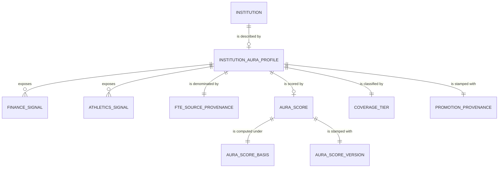

# Conceptual Model: consumable-institution-aura

**Status:** PROPOSED
**Mode:** Greenfield (cross-source fusion)
**Zone:** Gold (Consumable)
**Domain:** U.S. higher-education institutional brand-gravity (IPEDS Finance + EADA Athletics fusion)
**Spec:** [docs/specs/full-pipeline-eada.md](../../docs/specs/full-pipeline-eada.md) §6
**Base conceptual models:**
  - [base-ipeds-finance-conceptual.md](base-ipeds-finance-conceptual.md)
  - [base-eada-conceptual.md](base-eada-conceptual.md)
**Author:** @doc-generator
**Date:** 2026-04-30
**Approval:** Pending human review (REQUIRE_HUMAN_APPROVAL = true)

---

---

## Entity Descriptions

| Entity | Business Concept | Business Term | Is CDE | Is PII |
|--------|-----------------|---------------|--------|--------|
| Institution | A U.S. postsecondary institution identified by the IPEDS UNITID. The fundamental actor — every aura row is exactly one institution. May report to IPEDS Finance only, EADA only, or both. | BT-001 (UNITID), BT-002 (Institution Name) | true (UNITID) | false |
| Institution Aura Profile | The single-row institution-level brand-gravity composite served to downstream consumers (the FutureProof career-outcomes pentagon, future MCP tools, future cross-institution comparison specs). One row per UNITID per snapshot. Built from a FULL OUTER JOIN of `base.ipeds_finance` and `base.eada` on UNITID — every row in either base table contributes exactly one profile row. | (proposed) BT-AUR-AURA-PROFILE | false | false |
| Finance Signal | A dollar-denominated or ratio-valued financial measurement carried forward from the IPEDS Finance Profile: `endowment_per_fte`, `institutional_support_per_fte`, `instruction_per_fte`, `marketing_ratio`. NULL when the institution did not report Finance (548 athletics-only rows) or when the underlying FTE / numerator was missing. | BT-IPF-INSTRUCTION-EXPENSES (and family), BT-IPF-PER-FTE, BT-IPF-MARKETING-RATIO | true (CDE per spec §6) | false |
| Athletics Signal | A per-FTE or ratio-valued athletics measurement carried forward from EADA: `athletic_spend_per_fte`, `athletic_revenue_per_fte`, `athletic_subsidy_ratio`. NULL when the institution did not report EADA (1,183 finance-only rows). **`athletic_subsidy_ratio` is a context column only — explicitly EXCLUDED from the aura composite per spec §2 Decision 11** (it encodes a normative judgment that overlaps with ROI / ERN). | BT-EAD-ATHLETIC-SUBSIDY-RATIO; (proposed) BT-AUR-ATHLETIC-SPEND-PER-FTE | true (CDE per spec §6) | false |
| FTE Source Provenance | A methodological-provenance signal recording which FTE denominator the three EADA per-FTE / ratio columns were computed against: `ipeds_finance` (preferred — IPEDS-Finance-annualized FTE, used on all 1,492 `coverage_tier='both'` rows), `eada_fte_headcount` (EADA's own 12-month headcount, used on all 548 `coverage_tier='athletics_only'` rows), or `none`/NULL (1,183 finance-only rows with no EADA inputs). The two FTE definitions are NOT identical; this column lets downstream consumers stratify or filter on FTE-methodology consistency. Introduced in the §5 Option-C amendment 2026-04-30. | (proposed) BT-AUR-FTE-SOURCE | true (methodological-provenance CDE — affects how athletic per-FTE columns are interpreted) | false |
| Aura Score | A neutral institution-level brand-gravity composite. Integer 1–10. Direct (non-inverted) function of three input signals: `marketing_ratio`, `endowment_per_fte`, `athletic_spend_per_fte`. Higher = more brand presence (endowment + marketing + athletic spend), NOT "better" or "worse" — that interpretation emerges from the pentagon shape when aura is read alongside ERN and ROI. v1 formula (EDA-finalized 2026-04-30): per-row, take only the rank-percentile values for the available signals; compute `0.65 · MAX + 0.35 · MEAN`; rescale via P5/P95 percentile bounds (0.1413 / 0.9400) to [1, 10]; ROUND. | (proposed) BT-AUR-AURA-SCORE | true (the core consumer-facing signal of this profile) | false |
| Aura Score Basis | A 5-value enum recording which input set computed the aura score for this row: `three_term`, `two_term_finance_only`, `two_term_no_endowment`, `one_term_marketing_only`, or NULL when `aura_score` itself is NULL. Expanded from 3 → 5 values during the EDA (677 finance reporters have NULL endowment, mostly for-profits and shell offices, requiring two new basis cases). The basis is what `aura_score IS NULL iff aura_score_basis IS NULL` (CON-AUR-034) keys off. | (proposed) BT-AUR-AURA-SCORE-BASIS | true (gates downstream interpretation of cross-stratum aura comparison) | false |
| Aura Score Version | A provenance stamp identifying the formula version that produced the aura score. v1 (EDA-finalized 2026-04-30) is the active version; v0-draft was rejected after failing 11/14 anchor schools during EDA. | (Brightsmith convention) | false | false |
| Coverage Tier | A 3-value enum recording which upstream sources contributed to this row's profile: `both` (1,492 rows, 46.3%), `finance_only` (1,183 rows, 36.7%), `athletics_only` (548 rows, 17.0%). Used by downstream consumers to gauge confidence in the composite (an `athletics_only` row has NULL aura because there is no marketing or endowment signal). | (proposed) BT-AUR-COVERAGE-TIER | true (gates whether aura is computable; segments downstream confidence) | false |
| Promotion Provenance | The pipeline-stamped record of when this consumable row was promoted from Base. Required on every consumable row by the Brightsmith governance contract. Identical across all rows in a single promote run. | — | false | false |

---

## Relationship Descriptions

| Relationship | From | To | Cardinality | Description |
|-------------|------|-----|-------------|-------------|
| is described by | Institution | Institution Aura Profile | one-to-one (per snapshot) | Every UNITID present in `base.ipeds_finance` ∪ `base.eada` produces exactly one aura profile row. The grain is one row per UNITID per snapshot. |
| exposes | Institution Aura Profile | Finance Signal | one-to-many (4 signals) | Each profile exposes the four IPEDS Finance per-FTE / ratio signals verbatim from `base.ipeds_finance` (NULL when `has_ipeds_finance = FALSE`). |
| exposes | Institution Aura Profile | Athletics Signal | one-to-many (3 signals) | Each profile exposes the three EADA per-FTE / ratio signals verbatim from `base.eada` (NULL when `has_eada = FALSE`). |
| is denominated by | Institution Aura Profile | FTE Source Provenance | many-to-one | The FTE-denominator methodology used for the three EADA per-FTE columns. NULL when no EADA reporting; `ipeds_finance` for `coverage_tier='both'`; `eada_fte_headcount` for `coverage_tier='athletics_only'`. |
| is scored by | Institution Aura Profile | Aura Score | one-to-one (NULL-allowed) | Every profile carries exactly one aura_score (or NULL when `aura_score_basis IS NULL`). |
| is computed under | Aura Score | Aura Score Basis | many-to-one | Every non-NULL aura_score is stamped with one of four basis values; NULL aura_score has NULL basis (the iff invariant CON-AUR-034). |
| is stamped with | Aura Score | Aura Score Version | many-to-one | All scores in this snapshot stamp `v1`. |
| is classified by | Institution Aura Profile | Coverage Tier | many-to-one | Each profile carries one of three coverage_tier values; the tier follows directly from which upstream sources contributed. |
| is stamped with | Institution Aura Profile | Promotion Provenance | one-to-one | Every profile carries the consumable promote timestamp (`promoted_at`). |

---

## Key Business Concepts

### Grain

The fundamental unit is **one institution at one snapshot in time**, identified by IPEDS UNITID. The current load has **3,223 rows** (1,492 `both` + 1,183 `finance_only` + 548 `athletics_only`), exactly the FULL OUTER JOIN of `base.ipeds_finance` (2,675 rows) and `base.eada` (2,040 rows) on UNITID. Grain is enforced by CON-AUR-003 (`unitid` uniqueness, P0) and the dedup grain `[unitid]`. The deterministic `record_id` is computed via `compute_grain_id(row, ['unitid'], prefix='aur')`.

### Cross-Source Fusion Pattern

Unlike the sibling `consumable.ipeds_finance_profile` (which is a 1:1 base→consumable shaping promote), `consumable.institution_aura` is the **first cross-source fusion** in the FutureProof pipeline that joins two distinct upstream Base tables on UNITID. The fusion uses FULL OUTER (not INNER) so that:

1. **Finance-only institutions** (1,183 rows; non-athletic 4-years like MIT, Caltech, most LACs and SLACs) get a profile row with non-NULL Finance signals and NULL Athletics signals.
2. **Athletics-only institutions** (548 rows; institutions that report EADA but not Finance — typically because the IPEDS Finance HD filter `ICLEVEL=1 AND HLOFFER>=5` excluded them) get a profile row with non-NULL Athletics signals and NULL Finance signals. Their `aura_score` is NULL by design (no marketing or endowment signal to compose).
3. **Dual-reporters** (1,492 rows; the major anchor population — public flagships, R1s, athletic powerhouses) get all three input signals and earn the canonical `three_term` aura.

### The v1 Aura Score — EDA-Finalized 2026-04-30

The `aura_score` column is a neutral brand-gravity composite computed as follows (full evidence chain in `governance/eda/consumable-institution-aura-eda.md`):

1. **Population-level rank-percentile transform** on each of the three input signals, computed across all rows where the signal is non-null:
   - `rp_marketing = PERCENT_RANK(marketing_ratio)`
   - `rp_endowment = PERCENT_RANK(endowment_per_fte)`
   - `rp_athletic  = PERCENT_RANK(athletic_spend_per_fte)`
2. **Per-row basis assignment** (5-value enum): pick which rp_* values are non-null for THIS row.
3. **MAX + MEAN composite** on the available rp_* values: `raw_score = 0.65 · MAX(available_rp) + 0.35 · MEAN(available_rp)`.
4. **P5/P95 percentile rescale** to [1, 10]: `(raw_score − 0.1413) / (0.9400 − 0.1413)`, clamp to [0, 1], stretch to [1, 10], `ROUND` to integer.
5. **Stamp the basis and version** on the row.

The formula was chosen via anchor validation across 14 anchor schools spanning three classes (extreme endowment, extreme athletics, extreme marketing). v1 passes 13/13 anchors at the §6-required `aura_score ≥ 8` threshold; the v0-draft weighted-mean formula failed 11/14. Liberty (the moderate-on-all-three control anchor) correctly lands mid-band at 5.

### Why `athletic_subsidy_ratio` is NOT an Aura Input

Per spec §2 Decision 11, the `athletic_subsidy_ratio` is **deliberately excluded** from the aura composite. The ratio carries a normative judgment ("subsidy = bad") that overlaps with ROI / ERN — including it would remove the analytical tension between aura and the rest of the pentagon. It remains on the consumable as a **context column** that downstream consumers can read directly (e.g., for an "athletics is profitable / breaks even / requires subsidy" UI surface), but every aura computation reads from `athletic_spend_per_fte` only. EDA Item 6 verified this by code inspection of all four candidate formulas.

### The 5-Value `aura_score_basis` Enum (v1 Expansion)

The original spec proposed a 3-value enum (`three_term`, `two_term_finance_only`, NULL). EDA discovered two structural cases the 3-value enum missed because **677 finance reporters have NULL `endowment_per_fte`** (mostly for-profits like Phoenix and Grand Canyon, plus IPEDS shell offices). Treating these as bottom-percentile (`COALESCE(rp_endowment, 0)`) was the v0-draft bug that drove Phoenix and Grand Canyon down to score 5 — failing the marketing-anchor pass criterion. The v1 expansion stamps each row with a basis that accurately documents which inputs were used:

| Basis | Population | Inputs Used |
|-------|-----------:|-------------|
| `three_term` | 1,417 | marketing + endowment + athletic |
| `two_term_finance_only` | 579 | marketing + endowment (no EADA) |
| `two_term_no_endowment` | 75 | marketing + athletic (NULL endowment) |
| `one_term_marketing_only` | 573 | marketing only (NULL endowment AND NULL athletic) |
| NULL (no aura) | 579 | none — 548 athletics_only + 31 finance reporters with all-NULL inputs |

The v1 invariant `aura_score IS NULL iff aura_score_basis IS NULL` (CON-AUR-034 P0) replaces the spec-as-written `aura_score IS NULL exactly when has_ipeds_finance = FALSE` shorthand — the new form is the faithful invariant and covers the 31 zero-instruction-expense edge cases that the legacy form would have classified as "should-have-aura" but actually have no usable signal.

### FTE-Source Provenance — the §5 Option-C Amendment

The `athletic_fte_source` column records which FTE denominator was used for the three EADA per-FTE / ratio columns. Two methodologies coexist:

- **`ipeds_finance`** (1,492 rows): IPEDS-Finance annualized FTE (`FTEUG + FTEGD + FTEDPP` from the EFIA file). Preferred for cross-institution comparison because it matches the denominator used by the Finance-side per-FTE columns in the same row.
- **`eada_fte_headcount`** (548 rows): EADA's own 12-month student headcount (an unduplicated count, not FTE). Used when the institution reports EADA but not IPEDS Finance.

The two definitions are NOT identical. EDA Item 7 verified the `eada_fte_headcount` stratum has athletic_spend_per_fte ~3× lower at the median than the `ipeds_finance` stratum. **However**, every `coverage_tier='athletics_only'` row (the only stratum using `eada_fte_headcount`) has NULL aura by construction — so the FTE-source methodology mix never affects the aura distribution. EDA Item 7 declared the 2 × 3 (`aura_score_basis × athletic_fte_source`) interaction grid structurally degenerate. CON-AUR-030 stratifies by `aura_score_basis` (4 strata) accordingly, NOT by `athletic_fte_source`.

The provenance column is surfaced because downstream consumers may want to filter or stratify on FTE-methodology consistency — the spec §6 CDE-candidate listing flags it as a CDE per the Option-C amendment.

---

## Cross-Source Integration Role

`consumable.institution_aura` is the institution-level brand-gravity fact table. It will be read by:

| Consumer | Join Key | Role |
|----------|----------|------|
| FutureProof career-outcomes pentagon | `unitid` | Aura is the fifth point of the pentagon (alongside ERN, ROI, GRW, RES). The pentagon shape encodes the brand-vs-outcome tension (high-aura/low-ERN vs high-aura/high-ERN). |
| Future MCP tools (Gemma-callable) | `unitid` | `aura_score` and `aura_score_basis` surfaced via tool responses; basis controls hedging language. |
| Future cross-institution comparison specs | `unitid` | Composite signal for institution clustering or cohort selection. |

UNITID overlap with `consumable.career_outcomes` is **89.68%** (live measurement; CON-AUR-021 floor: 90% — the 0.32 pp gap is documented as P1 drift in the DQ scorecard, not a defect).

---

## Modeling Decisions

1. **`Institution Aura Profile` as the anchor entity, distinct from `Institution`.** The grain is one row per UNITID, but the *profile* is a distinct business object with its own promotion provenance, score, basis, and coverage classification. Naming it `Institution Aura Profile` rather than folding it into `Institution` keeps the consumer-facing aura surface explicit.

2. **`Aura Score` as a first-class entity, separate from `Institution Aura Profile`.** The score is the central consumer-facing signal of this consumable. Modeling it as its own entity (with `Aura Score Basis` and `Aura Score Version` as related entities) makes the v1-versioning + 5-value-basis structure visible at the conceptual level. A future v2 score (e.g., adding a fourth signal, or rebalancing weights) would land as a new score entity stamped `aura_score_version='v2'` rather than overwriting v1 in place.

3. **`Finance Signal` and `Athletics Signal` modeled as entity types, not single entities.** Each entity has multiple instances per profile (4 finance signals, 3 athletics signals). This makes the cross-source fusion pattern visible — the consumable layer composites signals from two different Base tables, and the conceptual model says so explicitly.

4. **`FTE Source Provenance` as a first-class entity.** The Option-C amendment 2026-04-30 surfaced this concept after the EDA discovered that ~25.5% of EADA-reporting institutions use a non-IPEDS-Finance FTE denominator. Modeling provenance as its own entity (rather than a soft attribute on athletics signals) ensures downstream consumers can read methodology consistency at the row level.

5. **`Aura Score Basis` as a first-class entity, NOT a soft attribute of Aura Score.** The 5-value enum gates downstream interpretation — a downstream comparison between a `three_term` Stanford and a `one_term_marketing_only` Phoenix is **not** apples-to-apples in the same way that a comparison between two `three_term` flagships is. Modeling the basis as a peer entity makes the cross-stratum-comparability concern visible at the conceptual level.

6. **`Coverage Tier` retained as a separate entity from `Aura Score Basis`.** The two are correlated but distinct: coverage_tier records *which sources contributed* (3-value: both / finance_only / athletics_only), while aura_score_basis records *which inputs computed the score* (5-value, including the two endowment-NULL cases that coverage_tier doesn't see). Both columns survive on the schema because they answer different consumer questions.

7. **`athletic_subsidy_ratio` is a `Athletics Signal` instance but explicitly NOT an aura input.** Modeling it as a normal athletics signal (rather than a special "context" entity) keeps the schema simple; the conceptual-level constraint that it is *excluded* from aura is captured in the entity description and enforced at the transformation layer (and by code review of every candidate aura formula during EDA, per Item 6).

8. **No imputation, no substitution.** Standing user constraints re-affirmed; NULLs propagate honestly from Base through this consumable. The `aura_score_basis` column is the *summary* of which inputs were missing, not a substitute for them.

9. **No SCD2.** Same as Base/Bronze; latest-snapshot-only.

10. **Pure Iceberg landing — no joins to other consumable tables at promote time.** CON-AUR-020 and CON-AUR-021 (cross-source coverage to `consumable.career_outcomes`) are *runtime DQ checks* against a sibling consumable, not joins folded into the promote. This keeps the promote idempotent and avoids ordering dependencies between consumable tables.

---

## Scope and Boundaries

- This conceptual model covers `consumable.institution_aura` only.
- Bronze raw data and Base data are fully modeled in their own conceptual models (`raw-eada-conceptual.md`, `base-eada-conceptual.md`, `raw-ipeds-finance-conceptual.md`, `base-ipeds-finance-conceptual.md`).
- The sibling `consumable.ipeds_finance_profile` — which provides the four Finance signals consumed here — is fully modeled in `consumable-ipeds-finance-profile-conceptual.md`. This aura profile reads from `base.ipeds_finance` directly (not from the sibling consumable) per the spec §6 source list; the sibling consumable is downstream-of-Base and parallel to this aura consumable, not upstream.
- Downstream MCP-zone fact sheets that may surface aura via Gemma tools are not in scope here.
- The pentagon-rendering frontend that consumes aura alongside ERN/ROI/GRW/RES is not in scope here.
- PII: None. EADA + IPEDS Finance are institution-level reporting by design.
