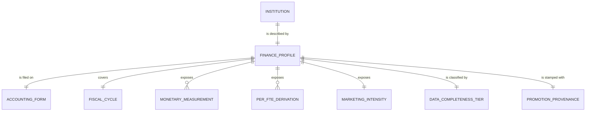

# Conceptual Model: consumable-ipeds-finance-profile

**Status:** PROPOSED
**Mode:** Greenfield
**Zone:** Gold (Consumable)
**Domain:** U.S. higher-education institutional finance reporting (IPEDS Finance Survey)
**Spec:** [docs/specs/full-pipeline-ipeds-finance.md](../../docs/specs/full-pipeline-ipeds-finance.md) §6
**Base conceptual model:** [base-ipeds-finance-conceptual.md](base-ipeds-finance-conceptual.md)
**Author:** @doc-generator
**Date:** 2026-04-30
**Approval:** Pending human review (REQUIRE_HUMAN_APPROVAL = true)

---

---

## Entity Descriptions

| Entity | Business Concept | Business Term | Is CDE | Is PII |
|--------|-----------------|---------------|--------|--------|
| Institution | A 4-year postsecondary institution that grants a bachelor's degree or higher and reports to IPEDS. Identified by the IPEDS UNITID. Carried forward unchanged from Base. | BT-001 (UNITID), BT-002 (Institution Name) | true (UNITID) | false |
| Finance Profile | The single-row institution-level finance summary served to downstream consumers (the EADA fusion in `full-pipeline-eada.md`, future receipts/comparison specs, and any MCP tool that surfaces institution finance signals). One row per (institution, fiscal cycle). Promoted 1:1 from `base.ipeds_finance` with no row-grain change. | (proposed) BT-IPF-FINANCE-PROFILE | false | false |
| Accounting Form | The IPEDS form variant the institution filed on (F1A / F2 / F3). Carried forward unchanged from Base; downstream consumers segment finance signals by accounting basis. | (proposed) BT-IPF-ACCOUNTING-FORM | false | false |
| Fiscal Cycle | The IPEDS fiscal year the profile covers (current load: 2023). Carried forward unchanged from Base. | (proposed) BT-IPF-FISCAL-CYCLE | false | false |
| Monetary Measurement | A dollar-denominated financial measurement exposed at the consumable layer: instruction expenses, institutional support expenses, endowment value end-of-year. **Newly exposed at consumable** (vs the standard "consumable is shaped, not raw-pass-through" Brightsmith convention) per spec §6 Decision and the v1.1 governance-reviewer ADV-6 ruling. The justification is narrow: the downstream EADA fusion (`raw-ingest-eada.md`) needs raw dollars to compute composite ratios like "athletic spending as % of institutional support" without back-joining to base. F3 endowment is structurally NULL. | BT-IPF-INSTRUCTION-EXPENSES, BT-IPF-INSTITUTIONAL-SUPPORT-EXPENSES, BT-IPF-ENDOWMENT-VALUE | true (CDE candidates per spec §6 Data Contract — exposed for downstream EADA composite ratios) | false |
| Per-FTE Derivation | A per-student normalization of one of the three monetary measurements: `institutional_support_per_fte`, `instruction_per_fte`, `endowment_per_fte`. Carried forward unchanged from `base.ipeds_finance`. The canonical institution-scale finance signal — every comparison across institutions reads from these values, not the raw dollars. | (proposed) BT-IPF-PER-FTE | true (CDE candidates per spec §6 Data Contract) | false |
| Marketing Intensity | The cross-field ratio `institutional_support / instruction`. Carried forward unchanged from `base.ipeds_finance`. The most analytically loaded consumer-facing signal in this profile — used to rank institutions by administrative-spending intensity and as a Base-zone input to the downstream EADA fusion. | (proposed) BT-IPF-MARKETING-RATIO | true (CDE candidate per spec §6 Data Contract) | false |
| Data Completeness Tier | A four-valued source-data-completeness signal — `high` / `medium` / `low` / `insufficient` — synthesized from the count of non-null **independent raw inputs**: `instruction_expenses`, `institutional_support_expenses`, `endowment_value`, `total_fte_enrollment` (positive). Reformulated from the v1.0 confidence_tier (which mixed in derived signals and would have over-counted F3 rows as `high`). **NOT a CIP→SOC crosswalk-confidence tier** — measures source-field non-null count, not crosswalk match quality. Renamed in v1.1 to disambiguate from the ConceptNormalizer crosswalk-confidence tiers used elsewhere in the project. | (proposed) BT-IPF-DATA-COMPLETENESS-TIER | true (downstream consumer-facing signal that gates whether to display an institution's profile; CDE candidate per spec §6 Data Contract) | false |
| Promotion Provenance | The pipeline-stamped record of when this consumable row was promoted from Base, plus (v1.4) the bronze source-load date. Required on every consumable row by the Brightsmith governance contract. The v1.4 amendment restored `source_load_date` (the bronze-load date, passthrough from base) so consumers can compare two cached snapshots and tell which is fresher without re-querying base. | — | false (the restored `source_load_date` is explicitly NOT CDE — vintage-observability metadata only) | false |
| Imputation Provenance (v1.4) | The IPEDS-published flag for `endowment_value`, exposed at consumable as `endowment_value_provenance` (renamed from `base.ipeds_finance.endowment_value_flag` per spec §2 Decision A). The rename signals consumer-facing posture — every downstream consumer reads this column to interpret `endowment_value` and `endowment_per_fte`. **Authoritative semantics (corrected v1.2):** `R` = Reported by institution; `A` = **Not applicable** (no endowment fund — exact `A`↔NULL coupling on `endowment_value` invariant per BSE-IPF-020 P0); `N` = **Imputed using Nearest Neighbor procedure**; `P` = Imputed prior year; `Z` = Imputed zero. NULL on F3 by structure. **Longitudinal consumers MUST filter to `R`** to limit to institution-reported populated values; this excludes both the no-endowment `A` population and the small `N` / `P` / `Z` imputed-value populations. The verbatim filter-to-`R` guidance is carried at the consumable data contract layer (`governance/data-contracts/consumable-ipeds-finance-profile.yaml::consumer_guidance.endowment_provenance`) per the @fp-data-reviewer disclaimer-gap concern. | (proposed) BT-IPF-ENDOWMENT-PROVENANCE | true (v1.4 CDE per spec §6 Data Contract delta — interpretation-changing for `endowment_value` and `endowment_per_fte`) | false |

---

## Relationship Descriptions

| Relationship | From | To | Cardinality | Description |
|-------------|------|-----|-------------|-------------|
| is described by | Institution | Finance Profile | one-to-one (per fiscal cycle) | Every Base row promotes to exactly one consumable Finance Profile row. The grain is preserved 1:1. |
| is filed on | Finance Profile | Accounting Form | many-to-one | Multiple profiles share the same form. Form mix in the current load (FY2023): F1A 30.6% (819) / F2 59.0% (1,579) / F3 10.4% (277). |
| covers | Finance Profile | Fiscal Cycle | many-to-one | Multiple institutions' profiles cover the same fiscal year. Single-vintage invariant inherited from Base / Bronze. |
| exposes | Finance Profile | Monetary Measurement | one-to-many (3 measurements) | Each profile exposes the three Bronze-sourced raw dollar fields verbatim. Newly visible at consumable per the spec §6 narrow-exception decision. |
| exposes | Finance Profile | Per-FTE Derivation | one-to-many (3 derivations) | Each profile exposes the three Base-derived per-FTE values verbatim. The canonical institution-scale finance signal. |
| exposes | Finance Profile | Marketing Intensity | one-to-one (NULL-allowed) | Each profile exposes exactly one marketing-ratio (or NULL). Computed at Base; preserved verbatim. |
| is classified by | Finance Profile | Data Completeness Tier | one-to-one | Every profile carries exactly one tier value drawn from the closed set `{high, medium, low, insufficient}`. Computed in this consumable promote for the first time. |
| is stamped with | Finance Profile | Promotion Provenance | one-to-one | Every profile carries the consumable promote timestamp (`promoted_at`) and (v1.4) the bronze-load-date passthrough (`source_load_date`). Both are NOT NULL. |
| carries the imputation provenance for | Finance Profile | Imputation Provenance (v1.4) | one-to-one (NULL-allowed; F1A/F2 only) | Each F1A/F2 profile carries one `endowment_value_provenance` value (renamed passthrough from `base.ipeds_finance.endowment_value_flag`). F3 profiles carry NULL by structure. CON-IFP-013 (P0) verifies rename-fidelity (every consumable value matches the source base value for the same UNITID; 0 mismatches). |
| is filtered out of (v1.4) | Finance Profile | (excluded) System-Administrative-Office Cluster | many-to-zero | The v1.4 system-office filter excludes 45 rows from the 2,675 base rows that match both (a) one of 8 organizational-name patterns AND (b) at least one of 4 organizational-shell signals (instruction NULL or below $1M, FTE NULL or below 50). The excluded rows represent state-system or district-level administrative offices (e.g., LA CCD Office, SUNY-System Office, UMass-Central Office, Sistema Universitario Ana G. Mendez). They are real IPEDS entities but not degree-granting institutions; they have no career-outcome counterpart by construction. CON-IFP-014 (P1) verifies 0 surviving rows match the exclusion clause. The row-count band [base_count - 50, base_count] is enforced by CON-IFP-001a (P0 upper bound) + CON-IFP-001b (P1 lower bound). |

---

## Key Business Concepts

### Grain

The fundamental unit is **one institution in a single IPEDS fiscal cycle** — same as Base and Bronze. The v1.4 consumable load (FY2023) has **2,630 rows** — base 2,675 minus 45 system-administrative-office rows excluded by the v1.4 row-filter. The row-count contract is no longer 1:1 with base; it is the band [base_count - 50, base_count] (CON-IFP-001a P0 upper bound + CON-IFP-001b P1 lower bound). v1.3 historical baseline (no filter) was 2,675 rows. Grain is enforced by CON-IFP-003 (`unitid` uniqueness, P0) and the dedup grain `[unitid]`. Per spec §6, the deterministic record_id is computed via `compute_grain_id(row, ['unitid'], prefix='ifp')` — note the `ifp` prefix is distinct from the Base `ipf` prefix to keep hash namespaces clean across zones.

### Promotion Pattern — Pure Shaping, No Cross-Source Joins

This consumable is a **base→consumable shaping promote**. There are no joins to other consumable tables, no row consolidation, no row expansion, no derived score, and no cross-source enrichment. Of the 15 consumable columns:

- **12 are Base passthroughs** — the 5 identity columns (`unitid`, `institution_name`, `report_form`, `fiscal_year`, `total_fte_enrollment`), the 3 raw expense passthroughs (`instruction_expenses`, `institutional_support_expenses`, `endowment_value`), the 3 per-FTE derivations (`institutional_support_per_fte`, `instruction_per_fte`, `endowment_per_fte`), and the marketing-ratio.
- **1 is synthesized in this zone** (`data_completeness_tier`) — a CASE expression over the four independent raw inputs.
- **1 is the consumable promote timestamp** (`promoted_at`).
- **1 is the deterministic surrogate key** (`record_id`) under the `ifp-` prefix.

The downstream EADA fusion (`consumable.institution_aura` per `full-pipeline-eada.md`) is the consumer that drives this consumable's shape — the raw expense passthroughs and per-FTE values flow from this profile into the EADA composite without back-joining to Base.

### The Raw-Expense-Passthrough Exception

Brightsmith's standard convention is "consumable is shaped, not raw-pass-through." Spec §6 makes a narrow, explicit exception for `instruction_expenses`, `institutional_support_expenses`, and `endowment_value`. The justification, per the v1.1 governance-reviewer ruling:

1. The downstream EADA fusion needs to compute composite ratios like "athletic spending as a percentage of institutional support" — without the consumable passthrough, that fusion would have to back-join to `base.ipeds_finance`, which violates the "consumers read from gold-zone consumables" pattern more severely than the passthrough does.
2. The dollar values were already exposed at Base, so there is no new information leak.
3. The raw passthroughs sit alongside their per-FTE derivations in the same row, making BSE-IPF-008/009/010 arithmetic invariants self-auditable through the consumable layer (CON-IFP-007 carries the `marketing_ratio × instruction ≈ institutional_support` invariant verbatim).

The exception is narrow (3 fields, all already documented in business glossary terms), justified by a named downstream consumer, and self-documenting in the schema notes.

### Data Completeness Tier — The v1.1 Reformulation

The tier signal classifies each row by source-data completeness:

| Tier | Rule | Observed (FY23) |
|------|------|-----------------|
| `high` | All 4 independent raw inputs present (`instruction_expenses`, `institutional_support_expenses`, `endowment_value`, `total_fte_enrollment` > 0) | 1,998 rows (74.7%) |
| `medium` | 2–3 of the 4 inputs present | 677 rows (25.3%) |
| `low` | Exactly 1 of the 4 inputs present | 0 rows |
| `insufficient` | 0 of the 4 inputs present | 0 rows |

Two things make this formulation defensible:

1. **It counts independent raw inputs, not derived signals.** The v1.0 formulation mixed in `marketing_ratio`, which inflated tier scores because a present marketing_ratio re-counted the two expense fields it was derived from. The v1.1 reformulation makes the tier a pure function of source-field non-null count.

2. **`total_fte_enrollment` is first-class.** When FTE is missing, all three per-FTE values NULL-cascade and the row is unusable for per-student comparison even if all three dollar fields are present. By including FTE as a fourth tier input, the tier correctly de-rates such rows (they cap at `medium`, not `high`).

A consequence by construction: **every F3 row is `medium`, never `high`.** F3 endowment is structurally NULL (no `F3H` family on the for-profit schedule), so F3 rows can never reach 4/4 inputs. Verified in the landed table: F3 = `medium:277, high:0`. This is the desired behavior and is the central reason the v1.1 reformulation matters.

### Disambiguation From CIP→SOC Crosswalk-Confidence Tiers

The `data_completeness_tier` column was named `confidence_tier` in spec v1.0. It was renamed to `data_completeness_tier` in v1.1 to disambiguate from the CIP→SOC crosswalk-confidence tiers used elsewhere in the project (e.g., the `ConceptNormalizer` tiers in the career-outcomes pipeline). The downstream EADA fusion spec (`raw-ingest-eada.md`) is likely to introduce its own confidence tiers — without this rename, two semantically distinct "confidence_tier" fields would end up in adjacent tables. The business glossary entry BT-IPF-DATA-COMPLETENESS-TIER explicitly states: "**This is NOT a CIP→SOC crosswalk-confidence tier** — it measures source-field non-null count, not crosswalk match quality."

### NULL Semantics — Standing Constraints

Per the standing user constraints, **no substitution-based degraded states**. NULLs propagate honestly from Bronze through Base into this consumable:

- F3 rows have NULL `endowment_value` and NULL `endowment_per_fte` (structural NULL).
- 55 rows have NULL `total_fte_enrollment` and consequently NULL on all three per-FTE values.
- 31 rows (zero-instruction system offices) have NULL `marketing_ratio`.
- The `data_completeness_tier` is the *summary* of these NULLs, not a substitute for them.

Downstream consumers see the honest NULL pattern. The frontend uses `data_completeness_tier=insufficient` as a gate for whether to display an institution's profile at all (no observed rows in this tier in the current load).

---

## Cross-Source Integration Role

`consumable.ipeds_finance_profile` is the institution-finance fact table served to downstream consumers. It joins downstream into the FutureProof graph at three points:

| Consumer | Join Key | Role |
|----------|----------|------|
| `consumable.institution_aura` (downstream spec `raw-ingest-eada.md`) | `unitid` | Provides the per-FTE finance signals AND the raw dollar passthroughs (for athletic-spend-as-pct-of-institutional-support composite ratios) |
| Future receipts/comparison specs | `unitid` | Per-FTE finance signals as the institution-level financial-health denominator for cross-institution comparisons |
| MCP tools (future) | `unitid` | Finance signals surfaced via Gemma tool responses; `data_completeness_tier` controls hedging language |

UNITID overlap with `consumable.career_outcomes` is **88.71%** (calibrated CON-IFP-008 P1 floor: 88%; CON-IFP-008b P2 watch-line: 86%).

---

## Modeling Decisions

1. **`Finance Profile` as the anchor entity, distinct from `Institution`.** The grain is one row per (institution, fiscal cycle), but the *profile* is a distinct business object — it has its own promotion provenance, its own completeness-tier classification, and its own consumer surface (the EADA fusion reads from this profile, not from the institution dimension). Naming it `Finance Profile` rather than just folding it into `Institution` makes the consumer-facing nature explicit.

2. **`Monetary Measurement` retained as a first-class entity at consumable.** Per the spec §6 narrow exception, the three raw dollar fields are exposed at consumable. Modeling them as their own entity (rather than burying them as attributes of `Finance Profile`) makes the exception visible at the conceptual level and ensures downstream consumers know these are *raw* dollars (suitable for composite-ratio computation) and not the canonical institution-scale comparison signal.

3. **`Per-FTE Derivation` and `Marketing Intensity` carried forward unchanged from Base.** The consumable does not re-derive these; it preserves the Base-computed values verbatim. Re-computing in the consumable would risk formula drift and would require re-running the BSE-IPF-008/009/010 arithmetic invariants from scratch.

4. **`Data Completeness Tier` as a first-class entity, NOT a soft attribute.** The tier is the most consumer-facing signal in this profile (it gates display, it controls Gemma hedging, it segments downstream EADA fusion confidence). The v1.1 rework to count independent raw inputs (and explicitly NOT mix in derived signals) was reviewer-approved as the correct posture; modeling the tier as an entity in its own right makes that intent explicit at the conceptual level.

5. **`Promotion Provenance` simpler than Base/Bronze provenance.** Where Base carries `source_load_date` (from Bronze) + `ingested_at` (Base promote stamp), the consumable carries only `promoted_at` (consumable promote stamp). The Bronze load_date is recoverable by joining back to `base.ipeds_finance` if needed; downstream consumers don't typically need it.

6. **No `aura_score` or composite finance-health entity in this profile.** The aura/composite entity lives in the downstream `consumable.institution_aura` (per `full-pipeline-eada.md`). This profile is the institution-finance *input* to that composite, not the composite itself.

7. **No imputation, no substitution.** Standing user constraints re-affirmed.

8. **v1.4 — Imputation Provenance entity exposed at consumable as a renamed CDE column.** The base layer holds the imputation flag as a passthrough audit field (`endowment_value_flag`, CDE false); consumable renames it to `endowment_value_provenance` (CDE true) — the rename signals consumer-facing posture and forces every downstream consumer to confront the question "do I need to filter to `R`-provenance values for my analysis?" The longitudinal-filter-to-`R` guidance is carried verbatim at the consumable data contract layer per the @fp-data-reviewer disclaimer-gap concern.

9. **v1.4 — `source_load_date` restored at consumable as a NOT-CDE vintage-observability passthrough.** v1.3 dropped `source_load_date` at the base→consumable promote (the consumable carried only `promoted_at`); v1.4 restores it because consumers comparing two cached snapshots benefit from knowing *when bronze was loaded*, not just *when consumable was promoted*. Explicitly NOT CDE per spec §6 Data Contract delta — vintage-observability metadata only; does not change downstream interpretation of any analytical column. CON-IFP-015 P0 enforces NOT NULL; CON-IFP-016 P1 enforces 400-day freshness band.

10. **v1.4 — System-administrative-office row filter at the base→consumable promote.** This is the only row-count-changing filter in the IPEDS Finance pipeline. It excludes ~25–40 system-office rows per cycle (45 in FY2023) that are real IPEDS entities but not degree-granting institutions. The 8-pattern AND 4-clause-numeric-proxy SQL is the v1.3 final form — extended in v1.1 with `%sistema universitario%` (Spanish-language Puerto Rico system-office naming) and in v1.3 with FTE-NULL/low disjuncts (after the v1.4 chaos pass surfaced 9 admin entities surviving the v1.0–v1.2 2-clause filter). The AND intersection is the deliberate guardrail against false-positives — small teaching institutions whose name happens to match a pattern have positive FTE and survive.

11. **v1.4 — `A`/`N` semantic correction.** The v1.3 EDA §7 narrative inverted the meanings of `A` and `N`. The v1.4 amendment uses the IPEDS Finance FY2023 dictionary as the AUTHORITATIVE source — `A` = Not applicable (with exact `A`↔NULL coupling on `endowment_value`), `N` = Imputed using Nearest Neighbor procedure. This conceptual model and every downstream artifact use the corrected semantics; the v1.3-EDA wording must NOT propagate.

---

## Scope and Boundaries

- This conceptual model covers the `consumable.ipeds_finance_profile` table only.
- Bronze raw data (`bronze.ipeds_finance`) is fully modeled in `raw-ipeds-finance-conceptual.md`.
- Base data (`base.ipeds_finance`) is fully modeled in `base-ipeds-finance-conceptual.md`.
- The downstream EADA fusion (`consumable.institution_aura`) lives in `raw-ingest-eada.md` and is not in this model.
- Downstream MCP-zone fact sheets that may surface this profile via Gemma tools are not in scope here.
- PII: None. IPEDS Finance is institution-level reporting by design.
