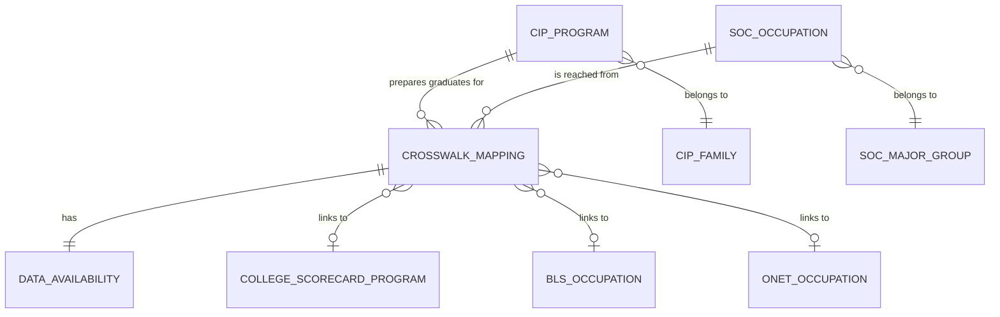

# Conceptual Model: crosswalk-cip-soc

**Status:** APPROVED
**Mode:** Greenfield
**Zone:** Silver (Base)
**Domain:** Program-to-Occupation Taxonomy Bridge
**Spec:** docs/specs/crosswalk-cip-soc.md
**Author:** @semantic-modeler
**Date:** 2026-04-08
**Approval:** APPROVED by human (2026-04-08)

---



---

## Entity Descriptions

| Entity | Business Concept | Business Term | Is CDE | Is PII |
|--------|-----------------|---------------|--------|--------|
| CIP Program | An academic program identified by a 6-digit CIP code (XX.XXXX) in the NCES classification taxonomy. Represents a distinct field of study that students can pursue at postsecondary institutions. One program can prepare graduates for multiple occupations. | BT-003 | true | false |
| SOC Occupation | A distinct occupation identified by a 6-digit SOC code (XX-XXXX) in the OMB Standard Occupational Classification taxonomy. Represents a job category that graduates may enter. One occupation can be reached from multiple programs. | BT-027 | true | false |
| CIP Family | A broad discipline area identified by the 2-digit prefix of a CIP code (e.g., 52 = Business). Groups related programs for aggregation and reporting. | BT-005 | false | false |
| SOC Major Group | One of 22 broad occupation families identified by the 2-digit prefix of a SOC code (e.g., 15 = Computer and Mathematical). Groups related occupations for aggregation and fallback matching. | BT-029 | false | false |
| Crosswalk Mapping | A single CIP-to-SOC pairing from the NCES/BLS crosswalk, asserting that a given academic program typically prepares graduates for a given occupation. This is the bridge entity that connects the program taxonomy to the occupation taxonomy. Based on expert judgment, not empirical employment data. | BT-073 | true | false |
| Data Availability | The assessed join-readiness and overall match quality of a crosswalk mapping, indicating which downstream data sources (College Scorecard, BLS OOH, O*NET) have data for the mapping's CIP and SOC codes. Determines what FutureProof stats can be computed for a given program-occupation pair. | BT-076 | false | false |
| College Scorecard Program | An existing program record in base.college_scorecard, representing a school-major combination with earnings outcome data. External to this model; referenced for join-readiness assessment. | BT-003 | true | false |
| BLS Occupation | An existing occupation record in base.bls_ooh, representing an occupation with employment projections and wage data. External to this model; referenced for join-readiness assessment. | BT-027 | true | false |
| O*NET Occupation | An existing occupation record in base.onet_occupations, representing an occupation with task, activity, and work context profile data. External to this model; referenced for join-readiness assessment. | BT-027 | false | false |

---

## Relationship Descriptions

| Relationship | From | To | Cardinality | Description |
|-------------|------|-----|-------------|-------------|
| prepares graduates for | CIP Program | Crosswalk Mapping | one-to-many | One CIP program can map to multiple occupations. A CIP program with no valid SOC match (SOC 99-9999 "No Match Sentinel") is excluded from the Silver crosswalk entirely. |
| is reached from | SOC Occupation | Crosswalk Mapping | one-to-many | One SOC occupation can be reached from multiple programs. Not every SOC code appears in the crosswalk (some occupations do not require postsecondary education). |
| has | Crosswalk Mapping | Data Availability | one-to-one | Every crosswalk mapping has exactly one data availability assessment, derived from lookups against the three downstream Silver tables. |
| belongs to (CIP) | CIP Program | CIP Family | many-to-one | Each CIP program belongs to exactly one CIP family, derived from the first 2 digits of the CIP code. |
| belongs to (SOC) | SOC Occupation | SOC Major Group | many-to-one | Each SOC occupation belongs to exactly one SOC major group, derived from the first 2 digits of the SOC code. |
| links to (Scorecard) | Crosswalk Mapping | College Scorecard Program | many-to-zero-or-one | A mapping's CIP code may or may not have matching program data in College Scorecard. Multiple mappings can share the same CIP code. |
| links to (BLS) | Crosswalk Mapping | BLS Occupation | many-to-zero-or-one | A mapping's SOC code may or may not have matching occupation data in BLS OOH. Multiple mappings can share the same SOC code. |
| links to (O*NET) | Crosswalk Mapping | O*NET Occupation | many-to-zero-or-one | A mapping's SOC code may or may not have matching occupation data in O*NET. Multiple mappings can share the same SOC code. |

---

## Key Business Concepts

### Grain

The fundamental unit of analysis is the **Crosswalk Mapping**: a single CIP-SOC pairing (cipcode x soc_code). Every row in the base table represents one assertion that a program prepares graduates for an occupation. The grain is enforced as the composite key of cipcode + soc_code with zero duplicates allowed. Expected row count: 3,000-5,000 pairings.

### Many-to-Many Bridge Pattern

The crosswalk is a classic many-to-many associative entity:
- **One CIP, many SOCs:** Business Administration (CIP 52.0201) maps to General and Operations Managers (SOC 11-1021), Financial Analysts (SOC 13-2051), Marketing Managers (SOC 11-2021), and others. A student choosing this major sees a "career distribution" of possible outcomes.
- **One SOC, many CIPs:** Software Developers (SOC 15-1252) can be reached from Computer Science (CIP 11.0701), Software Engineering (CIP 14.0903), Information Technology (CIP 11.0103), and others. Multiple programs lead to the same career.

This fan-out is fundamental to FutureProof's design. The crosswalk does not assign weights or probabilities to pairings -- every mapping is treated equally. Confidence differentiation comes from the match quality classification, not from the mapping itself.

### No Match Sentinel (BT-074)

CIP programs that have no corresponding occupation in the SOC taxonomy are coded with SOC 99-9999 ("No Match") in the source crosswalk file. These represent programs that are not career-oriented or do not map to specific occupations (e.g., Liberal Arts, General Studies). No-match rows are excluded from the Silver crosswalk because they carry no join value. This is a filtering rule, not a data quality issue -- the absence of a mapping is an intentional classification by NCES/BLS statisticians.

### Join-Readiness Flags (BT-075)

Each crosswalk mapping is assessed against three existing Silver base tables to determine which downstream data sources can be reached through this pairing:
- **has_scorecard_match:** Does this CIP code have actual program outcome data in College Scorecard?
- **has_bls_match:** Does this SOC code have employment projection data in BLS OOH?
- **has_onet_match:** Does this SOC code have occupation profile data in O*NET?

These flags are derived at Silver transformation time by performing lookups against the three tables. They are informational -- all mappings are preserved regardless of flag values.

### Match Quality (BT-076)

A derived categorical classification computed from the three join-readiness flags. Five tiers define the data completeness of each crosswalk pairing:

| Quality | Meaning | FutureProof Impact |
|---------|---------|-------------------|
| **full** | All three sources match | All stats computable (ERN, GRW, HMN, Burnout, Market). Best quality. Expected to be the plurality. |
| **partial_no_onet** | Scorecard + BLS match, no O*NET | Missing HMN and Burnout scores. Growth and earnings available. |
| **partial_no_bls** | Scorecard + O*NET match, no BLS | Missing growth projections and market data. Task profiles available. |
| **scorecard_only** | Only Scorecard matches | Only earnings/ROI computable. No occupation-level data. |
| **no_scorecard** | No Scorecard match | Valid crosswalk pair but unreachable by student queries (no school+major data to trigger the lookup). |

Match quality drives downstream confidence scoring and determines which FutureProof statistics can be computed for a given program-occupation pair.

### Expert Judgment Basis

The crosswalk mappings are based on expert judgment by NCES and BLS statisticians, NOT empirical data on actual graduate employment. The crosswalk says "this program typically prepares graduates for these occupations," not "this is where graduates actually end up." This distinction is important for downstream consumers and should be communicated in career guidance products. The crosswalk is authoritative for its purpose but does not reflect labor market reality with precision.

### Taxonomy Versions

The current crosswalk maps CIP 2020 codes to SOC 2018 codes. These taxonomies are updated on approximately 10-year cycles. The crosswalk is a static reference artifact, not a time-series dataset. No temporal modeling is required.

---

## Cross-Source Integration Role

This crosswalk is the central integration mechanism in the FutureProof pipeline. It is the only path connecting program data to occupation data:

```
Student query: "Indiana State University + Business Administration"
       |
       v
base.college_scorecard (cipcode = "52.0201")
       |
       v
base.cip_soc_crosswalk  <--- THIS MODEL
       |
       +---> SOC 11-1021 ---> base.bls_ooh ---> Growth, Wages
       |                  \--> base.onet_occupations ---> Tasks, Context
       |
       +---> SOC 13-1111 ---> base.bls_ooh ---> Growth, Wages
       |                  \--> base.onet_occupations ---> Tasks, Context
       |
       +---> SOC 13-2051 ---> base.bls_ooh ---> Growth, Wages
                           \--> base.onet_occupations ---> Tasks, Context
```

Without this crosswalk, the three data sources are islands. With it, the full FutureProof loop is possible: school + major leads to career distribution leads to outcome stats leads to career guidance.

---

## Modeling Decisions

1. **Crosswalk Mapping as the central entity.** The grain of this dataset is the CIP-SOC pairing, not the CIP code or the SOC code individually. The crosswalk mapping is a first-class associative entity, not a mere junction table, because it carries its own derived attributes (match flags, match quality) and represents a meaningful business assertion.

2. **CIP Program and SOC Occupation as distinct entities.** Even though the crosswalk file contains CIP and SOC codes as columns, they represent independent taxonomies published by different agencies. Modeling them as separate entities (rather than embedding them as attributes of the mapping) correctly represents the many-to-many cardinality and enables the relationship labels that make the diagram readable.

3. **Data Availability as a separate entity.** The three join-readiness flags and the derived match quality classification form a cohesive concept -- "how much downstream data is available for this mapping." Separating this from the mapping identity itself clarifies that data availability is an assessed property that may change as the upstream Silver tables evolve (e.g., if O*NET adds new occupations, has_onet_match may flip from false to true).

4. **External tables as reference entities.** College Scorecard, BLS OOH, and O*NET are shown in the diagram as external entities that the crosswalk links to, not as entities owned by this model. This clarifies the integration role without duplicating the modeling done in those specs.

5. **CIP Family and SOC Major Group as classification entities.** Both are derived from their respective codes and represent meaningful aggregation levels used for reporting and fallback matching. They parallel the modeling decisions in the College Scorecard and BLS OOH conceptual models.

6. **No weighting or probability entity.** The crosswalk treats all CIP-SOC pairings equally. There is no concept of "primary occupation" vs. "secondary occupation" for a given program. Any confidence differentiation comes from match quality, not from the mapping relationship itself. A future Gold-zone enhancement could add empirical weights from Census data, but that is out of scope for this spec.

7. **No temporal entity.** The crosswalk is a static reference mapping (CIP 2020 x SOC 2018). It does not change over time within a taxonomy cycle. Source load date and ingestion timestamp are pipeline metadata, not business dimensions.

---

## Scope and Boundaries

- This conceptual model covers the `base.cip_soc_crosswalk` table in the Silver zone
- Bronze zone raw data (`raw.cip_soc_crosswalk`) is the source but is not modeled here (raw is physical-only per Brightsmith rules)
- The three downstream Silver tables (base.college_scorecard, base.bls_ooh, base.onet_occupations) are referenced as external entities for join-readiness assessment but are modeled in their own specs
- Gold zone products that consume the crosswalk join chain are downstream and not part of this model
- CIP granularity mismatch handling (4-digit vs. 6-digit) is explicitly deferred to a Gold-zone enrichment spec
- No-match rows (SOC 99-9999) are documented here as a business rule but are excluded from the Silver table
