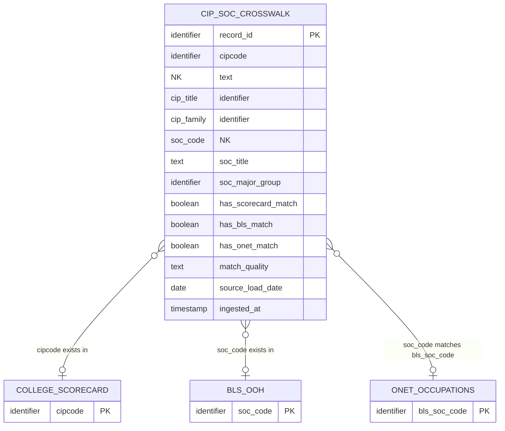

# Logical Model: crosswalk-cip-soc

**Status:** APPROVED
**Mode:** Greenfield
**Zone:** Silver (Base)
**Domain:** Program-to-Occupation Taxonomy Bridge
**Spec:** docs/specs/crosswalk-cip-soc.md
**Conceptual Model:** governance/models/crosswalk-cip-soc-conceptual.md
**Author:** @semantic-modeler
**Date:** 2026-04-08
**Approval:** APPROVED by human (2026-04-08)

---



---

## Design Rationale: Single Denormalized Table

The conceptual model identifies 8 entities (CIP Program, SOC Occupation, CIP Family, SOC Major Group, Crosswalk Mapping, Data Availability, and 3 external reference entities). Per the Silver Base zone pattern, these are flattened into a single denormalized `base.cip_soc_crosswalk` table. The conceptual entities inform attribute grouping below but do not produce separate tables.

This is appropriate because:
1. The source data is already at the cipcode x soc_code grain with all attributes derivable from a single row
2. CIP Family and SOC Major Group are deterministic derivations from their parent codes (substring extraction), not independent lookup dimensions
3. Data Availability (match flags + match quality) is a computed assessment on each row, not a separate entity at the physical level
4. The three external tables (College Scorecard, BLS OOH, O*NET) are referenced only for flag derivation via EXISTS lookups -- they are not joined into this table
5. This matches the established pattern from `base.college_scorecard` and `base.bls_ooh` (single denormalized table with conceptual entities as attribute groups)

---

## Grain and Uniqueness

| Property | Value |
|----------|-------|
| **Grain** | One row per valid CIP-SOC pairing: a single cipcode + soc_code combination from the NCES crosswalk, excluding no-match sentinels |
| **Natural key fields** | `cipcode`, `soc_code` (composite) |
| **Surrogate key** | `record_id` (deterministic hash of natural key via `compute_grain_id(row, ['cipcode', 'soc_code'], prefix='xw')`) |
| **Uniqueness constraint** | Zero duplicates on (cipcode, soc_code). Enforced at load time. |
| **Expected cardinality** | 3,000-5,000 rows (after filtering out no-match rows) |

---

## Attribute Definitions

Attributes are grouped by the conceptual entity they originate from. The `NK` marker denotes natural key components.

### Crosswalk Mapping (Core Identity)

| Attribute | Business Term | Type Domain | Nullable | Is CDE | Is PII | Description |
|-----------|--------------|-------------|----------|--------|--------|-------------|
| record_id | BT-015 | identifier | NOT NULL | false | false | Deterministic surrogate key computed from the composite natural key (cipcode, soc_code) using `compute_grain_id()` with prefix 'xw'. Stable across pipeline re-runs. |
| cipcode | BT-003 | identifier | NOT NULL | true | false | CIP code in XX.XXXX format identifying the academic program side of this crosswalk pairing. Composite natural key component (1 of 2). Join key to `base.college_scorecard.cipcode`. |
| cip_title | BT-004 | text | NOT NULL | false | false | Program name from the NCES crosswalk source file. Human-readable label for the CIP code. Not used for joins. |
| soc_code | BT-027 | identifier | NOT NULL | true | false | SOC code in XX-XXXX format identifying the occupation side of this crosswalk pairing. Composite natural key component (2 of 2). Join key to `base.bls_ooh.soc_code` and `base.onet_occupations.bls_soc_code`. |
| soc_title | BT-028 | text | NOT NULL | false | false | Occupation name from the NCES crosswalk source file. Human-readable label for the SOC code. Not used for joins. |

### CIP Family (Classification)

| Attribute | Business Term | Type Domain | Nullable | Is CDE | Is PII | Description |
|-----------|--------------|-------------|----------|--------|--------|-------------|
| cip_family | BT-005 | identifier | NOT NULL | false | false | 2-digit CIP family code derived from the first 2 characters of cipcode (e.g., "52" from "52.0201"). Groups related programs for aggregation. Matches `base.college_scorecard.cip_family`. |

### SOC Major Group (Classification)

| Attribute | Business Term | Type Domain | Nullable | Is CDE | Is PII | Description |
|-----------|--------------|-------------|----------|--------|--------|-------------|
| soc_major_group | BT-029 | identifier | NOT NULL | false | false | 2-digit SOC major group code derived from the first 2 characters of soc_code (e.g., "11" from "11-1021"). One of 22 valid major group codes. Groups related occupations for aggregation. Matches `base.bls_ooh.soc_major_group`. |

### Data Availability (Join-Readiness Assessment)

| Attribute | Business Term | Type Domain | Nullable | Is CDE | Is PII | Description |
|-----------|--------------|-------------|----------|--------|--------|-------------|
| has_scorecard_match | BT-075 | boolean | NOT NULL | false | false | True if this crosswalk pairing's cipcode exists in at least one row of `base.college_scorecard`. Indicates actual program outcome data is available for this CIP code. Derived via EXISTS lookup. |
| has_bls_match | BT-075 | boolean | NOT NULL | false | false | True if this crosswalk pairing's soc_code exists in `base.bls_ooh`. Indicates BLS employment projection and wage data is available for this SOC code. Derived via EXISTS lookup. |
| has_onet_match | BT-075 | boolean | NOT NULL | false | false | True if this crosswalk pairing's soc_code exists in `base.onet_occupations` (matched on `bls_soc_code`). Indicates O*NET task/activity/context profile data is available for this SOC code. Derived via EXISTS lookup. |
| match_quality | BT-076 | text | NOT NULL | true | false | Derived categorical classification computed from the three join-readiness flags. One of five values: 'full', 'partial_no_onet', 'partial_no_bls', 'scorecard_only', 'no_scorecard'. Determines which FutureProof stats can be computed for this pairing. See Derivation Rules. |

### Pipeline Metadata

| Attribute | Business Term | Type Domain | Nullable | Is CDE | Is PII | Description |
|-----------|--------------|-------------|----------|--------|--------|-------------|
| source_load_date | BT-016 | date | NOT NULL | false | false | Date the source crosswalk data was loaded into the Bronze zone. Represents data fetch date. Renamed from Bronze `load_date`. |
| ingested_at | BT-017 | timestamp | NOT NULL | false | false | Timestamp when the row was written to the Silver zone base table. Generated at transformation time. Used for pipeline auditing and data freshness tracking. |

---

## Attribute Summary

| Count | Category |
|-------|----------|
| 14 | Total attributes |
| 2 | Natural key components (cipcode, soc_code) |
| 1 | Surrogate key (record_id) |
| 3 | CDE attributes (cipcode, soc_code, match_quality) |
| 0 | PII attributes |
| 0 | Nullable attributes |
| 14 | NOT NULL attributes |
| 6 | Derived attributes (record_id, cip_family, soc_major_group, has_scorecard_match, has_bls_match, has_onet_match, match_quality) |

---

## Type Domain Definitions

These are logical type categories, not physical implementations. Physical model will map these to DuckDB types.

| Domain | Semantics | Physical Expectation |
|--------|-----------|---------------------|
| identifier | A code or key used for lookup or joins. Not aggregated. | VARCHAR |
| text | A human-readable label or description. Not used for joins. | VARCHAR |
| boolean | A true/false flag derived from business rules or cross-table lookups. | BOOLEAN |
| date | A calendar date without time component. | DATE |
| timestamp | A point in time with timezone context. | TIMESTAMP |

---

## Derivation Rules

| Derived Attribute | Rule | Source Attributes |
|-------------------|------|-------------------|
| record_id | `compute_grain_id(row, ['cipcode', 'soc_code'], prefix='xw')` | cipcode, soc_code |
| cip_family | First 2 characters of cipcode: `cipcode[:2]` | cipcode |
| soc_major_group | First 2 characters of soc_code: `soc_code[:2]` | soc_code |
| has_scorecard_match | `EXISTS (SELECT 1 FROM base.college_scorecard cs WHERE cs.cipcode = xw.cipcode)` | cipcode, base.college_scorecard |
| has_bls_match | `EXISTS (SELECT 1 FROM base.bls_ooh bls WHERE bls.soc_code = xw.soc_code)` | soc_code, base.bls_ooh |
| has_onet_match | `EXISTS (SELECT 1 FROM base.onet_occupations onet WHERE onet.bls_soc_code = xw.soc_code)` | soc_code, base.onet_occupations |
| match_quality | CASE expression over the three flags (see Match Quality Derivation below) | has_scorecard_match, has_bls_match, has_onet_match |

### Match Quality Derivation

The match_quality value is determined by evaluating the three join-readiness flags in priority order:

```
CASE
  WHEN NOT has_scorecard_match
    THEN 'no_scorecard'
  WHEN has_scorecard_match AND has_bls_match AND has_onet_match
    THEN 'full'
  WHEN has_scorecard_match AND has_bls_match AND NOT has_onet_match
    THEN 'partial_no_onet'
  WHEN has_scorecard_match AND NOT has_bls_match AND has_onet_match
    THEN 'partial_no_bls'
  WHEN has_scorecard_match AND NOT has_bls_match AND NOT has_onet_match
    THEN 'scorecard_only'
END
```

| Quality | has_scorecard_match | has_bls_match | has_onet_match | FutureProof Stats Available |
|---------|--------------------|--------------|--------------|-----------------------------|
| full | true | true | true | ERN, GRW, HMN, Burnout, Market -- all stats computable |
| partial_no_onet | true | true | false | ERN, GRW, Market -- missing HMN and Burnout |
| partial_no_bls | true | false | true | ERN, HMN, Burnout -- missing GRW and Market |
| scorecard_only | true | false | false | ERN only -- no occupation-level data |
| no_scorecard | false | any | any | Unreachable by student queries (no program data) |

---

## Validation Rules

| Rule | Attribute | Pattern / Constraint | Action on Failure |
|------|-----------|---------------------|-------------------|
| CIP format | cipcode | Regex: `^\d{2}\.\d{4}$` (XX.XXXX) | Reject row -- invalid CIP code |
| SOC format | soc_code | Regex: `^\d{2}-\d{4}$` (XX-XXXX) | Reject row -- invalid SOC code |
| No-match exclusion | soc_code | Must NOT equal "99-9999" | Exclude row (filter, not error) |
| CIP family valid | cip_family | 2-digit string derived from valid cipcode | Enforced by CIP format validation |
| SOC major group valid | soc_major_group | 2-digit string, one of 22 valid SOC major group codes (11, 13, 15, 17, 19, 21, 23, 25, 27, 29, 31, 33, 35, 37, 39, 41, 43, 45, 47, 49, 51, 53) | Reject row -- SOC code has invalid major group prefix |
| Match quality domain | match_quality | One of: 'full', 'partial_no_onet', 'partial_no_bls', 'scorecard_only', 'no_scorecard' | Pipeline error -- derivation logic bug |
| Grain uniqueness | cipcode, soc_code | Zero duplicate (cipcode, soc_code) pairs | Reject duplicate -- take first occurrence |

---

## Filtering Logic

The Silver table excludes rows from Bronze based on one rule:

| Filter | Condition | Rationale |
|--------|-----------|-----------|
| No-match sentinel | `soc_code = '99-9999'` | These CIP codes have no SOC correspondence per NCES/BLS expert classification. They carry no join value and cannot link to BLS or O*NET data. This is a business rule, not a data quality issue. |

All other rows are preserved, including those where `has_scorecard_match = false`. These are valid crosswalk relationships that may become useful as College Scorecard coverage expands.

---

## Join Specifications

The three join-readiness flags require lookups against existing Silver base tables. These are EXISTS-style lookups, not full joins -- no columns are pulled from the target tables.

### has_scorecard_match Lookup

| Property | Value |
|----------|-------|
| **Source** | `base.cip_soc_crosswalk` (this table) |
| **Target** | `base.college_scorecard` |
| **Join key** | `crosswalk.cipcode = college_scorecard.cipcode` |
| **Semantics** | True if at least one row in College Scorecard has this CIP code. College Scorecard has multiple rows per CIP (one per school x credential), so use EXISTS or DISTINCT, not a full join. |
| **Expected match rate** | 60-90% of crosswalk rows |

### has_bls_match Lookup

| Property | Value |
|----------|-------|
| **Source** | `base.cip_soc_crosswalk` (this table) |
| **Target** | `base.bls_ooh` |
| **Join key** | `crosswalk.soc_code = bls_ooh.soc_code` |
| **Semantics** | True if this SOC code exists in the BLS OOH base table. BLS OOH has one row per SOC code, so the lookup is 1:0..1. |
| **Expected match rate** | 70-95% of crosswalk rows |

### has_onet_match Lookup

| Property | Value |
|----------|-------|
| **Source** | `base.cip_soc_crosswalk` (this table) |
| **Target** | `base.onet_occupations` |
| **Join key** | `crosswalk.soc_code = onet_occupations.bls_soc_code` |
| **Semantics** | True if this SOC code exists in O*NET occupations (note: O*NET uses `bls_soc_code` as the column name for the BLS-compatible SOC code, not `soc_code`). |
| **Expected match rate** | 65-90% of crosswalk rows |

---

## Nullability Semantics

All attributes in this model are NOT NULL. This is a conscious design choice:

| Pattern | Rationale |
|---------|-----------|
| All source fields NOT NULL | The crosswalk source file has no missing values -- every row has a CIP code, CIP title, SOC code, and SOC title. Rows with sentinel values (99-9999) are filtered out, not nulled. |
| All derived fields NOT NULL | cip_family and soc_major_group are deterministic substrings of valid codes. Match flags are boolean (never null). match_quality is exhaustively derived from the flags. |
| Pipeline metadata NOT NULL | source_load_date and ingested_at are generated by the pipeline. |

If a row cannot satisfy NOT NULL constraints (e.g., invalid CIP format that prevents cip_family derivation), it is rejected by validation rules, not stored with nulls.

---

## Traceability: Conceptual to Logical

| Conceptual Entity | Logical Attributes | Notes |
|-------------------|--------------------|-------|
| CIP Program | cipcode, cip_title | CIP code is a natural key component and CDE. Title is the human-readable label from the crosswalk source. |
| SOC Occupation | soc_code, soc_title | SOC code is a natural key component and CDE. Title is the human-readable label from the crosswalk source. |
| CIP Family | cip_family | Derived from cipcode via substring. Classification attribute for aggregation. |
| SOC Major Group | soc_major_group | Derived from soc_code via substring. Classification attribute for aggregation. |
| Crosswalk Mapping | record_id, cipcode, soc_code | The composite grain. record_id is the surrogate key. The CIP-SOC pair is the natural key. |
| Data Availability | has_scorecard_match, has_bls_match, has_onet_match, match_quality | Four attributes capturing the join-readiness assessment. Match quality is derived from the three flags. |
| College Scorecard Program | (external) | Referenced via EXISTS lookup on cipcode. No columns pulled. |
| BLS Occupation | (external) | Referenced via EXISTS lookup on soc_code. No columns pulled. |
| O*NET Occupation | (external) | Referenced via EXISTS lookup on soc_code = bls_soc_code. No columns pulled. |
| (Pipeline Metadata) | source_load_date, ingested_at | Not a conceptual entity -- pipeline infrastructure. |

---

## Cross-Source Integration

This table is the central bridge in the FutureProof pipeline. Key join paths enabled:

| From | Through | To | Join Key | Purpose |
|------|---------|-----|----------|---------|
| base.college_scorecard | base.cip_soc_crosswalk | base.bls_ooh | cipcode -> soc_code | Connect program earnings to occupation growth/wage projections |
| base.college_scorecard | base.cip_soc_crosswalk | base.onet_occupations | cipcode -> soc_code = bls_soc_code | Connect program earnings to occupation task/context profiles |
| base.bls_ooh | base.cip_soc_crosswalk | base.college_scorecard | soc_code -> cipcode | Reverse lookup: which programs lead to this occupation |

The match_quality attribute enables downstream consumers to filter or weight results based on data completeness before attempting these joins.

---

## Modeling Decisions

1. **Single denormalized table.** All conceptual entities flatten into one table. CIP Family and SOC Major Group are deterministic derivations, Data Availability is a computed assessment, and the external entities are referenced via lookups only. No separate dimension tables are needed. This matches the established Silver Base pattern from College Scorecard and BLS OOH specs.

2. **Composite natural key.** Unlike the other Silver Base tables (which have single-field natural keys: unitid+cipcode+credlev for Scorecard, soc_code for BLS OOH), this table uses a two-field composite natural key (cipcode, soc_code). This correctly represents the many-to-many grain -- neither field alone is unique.

3. **cipcode and soc_code as CDEs.** Both taxonomy codes are Critical Data Elements because they are the join keys that connect the entire FutureProof pipeline. An error in either code breaks the downstream join chain.

4. **match_quality as CDE.** The match quality classification drives downstream confidence scoring and determines which FutureProof stats can be computed. An error in the derivation logic would silently degrade career guidance quality.

5. **EXISTS over JOIN for flag derivation.** The three match flags use EXISTS/IN lookups rather than LEFT JOINs to avoid row multiplication. College Scorecard has multiple rows per CIP (one per school x credential), so a naive LEFT JOIN would fan out crosswalk rows. EXISTS returns a single boolean per crosswalk row.

6. **SOC title from crosswalk source, not BLS OOH.** The soc_title value comes from the NCES crosswalk file, not from base.bls_ooh. These titles may differ slightly (NCES vs. BLS labeling). The crosswalk title is authoritative for this table; downstream Gold products may prefer the BLS OOH title for display.

7. **No CIP Family Name or SOC Major Group Name.** Unlike base.bls_ooh (which carries soc_major_group_name), this table does not include human-readable names for the classification codes. The crosswalk source file does not provide them, and deriving them would require a lookup table not part of this spec. Downstream Gold products can join to the respective base tables for display labels.

8. **All fields NOT NULL.** The crosswalk source data has no missing values, and all derived fields are deterministic. Nullable semantics are unnecessary. Invalid rows are rejected by validation, not stored with nulls.

---

## Open Issues

| # | Issue | Impact | Resolution Path |
|---|-------|--------|----------------|
| 1 | SOC title may differ between crosswalk source and base.bls_ooh | Low -- display label only, not used for joins. Could confuse downstream consumers if both are shown side-by-side. | Document in data contract. Gold products should prefer BLS OOH title for occupation display. |
| 2 | CIP title may differ between crosswalk source and base.college_scorecard | Low -- same pattern as SOC title. NCES crosswalk uses CIP taxonomy titles; College Scorecard uses CIPDESC from IPEDS. | Document in data contract. Gold products should prefer College Scorecard title for program display. |
| 3 | O*NET join key uses bls_soc_code, not soc_code | Medium -- column name mismatch could cause implementation errors. The O*NET base table uses `bls_soc_code` as the BLS-compatible SOC code field, not `soc_code`. | Explicitly documented in Join Specifications. Implementation must use `onet_occupations.bls_soc_code`, not `onet_occupations.soc_code` (which is the O*NET-specific code). |
