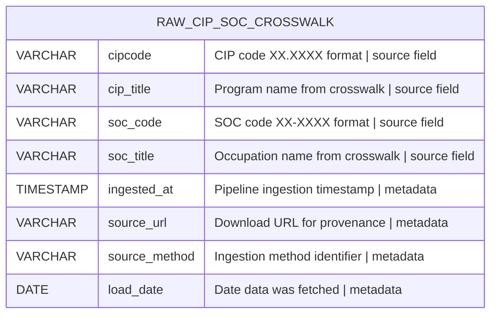
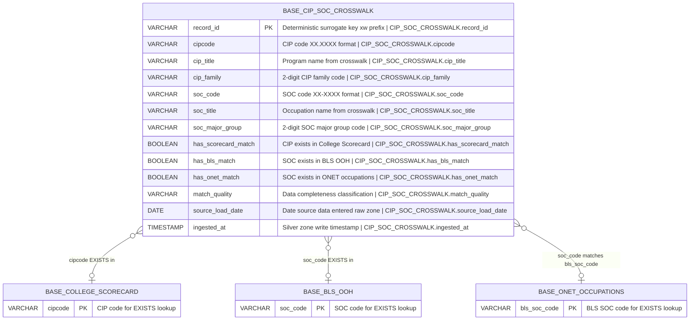

# Physical Model: crosswalk-cip-soc

**Status:** APPROVED
**Mode:** Greenfield
**Zone:** Bronze (Raw) + Silver (Base)
**Domain:** Program-to-Occupation Taxonomy Bridge
**Spec:** docs/specs/crosswalk-cip-soc.md
**Logical Model:** governance/models/crosswalk-cip-soc-logical.md
**Conceptual Model:** governance/models/crosswalk-cip-soc-conceptual.md
**Author:** @semantic-modeler
**Date:** 2026-04-08
**Approval:** APPROVED by human (2026-04-08)

---

## Bronze Table: raw.cip_soc_crosswalk



### Bronze Table Definition

| Property | Value |
|----------|-------|
| **Catalog table** | `raw.cip_soc_crosswalk` |
| **Format** | Apache Iceberg (v2) |
| **Engine** | DuckDB (via `iceberg_scan`) |
| **Grain** | One row per CIP-SOC pairing (cipcode x soc_code) |
| **Natural key** | `cipcode`, `soc_code` (composite) |
| **Expected row count** | 5,500-6,500 (includes no-match sentinel rows) |
| **Partition strategy** | None (small reference table) |
| **Sort order** | `cipcode ASC, soc_code ASC` |
| **Write pattern** | Full table replace via `brightsmith.infra.promote.promote()` (idempotent) |
| **Source format** | XLSX (single sheet, 4 columns) |
| **Source URL** | `https://nces.ed.gov/ipeds/cipcode/Files/CIP2020_SOC2018_Crosswalk.xlsx` |
| **Fallback cache** | `data/raw/xlsx_cache/CIP2020_SOC2018_Crosswalk.xlsx` |

### Bronze Column Definitions

| Column | DuckDB Type | Nullable | Description |
|--------|-------------|----------|-------------|
| cipcode | VARCHAR | NOT NULL | CIP code in XX.XXXX format. Parsed from XLSX column "CIP Code". |
| cip_title | VARCHAR | NOT NULL | Program name. Parsed from XLSX column "CIP Title". |
| soc_code | VARCHAR | NOT NULL | SOC code in XX-XXXX format (includes 99-9999 no-match sentinel). Parsed from XLSX column "SOC Code". |
| soc_title | VARCHAR | NOT NULL | Occupation name (includes "No Match" sentinel text). Parsed from XLSX column "SOC Title". |
| ingested_at | TIMESTAMP | NOT NULL | Timestamp when the row was written to the Bronze table. Generated at ingestion time. |
| source_url | VARCHAR | NOT NULL | The URL from which the XLSX was downloaded. Constant for all rows in a load. |
| source_method | VARCHAR | NOT NULL | Always "xlsx_download". Identifies the ingestion mechanism. |
| load_date | DATE | NOT NULL | Date the source data was fetched. |

### Bronze Ingestor

| Property | Value |
|----------|-------|
| **Class** | `CipSocCrosswalkIngestor` (extends `BaseIngestor`) |
| **Module** | `src/raw/cip_soc_crosswalk_ingestor.py` |
| **Parse library** | `openpyxl` |
| **Data flow** | Download XLSX -> openpyxl parse -> extract 4 data columns -> add metadata fields -> promote to `raw.cip_soc_crosswalk` |
| **Fallback** | If download fails, read from `data/raw/xlsx_cache/CIP2020_SOC2018_Crosswalk.xlsx` |

---

## Silver Table: base.cip_soc_crosswalk



---

## Silver Table Definition

| Property | Value |
|----------|-------|
| **Catalog table** | `base.cip_soc_crosswalk` |
| **Format** | Apache Iceberg (v2) |
| **Engine** | DuckDB (via `iceberg_scan`) |
| **Grain** | One row per valid CIP-SOC pairing (cipcode x soc_code), excluding no-match sentinels |
| **Natural key** | `cipcode`, `soc_code` (composite) |
| **Surrogate key** | `record_id` (deterministic SHA-256 hash, prefix `xw`) |
| **Expected row count** | 5,500-6,500 (after filtering out soc_code = '99-9999') |
| **Partition strategy** | None (small reference table, <5,000 rows) |
| **Sort order** | `cipcode ASC, soc_code ASC` |
| **Write pattern** | Full table replace via `brightsmith.infra.promote.promote()` (idempotent, grain-based dedup) |

---

## Silver Column Definitions

### Crosswalk Mapping (Core Identity)

| Column | DuckDB Type | Nullable | Default | Constraint | Business Term | Is CDE | Is PII | Description |
|--------|-------------|----------|---------|------------|---------------|--------|--------|-------------|
| record_id | VARCHAR | NOT NULL | derived | PRIMARY KEY | BT-015 | false | false | Deterministic surrogate key: `compute_grain_id(row, ['cipcode', 'soc_code'], prefix='xw')`. Format: `xw-<16 hex chars>`. Stable across pipeline re-runs. |
| cipcode | VARCHAR | NOT NULL | -- | UNIQUE(cipcode, soc_code); CHECK (cipcode ~ '^\d{2}\.\d{4}$') | BT-003 | true | false | CIP code in XX.XXXX format. Composite natural key (1 of 2). Join key to `base.college_scorecard.cipcode`. Must be treated as string, never float. |
| cip_title | VARCHAR | NOT NULL | -- | -- | BT-004 | false | false | Program name from the NCES crosswalk source file. Human-readable label for the CIP code. Not used for joins. |
| soc_code | VARCHAR | NOT NULL | -- | UNIQUE(cipcode, soc_code); CHECK (soc_code ~ '^\d{2}-\d{4}$') | BT-027 | true | false | SOC code in XX-XXXX format. Composite natural key (2 of 2). Join key to `base.bls_ooh.soc_code` and `base.onet_occupations.bls_soc_code`. No-match sentinel (99-9999) excluded at transformation time. |
| soc_title | VARCHAR | NOT NULL | -- | -- | BT-028 | false | false | Occupation name from the NCES crosswalk source file. Human-readable label for the SOC code. Not used for joins. |

### CIP Family (Classification)

| Column | DuckDB Type | Nullable | Default | Constraint | Business Term | Is CDE | Is PII | Description |
|--------|-------------|----------|---------|------------|---------------|--------|--------|-------------|
| cip_family | VARCHAR | NOT NULL | -- | -- | BT-005 | false | false | 2-digit CIP family code derived from first 2 characters of cipcode (e.g., "52" from "52.0201"). Groups related programs for aggregation. Matches `base.college_scorecard.cip_family`. |

### SOC Major Group (Classification)

| Column | DuckDB Type | Nullable | Default | Constraint | Business Term | Is CDE | Is PII | Description |
|--------|-------------|----------|---------|------------|---------------|--------|--------|-------------|
| soc_major_group | VARCHAR | NOT NULL | -- | CHECK (soc_major_group IN ('11','13','15','17','19','21','23','25','27','29','31','33','35','37','39','41','43','45','47','49','51','53','55')) | BT-029 | false | false | 2-digit SOC major group code derived from first 2 characters of soc_code. One of 23 valid major group codes (22 civilian + 55 Military). Matches `base.bls_ooh.soc_major_group`. |

### Data Availability (Join-Readiness Assessment)

| Column | DuckDB Type | Nullable | Default | Constraint | Business Term | Is CDE | Is PII | Description |
|--------|-------------|----------|---------|------------|---------------|--------|--------|-------------|
| has_scorecard_match | BOOLEAN | NOT NULL | -- | -- | BT-075 | false | false | True if this cipcode exists in at least one row of `base.college_scorecard`. Derived via EXISTS lookup at transformation time. Expected 60-90% true. |
| has_bls_match | BOOLEAN | NOT NULL | -- | -- | BT-075 | false | false | True if this soc_code exists in `base.bls_ooh`. Derived via EXISTS lookup at transformation time. Expected 70-95% true. |
| has_onet_match | BOOLEAN | NOT NULL | -- | -- | BT-075 | false | false | True if this soc_code exists in `base.onet_occupations` (matched on `bls_soc_code`). Derived via EXISTS lookup at transformation time. Expected 65-90% true. |
| match_quality | VARCHAR | NOT NULL | -- | CHECK (match_quality IN ('full', 'partial_no_onet', 'partial_no_bls', 'scorecard_only', 'no_scorecard')) | BT-076 | true | false | Derived categorical classification computed from the three join-readiness flags. Determines which FutureProof stats can be computed for this pairing. |

### Pipeline Metadata

| Column | DuckDB Type | Nullable | Default | Constraint | Business Term | Is CDE | Is PII | Description |
|--------|-------------|----------|---------|------------|---------------|--------|--------|-------------|
| source_load_date | DATE | NOT NULL | -- | -- | BT-016 | false | false | Date the source crosswalk data was loaded into the Bronze zone. Renamed from Bronze `load_date`. |
| ingested_at | TIMESTAMP | NOT NULL | -- | -- | BT-017 | false | false | Timestamp when the row was written to the Silver zone base table. Generated at transformation time via `datetime.now()`. |

---

## Column Summary

| Count | Category |
|-------|----------|
| 14 | Total columns |
| 1 | Primary key (record_id) |
| 2 | Natural key components (cipcode, soc_code) |
| 3 | CDE columns (cipcode, soc_code, match_quality) |
| 0 | PII columns |
| 0 | Nullable columns |
| 14 | NOT NULL columns |
| 7 | Derived columns (record_id, cip_family, soc_major_group, has_scorecard_match, has_bls_match, has_onet_match, match_quality) |

---

## PyIceberg Schema Definitions

### Bronze Schema

```python
from pyiceberg.schema import Schema
from pyiceberg.types import (
    DateType,
    NestedField,
    StringType,
    TimestampType,
)

RAW_SCHEMA = Schema(
    NestedField(1, "cipcode", StringType(), required=True),
    NestedField(2, "cip_title", StringType(), required=True),
    NestedField(3, "soc_code", StringType(), required=True),
    NestedField(4, "soc_title", StringType(), required=True),
    NestedField(5, "ingested_at", TimestampType(), required=True),
    NestedField(6, "source_url", StringType(), required=True),
    NestedField(7, "source_method", StringType(), required=True),
    NestedField(8, "load_date", DateType(), required=True),
)
```

### Silver Schema

```python
from pyiceberg.schema import Schema
from pyiceberg.types import (
    BooleanType,
    DateType,
    NestedField,
    StringType,
    TimestampType,
)

BASE_SCHEMA = Schema(
    NestedField(1, "record_id", StringType(), required=True),
    NestedField(2, "cipcode", StringType(), required=True),
    NestedField(3, "cip_title", StringType(), required=True),
    NestedField(4, "cip_family", StringType(), required=True),
    NestedField(5, "soc_code", StringType(), required=True),
    NestedField(6, "soc_title", StringType(), required=True),
    NestedField(7, "soc_major_group", StringType(), required=True),
    NestedField(8, "has_scorecard_match", BooleanType(), required=True),
    NestedField(9, "has_bls_match", BooleanType(), required=True),
    NestedField(10, "has_onet_match", BooleanType(), required=True),
    NestedField(11, "match_quality", StringType(), required=True),
    NestedField(12, "source_load_date", DateType(), required=True),
    NestedField(13, "ingested_at", TimestampType(), required=True),
)
```

---

## Derivation Rules (Implementation Expressions)

These are the exact expressions the Silver transformer must implement.

| Column | Expression | Source Fields | Notes |
|--------|-----------|---------------|-------|
| record_id | `compute_grain_id(row, ['cipcode', 'soc_code'], prefix='xw')` | cipcode, soc_code | SHA-256 truncated to 16 hex chars. Output format: `xw-<hex>`. Import: `from brightsmith.infra.grain import compute_grain_id` |
| cip_family | `cipcode[:2]` | cipcode | First 2 characters of the XX.XXXX CIP code (before the dot). |
| soc_major_group | `soc_code[:2]` | soc_code | First 2 characters of the XX-XXXX SOC code (before the dash). |
| has_scorecard_match | `EXISTS (SELECT 1 FROM base.college_scorecard cs WHERE cs.cipcode = xw.cipcode)` | cipcode, base.college_scorecard | Use EXISTS or IN (SELECT DISTINCT cipcode), NOT a LEFT JOIN (College Scorecard has multiple rows per CIP). |
| has_bls_match | `EXISTS (SELECT 1 FROM base.bls_ooh bls WHERE bls.soc_code = xw.soc_code)` | soc_code, base.bls_ooh | BLS OOH has one row per SOC code; simple EXISTS suffices. |
| has_onet_match | `EXISTS (SELECT 1 FROM base.onet_occupations onet WHERE onet.bls_soc_code = xw.soc_code)` | soc_code, base.onet_occupations | Note: O*NET uses `bls_soc_code` as the column name, NOT `soc_code`. |
| match_quality | See CASE expression below | has_scorecard_match, has_bls_match, has_onet_match | Exhaustive 5-tier classification. |
| source_load_date | `CAST(raw.load_date AS DATE)` | load_date (raw) | Renamed from Bronze `load_date`. |
| ingested_at | `CURRENT_TIMESTAMP` | -- | Generated at Silver transformation time. |

### Match Quality CASE Expression

```sql
CASE
  WHEN NOT has_scorecard_match
    THEN 'no_scorecard'
  WHEN has_scorecard_match AND has_bls_match AND has_onet_match
    THEN 'full'
  WHEN has_scorecard_match AND has_bls_match AND NOT has_onet_match
    THEN 'partial_no_onet'
  WHEN has_scorecard_match AND NOT has_bls_match AND has_onet_match
    THEN 'partial_no_bls'
  WHEN has_scorecard_match AND NOT has_bls_match AND NOT has_onet_match
    THEN 'scorecard_only'
END
```

### Filtering Rule

| Filter | Condition | Action |
|--------|-----------|--------|
| No-match sentinel exclusion | `soc_code = '99-9999'` | Exclude row from Silver (filter, not error). These CIP codes have no SOC correspondence per NCES/BLS classification. |

---

## Source-to-Target Mapping

### Bronze: XLSX to raw.cip_soc_crosswalk

| Physical Column | DuckDB Type | XLSX Source Column | Transformation |
|-----------------|-------------|-------------------|----------------|
| cipcode | VARCHAR | "CIP Code" (Column A) | Direct. Parse as string, preserve XX.XXXX format. NEVER parse as float. |
| cip_title | VARCHAR | "CIP Title" (Column B) | Direct. Strip leading/trailing whitespace. |
| soc_code | VARCHAR | "SOC Code" (Column C) | Direct. Parse as string, preserve XX-XXXX format. |
| soc_title | VARCHAR | "SOC Title" (Column D) | Direct. Strip leading/trailing whitespace. |
| ingested_at | TIMESTAMP | -- (generated) | `datetime.now()` at ingestion time. |
| source_url | VARCHAR | -- (constant) | `"https://nces.ed.gov/ipeds/cipcode/Files/CIP2020_SOC2018_Crosswalk.xlsx"` |
| source_method | VARCHAR | -- (constant) | `"xlsx_download"` |
| load_date | DATE | -- (generated) | `date.today()` at ingestion time. |

### Silver: raw.cip_soc_crosswalk to base.cip_soc_crosswalk

| Physical Column | DuckDB Type | Source Table | Source Field | Transformation |
|-----------------|-------------|-------------|--------------|----------------|
| record_id | VARCHAR | -- | derived | `compute_grain_id(row, ['cipcode', 'soc_code'], prefix='xw')` |
| cipcode | VARCHAR | raw.cip_soc_crosswalk | cipcode | Direct (pass through, already XX.XXXX format). Validated: regex `^\d{2}\.\d{4}$`. |
| cip_title | VARCHAR | raw.cip_soc_crosswalk | cip_title | Direct. |
| cip_family | VARCHAR | -- | derived from cipcode | `cipcode[:2]` |
| soc_code | VARCHAR | raw.cip_soc_crosswalk | soc_code | Direct (pass through). Validated: regex `^\d{2}-\d{4}$`. Rows with '99-9999' excluded. |
| soc_title | VARCHAR | raw.cip_soc_crosswalk | soc_title | Direct. |
| soc_major_group | VARCHAR | -- | derived from soc_code | `soc_code[:2]` |
| has_scorecard_match | BOOLEAN | base.college_scorecard | cipcode | EXISTS lookup: true if cipcode found in base.college_scorecard |
| has_bls_match | BOOLEAN | base.bls_ooh | soc_code | EXISTS lookup: true if soc_code found in base.bls_ooh |
| has_onet_match | BOOLEAN | base.onet_occupations | bls_soc_code | EXISTS lookup: true if soc_code found in base.onet_occupations.bls_soc_code |
| match_quality | VARCHAR | -- | derived from flags | 5-tier CASE expression over has_scorecard_match, has_bls_match, has_onet_match |
| source_load_date | DATE | raw.cip_soc_crosswalk | load_date | Renamed, cast to DATE. |
| ingested_at | TIMESTAMP | -- | generated | `CURRENT_TIMESTAMP` at transformation time. |

---

## DDL (Reference)

This DDL is for documentation. The actual tables are created via `brightsmith.infra.promote.promote()`.

### Bronze DDL

```sql
-- Reference DDL for raw.cip_soc_crosswalk
-- Engine: DuckDB + Iceberg v2
-- Do not execute directly -- use promote() pattern

CREATE TABLE IF NOT EXISTS raw.cip_soc_crosswalk (
    cipcode         VARCHAR     NOT NULL,
    cip_title       VARCHAR     NOT NULL,
    soc_code        VARCHAR     NOT NULL,
    soc_title       VARCHAR     NOT NULL,
    ingested_at     TIMESTAMP   NOT NULL,
    source_url      VARCHAR     NOT NULL,
    source_method   VARCHAR     NOT NULL,
    load_date       DATE        NOT NULL,

    -- Grain uniqueness (enforced at load time, not by Iceberg)
    UNIQUE (cipcode, soc_code),

    -- Domain constraints
    CHECK (cipcode ~ '^\d{2}\.\d{4}$'),
    CHECK (soc_code ~ '^\d{2}-\d{4}$'),
    CHECK (source_method = 'xlsx_download')
);
```

### Silver DDL

```sql
-- Reference DDL for base.cip_soc_crosswalk
-- Engine: DuckDB + Iceberg v2
-- Do not execute directly -- use promote() pattern

CREATE TABLE IF NOT EXISTS base.cip_soc_crosswalk (
    record_id           VARCHAR     NOT NULL,
    cipcode             VARCHAR     NOT NULL,
    cip_title           VARCHAR     NOT NULL,
    cip_family          VARCHAR     NOT NULL,
    soc_code            VARCHAR     NOT NULL,
    soc_title           VARCHAR     NOT NULL,
    soc_major_group     VARCHAR     NOT NULL,
    has_scorecard_match BOOLEAN     NOT NULL,
    has_bls_match       BOOLEAN     NOT NULL,
    has_onet_match      BOOLEAN     NOT NULL,
    match_quality       VARCHAR     NOT NULL,
    source_load_date    DATE        NOT NULL,
    ingested_at         TIMESTAMP   NOT NULL,

    -- Surrogate key
    PRIMARY KEY (record_id),

    -- Composite natural key uniqueness (enforced at load time, not by Iceberg)
    UNIQUE (cipcode, soc_code),

    -- Domain constraints
    CHECK (cipcode ~ '^\d{2}\.\d{4}$'),
    CHECK (soc_code ~ '^\d{2}-\d{4}$'),
    CHECK (soc_major_group IN ('11','13','15','17','19','21','23','25','27','29','31','33','35','37','39','41','43','45','47','49','51','53','55')),
    CHECK (match_quality IN ('full', 'partial_no_onet', 'partial_no_bls', 'scorecard_only', 'no_scorecard'))
);
```

---

## Data Flow

```
NCES Website (XLSX)
       |
       | Download (or fallback to xlsx_cache)
       v
openpyxl parse (4 columns + metadata)
       |
       | promote() -- idempotent, full replace
       v
raw.cip_soc_crosswalk (Bronze -- all rows, including 99-9999)
       |
       | Silver transformer reads Bronze
       | Filter: exclude soc_code = '99-9999'
       | Validate: CIP format (XX.XXXX), SOC format (XX-XXXX)
       | Derive: cip_family, soc_major_group
       | Lookup: EXISTS against base.college_scorecard, base.bls_ooh, base.onet_occupations
       | Derive: match_quality from flags
       | Compute: record_id = compute_grain_id(row, ['cipcode', 'soc_code'], prefix='xw')
       |
       | promote() -- idempotent, grain-based dedup
       v
base.cip_soc_crosswalk (Silver -- validated, enriched with match flags)
```

---

## Promote Pattern

Both Bronze and Silver tables use the standard Brightsmith `promote()` function for idempotent writes.

### Bronze Promote

```python
from brightsmith.infra.promote import promote

promote(
    df=bronze_df,
    table_name="raw.cip_soc_crosswalk",
    grain_columns=["cipcode", "soc_code"],
    mode="overwrite",  # Full table replace each run
)
```

### Silver Promote

```python
from brightsmith.infra.promote import promote
from brightsmith.infra.grain import compute_grain_id

# Compute grain ID before promote
df["record_id"] = df.apply(
    lambda row: compute_grain_id(row, ["cipcode", "soc_code"], prefix="xw"),
    axis=1,
)

promote(
    df=silver_df,
    table_name="base.cip_soc_crosswalk",
    grain_columns=["cipcode", "soc_code"],
    mode="overwrite",  # Full table replace (idempotent)
)
```

---

## Nullability Semantics

All 14 Silver columns are NOT NULL. This is a conscious design choice for this dataset:

| Pattern | Rationale |
|---------|-----------|
| Source fields (cipcode, cip_title, soc_code, soc_title) | Crosswalk source file has no missing values. Every row has all four data columns. |
| Derived codes (cip_family, soc_major_group) | Deterministic substrings of validated source codes. Cannot be null if source code is valid. |
| Match flags (has_scorecard_match, has_bls_match, has_onet_match) | Boolean flags are always true or false, never unknown. EXISTS returns a definite answer. |
| match_quality | Exhaustively derived from the three flags via a CASE expression with no else/null branch. |
| Pipeline metadata (source_load_date, ingested_at) | Generated by the pipeline. Always present. |

If a row cannot satisfy NOT NULL constraints (e.g., invalid CIP format), it is rejected by validation rules, not stored with nulls.

---

## Storage Estimates

| Table | Expected Rows | Avg Row Size | Estimated Size | Parquet Files |
|-------|---------------|-------------|----------------|---------------|
| raw.cip_soc_crosswalk | 5,500-6,500 | ~200 bytes | ~1 MB | 1 |
| base.cip_soc_crosswalk | 5,500-6,500 | ~250 bytes | ~1.25 MB | 1 |

This is a small reference table. No partitioning, compression tuning, or multi-file splits are needed. A single Parquet data file per Iceberg snapshot is sufficient.

---

## Iceberg Table Properties

| Property | Value | Applies To |
|----------|-------|-----------|
| `format-version` | `2` | Both tables |
| `write.parquet.compression-codec` | `zstd` (default) | Both tables |
| `write.metadata.delete-after-commit.enabled` | `true` | Both tables |
| `write.metadata.previous-versions-max` | `10` | Both tables |

No partition spec is defined (unpartitioned). No sort order is enforced at the Iceberg level (sort order above is advisory for the write path).

---

## Validation Rules (Physical Constraints)

| Rule | Column(s) | Physical Expression | DQ Rule Alignment |
|------|-----------|--------------------|--------------------|
| CIP format | cipcode | `cipcode ~ '^\d{2}\.\d{4}$'` | Bronze + Silver format rules |
| SOC format | soc_code | `soc_code ~ '^\d{2}-\d{4}$'` | Bronze + Silver format rules |
| No-match exclusion | soc_code | `soc_code != '99-9999'` (Silver only) | Silver filter rule |
| SOC major group valid | soc_major_group | IN list of 23 valid codes (22 civilian + 55 Military) | Silver classification rule |
| Match quality domain | match_quality | IN list of 5 valid values | Silver derivation rule |
| Grain uniqueness | cipcode, soc_code | UNIQUE constraint (enforced at load) | Bronze + Silver grain rule |
| record_id uniqueness | record_id | PRIMARY KEY (enforced at load) | Silver surrogate key rule |
| Row count range | -- | 3,000 <= count <= 5,000 | Bronze + Silver cardinality rule |

---

## Traceability: Logical to Physical

| Logical Attribute | Logical Type Domain | Physical Column | Physical DuckDB Type | PyIceberg Type | NestedField ID | Mapping Notes |
|-------------------|--------------------|-----------------|--------------------|----------------|----------------|---------------|
| record_id | identifier | record_id | VARCHAR | StringType | 1 | Hash output is always a string |
| cipcode | identifier | cipcode | VARCHAR | StringType | 2 | XX.XXXX format requires string (never float) |
| cip_title | text | cip_title | VARCHAR | StringType | 3 | Direct mapping |
| cip_family | identifier | cip_family | VARCHAR | StringType | 4 | 2-digit code kept as string |
| soc_code | identifier | soc_code | VARCHAR | StringType | 5 | XX-XXXX format requires string |
| soc_title | text | soc_title | VARCHAR | StringType | 6 | Direct mapping |
| soc_major_group | identifier | soc_major_group | VARCHAR | StringType | 7 | 2-digit code kept as string for leading zeros |
| has_scorecard_match | boolean | has_scorecard_match | BOOLEAN | BooleanType | 8 | Direct mapping |
| has_bls_match | boolean | has_bls_match | BOOLEAN | BooleanType | 9 | Direct mapping |
| has_onet_match | boolean | has_onet_match | BOOLEAN | BooleanType | 10 | Direct mapping |
| match_quality | text | match_quality | VARCHAR | StringType | 11 | Enum stored as string |
| source_load_date | date | source_load_date | DATE | DateType | 12 | Direct mapping |
| ingested_at | timestamp | ingested_at | TIMESTAMP | TimestampType | 13 | Direct mapping |

---

## Silver Transformer

| Property | Value |
|----------|-------|
| **Module** | `src/silver/cip_soc_crosswalk_transformer.py` |
| **Function** | `transform()` |
| **Input** | `raw.cip_soc_crosswalk` (Bronze table) |
| **Output** | `base.cip_soc_crosswalk` (Silver table) |
| **Dependencies** | `base.college_scorecard`, `base.bls_ooh`, `base.onet_occupations` (for EXISTS lookups) |
| **Pattern** | Read Bronze -> filter -> validate -> derive -> lookup -> compute grain ID -> promote |

### Transformation Steps (Ordered)

1. **Read Bronze:** `SELECT * FROM raw.cip_soc_crosswalk`
2. **Filter no-match rows:** `WHERE soc_code != '99-9999'`
3. **Validate CIP format:** Reject rows where cipcode does not match `^\d{2}\.\d{4}$`
4. **Validate SOC format:** Reject rows where soc_code does not match `^\d{2}-\d{4}$`
5. **Derive cip_family:** `cipcode[:2]`
6. **Derive soc_major_group:** `soc_code[:2]`
7. **Validate soc_major_group:** Reject if not in the 23 valid SOC major group codes (22 civilian + 55 Military)
8. **Lookup has_scorecard_match:** EXISTS against `base.college_scorecard` on cipcode (use DISTINCT or EXISTS to avoid fan-out)
9. **Lookup has_bls_match:** EXISTS against `base.bls_ooh` on soc_code
10. **Lookup has_onet_match:** EXISTS against `base.onet_occupations` on bls_soc_code = soc_code
11. **Derive match_quality:** 5-tier CASE expression from flags
12. **Rename load_date to source_load_date**
13. **Compute record_id:** `compute_grain_id(row, ['cipcode', 'soc_code'], prefix='xw')`
14. **Generate ingested_at:** `CURRENT_TIMESTAMP`
15. **Promote:** Full table replace to `base.cip_soc_crosswalk`

---

## Implementation Notes

### CIPCODE must be string, never float

The project-wide rule from CLAUDE.md: "CIPCODE must always be treated as string type (XX.XXXX format), never float." When parsing the XLSX with openpyxl, CIP codes may be read as floats (e.g., 52.0201 as a numeric). The ingestor must explicitly format them as strings in XX.XXXX format with zero-padding.

### O*NET join key column name

The O*NET base table uses `bls_soc_code` as the column name for the BLS-compatible SOC code, NOT `soc_code`. The EXISTS lookup must use `onet_occupations.bls_soc_code`, not `onet_occupations.soc_code` (which is the O*NET-specific code format). This is documented in the logical model open issue #3.

### Composite natural key vs. single-field key

Unlike other Silver Base tables (College Scorecard: unitid+cipcode+credlev, BLS OOH: soc_code), this table has a two-field composite natural key (cipcode, soc_code). Neither field alone is unique -- one CIP maps to many SOCs and vice versa. The grain ID computation includes both fields.

### Small reference table -- no performance tuning needed

At 5,500-6,500 rows, this table fits entirely in memory and does not require partitioning, bucketing, or any read optimization. Full table scans are the expected access pattern for downstream joins.

### Sort order rationale

Sort order `cipcode ASC, soc_code ASC` aligns with the composite natural key. This supports the primary access pattern: looking up all SOC codes for a given CIP code (the "what careers does this major lead to?" query).

---

## Open Issues (Carried from Logical)

| # | Issue | Status | Resolution |
|---|-------|--------|------------|
| 1 | SOC title may differ between crosswalk source and base.bls_ooh | OPEN (non-blocking) | Display label only. Document in data contract. Gold products should prefer BLS OOH title. |
| 2 | CIP title may differ between crosswalk source and base.college_scorecard | OPEN (non-blocking) | Display label only. Document in data contract. Gold products should prefer College Scorecard title. |
| 3 | O*NET join key uses bls_soc_code, not soc_code | RESOLVED in physical model | Explicitly documented in derivation rules and implementation notes. |
