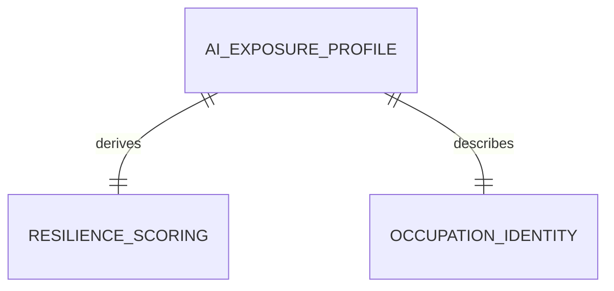

# Conceptual Model: gold-ai-exposure

**Status:** PROPOSED
**Mode:** Greenfield
**Zone:** Gold (Consumable)
**Domain:** AI Exposure and Resilience Scoring
**Spec:** docs/specs/raw-ingest-karpathy-ai-exposure.md (Zone 3: Gold)
**Author:** @semantic-modeler
**Date:** 2026-04-09
**Approval:** Pending human review (REQUIRE_HUMAN_APPROVAL = true)
**Source Model:** governance/models/silver-base-karpathy-ai-exposure-conceptual.md

---

---

## Entity Descriptions

| Entity | Business Concept | Business Term | Is CDE | Is PII |
|--------|-----------------|---------------|--------|--------|
| AI Exposure Profile | The central consumable entity: a self-contained AI exposure assessment for a single BLS occupation. Contains the original Karpathy exposure score and the derived FutureProof gameplay stats (RES and AI Boss). Only occupations confirmed to exist in our BLS data (bls_match=true) are included. Grain is one row per SOC code. | BT-094 | true | false |
| Resilience Scoring | The derived gameplay stats that power the FutureProof pentagon (stat_res) and boss gauntlet (boss_ai_score). Computed from the exposure score using inverse and floor formulas. The invariant stat_res + boss_ai_score = 11 holds for all rows where exposure_score >= 1. | BT-080, BT-083 | true | false |
| Occupation Identity | The SOC code, title, and category that identify which occupation this profile describes. Carried from Silver without transformation. | BT-027 | true | false |

---

## Relationship Descriptions

| Relationship | From | To | Cardinality | Description |
|-------------|------|-----|-------------|-------------|
| derives | AI Exposure Profile | Resilience Scoring | one-to-one | Every AI exposure profile has exactly one resilience scoring. The RES stat and Boss AI score are deterministically derived from the exposure score. |
| describes | AI Exposure Profile | Occupation Identity | one-to-one | Every AI exposure profile identifies exactly one occupation via SOC code. The profile IS the AI assessment of that occupation. |

---

## Key Business Concepts

### Central Question
The Gold AI exposure table answers: **"How exposed is this occupation to AI, and how does that translate into the FutureProof game system?"**

### Grain
One row per SOC code. Only occupations where `bls_match = true` in Silver are promoted. Expected ~389 rows (from ~419 Silver rows after filtering out unmatched SOC codes).

### From Silver to Gold: What Changes

1. **Filter:** Rows where `bls_match = false` or `soc_code` is null are excluded. Silver preserves all rows for completeness; Gold keeps only joinable occupations.

2. **RES Score Derivation:** `stat_res = MIN(11 - exposure_score, 10)`. Inverts exposure into resilience on a 1-10 scale. This is the fifth and final pentagon stat.

3. **Boss AI Score Derivation:** `boss_ai_score = MAX(exposure_score, 1)`. Direct mapping with a floor of 1. This is the fifth and final boss fight.

4. **Rationale passthrough:** The LLM-generated explanation is carried forward as a display field for the Fight AI boss narrative.

5. **Fields dropped:** `slug`, `bls_match`, `soc_resolved_method`, `source_load_date` are Silver-only provenance fields not needed in the consumable product.

### What This Table Feeds in FutureProof

| FutureProof Element | Concept Used |
|---------------------|-------------|
| RES stat (pentagon) | Resilience Scoring -- stat_res on 1-10 scale |
| AI boss fight | Resilience Scoring -- boss_ai_score on 1-10 scale |
| Fight AI narrative | AI Exposure Profile -- rationale display field |
| Program Career Paths backfill | stat_res and boss_ai_score joined via soc_code |
| Career Branches backfill | stat_res delta between source and target occupations |
| Gemma MCP agent | Full profile via get_ai_exposure(soc_code) |

### Data Quality Note
This data product uses LLM-generated scores (Gemini Flash), not empirical measurements. The quality tier is Medium. The rationale field provides transparency into the scoring methodology for each occupation.

---

## Modeling Decisions

1. **Simple three-entity model.** This is a small derivation table (9 columns, ~389 rows) with straightforward transformations. The conceptual model is intentionally minimal -- two derived fields on top of carried identity and source fields.

2. **Resilience Scoring as a separate entity from AI Exposure Profile.** Although they merge into a single physical table, the derivation logic (inverse formula, floor capping) represents a distinct business concern: translating a third-party exposure assessment into the FutureProof game system. Separating them clarifies the boundary between source data (Karpathy's score) and project-derived data (FutureProof stats).

3. **No Data Quality Context entity.** Unlike the occupation profiles Gold product, this table has no null-wage complexity or confidence tiers. Every row has all fields populated (the bls_match filter ensures completeness). A quality entity would add complexity without value.

4. **No FutureProof Stat Mapping entity.** This table always backs exactly RES and AI Boss. The mapping is implicit in the table's purpose rather than needing explicit static fields.

5. **Filter at Gold, not Silver.** Silver preserves all rows (including unmatched SOC codes) for completeness and auditability. Gold applies the business filter. This follows the Brightsmith pattern: Silver is the system of record; Gold is the consumable product.

---

## Scope and Boundaries

- This conceptual model covers the `consumable.ai_exposure` table in the Gold zone only
- Source is the Silver `base.karpathy_ai_exposure` table (single-source; no cross-source joins)
- The downstream backfill of `consumable.program_career_paths` and `consumable.career_branches` is a separate transformation, not modeled here
- MCP zone serving (get_ai_exposure tool) is downstream and not part of this model
- The model assumes ~389 rows after filtering Silver's ~419 rows to bls_match=true only
