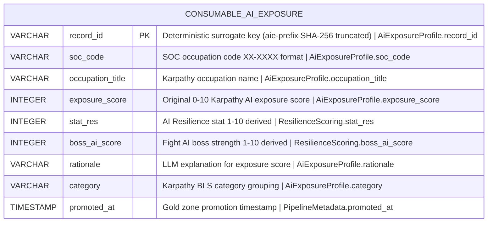

# Physical Model: gold-ai-exposure

**Status:** PROPOSED
**Mode:** Greenfield
**Zone:** Gold (Consumable)
**Domain:** AI Exposure and Resilience Scoring
**Spec:** docs/specs/raw-ingest-karpathy-ai-exposure.md (Zone 3: Gold)
**Logical Model:** governance/models/gold-ai-exposure-logical.md
**Conceptual Model:** governance/models/gold-ai-exposure-conceptual.md
**Author:** @semantic-modeler
**Date:** 2026-04-09
**Approval:** Pending human review (REQUIRE_HUMAN_APPROVAL = true)

---



---

## Table Definition

| Property | Value |
|----------|-------|
| **Catalog table** | `consumable.ai_exposure` |
| **Format** | Apache Iceberg (v2) |
| **Format version** | 2 (supports row-level deletes, merge-on-read) |
| **Engine** | DuckDB (via `iceberg_scan`) |
| **Grain** | One row per occupation (soc_code) |
| **Natural key** | `soc_code` |
| **Surrogate key** | `record_id` (deterministic SHA-256 hash, prefix `aie`) |
| **Expected row count** | ~389 (Silver rows where bls_match=true) |
| **Partition strategy** | None (~389 rows fits in a single partition) |
| **Sort order** | `soc_code ASC` |
| **Write pattern** | Full table replace via `brightsmith.infra.promote.promote()` (idempotent) |

### Iceberg Table Properties

| Property | Value | Rationale |
|----------|-------|-----------|
| `write.format.default` | `parquet` | Standard columnar format for analytical queries |
| `write.parquet.compression-codec` | `zstd` | Best compression ratio for this data profile |
| `format-version` | `2` | Required for Brightsmith promote pattern |
| `write.metadata.delete-after-commit.enabled` | `true` | Clean up old metadata files |
| `write.metadata.previous-versions-max` | `10` | Retain 10 snapshots for time-travel queries |

### Sort Order Rationale

Sort order uses `soc_code ASC` for consistency with the Silver source table and the `consumable.occupation_profiles` table. The primary query pattern is single-occupation lookup by SOC code (Gemma agent via MCP tool). The ~389-row dataset is small enough that sort order has negligible performance impact.

---

## Column Definitions

### AI Exposure Profile (Core Identity + Source Score)

| Column | DuckDB Type | Nullable | Default | Constraint | Business Term | Is CDE | Is PII | Description |
|--------|-------------|----------|---------|------------|---------------|--------|--------|-------------|
| record_id | VARCHAR | NOT NULL | derived | PRIMARY KEY | BT-015 | false | false | Deterministic surrogate key: `compute_grain_id(row, ['soc_code'], prefix='aie')`. Format: `aie-<16 hex chars>`. Stable across pipeline re-runs. |
| soc_code | VARCHAR | NOT NULL | -- | UNIQUE; CHECK (soc_code ~ '^\d{2}-\d{4}$') | BT-027 | true | false | SOC occupation code in XX-XXXX format. Natural key. Non-null guaranteed by bls_match=true filter from Silver. Primary join key for downstream backfill into program_career_paths and career_branches. Source: `base.karpathy_ai_exposure.soc_code`. |
| occupation_title | VARCHAR | NOT NULL | -- | -- | BT-028 | false | false | Karpathy's occupation title. Source: `base.karpathy_ai_exposure.occupation_title`. |
| exposure_score | INTEGER | NOT NULL | -- | CHECK (exposure_score >= 0 AND exposure_score <= 10) | BT-094 | true | false | Original Karpathy AI exposure score on 0-10 scale. Preserved for transparency and auditability. Input to stat_res and boss_ai_score derivations. Source: `base.karpathy_ai_exposure.exposure_score`. |
| rationale | VARCHAR | NOT NULL | -- | -- | BT-095 | false | false | LLM-generated 2-3 sentence explanation of the exposure score. Display field for Fight AI boss narrative in the FutureProof frontend. Source: `base.karpathy_ai_exposure.rationale`. |
| category | VARCHAR | NOT NULL | -- | -- | -- | false | false | Karpathy's BLS category grouping (e.g., "business-and-financial", "healthcare"). Source: `base.karpathy_ai_exposure.category`. |

### Resilience Scoring (Derived)

| Column | DuckDB Type | Nullable | Default | Constraint | Business Term | Is CDE | Is PII | Description |
|--------|-------------|----------|---------|------------|---------------|--------|--------|-------------|
| stat_res | INTEGER | NOT NULL | derived | CHECK (stat_res >= 1 AND stat_res <= 10) | BT-080 | true | false | AI Resilience stat on 1-10 integer scale. Formula: `MIN(11 - exposure_score, 10)`. Higher = more resilient to AI. Backs the RES pentagon stat. Invariant: stat_res + boss_ai_score = 11 for exposure_score >= 1. |
| boss_ai_score | INTEGER | NOT NULL | derived | CHECK (boss_ai_score >= 1 AND boss_ai_score <= 10) | BT-083 | true | false | Fight AI boss strength on 1-10 integer scale. Formula: `MAX(exposure_score, 1)`. Higher = harder fight. Every boss has minimum strength 1. Backs the AI boss fight. |

### Pipeline Metadata

| Column | DuckDB Type | Nullable | Default | Constraint | Business Term | Is CDE | Is PII | Description |
|--------|-------------|----------|---------|------------|---------------|--------|--------|-------------|
| promoted_at | TIMESTAMP | NOT NULL | -- | -- | BT-026 | false | false | Timestamp when the row was promoted to the Gold zone. Generated at promotion time via `datetime.now(tz=datetime.timezone.utc)`. |

---

## Derivation Logic

### stat_res

```python
stat_res = min(11 - row['exposure_score'], 10)
```

| exposure_score | stat_res | Notes |
|---------------|----------|-------|
| 0 | 10 | 11 - 0 = 11, capped at 10 |
| 1 | 10 | 11 - 1 = 10 |
| 5 | 6 | Moderate exposure = moderate resilience |
| 8 | 3 | High exposure = low resilience |
| 10 | 1 | Maximum exposure = minimal resilience |

### boss_ai_score

```python
boss_ai_score = max(row['exposure_score'], 1)
```

| exposure_score | boss_ai_score | Notes |
|---------------|---------------|-------|
| 0 | 1 | Floor at 1 (every boss has minimum strength) |
| 1 | 1 | Direct mapping |
| 5 | 5 | Direct mapping |
| 10 | 10 | Direct mapping |

### Cross-Field Invariant

For all rows where `exposure_score >= 1`:
```
stat_res + boss_ai_score = 11
```

This holds because `stat_res = 11 - exposure_score` and `boss_ai_score = exposure_score` when `1 <= exposure_score <= 10`.

For `exposure_score = 0`: `stat_res = 10`, `boss_ai_score = 1`, sum = 11. The invariant holds universally.

---

## DDL (DuckDB)

```sql
CREATE TABLE consumable.ai_exposure (
    record_id       VARCHAR NOT NULL PRIMARY KEY,
    soc_code        VARCHAR NOT NULL UNIQUE,
    occupation_title VARCHAR NOT NULL,
    exposure_score  INTEGER NOT NULL CHECK (exposure_score >= 0 AND exposure_score <= 10),
    stat_res        INTEGER NOT NULL CHECK (stat_res >= 1 AND stat_res <= 10),
    boss_ai_score   INTEGER NOT NULL CHECK (boss_ai_score >= 1 AND boss_ai_score <= 10),
    rationale       VARCHAR NOT NULL,
    category        VARCHAR NOT NULL,
    promoted_at     TIMESTAMP NOT NULL
);
```

Note: DDL is for documentation only. The actual table is created via `brightsmith.infra.promote.promote()` which writes to Iceberg. DuckDB DDL constraints are not enforced at the Iceberg level -- they are validated by DQ rules.

---

## Source-to-Target Mapping

| Gold Column | Source Column | Transformation |
|------------|--------------|----------------|
| record_id | -- | `compute_grain_id(row, ['soc_code'], prefix='aie')` |
| soc_code | `base.karpathy_ai_exposure.soc_code` | Passthrough (pre-filtered to bls_match=true, non-null) |
| occupation_title | `base.karpathy_ai_exposure.occupation_title` | Passthrough |
| exposure_score | `base.karpathy_ai_exposure.exposure_score` | Passthrough |
| stat_res | `base.karpathy_ai_exposure.exposure_score` | `MIN(11 - exposure_score, 10)` |
| boss_ai_score | `base.karpathy_ai_exposure.exposure_score` | `MAX(exposure_score, 1)` |
| rationale | `base.karpathy_ai_exposure.rationale` | Passthrough |
| category | `base.karpathy_ai_exposure.category` | Passthrough |
| promoted_at | -- | `datetime.now(tz=datetime.timezone.utc)` at promotion time |

### Columns Dropped from Silver

| Silver Column | Reason |
|--------------|--------|
| slug | Provenance field. Not needed in consumable product. |
| bls_match | Consumed as filter (WHERE bls_match = true). Not carried forward. |
| soc_resolved_method | Provenance/audit field. Not needed in consumable product. |
| source_load_date | Pipeline metadata. Gold uses promoted_at instead. |
| ingested_at | Silver promotion timestamp. Replaced by Gold promoted_at. |

---

## DQ Rule References

The following DQ rules validate this table (defined in `governance/dq-rules/gold-ai-exposure.json`):

| Rule | Type | Priority | Description |
|------|------|----------|-------------|
| stat_res range | range check | P0 | 1 <= stat_res <= 10 |
| boss_ai_score range | range check | P0 | 1 <= boss_ai_score <= 10 |
| inverse invariant | cross-field | P0 | stat_res + boss_ai_score = 11 for exposure_score >= 1 |
| row count | completeness | P0 | Matches Silver filtered count |
| soc_code uniqueness | uniqueness | P0 | No duplicate SOC codes |
| rationale non-null | completeness | P0 | 0% null |
| cross-validation | referential | P0 | Every soc_code must exist in consumable.occupation_profiles |
