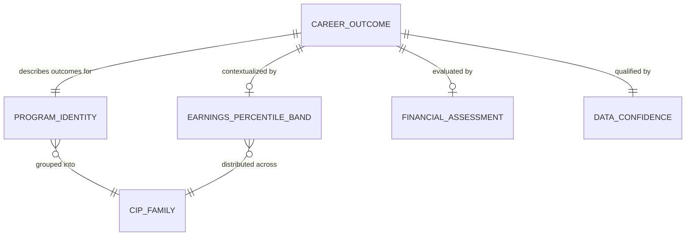

# Conceptual Model: gold-career-outcomes-college-scorecard

**Status:** PROPOSED
**Mode:** Greenfield
**Zone:** Gold (Consumable)
**Domain:** Higher Education Outcomes
**Spec:** docs/specs/gold-career-outcomes-college-scorecard.md
**Author:** @semantic-modeler
**Date:** 2026-04-06
**Approval:** Pending human review (REQUIRE_HUMAN_APPROVAL = true)
**Source Model:** governance/models/silver-base-college-scorecard-conceptual.md

---

---

## Entity Descriptions

| Entity | Business Concept | Business Term | Is CDE | Is PII |
|--------|-----------------|---------------|--------|--------|
| Career Outcome | The central consumable entity: the career outcome profile for a specific program offering (institution x program x credential level). Carries forward core outcome measures (earnings, debt, completions) from Silver and enriches them with derived analytics. This is the row-level fact that powers the FutureProof query: "school + major = what outcomes?" | BT-015 | true | false |
| Program Identity | The dimensional context identifying what institution, program, CIP family, and credential level a career outcome belongs to. Carried from Silver without transformation. Groups the identity fields that answer "who" and "what" about a program offering. | BT-001, BT-003, BT-007 | true | false |
| CIP Family | A broad discipline grouping (2-digit CIP prefix) that serves as the partitioning dimension for cross-institution percentile bands and relative position metrics. Programs within a CIP family are comparable peers. | BT-005 | false | false |
| Earnings Percentile Band | A distributional summary (25th/50th/75th percentiles) of program-level median earnings across all institutions within the same CIP family. Answers the effort slider question: "If I study field X, what is the range of earnings outcomes across schools?" Requires a minimum of 3 non-null values per CIP family to be meaningful. | BT-018 | true | false |
| Financial Assessment | A collection of derived affordability and value metrics for a program offering: debt-to-earnings ratio, debt-to-earnings tier, earnings growth rate, CIP family earnings rank, and program value index. These are the analytical dimensions that help users compare programs on financial merit. | BT-019, BT-020, BT-021, BT-022, BT-023 | true | false |
| Data Confidence | A quality context layer assigned to every career outcome row. Classifies each row into a confidence tier (high/medium/low/insufficient) based on cohort size and data availability, and provides convenience flags and a completeness score. Enables downstream consumers to filter or caveat results appropriately. | BT-024, BT-025 | false | false |

---

## Relationship Descriptions

| Relationship | From | To | Cardinality | Description |
|-------------|------|-----|-------------|-------------|
| describes outcomes for | Career Outcome | Program Identity | one-to-one | Every career outcome row has exactly one program identity (unitid x cipcode x credlev). The career outcome IS the enriched view of that program offering. |
| contextualized by | Career Outcome | Earnings Percentile Band | one-to-zero-or-one | A career outcome may have earnings percentile bands from its CIP family, or they may be null if the CIP family has fewer than 3 programs with earnings data. |
| evaluated by | Career Outcome | Financial Assessment | one-to-zero-or-one | A career outcome may have financial assessment metrics, or they may be null if the underlying earnings or debt data is missing (privacy suppression). |
| qualified by | Career Outcome | Data Confidence | one-to-one | Every career outcome row has a confidence tier and completeness score. No nulls -- every row is classified. |
| grouped into | Program Identity | CIP Family | many-to-one | Many program identities share the same CIP family (2-digit prefix). The CIP family is the peer grouping dimension. |
| distributed across | Earnings Percentile Band | CIP Family | many-to-one | Percentile bands are computed per CIP family. All programs in a family share the same band values for a given earnings/debt field. |

---

## Key Business Concepts

### Central Question
The Gold career outcomes table answers: **"If I study program X at school Y, what career outcomes can I expect, and how does that compare to similar programs at other schools?"**

The effort slider in the product UI depends on the percentile bands -- showing the 25th (low effort/outcome), 50th (typical), and 75th (high effort/outcome) earnings for a given field of study across all institutions.

### Grain
The grain is identical to Silver: **unitid x cipcode x credlev** (one row per institution-program-credential combination). All 69,947 Silver rows are carried forward. Programs are flagged, not excluded -- filtering happens at query time based on confidence tier.

### From Silver to Gold: What Changes
The Silver `base.college_scorecard` table provides clean, normalized program-level facts. The Gold `consumable.career_outcomes` table enriches those facts with:

1. **Cross-institution context** (Earnings Percentile Bands) -- where does this program sit relative to peers?
2. **Affordability analysis** (Financial Assessment) -- is the debt burden manageable relative to earnings?
3. **Quality transparency** (Data Confidence) -- how much should a consumer trust this row's data?

No Silver data is lost in the transition. Identity and core outcome fields are carried forward verbatim. The Gold layer is purely additive: derived analytics layered on top of Silver facts.

### Earnings Percentile Bands (BT-018)
These are **cross-institution percentile bands**, not within-cohort percentiles. For each CIP family, the 25th and 75th percentiles are computed over the set of program-level medians across all institutions in that family. This means:
- A CIP family with only 2 programs reporting earnings will have null bands (minimum sample: 3)
- The bands represent the range of institutional outcomes, not the range of individual graduate outcomes
- 1-year and 2-year earnings have independent bands (they suppress independently)
- Debt also has its own percentile bands within each CIP family

### Financial Assessment
Five derived metrics provide the analytical backbone of the consumable data product:
- **Debt-to-Earnings Ratio** (BT-019): The core affordability metric (debt / 1yr earnings)
- **Debt-to-Earnings Tier** (BT-020): Categorical bucketing of the ratio (Low / Moderate / High / Very High)
- **Cross-Cohort Earnings Differential** (BT-021): Difference between 2yr and 1yr cohort earnings (NOT longitudinal growth)
- **CIP Family Earnings Rank** (BT-022): Relative position within peer programs (0.0 to 1.0)
- **Program Value Index** (BT-023): ROI proxy (earnings / debt, inverse of debt-to-earnings ratio)

All financial metrics are null-safe: null when any required input is missing due to privacy suppression (BT-013).

### Data Confidence (BT-024)
Every row receives a confidence tier based on two dimensions:
1. **Cohort size** -- is the program above the ~30 completer threshold? (BT-014)
2. **Data availability** -- are earnings and/or debt data present?

The four tiers (high, medium, low, insufficient) enable consumers to make informed decisions about data trustworthiness. Approximately 50-55% of rows are expected to be "insufficient" based on Silver EDA suppression rates.

### Privacy Suppression Propagation
Privacy suppression (BT-013) from the source data propagates through the Gold layer:
- Suppressed earnings/debt in Silver remain null in Gold
- Derived metrics that depend on suppressed inputs are also null
- Percentile bands exclude null values from their calculations
- The confidence tier captures the cumulative impact of suppression on each row

---

## Modeling Decisions

1. **Career Outcome as the central entity.** The Gold consumable table is a single wide fact table optimized for the query pattern (school + major = outcomes). The conceptual model decomposes this into logical entity groups (identity, bands, financial, confidence) to clarify the distinct business concerns, but they will likely merge into a single physical table.

2. **Percentile Bands as a separate entity.** Although bands are denormalized onto each row in the physical table, conceptually they represent a CIP-family-level aggregate, not a program-level fact. Separating them clarifies that they are shared context across all programs in a family.

3. **Financial Assessment grouped as one entity.** The five financial metrics share a common null pattern (all depend on earnings and/or debt availability) and a common purpose (program evaluation). Grouping them avoids entity proliferation while maintaining clarity.

4. **Data Confidence as mandatory.** Unlike other derived entities which may be null, confidence tier is required on every row. This reflects the business decision that every program must have a quality signal, even if that signal is "insufficient data."

5. **CIP Family as a shared dimension.** CIP Family appears in both Program Identity (as a classification) and Earnings Percentile Band (as a partition key). This dual role justifies its presence as a distinct entity in the conceptual model.

6. **No temporal dimension.** Consistent with the Silver conceptual model, this is a point-in-time snapshot. Source Load Date and Promotion Timestamp are pipeline metadata, not analytical dimensions.

---

## Continuity with Silver Conceptual Model

This Gold conceptual model builds on the Silver `base.college_scorecard` conceptual model:

| Silver Entity | Gold Disposition | Notes |
|--------------|-----------------|-------|
| Institution | Absorbed into Program Identity | Identity fields carried forward verbatim |
| Academic Program | Absorbed into Program Identity | CIP code and program name carried forward |
| CIP Family | Retained as CIP Family | Same entity, now also serves as percentile band partition |
| Credential Type | Absorbed into Program Identity | Credential level carried forward (no description in Gold) |
| Program Offering | Evolved into Career Outcome | The grain entity, now enriched with derived analytics |
| Earnings 1yr | Absorbed into Career Outcome (core fields) | Median carried forward; also feeds percentile bands and financial metrics |
| Earnings 2yr | Absorbed into Career Outcome (core fields) | Median carried forward; also feeds percentile bands and growth rate |
| Debt Outcome | Absorbed into Career Outcome (core fields) | Median carried forward; also feeds percentile bands and affordability metrics |
| Completions Measure | Absorbed into Career Outcome (core fields) | Count and small cohort flag carried forward; feeds confidence tier |

The Silver model's separate entities for earnings/debt/completions are consolidated in Gold because the consumable layer optimizes for query convenience over normalization. The business concepts remain distinct (tracked via separate business terms) but the physical representation is denormalized.

---

## Scope and Boundaries

- This conceptual model covers the `consumable.career_outcomes` table in the Gold zone only
- Source is the Silver `base.college_scorecard` table (single-source; no cross-source joins in this spec)
- CIP-to-SOC crosswalk integration is a future spec (`gold-career-projections`) and not modeled here
- BLS and O*NET data sources are not included -- this spec uses College Scorecard data only
- The model assumes Bachelor's Degree only (CREDLEV=3) per MVP scope, but the grain supports future credential levels
- MCP zone serving is downstream and not part of this model
