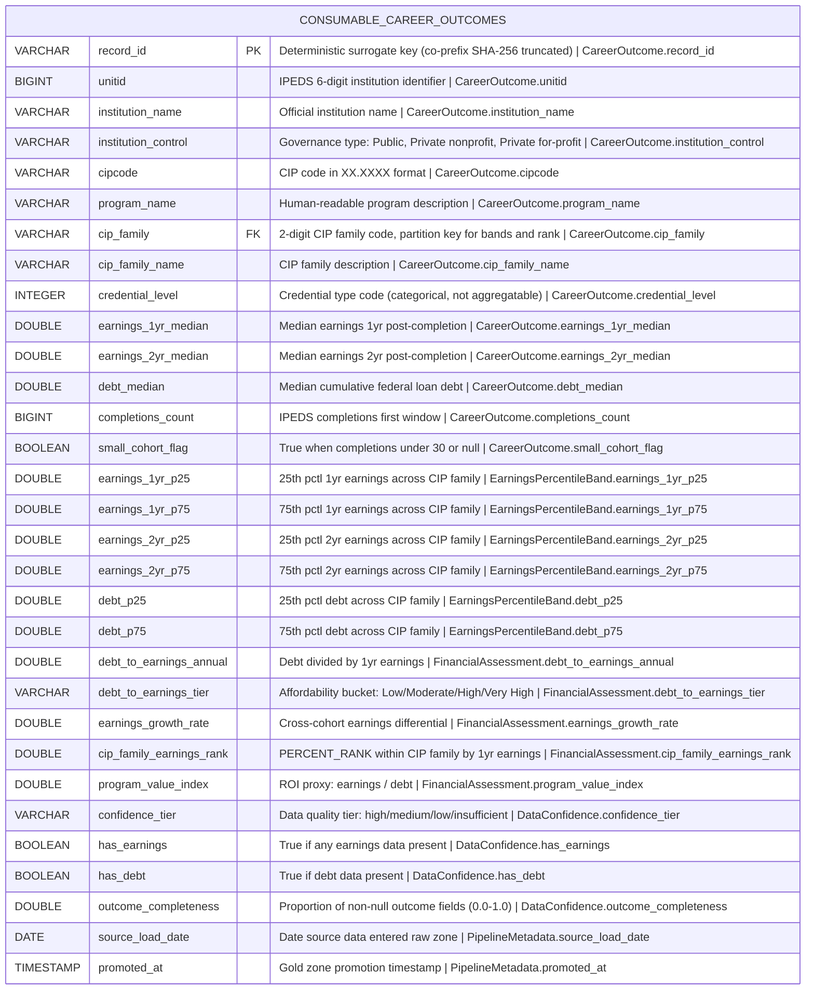

# Physical Model: gold-career-outcomes-college-scorecard

**Status:** APPROVED (auto-approved; direct translation from approved logical model)
**Mode:** Greenfield
**Zone:** Gold (Consumable)
**Domain:** Higher Education Outcomes
**Spec:** docs/specs/gold-career-outcomes-college-scorecard.md
**Logical Model:** governance/models/gold-career-outcomes-college-scorecard-logical.md
**Conceptual Model:** governance/models/gold-career-outcomes-college-scorecard-conceptual.md
**Author:** @semantic-modeler
**Date:** 2026-04-06

---



---

## Table Definition

| Property | Value |
|----------|-------|
| **Catalog table** | `consumable.career_outcomes` |
| **Format** | Apache Iceberg (v2) |
| **Format version** | 2 (supports row-level deletes, merge-on-read) |
| **Engine** | DuckDB (via `iceberg_scan`) |
| **Grain** | One row per institution x program x credential level |
| **Natural key** | `unitid` + `cipcode` + `credential_level` |
| **Surrogate key** | `record_id` (deterministic SHA-256 hash, prefix `co`) |
| **Expected row count** | 69,947 (all Silver base rows carried forward) |
| **Partition strategy** | None (dataset < 100K rows; single partition is optimal for scan performance) |
| **Sort order** | `cip_family ASC, unitid ASC, cipcode ASC, credential_level ASC` |
| **Write pattern** | Full table replace via `brightsmith.infra.promote.promote()` (idempotent) |

### Iceberg Table Properties

| Property | Value | Rationale |
|----------|-------|-----------|
| `write.format.default` | `parquet` | Standard columnar format for analytical queries |
| `write.parquet.compression-codec` | `zstd` | Best compression ratio for this data profile |
| `format-version` | `2` | Required for Brightsmith promote pattern |
| `write.metadata.delete-after-commit.enabled` | `true` | Clean up old metadata files |
| `write.metadata.previous-versions-max` | `10` | Retain 10 snapshots for time-travel queries |

### Sort Order Rationale

Sort order leads with `cip_family` (instead of Silver's `unitid`-first sort) because the Gold table's primary query patterns involve CIP-family-level comparisons (percentile bands, earnings rank). Sorting by `cip_family` first clusters related programs together, improving scan efficiency for the effort slider and discipline comparison queries. The remaining sort keys (`unitid`, `cipcode`, `credential_level`) match the natural key for within-family ordering.

---

## Column Definitions

### Career Outcome (Core Identity + Outcome Fields)

| Column | DuckDB Type | Nullable | Default | Constraint | Business Term | Is CDE | Is PII | Description |
|--------|-------------|----------|---------|------------|---------------|--------|--------|-------------|
| record_id | VARCHAR | NOT NULL | derived | PRIMARY KEY | BT-015 | false | false | Deterministic surrogate key: `compute_grain_id(row, ['unitid', 'cipcode', 'credlev'], prefix='co')`. Format: `co-<16 hex chars>`. Stable across pipeline re-runs. |
| unitid | BIGINT | NOT NULL | -- | UNIQUE (composite with cipcode, credential_level) | BT-001 | true | false | IPEDS 6-digit institution identifier. Natural key component. Source: `base.college_scorecard.unitid`. |
| institution_name | VARCHAR | NOT NULL | -- | -- | BT-002 | false | false | Official institution name as reported to IPEDS. Source: `base.college_scorecard.institution_name`. |
| institution_control | VARCHAR | NOT NULL | -- | CHECK (institution_control IN ('Public', 'Private nonprofit', 'Private for-profit')) | *pending* | false | false | Type of institutional governance. Source: `base.college_scorecard.institution_control`. Verbatim from Silver. |
| cipcode | VARCHAR | NOT NULL | -- | UNIQUE (composite with unitid, credential_level); CHECK (cipcode ~ '^\d{2}\.\d{2,4}$') | BT-003 | false | false | CIP code in normalized XX.XXXX format. Natural key component. Source: `base.college_scorecard.cipcode`. |
| program_name | VARCHAR | NOT NULL | -- | -- | BT-004 | false | false | Human-readable program description. Source: `base.college_scorecard.program_name`. |
| cip_family | VARCHAR | NOT NULL | -- | CHECK (cip_family ~ '^\d{2}$') | BT-005 | false | false | 2-digit CIP family code. Partition key for percentile band and rank computations. Source: `base.college_scorecard.cip_family`. |
| cip_family_name | VARCHAR | NOT NULL | -- | -- | BT-006 | false | false | Human-readable label for the CIP family. Source: `base.college_scorecard.cip_family_name`. |
| credential_level | INTEGER | NOT NULL | -- | UNIQUE (composite with unitid, cipcode); CHECK (credential_level BETWEEN 1 AND 8) | BT-007 | false | false | Integer code for credential type. Categorical, not aggregatable. Natural key component. Source: `base.college_scorecard.credential_level`. |
| earnings_1yr_median | DOUBLE | NULLABLE | NULL | CHECK (earnings_1yr_median IS NULL OR (earnings_1yr_median >= 1000 AND earnings_1yr_median <= 250000)) | BT-009 | true | false | Median earnings 1 year post-completion. Null when privacy-suppressed. Source: `base.college_scorecard.earnings_1yr_median`. |
| earnings_2yr_median | DOUBLE | NULLABLE | NULL | CHECK (earnings_2yr_median IS NULL OR (earnings_2yr_median >= 1000 AND earnings_2yr_median <= 250000)) | BT-010 | true | false | Median earnings 2 years post-completion. Different cohort from 1yr. Null when privacy-suppressed. Source: `base.college_scorecard.earnings_2yr_median`. |
| debt_median | DOUBLE | NULLABLE | NULL | CHECK (debt_median IS NULL OR (debt_median >= 1000 AND debt_median <= 100000)) | BT-011 | true | false | Median cumulative federal loan debt at completion. Null when privacy-suppressed. Source: `base.college_scorecard.debt_median`. |
| completions_count | BIGINT | NULLABLE | NULL | CHECK (completions_count IS NULL OR completions_count >= 0) | BT-012 | false | false | IPEDS completions count (first major window). Source: `base.college_scorecard.completions_count_1` (renamed). |
| small_cohort_flag | BOOLEAN | NOT NULL | -- | -- | BT-014 | false | false | True when completions_count < 30 or completions data is null. Source: `base.college_scorecard.small_cohort_flag`. |

### Earnings Percentile Band (Derived: CIP-Family Window Aggregates)

| Column | DuckDB Type | Nullable | Default | Constraint | Business Term | Is CDE | Is PII | Description |
|--------|-------------|----------|---------|------------|---------------|--------|--------|-------------|
| earnings_1yr_p25 | DOUBLE | NULLABLE | NULL | CHECK (earnings_1yr_p25 IS NULL OR earnings_1yr_p25 >= 0) | BT-018 | true | false | 25th percentile of 1yr median earnings across all institutions in the same CIP family. Null if fewer than 3 non-null values. |
| earnings_1yr_p75 | DOUBLE | NULLABLE | NULL | CHECK (earnings_1yr_p75 IS NULL OR earnings_1yr_p75 >= 0) | BT-018 | true | false | 75th percentile of 1yr median earnings across CIP family. Null if fewer than 3 non-null values. Invariant: >= earnings_1yr_p25. |
| earnings_2yr_p25 | DOUBLE | NULLABLE | NULL | CHECK (earnings_2yr_p25 IS NULL OR earnings_2yr_p25 >= 0) | BT-018 | true | false | 25th percentile of 2yr median earnings across CIP family. Null if fewer than 3 non-null values. |
| earnings_2yr_p75 | DOUBLE | NULLABLE | NULL | CHECK (earnings_2yr_p75 IS NULL OR earnings_2yr_p75 >= 0) | BT-018 | true | false | 75th percentile of 2yr median earnings across CIP family. Null if fewer than 3 non-null values. Invariant: >= earnings_2yr_p25. |
| debt_p25 | DOUBLE | NULLABLE | NULL | CHECK (debt_p25 IS NULL OR debt_p25 >= 0) | BT-018 | true | false | 25th percentile of median debt across CIP family. Null if fewer than 3 non-null values. |
| debt_p75 | DOUBLE | NULLABLE | NULL | CHECK (debt_p75 IS NULL OR debt_p75 >= 0) | BT-018 | true | false | 75th percentile of median debt across CIP family. Null if fewer than 3 non-null values. Invariant: >= debt_p25. |

### Financial Assessment (Derived: Affordability and Value Metrics)

| Column | DuckDB Type | Nullable | Default | Constraint | Business Term | Is CDE | Is PII | Description |
|--------|-------------|----------|---------|------------|---------------|--------|--------|-------------|
| debt_to_earnings_annual | DOUBLE | NULLABLE | NULL | CHECK (debt_to_earnings_annual IS NULL OR debt_to_earnings_annual > 0) | BT-019 | true | false | Debt-to-earnings ratio: debt_median / earnings_1yr_median. Null if either input is null. |
| debt_to_earnings_tier | VARCHAR | NULLABLE | NULL | CHECK (debt_to_earnings_tier IS NULL OR debt_to_earnings_tier IN ('Low', 'Moderate', 'High', 'Very High')) | BT-020 | false | false | Categorical bucketing of debt-to-earnings ratio. Null if ratio is null. |
| earnings_growth_rate | DOUBLE | NULLABLE | NULL | -- | BT-021 | false | false | Cross-cohort earnings differential: (earnings_2yr_median - earnings_1yr_median) / earnings_1yr_median. Negative values expected. Null if either input is null. |
| cip_family_earnings_rank | DOUBLE | NULLABLE | NULL | CHECK (cip_family_earnings_rank IS NULL OR (cip_family_earnings_rank >= 0.0 AND cip_family_earnings_rank <= 1.0)) | BT-022 | false | false | PERCENT_RANK within CIP family by 1yr earnings. Range 0.0-1.0. Null if earnings_1yr_median is null. |
| program_value_index | DOUBLE | NULLABLE | NULL | CHECK (program_value_index IS NULL OR program_value_index > 0) | BT-023 | false | false | ROI proxy: earnings_1yr_median / debt_median. Higher = better value. Null if either input is null. |

### Data Confidence (Derived: Quality Context)

| Column | DuckDB Type | Nullable | Default | Constraint | Business Term | Is CDE | Is PII | Description |
|--------|-------------|----------|---------|------------|---------------|--------|--------|-------------|
| confidence_tier | VARCHAR | NOT NULL | -- | CHECK (confidence_tier IN ('high', 'medium', 'low', 'insufficient')) | BT-024 | false | false | Four-level data quality classification. Every row receives a tier. |
| has_earnings | BOOLEAN | NOT NULL | -- | -- | BT-024 | false | false | True if earnings_1yr_median IS NOT NULL OR earnings_2yr_median IS NOT NULL. |
| has_debt | BOOLEAN | NOT NULL | -- | -- | BT-024 | false | false | True if debt_median IS NOT NULL. |
| outcome_completeness | DOUBLE | NOT NULL | -- | CHECK (outcome_completeness IN (0.0, 0.33, 0.67, 1.0)) | BT-025 | false | false | Proportion of non-null core outcome fields (3 fields). Exact value set: {0.0, 0.33, 0.67, 1.0}. |

### Pipeline Metadata

| Column | DuckDB Type | Nullable | Default | Constraint | Business Term | Is CDE | Is PII | Description |
|--------|-------------|----------|---------|------------|---------------|--------|--------|-------------|
| source_load_date | DATE | NOT NULL | -- | -- | BT-016 | false | false | Date the source data was loaded into the raw zone. Source: `base.college_scorecard.source_load_date`. |
| promoted_at | TIMESTAMP | NOT NULL | -- | -- | BT-026 | false | false | Timestamp when the row was promoted to the Gold zone. Generated at promotion time via `datetime.now()`. |

---

## Column Summary

| Count | Category |
|-------|----------|
| 30 | Total columns |
| 1 | Primary key (record_id) |
| 3 | Natural key components (unitid, cipcode, credential_level) |
| 4 | CDE columns carried from Silver (unitid, earnings_1yr_median, earnings_2yr_median, debt_median) |
| 6 | CDE columns new in Gold (earnings_1yr_p25, earnings_1yr_p75, earnings_2yr_p25, earnings_2yr_p75, debt_p25, debt_p75) |
| 1 | CDE column new in Gold (debt_to_earnings_annual) |
| 0 | PII columns |
| 16 | Nullable columns |
| 14 | NOT NULL columns |
| 17 | Derived columns |
| 13 | Carried from Silver verbatim |

---

## DDL (Reference)

This DDL is for documentation. The actual table is created via `brightsmith.infra.promote.promote()` which handles Iceberg table creation and idempotent writes.

```sql
-- Reference DDL for consumable.career_outcomes
-- Engine: DuckDB + Iceberg v2
-- Do not execute directly -- use promote() pattern

CREATE TABLE IF NOT EXISTS consumable.career_outcomes (
    -- Core Identity
    record_id                   VARCHAR     NOT NULL,
    unitid                      BIGINT      NOT NULL,
    institution_name            VARCHAR     NOT NULL,
    institution_control         VARCHAR     NOT NULL,
    cipcode                     VARCHAR     NOT NULL,
    program_name                VARCHAR     NOT NULL,
    cip_family                  VARCHAR     NOT NULL,
    cip_family_name             VARCHAR     NOT NULL,
    credential_level            INTEGER     NOT NULL,

    -- Core Outcome Fields
    earnings_1yr_median         DOUBLE,
    earnings_2yr_median         DOUBLE,
    debt_median                 DOUBLE,
    completions_count           BIGINT,
    small_cohort_flag           BOOLEAN     NOT NULL,

    -- Earnings Percentile Bands (CIP-family window aggregates)
    earnings_1yr_p25            DOUBLE,
    earnings_1yr_p75            DOUBLE,
    earnings_2yr_p25            DOUBLE,
    earnings_2yr_p75            DOUBLE,
    debt_p25                    DOUBLE,
    debt_p75                    DOUBLE,

    -- Financial Assessment (derived ratios and ranks)
    debt_to_earnings_annual     DOUBLE,
    debt_to_earnings_tier       VARCHAR,
    earnings_growth_rate        DOUBLE,
    cip_family_earnings_rank    DOUBLE,
    program_value_index         DOUBLE,

    -- Data Confidence (derived quality context)
    confidence_tier             VARCHAR     NOT NULL,
    has_earnings                BOOLEAN     NOT NULL,
    has_debt                    BOOLEAN     NOT NULL,
    outcome_completeness        DOUBLE      NOT NULL,

    -- Pipeline Metadata
    source_load_date            DATE        NOT NULL,
    promoted_at                 TIMESTAMP   NOT NULL,

    -- Surrogate key
    PRIMARY KEY (record_id),

    -- Natural key uniqueness (enforced at load time, not by Iceberg)
    UNIQUE (unitid, cipcode, credential_level),

    -- Domain constraints
    CHECK (institution_control IN ('Public', 'Private nonprofit', 'Private for-profit')),
    CHECK (cipcode ~ '^\d{2}\.\d{2,4}$'),
    CHECK (cip_family ~ '^\d{2}$'),
    CHECK (credential_level BETWEEN 1 AND 8),
    CHECK (earnings_1yr_median IS NULL OR (earnings_1yr_median >= 1000 AND earnings_1yr_median <= 250000)),
    CHECK (earnings_2yr_median IS NULL OR (earnings_2yr_median >= 1000 AND earnings_2yr_median <= 250000)),
    CHECK (debt_median IS NULL OR (debt_median >= 1000 AND debt_median <= 100000)),
    CHECK (completions_count IS NULL OR completions_count >= 0),
    CHECK (confidence_tier IN ('high', 'medium', 'low', 'insufficient')),
    CHECK (debt_to_earnings_tier IS NULL OR debt_to_earnings_tier IN ('Low', 'Moderate', 'High', 'Very High')),
    CHECK (cip_family_earnings_rank IS NULL OR (cip_family_earnings_rank >= 0.0 AND cip_family_earnings_rank <= 1.0)),
    CHECK (outcome_completeness IN (0.0, 0.33, 0.67, 1.0))
);
```

---

## Source-to-Target Mapping

| Physical Column | DuckDB Type | Source Table | Source Field | Transformation |
|-----------------|-------------|-------------|--------------|----------------|
| record_id | VARCHAR | -- | derived | `compute_grain_id(row, ['unitid', 'cipcode', 'credlev'], prefix='co')` |
| unitid | BIGINT | base.college_scorecard | unitid | Verbatim |
| institution_name | VARCHAR | base.college_scorecard | institution_name | Verbatim |
| institution_control | VARCHAR | base.college_scorecard | institution_control | Verbatim |
| cipcode | VARCHAR | base.college_scorecard | cipcode | Verbatim |
| program_name | VARCHAR | base.college_scorecard | program_name | Verbatim |
| cip_family | VARCHAR | base.college_scorecard | cip_family | Verbatim |
| cip_family_name | VARCHAR | base.college_scorecard | cip_family_name | Verbatim |
| credential_level | INTEGER | base.college_scorecard | credential_level | Verbatim |
| earnings_1yr_median | DOUBLE | base.college_scorecard | earnings_1yr_median | Verbatim |
| earnings_2yr_median | DOUBLE | base.college_scorecard | earnings_2yr_median | Verbatim |
| debt_median | DOUBLE | base.college_scorecard | debt_median | Verbatim |
| completions_count | BIGINT | base.college_scorecard | completions_count_1 | Renamed from completions_count_1 |
| small_cohort_flag | BOOLEAN | base.college_scorecard | small_cohort_flag | Verbatim |
| earnings_1yr_p25 | DOUBLE | -- | derived | `PERCENTILE_CONT(0.25) WITHIN GROUP (ORDER BY earnings_1yr_median) OVER (PARTITION BY cip_family)` where CIP family has >= 3 non-null values, else NULL |
| earnings_1yr_p75 | DOUBLE | -- | derived | `PERCENTILE_CONT(0.75) WITHIN GROUP (ORDER BY earnings_1yr_median) OVER (PARTITION BY cip_family)` where CIP family has >= 3 non-null values, else NULL |
| earnings_2yr_p25 | DOUBLE | -- | derived | `PERCENTILE_CONT(0.25) WITHIN GROUP (ORDER BY earnings_2yr_median) OVER (PARTITION BY cip_family)` where >= 3 non-null, else NULL |
| earnings_2yr_p75 | DOUBLE | -- | derived | `PERCENTILE_CONT(0.75) WITHIN GROUP (ORDER BY earnings_2yr_median) OVER (PARTITION BY cip_family)` where >= 3 non-null, else NULL |
| debt_p25 | DOUBLE | -- | derived | `PERCENTILE_CONT(0.25) WITHIN GROUP (ORDER BY debt_median) OVER (PARTITION BY cip_family)` where >= 3 non-null, else NULL |
| debt_p75 | DOUBLE | -- | derived | `PERCENTILE_CONT(0.75) WITHIN GROUP (ORDER BY debt_median) OVER (PARTITION BY cip_family)` where >= 3 non-null, else NULL |
| debt_to_earnings_annual | DOUBLE | -- | derived | `debt_median / earnings_1yr_median` (NULL if either input NULL) |
| debt_to_earnings_tier | VARCHAR | -- | derived | `CASE WHEN dte < 0.75 THEN 'Low' WHEN dte < 1.5 THEN 'Moderate' WHEN dte < 2.5 THEN 'High' ELSE 'Very High' END` (NULL if ratio NULL) |
| earnings_growth_rate | DOUBLE | -- | derived | `(earnings_2yr_median - earnings_1yr_median) / earnings_1yr_median` (NULL if either input NULL) |
| cip_family_earnings_rank | DOUBLE | -- | derived | `PERCENT_RANK() OVER (PARTITION BY cip_family ORDER BY earnings_1yr_median)` (NULL rows excluded from window) |
| program_value_index | DOUBLE | -- | derived | `earnings_1yr_median / debt_median` (NULL if either input NULL) |
| confidence_tier | VARCHAR | -- | derived | See Confidence Tier Derivation below |
| has_earnings | BOOLEAN | -- | derived | `earnings_1yr_median IS NOT NULL OR earnings_2yr_median IS NOT NULL` |
| has_debt | BOOLEAN | -- | derived | `debt_median IS NOT NULL` |
| outcome_completeness | DOUBLE | -- | derived | `(CASE WHEN earnings_1yr_median IS NOT NULL THEN 1 ELSE 0 END + CASE WHEN earnings_2yr_median IS NOT NULL THEN 1 ELSE 0 END + CASE WHEN debt_median IS NOT NULL THEN 1 ELSE 0 END) / 3.0` |
| source_load_date | DATE | base.college_scorecard | source_load_date | Verbatim |
| promoted_at | TIMESTAMP | -- | generated | `CURRENT_TIMESTAMP` at Gold promotion time |

---

## Derivation Rules (Implementation Expressions)

### Confidence Tier Derivation

Evaluated top-to-bottom; first matching condition wins.

```sql
CASE
    WHEN small_cohort_flag = FALSE AND has_earnings = TRUE AND has_debt = TRUE
        THEN 'high'
    WHEN small_cohort_flag = FALSE AND (has_earnings = TRUE OR has_debt = TRUE)
        THEN 'medium'
    WHEN small_cohort_flag = TRUE AND (has_earnings = TRUE OR has_debt = TRUE)
        THEN 'low'
    ELSE 'insufficient'
END
```

### Debt-to-Earnings Tier Derivation

```sql
CASE
    WHEN debt_to_earnings_annual IS NULL THEN NULL
    WHEN debt_to_earnings_annual < 0.75 THEN 'Low'
    WHEN debt_to_earnings_annual < 1.5 THEN 'Moderate'
    WHEN debt_to_earnings_annual < 2.5 THEN 'High'
    ELSE 'Very High'
END
```

### Percentile Band Minimum Sample Guard

For each CIP family and each field (earnings_1yr_median, earnings_2yr_median, debt_median), count the non-null values. If the count is fewer than 3, set all bands for that family-field combination to NULL.

```sql
-- Example for earnings_1yr bands:
CASE
    WHEN COUNT(earnings_1yr_median) OVER (PARTITION BY cip_family) >= 3
        THEN PERCENTILE_CONT(0.25) WITHIN GROUP (ORDER BY earnings_1yr_median)
             OVER (PARTITION BY cip_family)
    ELSE NULL
END AS earnings_1yr_p25
```

---

## Nullability Semantics

| Column | NULL Means |
|--------|-----------|
| earnings_1yr_median | 1-year earnings suppressed for privacy (cohort too small) |
| earnings_2yr_median | 2-year earnings suppressed for privacy (different cohort) |
| debt_median | Debt data suppressed for privacy |
| completions_count | Completions count not reported for this measurement window |
| earnings_1yr_p25, earnings_1yr_p75 | CIP family has fewer than 3 non-null 1yr earnings values |
| earnings_2yr_p25, earnings_2yr_p75 | CIP family has fewer than 3 non-null 2yr earnings values |
| debt_p25, debt_p75 | CIP family has fewer than 3 non-null debt values |
| debt_to_earnings_annual | Either debt or 1yr earnings is null (privacy suppression) |
| debt_to_earnings_tier | Ratio is null (propagated from inputs) |
| earnings_growth_rate | Either 1yr or 2yr earnings is null |
| cip_family_earnings_rank | 1yr earnings is null (excluded from rank window) |
| program_value_index | Either 1yr earnings or debt is null |

---

## Dropped Fields (from Silver, with justification)

| Silver Column | DuckDB Type | Dropped? | Justification |
|--------------|-------------|----------|---------------|
| completions_count_1 | BIGINT | Renamed | Renamed to `completions_count` for clarity in consumable layer |
| completions_count_2 | BIGINT | Dropped | Second-major completions not relevant to career outcomes query pattern |
| credential_description | VARCHAR | Dropped | Redundant with credential_level (always "Bachelor's Degree" in MVP) |
| ingested_at | TIMESTAMP | Dropped | Silver metadata replaced by `promoted_at` in Gold |

---

## Traceability: Logical to Physical

| Logical Attribute | Logical Type Domain | Physical Column | Physical DuckDB Type | Mapping Notes |
|-------------------|--------------------|-----------------|--------------------|---------------|
| record_id | identifier | record_id | VARCHAR | Hash output is always a string. Prefix changes from 'cs' to 'co'. |
| unitid | identifier | unitid | BIGINT | 6-digit numeric ID fits BIGINT |
| institution_name | text | institution_name | VARCHAR | Direct mapping |
| institution_control | text | institution_control | VARCHAR | Direct mapping |
| cipcode | identifier | cipcode | VARCHAR | Contains dot separator, must be string |
| program_name | text | program_name | VARCHAR | Direct mapping |
| cip_family | identifier | cip_family | VARCHAR | 2-digit code, kept as string for leading zeros |
| cip_family_name | text | cip_family_name | VARCHAR | Direct mapping |
| credential_level | numeric | credential_level | INTEGER | Categorical code, not DOUBLE (per Silver precedent) |
| earnings_1yr_median | numeric | earnings_1yr_median | DOUBLE | Monetary values use DOUBLE |
| earnings_2yr_median | numeric | earnings_2yr_median | DOUBLE | Monetary values use DOUBLE |
| debt_median | numeric | debt_median | DOUBLE | Monetary values use DOUBLE |
| completions_count | numeric | completions_count | BIGINT | Integer counts use BIGINT. Renamed from Silver's completions_count_1. |
| small_cohort_flag | boolean | small_cohort_flag | BOOLEAN | Direct mapping |
| earnings_1yr_p25 | numeric | earnings_1yr_p25 | DOUBLE | Percentile output is continuous |
| earnings_1yr_p75 | numeric | earnings_1yr_p75 | DOUBLE | Percentile output is continuous |
| earnings_2yr_p25 | numeric | earnings_2yr_p25 | DOUBLE | Percentile output is continuous |
| earnings_2yr_p75 | numeric | earnings_2yr_p75 | DOUBLE | Percentile output is continuous |
| debt_p25 | numeric | debt_p25 | DOUBLE | Percentile output is continuous |
| debt_p75 | numeric | debt_p75 | DOUBLE | Percentile output is continuous |
| debt_to_earnings_annual | numeric | debt_to_earnings_annual | DOUBLE | Ratio is continuous |
| debt_to_earnings_tier | text | debt_to_earnings_tier | VARCHAR | Categorical label |
| earnings_growth_rate | numeric | earnings_growth_rate | DOUBLE | Ratio is continuous |
| cip_family_earnings_rank | numeric | cip_family_earnings_rank | DOUBLE | PERCENT_RANK produces DOUBLE |
| program_value_index | numeric | program_value_index | DOUBLE | Ratio is continuous |
| confidence_tier | text | confidence_tier | VARCHAR | Categorical label |
| has_earnings | boolean | has_earnings | BOOLEAN | Direct mapping |
| has_debt | boolean | has_debt | BOOLEAN | Direct mapping |
| outcome_completeness | numeric | outcome_completeness | DOUBLE | Proportion is continuous |
| source_load_date | date | source_load_date | DATE | Direct mapping |
| promoted_at | timestamp | promoted_at | TIMESTAMP | Direct mapping |

---

## Constraints and Invariants

### Hard Constraints (DQ P0 -- block promotion if violated)

| Constraint | SQL Expression | Scope |
|------------|---------------|-------|
| Grain uniqueness | `COUNT(*) = COUNT(DISTINCT (unitid, cipcode, credential_level))` | Table-wide |
| Record ID uniqueness | `COUNT(*) = COUNT(DISTINCT record_id)` | Table-wide |
| Percentile band ordering | `earnings_1yr_p25 <= earnings_1yr_p75` (and same for all band pairs) | Per CIP family |
| Confidence tier completeness | `confidence_tier IS NOT NULL` for every row | Row-level |
| Confidence tier value set | `confidence_tier IN ('high', 'medium', 'low', 'insufficient')` | Row-level |
| has_earnings accuracy | `has_earnings = (earnings_1yr_median IS NOT NULL OR earnings_2yr_median IS NOT NULL)` | Row-level |
| has_debt accuracy | `has_debt = (debt_median IS NOT NULL)` | Row-level |
| Outcome completeness value set | `outcome_completeness IN (0.0, 0.33, 0.67, 1.0)` | Row-level |
| Row count | Row count within +/- 15% of Silver source (69,947 expected) | Table-wide |

### Soft Constraints (DQ P1 -- warn but do not block)

| Constraint | SQL Expression | Scope |
|------------|---------------|-------|
| Debt-to-earnings range | `debt_to_earnings_annual BETWEEN 0.01 AND 10.0` (where non-null) | Row-level |
| Earnings growth range | `earnings_growth_rate BETWEEN -0.5 AND 2.0` (where non-null) | Row-level |
| Earnings rank range | `cip_family_earnings_rank BETWEEN 0.0 AND 1.0` (where non-null) | Row-level |
| Null propagation consistency | `debt_to_earnings_annual IS NULL` when `debt_median IS NULL OR earnings_1yr_median IS NULL` | Row-level |

---

## Open Issues (Carried from Logical)

| # | Issue | Status | Resolution |
|---|-------|--------|------------|
| 1 | `institution_control` has no business term (BT-XXX) | OPEN (non-blocking) | @data-steward to propose term. Physical model uses `*pending*` placeholder. Inherited from Silver. |
| 2 | Percentile band behavior for CIP families with exactly 3 data points | ACCEPTED RISK | Minimum sample of 3 is per spec. Future iteration may raise threshold based on EDA. |
