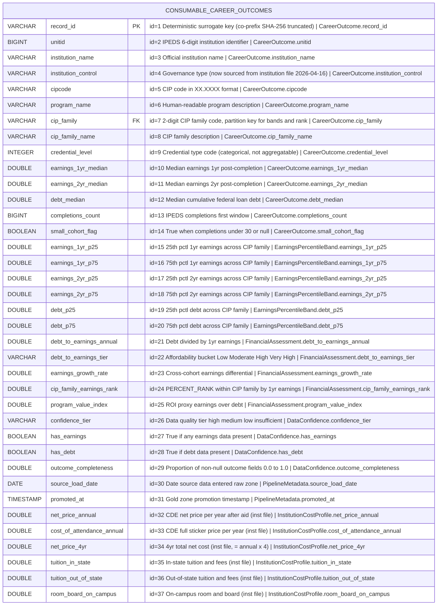

# Physical Model: gold-career-outcomes-college-scorecard

**Status:** PROPOSED (2026-04-16 amendment re-opens for human review)
**Mode:** Greenfield
**Zone:** Gold (Consumable)
**Domain:** Higher Education Outcomes
**Spec:** docs/specs/gold-career-outcomes-college-scorecard.md
**Amended By:** docs/specs/raw-ingest-college-scorecard-institution.md (Zone 3 — 2026-04-16)
**Logical Model:** governance/models/gold-career-outcomes-college-scorecard-logical.md
**Conceptual Model:** governance/models/gold-career-outcomes-college-scorecard-conceptual.md
**Author:** @semantic-modeler
**Date:** 2026-04-06 (original); 2026-04-16 (institution-cost enrichment: +7 columns, field IDs 32–38)

---



**Note on institution_control field ID (id=4):** This column already existed at field ID 4 and is kept in place. The 2026-04-16 amendment changes its *lineage* (now sourced from `base.college_scorecard_institution` via the LEFT JOIN instead of the program file) and relaxes nullability (`NOT NULL` -> `NULLABLE`), but the field ID, column name, and DuckDB type are unchanged. Iceberg schema evolution handles the nullability relaxation as additive.

**Note on field IDs:** Field IDs 32–37 are newly assigned for the 6 net-new enrichment columns (net_price_annual, cost_of_attendance_annual, net_price_4yr, tuition_in_state, tuition_out_of_state, room_board_on_campus). No existing field ID (1–31) is reused, renamed, or reordered. This matches the Iceberg schema-evolution rule in the spec (§Enrichment Mode note 7): "Existing field IDs unchanged." Max field ID is now 37.

---

## Table Definition

| Property | Value |
|----------|-------|
| **Catalog table** | `consumable.career_outcomes` |
| **Format** | Apache Iceberg (v2) |
| **Format version** | 2 (supports row-level deletes, merge-on-read) |
| **Engine** | DuckDB (via `iceberg_scan`) |
| **Grain** | One row per institution x program x credential level |
| **Natural key** | `unitid` + `cipcode` + `credential_level` |
| **Surrogate key** | `record_id` (deterministic SHA-256 hash, prefix `co`) |
| **Expected row count** | 69,947 (all Silver base rows carried forward) |
| **Partition strategy** | None (dataset < 100K rows; single partition is optimal for scan performance) |
| **Sort order** | `cip_family ASC, unitid ASC, cipcode ASC, credential_level ASC` |
| **Write pattern** | Full table replace via `brightsmith.infra.promote.promote()` (idempotent) |

### Iceberg Table Properties

| Property | Value | Rationale |
|----------|-------|-----------|
| `write.format.default` | `parquet` | Standard columnar format for analytical queries |
| `write.parquet.compression-codec` | `zstd` | Best compression ratio for this data profile |
| `format-version` | `2` | Required for Brightsmith promote pattern |
| `write.metadata.delete-after-commit.enabled` | `true` | Clean up old metadata files |
| `write.metadata.previous-versions-max` | `10` | Retain 10 snapshots for time-travel queries |

### Sort Order Rationale

Sort order leads with `cip_family` (instead of Silver's `unitid`-first sort) because the Gold table's primary query patterns involve CIP-family-level comparisons (percentile bands, earnings rank). Sorting by `cip_family` first clusters related programs together, improving scan efficiency for the effort slider and discipline comparison queries. The remaining sort keys (`unitid`, `cipcode`, `credential_level`) match the natural key for within-family ordering.

---

## Column Definitions

### Career Outcome (Core Identity + Outcome Fields)

The `Field ID` column below is the Iceberg schema-evolution field ID. These IDs are stable across schema changes — additive schema evolution (e.g. the 2026-04-16 amendment) assigns new IDs at the tail, never reusing or reordering existing ones.

| Field ID | Column | DuckDB Type | Nullable | Default | Constraint | Business Term | Is CDE | Is PII | Description |
|----------|--------|-------------|----------|---------|------------|---------------|--------|--------|-------------|
| 1 | record_id | VARCHAR | NOT NULL | derived | PRIMARY KEY | BT-015 | false | false | Deterministic surrogate key: `compute_grain_id(row, ['unitid', 'cipcode', 'credlev'], prefix='co')`. Format: `co-<16 hex chars>`. Stable across pipeline re-runs. |
| 2 | unitid | BIGINT | NOT NULL | -- | UNIQUE (composite with cipcode, credential_level) | BT-001 | true | false | IPEDS 6-digit institution identifier. Natural key component. Source: `base.college_scorecard.unitid`. Also the LEFT JOIN key into `base.college_scorecard_institution` for the 2026-04-16 enrichment. |
| 3 | institution_name | VARCHAR | NOT NULL | -- | -- | BT-002 | false | false | Official institution name as reported to IPEDS. Source: `base.college_scorecard.institution_name`. |
| 4 | institution_control | VARCHAR | NULLABLE | NULL | CHECK (institution_control IS NULL OR institution_control IN ('Public', 'Private nonprofit', 'Private for-profit')) | BT-114 | false | false | Type of institutional governance. AS OF 2026-04-16: sourced from `base.college_scorecard_institution.institution_control` via LEFT JOIN on unitid (replaces prior 100%-null carry-forward from `base.college_scorecard`). Nullability relaxed from NOT NULL to NULLABLE because unmatched UNITIDs produce no institution-file row. Column name, type, and Field ID (4) are unchanged. |
| 5 | cipcode | VARCHAR | NOT NULL | -- | UNIQUE (composite with unitid, credential_level); CHECK (cipcode ~ '^\d{2}\.\d{2,4}$') | BT-003 | false | false | CIP code in normalized XX.XXXX format. Natural key component. Source: `base.college_scorecard.cipcode`. |
| 6 | program_name | VARCHAR | NOT NULL | -- | -- | BT-004 | false | false | Human-readable program description. Source: `base.college_scorecard.program_name`. |
| 7 | cip_family | VARCHAR | NOT NULL | -- | CHECK (cip_family ~ '^\d{2}$') | BT-005 | false | false | 2-digit CIP family code. Partition key for percentile band and rank computations. Source: `base.college_scorecard.cip_family`. |
| 8 | cip_family_name | VARCHAR | NOT NULL | -- | -- | BT-006 | false | false | Human-readable label for the CIP family. Source: `base.college_scorecard.cip_family_name`. |
| 9 | credential_level | INTEGER | NOT NULL | -- | UNIQUE (composite with unitid, cipcode); CHECK (credential_level BETWEEN 1 AND 8) | BT-007 | false | false | Integer code for credential type. Categorical, not aggregatable. Natural key component. Source: `base.college_scorecard.credential_level`. |
| 10 | earnings_1yr_median | DOUBLE | NULLABLE | NULL | CHECK (earnings_1yr_median IS NULL OR (earnings_1yr_median >= 1000 AND earnings_1yr_median <= 250000)) | BT-009 | true | false | Median earnings 1 year post-completion. Null when privacy-suppressed. Source: `base.college_scorecard.earnings_1yr_median`. |
| 11 | earnings_2yr_median | DOUBLE | NULLABLE | NULL | CHECK (earnings_2yr_median IS NULL OR (earnings_2yr_median >= 1000 AND earnings_2yr_median <= 250000)) | BT-010 | true | false | Median earnings 2 years post-completion. Different cohort from 1yr. Null when privacy-suppressed. Source: `base.college_scorecard.earnings_2yr_median`. |
| 12 | debt_median | DOUBLE | NULLABLE | NULL | CHECK (debt_median IS NULL OR (debt_median >= 1000 AND debt_median <= 100000)) | BT-011 | true | false | Median cumulative federal loan debt at completion. Null when privacy-suppressed. Source: `base.college_scorecard.debt_median`. |
| 13 | completions_count | BIGINT | NULLABLE | NULL | CHECK (completions_count IS NULL OR completions_count >= 0) | BT-012 | false | false | IPEDS completions count (first major window). Source: `base.college_scorecard.completions_count_1` (renamed). |
| 14 | small_cohort_flag | BOOLEAN | NOT NULL | -- | -- | BT-014 | false | false | True when completions_count < 30 or completions data is null. Source: `base.college_scorecard.small_cohort_flag`. |

### Earnings Percentile Band (Derived: CIP-Family Window Aggregates)

| Field ID | Column | DuckDB Type | Nullable | Default | Constraint | Business Term | Is CDE | Is PII | Description |
|----------|--------|-------------|----------|---------|------------|---------------|--------|--------|-------------|
| 15 | earnings_1yr_p25 | DOUBLE | NULLABLE | NULL | CHECK (earnings_1yr_p25 IS NULL OR earnings_1yr_p25 >= 0) | BT-018 | true | false | 25th percentile of 1yr median earnings across all institutions in the same CIP family. Null if fewer than 3 non-null values. |
| 16 | earnings_1yr_p75 | DOUBLE | NULLABLE | NULL | CHECK (earnings_1yr_p75 IS NULL OR earnings_1yr_p75 >= 0) | BT-018 | true | false | 75th percentile of 1yr median earnings across CIP family. Null if fewer than 3 non-null values. Invariant: >= earnings_1yr_p25. |
| 17 | earnings_2yr_p25 | DOUBLE | NULLABLE | NULL | CHECK (earnings_2yr_p25 IS NULL OR earnings_2yr_p25 >= 0) | BT-018 | true | false | 25th percentile of 2yr median earnings across CIP family. Null if fewer than 3 non-null values. |
| 18 | earnings_2yr_p75 | DOUBLE | NULLABLE | NULL | CHECK (earnings_2yr_p75 IS NULL OR earnings_2yr_p75 >= 0) | BT-018 | true | false | 75th percentile of 2yr median earnings across CIP family. Null if fewer than 3 non-null values. Invariant: >= earnings_2yr_p25. |
| 19 | debt_p25 | DOUBLE | NULLABLE | NULL | CHECK (debt_p25 IS NULL OR debt_p25 >= 0) | BT-018 | true | false | 25th percentile of median debt across CIP family. Null if fewer than 3 non-null values. |
| 20 | debt_p75 | DOUBLE | NULLABLE | NULL | CHECK (debt_p75 IS NULL OR debt_p75 >= 0) | BT-018 | true | false | 75th percentile of median debt across CIP family. Null if fewer than 3 non-null values. Invariant: >= debt_p25. |

### Financial Assessment (Derived: Affordability and Value Metrics)

| Field ID | Column | DuckDB Type | Nullable | Default | Constraint | Business Term | Is CDE | Is PII | Description |
|----------|--------|-------------|----------|---------|------------|---------------|--------|--------|-------------|
| 21 | debt_to_earnings_annual | DOUBLE | NULLABLE | NULL | CHECK (debt_to_earnings_annual IS NULL OR debt_to_earnings_annual > 0) | BT-019 | true | false | Debt-to-earnings ratio: debt_median / earnings_1yr_median. Null if either input is null. |
| 22 | debt_to_earnings_tier | VARCHAR | NULLABLE | NULL | CHECK (debt_to_earnings_tier IS NULL OR debt_to_earnings_tier IN ('Low', 'Moderate', 'High', 'Very High')) | BT-020 | false | false | Categorical bucketing of debt-to-earnings ratio. Null if ratio is null. |
| 23 | earnings_growth_rate | DOUBLE | NULLABLE | NULL | -- | BT-021 | false | false | Cross-cohort earnings differential: (earnings_2yr_median - earnings_1yr_median) / earnings_1yr_median. Negative values expected. Null if either input is null. |
| 24 | cip_family_earnings_rank | DOUBLE | NULLABLE | NULL | CHECK (cip_family_earnings_rank IS NULL OR (cip_family_earnings_rank >= 0.0 AND cip_family_earnings_rank <= 1.0)) | BT-022 | false | false | PERCENT_RANK within CIP family by 1yr earnings. Range 0.0-1.0. Null if earnings_1yr_median is null. |
| 25 | program_value_index | DOUBLE | NULLABLE | NULL | CHECK (program_value_index IS NULL OR program_value_index > 0) | BT-023 | false | false | ROI proxy: earnings_1yr_median / debt_median. Higher = better value. Null if either input is null. |

### Data Confidence (Derived: Quality Context)

| Field ID | Column | DuckDB Type | Nullable | Default | Constraint | Business Term | Is CDE | Is PII | Description |
|----------|--------|-------------|----------|---------|------------|---------------|--------|--------|-------------|
| 26 | confidence_tier | VARCHAR | NOT NULL | -- | CHECK (confidence_tier IN ('high', 'medium', 'low', 'insufficient')) | BT-024 | false | false | Four-level data quality classification. Every row receives a tier. |
| 27 | has_earnings | BOOLEAN | NOT NULL | -- | -- | BT-024 | false | false | True if earnings_1yr_median IS NOT NULL OR earnings_2yr_median IS NOT NULL. |
| 28 | has_debt | BOOLEAN | NOT NULL | -- | -- | BT-024 | false | false | True if debt_median IS NOT NULL. |
| 29 | outcome_completeness | DOUBLE | NOT NULL | -- | CHECK (outcome_completeness IN (0.0, 0.33, 0.67, 1.0)) | BT-025 | false | false | Proportion of non-null core outcome fields (3 fields). Exact value set: {0.0, 0.33, 0.67, 1.0}. |

### Pipeline Metadata

| Field ID | Column | DuckDB Type | Nullable | Default | Constraint | Business Term | Is CDE | Is PII | Description |
|----------|--------|-------------|----------|---------|------------|---------------|--------|--------|-------------|
| 30 | source_load_date | DATE | NOT NULL | -- | -- | BT-016 | false | false | Date the source data was loaded into the raw zone. Source: `base.college_scorecard.source_load_date`. |
| 31 | promoted_at | TIMESTAMP | NOT NULL | -- | -- | BT-026 | false | false | Timestamp when the row was promoted to the Gold zone. Generated at promotion time via `datetime.now()`. Refreshes on every idempotent re-promote (including the 2026-04-16 enrichment re-promote). |

### Institution Cost Profile (Enrichment: Institution-Level Cost Structure — added 2026-04-16)

Seven columns sourced from `base.college_scorecard_institution` via `LEFT JOIN institution i ON i.unitid = b.unitid` in the Gold transformer CTE. All seven are nullable as a cluster: null-together for ~1,131 unmatched UNITIDs. Field IDs 32–37 are newly assigned (max prior field ID was 31). `institution_control` is NOT in this table — it already exists at Field ID 4 (re-sourced in place; see Career Outcome group above). This matches spec §Zone 3 which lists 7 enriched columns; 6 are brand-new physical columns (below) and 1 (institution_control) is an in-place lineage change.

Iceberg does not enforce CHECK constraints — the CHECK expressions below are modeled (documented) and enforced at DQ-rule time (see GLD-CSI-* rules in §Hard Constraints). They are preserved in the DDL block for documentation and for any future engine that does enforce them.

| Field ID | Column | DuckDB Type | Nullable | Default | Constraint | Business Term | Is CDE | Is PII | Description |
|----------|--------|-------------|----------|---------|------------|---------------|--------|--------|-------------|
| 32 | net_price_annual | DOUBLE | NULLABLE | NULL | CHECK (net_price_annual IS NULL OR net_price_annual >= -10000); CHECK (net_price_annual IS NULL OR cost_of_attendance_annual IS NULL OR net_price_annual <= cost_of_attendance_annual) | BT-111 | true | false | Average annual net price (after aid). Source: `base.college_scorecard_institution.net_price_annual`. CDE: future ROI-formula driver (follow-up spec). Lower bound relaxed to -$10,000 per GLD-CSI-004 (high-aid institutions legitimately produce small negative values). Upper bound is paired with `cost_of_attendance_annual` (invariant GLD-CSI-002). |
| 33 | cost_of_attendance_annual | DOUBLE | NULLABLE | NULL | CHECK (cost_of_attendance_annual IS NULL OR (cost_of_attendance_annual >= 5000 AND cost_of_attendance_annual <= 100000)) | BT-110 | true | false | Average annual cost of attendance (sticker price pre-aid). Source: `base.college_scorecard_institution.cost_of_attendance_annual`. CDE: upper-bound invariant partner for net_price_annual; primary receipts display field. Range mirrors Bronze DQ bounds from the institution ingest spec. |
| 34 | net_price_4yr | DOUBLE | NULLABLE | NULL | CHECK (net_price_4yr IS NULL OR net_price_4yr >= -40000); CHECK (net_price_4yr IS NULL OR net_price_annual IS NULL OR ABS(net_price_4yr - (net_price_annual * 4)) <= 1) | BT-113 | false | false | Four-year total net cost (= net_price_annual x 4 at Silver). Source: `base.college_scorecard_institution.net_price_4yr`. Invariant GLD-CSI-003: equals 4 x annual within $1. |
| 35 | tuition_in_state | DOUBLE | NULLABLE | NULL | CHECK (tuition_in_state IS NULL OR (tuition_in_state >= 0 AND tuition_in_state <= 65000)) | BT-115 | false | false | In-state tuition and fees. Source: `base.college_scorecard_institution.tuition_in_state`. Display/receipts only. Range mirrors Bronze DQ bounds. |
| 36 | tuition_out_of_state | DOUBLE | NULLABLE | NULL | CHECK (tuition_out_of_state IS NULL OR (tuition_out_of_state >= 0 AND tuition_out_of_state <= 80000)) | BT-115 | false | false | Out-of-state tuition and fees. Source: `base.college_scorecard_institution.tuition_out_of_state`. Display/receipts only. Upper bound slightly above in-state to accommodate private-equivalent out-of-state rates. |
| 37 | room_board_on_campus | DOUBLE | NULLABLE | NULL | CHECK (room_board_on_campus IS NULL OR (room_board_on_campus >= 3000 AND room_board_on_campus <= 25000)) | BT-116 | false | false | On-campus room and board. Source: `base.college_scorecard_institution.room_board_on_campus`. Display/receipts only. Range mirrors Bronze DQ bounds. |

---

## Column Summary

| Count | Category |
|-------|----------|
| 37 | Total columns (30 original + 7 institution-cost enrichment, 2026-04-16) |
| 37 | Max Iceberg field ID (contiguous 1–37; no gaps; no reuse) |
| 6 | Net-new columns in the 2026-04-16 amendment (field IDs 32–37) |
| 1 | In-place re-sourced column (institution_control, field ID 4) |
| 1 | Primary key (record_id) |
| 3 | Natural key components (unitid, cipcode, credential_level) |
| 4 | CDE columns carried from Silver program file (unitid, earnings_1yr_median, earnings_2yr_median, debt_median) |
| 6 | CDE columns new in Gold original (earnings_1yr_p25, earnings_1yr_p75, earnings_2yr_p25, earnings_2yr_p75, debt_p25, debt_p75) |
| 1 | CDE column new in Gold original (debt_to_earnings_annual) |
| 2 | CDE columns new in 2026-04-16 enrichment (net_price_annual, cost_of_attendance_annual) |
| 0 | PII columns |
| 24 | Nullable columns (16 original + 6 new net-new + 1 institution_control relaxed to nullable + 1 reconciling an off-by-one in the original model's stale count) |
| 13 | NOT NULL columns (was 14 in original metadata; institution_control relaxed NOT NULL -> NULLABLE) |
| 17 | Derived columns (original) |
| 13 | Carried from Silver `base.college_scorecard` verbatim |
| 7 | Sourced from Silver `base.college_scorecard_institution` via LEFT JOIN (field IDs 4, 32–37) |

---

## DDL (Reference)

This DDL is for documentation. The actual table is created via `brightsmith.infra.promote.promote()` which handles Iceberg table creation and idempotent writes.

```sql
-- Reference DDL for consumable.career_outcomes
-- Engine: DuckDB + Iceberg v2
-- Do not execute directly -- use promote() pattern

CREATE TABLE IF NOT EXISTS consumable.career_outcomes (
    -- Core Identity (field IDs 1-9)
    record_id                   VARCHAR     NOT NULL,   -- id=1
    unitid                      BIGINT      NOT NULL,   -- id=2
    institution_name            VARCHAR     NOT NULL,   -- id=3
    institution_control         VARCHAR,                -- id=4  (relaxed NOT NULL -> NULLABLE 2026-04-16; re-sourced from institution file)
    cipcode                     VARCHAR     NOT NULL,   -- id=5
    program_name                VARCHAR     NOT NULL,   -- id=6
    cip_family                  VARCHAR     NOT NULL,   -- id=7
    cip_family_name             VARCHAR     NOT NULL,   -- id=8
    credential_level            INTEGER     NOT NULL,   -- id=9

    -- Core Outcome Fields (field IDs 10-14)
    earnings_1yr_median         DOUBLE,                 -- id=10
    earnings_2yr_median         DOUBLE,                 -- id=11
    debt_median                 DOUBLE,                 -- id=12
    completions_count           BIGINT,                 -- id=13
    small_cohort_flag           BOOLEAN     NOT NULL,   -- id=14

    -- Earnings Percentile Bands (field IDs 15-20)
    earnings_1yr_p25            DOUBLE,                 -- id=15
    earnings_1yr_p75            DOUBLE,                 -- id=16
    earnings_2yr_p25            DOUBLE,                 -- id=17
    earnings_2yr_p75            DOUBLE,                 -- id=18
    debt_p25                    DOUBLE,                 -- id=19
    debt_p75                    DOUBLE,                 -- id=20

    -- Financial Assessment (field IDs 21-25)
    debt_to_earnings_annual     DOUBLE,                 -- id=21
    debt_to_earnings_tier       VARCHAR,                -- id=22
    earnings_growth_rate        DOUBLE,                 -- id=23
    cip_family_earnings_rank    DOUBLE,                 -- id=24
    program_value_index         DOUBLE,                 -- id=25

    -- Data Confidence (field IDs 26-29)
    confidence_tier             VARCHAR     NOT NULL,   -- id=26
    has_earnings                BOOLEAN     NOT NULL,   -- id=27
    has_debt                    BOOLEAN     NOT NULL,   -- id=28
    outcome_completeness        DOUBLE      NOT NULL,   -- id=29

    -- Pipeline Metadata (field IDs 30-31)
    source_load_date            DATE        NOT NULL,   -- id=30
    promoted_at                 TIMESTAMP   NOT NULL,   -- id=31

    -- Institution Cost Profile (field IDs 32-37, added 2026-04-16 via LEFT JOIN on unitid)
    net_price_annual            DOUBLE,                 -- id=32  (CDE)
    cost_of_attendance_annual   DOUBLE,                 -- id=33  (CDE)
    net_price_4yr               DOUBLE,                 -- id=34
    tuition_in_state            DOUBLE,                 -- id=35
    tuition_out_of_state        DOUBLE,                 -- id=36
    room_board_on_campus        DOUBLE,                 -- id=37

    -- Surrogate key
    PRIMARY KEY (record_id),

    -- Natural key uniqueness (enforced at load time, not by Iceberg)
    UNIQUE (unitid, cipcode, credential_level),

    -- Domain constraints
    CHECK (institution_control IS NULL OR institution_control IN ('Public', 'Private nonprofit', 'Private for-profit')),
    CHECK (cipcode ~ '^\d{2}\.\d{2,4}$'),
    CHECK (cip_family ~ '^\d{2}$'),
    CHECK (credential_level BETWEEN 1 AND 8),
    CHECK (earnings_1yr_median IS NULL OR (earnings_1yr_median >= 1000 AND earnings_1yr_median <= 250000)),
    CHECK (earnings_2yr_median IS NULL OR (earnings_2yr_median >= 1000 AND earnings_2yr_median <= 250000)),
    CHECK (debt_median IS NULL OR (debt_median >= 1000 AND debt_median <= 100000)),
    CHECK (completions_count IS NULL OR completions_count >= 0),
    CHECK (confidence_tier IN ('high', 'medium', 'low', 'insufficient')),
    CHECK (debt_to_earnings_tier IS NULL OR debt_to_earnings_tier IN ('Low', 'Moderate', 'High', 'Very High')),
    CHECK (cip_family_earnings_rank IS NULL OR (cip_family_earnings_rank >= 0.0 AND cip_family_earnings_rank <= 1.0)),
    CHECK (outcome_completeness IN (0.0, 0.33, 0.67, 1.0)),

    -- Institution Cost Profile constraints (added 2026-04-16; not enforced by Iceberg -- checked via DQ rules GLD-CSI-*)
    CHECK (net_price_annual IS NULL OR net_price_annual >= -10000),                                    -- GLD-CSI-004
    CHECK (net_price_annual IS NULL OR cost_of_attendance_annual IS NULL
        OR net_price_annual <= cost_of_attendance_annual),                                             -- GLD-CSI-002
    CHECK (cost_of_attendance_annual IS NULL OR (cost_of_attendance_annual BETWEEN 5000 AND 100000)),
    CHECK (net_price_4yr IS NULL OR net_price_4yr >= -40000),
    CHECK (net_price_4yr IS NULL OR net_price_annual IS NULL
        OR ABS(net_price_4yr - (net_price_annual * 4)) <= 1),                                          -- GLD-CSI-003
    CHECK (tuition_in_state IS NULL OR (tuition_in_state BETWEEN 0 AND 65000)),
    CHECK (tuition_out_of_state IS NULL OR (tuition_out_of_state BETWEEN 0 AND 80000)),
    CHECK (room_board_on_campus IS NULL OR (room_board_on_campus BETWEEN 3000 AND 25000))
);
```

---

## Source-to-Target Mapping

| Physical Column | DuckDB Type | Source Table | Source Field | Transformation |
|-----------------|-------------|-------------|--------------|----------------|
| record_id | VARCHAR | -- | derived | `compute_grain_id(row, ['unitid', 'cipcode', 'credlev'], prefix='co')` |
| unitid | BIGINT | base.college_scorecard | unitid | Verbatim |
| institution_name | VARCHAR | base.college_scorecard | institution_name | Verbatim |
| institution_control | VARCHAR | base.college_scorecard_institution | institution_control | AS OF 2026-04-16: LEFT JOIN on unitid (replaces prior 100%-null carry-forward from base.college_scorecard) |
| cipcode | VARCHAR | base.college_scorecard | cipcode | Verbatim |
| program_name | VARCHAR | base.college_scorecard | program_name | Verbatim |
| cip_family | VARCHAR | base.college_scorecard | cip_family | Verbatim |
| cip_family_name | VARCHAR | base.college_scorecard | cip_family_name | Verbatim |
| credential_level | INTEGER | base.college_scorecard | credential_level | Verbatim |
| earnings_1yr_median | DOUBLE | base.college_scorecard | earnings_1yr_median | Verbatim |
| earnings_2yr_median | DOUBLE | base.college_scorecard | earnings_2yr_median | Verbatim |
| debt_median | DOUBLE | base.college_scorecard | debt_median | Verbatim |
| completions_count | BIGINT | base.college_scorecard | completions_count_1 | Renamed from completions_count_1 |
| small_cohort_flag | BOOLEAN | base.college_scorecard | small_cohort_flag | Verbatim |
| earnings_1yr_p25 | DOUBLE | -- | derived | `PERCENTILE_CONT(0.25) WITHIN GROUP (ORDER BY earnings_1yr_median) OVER (PARTITION BY cip_family)` where CIP family has >= 3 non-null values, else NULL |
| earnings_1yr_p75 | DOUBLE | -- | derived | `PERCENTILE_CONT(0.75) WITHIN GROUP (ORDER BY earnings_1yr_median) OVER (PARTITION BY cip_family)` where CIP family has >= 3 non-null values, else NULL |
| earnings_2yr_p25 | DOUBLE | -- | derived | `PERCENTILE_CONT(0.25) WITHIN GROUP (ORDER BY earnings_2yr_median) OVER (PARTITION BY cip_family)` where >= 3 non-null, else NULL |
| earnings_2yr_p75 | DOUBLE | -- | derived | `PERCENTILE_CONT(0.75) WITHIN GROUP (ORDER BY earnings_2yr_median) OVER (PARTITION BY cip_family)` where >= 3 non-null, else NULL |
| debt_p25 | DOUBLE | -- | derived | `PERCENTILE_CONT(0.25) WITHIN GROUP (ORDER BY debt_median) OVER (PARTITION BY cip_family)` where >= 3 non-null, else NULL |
| debt_p75 | DOUBLE | -- | derived | `PERCENTILE_CONT(0.75) WITHIN GROUP (ORDER BY debt_median) OVER (PARTITION BY cip_family)` where >= 3 non-null, else NULL |
| debt_to_earnings_annual | DOUBLE | -- | derived | `debt_median / earnings_1yr_median` (NULL if either input NULL) |
| debt_to_earnings_tier | VARCHAR | -- | derived | `CASE WHEN dte < 0.75 THEN 'Low' WHEN dte < 1.5 THEN 'Moderate' WHEN dte < 2.5 THEN 'High' ELSE 'Very High' END` (NULL if ratio NULL) |
| earnings_growth_rate | DOUBLE | -- | derived | `(earnings_2yr_median - earnings_1yr_median) / earnings_1yr_median` (NULL if either input NULL) |
| cip_family_earnings_rank | DOUBLE | -- | derived | `PERCENT_RANK() OVER (PARTITION BY cip_family ORDER BY earnings_1yr_median)` (NULL rows excluded from window) |
| program_value_index | DOUBLE | -- | derived | `earnings_1yr_median / debt_median` (NULL if either input NULL) |
| confidence_tier | VARCHAR | -- | derived | See Confidence Tier Derivation below |
| has_earnings | BOOLEAN | -- | derived | `earnings_1yr_median IS NOT NULL OR earnings_2yr_median IS NOT NULL` |
| has_debt | BOOLEAN | -- | derived | `debt_median IS NOT NULL` |
| outcome_completeness | DOUBLE | -- | derived | `(CASE WHEN earnings_1yr_median IS NOT NULL THEN 1 ELSE 0 END + CASE WHEN earnings_2yr_median IS NOT NULL THEN 1 ELSE 0 END + CASE WHEN debt_median IS NOT NULL THEN 1 ELSE 0 END) / 3.0` |
| source_load_date | DATE | base.college_scorecard | source_load_date | Verbatim |
| promoted_at | TIMESTAMP | -- | generated | `CURRENT_TIMESTAMP` at Gold promotion time |
| net_price_annual | DOUBLE | base.college_scorecard_institution | net_price_annual | LEFT JOIN on unitid (added 2026-04-16) |
| cost_of_attendance_annual | DOUBLE | base.college_scorecard_institution | cost_of_attendance_annual | LEFT JOIN on unitid (added 2026-04-16) |
| net_price_4yr | DOUBLE | base.college_scorecard_institution | net_price_4yr | LEFT JOIN on unitid (added 2026-04-16) |
| tuition_in_state | DOUBLE | base.college_scorecard_institution | tuition_in_state | LEFT JOIN on unitid (added 2026-04-16) |
| tuition_out_of_state | DOUBLE | base.college_scorecard_institution | tuition_out_of_state | LEFT JOIN on unitid (added 2026-04-16) |
| room_board_on_campus | DOUBLE | base.college_scorecard_institution | room_board_on_campus | LEFT JOIN on unitid (added 2026-04-16) |

---

## Derivation Rules (Implementation Expressions)

### Confidence Tier Derivation

Evaluated top-to-bottom; first matching condition wins.

```sql
CASE
    WHEN small_cohort_flag = FALSE AND has_earnings = TRUE AND has_debt = TRUE
        THEN 'high'
    WHEN small_cohort_flag = FALSE AND (has_earnings = TRUE OR has_debt = TRUE)
        THEN 'medium'
    WHEN small_cohort_flag = TRUE AND (has_earnings = TRUE OR has_debt = TRUE)
        THEN 'low'
    ELSE 'insufficient'
END
```

### Debt-to-Earnings Tier Derivation

```sql
CASE
    WHEN debt_to_earnings_annual IS NULL THEN NULL
    WHEN debt_to_earnings_annual < 0.75 THEN 'Low'
    WHEN debt_to_earnings_annual < 1.5 THEN 'Moderate'
    WHEN debt_to_earnings_annual < 2.5 THEN 'High'
    ELSE 'Very High'
END
```

### Percentile Band Minimum Sample Guard

For each CIP family and each field (earnings_1yr_median, earnings_2yr_median, debt_median), count the non-null values. If the count is fewer than 3, set all bands for that family-field combination to NULL.

```sql
-- Example for earnings_1yr bands:
CASE
    WHEN COUNT(earnings_1yr_median) OVER (PARTITION BY cip_family) >= 3
        THEN PERCENTILE_CONT(0.25) WITHIN GROUP (ORDER BY earnings_1yr_median)
             OVER (PARTITION BY cip_family)
    ELSE NULL
END AS earnings_1yr_p25
```

---

## Nullability Semantics

| Column | NULL Means |
|--------|-----------|
| earnings_1yr_median | 1-year earnings suppressed for privacy (cohort too small) |
| earnings_2yr_median | 2-year earnings suppressed for privacy (different cohort) |
| debt_median | Debt data suppressed for privacy |
| completions_count | Completions count not reported for this measurement window |
| earnings_1yr_p25, earnings_1yr_p75 | CIP family has fewer than 3 non-null 1yr earnings values |
| earnings_2yr_p25, earnings_2yr_p75 | CIP family has fewer than 3 non-null 2yr earnings values |
| debt_p25, debt_p75 | CIP family has fewer than 3 non-null debt values |
| debt_to_earnings_annual | Either debt or 1yr earnings is null (privacy suppression) |
| debt_to_earnings_tier | Ratio is null (propagated from inputs) |
| earnings_growth_rate | Either 1yr or 2yr earnings is null |
| cip_family_earnings_rank | 1yr earnings is null (excluded from rank window) |
| program_value_index | Either 1yr earnings or debt is null |
| institution_control | UNITID has no match in `base.college_scorecard_institution` (~1,131 unmatched UNITIDs) or the source value was privacy-suppressed. AS OF 2026-04-16: was 100% null pre-enrichment via the program-file carry-forward; now populated for matched UNITIDs. |
| net_price_annual | UNITID unmatched in institution file OR source value was privacy-suppressed (cluster-null with the other 6 institution-cost fields for unmatched UNITIDs) |
| cost_of_attendance_annual | UNITID unmatched OR source value was privacy-suppressed |
| net_price_4yr | UNITID unmatched OR source `net_price_annual` was null |
| tuition_in_state / tuition_out_of_state / room_board_on_campus | UNITID unmatched OR individual source value was privacy-suppressed (these fields are individually nullable even within a matched UNITID) |

---

## Dropped Fields (from Silver, with justification)

| Silver Column | DuckDB Type | Dropped? | Justification |
|--------------|-------------|----------|---------------|
| completions_count_1 | BIGINT | Renamed | Renamed to `completions_count` for clarity in consumable layer |
| completions_count_2 | BIGINT | Dropped | Second-major completions not relevant to career outcomes query pattern |
| credential_description | VARCHAR | Dropped | Redundant with credential_level (always "Bachelor's Degree" in MVP) |
| ingested_at | TIMESTAMP | Dropped | Silver metadata replaced by `promoted_at` in Gold |

---

## Traceability: Logical to Physical

| Logical Attribute | Logical Type Domain | Physical Column | Physical DuckDB Type | Mapping Notes |
|-------------------|--------------------|-----------------|--------------------|---------------|
| record_id | identifier | record_id | VARCHAR | Hash output is always a string. Prefix changes from 'cs' to 'co'. |
| unitid | identifier | unitid | BIGINT | 6-digit numeric ID fits BIGINT |
| institution_name | text | institution_name | VARCHAR | Direct mapping |
| institution_control | text | institution_control | VARCHAR | Direct mapping. Field ID 4 unchanged. Source changed 2026-04-16 from `base.college_scorecard` to `base.college_scorecard_institution` via LEFT JOIN; nullability relaxed NOT NULL -> NULLABLE. |
| cipcode | identifier | cipcode | VARCHAR | Contains dot separator, must be string |
| program_name | text | program_name | VARCHAR | Direct mapping |
| cip_family | identifier | cip_family | VARCHAR | 2-digit code, kept as string for leading zeros |
| cip_family_name | text | cip_family_name | VARCHAR | Direct mapping |
| credential_level | numeric | credential_level | INTEGER | Categorical code, not DOUBLE (per Silver precedent) |
| earnings_1yr_median | numeric | earnings_1yr_median | DOUBLE | Monetary values use DOUBLE |
| earnings_2yr_median | numeric | earnings_2yr_median | DOUBLE | Monetary values use DOUBLE |
| debt_median | numeric | debt_median | DOUBLE | Monetary values use DOUBLE |
| completions_count | numeric | completions_count | BIGINT | Integer counts use BIGINT. Renamed from Silver's completions_count_1. |
| small_cohort_flag | boolean | small_cohort_flag | BOOLEAN | Direct mapping |
| earnings_1yr_p25 | numeric | earnings_1yr_p25 | DOUBLE | Percentile output is continuous |
| earnings_1yr_p75 | numeric | earnings_1yr_p75 | DOUBLE | Percentile output is continuous |
| earnings_2yr_p25 | numeric | earnings_2yr_p25 | DOUBLE | Percentile output is continuous |
| earnings_2yr_p75 | numeric | earnings_2yr_p75 | DOUBLE | Percentile output is continuous |
| debt_p25 | numeric | debt_p25 | DOUBLE | Percentile output is continuous |
| debt_p75 | numeric | debt_p75 | DOUBLE | Percentile output is continuous |
| debt_to_earnings_annual | numeric | debt_to_earnings_annual | DOUBLE | Ratio is continuous |
| debt_to_earnings_tier | text | debt_to_earnings_tier | VARCHAR | Categorical label |
| earnings_growth_rate | numeric | earnings_growth_rate | DOUBLE | Ratio is continuous |
| cip_family_earnings_rank | numeric | cip_family_earnings_rank | DOUBLE | PERCENT_RANK produces DOUBLE |
| program_value_index | numeric | program_value_index | DOUBLE | Ratio is continuous |
| confidence_tier | text | confidence_tier | VARCHAR | Categorical label |
| has_earnings | boolean | has_earnings | BOOLEAN | Direct mapping |
| has_debt | boolean | has_debt | BOOLEAN | Direct mapping |
| outcome_completeness | numeric | outcome_completeness | DOUBLE | Proportion is continuous |
| source_load_date | date | source_load_date | DATE | Direct mapping |
| promoted_at | timestamp | promoted_at | TIMESTAMP | Direct mapping |
| net_price_annual | numeric | net_price_annual | DOUBLE | Monetary values use DOUBLE. Field ID 32. Added 2026-04-16. |
| cost_of_attendance_annual | numeric | cost_of_attendance_annual | DOUBLE | Monetary values use DOUBLE. Field ID 33. Added 2026-04-16. |
| net_price_4yr | numeric | net_price_4yr | DOUBLE | Monetary values use DOUBLE. Field ID 34. Added 2026-04-16. |
| tuition_in_state | numeric | tuition_in_state | DOUBLE | Monetary values use DOUBLE. Field ID 35. Added 2026-04-16. |
| tuition_out_of_state | numeric | tuition_out_of_state | DOUBLE | Monetary values use DOUBLE. Field ID 36. Added 2026-04-16. |
| room_board_on_campus | numeric | room_board_on_campus | DOUBLE | Monetary values use DOUBLE. Field ID 37. Added 2026-04-16. |

---

## Constraints and Invariants

### Hard Constraints (DQ P0 -- block promotion if violated)

| Constraint | SQL Expression | Scope |
|------------|---------------|-------|
| Grain uniqueness | `COUNT(*) = COUNT(DISTINCT (unitid, cipcode, credential_level))` | Table-wide |
| Record ID uniqueness | `COUNT(*) = COUNT(DISTINCT record_id)` | Table-wide |
| Percentile band ordering | `earnings_1yr_p25 <= earnings_1yr_p75` (and same for all band pairs) | Per CIP family |
| Confidence tier completeness | `confidence_tier IS NOT NULL` for every row | Row-level |
| Confidence tier value set | `confidence_tier IN ('high', 'medium', 'low', 'insufficient')` | Row-level |
| has_earnings accuracy | `has_earnings = (earnings_1yr_median IS NOT NULL OR earnings_2yr_median IS NOT NULL)` | Row-level |
| has_debt accuracy | `has_debt = (debt_median IS NOT NULL)` | Row-level |
| Outcome completeness value set | `outcome_completeness IN (0.0, 0.33, 0.67, 1.0)` | Row-level |
| Row count | Row count within +/- 15% of Silver source (69,947 expected); exact match required post-2026-04-16 LEFT JOIN (GLD-CSI-001) | Table-wide |
| Net-price upper bound (GLD-CSI-002, 2026-04-16) | `net_price_annual IS NULL OR cost_of_attendance_annual IS NULL OR net_price_annual <= cost_of_attendance_annual` | Row-level |
| 4yr net-price identity (GLD-CSI-003, 2026-04-16) | `net_price_4yr IS NULL OR net_price_annual IS NULL OR ABS(net_price_4yr - (net_price_annual * 4)) <= 1` | Row-level |
| Net-price floor (GLD-CSI-004, 2026-04-16) | `net_price_annual IS NULL OR net_price_annual >= -10000` (legitimately negative at high-aid institutions; floor is safety guard) | Row-level |
| institution_control value set (GLD-CSI-009, 2026-04-16) | `institution_control IS NULL OR institution_control IN ('Public', 'Private nonprofit', 'Private for-profit')` | Row-level |

### Soft Constraints (DQ P1 -- warn but do not block)

| Constraint | SQL Expression | Scope |
|------------|---------------|-------|
| Debt-to-earnings range | `debt_to_earnings_annual BETWEEN 0.01 AND 10.0` (where non-null) | Row-level |
| Earnings growth range | `earnings_growth_rate BETWEEN -0.5 AND 2.0` (where non-null) | Row-level |
| Earnings rank range | `cip_family_earnings_rank BETWEEN 0.0 AND 1.0` (where non-null) | Row-level |
| Null propagation consistency | `debt_to_earnings_annual IS NULL` when `debt_median IS NULL OR earnings_1yr_median IS NULL` | Row-level |

---

## Open Issues (Carried from Logical)

| # | Issue | Status | Resolution |
|---|-------|--------|------------|
| 1 | ~~`institution_control` has no business term~~ | RESOLVED 2026-04-16 | Assigned BT-114 as part of the institution-cost enrichment. Lineage also upgraded: now sourced from `base.college_scorecard_institution`. |
| 2 | Percentile band behavior for CIP families with exactly 3 data points | ACCEPTED RISK | Minimum sample of 3 is per spec. Future iteration may raise threshold based on EDA. |
| 3 | Institution Cost Profile null rate (2026-04-16) | OPEN (non-blocking) | Expected 55–80% null on `net_price_annual` due to ~1,131 unmatched UNITIDs. DQ rule GLD-CSI-005 threshold is calibrated during EDA after first real LEFT JOIN. |
