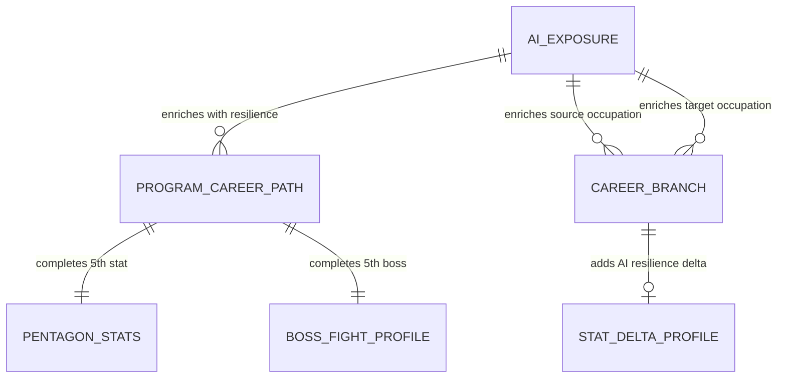

# Conceptual Model: gold-futureproof-engine-backfill-ai

**Status:** PROPOSED
**Mode:** Backfill (reverse-engineered from existing implementation)
**Zone:** Gold (Consumable)
**Domain:** Education / Career Guidance -- AI Exposure Backfill
**Spec:** docs/specs/raw-ingest-karpathy-ai-exposure.md (Zone 4: Backfill)
**Base Conceptual Model:** governance/models/gold-futureproof-engine-conceptual.md
**Author:** @semantic-modeler
**Date:** 2026-04-09
**Approval:** Pending human review (REQUIRE_HUMAN_APPROVAL = true)
**Upstream Models:** gold-ai-exposure-conceptual, gold-futureproof-engine-conceptual

---

---

## Scope

This conceptual model documents the integration of AI Exposure data into two existing Gold entities. It is not a new system -- it is the completion of two placeholder fields (`stat_res`, `boss_ai_score`) and the addition of AI resilience deltas to career branches. The base conceptual model at `governance/models/gold-futureproof-engine-conceptual.md` defines the full entity landscape; this addendum covers only what changes.

---

## Entity Descriptions

| Entity | Business Concept | Business Term | Is CDE | Is PII |
|--------|-----------------|---------------|--------|--------|
| AI Exposure | Karpathy's LLM-generated estimate of how much AI will reshape a given occupation (0-10 scale). The source data that enables the RES stat and AI Boss. Joins to existing Gold tables via SOC code. Covers ~342 BLS occupations. | BT-094 | true | false |
| Pentagon Stats | The five-stat scoring profile powering the pentagon visualization. This backfill completes the 5th stat (RES / AI Resilience), moving from 4/5 to 5/5 for covered occupations. | BT-077, BT-080 | true | false |
| Boss Fight Profile | Five boss fight scores representing career challenges. This backfill completes the 5th boss (Fight AI), moving from 4/5 to 5/5 for covered occupations. The AI Boss strength is derived directly from the exposure score with a floor of 1. | BT-081, BT-083 | true | false |
| Stat Delta Profile | Computed differences between source and target occupation stats across a career branch. This backfill adds `res_delta` (how AI resilience shifts along a career transition) and `ai_boss_delta` (the inverse). These are the primary new guidance signals for career branching decisions. | BT-091, BT-080, BT-083 | false | false |

---

## Key Concepts

### AI Resilience as the Inverse of Exposure

The Karpathy source measures **exposure** (higher = more AI disruption). FutureProof's pentagon stat measures **resilience** (higher = more protected from AI). The inversion formula `stat_res = MIN(11 - exposure_score, 10)` transforms the source signal to match the product's empowerment framing: a high RES score is good for the student.

### Pentagon Completion (5th Stat)

Before this backfill, the pentagon rendered 4 of 5 vertices (ERN, ROI, GRW, HMN) with a "coming soon" treatment on RES. After backfill, ~80-90% of program-career-path rows have all 5 stats populated. The `stats_available_count` field increases from a max of 4 to a max of 5 for matched rows, and `overall_confidence` tiers may improve.

### Gauntlet Completion (5th Boss)

The Fight AI boss (`boss_ai_score`) is the direct exposure score floored at 1 (`MAX(exposure_score, 1)`). It is the natural complement to RES: `stat_res + boss_ai_score = 11` for all scored occupations. This invariant means the boss difficulty is perfectly predictable from the stat, which is by design -- the AI boss *is* the inverse of your resilience.

### Career Branch AI Resilience Delta

The `res_delta` on career branches answers: "If I switch from career A to career B, does my AI resilience improve or worsen?" A positive `res_delta` means the target career is more resilient to AI disruption. This is a new guidance signal that did not exist before this backfill. The inverse `ai_boss_delta` is also computed for completeness (invariant: `res_delta + ai_boss_delta = 0`).

### Partial Coverage

Not all occupations have AI exposure scores. Karpathy scored 342 of ~832 BLS occupations. Program-career paths and career branches for unscored occupations retain NULL for all AI fields. The LEFT JOIN pattern is consistent with existing BLS and O*NET joins -- no rows are dropped.

---

## Relationship Descriptions

| Relationship | From | To | Cardinality | Description |
|-------------|------|-----|-------------|-------------|
| enriches with resilience | AI Exposure | Program Career Path | one-to-many | One AI exposure score per SOC code populates stat_res and boss_ai_score across all program-career paths sharing that SOC. LEFT JOIN preserves unmatched rows with NULLs. |
| enriches source occupation | AI Exposure | Career Branch | one-to-many | Provides source_res and source_ai_boss for all career branches originating from a scored occupation. |
| enriches target occupation | AI Exposure | Career Branch | one-to-many | Provides related_res and related_ai_boss for all career branches targeting a scored occupation. |
| completes 5th stat | Program Career Path | Pentagon Stats | one-to-one | The existing stat_res placeholder is filled. Pentagon goes from 4/5 to 5/5 for matched rows. |
| completes 5th boss | Program Career Path | Boss Fight Profile | one-to-one | The existing boss_ai_score placeholder is filled. Gauntlet goes from 4/5 to 5/5 for matched rows. |
| adds AI resilience delta | Career Branch | Stat Delta Profile | one-to-zero-or-one | res_delta and ai_boss_delta are computed when both source and target occupations have AI exposure data. NULL otherwise. |

---

## What Does Not Change

All entities, relationships, and business concepts from the base conceptual model (`gold-futureproof-engine-conceptual.md`) remain unchanged:

- Program Identity, Occupation Identity, CIP-SOC Bridge, CIP Family -- unchanged
- Program Context, Occupation Context -- unchanged
- Data Quality Assessment structure -- unchanged (match_quality taxonomy is not modified; only stats_available_count and bosses_available_count ranges expand)
- ERN, ROI, GRW, HMN stat derivations -- unchanged
- Loans, Market, Burnout, Ceiling boss derivations -- unchanged
- Grain of both tables -- unchanged
- CIP prefix match strategy -- unchanged

---

## Modeling Decisions

1. **Addendum model, not replacement.** This conceptual model supplements the base model rather than replacing it. The base model already documented RES and AI Boss as placeholder entities. This backfill fills them in without restructuring.

2. **AI Exposure as a peer data source, not a core join.** The match_quality taxonomy (full/partial_no_onet/partial_no_bls/scorecard_only) does not change. AI exposure is treated as supplemental enrichment -- its absence does not degrade match quality classification. This is a deliberate design choice: Karpathy's LLM-generated scores are not equivalent in authority to BLS or O*NET empirical data.

3. **res_delta as the primary new signal.** The career branches table already had grw_delta, hmn_delta, burnout_delta, and wage_delta. Adding res_delta completes the "what changes if I switch careers" story with the AI dimension.
