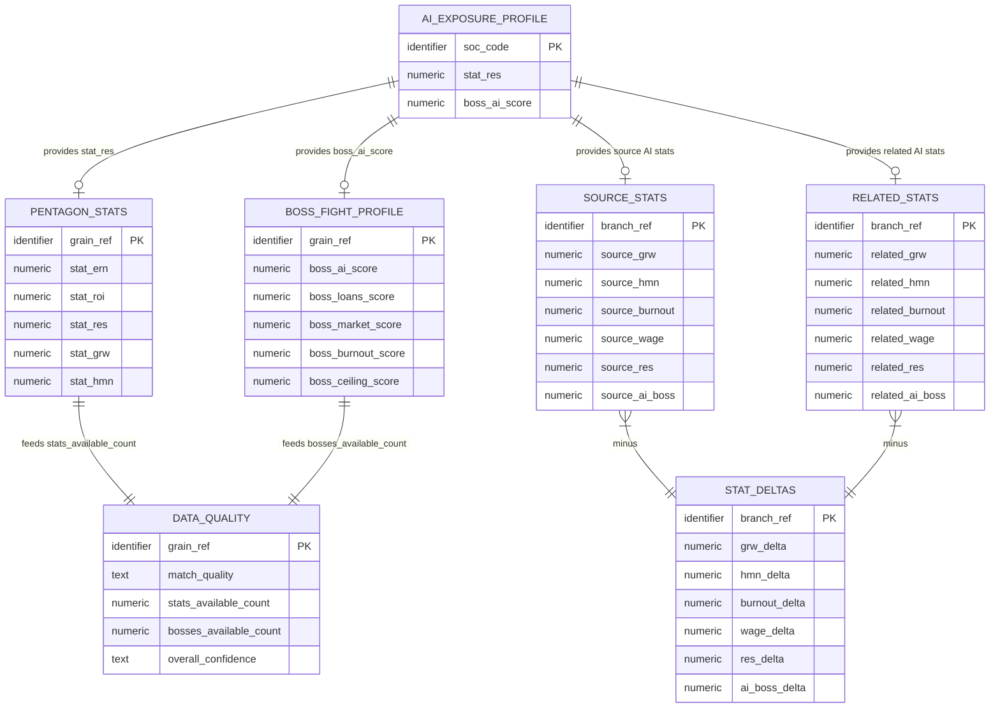

# Logical Model: gold-futureproof-engine-backfill-ai

**Status:** PROPOSED
**Mode:** Backfill (reverse-engineered from existing implementation)
**Zone:** Gold (Consumable)
**Domain:** Education / Career Guidance -- AI Exposure Backfill
**Spec:** docs/specs/raw-ingest-karpathy-ai-exposure.md (Zone 4: Backfill)
**Physical Model:** governance/models/gold-futureproof-engine-backfill-ai-physical.md
**Base Logical Model:** governance/models/gold-futureproof-engine-logical.md
**Author:** @semantic-modeler
**Date:** 2026-04-09
**Approval:** Pending human review (REQUIRE_HUMAN_APPROVAL = true)
**Upstream Models:** gold-ai-exposure-logical, gold-futureproof-engine-logical

---

## Scope

This logical model documents the changes to two existing Gold entities when AI exposure data is integrated. It does not redefine the full entities -- only the new relationship and the attributes that change from placeholder to populated.

---



---

## New Relationship: AI Exposure to FutureProof Engine

### Relationship Definition

| Property | Value |
|----------|-------|
| **Source entity** | AiExposureProfile (from `consumable.ai_exposure`) |
| **Target entity 1** | ProgramCareerPath (in `consumable.program_career_paths`) |
| **Target entity 2** | CareerBranch (in `consumable.career_branches`) |
| **Join type** | LEFT JOIN (preserves all target rows; NULL when no AI data) |
| **Join key** | `soc_code` (SOC occupation code, XX-XXXX format) |
| **Cardinality (to PCP)** | 1:N -- one AI exposure score per SOC; many program-career paths share the same SOC |
| **Cardinality (to CB)** | 1:N -- one AI exposure score per SOC; many career branches share the same source or target SOC |
| **Coverage** | ~80-90% of PCP rows; ~70-85% of CB source/target SOCs (Karpathy scored 342 of ~832 BLS occupations) |

### Why LEFT JOIN

The ai_exposure table covers a subset of occupations. Using an INNER JOIN would discard program-career paths for unscored occupations. LEFT JOIN preserves the full dataset with NULLs for unscored occupations, matching the existing pattern for occupation_profiles and onet_work_profiles.

---

## Attribute Changes: Table 1 (consumable.program_career_paths)

### Pentagon Stats (changed attributes)

| Attribute | Business Term | Type Domain | Nullable | Is CDE | Is PII | Before | After |
|-----------|--------------|-------------|----------|--------|--------|--------|-------|
| stat_res | BT-080 | numeric | NULLABLE | true | false | Always NULL (placeholder awaiting Karpathy) | Populated from `AiExposureProfile.stat_res` via LEFT JOIN. Range 1-10. NULL when SOC not in ai_exposure. |

### Boss Fight Profile (changed attributes)

| Attribute | Business Term | Type Domain | Nullable | Is CDE | Is PII | Before | After |
|-----------|--------------|-------------|----------|--------|--------|--------|-------|
| boss_ai_score | BT-083 | numeric | NULLABLE | true | false | Always NULL (placeholder awaiting Karpathy) | Populated from `AiExposureProfile.boss_ai_score` via LEFT JOIN. Range 1-10. NULL when SOC not in ai_exposure. |

### Data Quality (recomputed attributes)

| Attribute | Business Term | Type Domain | Nullable | Is CDE | Is PII | Before | After |
|-----------|--------------|-------------|----------|--------|--------|--------|-------|
| stats_available_count | BT-087 | numeric | NOT NULL | false | false | 0-4 (stat_res always excluded from count) | 0-5 (stat_res included when non-null) |
| bosses_available_count | BT-088 | numeric | NOT NULL | false | false | 0-4 (boss_ai_score always excluded from count) | 0-5 (boss_ai_score included when non-null) |
| overall_confidence | BT-089 | text | NOT NULL | false | false | Derived from 0-4 stats + match_quality | Derived from 0-5 stats + match_quality. Rows that had 4 stats + full match now have 5 stats + full match, remaining "high". Some "medium" rows may upgrade. |

### Derivation Rules (unchanged)

The derivation formulas themselves do not change. The backfill only provides input data that was previously NULL:

| Derived Attribute | Formula | Change |
|-------------------|---------|--------|
| stats_available_count | `COUNT(non-null in [stat_ern, stat_roi, stat_res, stat_grw, stat_hmn])` | No formula change; stat_res now has values to count |
| bosses_available_count | `COUNT(non-null in [boss_ai_score, boss_loans_score, boss_market_score, boss_burnout_score, boss_ceiling_score])` | No formula change; boss_ai_score now has values to count |
| overall_confidence | `derive_overall_confidence(stats_available_count, match_quality)` | No formula change; input stats_available_count may be higher |

---

## Attribute Changes: Table 2 (consumable.career_branches)

### Source Stats (new attributes)

| Attribute | Business Term | Type Domain | Nullable | Is CDE | Is PII | Description |
|-----------|--------------|-------------|----------|--------|--------|-------------|
| source_res | BT-080 | numeric | NULLABLE | true | false | AI Resilience stat for the source (origin) occupation. Range 1-10. From `AiExposureProfile.stat_res` via LEFT JOIN on `CareerBranch.soc_code`. NULL when source SOC not in ai_exposure. |
| source_ai_boss | BT-083 | numeric | NULLABLE | true | false | AI Boss strength for the source occupation. Range 1-10. From `AiExposureProfile.boss_ai_score` via LEFT JOIN on `CareerBranch.soc_code`. |

### Related Stats (new attributes)

| Attribute | Business Term | Type Domain | Nullable | Is CDE | Is PII | Description |
|-----------|--------------|-------------|----------|--------|--------|-------------|
| related_res | BT-080 | numeric | NULLABLE | true | false | AI Resilience stat for the target (branch destination) occupation. Range 1-10. From `AiExposureProfile.stat_res` via LEFT JOIN on `CareerBranch.related_soc_code`. |
| related_ai_boss | BT-083 | numeric | NULLABLE | true | false | AI Boss strength for the target occupation. Range 1-10. From `AiExposureProfile.boss_ai_score` via LEFT JOIN on `CareerBranch.related_soc_code`. |

### Stat Deltas (new attributes)

| Attribute | Business Term | Type Domain | Nullable | Is CDE | Is PII | Description |
|-----------|--------------|-------------|----------|--------|--------|-------------|
| res_delta | BT-080 | numeric | NULLABLE | false | false | `related_res - source_res`. Positive means the target occupation is more resilient to AI than the source. Useful for career branch decisions: "does switching to this career make you more or less AI-resilient?" NULL if either side is NULL. |
| ai_boss_delta | BT-083 | numeric | NULLABLE | false | false | `related_ai_boss - source_ai_boss`. Positive means the target faces a stronger AI boss. Inverse of res_delta by construction. NULL if either side is NULL. |

### Derivation Rules (new)

| Derived Attribute | Formula | Inputs | Notes |
|-------------------|---------|--------|-------|
| source_res | Passthrough | `ai_exposure.stat_res` WHERE `ai_exposure.soc_code = career_branch.soc_code` | LEFT JOIN; NULL if no match |
| source_ai_boss | Passthrough | `ai_exposure.boss_ai_score` WHERE `ai_exposure.soc_code = career_branch.soc_code` | LEFT JOIN; NULL if no match |
| related_res | Passthrough | `ai_exposure.stat_res` WHERE `ai_exposure.soc_code = career_branch.related_soc_code` | LEFT JOIN; NULL if no match |
| related_ai_boss | Passthrough | `ai_exposure.boss_ai_score` WHERE `ai_exposure.soc_code = career_branch.related_soc_code` | LEFT JOIN; NULL if no match |
| res_delta | `related_res - source_res` | related_res, source_res | NULL if either input is NULL. Range: -9 to +9. |
| ai_boss_delta | `related_ai_boss - source_ai_boss` | related_ai_boss, source_ai_boss | NULL if either input is NULL. Range: -9 to +9. Invariant: `ai_boss_delta = -res_delta` when both non-null. |

### Cross-Field Invariant (career_branches)

When both source and target have AI exposure data:
```
res_delta + ai_boss_delta = 0
```

This holds because `stat_res + boss_ai_score = 11` for all occupations (from the ai_exposure derivation), so the deltas are exact inverses.

---

## Updated Join Chain

### Table 1: program_career_paths

| Step | Join | Type | Left Key | Right Key | Notes |
|------|------|------|----------|-----------|-------|
| 1 | career_outcomes | -- | -- | -- | Base table (unchanged) |
| 2 | cip_soc_crosswalk | INNER | cipcode | LEFT(cipcode, 5) | CIP prefix match (unchanged) |
| 3 | occupation_profiles | LEFT | soc_code | soc_code | BLS data (unchanged) |
| 4 | onet_work_profiles | LEFT | soc_code | bls_soc_code | O*NET data (unchanged) |
| **5** | **ai_exposure** | **LEFT** | **soc_code** | **soc_code** | **NEW: AI resilience + boss score** |
| 6 | Dedup on grain | -- | -- | -- | Unchanged |

### Table 2: career_branches

| Step | Join | Type | Left Key | Right Key | Notes |
|------|------|------|----------|-----------|-------|
| 1 | career_transitions | -- | -- | -- | Base table (unchanged) |
| 2 | occupation_profiles (source) | LEFT | soc_code | soc_code | Unchanged |
| 3 | onet_work_profiles (source) | LEFT | soc_code | bls_soc_code | Unchanged |
| 4 | occupation_profiles (related) | LEFT | related_soc_code | soc_code | Unchanged |
| 5 | onet_work_profiles (related) | LEFT | related_soc_code | bls_soc_code | Unchanged |
| **6** | **ai_exposure (source)** | **LEFT** | **soc_code** | **soc_code** | **NEW: source AI stats** |
| **7** | **ai_exposure (related)** | **LEFT** | **related_soc_code** | **soc_code** | **NEW: target AI stats** |

---

## Unchanged Attributes

All other attributes in both tables are completely unchanged by this backfill. For the full attribute definitions, see the base logical model at `governance/models/gold-futureproof-engine-logical.md`.

### program_career_paths: 35 unchanged attributes

Core identity (9), program context (6), occupation context (9), stat_ern (1), stat_roi (1), stat_grw (1), stat_hmn (1), boss_loans_score (1), boss_market_score (1), boss_burnout_score (1), boss_ceiling_score (1), match_quality (1), promoted_at (1).

### career_branches: 18 unchanged attributes

Core identity (8), source stats excluding AI (4), related stats excluding AI (6).

---

## Design Decisions

1. **LEFT JOIN, not INNER JOIN.** Consistent with existing pattern. Occupations without AI exposure data retain all other stats; they just show NULL for RES/AI fields.

2. **No match_quality change.** The spec says match_quality derivation is unchanged. AI exposure is a supplemental enrichment, not a core data source like BLS or O*NET. The existing "full/partial_no_onet/partial_no_bls/scorecard_only" taxonomy remains.

3. **career_branches gets new columns (not reuse of existing).** The existing career_branches schema has no placeholder columns for AI stats. Unlike program_career_paths (which had stat_res and boss_ai_score as nullable placeholders from day one), career_branches needs schema evolution. The naming convention follows the existing pattern: `source_<stat>`, `related_<stat>`, `<stat>_delta`.

4. **res_delta provides career guidance signal.** A student considering a career branch can see whether the target occupation is more or less AI-resilient than their current path. This is the primary frontend use case for the new career_branches fields.
