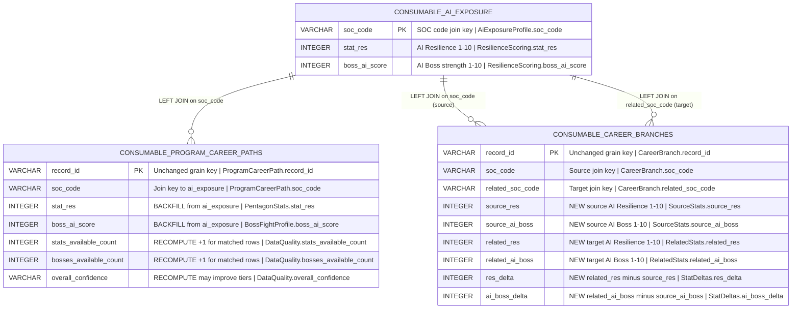

# Physical Model: gold-futureproof-engine-backfill-ai

**Status:** PROPOSED
**Mode:** Backfill (reverse-engineered from existing implementation)
**Zone:** Gold (Consumable)
**Domain:** Education / Career Guidance -- AI Exposure Backfill
**Spec:** docs/specs/raw-ingest-karpathy-ai-exposure.md (Zone 4: Backfill)
**Logical Model:** governance/models/gold-futureproof-engine-backfill-ai-logical.md
**Base Physical Model:** governance/models/gold-futureproof-engine-physical.md
**Source Code:** src/gold/futureproof_engine.py
**Author:** @semantic-modeler
**Date:** 2026-04-09
**Approval:** Pending human review (REQUIRE_HUMAN_APPROVAL = true)

---

## Scope

This is a **schema-preserving backfill**. No columns are added or removed from either table. The existing Iceberg schemas in `get_pcp_schema()` and `get_br_schema()` already define `stat_res`, `boss_ai_score`, and related fields as nullable integers. This backfill populates those fields by adding `consumable.ai_exposure` as a new join source.

The career_branches table gains six new columns for AI stats and delta. These are net-new schema additions.

---



---

## Table 1: consumable.program_career_paths -- Backfill Changes

### Schema Impact: No New Columns

The existing Iceberg schema (`get_pcp_schema()`, 40 columns) already includes `stat_res` (field 13) and `boss_ai_score` (field 16) as nullable INTEGER fields. No schema evolution is needed.

### Join Change

| Property | Before Backfill | After Backfill |
|----------|----------------|----------------|
| **Join sources** | career_outcomes, crosswalk, occupation_profiles, onet_work_profiles | career_outcomes, crosswalk, occupation_profiles, onet_work_profiles, **ai_exposure** |
| **New join** | -- | `LEFT JOIN consumable.ai_exposure aie ON pcp.soc_code = aie.soc_code` |
| **Join position** | -- | After onet_work_profiles LEFT JOIN, before dedup |

### Column Updates

| Column | DuckDB Type | Before | After | Business Term | Is CDE | Is PII | Source |
|--------|-------------|--------|-------|---------------|--------|--------|--------|
| stat_res | INTEGER | Always NULL (placeholder) | `aie.stat_res` (1-10) where matched; NULL where no AI exposure data | BT-080 | true | false | `consumable.ai_exposure.stat_res` via LEFT JOIN on soc_code |
| boss_ai_score | INTEGER | Always NULL (placeholder) | `aie.boss_ai_score` (1-10) where matched; NULL where no AI exposure data | BT-083 | true | false | `consumable.ai_exposure.boss_ai_score` via LEFT JOIN on soc_code |
| stats_available_count | INTEGER | 0-4 (stat_res always excluded) | 0-5 (stat_res included when ai_exposure matches) | BT-087 | false | false | Recomputed: count of non-null values in (stat_ern, stat_roi, stat_res, stat_grw, stat_hmn) |
| bosses_available_count | INTEGER | 0-4 (boss_ai_score always excluded) | 0-5 (boss_ai_score included when ai_exposure matches) | BT-088 | false | false | Recomputed: count of non-null values in (boss_ai_score, boss_loans_score, boss_market_score, boss_burnout_score, boss_ceiling_score) |
| overall_confidence | VARCHAR | Derived from 0-4 stats + match_quality | Derived from 0-5 stats + match_quality (may upgrade some rows from "medium" to "high") | BT-089 | false | false | Recomputed via `derive_overall_confidence(stats_available_count, match_quality)` |

### Code Changes Required (src/gold/futureproof_engine.py)

1. **Read `consumable.ai_exposure`** in `transform()` alongside existing source reads.
2. **Pass `ai_exposure_rows`** to `derive_pcp_rows()` as a new parameter.
3. **Register `ai_exposure`** as a DuckDB table in `derive_pcp_rows()`.
4. **Add LEFT JOIN** to `PCP_SQL`:
   ```sql
   LEFT JOIN ai_exposure aie ON xw.soc_code = aie.soc_code
   ```
5. **Replace placeholder** in post-processing:
   ```python
   # Before:
   stat_res = None  # Placeholder
   # After:
   stat_res = row.get("aie_stat_res")  # From LEFT JOIN, may be None
   ```
6. **Replace placeholder**:
   ```python
   # Before:
   row["boss_ai_score"] = None  # Placeholder
   # After:
   row["boss_ai_score"] = row.get("aie_boss_ai_score")  # From LEFT JOIN
   ```
7. **match_quality** derivation: consider adding `has_ai` flag. The spec says match_quality is unchanged, so this is optional. The existing `derive_match_quality(has_bls, has_onet)` function does not change.

### Expected Coverage

| Metric | Value |
|--------|-------|
| Total program_career_paths rows | ~250,000 |
| Rows with SOC in ai_exposure (~342 scored occupations) | ~80-90% |
| Rows where stat_res becomes non-null | ~200,000-225,000 |
| Rows where stat_res remains null | ~25,000-50,000 (SOC not in Karpathy's 342) |

---

## Table 2: consumable.career_branches -- Backfill Changes

### Schema Impact: Six New Columns

The existing Iceberg schema (`get_br_schema()`, 24 columns) does NOT include AI stat fields. The backfill adds six new columns, requiring schema evolution.

### New Columns

| Column | DuckDB Type | Nullable | Constraint | Business Term | Is CDE | Is PII | Description |
|--------|-------------|----------|------------|---------------|--------|--------|-------------|
| source_res | INTEGER | NULLABLE | CHECK (source_res >= 1 AND source_res <= 10) | BT-080 | true | false | Source occupation AI Resilience stat (1-10). From `consumable.ai_exposure.stat_res` via LEFT JOIN on `soc_code`. NULL when source SOC not in ai_exposure. |
| source_ai_boss | INTEGER | NULLABLE | CHECK (source_ai_boss >= 1 AND source_ai_boss <= 10) | BT-083 | true | false | Source occupation AI Boss strength (1-10). From `consumable.ai_exposure.boss_ai_score` via LEFT JOIN on `soc_code`. |
| related_res | INTEGER | NULLABLE | CHECK (related_res >= 1 AND related_res <= 10) | BT-080 | true | false | Target occupation AI Resilience stat (1-10). From `consumable.ai_exposure.stat_res` via LEFT JOIN on `related_soc_code`. |
| related_ai_boss | INTEGER | NULLABLE | CHECK (related_ai_boss >= 1 AND related_ai_boss <= 10) | BT-083 | true | false | Target occupation AI Boss strength (1-10). From `consumable.ai_exposure.boss_ai_score` via LEFT JOIN on `related_soc_code`. |
| res_delta | INTEGER | NULLABLE | -- | BT-080 | false | false | `related_res - source_res`. Shows how AI resilience shifts along a career branch. Positive = target is more resilient. NULL if either side is NULL. |
| ai_boss_delta | INTEGER | NULLABLE | -- | BT-083 | false | false | `related_ai_boss - source_ai_boss`. Shows how AI threat shifts along a career branch. Positive = target faces stronger AI boss. NULL if either side is NULL. |

### Join Changes

| Property | Before Backfill | After Backfill |
|----------|----------------|----------------|
| **Join sources** | career_transitions, occupation_profiles, onet_work_profiles | career_transitions, occupation_profiles, onet_work_profiles, **ai_exposure (x2)** |
| **New joins** | -- | `LEFT JOIN consumable.ai_exposure aie_src ON soc_code = aie_src.soc_code` and `LEFT JOIN consumable.ai_exposure aie_tgt ON related_soc_code = aie_tgt.soc_code` |

### Code Changes Required (src/gold/futureproof_engine.py)

1. **Update `get_br_schema()`** to add 6 new fields (field IDs 25-30):
   ```python
   NestedField(25, "source_res", IntegerType(), required=False),
   NestedField(26, "source_ai_boss", IntegerType(), required=False),
   NestedField(27, "related_res", IntegerType(), required=False),
   NestedField(28, "related_ai_boss", IntegerType(), required=False),
   NestedField(29, "res_delta", IntegerType(), required=False),
   NestedField(30, "ai_boss_delta", IntegerType(), required=False),
   ```

2. **Pass `ai_exposure_rows`** to `derive_br_rows()` as a new parameter.

3. **Build ai_exposure lookup** in `derive_br_rows()`:
   ```python
   ai_by_soc: dict[str, dict] = {r["soc_code"]: r for r in ai_exposure_rows}
   ```

4. **Populate new fields** in the row construction loop:
   ```python
   src_ai = ai_by_soc.get(soc, {})
   rel_ai = ai_by_soc.get(related_soc, {})
   source_res = src_ai.get("stat_res")
   source_ai_boss = src_ai.get("boss_ai_score")
   related_res = rel_ai.get("stat_res")
   related_ai_boss = rel_ai.get("boss_ai_score")
   res_delta = (related_res - source_res) if (related_res is not None and source_res is not None) else None
   ai_boss_delta = (related_ai_boss - source_ai_boss) if (related_ai_boss is not None and source_ai_boss is not None) else None
   ```

5. **Update `branch_has_full_data`** to include AI data:
   ```python
   # Before:
   branch_has_full_data = (related_grw is not None and related_hmn is not None)
   # After (consider):
   branch_has_full_data = (related_grw is not None and related_hmn is not None and related_res is not None)
   ```

### Updated DDL (career_branches, documentation only)

```sql
CREATE TABLE consumable.career_branches (
    -- Existing 24 columns unchanged --
    record_id           VARCHAR NOT NULL PRIMARY KEY,
    soc_code            VARCHAR NOT NULL,
    source_title        VARCHAR NOT NULL,
    related_soc_code    VARCHAR NOT NULL,
    related_title       VARCHAR NOT NULL,
    best_index          INTEGER NOT NULL,
    relatedness_tier    VARCHAR NOT NULL,
    is_primary          BOOLEAN NOT NULL,
    source_grw          INTEGER,
    source_hmn          INTEGER,
    source_burnout      INTEGER,
    source_wage         DOUBLE,
    related_grw         INTEGER,
    related_hmn         INTEGER,
    related_burnout     INTEGER,
    related_wage        DOUBLE,
    related_growth_category VARCHAR,
    related_education_level VARCHAR,
    grw_delta           INTEGER,
    hmn_delta           INTEGER,
    burnout_delta       INTEGER,
    wage_delta          DOUBLE,
    branch_has_full_data BOOLEAN NOT NULL,
    promoted_at         TIMESTAMP NOT NULL,
    -- New columns (backfill) --
    source_res          INTEGER CHECK (source_res >= 1 AND source_res <= 10),
    source_ai_boss      INTEGER CHECK (source_ai_boss >= 1 AND source_ai_boss <= 10),
    related_res         INTEGER CHECK (related_res >= 1 AND related_res <= 10),
    related_ai_boss     INTEGER CHECK (related_ai_boss >= 1 AND related_ai_boss <= 10),
    res_delta           INTEGER,
    ai_boss_delta       INTEGER
);
```

---

## DQ Rule Updates

### program_career_paths

| Rule | Before | After |
|------|--------|-------|
| stat_res IS NULL for all rows | P0 (enforced) | REMOVE -- stat_res is now populated for ~80-90% of rows |
| boss_ai_score IS NULL for all rows | P0 (enforced) | REMOVE -- boss_ai_score is now populated |
| stat_res range (where non-null) | N/A | ADD: 1 <= stat_res <= 10 (P0) |
| boss_ai_score range (where non-null) | N/A | ADD: 1 <= boss_ai_score <= 10 (P0) |
| stats_available_count max | max = 4 | max = 5 |
| bosses_available_count max | max = 4 | max = 5 |
| stat_res coverage | N/A | ADD: stat_res non-null for >= 75% of rows (P1) |

### career_branches

| Rule | Type | Priority | Description |
|------|------|----------|-------------|
| source_res range | range check | P0 | 1 <= source_res <= 10 where non-null |
| related_res range | range check | P0 | 1 <= related_res <= 10 where non-null |
| source_ai_boss range | range check | P0 | 1 <= source_ai_boss <= 10 where non-null |
| related_ai_boss range | range check | P0 | 1 <= related_ai_boss <= 10 where non-null |
| res_delta consistency | cross-field | P0 | res_delta = related_res - source_res where both non-null |
| ai_boss_delta consistency | cross-field | P0 | ai_boss_delta = related_ai_boss - source_ai_boss where both non-null |

---

## Source-to-Target Mapping (Changed Fields Only)

### program_career_paths

| Gold Column | Source Column | Transformation |
|------------|--------------|----------------|
| stat_res | `consumable.ai_exposure.stat_res` | LEFT JOIN on soc_code; passthrough (NULL if no match) |
| boss_ai_score | `consumable.ai_exposure.boss_ai_score` | LEFT JOIN on soc_code; passthrough (NULL if no match) |
| stats_available_count | all 5 pentagon stat fields | Recomputed: `SUM(CASE WHEN stat IS NOT NULL THEN 1 ELSE 0 END)` for all 5 stats |
| bosses_available_count | all 5 boss score fields | Recomputed: `SUM(CASE WHEN boss IS NOT NULL THEN 1 ELSE 0 END)` for all 5 bosses |
| overall_confidence | stats_available_count, match_quality | Recomputed via `derive_overall_confidence()` |

### career_branches (new columns)

| Gold Column | Source Column | Transformation |
|------------|--------------|----------------|
| source_res | `consumable.ai_exposure.stat_res` | LEFT JOIN on `soc_code`; passthrough |
| source_ai_boss | `consumable.ai_exposure.boss_ai_score` | LEFT JOIN on `soc_code`; passthrough |
| related_res | `consumable.ai_exposure.stat_res` | LEFT JOIN on `related_soc_code`; passthrough |
| related_ai_boss | `consumable.ai_exposure.boss_ai_score` | LEFT JOIN on `related_soc_code`; passthrough |
| res_delta | source_res, related_res | `related_res - source_res`; NULL if either side NULL |
| ai_boss_delta | source_ai_boss, related_ai_boss | `related_ai_boss - source_ai_boss`; NULL if either side NULL |
