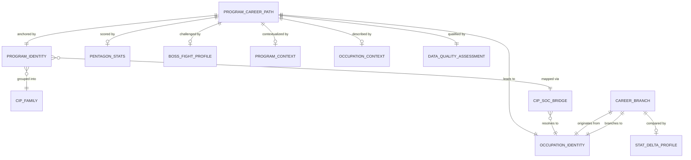

# Conceptual Model: gold-futureproof-engine

**Status:** APPROVED
**Mode:** Greenfield
**Zone:** Gold (Consumable)
**Domain:** Education / Career Guidance
**Spec:** docs/specs/gold-futureproof-engine.md
**Author:** @semantic-modeler
**Date:** 2026-04-09
**Approval:** Pending human review (REQUIRE_HUMAN_APPROVAL = true)
**Upstream Models:** gold-career-outcomes-college-scorecard, gold-occupation-profiles-bls-ooh, gold-onet-profiles, crosswalk-cip-soc

---



---

## Entity Descriptions

| Entity | Business Concept | Business Term | Is CDE | Is PII |
|--------|-----------------|---------------|--------|--------|
| Program Career Path | The central consumable entity: one row per school + major + career combination. Joins four Gold sources through the CIP-SOC crosswalk to produce a unified record with five pentagon stats, five boss fight scores, and full program/occupation context. This is the row that powers the FutureProof query: "If I study X at school Y, what career can I expect?" | BT-082 | true | false |
| Program Identity | The dimensional context identifying the institution (UNITID), academic program (CIP code), CIP family, and program name. Sourced from College Scorecard via the career_outcomes Gold table. CIP codes are in 4-digit XX.XX format (Scorecard granularity). | BT-001, BT-003, BT-005, BT-006 | true | false |
| CIP Family | The 2-digit CIP prefix representing a broad discipline area. Serves as an aggregation and peer-comparison dimension inherited from upstream career outcomes. | BT-005 | false | false |
| CIP-SOC Bridge | The cross-taxonomy mapping strategy that connects programs (CIP codes) to occupations (SOC codes). Uses a 4-digit CIP prefix match to bridge the granularity mismatch between Scorecard (XX.XX) and the crosswalk (XX.XXXX). This is the critical integration pattern -- without it, 0% of Scorecard programs match the crosswalk. With it, 91% of distinct CIP codes and 97% of rows are covered. | BT-086 | true | false |
| Occupation Identity | The SOC-coded occupation that a program maps to. Carries the occupation title and SOC major group. Sourced from BLS OOH and O*NET Gold tables via the crosswalk SOC code. | BT-029, BT-030 | true | false |
| Pentagon Stats | The five-stat scoring profile (1-10 scale each) that powers the pentagon visualization: Earning Power (ERN), Return on Investment (ROI), AI Resilience (RES), Growth (GRW), and Human Edge (HMN). ERN and ROI are derived at this Gold layer; GRW and HMN are carried from upstream Gold tables; RES is a placeholder (null) pending Karpathy integration. | BT-077, BT-078, BT-079, BT-080, BT-047, BT-066 | true | false |
| Boss Fight Profile | Five boss fight scores (1-10 scale each) representing career challenges: AI Boss, Student Loans Boss, Market Boss, Burnout Boss, and Ceiling Boss. Loans and Ceiling are derived at this layer; Market and Burnout are carried from upstream; AI Boss is a placeholder (null). Higher score means a stronger boss (worse for the student). | BT-081, BT-083, BT-084, BT-085 | true | false |
| Program Context | Program-level financial context from College Scorecard: median earnings (1yr, with 25th/75th percentiles for the effort slider), median debt, debt-to-earnings ratio, and program confidence tier. These are the raw inputs that feed ERN and ROI stat derivations. | BT-009, BT-010, BT-019, BT-024 | true | false |
| Occupation Context | Occupation-level context from BLS OOH and O*NET: median annual wage, growth category, employment count, education requirements, top work activities, human-edge activities, burnout drivers, and work condition metrics. These are the raw inputs that feed GRW, HMN, and boss fight derivations. | BT-036, BT-046, BT-048, BT-068, BT-063, BT-064 | true | false |
| Data Quality Assessment | A mandatory quality layer on every Program Career Path row: match quality (how many source joins succeeded), stats available count, bosses available count, and overall confidence tier (high/medium/low). Derived at Gold time from actual join results, NOT from upstream crosswalk flags. | BT-093, BT-087, BT-088, BT-089 | false | false |
| Career Branch | A pre-computed career transition pair enriched with full stat profiles for both source and target occupations. Sourced from the career_transitions Gold table and enriched with BLS and O*NET stats. Includes stat deltas so the frontend can render branch comparison trees without additional queries. | BT-090 | true | false |
| Stat Delta Profile | The computed differences between source and target occupation stats across a career branch: growth delta, human edge delta, burnout delta, and wage delta. Positive values indicate the branch target scores higher. Enables at-a-glance branch comparison. | BT-091 | false | false |

---

## Relationship Descriptions

| Relationship | From | To | Cardinality | Description |
|-------------|------|-----|-------------|-------------|
| anchored by | Program Career Path | Program Identity | one-to-one | Every program career path row has exactly one program identity (institution + program). A single program identity appears in many rows (one per mapped occupation). |
| leads to | Program Career Path | Occupation Identity | one-to-one | Every program career path row maps to exactly one occupation. A single occupation can appear in many rows (mapped from many programs). |
| scored by | Program Career Path | Pentagon Stats | one-to-zero-or-one | A program career path may have a full or partial pentagon (some stats null due to missing upstream data or placeholder status). |
| challenged by | Program Career Path | Boss Fight Profile | one-to-zero-or-one | A program career path may have a full or partial boss fight profile (some bosses null due to missing upstream data or placeholder status). |
| contextualized by | Program Career Path | Program Context | one-to-zero-or-one | Program-level financial context may be partially null due to privacy suppression in the Scorecard source data. |
| described by | Program Career Path | Occupation Context | one-to-zero-or-one | Occupation-level context may be null for SOC codes without BLS or O*NET coverage. |
| qualified by | Program Career Path | Data Quality Assessment | one-to-one | Every row has a mandatory quality assessment. No nulls -- every row is classified even if most stats are missing. |
| grouped into | Program Identity | CIP Family | many-to-one | Many programs share the same 2-digit CIP family. The family is the peer-comparison dimension. |
| mapped via | Program Identity | CIP-SOC Bridge | many-to-one | Programs connect to occupations through the CIP prefix match strategy. One 4-digit CIP may match multiple 6-digit crosswalk entries, producing fan-out. |
| resolves to | CIP-SOC Bridge | Occupation Identity | many-to-one | Multiple crosswalk entries (different 6-digit CIPs) may resolve to the same SOC code. Dedup on grain (unitid, cipcode, soc_code) collapses these. |
| originates from | Career Branch | Occupation Identity | many-to-one | Many career branches share the same source occupation. |
| branches to | Career Branch | Occupation Identity | many-to-one | Many career branches may target the same occupation from different sources. |
| compared by | Career Branch | Stat Delta Profile | one-to-zero-or-one | A career branch has stat deltas when both source and target occupations have the required stats. Null deltas when either side lacks data. |

---

## Cross-Source Integration Pattern

This is the first Gold product in the FutureProof pipeline that joins across all four data sources. The integration pattern is:

```
4 Gold Tables + 1 Silver Table --> 2 Gold Product Tables
```

### Source Flow (Table 1: program_career_paths)

| Source | Zone | What It Contributes | Join Key |
|--------|------|-------------------|----------|
| consumable.career_outcomes | Gold | Program identity, earnings, debt, ROI inputs (ERN, ROI derivation) | unitid, cipcode |
| base.cip_soc_crosswalk | Silver | CIP-to-SOC mapping via 4-digit prefix match | cipcode (prefix) --> soc_code |
| consumable.occupation_profiles | Gold | Wage data, growth score (GRW), market score, education requirements | soc_code |
| consumable.onet_work_profiles | Gold | Human edge score (HMN), burnout score, work activities | soc_code (as bls_soc_code) |

### Source Flow (Table 2: career_branches)

| Source | Zone | What It Contributes | Join Key |
|--------|------|-------------------|----------|
| consumable.career_transitions | Gold | Source-target occupation pairs, relatedness, ranking | soc_code, related_soc_code |
| consumable.occupation_profiles | Gold | GRW and wage for source + target occupations | soc_code (twice) |
| consumable.onet_work_profiles | Gold | HMN and burnout for source + target occupations | bls_soc_code (twice) |

### The CIP Prefix Match (BT-086)

The most critical design decision in this model. College Scorecard stores CIP codes at 4-digit granularity (XX.XX), while the CIP-SOC crosswalk stores them at 6-digit granularity (XX.XXXX). A strict join produces zero matches. The CIP Prefix Match strategy truncates crosswalk CIPs to 4 digits and joins on the prefix, achieving 91% CIP coverage and 97% row coverage. This introduces intentional fan-out: one Scorecard program may map to multiple occupations through multiple 6-digit crosswalk entries, which is resolved by deduplication on the output grain (unitid x cipcode x soc_code).

---

## Key Business Concepts

### Central Question
The FutureProof Engine answers: **"If I study program X at school Y, what career outcomes can I expect, how strong are those careers on five dimensions, and what career branches are available?"**

This is the culmination of the entire data pipeline -- joining education data (College Scorecard), labor market data (BLS OOH), and work characteristic data (O*NET) through a taxonomy bridge (CIP-SOC crosswalk) into a single queryable surface.

### Two Product Tables, Two Audiences

1. **Program Career Paths** (BT-082) -- serves the core query loop. A student selects a school and major; the table returns all mapped careers with pentagon stats and boss fight scores. The effort slider uses the earnings percentile bands from upstream career outcomes.

2. **Career Branches** (BT-090) -- serves the exploration loop. Once a student sees a career, they can explore related careers via the branch tree. Each branch shows stat deltas so the student can see whether a career pivot would improve growth, human edge, or wages.

### The Five-Stat Pentagon (BT-077)

| Stat | Business Term | Source Layer | Status |
|------|--------------|-------------|--------|
| ERN (Earning Power) | BT-078 | Derived at this Gold layer from Scorecard + BLS | Active |
| ROI (Return on Investment) | BT-079 | Derived at this Gold layer from Scorecard debt-to-earnings | Active |
| RES (AI Resilience) | BT-080 | Placeholder (null) -- requires Karpathy integration | Placeholder |
| GRW (Growth) | BT-047 | Carried from BLS OOH Gold | Active |
| HMN (Human Edge) | BT-066 | Carried from O*NET Gold | Active |

Four of five stats are functional for the hackathon MVP. The pentagon renders with a "coming soon" treatment on the RES vertex.

### The Five Boss Fights (BT-081)

| Boss | Business Term | Derivation | Status |
|------|--------------|-----------|--------|
| AI Boss | BT-083 | Placeholder (null) -- same dependency as RES | Placeholder |
| Student Loans Boss | BT-084 | Inverse of ROI (11 - stat_roi) | Active |
| Market Boss | BT-085 | Carried from BLS OOH Gold (market_score) | Active |
| Burnout Boss | BT-068 | Carried from O*NET Gold (burnout_score) | Active |
| Ceiling Boss | BT-085 | Derived from wage percentile within education tier | Active |

### Data Quality as First-Class Concept

Every Program Career Path row carries a Data Quality Assessment that reflects the reality of cross-source joins: not every occupation has BLS data, not every occupation has O*NET data, and privacy suppression may null out Scorecard fields. The match_quality field (BT-093) classifies each row as full, partial_no_onet, partial_no_bls, or scorecard_only based on which joins succeeded. The overall_confidence tier (BT-089) synthesizes match quality with stat availability into a high/medium/low signal for downstream consumers.

### Grain

- **Program Career Paths:** unitid x cipcode x soc_code (one row per school x program x career). Estimated 150,000-500,000 rows after CIP prefix fan-out and dedup.
- **Career Branches:** soc_code x related_soc_code (one row per occupation pair). Expected 15,944 rows (1:1 enrichment of career_transitions).

---

## Modeling Decisions

1. **Program Career Path as the central entity.** The consumable table is a wide denormalized fact table optimized for the query pattern (school + major + career = outcomes). The conceptual model decomposes it into logical entity groups (identity, stats, bosses, context, quality) to clarify distinct business concerns, but they merge into a single physical table.

2. **CIP-SOC Bridge as an explicit entity.** The prefix matching strategy is not a simple join -- it is a deliberate integration design decision with coverage/precision tradeoffs. Elevating it to a named entity (BT-086) makes the cross-taxonomy bridge visible in the conceptual model rather than hiding it as a join condition.

3. **Pentagon Stats and Boss Fight Profile as separate entities.** Although both are score collections on the same row, they serve different product experiences (pentagon visualization vs. boss fight gameplay). Separating them clarifies that they have different derivation patterns, different placeholder statuses, and different null behaviors.

4. **Career Branch as a peer entity, not subordinate to Program Career Path.** Table 2 has its own grain (soc_code x related_soc_code) and does not depend on Table 1. It is an independent enrichment of the career_transitions Gold table. The shared Occupation Identity entity connects them conceptually.

5. **Data Quality Assessment as mandatory.** Every row must have quality classification even when most data is missing. This mirrors the pattern established in the career outcomes conceptual model (BT-024) and extends it to handle cross-source join completeness.

6. **No temporal dimension.** Consistent with all upstream models, this is a point-in-time snapshot with full table replacement. Promotion timestamp is pipeline metadata, not an analytical dimension.

7. **Placeholder stats documented at conceptual level.** RES (BT-080) and AI Boss (BT-083) are explicitly modeled as entities with placeholder status rather than omitted. This ensures the data model is complete for the target state while clearly communicating current limitations.

---

## Scope and Boundaries

- This conceptual model covers both `consumable.program_career_paths` and `consumable.career_branches` in the Gold zone
- Sources are four existing Gold tables plus one Silver crosswalk table (cross-source integration)
- The CIP prefix match strategy is a design decision at this layer, not inherited from upstream
- RES stat and AI Boss are modeled as placeholders -- a future spec will populate them
- MCP zone serving is downstream and not part of this model
- The effort slider percentile bands (25th/75th earnings) are inherited from upstream career outcomes, not re-derived here
- Bachelor's degree focus (CREDLEV=3) is inherited from upstream career outcomes MVP scope
