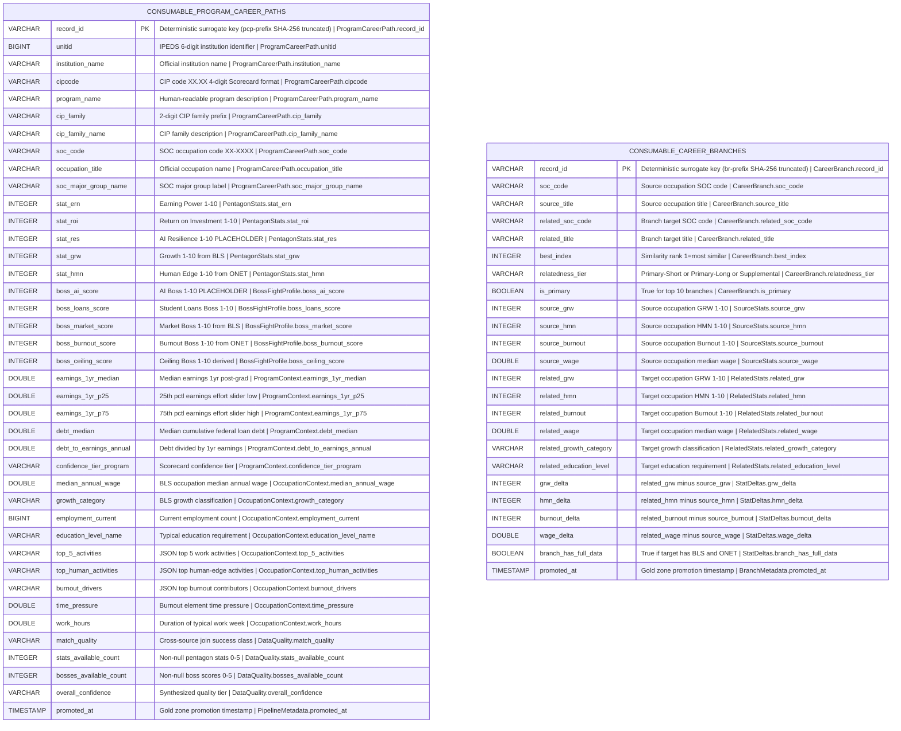

# Physical Model: gold-futureproof-engine

**Status:** APPROVED (auto-approved; direct translation from approved logical model)
**Mode:** Greenfield
**Zone:** Gold (Consumable)
**Domain:** Education / Career Guidance
**Spec:** docs/specs/gold-futureproof-engine.md
**Logical Model:** governance/models/gold-futureproof-engine-logical.md
**Conceptual Model:** governance/models/gold-futureproof-engine-conceptual.md
**Author:** @semantic-modeler
**Date:** 2026-04-09

---



---

## Table 1: consumable.program_career_paths

### Table Definition

| Property | Value |
|----------|-------|
| **Catalog table** | `consumable.program_career_paths` |
| **Format** | Apache Iceberg (v2) |
| **Format version** | 2 (supports row-level deletes, merge-on-read) |
| **Engine** | DuckDB (via `iceberg_scan`) |
| **Grain** | One row per institution x program x occupation |
| **Natural key** | `unitid` + `cipcode` + `soc_code` |
| **Surrogate key** | `record_id` (deterministic SHA-256 hash, prefix `pcp`) |
| **Expected row count** | 150,000-500,000 (CIP prefix fan-out across 4 Gold + 1 Silver source) |
| **Partition strategy** | None (scan performance adequate at this scale for DuckDB; partitioning adds complexity without benefit for the primary query patterns which filter on unitid or cipcode) |
| **Sort order** | `cip_family ASC, unitid ASC, cipcode ASC, soc_code ASC` |
| **Write pattern** | Full table replace via `brightsmith.infra.promote.promote()` (idempotent) |
| **Dedup strategy** | After CIP prefix join, collapse to grain (unitid, cipcode, soc_code). When duplicates exist from multiple 6-digit CIP matches to the same SOC, keep the row with the most non-null stat values. |

### Iceberg Table Properties

| Property | Value | Rationale |
|----------|-------|-----------|
| `write.format.default` | `parquet` | Standard columnar format for analytical queries |
| `write.parquet.compression-codec` | `zstd` | Best compression ratio for this data profile |
| `format-version` | `2` | Required for Brightsmith promote pattern |
| `write.metadata.delete-after-commit.enabled` | `true` | Clean up old metadata files |
| `write.metadata.previous-versions-max` | `10` | Retain 10 snapshots for time-travel queries |

### Sort Order Rationale

Sort order leads with `cip_family` to cluster related programs together, matching the primary query pattern where a student explores programs within a discipline. The remaining sort keys (`unitid`, `cipcode`, `soc_code`) match the natural key for within-family ordering, enabling efficient range scans for single-institution queries.

### Promote Pattern

```python
from brightsmith.infra.promote import promote, compute_grain_id

# Grain ID computation
row['record_id'] = compute_grain_id(row, ['unitid', 'cipcode', 'soc_code'], prefix='pcp')

# Promotion
promote(
    df=result_df,
    table_name='consumable.program_career_paths',
    grain_fields=['unitid', 'cipcode', 'soc_code'],
    prefix='pcp'
)
```

---

### Column Definitions: consumable.program_career_paths

#### Core Identity

| Column | DuckDB Type | Nullable | Default | Constraint | Business Term | Is CDE | Is PII | Description |
|--------|-------------|----------|---------|------------|---------------|--------|--------|-------------|
| record_id | VARCHAR | NOT NULL | derived | PRIMARY KEY | BT-015 | false | false | Deterministic surrogate key: `compute_grain_id(row, ['unitid', 'cipcode', 'soc_code'], prefix='pcp')`. Format: `pcp-<16 hex chars>`. Stable across pipeline re-runs. |
| unitid | BIGINT | NOT NULL | -- | UNIQUE (composite with cipcode, soc_code) | BT-001 | true | false | IPEDS 6-digit institution identifier. Natural key component. Source: `consumable.career_outcomes.unitid`. |
| institution_name | VARCHAR | NOT NULL | -- | -- | BT-002 | false | false | Official institution name from IPEDS. Source: `consumable.career_outcomes.institution_name`. |
| cipcode | VARCHAR | NOT NULL | -- | UNIQUE (composite with unitid, soc_code); CHECK (cipcode ~ '^\d{2}\.\d{2}$') | BT-003 | true | false | CIP program code in 4-digit XX.XX format (Scorecard granularity). Natural key component. Source: `consumable.career_outcomes.cipcode`. |
| program_name | VARCHAR | NOT NULL | -- | -- | BT-004 | false | false | Human-readable program description. Source: `consumable.career_outcomes.program_name`. |
| cip_family | VARCHAR | NOT NULL | -- | CHECK (cip_family ~ '^\d{2}$') | BT-005 | false | false | 2-digit CIP family prefix. Source: `consumable.career_outcomes.cip_family`. |
| cip_family_name | VARCHAR | NOT NULL | -- | -- | BT-006 | false | false | Human-readable CIP family label. Source: `consumable.career_outcomes.cip_family_name`. |
| soc_code | VARCHAR | NOT NULL | -- | UNIQUE (composite with unitid, cipcode); CHECK (soc_code ~ '^\d{2}-\d{4}$') | BT-027 | true | false | SOC occupation code in XX-XXXX format. Natural key component. Source: `base.cip_soc_crosswalk.soc_code` (via CIP prefix join). |
| occupation_title | VARCHAR | NOT NULL | -- | -- | BT-028 | false | false | Official occupation name. Source: `consumable.occupation_profiles.occupation_title` (preferred) or `consumable.onet_work_profiles.occupation_title` (fallback). |
| soc_major_group_name | VARCHAR | NULLABLE | NULL | -- | BT-030 | false | false | SOC major group label. Source: `consumable.occupation_profiles.soc_major_group_name`. Null if BLS LEFT JOIN fails. |

#### Pentagon Stats (1-10 Scale)

| Column | DuckDB Type | Nullable | Default | Constraint | Business Term | Is CDE | Is PII | Description |
|--------|-------------|----------|---------|------------|---------------|--------|--------|-------------|
| stat_ern | INTEGER | NULLABLE | NULL | CHECK (stat_ern IS NULL OR (stat_ern >= 1 AND stat_ern <= 10)) | BT-078 | true | false | Earning Power score (1-10). Blended: 60% program earnings rank + 40% occupation wage percentile. See ERN derivation. |
| stat_roi | INTEGER | NULLABLE | NULL | CHECK (stat_roi IS NULL OR (stat_roi >= 1 AND stat_roi <= 10)) | BT-079 | true | false | Return on Investment score (1-10). Piecewise linear inverse of debt-to-earnings ratio. See ROI derivation. |
| stat_res | INTEGER | NULLABLE | NULL | CHECK (stat_res IS NULL) | BT-080 | false | false | AI Resilience score (1-10). PLACEHOLDER: always null in MVP. Pending Karpathy integration. |
| stat_grw | INTEGER | NULLABLE | NULL | CHECK (stat_grw IS NULL OR (stat_grw >= 1 AND stat_grw <= 10)) | BT-047 | true | false | Growth score (1-10). Carried from `consumable.occupation_profiles.grw_score_rounded`. Null if BLS LEFT JOIN fails. |
| stat_hmn | INTEGER | NULLABLE | NULL | CHECK (stat_hmn IS NULL OR (stat_hmn >= 1 AND stat_hmn <= 10)) | BT-066 | true | false | Human Edge score (1-10). Carried from `consumable.onet_work_profiles.hmn_score_rounded`. Null if O*NET LEFT JOIN fails. |

#### Boss Fight Profile (1-10 Scale)

| Column | DuckDB Type | Nullable | Default | Constraint | Business Term | Is CDE | Is PII | Description |
|--------|-------------|----------|---------|------------|---------------|--------|--------|-------------|
| boss_ai_score | INTEGER | NULLABLE | NULL | CHECK (boss_ai_score IS NULL) | BT-083 | false | false | AI Boss strength (1-10). PLACEHOLDER: always null in MVP. Same dependency as stat_res. |
| boss_loans_score | INTEGER | NULLABLE | NULL | CHECK (boss_loans_score IS NULL OR (boss_loans_score >= 1 AND boss_loans_score <= 10)) | BT-084 | true | false | Student Loans Boss strength (1-10). `11 - stat_roi`. Null when stat_roi is null. |
| boss_market_score | INTEGER | NULLABLE | NULL | CHECK (boss_market_score IS NULL OR (boss_market_score >= 1 AND boss_market_score <= 10)) | BT-051 | true | false | Market Boss strength (1-10). Carried from `consumable.occupation_profiles.market_score_rounded`. Null if BLS LEFT JOIN fails. |
| boss_burnout_score | INTEGER | NULLABLE | NULL | CHECK (boss_burnout_score IS NULL OR (boss_burnout_score >= 1 AND boss_burnout_score <= 10)) | BT-068 | true | false | Burnout Boss strength (1-10). Carried from `consumable.onet_work_profiles.burnout_score_rounded`. Null if O*NET LEFT JOIN fails. |
| boss_ceiling_score | INTEGER | NULLABLE | NULL | CHECK (boss_ceiling_score IS NULL OR (boss_ceiling_score >= 1 AND boss_ceiling_score <= 10)) | BT-085 | true | false | Ceiling Boss strength (1-10). `ROUND(10.0 - 9.0 * wage_percentile_education_tier)`. Null if wage percentile unavailable. |

#### Program Context (College Scorecard)

| Column | DuckDB Type | Nullable | Default | Constraint | Business Term | Is CDE | Is PII | Description |
|--------|-------------|----------|---------|------------|---------------|--------|--------|-------------|
| earnings_1yr_median | DOUBLE | NULLABLE | NULL | CHECK (earnings_1yr_median IS NULL OR (earnings_1yr_median >= 1000 AND earnings_1yr_median <= 250000)) | BT-009 | true | false | Median 1-year post-completion earnings. Subject to privacy suppression. Source: `consumable.career_outcomes.earnings_1yr_median`. |
| earnings_1yr_p25 | DOUBLE | NULLABLE | NULL | CHECK (earnings_1yr_p25 IS NULL OR earnings_1yr_p25 >= 0) | BT-018 | false | false | 25th percentile 1yr earnings across CIP family (effort slider: low focus). Source: `consumable.career_outcomes.earnings_1yr_p25`. |
| earnings_1yr_p75 | DOUBLE | NULLABLE | NULL | CHECK (earnings_1yr_p75 IS NULL OR earnings_1yr_p75 >= 0) | BT-018 | false | false | 75th percentile 1yr earnings across CIP family (effort slider: high focus). Source: `consumable.career_outcomes.earnings_1yr_p75`. |
| debt_median | DOUBLE | NULLABLE | NULL | CHECK (debt_median IS NULL OR (debt_median >= 1000 AND debt_median <= 100000)) | BT-011 | true | false | Median cumulative federal loan debt. Subject to privacy suppression. Source: `consumable.career_outcomes.debt_median`. |
| debt_to_earnings_annual | DOUBLE | NULLABLE | NULL | CHECK (debt_to_earnings_annual IS NULL OR debt_to_earnings_annual > 0) | BT-019 | true | false | Debt-to-earnings ratio. Key affordability metric and input to stat_roi. Source: `consumable.career_outcomes.debt_to_earnings_annual`. |
| confidence_tier_program | VARCHAR | NULLABLE | NULL | CHECK (confidence_tier_program IS NULL OR confidence_tier_program IN ('high', 'medium', 'low', 'insufficient')) | BT-024 | false | false | Scorecard-level confidence tier. Source: `consumable.career_outcomes.confidence_tier` (renamed for disambiguation). |

#### Occupation Context (BLS + O*NET)

| Column | DuckDB Type | Nullable | Default | Constraint | Business Term | Is CDE | Is PII | Description |
|--------|-------------|----------|---------|------------|---------------|--------|--------|-------------|
| median_annual_wage | DOUBLE | NULLABLE | NULL | CHECK (median_annual_wage IS NULL OR (median_annual_wage >= 15000 AND median_annual_wage <= 300000)) | BT-036 | true | false | BLS median annual wage. Source: `consumable.occupation_profiles.median_annual_wage`. Null if BLS LEFT JOIN fails. |
| growth_category | VARCHAR | NULLABLE | NULL | CHECK (growth_category IS NULL OR growth_category IN ('declining_fast', 'declining', 'stable', 'growing', 'growing_fast', 'booming')) | BT-041 | false | false | BLS growth classification. Source: `consumable.occupation_profiles.growth_category`. |
| employment_current | BIGINT | NULLABLE | NULL | CHECK (employment_current IS NULL OR employment_current >= 0) | BT-031 | false | false | Current employment count. Source: `consumable.occupation_profiles.employment_current`. |
| education_level_name | VARCHAR | NULLABLE | NULL | -- | BT-039 | false | false | Typical entry-level education requirement. Source: `consumable.occupation_profiles.education_level_name`. |
| top_5_activities | VARCHAR | NULLABLE | NULL | -- | BT-063 | false | false | JSON string: top 5 work activities by importance. Source: `consumable.onet_work_profiles.top_5_activities`. |
| top_human_activities | VARCHAR | NULLABLE | NULL | -- | BT-063 | false | false | JSON string: top activities with highest human edge. Source: `consumable.onet_work_profiles.top_human_activities`. |
| burnout_drivers | VARCHAR | NULLABLE | NULL | -- | BT-068 | false | false | JSON string: top burnout-contributing work conditions. Source: `consumable.onet_work_profiles.burnout_drivers`. |
| time_pressure | DOUBLE | NULLABLE | NULL | CHECK (time_pressure IS NULL OR (time_pressure >= 1.0 AND time_pressure <= 5.0)) | BT-068 | false | false | Burnout element: time pressure score (1.0-5.0 CX scale). Source: `consumable.onet_work_profiles.time_pressure`. |
| work_hours | DOUBLE | NULLABLE | NULL | CHECK (work_hours IS NULL OR (work_hours >= 1.0 AND work_hours <= 3.0)) | BT-068 | false | false | Duration of typical work week (1.0-3.0 CT scale). Source: `consumable.onet_work_profiles.work_hours`. |

#### Data Quality (Derived -- All NOT NULL)

| Column | DuckDB Type | Nullable | Default | Constraint | Business Term | Is CDE | Is PII | Description |
|--------|-------------|----------|---------|------------|---------------|--------|--------|-------------|
| match_quality | VARCHAR | NOT NULL | -- | CHECK (match_quality IN ('full', 'partial_no_onet', 'partial_no_bls', 'scorecard_only')) | BT-093 | true | false | Classification of cross-source join success. Derived at Gold time from actual join results. NOT from crosswalk Silver's has_scorecard_match flag. |
| stats_available_count | INTEGER | NOT NULL | -- | CHECK (stats_available_count >= 0 AND stats_available_count <= 5) | BT-087 | false | false | Count of non-null pentagon stats (0-5). Maximum 4 in MVP since stat_res always null. |
| bosses_available_count | INTEGER | NOT NULL | -- | CHECK (bosses_available_count >= 0 AND bosses_available_count <= 5) | BT-088 | false | false | Count of non-null boss fight scores (0-5). Maximum 4 in MVP since boss_ai_score always null. |
| overall_confidence | VARCHAR | NOT NULL | -- | CHECK (overall_confidence IN ('high', 'medium', 'low')) | BT-089 | true | false | Synthesized quality tier from stats_available_count and match_quality. |

#### Pipeline Metadata

| Column | DuckDB Type | Nullable | Default | Constraint | Business Term | Is CDE | Is PII | Description |
|--------|-------------|----------|---------|------------|---------------|--------|--------|-------------|
| promoted_at | TIMESTAMP | NOT NULL | -- | -- | BT-026 | false | false | Timestamp when the row was promoted to the Gold consumable table. Generated at promotion time via `datetime.now()`. |

---

## Table 2: consumable.career_branches

### Table Definition

| Property | Value |
|----------|-------|
| **Catalog table** | `consumable.career_branches` |
| **Format** | Apache Iceberg (v2) |
| **Format version** | 2 (supports row-level deletes, merge-on-read) |
| **Engine** | DuckDB (via `iceberg_scan`) |
| **Grain** | One row per occupation pair (soc_code x related_soc_code) |
| **Natural key** | `soc_code` + `related_soc_code` |
| **Surrogate key** | `record_id` (deterministic SHA-256 hash, prefix `br`) |
| **Expected row count** | 15,944 (1:1 enrichment of career_transitions) |
| **Partition strategy** | None (dataset < 20K rows; single partition is optimal) |
| **Sort order** | `soc_code ASC, best_index ASC, related_soc_code ASC` |
| **Write pattern** | Full table replace via `brightsmith.infra.promote.promote()` (idempotent) |

### Iceberg Table Properties

| Property | Value | Rationale |
|----------|-------|-----------|
| `write.format.default` | `parquet` | Standard columnar format for analytical queries |
| `write.parquet.compression-codec` | `zstd` | Best compression ratio for this data profile |
| `format-version` | `2` | Required for Brightsmith promote pattern |
| `write.metadata.delete-after-commit.enabled` | `true` | Clean up old metadata files |
| `write.metadata.previous-versions-max` | `10` | Retain 10 snapshots for time-travel queries |

### Sort Order Rationale

Sort order leads with `soc_code` to cluster all branches for a single source occupation together. Secondary sort on `best_index` ensures branches appear in similarity order (most similar first), matching the primary query pattern where a user explores branches from a specific career. Tertiary sort on `related_soc_code` ensures deterministic ordering within the same similarity rank.

### Promote Pattern

```python
from brightsmith.infra.promote import promote, compute_grain_id

# Grain ID computation
row['record_id'] = compute_grain_id(row, ['soc_code', 'related_soc_code'], prefix='br')

# Promotion
promote(
    df=result_df,
    table_name='consumable.career_branches',
    grain_fields=['soc_code', 'related_soc_code'],
    prefix='br'
)
```

---

### Column Definitions: consumable.career_branches

#### Core Identity

| Column | DuckDB Type | Nullable | Default | Constraint | Business Term | Is CDE | Is PII | Description |
|--------|-------------|----------|---------|------------|---------------|--------|--------|-------------|
| record_id | VARCHAR | NOT NULL | derived | PRIMARY KEY | BT-015 | false | false | Deterministic surrogate key: `compute_grain_id(row, ['soc_code', 'related_soc_code'], prefix='br')`. Format: `br-<16 hex chars>`. Stable across pipeline re-runs. |
| soc_code | VARCHAR | NOT NULL | -- | UNIQUE (composite with related_soc_code); CHECK (soc_code ~ '^\d{2}-\d{4}$') | BT-027 | true | false | Source occupation SOC code. Natural key component. Source: `consumable.career_transitions.soc_code`. |
| source_title | VARCHAR | NOT NULL | -- | -- | BT-028 | false | false | Source occupation title. Source: `consumable.career_transitions.source_title`. |
| related_soc_code | VARCHAR | NOT NULL | -- | UNIQUE (composite with soc_code); CHECK (related_soc_code ~ '^\d{2}-\d{4}$') | BT-027 | true | false | Branch target occupation SOC code. Natural key component. Source: `consumable.career_transitions.related_soc_code`. |
| related_title | VARCHAR | NOT NULL | -- | -- | BT-028 | false | false | Branch target occupation title. Source: `consumable.career_transitions.related_title`. |
| best_index | INTEGER | NOT NULL | -- | CHECK (best_index >= 1 AND best_index <= 20) | BT-060 | false | false | Similarity rank (1 = most similar). Source: `consumable.career_transitions.best_index`. |
| relatedness_tier | VARCHAR | NOT NULL | -- | CHECK (relatedness_tier IN ('Primary-Short', 'Primary-Long', 'Supplemental')) | BT-061 | false | false | Tier classification. Source: `consumable.career_transitions.relatedness_tier`. |
| is_primary | BOOLEAN | NOT NULL | -- | -- | BT-060 | false | false | True for top 10 branches by similarity. Source: `consumable.career_transitions.is_primary`. |

#### Source Stats (Source Occupation Profile)

| Column | DuckDB Type | Nullable | Default | Constraint | Business Term | Is CDE | Is PII | Description |
|--------|-------------|----------|---------|------------|---------------|--------|--------|-------------|
| source_grw | INTEGER | NULLABLE | NULL | CHECK (source_grw IS NULL OR (source_grw >= 1 AND source_grw <= 10)) | BT-047 | false | false | Source occupation GRW score (1-10). Source: `consumable.occupation_profiles.grw_score_rounded` via LEFT JOIN on soc_code. |
| source_hmn | INTEGER | NULLABLE | NULL | CHECK (source_hmn IS NULL OR (source_hmn >= 1 AND source_hmn <= 10)) | BT-066 | false | false | Source occupation HMN score (1-10). Source: `consumable.onet_work_profiles.hmn_score_rounded` via LEFT JOIN on soc_code. |
| source_burnout | INTEGER | NULLABLE | NULL | CHECK (source_burnout IS NULL OR (source_burnout >= 1 AND source_burnout <= 10)) | BT-068 | false | false | Source occupation Burnout score (1-10). Source: `consumable.onet_work_profiles.burnout_score_rounded` via LEFT JOIN on soc_code. |
| source_wage | DOUBLE | NULLABLE | NULL | CHECK (source_wage IS NULL OR (source_wage >= 15000 AND source_wage <= 300000)) | BT-036 | false | false | Source occupation median annual wage. Source: `consumable.occupation_profiles.median_annual_wage` via LEFT JOIN on soc_code. |

#### Related Stats (Branch Target Occupation Profile)

| Column | DuckDB Type | Nullable | Default | Constraint | Business Term | Is CDE | Is PII | Description |
|--------|-------------|----------|---------|------------|---------------|--------|--------|-------------|
| related_grw | INTEGER | NULLABLE | NULL | CHECK (related_grw IS NULL OR (related_grw >= 1 AND related_grw <= 10)) | BT-047 | false | false | Target occupation GRW score (1-10). Source: `consumable.occupation_profiles.grw_score_rounded` via LEFT JOIN on related_soc_code. |
| related_hmn | INTEGER | NULLABLE | NULL | CHECK (related_hmn IS NULL OR (related_hmn >= 1 AND related_hmn <= 10)) | BT-066 | false | false | Target occupation HMN score (1-10). Source: `consumable.onet_work_profiles.hmn_score_rounded` via LEFT JOIN on related_soc_code. |
| related_burnout | INTEGER | NULLABLE | NULL | CHECK (related_burnout IS NULL OR (related_burnout >= 1 AND related_burnout <= 10)) | BT-068 | false | false | Target occupation Burnout score (1-10). Source: `consumable.onet_work_profiles.burnout_score_rounded` via LEFT JOIN on related_soc_code. |
| related_wage | DOUBLE | NULLABLE | NULL | CHECK (related_wage IS NULL OR (related_wage >= 15000 AND related_wage <= 300000)) | BT-036 | false | false | Target occupation median annual wage. Source: `consumable.occupation_profiles.median_annual_wage` via LEFT JOIN on related_soc_code. |
| related_growth_category | VARCHAR | NULLABLE | NULL | CHECK (related_growth_category IS NULL OR related_growth_category IN ('declining_fast', 'declining', 'stable', 'growing', 'growing_fast', 'booming')) | BT-041 | false | false | Target occupation growth classification. Source: `consumable.occupation_profiles.growth_category`. |
| related_education_level | VARCHAR | NULLABLE | NULL | -- | BT-039 | false | false | Target occupation typical education requirement. Source: `consumable.occupation_profiles.education_level_name`. |

#### Stat Deltas (Derived Comparisons)

| Column | DuckDB Type | Nullable | Default | Constraint | Business Term | Is CDE | Is PII | Description |
|--------|-------------|----------|---------|------------|---------------|--------|--------|-------------|
| grw_delta | INTEGER | NULLABLE | NULL | CHECK (grw_delta IS NULL OR (grw_delta >= -9 AND grw_delta <= 9)) | BT-091 | false | false | `related_grw - source_grw`. Positive = branch target grows faster. Null if either side null. |
| hmn_delta | INTEGER | NULLABLE | NULL | CHECK (hmn_delta IS NULL OR (hmn_delta >= -9 AND hmn_delta <= 9)) | BT-091 | false | false | `related_hmn - source_hmn`. Positive = more human edge at target. Null if either side null. |
| burnout_delta | INTEGER | NULLABLE | NULL | CHECK (burnout_delta IS NULL OR (burnout_delta >= -9 AND burnout_delta <= 9)) | BT-091 | false | false | `related_burnout - source_burnout`. Positive = more burnout risk at target. Null if either side null. |
| wage_delta | DOUBLE | NULLABLE | NULL | -- | BT-091 | false | false | `related_wage - source_wage`. Positive = higher pay at target. Null if either side null. |
| branch_has_full_data | BOOLEAN | NOT NULL | -- | -- | BT-092 | false | false | True if related occupation has both BLS and O*NET data. Derived: `related_grw IS NOT NULL AND related_hmn IS NOT NULL`. |

#### Pipeline Metadata

| Column | DuckDB Type | Nullable | Default | Constraint | Business Term | Is CDE | Is PII | Description |
|--------|-------------|----------|---------|------------|---------------|--------|--------|-------------|
| promoted_at | TIMESTAMP | NOT NULL | -- | -- | BT-026 | false | false | Timestamp when the row was promoted to the Gold consumable table. Generated at promotion time via `datetime.now()`. |

---

## Column Summary

### Table 1: consumable.program_career_paths

| Count | Category |
|-------|----------|
| 40 | Total columns |
| 1 | Primary key (record_id) |
| 3 | Natural key components (unitid, cipcode, soc_code) |
| 15 | CDE columns |
| 0 | PII columns |
| 28 | Nullable columns |
| 12 | NOT NULL columns |
| 11 | Derived at this layer (stat_ern, stat_roi, stat_res, boss_ai_score, boss_loans_score, boss_ceiling_score, match_quality, stats_available_count, bosses_available_count, overall_confidence, record_id) |
| 28 | Carried from upstream (via join chain) |
| 1 | Pipeline metadata (promoted_at) |

### Table 2: consumable.career_branches

| Count | Category |
|-------|----------|
| 24 | Total columns |
| 1 | Primary key (record_id) |
| 2 | Natural key components (soc_code, related_soc_code) |
| 2 | CDE columns |
| 0 | PII columns |
| 14 | Nullable columns |
| 10 | NOT NULL columns |
| 5 | Derived at this layer (grw_delta, hmn_delta, burnout_delta, wage_delta, branch_has_full_data) |
| 17 | Carried from upstream (via join chain) |
| 1 | Pipeline metadata (promoted_at) |
| 1 | Surrogate key (record_id) |

---

## DDL (Reference)

These DDL statements are for documentation. The actual tables are created via `brightsmith.infra.promote.promote()` which handles Iceberg table creation and idempotent writes.

### Table 1: consumable.program_career_paths

```sql
-- Reference DDL for consumable.program_career_paths
-- Engine: DuckDB + Iceberg v2
-- Do not execute directly -- use promote() pattern

CREATE TABLE IF NOT EXISTS consumable.program_career_paths (
    -- Core Identity
    record_id                   VARCHAR     NOT NULL,
    unitid                      BIGINT      NOT NULL,
    institution_name            VARCHAR     NOT NULL,
    cipcode                     VARCHAR     NOT NULL,
    program_name                VARCHAR     NOT NULL,
    cip_family                  VARCHAR     NOT NULL,
    cip_family_name             VARCHAR     NOT NULL,
    soc_code                    VARCHAR     NOT NULL,
    occupation_title            VARCHAR     NOT NULL,
    soc_major_group_name        VARCHAR,

    -- Pentagon Stats (1-10 scale)
    stat_ern                    INTEGER,
    stat_roi                    INTEGER,
    stat_res                    INTEGER,
    stat_grw                    INTEGER,
    stat_hmn                    INTEGER,

    -- Boss Fight Profile (1-10 scale)
    boss_ai_score               INTEGER,
    boss_loans_score            INTEGER,
    boss_market_score           INTEGER,
    boss_burnout_score          INTEGER,
    boss_ceiling_score          INTEGER,

    -- Program Context (College Scorecard)
    earnings_1yr_median         DOUBLE,
    earnings_1yr_p25            DOUBLE,
    earnings_1yr_p75            DOUBLE,
    debt_median                 DOUBLE,
    debt_to_earnings_annual     DOUBLE,
    confidence_tier_program     VARCHAR,

    -- Occupation Context (BLS + O*NET)
    median_annual_wage          DOUBLE,
    growth_category             VARCHAR,
    employment_current          BIGINT,
    education_level_name        VARCHAR,
    top_5_activities            VARCHAR,
    top_human_activities        VARCHAR,
    burnout_drivers             VARCHAR,
    time_pressure               DOUBLE,
    work_hours                  DOUBLE,

    -- Data Quality (all NOT NULL)
    match_quality               VARCHAR     NOT NULL,
    stats_available_count       INTEGER     NOT NULL,
    bosses_available_count      INTEGER     NOT NULL,
    overall_confidence          VARCHAR     NOT NULL,

    -- Pipeline Metadata
    promoted_at                 TIMESTAMP   NOT NULL,

    -- Keys
    PRIMARY KEY (record_id),
    UNIQUE (unitid, cipcode, soc_code),

    -- Domain constraints
    CHECK (cipcode ~ '^\d{2}\.\d{2}$'),
    CHECK (cip_family ~ '^\d{2}$'),
    CHECK (soc_code ~ '^\d{2}-\d{4}$'),
    CHECK (stat_ern IS NULL OR (stat_ern >= 1 AND stat_ern <= 10)),
    CHECK (stat_roi IS NULL OR (stat_roi >= 1 AND stat_roi <= 10)),
    CHECK (stat_res IS NULL),
    CHECK (stat_grw IS NULL OR (stat_grw >= 1 AND stat_grw <= 10)),
    CHECK (stat_hmn IS NULL OR (stat_hmn >= 1 AND stat_hmn <= 10)),
    CHECK (boss_ai_score IS NULL),
    CHECK (boss_loans_score IS NULL OR (boss_loans_score >= 1 AND boss_loans_score <= 10)),
    CHECK (boss_market_score IS NULL OR (boss_market_score >= 1 AND boss_market_score <= 10)),
    CHECK (boss_burnout_score IS NULL OR (boss_burnout_score >= 1 AND boss_burnout_score <= 10)),
    CHECK (boss_ceiling_score IS NULL OR (boss_ceiling_score >= 1 AND boss_ceiling_score <= 10)),
    CHECK (earnings_1yr_median IS NULL OR (earnings_1yr_median >= 1000 AND earnings_1yr_median <= 250000)),
    CHECK (debt_median IS NULL OR (debt_median >= 1000 AND debt_median <= 100000)),
    CHECK (debt_to_earnings_annual IS NULL OR debt_to_earnings_annual > 0),
    CHECK (confidence_tier_program IS NULL OR confidence_tier_program IN ('high', 'medium', 'low', 'insufficient')),
    CHECK (median_annual_wage IS NULL OR (median_annual_wage >= 15000 AND median_annual_wage <= 300000)),
    CHECK (growth_category IS NULL OR growth_category IN ('declining_fast', 'declining', 'stable', 'growing', 'growing_fast', 'booming')),
    CHECK (match_quality IN ('full', 'partial_no_onet', 'partial_no_bls', 'scorecard_only')),
    CHECK (stats_available_count >= 0 AND stats_available_count <= 5),
    CHECK (bosses_available_count >= 0 AND bosses_available_count <= 5),
    CHECK (overall_confidence IN ('high', 'medium', 'low'))
);
```

### Table 2: consumable.career_branches

```sql
-- Reference DDL for consumable.career_branches
-- Engine: DuckDB + Iceberg v2
-- Do not execute directly -- use promote() pattern

CREATE TABLE IF NOT EXISTS consumable.career_branches (
    -- Core Identity
    record_id                   VARCHAR     NOT NULL,
    soc_code                    VARCHAR     NOT NULL,
    source_title                VARCHAR     NOT NULL,
    related_soc_code            VARCHAR     NOT NULL,
    related_title               VARCHAR     NOT NULL,
    best_index                  INTEGER     NOT NULL,
    relatedness_tier            VARCHAR     NOT NULL,
    is_primary                  BOOLEAN     NOT NULL,

    -- Source Stats
    source_grw                  INTEGER,
    source_hmn                  INTEGER,
    source_burnout              INTEGER,
    source_wage                 DOUBLE,

    -- Related Stats
    related_grw                 INTEGER,
    related_hmn                 INTEGER,
    related_burnout             INTEGER,
    related_wage                DOUBLE,
    related_growth_category     VARCHAR,
    related_education_level     VARCHAR,

    -- Stat Deltas
    grw_delta                   INTEGER,
    hmn_delta                   INTEGER,
    burnout_delta               INTEGER,
    wage_delta                  DOUBLE,
    branch_has_full_data        BOOLEAN     NOT NULL,

    -- Pipeline Metadata
    promoted_at                 TIMESTAMP   NOT NULL,

    -- Keys
    PRIMARY KEY (record_id),
    UNIQUE (soc_code, related_soc_code),

    -- Domain constraints
    CHECK (soc_code ~ '^\d{2}-\d{4}$'),
    CHECK (related_soc_code ~ '^\d{2}-\d{4}$'),
    CHECK (best_index >= 1 AND best_index <= 20),
    CHECK (relatedness_tier IN ('Primary-Short', 'Primary-Long', 'Supplemental')),
    CHECK (source_grw IS NULL OR (source_grw >= 1 AND source_grw <= 10)),
    CHECK (source_hmn IS NULL OR (source_hmn >= 1 AND source_hmn <= 10)),
    CHECK (source_burnout IS NULL OR (source_burnout >= 1 AND source_burnout <= 10)),
    CHECK (related_grw IS NULL OR (related_grw >= 1 AND related_grw <= 10)),
    CHECK (related_hmn IS NULL OR (related_hmn >= 1 AND related_hmn <= 10)),
    CHECK (related_burnout IS NULL OR (related_burnout >= 1 AND related_burnout <= 10)),
    CHECK (grw_delta IS NULL OR (grw_delta >= -9 AND grw_delta <= 9)),
    CHECK (hmn_delta IS NULL OR (hmn_delta >= -9 AND hmn_delta <= 9)),
    CHECK (burnout_delta IS NULL OR (burnout_delta >= -9 AND burnout_delta <= 9))
);
```

---

## Source-to-Target Mapping

### Table 1: consumable.program_career_paths

| Physical Column | DuckDB Type | Source Table | Source Field | Transformation |
|-----------------|-------------|-------------|--------------|----------------|
| record_id | VARCHAR | -- | derived | `compute_grain_id(row, ['unitid', 'cipcode', 'soc_code'], prefix='pcp')` |
| unitid | BIGINT | consumable.career_outcomes | unitid | Verbatim |
| institution_name | VARCHAR | consumable.career_outcomes | institution_name | Verbatim |
| cipcode | VARCHAR | consumable.career_outcomes | cipcode | Verbatim (4-digit XX.XX) |
| program_name | VARCHAR | consumable.career_outcomes | program_name | Verbatim |
| cip_family | VARCHAR | consumable.career_outcomes | cip_family | Verbatim |
| cip_family_name | VARCHAR | consumable.career_outcomes | cip_family_name | Verbatim |
| soc_code | VARCHAR | base.cip_soc_crosswalk | soc_code | Verbatim (via CIP prefix join: `co.cipcode = LEFT(xw.cipcode, 5)`) |
| occupation_title | VARCHAR | consumable.occupation_profiles / consumable.onet_work_profiles | occupation_title | COALESCE(occupation_profiles.occupation_title, onet_work_profiles.occupation_title) |
| soc_major_group_name | VARCHAR | consumable.occupation_profiles | soc_major_group_name | Verbatim (nullable via LEFT JOIN) |
| stat_ern | INTEGER | -- | derived | `ROUND(1.0 + 9.0 * (0.6 * cip_family_earnings_rank + 0.4 * wage_percentile_overall))`. Null if either input null. |
| stat_roi | INTEGER | -- | derived | Piecewise linear from debt_to_earnings_annual. See ROI derivation. |
| stat_res | INTEGER | -- | derived | Always NULL (placeholder) |
| stat_grw | INTEGER | consumable.occupation_profiles | grw_score_rounded | Verbatim (nullable via LEFT JOIN) |
| stat_hmn | INTEGER | consumable.onet_work_profiles | hmn_score_rounded | Verbatim (nullable via LEFT JOIN on soc_code = bls_soc_code) |
| boss_ai_score | INTEGER | -- | derived | Always NULL (placeholder) |
| boss_loans_score | INTEGER | -- | derived | `11 - stat_roi`. Null when stat_roi null. |
| boss_market_score | INTEGER | consumable.occupation_profiles | market_score_rounded | Verbatim (nullable via LEFT JOIN) |
| boss_burnout_score | INTEGER | consumable.onet_work_profiles | burnout_score_rounded | Verbatim (nullable via LEFT JOIN on soc_code = bls_soc_code) |
| boss_ceiling_score | INTEGER | -- | derived | `ROUND(10.0 - 9.0 * wage_percentile_education_tier)`. Null if input null. |
| earnings_1yr_median | DOUBLE | consumable.career_outcomes | earnings_1yr_median | Verbatim |
| earnings_1yr_p25 | DOUBLE | consumable.career_outcomes | earnings_1yr_p25 | Verbatim |
| earnings_1yr_p75 | DOUBLE | consumable.career_outcomes | earnings_1yr_p75 | Verbatim |
| debt_median | DOUBLE | consumable.career_outcomes | debt_median | Verbatim |
| debt_to_earnings_annual | DOUBLE | consumable.career_outcomes | debt_to_earnings_annual | Verbatim |
| confidence_tier_program | VARCHAR | consumable.career_outcomes | confidence_tier | Verbatim (renamed for disambiguation) |
| median_annual_wage | DOUBLE | consumable.occupation_profiles | median_annual_wage | Verbatim (nullable via LEFT JOIN) |
| growth_category | VARCHAR | consumable.occupation_profiles | growth_category | Verbatim (nullable via LEFT JOIN) |
| employment_current | BIGINT | consumable.occupation_profiles | employment_current | Verbatim (nullable via LEFT JOIN) |
| education_level_name | VARCHAR | consumable.occupation_profiles | education_level_name | Verbatim (nullable via LEFT JOIN) |
| top_5_activities | VARCHAR | consumable.onet_work_profiles | top_5_activities | Verbatim (nullable via LEFT JOIN) |
| top_human_activities | VARCHAR | consumable.onet_work_profiles | top_human_activities | Verbatim (nullable via LEFT JOIN) |
| burnout_drivers | VARCHAR | consumable.onet_work_profiles | burnout_drivers | Verbatim (nullable via LEFT JOIN) |
| time_pressure | DOUBLE | consumable.onet_work_profiles | time_pressure | Verbatim (nullable via LEFT JOIN) |
| work_hours | DOUBLE | consumable.onet_work_profiles | work_hours | Verbatim (nullable via LEFT JOIN) |
| match_quality | VARCHAR | -- | derived | See Match Quality derivation below |
| stats_available_count | INTEGER | -- | derived | Count of non-null values in (stat_ern, stat_roi, stat_res, stat_grw, stat_hmn) |
| bosses_available_count | INTEGER | -- | derived | Count of non-null values in (boss_ai_score, boss_loans_score, boss_market_score, boss_burnout_score, boss_ceiling_score) |
| overall_confidence | VARCHAR | -- | derived | See Overall Confidence derivation below |
| promoted_at | TIMESTAMP | -- | generated | `CURRENT_TIMESTAMP` at Gold promotion time |

### Table 2: consumable.career_branches

| Physical Column | DuckDB Type | Source Table | Source Field | Transformation |
|-----------------|-------------|-------------|--------------|----------------|
| record_id | VARCHAR | -- | derived | `compute_grain_id(row, ['soc_code', 'related_soc_code'], prefix='br')` |
| soc_code | VARCHAR | consumable.career_transitions | soc_code | Verbatim |
| source_title | VARCHAR | consumable.career_transitions | source_title | Verbatim |
| related_soc_code | VARCHAR | consumable.career_transitions | related_soc_code | Verbatim |
| related_title | VARCHAR | consumable.career_transitions | related_title | Verbatim |
| best_index | INTEGER | consumable.career_transitions | best_index | Verbatim |
| relatedness_tier | VARCHAR | consumable.career_transitions | relatedness_tier | Verbatim |
| is_primary | BOOLEAN | consumable.career_transitions | is_primary | Verbatim |
| source_grw | INTEGER | consumable.occupation_profiles | grw_score_rounded | Via LEFT JOIN on soc_code |
| source_hmn | INTEGER | consumable.onet_work_profiles | hmn_score_rounded | Via LEFT JOIN on soc_code = bls_soc_code |
| source_burnout | INTEGER | consumable.onet_work_profiles | burnout_score_rounded | Via LEFT JOIN on soc_code = bls_soc_code |
| source_wage | DOUBLE | consumable.occupation_profiles | median_annual_wage | Via LEFT JOIN on soc_code |
| related_grw | INTEGER | consumable.occupation_profiles | grw_score_rounded | Via LEFT JOIN on related_soc_code |
| related_hmn | INTEGER | consumable.onet_work_profiles | hmn_score_rounded | Via LEFT JOIN on related_soc_code = bls_soc_code |
| related_burnout | INTEGER | consumable.onet_work_profiles | burnout_score_rounded | Via LEFT JOIN on related_soc_code = bls_soc_code |
| related_wage | DOUBLE | consumable.occupation_profiles | median_annual_wage | Via LEFT JOIN on related_soc_code |
| related_growth_category | VARCHAR | consumable.occupation_profiles | growth_category | Via LEFT JOIN on related_soc_code |
| related_education_level | VARCHAR | consumable.occupation_profiles | education_level_name | Via LEFT JOIN on related_soc_code |
| grw_delta | INTEGER | -- | derived | `related_grw - source_grw` (null if either null) |
| hmn_delta | INTEGER | -- | derived | `related_hmn - source_hmn` (null if either null) |
| burnout_delta | INTEGER | -- | derived | `related_burnout - source_burnout` (null if either null) |
| wage_delta | DOUBLE | -- | derived | `related_wage - source_wage` (null if either null) |
| branch_has_full_data | BOOLEAN | -- | derived | `related_grw IS NOT NULL AND related_hmn IS NOT NULL` |
| promoted_at | TIMESTAMP | -- | generated | `CURRENT_TIMESTAMP` at Gold promotion time |

---

## Derivation Rules (Implementation Expressions)

### ERN Score Derivation

```sql
CASE
    WHEN cip_family_earnings_rank IS NULL OR wage_percentile_overall IS NULL THEN NULL
    ELSE CAST(ROUND(1.0 + 9.0 * (0.6 * cip_family_earnings_rank + 0.4 * wage_percentile_overall)) AS INTEGER)
END
```

Where:
- `cip_family_earnings_rank` is from `consumable.career_outcomes` (BT-022, range 0.0-1.0)
- `wage_percentile_overall` is from `consumable.occupation_profiles` (BT-048, range 0.0-1.0)

60% weight on school-specific program earnings, 40% on occupation-level wage.

### ROI Score Derivation (Piecewise Linear)

```sql
CASE
    WHEN debt_to_earnings_annual IS NULL THEN NULL
    WHEN debt_to_earnings_annual <= 0.25 THEN 10
    WHEN debt_to_earnings_annual <= 0.75 THEN CAST(ROUND(10.0 - (debt_to_earnings_annual - 0.25) / 0.50 * 2.0) AS INTEGER)
    WHEN debt_to_earnings_annual <= 1.5  THEN CAST(ROUND(8.0 - (debt_to_earnings_annual - 0.75) / 0.75 * 3.0) AS INTEGER)
    WHEN debt_to_earnings_annual <= 2.5  THEN CAST(ROUND(5.0 - (debt_to_earnings_annual - 1.5) / 1.0 * 2.0) AS INTEGER)
    WHEN debt_to_earnings_annual <= 4.0  THEN CAST(ROUND(3.0 - (debt_to_earnings_annual - 2.5) / 1.5 * 2.0) AS INTEGER)
    ELSE 1
END
```

### Boss Loans Score Derivation

```sql
CASE
    WHEN stat_roi IS NULL THEN NULL
    ELSE 11 - stat_roi
END
```

### Boss Ceiling Score Derivation

```sql
CASE
    WHEN wage_percentile_education_tier IS NULL THEN NULL
    ELSE CAST(ROUND(10.0 - 9.0 * wage_percentile_education_tier) AS INTEGER)
END
```

Where `wage_percentile_education_tier` is from `consumable.occupation_profiles` (BT-049, range 0.0-1.0).

### Match Quality Derivation (Gold-Time)

```sql
CASE
    WHEN occupation_profiles.soc_code IS NOT NULL AND onet_work_profiles.bls_soc_code IS NOT NULL THEN 'full'
    WHEN occupation_profiles.soc_code IS NOT NULL AND onet_work_profiles.bls_soc_code IS NULL     THEN 'partial_no_onet'
    WHEN occupation_profiles.soc_code IS NULL     AND onet_work_profiles.bls_soc_code IS NOT NULL THEN 'partial_no_bls'
    ELSE 'scorecard_only'
END
```

Derived from actual LEFT JOIN results. Do NOT use `base.cip_soc_crosswalk.has_scorecard_match` (FALSE for all rows due to CIP granularity mismatch at Silver).

### Stats Available Count Derivation

```sql
(CASE WHEN stat_ern IS NOT NULL THEN 1 ELSE 0 END
 + CASE WHEN stat_roi IS NOT NULL THEN 1 ELSE 0 END
 + CASE WHEN stat_res IS NOT NULL THEN 1 ELSE 0 END
 + CASE WHEN stat_grw IS NOT NULL THEN 1 ELSE 0 END
 + CASE WHEN stat_hmn IS NOT NULL THEN 1 ELSE 0 END)
```

### Bosses Available Count Derivation

```sql
(CASE WHEN boss_ai_score IS NOT NULL THEN 1 ELSE 0 END
 + CASE WHEN boss_loans_score IS NOT NULL THEN 1 ELSE 0 END
 + CASE WHEN boss_market_score IS NOT NULL THEN 1 ELSE 0 END
 + CASE WHEN boss_burnout_score IS NOT NULL THEN 1 ELSE 0 END
 + CASE WHEN boss_ceiling_score IS NOT NULL THEN 1 ELSE 0 END)
```

### Overall Confidence Derivation

```sql
CASE
    WHEN stats_available_count >= 4 AND match_quality = 'full' THEN 'high'
    WHEN stats_available_count >= 2 AND match_quality IN ('partial_no_onet', 'partial_no_bls') THEN 'medium'
    ELSE 'low'
END
```

---

## Nullability Semantics

### Table 1: consumable.program_career_paths

| Column | NULL Means |
|--------|-----------|
| soc_major_group_name | BLS occupation_profiles did not join for this SOC code (LEFT JOIN miss) |
| stat_ern | Either cip_family_earnings_rank or wage_percentile_overall is missing |
| stat_roi | debt_to_earnings_annual unavailable (privacy suppression) |
| stat_res | Always null in MVP (placeholder for Karpathy integration) |
| stat_grw | BLS occupation_profiles did not join or no growth data |
| stat_hmn | O*NET onet_work_profiles did not join for this SOC code |
| boss_ai_score | Always null in MVP (placeholder) |
| boss_loans_score | Propagated from null stat_roi |
| boss_market_score | BLS occupation_profiles did not join or market score unavailable |
| boss_burnout_score | O*NET onet_work_profiles did not join or burnout score unavailable |
| boss_ceiling_score | No wage_percentile_education_tier (missing wage or education data) |
| earnings_1yr_median | Privacy suppression in College Scorecard (small cohort) |
| earnings_1yr_p25, earnings_1yr_p75 | CIP family has fewer than 3 non-null 1yr earnings values |
| debt_median | Privacy suppression in College Scorecard |
| debt_to_earnings_annual | Either debt or 1yr earnings is null |
| confidence_tier_program | Upstream career_outcomes missing this field (not expected in practice) |
| median_annual_wage | BLS LEFT JOIN failed for this SOC code |
| growth_category | BLS LEFT JOIN failed or growth data unavailable |
| employment_current | BLS LEFT JOIN failed |
| education_level_name | BLS LEFT JOIN failed |
| top_5_activities | O*NET LEFT JOIN failed |
| top_human_activities | O*NET LEFT JOIN failed |
| burnout_drivers | O*NET LEFT JOIN failed |
| time_pressure | O*NET LEFT JOIN failed |
| work_hours | O*NET LEFT JOIN failed |

### Table 2: consumable.career_branches

| Column | NULL Means |
|--------|-----------|
| source_grw, source_hmn, source_burnout, source_wage | Source occupation lacks BLS or O*NET coverage |
| related_grw, related_hmn, related_burnout, related_wage | Target occupation lacks BLS or O*NET coverage |
| related_growth_category, related_education_level | Target occupation lacks BLS coverage |
| grw_delta, hmn_delta, burnout_delta, wage_delta | Either source or target stat is null |

**Key invariant:** match_quality, stats_available_count, bosses_available_count, overall_confidence, and branch_has_full_data are NEVER null.

---

## Traceability: Logical to Physical

### Table 1: consumable.program_career_paths

| Logical Attribute | Logical Type Domain | Physical Column | Physical DuckDB Type | Mapping Notes |
|-------------------|--------------------|-----------------|--------------------|---------------|
| record_id | identifier | record_id | VARCHAR | Hash output is always a string. Prefix 'pcp'. |
| unitid | numeric | unitid | BIGINT | 6-digit numeric ID fits BIGINT |
| institution_name | text | institution_name | VARCHAR | Direct mapping |
| cipcode | identifier | cipcode | VARCHAR | Contains dot separator, must be string. 4-digit XX.XX format. |
| program_name | text | program_name | VARCHAR | Direct mapping |
| cip_family | identifier | cip_family | VARCHAR | 2-digit code, kept as string for leading zeros |
| cip_family_name | text | cip_family_name | VARCHAR | Direct mapping |
| soc_code | identifier | soc_code | VARCHAR | Contains hyphen separator, must be string |
| occupation_title | text | occupation_title | VARCHAR | Direct mapping |
| soc_major_group_name | text | soc_major_group_name | VARCHAR | Direct mapping |
| stat_ern | numeric | stat_ern | INTEGER | 1-10 integer score, not DOUBLE |
| stat_roi | numeric | stat_roi | INTEGER | 1-10 integer score, not DOUBLE |
| stat_res | numeric | stat_res | INTEGER | Placeholder (always null in MVP) |
| stat_grw | numeric | stat_grw | INTEGER | 1-10 integer score, not DOUBLE |
| stat_hmn | numeric | stat_hmn | INTEGER | 1-10 integer score, not DOUBLE |
| boss_ai_score | numeric | boss_ai_score | INTEGER | Placeholder (always null in MVP) |
| boss_loans_score | numeric | boss_loans_score | INTEGER | 1-10 integer score, not DOUBLE |
| boss_market_score | numeric | boss_market_score | INTEGER | 1-10 integer score, not DOUBLE |
| boss_burnout_score | numeric | boss_burnout_score | INTEGER | 1-10 integer score, not DOUBLE |
| boss_ceiling_score | numeric | boss_ceiling_score | INTEGER | 1-10 integer score, not DOUBLE |
| earnings_1yr_median | numeric | earnings_1yr_median | DOUBLE | Monetary values use DOUBLE |
| earnings_1yr_p25 | numeric | earnings_1yr_p25 | DOUBLE | Percentile output is continuous |
| earnings_1yr_p75 | numeric | earnings_1yr_p75 | DOUBLE | Percentile output is continuous |
| debt_median | numeric | debt_median | DOUBLE | Monetary values use DOUBLE |
| debt_to_earnings_annual | numeric | debt_to_earnings_annual | DOUBLE | Ratio is continuous |
| confidence_tier_program | text | confidence_tier_program | VARCHAR | Categorical label |
| median_annual_wage | numeric | median_annual_wage | DOUBLE | Monetary values use DOUBLE |
| growth_category | text | growth_category | VARCHAR | Categorical label |
| employment_current | numeric | employment_current | BIGINT | Integer counts use BIGINT |
| education_level_name | text | education_level_name | VARCHAR | Direct mapping |
| top_5_activities | text | top_5_activities | VARCHAR | JSON string stored as VARCHAR |
| top_human_activities | text | top_human_activities | VARCHAR | JSON string stored as VARCHAR |
| burnout_drivers | text | burnout_drivers | VARCHAR | JSON string stored as VARCHAR |
| time_pressure | numeric | time_pressure | DOUBLE | O*NET CX scale (1.0-5.0) |
| work_hours | numeric | work_hours | DOUBLE | O*NET CT scale (1.0-3.0) |
| match_quality | text | match_quality | VARCHAR | Categorical label |
| stats_available_count | numeric | stats_available_count | INTEGER | Small integer count (0-5) |
| bosses_available_count | numeric | bosses_available_count | INTEGER | Small integer count (0-5) |
| overall_confidence | text | overall_confidence | VARCHAR | Categorical label |
| promoted_at | timestamp | promoted_at | TIMESTAMP | Direct mapping |

### Table 2: consumable.career_branches

| Logical Attribute | Logical Type Domain | Physical Column | Physical DuckDB Type | Mapping Notes |
|-------------------|--------------------|-----------------|--------------------|---------------|
| record_id | identifier | record_id | VARCHAR | Hash output, prefix 'br' |
| soc_code | identifier | soc_code | VARCHAR | Contains hyphen, must be string |
| source_title | text | source_title | VARCHAR | Direct mapping |
| related_soc_code | identifier | related_soc_code | VARCHAR | Contains hyphen, must be string |
| related_title | text | related_title | VARCHAR | Direct mapping |
| best_index | numeric | best_index | INTEGER | Small integer rank (1-20) |
| relatedness_tier | text | relatedness_tier | VARCHAR | Categorical label |
| is_primary | boolean | is_primary | BOOLEAN | Direct mapping |
| source_grw | numeric | source_grw | INTEGER | 1-10 integer score |
| source_hmn | numeric | source_hmn | INTEGER | 1-10 integer score |
| source_burnout | numeric | source_burnout | INTEGER | 1-10 integer score |
| source_wage | numeric | source_wage | DOUBLE | Monetary value |
| related_grw | numeric | related_grw | INTEGER | 1-10 integer score |
| related_hmn | numeric | related_hmn | INTEGER | 1-10 integer score |
| related_burnout | numeric | related_burnout | INTEGER | 1-10 integer score |
| related_wage | numeric | related_wage | DOUBLE | Monetary value |
| related_growth_category | text | related_growth_category | VARCHAR | Categorical label |
| related_education_level | text | related_education_level | VARCHAR | Direct mapping |
| grw_delta | numeric | grw_delta | INTEGER | Integer delta (-9 to +9) |
| hmn_delta | numeric | hmn_delta | INTEGER | Integer delta (-9 to +9) |
| burnout_delta | numeric | burnout_delta | INTEGER | Integer delta (-9 to +9) |
| wage_delta | numeric | wage_delta | DOUBLE | Monetary delta |
| branch_has_full_data | boolean | branch_has_full_data | BOOLEAN | Direct mapping |
| promoted_at | timestamp | promoted_at | TIMESTAMP | Direct mapping |

---

## Constraints and Invariants

### Hard Constraints (DQ P0 -- block promotion if violated)

| Constraint | SQL Expression | Table | Scope |
|------------|---------------|-------|-------|
| Grain uniqueness (T1) | `COUNT(*) = COUNT(DISTINCT (unitid, cipcode, soc_code))` | program_career_paths | Table-wide |
| Grain uniqueness (T2) | `COUNT(*) = COUNT(DISTINCT (soc_code, related_soc_code))` | career_branches | Table-wide |
| Record ID uniqueness | `COUNT(*) = COUNT(DISTINCT record_id)` | Both tables | Table-wide |
| Pentagon stat range | `stat IN (NULL) OR (stat >= 1 AND stat <= 10)` for stat_ern, stat_roi, stat_grw, stat_hmn | program_career_paths | Row-level |
| Boss score range | `score IN (NULL) OR (score >= 1 AND score <= 10)` for boss_loans_score, boss_market_score, boss_burnout_score, boss_ceiling_score | program_career_paths | Row-level |
| stat_res always null | `stat_res IS NULL` for all rows | program_career_paths | Table-wide |
| boss_ai_score always null | `boss_ai_score IS NULL` for all rows | program_career_paths | Table-wide |
| Loans-ROI inverse | `boss_loans_score = 11 - stat_roi` for all rows where both non-null | program_career_paths | Row-level |
| match_quality valid values | `match_quality IN ('full', 'partial_no_onet', 'partial_no_bls', 'scorecard_only')` | program_career_paths | Row-level |
| overall_confidence valid values | `overall_confidence IN ('high', 'medium', 'low')` | program_career_paths | Row-level |
| stats_available_count range | `stats_available_count BETWEEN 0 AND 5` | program_career_paths | Row-level |
| bosses_available_count range | `bosses_available_count BETWEEN 0 AND 5` | program_career_paths | Row-level |
| Integer delta range | `delta IS NULL OR (delta BETWEEN -9 AND 9)` for grw_delta, hmn_delta, burnout_delta | career_branches | Row-level |
| Row count T1 | `150000 <= COUNT(*) AND COUNT(*) <= 500000` | program_career_paths | Table-wide |
| Row count T2 | `COUNT(*) = 15944` | career_branches | Table-wide |

### Soft Constraints (DQ P1 -- warn but allow promotion)

| Constraint | SQL Expression | Table | Expected |
|------------|---------------|-------|----------|
| CIP prefix coverage | >= 90% of career_outcomes distinct cipcode values in output | program_career_paths | ~91% |
| Full match majority | >= 70% of rows have match_quality = 'full' | program_career_paths | ~76.6% |
| High confidence majority | >= 50% of rows have overall_confidence = 'high' | program_career_paths | Majority expected |
| Stats available 4+ | >= 60% of rows have stats_available_count >= 4 | program_career_paths | Based on full match rate |
| Branch full data | >= 70% of rows have branch_has_full_data = true | career_branches | Based on BLS + O*NET coverage |

---

## CIP Prefix Join Strategy (Physical Implementation)

The cross-source join between College Scorecard and the CIP-SOC crosswalk uses a 4-digit CIP prefix match because Scorecard stores CIP codes as XX.XX while the crosswalk stores them as XX.XXXX.

```sql
-- Physical join expression
FROM consumable.career_outcomes co
INNER JOIN base.cip_soc_crosswalk xw
    ON co.cipcode = LEFT(xw.cipcode, 5)
LEFT JOIN consumable.occupation_profiles op
    ON xw.soc_code = op.soc_code
LEFT JOIN consumable.onet_work_profiles owp
    ON xw.soc_code = owp.bls_soc_code
```

**Coverage:** 91.0% of Scorecard distinct CIP codes matched, 97.1% of rows covered. Programs with no crosswalk match produce zero rows (filtered by INNER JOIN).

**Dedup after fan-out:** The prefix join may produce duplicate (unitid, cipcode, soc_code) tuples when the same SOC appears via multiple 6-digit crosswalk CIPs. Dedup keeps one row per grain, preferring the row with the most non-null stat values:

```sql
-- Dedup expression (conceptual)
ROW_NUMBER() OVER (
    PARTITION BY unitid, cipcode, soc_code
    ORDER BY (non_null_stat_count) DESC
) = 1
```

---

## Open Issues (Carried from Logical)

| # | Issue | Status | Resolution |
|---|-------|--------|------------|
| 1 | ERN 60/40 weighting (program vs. occupation) | AWAITING HUMAN | Spec proposes 60% program, 40% occupation. Physical model implements this ratio. |
| 2 | ROI piecewise breakpoints | AWAITING HUMAN | Thresholds from Gainful Employment guidance. Physical model implements spec values. |
| 3 | Ceiling boss simplified formula | AWAITING HUMAN | Uses wage_percentile_education_tier directly. Physical model implements simple version. |
| 4 | RES stat and AI Boss as null placeholders | AWAITING HUMAN | Schema includes columns; CHECK constraints enforce NULL for MVP. |
| 5 | CIP prefix match breadth | AWAITING HUMAN | Physical model implements 4-digit prefix join. Post-hackathon may refine. |

---

## Addendum: Experience Columns on consumable.career_branches (2026-04-16)

**Spec:** docs/specs/onet-experience-requirements.md
**Human Approvals:** governance/approvals/onet-experience-requirements-open-decisions.md (tier thresholds, 10+ midpoint, multi-detail aggregation -- approved 2026-04-16 by Jeff Cernauske)
**Related Silver models:**
- governance/models/silver-base-onet-experience-conceptual.md
- governance/models/silver-base-onet-experience-logical.md
- governance/models/silver-base-onet-experience-physical.md
**Contract version bump:** `governance/data-contracts/consumable-career-branches.yaml` v1.1.0 -> v1.2.0 (additive only -- no breaking changes)
**Author:** @semantic-modeler
**Status:** PROPOSED (pending human approval alongside the three Silver models)

### Scope of Addendum

This addendum documents four additive columns added to the existing `consumable.career_branches` Gold table. The table definition, partitioning, sort order, record_id prefix (`br`), and grain (`[soc_code, related_soc_code]`) are unchanged. Only the column set grows — from 30 columns (24 original + 6 AI-exposure added in a prior addendum) to 34 columns.

Per the additive-only rule in the spec (§Zone 3 / §Data Contract Update), no existing column is modified, renamed, or dropped. The schema change is compatible with existing Silver/Gold consumers.

### New Columns

Appended after the existing "Stat Deltas (Derived Comparisons)" block and before "Pipeline Metadata". The four columns form a coherent group; recommend placing them under a new sub-heading "Experience (Derived Comparisons)" in the live schema documentation.

#### Experience (Derived Comparisons)

| Column | DuckDB Type | Nullable | Default | Constraint | Business Term | Is CDE | Is PII | Description |
|--------|-------------|----------|---------|------------|---------------|--------|--------|-------------|
| related_experience_years | DOUBLE | NULLABLE | NULL | CHECK (related_experience_years IS NULL OR (related_experience_years >= 0.0 AND related_experience_years <= 15.0)) | BT-117 | true | false | Typical prior work experience for the **target** (related) occupation, in years. Source: `base.onet_experience_profiles.experience_years_typical` via LEFT JOIN on `related_soc_code = bls_soc_code`. NULL when the target occupation has no RW coverage in O*NET. |
| related_experience_tier | VARCHAR | NULLABLE | NULL | CHECK (related_experience_tier IS NULL OR related_experience_tier IN ('entry', 'early', 'mid', 'senior')) | BT-118 | true | false | Experience tier for the target occupation: `entry` (0-1y), `early` (1-4y), `mid` (4-8y), `senior` (8+y). Human-approved thresholds. Source: `base.onet_experience_profiles.experience_tier` via LEFT JOIN on `related_soc_code = bls_soc_code`. NULL when no profile exists. |
| source_experience_years | DOUBLE | NULLABLE | NULL | CHECK (source_experience_years IS NULL OR (source_experience_years >= 0.0 AND source_experience_years <= 15.0)) | BT-117 | true | false | Typical prior work experience for the **source** occupation, in years. Source: `base.onet_experience_profiles.experience_years_typical` via LEFT JOIN on `soc_code = bls_soc_code`. NULL when the source occupation has no RW coverage. Used in `experience_delta_years` arithmetic. |
| experience_delta_years | DOUBLE | NULLABLE | NULL | CHECK (experience_delta_years IS NULL OR (experience_delta_years >= -12.0 AND experience_delta_years <= 12.0)) | BT-117 | true | false | `related_experience_years - source_experience_years` -- years of additional experience required for the branch target. Positive means the target demands more experience. **NULL-propagating:** NULL when either side is NULL; the frontend and service layer must treat NULL as "unknown," not zero. Range is mathematically bounded by the approved midpoint cap of 12 years. See §Rationale below. |

### Derivation SQL (Join Logic)

From `docs/specs/onet-experience-requirements.md` §Zone 3:

```sql
-- Join experience for the RELATED (target) occupation
LEFT JOIN base.onet_experience_profiles exp_related
    ON career_branches.related_soc_code = exp_related.bls_soc_code

-- Join experience for the SOURCE occupation
LEFT JOIN base.onet_experience_profiles exp_source
    ON career_branches.soc_code = exp_source.bls_soc_code
```

Two LEFT JOINs against the same Silver table. Each produces two columns (`_years` and `_tier`, though the source side only surfaces `_years` in the Gold schema -- there is no `source_experience_tier` column because the service layer filters and buckets on the target occupation only).

### NULL-Propagating Delta (Rationale)

```sql
experience_delta_years = CASE
    WHEN exp_related.experience_years_typical IS NULL
      OR exp_source.experience_years_typical  IS NULL
    THEN NULL
    ELSE exp_related.experience_years_typical - exp_source.experience_years_typical
END
```

The spec's §Zone 3 documents why the NULL-propagating semantics are correct: an earlier `COALESCE(..., 0)` variant overstated the gap when the source occupation had no experience data (e.g., entry-level occupations with insufficient O*NET coverage), reporting `related - 0`. NULL propagation makes "unknown" explicit and lets downstream consumers (the service layer `max_experience_years` filter, the frontend decade-bucket UI) filter or badge these rows as appropriate. This matches the test-matrix case "Missing source experience (Gold)" in the spec (§Test Matrix).

### CDE / PII Tags

All four columns are flagged `is_cde = true`, `is_pii = false` per §CDE & PII Assessment in the spec. Rationale:

| Column | Why CDE |
|--------|---------|
| related_experience_years | Shown to users on the career tree; feeds the default-view filter (`experience_delta_years <= 5`) and frontend bucketing. |
| related_experience_tier | UX gating (decade bucketing, "Unlocks at 8+ years" badges) and primary filter classifier. |
| source_experience_years | Delta computation input -- directly affects whether a branch is reachable. |
| experience_delta_years | Primary default-view threshold (`<= 5` years) in the career tree; the most business-visible of the four. |

`bs:cde-tagger` applies these flags to `governance/data-contracts/consumable-career-branches.yaml` when bumping the contract to v1.2.0.

### Updated Column Summary (consumable.career_branches)

| Count | Category | Change from v1.1.0 |
|-------|----------|--------------------|
| 34 | Total columns | +4 (+related_experience_years, +related_experience_tier, +source_experience_years, +experience_delta_years) from 30 prior |
| 1 | Primary key (record_id) | unchanged |
| 2 | Natural key components (soc_code, related_soc_code) | unchanged |
| 6 | CDE columns | +4 (the new experience columns) |
| 0 | PII columns | unchanged |
| 18 | Nullable columns | +4 (all four new columns are nullable) |
| 10 | NOT NULL columns | unchanged |
| 9 | Derived at this layer | +4 (all four new columns are derived here via LEFT JOINs and arithmetic) |
| 17 | Carried from upstream | unchanged |
| 1 | Pipeline metadata (promoted_at) | unchanged |

### DDL Diff (Reference)

Additive columns to append to the existing `CREATE TABLE IF NOT EXISTS consumable.career_branches (...)` statement. Insert before the `PRIMARY KEY` line:

```sql
    -- Experience (Derived Comparisons) -- added 2026-04-16 per onet-experience-requirements spec
    related_experience_years    DOUBLE,
    related_experience_tier     VARCHAR,
    source_experience_years     DOUBLE,
    experience_delta_years      DOUBLE,
```

And the corresponding CHECK constraints:

```sql
    CHECK (related_experience_years IS NULL OR (related_experience_years >= 0.0 AND related_experience_years <= 15.0)),
    CHECK (related_experience_tier IS NULL OR related_experience_tier IN ('entry', 'early', 'mid', 'senior')),
    CHECK (source_experience_years IS NULL OR (source_experience_years >= 0.0 AND source_experience_years <= 15.0)),
    CHECK (experience_delta_years IS NULL OR (experience_delta_years >= -12.0 AND experience_delta_years <= 12.0)),
```

### PyIceberg Schema Diff

Append four `NestedField` entries to the existing `CAREER_BRANCHES_SCHEMA` in the Gold transformer module. Assign new IDs at the end of the existing sequence (exact IDs depend on the current schema at implementation time):

```python
# Append to CAREER_BRANCHES_SCHEMA
NestedField(N+1, "related_experience_years", DoubleType(), required=False),
NestedField(N+2, "related_experience_tier", StringType(), required=False),
NestedField(N+3, "source_experience_years", DoubleType(), required=False),
NestedField(N+4, "experience_delta_years", DoubleType(), required=False),
```

All four are `required=False` (nullable) because the Silver source table may have no row for a given `bls_soc_code` if O*NET lacks RW coverage for that occupation.

### DQ Rules (Gold Addendum)

From spec §Zone 3 / §DQ Rules (Gold -- additions). These are authored separately at `governance/dq-rules/gold-career-branches-experience.json` by `bs:dq-rule-writer`:

- `related_experience_years` NULL rate < 15% (P1 — relaxed from draft 5% after EDA showed 5.47% real null rate; see rule rationale)
- `experience_delta_years` range: -12 ≤ delta ≤ 12 (P1 — mathematically exact per approved midpoint cap of 12 years)
- Where `related_experience_tier = 'senior'`, `related_experience_years >= 8` (P0)

Note: Both the Gold CHECK constraint AND the DQ rule enforce `-12 ≤ delta ≤ 12`. There is no defensive-envelope / business-check split — they match.

### Contract Version Bump

`governance/data-contracts/consumable-career-branches.yaml` advances from **v1.1.0 to v1.2.0**. This is an additive minor version bump per semantic versioning: no existing field is modified, renamed, or dropped; the four new fields are nullable and optional for consumers. Existing consumers (MCP `get_career_branches`, backend `branch_tree.py`, frontend branch cards) continue to work unchanged until they explicitly opt in to the new fields.

### MCP / Service Layer (Referenced, Not Modeled Here)

The downstream wiring of these four Gold columns into the MCP tool and backend service is documented in the spec (§Zone 4, §Zone 5) and implemented by `bs:primary-agent` in Phase 5 of the agent workflow. The physical model's responsibility ends at the Gold schema; MCP response contracts and backend `CareerBranch` dataclass fields are not modeled here.

