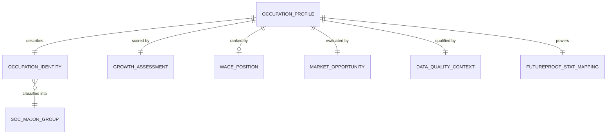

# Conceptual Model: gold-occupation-profiles-bls-ooh

**Status:** APPROVED
**Mode:** Greenfield
**Zone:** Gold (Consumable)
**Domain:** Occupational Employment Projections
**Spec:** docs/specs/gold-occupation-profiles-bls-ooh.md
**Author:** @semantic-modeler
**Date:** 2026-04-07
**Approval:** APPROVED by human review (2026-04-07)
**Source Model:** governance/models/silver-base-bls-ooh-conceptual.md

---

---

## Entity Descriptions

| Entity | Business Concept | Business Term | Is CDE | Is PII |
|--------|-----------------|---------------|--------|--------|
| Occupation Profile | The central consumable entity: a self-contained career profile for a single occupation, enriched with derived scores and contextual analytics. This is the row-level fact that powers the FutureProof query: "What does this career look like, and where is it headed?" Serves the Gemma agent directly by SOC code or occupation title. | BT-027 | true | false |
| Occupation Identity | The dimensional context identifying what occupation this profile describes: SOC code, title, major group, and classification flags (broad occupation, catchall). Carried from Silver without transformation. Answers "what is this occupation?" | BT-027, BT-029, BT-040, BT-043 | true | false |
| SOC Major Group | One of 22 broad occupation families derived from the 2-digit SOC code prefix. Provides a higher-level classification for aggregation and dashboard segmentation. Retained from Silver as a shared grouping dimension. | BT-029 | false | false |
| Growth Assessment | The derived growth scoring for an occupation, anchoring the GRW stat in the FutureProof pentagon. Contains the GRW score (1-10 piecewise linear scale derived from employment change percentage) and the underlying employment projection data (current, projected, change percent, annual openings, growth category). This is the primary analytical contribution of this Gold product. | BT-047, BT-031 | true | false |
| Wage Position | The relative compensation positioning of an occupation. Contains the overall wage percentile rank (among all occupations), the within-education-tier percentile rank (among peers with the same education requirement), and the derived wage tier label. Null for 23 occupations without wage data. Backs the ERN stat and Ceiling boss fight. | BT-048, BT-049, BT-050 | true | false |
| Market Opportunity | A combined market health indicator that blends growth direction (60% weight) with opportunity volume (40% weight) into a single 1-10 score. Corrects for occupations that are growing fast but have tiny absolute employment bases. Backs the Market boss fight. | BT-051 | true | false |
| Data Quality Context | A quality and completeness layer assigned to every occupation profile. Classifies each row into a confidence tier (high/medium/low) based on classification flags and wage availability, and provides a data completeness score measuring core field coverage. Enables downstream consumers to filter or caveat results. | BT-052, BT-053 | false | false |
| FutureProof Stat Mapping | Documentation metadata that declares which FutureProof pentagon stats and boss fights this occupation profile contributes to. Always "ERN,GRW" for stats and "Market,Ceiling" for bosses in this data product. Enables the game system to discover which data products back which gameplay elements. | BT-054 | false | false |

---

## Relationship Descriptions

| Relationship | From | To | Cardinality | Description |
|-------------|------|-----|-------------|-------------|
| describes | Occupation Profile | Occupation Identity | one-to-one | Every occupation profile has exactly one occupation identity (soc_code). The profile IS the enriched view of that occupation. |
| scored by | Occupation Profile | Growth Assessment | one-to-one | Every occupation profile has a growth assessment. The GRW score may be null if employment change data is missing (0 rows currently), but the assessment entity always exists. |
| ranked by | Occupation Profile | Wage Position | one-to-zero-or-one | An occupation profile may have wage positioning data, or all wage fields may be null. 23 of 832 occupations lack wage data. Occupations without wages are preserved with flags rather than dropped. |
| evaluated by | Occupation Profile | Market Opportunity | one-to-one | Every occupation profile has a market opportunity assessment. The market score may be null if component inputs are missing, but the entity always exists. |
| qualified by | Occupation Profile | Data Quality Context | one-to-one | Every occupation profile has a confidence tier and completeness score. No nulls -- every row is classified. |
| powers | Occupation Profile | FutureProof Stat Mapping | one-to-one | Every occupation profile has a stat mapping declaration. These are static documentation fields -- always "ERN,GRW" and "Market,Ceiling" for this data product. |
| classified into | Occupation Identity | SOC Major Group | many-to-one | Many occupations share the same SOC major group (2-digit prefix). The 22 major groups span all 832 occupations. |

---

## Key Business Concepts

### Central Question
The Gold occupation profiles table answers: **"What does this career look like, and where is it headed?"**

This is the second Gold data product in FutureProof and the first occupation-level consumable. Unlike the career outcomes table (which has a composite grain of institution x program x credential), this table has a simple single-field grain: one row per occupation (soc_code).

### Grain
The grain is **soc_code** -- one row per occupation in the BLS Employment Projections. 832 rows, matching Silver exactly. No rows are added or dropped in the Silver-to-Gold transformation. Occupations with incomplete data are flagged via confidence tier, not filtered.

### From Silver to Gold: What Changes
The Silver `base.bls_ooh` table provides clean, normalized occupation-level facts. The Gold `consumable.occupation_profiles` table enriches those facts with:

1. **Growth scoring** (Growth Assessment) -- the GRW score maps raw employment change percentage onto a 1-10 scale using piecewise linear interpolation anchored to BLS growth benchmarks. National average growth (~4%) lands at approximately 6.0 on the scale.

2. **Wage positioning** (Wage Position) -- percentile ranks computed both overall and within education tier, plus categorical wage tier labels. Answers "how does this career's pay compare to others?" and "how does it compare to peers requiring the same education?"

3. **Market health** (Market Opportunity) -- a composite score blending growth direction (60%) with opportunity volume via annual openings (40%). Corrects for careers that are growing rapidly but have tiny labor markets.

4. **Quality transparency** (Data Quality Context) -- confidence tier (high/medium/low) based on occupation classification quality and wage data availability, plus a data completeness ratio for core fields.

5. **Game system integration** (FutureProof Stat Mapping) -- explicit declarations of which FutureProof stats and boss fights this data product backs.

No Silver data is lost. Identity, employment, compensation, and entry requirement fields are carried forward. Redundant fields (employment_change, median_wage_capped, education_typical, work_experience, training_typical) are dropped with justification -- the information is preserved through equivalent or superior fields. The Gold layer is analytically additive.

### Self-Contained Data Product
This Gold product does NOT require the CIP-to-SOC crosswalk to be useful. The Gemma agent can query it directly by SOC code or occupation title to describe careers. The crosswalk connects it to College Scorecard (career outcomes by program) later, but this table stands alone as an occupation reference.

### What This Table Feeds in FutureProof

| FutureProof Element | Concept Used |
|---------------------|-------------|
| GRW stat (pentagon) | Growth Assessment -- grw_score on 1-10 scale |
| ERN stat (pentagon) | Wage Position -- median wage and overall percentile |
| Market boss fight | Market Opportunity -- market_score + growth category |
| Ceiling boss fight | Wage Position -- within-education-tier percentile rank |
| Gemma career descriptions | Occupation Identity + employment + compensation + education |
| Compare screen | Growth Assessment + Market Opportunity + Wage Position |

### What This Table Does NOT Feed (requires future data sources)
- **RES stat** -- needs O*NET task data + AI exposure scores
- **HMN stat** -- needs O*NET work activity dimensions
- **AI boss fight** -- needs O*NET + Karpathy
- **Burnout boss fight** -- needs O*NET work context
- **School-specific tailoring** -- needs CIP-to-SOC crosswalk to College Scorecard

This Gold product delivers GRW, partial ERN, Market, and Ceiling. The remaining stats and bosses come from the O*NET Gold product. Together they complete the pentagon.

### Null-Wage Occupations
23 occupations lack BLS wage data (physicians/surgeons, performers, fishing/hunting workers). These are preserved in the dataset because they represent real careers students may pursue. The Wage Position entity is null for these rows. The confidence tier is "low" for all null-wage occupations. The GRW score and Market score are still computed for them (employment data exists).

---

## Modeling Decisions

1. **Occupation Profile as the central entity.** The Gold consumable table is a single wide fact table optimized for the query pattern (SOC code or title = career profile). The conceptual model decomposes this into logical entity groups (identity, growth, wage, market, quality, stat mapping) to clarify the distinct business concerns, but they will merge into a single physical table.

2. **Growth Assessment as a separate entity from Wage Position.** Although both produce scores on a 1-10 or 0-1 scale, they represent fundamentally different business concepts: growth trajectory vs. compensation level. They also have different null patterns (GRW is universally available; wage position is null for 23 occupations). Separating them clarifies that they back different pentagon stats (GRW vs. ERN) and different boss fights (Market vs. Ceiling).

3. **Market Opportunity as its own entity.** The market score blends inputs from Growth Assessment (grw_score) and Employment Projection (openings). Despite being derived from other entities' data, it represents a distinct business concept -- overall market health -- that backs a specific boss fight (Market). Its 60/40 weighting formula is a meaningful business decision that deserves explicit conceptual status.

4. **Data Quality Context as mandatory.** Unlike Wage Position (which may be null), confidence tier is required on every row. This reflects the business decision that every occupation must have a quality signal, even if that signal is "low confidence."

5. **FutureProof Stat Mapping as an explicit entity.** While the values are static ("ERN,GRW" and "Market,Ceiling" for every row), modeling them as a conceptual entity serves two purposes: (a) it documents the data product's role in the game system, and (b) it establishes the pattern for future Gold products where stat mapping may vary by row (e.g., O*NET Gold product will have different stat/boss declarations).

6. **SOC Major Group retained from Silver.** Same entity as in the Silver conceptual model. Serves as a classification dimension for aggregation and dashboard segmentation. May also serve as the partition key for within-group analytics in future iterations.

7. **No temporal entity.** This is a single projection cycle snapshot (2024-2034). Source Load Date and Promoted At are pipeline metadata, not analytical dimensions. Consistent with the Silver modeling decision.

8. **Entry requirements absorbed into Occupation Profile, not separate.** Unlike the Silver model (which separated Entry Requirements as its own entity), the Gold model absorbs education code, work experience code, and training code into the Occupation Profile. In the Gold context, these serve primarily as carried-forward reference fields and as the partition key for wage_percentile_education_tier -- they are not independently enriched in this data product.

---

## Continuity with Silver Conceptual Model

This Gold conceptual model builds on the Silver `base.bls_ooh` conceptual model:

| Silver Entity | Gold Disposition | Notes |
|--------------|-----------------|-------|
| Occupation | Evolved into Occupation Profile | The grain entity, now enriched with derived analytics. Identity fields carried forward. Classification flags (broad, catchall) carried forward and used in confidence tier derivation. |
| SOC Major Group | Retained as SOC Major Group | Same entity, same role. Grouping dimension for aggregation. |
| Employment Projection | Absorbed into Growth Assessment | Employment fields carried forward. Employment change percentage is the input to the GRW score derivation. Growth category carried forward. |
| Compensation | Evolved into Wage Position | Median wage carried forward. New derived fields: percentile ranks (overall and within-tier) and wage tier label. Wage availability flag drives confidence tier. |
| Entry Requirements | Absorbed into Occupation Profile | Education code, work experience code, training code carried forward. Education code serves as partition key for within-tier wage percentile. Redundant text labels dropped. |

The Silver model's five entities consolidate into a Gold model centered on the Occupation Profile, which is optimized for downstream consumption (Gemma agent, pentagon stats, boss fights, compare screen). The business concepts remain distinct (tracked via separate business terms and entity groups in the conceptual model) but the physical representation will be denormalized into a single wide table.

---

## Scope and Boundaries

- This conceptual model covers the `consumable.occupation_profiles` table in the Gold zone only
- Source is the Silver `base.bls_ooh` table (single-source; no cross-source joins in this spec)
- CIP-to-SOC crosswalk integration is a future spec and not modeled here
- O*NET data is a separate future source and not included here
- College Scorecard career outcomes are a separate Gold product (gold-career-outcomes-college-scorecard) and not included here
- The model assumes 832 rows (all occupations from Silver, including broad and catchall categories)
- MCP zone serving is downstream and not part of this model
