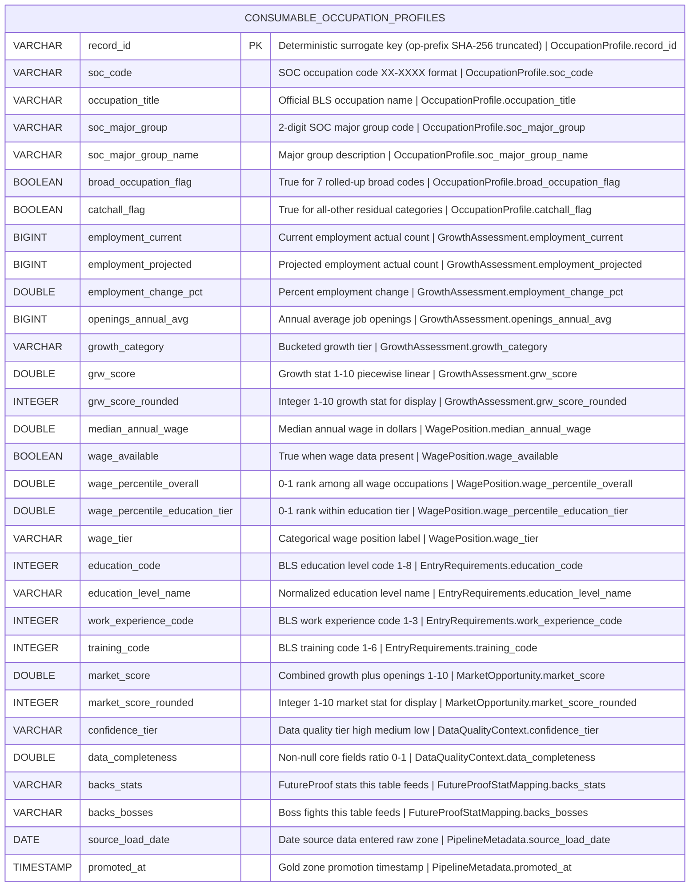

# Physical Model: gold-occupation-profiles-bls-ooh

**Status:** APPROVED
**Mode:** Greenfield
**Zone:** Gold (Consumable)
**Domain:** Occupational Employment Projections
**Spec:** docs/specs/gold-occupation-profiles-bls-ooh.md
**Logical Model:** governance/models/gold-occupation-profiles-bls-ooh-logical.md
**Conceptual Model:** governance/models/gold-occupation-profiles-bls-ooh-conceptual.md
**Author:** @semantic-modeler
**Date:** 2026-04-07
**Approval:** APPROVED by human review (2026-04-07)

---



---

## Table Definition

| Property | Value |
|----------|-------|
| **Catalog table** | `consumable.occupation_profiles` |
| **Format** | Apache Iceberg (v2) |
| **Format version** | 2 (supports row-level deletes, merge-on-read) |
| **Engine** | DuckDB (via `iceberg_scan`) |
| **Grain** | One row per occupation (soc_code) |
| **Natural key** | `soc_code` |
| **Surrogate key** | `record_id` (deterministic SHA-256 hash, prefix `op`) |
| **Expected row count** | 832 (all Silver base rows carried forward; no rows added or dropped) |
| **Partition strategy** | None (832 rows fits in a single partition; no partition benefit) |
| **Sort order** | `soc_code ASC` |
| **Write pattern** | Full table replace via `brightsmith.infra.promote.promote()` (idempotent) |

### Iceberg Table Properties

| Property | Value | Rationale |
|----------|-------|-----------|
| `write.format.default` | `parquet` | Standard columnar format for analytical queries |
| `write.parquet.compression-codec` | `zstd` | Best compression ratio for this data profile |
| `format-version` | `2` | Required for Brightsmith promote pattern |
| `write.metadata.delete-after-commit.enabled` | `true` | Clean up old metadata files |
| `write.metadata.previous-versions-max` | `10` | Retain 10 snapshots for time-travel queries |

### Sort Order Rationale

Sort order uses `soc_code ASC` (same as the Silver source table) because the primary query patterns for this Gold product are single-occupation lookups by SOC code (Gemma agent queries) and SOC-range scans (major group filtering). SOC codes sort lexicographically by major group (e.g., all 15-XXXX computer occupations cluster together), which naturally supports both access patterns. The 832-row dataset is small enough that sort order has minimal performance impact, but consistency with Silver reduces cognitive overhead for engineers.

---

## Column Definitions

### Occupation Profile (Core Identity + Classification)

| Column | DuckDB Type | Nullable | Default | Constraint | Business Term | Is CDE | Is PII | Description |
|--------|-------------|----------|---------|------------|---------------|--------|--------|-------------|
| record_id | VARCHAR | NOT NULL | derived | PRIMARY KEY | BT-015 | false | false | Deterministic surrogate key: `compute_grain_id(row, ['soc_code'], prefix='op')`. Format: `op-<16 hex chars>`. Stable across pipeline re-runs. Note: prefix changes from Silver's 'ooh' to Gold's 'op'. |
| soc_code | VARCHAR | NOT NULL | -- | UNIQUE; CHECK (soc_code ~ '^\d{2}-\d{4}$') | BT-027 | true | false | SOC occupation code in XX-XXXX format. Natural key. Primary join key for O*NET and CIP-SOC crosswalk. Source: `base.bls_ooh.soc_code`. |
| occupation_title | VARCHAR | NOT NULL | -- | -- | BT-028 | false | false | Official BLS occupation name. Source: `base.bls_ooh.occupation_title`. |
| soc_major_group | VARCHAR | NOT NULL | -- | CHECK (soc_major_group IN ('11','13','15','17','19','21','23','25','27','29','31','33','35','37','39','41','43','45','47','49','51','53')) | BT-029 | false | false | 2-digit SOC major group code derived from first 2 characters of soc_code. Source: `base.bls_ooh.soc_major_group`. |
| soc_major_group_name | VARCHAR | NOT NULL | -- | -- | BT-030 | false | false | Human-readable label for the SOC major group. Source: `base.bls_ooh.soc_major_group_name`. |
| broad_occupation_flag | BOOLEAN | NOT NULL | -- | -- | BT-040 | false | false | True for 7 rolled-up/broad occupation codes (13-1020, 13-2020, 29-2010, 31-1120, 39-7010, 47-4090, 51-2090). Source: `base.bls_ooh.broad_occupation_flag`. Used in confidence_tier derivation. |
| catchall_flag | BOOLEAN | NOT NULL | -- | -- | BT-043 | false | false | True for ~70 occupations with "all other" in the title. Source: `base.bls_ooh.catchall_flag`. Used in confidence_tier derivation. |

### Growth Assessment (Carried + Derived)

| Column | DuckDB Type | Nullable | Default | Constraint | Business Term | Is CDE | Is PII | Description |
|--------|-------------|----------|---------|------------|---------------|--------|--------|-------------|
| employment_current | BIGINT | NULLABLE | NULL | CHECK (employment_current IS NULL OR employment_current > 0) | BT-031 | true | false | Current employment count (actual workers). Source: `base.bls_ooh.employment_current`. One of four core fields for data_completeness. |
| employment_projected | BIGINT | NULLABLE | NULL | CHECK (employment_projected IS NULL OR employment_projected > 0) | BT-032 | true | false | Projected employment count at end of 10-year projection horizon. Source: `base.bls_ooh.employment_projected`. |
| employment_change_pct | DOUBLE | NULLABLE | NULL | CHECK (employment_change_pct IS NULL OR (employment_change_pct >= -50.0 AND employment_change_pct <= 60.0)) | BT-034 | true | false | Percentage change in employment over projection cycle. Can be negative. Source: `base.bls_ooh.employment_change_pct`. Input to grw_score derivation. One of four core fields for data_completeness. |
| openings_annual_avg | BIGINT | NULLABLE | NULL | CHECK (openings_annual_avg IS NULL OR openings_annual_avg >= 0) | BT-035 | false | false | Projected annual average job openings (growth + replacement). Source: `base.bls_ooh.openings_annual_avg`. Input to market_score derivation. One of four core fields for data_completeness. |
| growth_category | VARCHAR | NOT NULL | -- | CHECK (growth_category IN ('declining_fast', 'declining', 'stable', 'growing', 'growing_fast', 'booming')) | BT-041 | false | false | Bucketed growth classification from employment_change_pct. Source: `base.bls_ooh.growth_category`. NOT NULL in Gold (all 832 rows have employment data). |
| grw_score | DOUBLE | NULLABLE | NULL | CHECK (grw_score IS NULL OR (grw_score >= 1.0 AND grw_score <= 10.0)) | BT-047 | true | false | Growth stat on 1-10 scale. Derived from employment_change_pct via piecewise linear function. Backs the GRW pentagon stat. Null only if employment_change_pct is null (0 rows currently). |
| grw_score_rounded | INTEGER | NULLABLE | NULL | CHECK (grw_score_rounded IS NULL OR (grw_score_rounded >= 1 AND grw_score_rounded <= 10)) | BT-047 | false | false | Integer 1-10 for display. ROUND(grw_score). Null if grw_score is null. |

### Wage Position (Carried + Derived)

| Column | DuckDB Type | Nullable | Default | Constraint | Business Term | Is CDE | Is PII | Description |
|--------|-------------|----------|---------|------------|---------------|--------|--------|-------------|
| median_annual_wage | DOUBLE | NULLABLE | NULL | CHECK (median_annual_wage IS NULL OR (median_annual_wage >= 25000 AND median_annual_wage <= 250000)) | BT-036 | true | false | Median annual wage in dollars. Null for 23 occupations. Source: `base.bls_ooh.median_annual_wage`. Backs the ERN stat. One of four core fields for data_completeness. |
| wage_available | BOOLEAN | NOT NULL | -- | -- | BT-042 | false | false | True if median_annual_wage is not null. 809 True, 23 False expected. Source: `base.bls_ooh.wage_available`. Used in confidence_tier derivation. |
| wage_percentile_overall | DOUBLE | NULLABLE | NULL | CHECK (wage_percentile_overall IS NULL OR (wage_percentile_overall >= 0.0 AND wage_percentile_overall <= 1.0)) | BT-048 | true | false | 0.0-1.0 rank among all occupations with wage data. Derived via PERCENT_RANK() window on median_annual_wage. Null for 23 occupations without wage data. Input to wage_tier derivation. |
| wage_percentile_education_tier | DOUBLE | NULLABLE | NULL | CHECK (wage_percentile_education_tier IS NULL OR (wage_percentile_education_tier >= 0.0 AND wage_percentile_education_tier <= 1.0)) | BT-049 | true | false | 0.0-1.0 rank within same education_code tier. Derived via PERCENT_RANK() partitioned by education_code, ordered by median_annual_wage. Null for 23 occupations without wage data. Backs the Ceiling boss fight. |
| wage_tier | VARCHAR | NULLABLE | NULL | CHECK (wage_tier IS NULL OR wage_tier IN ('low', 'below_average', 'above_average', 'high', 'very_high')) | BT-050 | false | false | Categorical bucketing of wage_percentile_overall into five tiers. Null if wage unavailable (23 rows). Exact correspondence: wage_tier IS NULL iff wage_available = False. |

### Entry Requirements (Carried)

| Column | DuckDB Type | Nullable | Default | Constraint | Business Term | Is CDE | Is PII | Description |
|--------|-------------|----------|---------|------------|---------------|--------|--------|-------------|
| education_code | INTEGER | NULLABLE | NULL | CHECK (education_code IS NULL OR (education_code >= 1 AND education_code <= 8)) | BT-038 | false | false | BLS education level code (1=Doctoral through 8=No formal credential). Categorical, not aggregatable. Source: `base.bls_ooh.education_code`. Partition key for wage_percentile_education_tier. |
| education_level_name | VARCHAR | NULLABLE | NULL | CHECK (education_level_name IS NULL OR education_level_name IN ('Doctoral or professional degree', 'Master''s degree', 'Bachelor''s degree', 'Associate''s degree', 'Postsecondary nondegree award', 'Some college, no degree', 'High school diploma or equivalent', 'No formal educational credential')) | BT-039 | false | false | Normalized education level label derived from education_code. Source: `base.bls_ooh.education_level_name`. |
| work_experience_code | INTEGER | NULLABLE | NULL | CHECK (work_experience_code IS NULL OR (work_experience_code >= 1 AND work_experience_code <= 3)) | BT-044 | false | false | BLS work experience code (1=5+ years, 2=Less than 5 years, 3=None). Source: `base.bls_ooh.work_experience_code`. |
| training_code | INTEGER | NULLABLE | NULL | CHECK (training_code IS NULL OR (training_code >= 1 AND training_code <= 6)) | BT-045 | false | false | BLS training code (1=Internship/residency through 6=None). Source: `base.bls_ooh.training_code`. |

### Market Opportunity (Derived)

| Column | DuckDB Type | Nullable | Default | Constraint | Business Term | Is CDE | Is PII | Description |
|--------|-------------|----------|---------|------------|---------------|--------|--------|-------------|
| market_score | DOUBLE | NULLABLE | NULL | CHECK (market_score IS NULL OR (market_score >= 1.0 AND market_score <= 10.0)) | BT-051 | true | false | Combined growth + openings signal on 1-10 scale. Formula: 0.6 * grw_score + 0.4 * openings_score. Null if grw_score or openings_annual_avg is null. Backs the Market boss fight. |
| market_score_rounded | INTEGER | NULLABLE | NULL | CHECK (market_score_rounded IS NULL OR (market_score_rounded >= 1 AND market_score_rounded <= 10)) | BT-051 | false | false | Integer 1-10 for display. ROUND(market_score). Null if market_score is null. |

### Data Quality Context (Derived)

| Column | DuckDB Type | Nullable | Default | Constraint | Business Term | Is CDE | Is PII | Description |
|--------|-------------|----------|---------|------------|---------------|--------|--------|-------------|
| confidence_tier | VARCHAR | NOT NULL | -- | CHECK (confidence_tier IN ('high', 'medium', 'low')) | BT-052 | false | false | Three-level data quality classification. Every row receives a tier. Note: three tiers (not four) -- no "insufficient" level because all occupations have employment data. |
| data_completeness | DOUBLE | NOT NULL | -- | CHECK (data_completeness IN (0.0, 0.25, 0.5, 0.75, 1.0)) | BT-053 | false | false | Proportion of four core fields (median_annual_wage, employment_current, employment_change_pct, openings_annual_avg) that are non-null. Values: 0.0, 0.25, 0.5, 0.75, 1.0. In practice, 0.0 not expected. |

### FutureProof Stat Mapping (Static)

| Column | DuckDB Type | Nullable | Default | Constraint | Business Term | Is CDE | Is PII | Description |
|--------|-------------|----------|---------|------------|---------------|--------|--------|-------------|
| backs_stats | VARCHAR | NOT NULL | -- | CHECK (backs_stats = 'ERN,GRW') | BT-054 | false | false | Comma-separated list of FutureProof pentagon stats this occupation data feeds. Always "ERN,GRW" for this data product. |
| backs_bosses | VARCHAR | NOT NULL | -- | CHECK (backs_bosses = 'Market,Ceiling') | BT-054 | false | false | Comma-separated list of boss fights this data feeds. Always "Market,Ceiling" for this data product. |

### Pipeline Metadata

| Column | DuckDB Type | Nullable | Default | Constraint | Business Term | Is CDE | Is PII | Description |
|--------|-------------|----------|---------|------------|---------------|--------|--------|-------------|
| source_load_date | DATE | NOT NULL | -- | -- | BT-016 | false | false | Date the source data was loaded into the raw zone. Source: `base.bls_ooh.source_load_date`. |
| promoted_at | TIMESTAMP | NOT NULL | -- | -- | BT-026 | false | false | Timestamp when the row was promoted to the Gold zone. Generated at promotion time via `datetime.now(tz=datetime.timezone.utc)`. |

---

## Column Summary

| Count | Category |
|-------|----------|
| 31 | Total columns |
| 1 | Primary key (record_id) |
| 1 | Natural key component (soc_code) |
| 5 | CDE columns carried from Silver (soc_code, employment_current, employment_projected, employment_change_pct, median_annual_wage) |
| 4 | CDE columns new in Gold (grw_score, wage_percentile_overall, wage_percentile_education_tier, market_score) |
| 0 | PII columns |
| 13 | Nullable columns |
| 18 | NOT NULL columns |
| 12 | Derived columns (record_id, grw_score, grw_score_rounded, wage_percentile_overall, wage_percentile_education_tier, wage_tier, market_score, market_score_rounded, confidence_tier, data_completeness, backs_stats, backs_bosses) |
| 16 | Carried from Silver (verbatim or field selection) |
| 2 | Pipeline metadata (source_load_date carried, promoted_at new) |

---

## PyIceberg Schema Definition

This is the exact schema the Gold transformer must use when creating the Iceberg table via `promote()`.

```python
from pyiceberg.schema import Schema
from pyiceberg.types import (
    BooleanType,
    DateType,
    DoubleType,
    IntegerType,
    LongType,
    NestedField,
    StringType,
    TimestampType,
)

SCHEMA = Schema(
    # Occupation Profile (Core Identity + Classification)
    NestedField(1, "record_id", StringType(), required=True),
    NestedField(2, "soc_code", StringType(), required=True),
    NestedField(3, "occupation_title", StringType(), required=True),
    NestedField(4, "soc_major_group", StringType(), required=True),
    NestedField(5, "soc_major_group_name", StringType(), required=True),
    NestedField(6, "broad_occupation_flag", BooleanType(), required=True),
    NestedField(7, "catchall_flag", BooleanType(), required=True),
    # Growth Assessment (Carried + Derived)
    NestedField(8, "employment_current", LongType(), required=False),
    NestedField(9, "employment_projected", LongType(), required=False),
    NestedField(10, "employment_change_pct", DoubleType(), required=False),
    NestedField(11, "openings_annual_avg", LongType(), required=False),
    NestedField(12, "growth_category", StringType(), required=True),
    NestedField(13, "grw_score", DoubleType(), required=False),
    NestedField(14, "grw_score_rounded", IntegerType(), required=False),
    # Wage Position (Carried + Derived)
    NestedField(15, "median_annual_wage", DoubleType(), required=False),
    NestedField(16, "wage_available", BooleanType(), required=True),
    NestedField(17, "wage_percentile_overall", DoubleType(), required=False),
    NestedField(18, "wage_percentile_education_tier", DoubleType(), required=False),
    NestedField(19, "wage_tier", StringType(), required=False),
    # Entry Requirements (Carried)
    NestedField(20, "education_code", IntegerType(), required=False),
    NestedField(21, "education_level_name", StringType(), required=False),
    NestedField(22, "work_experience_code", IntegerType(), required=False),
    NestedField(23, "training_code", IntegerType(), required=False),
    # Market Opportunity (Derived)
    NestedField(24, "market_score", DoubleType(), required=False),
    NestedField(25, "market_score_rounded", IntegerType(), required=False),
    # Data Quality Context (Derived)
    NestedField(26, "confidence_tier", StringType(), required=True),
    NestedField(27, "data_completeness", DoubleType(), required=True),
    # FutureProof Stat Mapping (Static)
    NestedField(28, "backs_stats", StringType(), required=True),
    NestedField(29, "backs_bosses", StringType(), required=True),
    # Pipeline Metadata
    NestedField(30, "source_load_date", DateType(), required=True),
    NestedField(31, "promoted_at", TimestampType(), required=True),
)
```

---

## Reference Implementation: Promote Pattern

The following shows the expected promote pattern for the Gold transformer at `src/gold/bls_ooh_occupation_profiles.py`. This follows the established pattern from `src/gold/college_scorecard_career_outcomes.py`.

```python
"""Gold zone transformer for consumable.occupation_profiles.

Reads base.bls_ooh from the Silver zone, computes all derived fields
(GRW score, wage percentiles, market score, confidence tier, etc.),
and promotes to consumable.occupation_profiles via the Brightsmith
idempotent promote pattern.

Grain: soc_code
Record ID: compute_grain_id(row, ['soc_code'], prefix='op')
"""

import datetime
import logging
from pathlib import Path

import duckdb
from pyiceberg.schema import Schema
from pyiceberg.types import (
    BooleanType,
    DateType,
    DoubleType,
    IntegerType,
    LongType,
    NestedField,
    StringType,
    TimestampType,
)

from brightsmith.infra.grain import compute_grain_id
from brightsmith.infra.iceberg_setup import get_catalog, get_or_create_table
from brightsmith.infra.promote import promote

logger = logging.getLogger(__name__)

SPEC_NAME = "gold-occupation-profiles-bls-ooh"
GRAIN_FIELDS = ["soc_code"]
GRAIN_PREFIX = "op"


def get_gold_schema() -> Schema:
    """Iceberg schema for consumable.occupation_profiles (31 columns)."""
    return Schema(
        # Occupation Profile (Core Identity + Classification)
        NestedField(1, "record_id", StringType(), required=True),
        NestedField(2, "soc_code", StringType(), required=True),
        NestedField(3, "occupation_title", StringType(), required=True),
        NestedField(4, "soc_major_group", StringType(), required=True),
        NestedField(5, "soc_major_group_name", StringType(), required=True),
        NestedField(6, "broad_occupation_flag", BooleanType(), required=True),
        NestedField(7, "catchall_flag", BooleanType(), required=True),
        # Growth Assessment (Carried + Derived)
        NestedField(8, "employment_current", LongType(), required=False),
        NestedField(9, "employment_projected", LongType(), required=False),
        NestedField(10, "employment_change_pct", DoubleType(), required=False),
        NestedField(11, "openings_annual_avg", LongType(), required=False),
        NestedField(12, "growth_category", StringType(), required=True),
        NestedField(13, "grw_score", DoubleType(), required=False),
        NestedField(14, "grw_score_rounded", IntegerType(), required=False),
        # Wage Position (Carried + Derived)
        NestedField(15, "median_annual_wage", DoubleType(), required=False),
        NestedField(16, "wage_available", BooleanType(), required=True),
        NestedField(17, "wage_percentile_overall", DoubleType(), required=False),
        NestedField(18, "wage_percentile_education_tier", DoubleType(), required=False),
        NestedField(19, "wage_tier", StringType(), required=False),
        # Entry Requirements (Carried)
        NestedField(20, "education_code", IntegerType(), required=False),
        NestedField(21, "education_level_name", StringType(), required=False),
        NestedField(22, "work_experience_code", IntegerType(), required=False),
        NestedField(23, "training_code", IntegerType(), required=False),
        # Market Opportunity (Derived)
        NestedField(24, "market_score", DoubleType(), required=False),
        NestedField(25, "market_score_rounded", IntegerType(), required=False),
        # Data Quality Context (Derived)
        NestedField(26, "confidence_tier", StringType(), required=True),
        NestedField(27, "data_completeness", DoubleType(), required=True),
        # FutureProof Stat Mapping (Static)
        NestedField(28, "backs_stats", StringType(), required=True),
        NestedField(29, "backs_bosses", StringType(), required=True),
        # Pipeline Metadata
        NestedField(30, "source_load_date", DateType(), required=True),
        NestedField(31, "promoted_at", TimestampType(), required=True),
    )


def transform(
    project_dir: str | Path | None = None,
) -> dict:
    """Run the Gold zone transformation.

    Reads base.bls_ooh from Silver, computes all Gold derivations,
    and promotes to consumable.occupation_profiles via idempotent
    promote pattern.

    Returns:
        {"rows_read": N, "promoted": M, "skipped": S, ...}
    """
    project_dir = Path(project_dir or ".").resolve()

    silver_warehouse = project_dir / "data" / "silver" / "iceberg_warehouse"
    catalog_path = project_dir / "data" / "catalog" / "catalog.db"
    gold_warehouse = project_dir / "data" / "gold" / "iceberg_warehouse"

    # Read from Silver
    logger.info("Reading from base.bls_ooh...")
    silver_catalog = get_catalog(silver_warehouse, catalog_path)
    silver_table = silver_catalog.load_table("base.bls_ooh")

    arrow_table = silver_table.scan().to_arrow()
    con = duckdb.connect()
    result = con.sql("SELECT * FROM arrow_table").fetchall()
    columns = [field.name for field in silver_table.schema().fields]
    silver_rows = [dict(zip(columns, row)) for row in result]
    con.close()
    logger.info("Read %d rows from Silver", len(silver_rows))

    # Derive Gold fields
    logger.info("Computing Gold derivations...")
    gold_rows = derive_gold_rows(silver_rows)
    logger.info("Derived %d Gold rows", len(gold_rows))

    # Add record_id and promoted_at
    promoted_at = datetime.datetime.now(tz=datetime.timezone.utc)
    add_record_ids(gold_rows, promoted_at)

    # Promote to Gold
    logger.info("Promoting to consumable.occupation_profiles...")
    gold_catalog = get_catalog(gold_warehouse, catalog_path)
    gold_table = get_or_create_table(
        gold_catalog, "consumable", "occupation_profiles", get_gold_schema()
    )
    result = promote(
        gold_table,
        gold_rows,
        id_field="record_id",
        spec_name=SPEC_NAME,
        agent_name="@primary-agent",
    )

    logger.info(
        "Promote complete: %d promoted, %d skipped",
        result["promoted"],
        result["skipped"],
    )

    return {
        "rows_read": len(silver_rows),
        "rows_derived": len(gold_rows),
        "promoted": result["promoted"],
        "skipped_dedup": result["skipped"],
        "snapshot_id": result.get("snapshot_id"),
    }
```

---

## DDL (Reference)

This DDL is for documentation. The actual table is created via `brightsmith.infra.promote.promote()` which handles Iceberg table creation and idempotent writes.

```sql
-- Reference DDL for consumable.occupation_profiles
-- Engine: DuckDB + Iceberg v2
-- Do not execute directly -- use promote() pattern

CREATE TABLE IF NOT EXISTS consumable.occupation_profiles (
    -- Occupation Profile (Core Identity + Classification)
    record_id                       VARCHAR     NOT NULL,
    soc_code                        VARCHAR     NOT NULL,
    occupation_title                VARCHAR     NOT NULL,
    soc_major_group                 VARCHAR     NOT NULL,
    soc_major_group_name            VARCHAR     NOT NULL,
    broad_occupation_flag           BOOLEAN     NOT NULL,
    catchall_flag                   BOOLEAN     NOT NULL,

    -- Growth Assessment (Carried + Derived)
    employment_current              BIGINT,
    employment_projected            BIGINT,
    employment_change_pct           DOUBLE,
    openings_annual_avg             BIGINT,
    growth_category                 VARCHAR     NOT NULL,
    grw_score                       DOUBLE,
    grw_score_rounded               INTEGER,

    -- Wage Position (Carried + Derived)
    median_annual_wage              DOUBLE,
    wage_available                  BOOLEAN     NOT NULL,
    wage_percentile_overall         DOUBLE,
    wage_percentile_education_tier  DOUBLE,
    wage_tier                       VARCHAR,

    -- Entry Requirements (Carried)
    education_code                  INTEGER,
    education_level_name            VARCHAR,
    work_experience_code            INTEGER,
    training_code                   INTEGER,

    -- Market Opportunity (Derived)
    market_score                    DOUBLE,
    market_score_rounded            INTEGER,

    -- Data Quality Context (Derived)
    confidence_tier                 VARCHAR     NOT NULL,
    data_completeness               DOUBLE      NOT NULL,

    -- FutureProof Stat Mapping (Static)
    backs_stats                     VARCHAR     NOT NULL,
    backs_bosses                    VARCHAR     NOT NULL,

    -- Pipeline Metadata
    source_load_date                DATE        NOT NULL,
    promoted_at                     TIMESTAMP   NOT NULL,

    -- Surrogate key
    PRIMARY KEY (record_id),

    -- Natural key uniqueness (enforced at load time, not by Iceberg)
    UNIQUE (soc_code),

    -- Domain constraints
    CHECK (soc_code ~ '^\d{2}-\d{4}$'),
    CHECK (soc_major_group IN ('11','13','15','17','19','21','23','25','27','29','31','33','35','37','39','41','43','45','47','49','51','53')),
    CHECK (employment_current IS NULL OR employment_current > 0),
    CHECK (employment_projected IS NULL OR employment_projected > 0),
    CHECK (employment_change_pct IS NULL OR (employment_change_pct >= -50.0 AND employment_change_pct <= 60.0)),
    CHECK (openings_annual_avg IS NULL OR openings_annual_avg >= 0),
    CHECK (growth_category IN ('declining_fast', 'declining', 'stable', 'growing', 'growing_fast', 'booming')),
    CHECK (grw_score IS NULL OR (grw_score >= 1.0 AND grw_score <= 10.0)),
    CHECK (grw_score_rounded IS NULL OR (grw_score_rounded >= 1 AND grw_score_rounded <= 10)),
    CHECK (median_annual_wage IS NULL OR (median_annual_wage >= 25000 AND median_annual_wage <= 250000)),
    CHECK (wage_percentile_overall IS NULL OR (wage_percentile_overall >= 0.0 AND wage_percentile_overall <= 1.0)),
    CHECK (wage_percentile_education_tier IS NULL OR (wage_percentile_education_tier >= 0.0 AND wage_percentile_education_tier <= 1.0)),
    CHECK (wage_tier IS NULL OR wage_tier IN ('low', 'below_average', 'above_average', 'high', 'very_high')),
    CHECK (education_code IS NULL OR (education_code >= 1 AND education_code <= 8)),
    CHECK (education_level_name IS NULL OR education_level_name IN (
        'Doctoral or professional degree', 'Master''s degree', 'Bachelor''s degree',
        'Associate''s degree', 'Postsecondary nondegree award', 'Some college, no degree',
        'High school diploma or equivalent', 'No formal educational credential'
    )),
    CHECK (work_experience_code IS NULL OR (work_experience_code >= 1 AND work_experience_code <= 3)),
    CHECK (training_code IS NULL OR (training_code >= 1 AND training_code <= 6)),
    CHECK (market_score IS NULL OR (market_score >= 1.0 AND market_score <= 10.0)),
    CHECK (market_score_rounded IS NULL OR (market_score_rounded >= 1 AND market_score_rounded <= 10)),
    CHECK (confidence_tier IN ('high', 'medium', 'low')),
    CHECK (data_completeness IN (0.0, 0.25, 0.5, 0.75, 1.0)),
    CHECK (backs_stats = 'ERN,GRW'),
    CHECK (backs_bosses = 'Market,Ceiling')
);
```

---

## Source-to-Target Mapping

| Physical Column | DuckDB Type | Source Table | Source Field | Transformation |
|-----------------|-------------|-------------|--------------|----------------|
| record_id | VARCHAR | -- | derived | `compute_grain_id(row, ['soc_code'], prefix='op')` |
| soc_code | VARCHAR | base.bls_ooh | soc_code | Verbatim |
| occupation_title | VARCHAR | base.bls_ooh | occupation_title | Verbatim |
| soc_major_group | VARCHAR | base.bls_ooh | soc_major_group | Verbatim |
| soc_major_group_name | VARCHAR | base.bls_ooh | soc_major_group_name | Verbatim |
| broad_occupation_flag | BOOLEAN | base.bls_ooh | broad_occupation_flag | Verbatim |
| catchall_flag | BOOLEAN | base.bls_ooh | catchall_flag | Verbatim |
| employment_current | BIGINT | base.bls_ooh | employment_current | Verbatim |
| employment_projected | BIGINT | base.bls_ooh | employment_projected | Verbatim |
| employment_change_pct | DOUBLE | base.bls_ooh | employment_change_pct | Verbatim |
| openings_annual_avg | BIGINT | base.bls_ooh | openings_annual_avg | Verbatim |
| growth_category | VARCHAR | base.bls_ooh | growth_category | Verbatim |
| grw_score | DOUBLE | -- | derived | Piecewise linear function from employment_change_pct (see Derivation Rules) |
| grw_score_rounded | INTEGER | -- | derived | `ROUND(grw_score)` cast to INTEGER |
| median_annual_wage | DOUBLE | base.bls_ooh | median_annual_wage | Verbatim |
| wage_available | BOOLEAN | base.bls_ooh | wage_available | Verbatim |
| wage_percentile_overall | DOUBLE | -- | derived | `PERCENT_RANK() OVER (ORDER BY median_annual_wage)` excluding null-wage rows |
| wage_percentile_education_tier | DOUBLE | -- | derived | `PERCENT_RANK() OVER (PARTITION BY education_code ORDER BY median_annual_wage)` excluding null-wage rows |
| wage_tier | VARCHAR | -- | derived | Bucketed from wage_percentile_overall (see Derivation Rules) |
| education_code | INTEGER | base.bls_ooh | education_code | Verbatim |
| education_level_name | VARCHAR | base.bls_ooh | education_level_name | Verbatim |
| work_experience_code | INTEGER | base.bls_ooh | work_experience_code | Verbatim |
| training_code | INTEGER | base.bls_ooh | training_code | Verbatim |
| market_score | DOUBLE | -- | derived | `0.6 * grw_score + 0.4 * openings_score` (see Derivation Rules) |
| market_score_rounded | INTEGER | -- | derived | `ROUND(market_score)` cast to INTEGER |
| confidence_tier | VARCHAR | -- | derived | Conditional logic from broad_occupation_flag, catchall_flag, wage_available (see Derivation Rules) |
| data_completeness | DOUBLE | -- | derived | Count of non-null core fields / 4.0 (see Derivation Rules) |
| backs_stats | VARCHAR | -- | static | `'ERN,GRW'` for all rows |
| backs_bosses | VARCHAR | -- | static | `'Market,Ceiling'` for all rows |
| source_load_date | DATE | base.bls_ooh | source_load_date | Verbatim |
| promoted_at | TIMESTAMP | -- | generated | `datetime.now(tz=datetime.timezone.utc)` at Gold promotion time |

---

## Derivation Rules (Implementation Expressions)

### GRW Score (Piecewise Linear Function)

The piecewise linear function maps employment_change_pct to a 1.0-10.0 score. Implementation as a SQL CASE expression:

```sql
CASE
    WHEN employment_change_pct IS NULL THEN NULL
    WHEN employment_change_pct <= -20.0 THEN 1.0
    WHEN employment_change_pct <= -10.0 THEN 1.0 + (employment_change_pct - (-20.0)) / ((-10.0) - (-20.0)) * (2.5 - 1.0)
    WHEN employment_change_pct <= -1.0  THEN 2.5 + (employment_change_pct - (-10.0)) / ((-1.0) - (-10.0)) * (4.0 - 2.5)
    WHEN employment_change_pct <= 1.0   THEN 4.0 + (employment_change_pct - (-1.0)) / (1.0 - (-1.0)) * (5.0 - 4.0)
    WHEN employment_change_pct <= 5.0   THEN 5.0 + (employment_change_pct - 1.0) / (5.0 - 1.0) * (6.5 - 5.0)
    WHEN employment_change_pct <= 10.0  THEN 6.5 + (employment_change_pct - 5.0) / (10.0 - 5.0) * (7.5 - 6.5)
    WHEN employment_change_pct <= 20.0  THEN 7.5 + (employment_change_pct - 10.0) / (20.0 - 10.0) * (9.0 - 7.5)
    WHEN employment_change_pct <= 50.0  THEN 9.0 + (employment_change_pct - 20.0) / (50.0 - 20.0) * (10.0 - 9.0)
    ELSE 10.0
END AS grw_score
```

### GRW Score Rounded

```sql
CAST(ROUND(grw_score) AS INTEGER) AS grw_score_rounded
```

### Wage Percentile Ranks (Window Functions)

Rows with null median_annual_wage are excluded from the window via a CTE filter, then LEFT JOINed back to produce nulls for those 23 rows.

```sql
-- In a CTE restricted to wage_available = TRUE:
PERCENT_RANK() OVER (ORDER BY median_annual_wage) AS wage_percentile_overall,
PERCENT_RANK() OVER (PARTITION BY education_code ORDER BY median_annual_wage) AS wage_percentile_education_tier
```

### Wage Tier Derivation

```sql
CASE
    WHEN wage_percentile_overall IS NULL THEN NULL
    WHEN wage_percentile_overall < 0.25 THEN 'low'
    WHEN wage_percentile_overall < 0.50 THEN 'below_average'
    WHEN wage_percentile_overall < 0.75 THEN 'above_average'
    WHEN wage_percentile_overall < 0.90 THEN 'high'
    ELSE 'very_high'
END AS wage_tier
```

### Market Score Derivation

Two-step computation. openings_score is an intermediate value not persisted.

```sql
-- Step 1: openings_score (in a CTE restricted to non-null openings_annual_avg)
1.0 + 9.0 * PERCENT_RANK() OVER (ORDER BY openings_annual_avg) AS openings_score

-- Step 2: market_score
CASE
    WHEN grw_score IS NULL OR openings_score IS NULL THEN NULL
    ELSE 0.6 * grw_score + 0.4 * openings_score
END AS market_score
```

### Market Score Rounded

```sql
CAST(ROUND(market_score) AS INTEGER) AS market_score_rounded
```

### Confidence Tier Derivation

Evaluated top-to-bottom; first matching condition wins.

```sql
CASE
    WHEN broad_occupation_flag = FALSE AND catchall_flag = FALSE AND wage_available = TRUE
        THEN 'high'
    WHEN (broad_occupation_flag = TRUE OR catchall_flag = TRUE) AND wage_available = TRUE
        THEN 'medium'
    ELSE 'low'
END AS confidence_tier
```

### Data Completeness Derivation

```sql
(CASE WHEN median_annual_wage IS NOT NULL THEN 1 ELSE 0 END
 + CASE WHEN employment_current IS NOT NULL THEN 1 ELSE 0 END
 + CASE WHEN employment_change_pct IS NOT NULL THEN 1 ELSE 0 END
 + CASE WHEN openings_annual_avg IS NOT NULL THEN 1 ELSE 0 END)
/ 4.0 AS data_completeness
```

### Record ID

```python
from brightsmith.infra.grain import compute_grain_id

record_id = compute_grain_id(row, ['soc_code'], prefix='op')
# Output format: op-<16 hex chars>
```

### Static Fields

```sql
'ERN,GRW' AS backs_stats,
'Market,Ceiling' AS backs_bosses
```

### Promoted At

```python
promoted_at = datetime.datetime.now(tz=datetime.timezone.utc)
```

---

## Nullability Semantics

| Column | NULL Means |
|--------|-----------|
| employment_current | BLS did not provide employment data for this occupation (defensive; 0 nulls expected) |
| employment_projected | BLS did not provide projected employment for this occupation (defensive; 0 nulls expected) |
| employment_change_pct | Insufficient data for projection percentage (defensive; 0 nulls expected) |
| openings_annual_avg | BLS did not provide openings data (defensive; 0 nulls expected) |
| grw_score | employment_change_pct is null, so no GRW stat can be computed (0 rows currently) |
| grw_score_rounded | Propagated from grw_score null |
| median_annual_wage | BLS does not report wage data for this occupation (23 occupations: elected officials, self-employed-dominated fields, dental specialists) |
| wage_percentile_overall | Same 23 occupations. Cannot rank what has no value. |
| wage_percentile_education_tier | Same 23 occupations. |
| wage_tier | Same 23 occupations. Exact correspondence: wage_tier IS NULL iff wage_available = False. |
| education_code | BLS did not classify this occupation's education requirement (defensive; 0 nulls expected) |
| education_level_name | education_code is null, so no label can be derived (defensive; 0 nulls expected) |
| work_experience_code | BLS did not provide a work experience code (defensive; 0 nulls expected) |
| training_code | BLS did not provide a training code (defensive; 0 nulls expected) |
| market_score | Either grw_score or openings_annual_avg is null |
| market_score_rounded | Propagated from market_score null |

Expected null rates from EDA:
- median_annual_wage: 2.8% (23 of 832)
- wage_percentile_overall, wage_percentile_education_tier, wage_tier: 2.8% (23 of 832, exact correspondence)
- All other nullable fields: 0% in current data (nullable as defensive measure)

---

## Dropped Fields (from Silver, with justification)

| Silver Column | DuckDB Type | Dropped? | Justification |
|--------------|-------------|----------|---------------|
| employment_change | BIGINT | Dropped | Redundant with employment_change_pct for Gold consumers. Absolute change less useful than percentage for stat scoring. Available in Silver if needed. |
| median_wage_capped | BOOLEAN | Dropped | All False in current data. The wage_available flag is more useful. Preserved in Silver for lineage. |
| education_typical | VARCHAR | Dropped | Redundant with education_level_name (derived from code). Kept the normalized name, dropped the raw label. |
| work_experience | VARCHAR | Dropped | Redundant with work_experience_code. Code is sufficient for Gold consumers. |
| training_typical | VARCHAR | Dropped | Redundant with training_code. Code is sufficient for Gold consumers. |
| ingested_at | TIMESTAMP | Dropped | Silver metadata replaced by promoted_at in Gold. |

---

## Traceability: Logical to Physical

| Logical Attribute | Logical Type Domain | Physical Column | Physical DuckDB Type | PyIceberg Type | NestedField ID | Mapping Notes |
|-------------------|--------------------|-----------------|--------------------|----------------|----------------|---------------|
| record_id | identifier | record_id | VARCHAR | StringType | 1 | Hash output is always a string. Prefix changes from Silver 'ooh' to Gold 'op'. |
| soc_code | identifier | soc_code | VARCHAR | StringType | 2 | XX-XXXX format requires string |
| occupation_title | text | occupation_title | VARCHAR | StringType | 3 | Direct mapping |
| soc_major_group | identifier | soc_major_group | VARCHAR | StringType | 4 | 2-digit code kept as string for leading zeros |
| soc_major_group_name | text | soc_major_group_name | VARCHAR | StringType | 5 | Direct mapping |
| broad_occupation_flag | boolean | broad_occupation_flag | BOOLEAN | BooleanType | 6 | Direct mapping |
| catchall_flag | boolean | catchall_flag | BOOLEAN | BooleanType | 7 | Direct mapping |
| employment_current | numeric | employment_current | BIGINT | LongType | 8 | Integer counts use BIGINT/LongType |
| employment_projected | numeric | employment_projected | BIGINT | LongType | 9 | Integer counts use BIGINT/LongType |
| employment_change_pct | numeric | employment_change_pct | DOUBLE | DoubleType | 10 | Percentage uses DOUBLE |
| openings_annual_avg | numeric | openings_annual_avg | BIGINT | LongType | 11 | Integer counts use BIGINT/LongType |
| growth_category | text | growth_category | VARCHAR | StringType | 12 | Enum stored as string. NOT NULL in Gold. |
| grw_score | numeric | grw_score | DOUBLE | DoubleType | 13 | Continuous score uses DOUBLE |
| grw_score_rounded | numeric | grw_score_rounded | INTEGER | IntegerType | 14 | Integer display value. Spec says 'int' = IntegerType. |
| median_annual_wage | numeric | median_annual_wage | DOUBLE | DoubleType | 15 | Monetary values use DOUBLE |
| wage_available | boolean | wage_available | BOOLEAN | BooleanType | 16 | Direct mapping |
| wage_percentile_overall | numeric | wage_percentile_overall | DOUBLE | DoubleType | 17 | PERCENT_RANK produces DOUBLE |
| wage_percentile_education_tier | numeric | wage_percentile_education_tier | DOUBLE | DoubleType | 18 | PERCENT_RANK produces DOUBLE |
| wage_tier | text | wage_tier | VARCHAR | StringType | 19 | Categorical label |
| education_code | numeric | education_code | INTEGER | IntegerType | 20 | Categorical code, not aggregatable |
| education_level_name | text | education_level_name | VARCHAR | StringType | 21 | Direct mapping |
| work_experience_code | numeric | work_experience_code | INTEGER | IntegerType | 22 | Categorical code, not aggregatable |
| training_code | numeric | training_code | INTEGER | IntegerType | 23 | Categorical code, not aggregatable |
| market_score | numeric | market_score | DOUBLE | DoubleType | 24 | Continuous composite score uses DOUBLE |
| market_score_rounded | numeric | market_score_rounded | INTEGER | IntegerType | 25 | Integer display value |
| confidence_tier | text | confidence_tier | VARCHAR | StringType | 26 | Categorical label. Three-level (not four). |
| data_completeness | numeric | data_completeness | DOUBLE | DoubleType | 27 | Proportion is continuous (exact value set enforced by CHECK) |
| backs_stats | text | backs_stats | VARCHAR | StringType | 28 | Static documentation field |
| backs_bosses | text | backs_bosses | VARCHAR | StringType | 29 | Static documentation field |
| source_load_date | date | source_load_date | DATE | DateType | 30 | Direct mapping |
| promoted_at | timestamp | promoted_at | TIMESTAMP | TimestampType | 31 | Direct mapping |

---

## Constraints and Invariants

### Hard Constraints (DQ P0 -- block promotion if violated)

| Constraint | SQL Expression | Scope |
|------------|---------------|-------|
| Grain uniqueness | `COUNT(*) = COUNT(DISTINCT soc_code)` | Table-wide |
| Record ID uniqueness | `COUNT(*) = COUNT(DISTINCT record_id)` | Table-wide |
| Row count exact | `COUNT(*) = 832` | Table-wide |
| GRW score range | `grw_score IS NULL OR (grw_score >= 1.0 AND grw_score <= 10.0)` | Row-level |
| GRW score rounded range | `grw_score_rounded IS NULL OR (grw_score_rounded >= 1 AND grw_score_rounded <= 10)` | Row-level |
| GRW score rounded accuracy | `grw_score_rounded IS NULL OR grw_score_rounded = CAST(ROUND(grw_score) AS INTEGER)` | Row-level |
| Market score range | `market_score IS NULL OR (market_score >= 1.0 AND market_score <= 10.0)` | Row-level |
| Market score rounded range | `market_score_rounded IS NULL OR (market_score_rounded >= 1 AND market_score_rounded <= 10)` | Row-level |
| Market score rounded accuracy | `market_score_rounded IS NULL OR market_score_rounded = CAST(ROUND(market_score) AS INTEGER)` | Row-level |
| Wage percentile range | `wage_percentile_overall IS NULL OR (wage_percentile_overall >= 0.0 AND wage_percentile_overall <= 1.0)` | Row-level |
| Wage percentile education range | `wage_percentile_education_tier IS NULL OR (wage_percentile_education_tier >= 0.0 AND wage_percentile_education_tier <= 1.0)` | Row-level |
| Wage percentile null count | `SUM(CASE WHEN wage_percentile_overall IS NULL THEN 1 ELSE 0 END) = 23` | Table-wide |
| Wage tier value set | `wage_tier IS NULL OR wage_tier IN ('low', 'below_average', 'above_average', 'high', 'very_high')` | Row-level |
| Wage tier null correspondence | `(wage_tier IS NULL) = (wage_available = FALSE)` | Row-level |
| Confidence tier completeness | `confidence_tier IS NOT NULL` | Row-level |
| Confidence tier value set | `confidence_tier IN ('high', 'medium', 'low')` | Row-level |
| Confidence tier low count | `SUM(CASE WHEN confidence_tier = 'low' THEN 1 ELSE 0 END) = 23` | Table-wide |
| Data completeness completeness | `data_completeness IS NOT NULL` | Row-level |
| Data completeness value set | `data_completeness IN (0.0, 0.25, 0.5, 0.75, 1.0)` | Row-level |
| Stat mapping completeness | `backs_stats IS NOT NULL AND backs_bosses IS NOT NULL` | Row-level |
| Stat mapping values | `backs_stats = 'ERN,GRW' AND backs_bosses = 'Market,Ceiling'` | Row-level |
| SOC code format | `soc_code ~ '^\d{2}-\d{4}$'` | Row-level |
| Growth category value set | `growth_category IN ('declining_fast', 'declining', 'stable', 'growing', 'growing_fast', 'booming')` | Row-level |

### Soft Constraints (DQ P1 -- warn but do not block)

| Constraint | SQL Expression | Scope |
|------------|---------------|-------|
| GRW score mean | `AVG(grw_score) BETWEEN 5.5 AND 6.5` | Table-wide |
| GRW score distribution | `COUNT(DISTINCT grw_score_rounded) >= 8` | Table-wide |
| Market score dispersion | `STDDEV(market_score) > 1.0` | Table-wide |
| Data completeness no zeros | `SUM(CASE WHEN data_completeness = 0.0 THEN 1 ELSE 0 END) = 0` | Table-wide |
| Null propagation consistency | `market_score IS NULL` when `grw_score IS NULL OR openings_annual_avg IS NULL` | Row-level |

---

## Implementation Notes

### Type mapping decisions

The spec uses shorthand type names that map to PyIceberg types as follows:

| Spec Type | PyIceberg Type | DuckDB Type | Usage |
|-----------|---------------|-------------|-------|
| string | StringType | VARCHAR | Identifiers, labels, codes |
| long | LongType | BIGINT | Employment counts, openings |
| double | DoubleType | DOUBLE | Scores, percentiles, wages, percentages |
| int | IntegerType | INTEGER | Rounded scores, categorical codes |
| boolean | BooleanType | BOOLEAN | Flags |
| date | DateType | DATE | source_load_date |
| timestamp | TimestampType | TIMESTAMP | promoted_at |

### Integer codes are categorical, not aggregatable

`education_code`, `work_experience_code`, and `training_code` are typed as INTEGER because they are categorical classification codes. Do not SUM, AVG, or otherwise aggregate these fields.

### Rounded scores are INTEGER, not DOUBLE

`grw_score_rounded` and `market_score_rounded` are typed as INTEGER (IntegerType) per the spec's `int` type. The `ROUND()` function in DuckDB returns DOUBLE, so an explicit `CAST(...AS INTEGER)` is required. This matches the spec requirement for "Integer 1-10 for display."

### growth_category is NOT NULL in Gold

Silver marks growth_category as nullable (null when employment_change_pct is null), but the current dataset has zero null employment_change_pct values across all 832 occupations. The Gold model follows the spec and marks growth_category as NOT NULL. If future data introduces null employment_change_pct, this constraint must be revisited.

### Wage range bounds

The median_annual_wage CHECK constraint uses $25,000-$250,000 bounds inherited from the Silver physical model (SLV-OOH-022), providing robustness against future data changes beyond the EDA-observed range of $30,160-$238,380.

### Confidence tier is three-level

Unlike `consumable.career_outcomes` which uses four confidence tiers (high/medium/low/insufficient), `consumable.occupation_profiles` uses three tiers. There is no "insufficient" level because every occupation has at least employment data. This is a distinct business term (BT-052 vs BT-024).

---

## Open Issues (Carried from Logical)

| # | Issue | Status | Resolution |
|---|-------|--------|------------|
| 1 | growth_category NOT NULL assumes current data pattern (0 null employment_change_pct values) holds for future data refreshes | ACCEPTED RISK | Document assumption. If future BLS data introduces null employment_change_pct, the Gold schema must evolve. |
| 2 | openings_score intermediate value not persisted | RESOLVED | By design. openings_score is computed inline during market_score derivation. Can be recomputed from openings_annual_avg if needed. |
