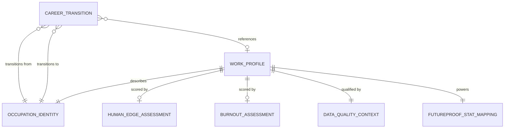

# Conceptual Model: gold-onet-profiles

**Status:** PROPOSED
**Mode:** Greenfield
**Zone:** Gold (Consumable)
**Domain:** Occupation Work Characteristics and Career Mobility
**Spec:** docs/specs/gold-onet-profiles.md
**Author:** @semantic-modeler
**Date:** 2026-04-08
**Approval:** PENDING HUMAN REVIEW
**Source Models:** governance/models/silver-base-onet-conceptual.md, governance/models/gold-occupation-profiles-bls-ooh-conceptual.md

---

---

## Entity Descriptions

| Entity | Business Concept | Business Term | Is CDE | Is PII |
|--------|-----------------|---------------|--------|--------|
| Work Profile | The central consumable entity: a self-contained work characteristics profile for a single occupation, containing derived HMN and Burnout scores, activity summaries, context summaries, and confidence tier. One row per BLS SOC code (798 rows). This is the O*NET-sourced complement to the BLS OOH Occupation Profile -- together they complete the FutureProof pentagon. Answers: "What does the day-to-day work look like, how human is it, and how burnout-prone is it?" | BT-070 | true | false |
| Occupation Identity | The dimensional context identifying what occupation a work profile or career transition describes: BLS SOC code, primary title, description, multi-detail aggregation flag, and data completeness tier. Carried from Silver base.onet_occupations without transformation. Shared across both Gold tables as the key dimension. | BT-027, BT-055, BT-063, BT-064 | true | false |
| Human Edge Assessment | The derived HMN scoring for an occupation, measuring how much of the occupation's important work is distinctly human (interpersonal judgment, creativity, physical presence, emotional intelligence). Contains the HMN score (1-10 scale derived from the ratio of human-intensive activity importance to total activity importance), top human activities, and human activity count. Null for 24 partial-data occupations without activity profiles. Anchors the HMN stat in the FutureProof pentagon. | BT-066, BT-067, BT-072 | true | false |
| Burnout Assessment | The derived burnout risk scoring for an occupation, combining 9 burnout-relevant Work Context elements (time pressure, work hours, consequence of error, pace autonomy, decision frequency, precision pressure, outcome responsibility, monotony, safety responsibility) into a single 1-10 score. Contains the Burnout score, top 3 burnout drivers, and individual burnout element values. Null for 24 partial-data occupations without context profiles. Backs the Burnout boss fight. | BT-068, BT-069, BT-059 | true | false |
| Career Transition | A directed similarity relationship between two occupations, enriched with titles and work profile availability flags. Represents "from occupation A, what related careers exist?" One row per occupation pair (15,944 rows). Sourced from O*NET's career similarity graph via Silver. Classified into relatedness tiers (Primary-Short, Primary-Long, Supplemental). Powers Stage 3 branching in FutureProof. | BT-060, BT-061 | false | false |
| Data Quality Context | A quality and completeness layer assigned to every work profile. Classifies each row into a confidence tier (high/medium/low) based on data completeness and suppression rates for both activity and context profiles. Enables downstream consumers to filter or caveat results. Required on every row -- no nulls. | BT-071, BT-062 | false | false |
| FutureProof Stat Mapping | Documentation metadata declaring which FutureProof pentagon stats and boss fights each data product contributes to. For Work Profiles: stats = "HMN", bosses = "AI,Burnout". For Career Transitions: feature = "Stage3Branching". Enables the game system to discover which data products back which gameplay elements. | BT-054 | false | false |

---

## Relationship Descriptions

| Relationship | From | To | Cardinality | Description |
|-------------|------|-----|-------------|-------------|
| describes | Work Profile | Occupation Identity | one-to-one | Every work profile describes exactly one occupation (bls_soc_code). The work profile IS the enriched O*NET work characteristics view of that occupation. 798 rows, one per occupation in base.onet_occupations. |
| scored by (HMN) | Work Profile | Human Edge Assessment | one-to-zero-or-one | A work profile may have a Human Edge Assessment (HMN score and supporting data), or it may be null. 774 occupations have full activity data; 24 partial-data occupations have null HMN scores. The assessment is null -- not zero -- when data is unavailable. |
| scored by (Burnout) | Work Profile | Burnout Assessment | one-to-zero-or-one | A work profile may have a Burnout Assessment (Burnout score and supporting data), or it may be null. Same 774/24 split as HMN. The same 24 partial-data occupations lack both scores. |
| qualified by | Work Profile | Data Quality Context | one-to-one | Every work profile has a confidence tier and suppression percentages. No nulls -- every row is classified. Confidence tier is derived from data completeness + suppression rates. |
| powers | Work Profile | FutureProof Stat Mapping | one-to-one | Every work profile declares its stat and boss contributions. Static values: "HMN" for stats, "AI,Burnout" for bosses. Establishes this data product's role in the FutureProof game system. |
| transitions from | Career Transition | Occupation Identity | many-to-one | Many career transitions originate from the same occupation. The source occupation (bls_soc_code) is enriched with its title from Occupation Identity. |
| transitions to | Career Transition | Occupation Identity | many-to-one | Many career transitions point to the same related occupation. The target occupation (related_bls_soc_code) is enriched with its title from Occupation Identity. |
| references | Career Transition | Work Profile | many-to-zero-or-one | A career transition may reference work profiles for both its source and target occupations. The has_work_profile flags indicate whether each side has a full work profile with computed scores. This is a cross-table reference (Table 2 checks Table 1). |

---

## Key Business Concepts

### Central Questions
The Gold O*NET profiles spec answers two questions:

1. **Work Profile:** "What does the day-to-day work look like for this career -- how human is it, and how burnout-prone is it?"
2. **Career Transitions:** "From this career, what related careers could I transition to?"

These are the third and fourth Gold data products in FutureProof, completing the occupation-level data needed for the full five-stat pentagon and all boss fights.

### Two Tables, One Spec
This spec produces two Gold tables with a dependency between them:

- **consumable.onet_work_profiles** (Table 1) -- must be built first
- **consumable.career_transitions** (Table 2) -- depends on Table 1 for work profile availability flags

The Career Transition entity references the Work Profile entity to determine whether each occupation in a transition pair has computed scores. This cross-table dependency is the reason both tables are in one spec rather than two.

### Grain
- **Work Profile grain:** bls_soc_code -- one row per occupation (798 rows)
- **Career Transition grain:** bls_soc_code x related_bls_soc_code -- one row per occupation pair (15,944 rows)

### From Silver to Gold: What Changes
The Silver zone provides four normalized tables (occupations, activity profiles, context profiles, career transitions). The Gold zone transforms these through:

1. **Pivoting** -- Silver has 41 activity rows and 57 context rows per occupation. Gold collapses these into one row per occupation with pre-computed scores. This is the primary analytical transformation.

2. **Classification** -- The 41 work activities are classified as "human-intensive" vs. "automatable" using a static classification. This subjective judgment is the most consequential business decision in the pipeline and is flagged as Open Decision #1 in the spec.

3. **Derivation** -- Two new composite scores are computed:
   - HMN Score: ratio of human-intensive activity importance to total activity importance, mapped to 1-10
   - Burnout Score: normalized average of 9 burnout-relevant context elements, mapped to 1-10

4. **Enrichment** -- Career transitions are enriched with occupation titles and work profile availability flags.

5. **Quality classification** -- Confidence tiers computed from data completeness and suppression rates.

### Relationship to Other Gold Products

| Gold Table | Stats/Bosses | Join Key | Relationship to This Spec |
|-----------|-------------|----------|---------------------------|
| consumable.career_outcomes (College Scorecard) | ERN, ROI | cipcode | Independent. Bridges via future CIP-SOC crosswalk. |
| consumable.occupation_profiles (BLS OOH) | ERN, GRW, Market, Ceiling | soc_code | Complementary. Same grain (SOC code). Together they complete the pentagon. |
| consumable.onet_work_profiles (this spec) | HMN, Burnout, AI context | bls_soc_code | This table. |
| consumable.career_transitions (this spec) | Stage 3 branching | bls_soc_code pairs | This table. |

The Work Profile and Occupation Profile tables share the same grain (SOC code) and are designed to be joined downstream. Together they provide all five pentagon stats (ERN, GRW, HMN, RES pending, plus boss fights).

### What This Spec Feeds in FutureProof

| FutureProof Element | Concept Used |
|---------------------|-------------|
| HMN stat (pentagon) | Human Edge Assessment -- hmn_score on 1-10 scale |
| Burnout boss fight | Burnout Assessment -- burnout_score + burnout_drivers |
| AI boss fight (context) | Activity and context summaries -- top human activities, burnout drivers |
| Stage 3 branching | Career Transition -- relatedness tiers, similarity ranking |
| Gemma career descriptions | Activity summaries, burnout drivers, human edge activities |

### What This Spec Does NOT Feed (requires future data)
- **RES stat** -- needs Karpathy scores + task-level AI scoring (separate Gold spec)
- **School-specific tailoring** -- needs CIP-to-SOC crosswalk to College Scorecard
- **GRW and ERN stats** -- provided by consumable.occupation_profiles (BLS OOH Gold)

### Open Decisions Requiring Human Approval

Three decisions in the spec directly affect this conceptual model:

1. **Human-intensive activity classification (Open Decision #1)** -- Which of the 41 work activities are classified as "human-intensive" determines the HMN score for every occupation. The spec proposes ~14 activities. This is subjective and will be challenged by the adversarial auditor. The conceptual model treats this as a static classification embedded in the Human Edge Assessment derivation.

2. **Burnout weighting (Open Decision #2)** -- All 9 burnout elements equally weighted vs. differential weighting. The conceptual model is agnostic to the weighting scheme -- it defines that Burnout Assessment combines multiple burnout elements into a single score.

3. **HMN formula (Open Decision #3)** -- Ratio-based vs. absolute importance. The conceptual model abstracts this as "a measure of how human an occupation's important work is" without committing to the specific formula.

---

## Modeling Decisions

1. **Two central entities (Work Profile + Career Transition) rather than one.** Although both are in the same spec, they represent fundamentally different business concepts: a profile (entity-level facts about one occupation) vs. a graph edge (a relationship between two occupations). They have different grains, different row counts, and different consumers. The Career Transition entity references the Work Profile entity but is not subordinate to it.

2. **Human Edge Assessment and Burnout Assessment as separate entities.** These back different FutureProof elements (HMN stat vs. Burnout boss), use different source data (activity profiles vs. context profiles), and could independently be null (though in practice the same 24 occupations lack both). Separating them clarifies that they are distinct analytical contributions, even though they will be columns in the same physical table.

3. **Occupation Identity shared across both tables.** Both Gold tables use bls_soc_code as their grain or part of their grain. The Occupation Identity entity is the shared dimension -- it provides title and description to both tables. In the physical model, this manifests as a join to base.onet_occupations for both transformers.

4. **Career Transition references Work Profile, not the reverse.** The dependency is directional: Table 2 checks Table 1 for work profile availability. Table 1 does not know about career transitions. This is reflected in the build order (work profiles first, career transitions second) and the "references" relationship.

5. **Data Quality Context scoped to work profiles only.** Career transitions do not have a confidence tier -- they are either present or not (carried 1:1 from Silver). The Data Quality Context entity applies only to work profiles, where the confidence tier reflects activity and context data availability and suppression rates.

6. **FutureProof Stat Mapping covers both tables.** Work profiles map to "HMN" stat and "AI,Burnout" bosses. Career transitions map to "Stage3Branching" feature. Both use the same pattern of static declaration fields, consistent with the BLS OOH Gold model.

7. **No temporal entity.** Both tables are single-snapshot, full-table-replace products sourced from O*NET 30.2. Source Load Date and Promoted At are pipeline metadata, not analytical dimensions.

---

## Continuity with Silver Conceptual Model

This Gold conceptual model builds on the Silver `base.onet` conceptual model (governance/models/silver-base-onet-conceptual.md):

| Silver Entity | Gold Disposition | Notes |
|--------------|-----------------|-------|
| O*NET Occupation | Evolved into Occupation Identity | BLS SOC code, title, description, multi-detail flag, completeness tier carried forward. Serves as the shared dimension for both Gold tables. |
| Activity Profile | Absorbed into Human Edge Assessment | 41 activity rows per occupation pivoted into HMN score, top activities, and activity summaries. The many-to-one pivot is the core analytical transformation. |
| Context Profile | Absorbed into Burnout Assessment | 57 context rows per occupation (9 burnout-relevant) pivoted into Burnout score, burnout drivers, and individual element values. |
| Career Transition | Evolved into Career Transition | Enriched with occupation titles and work profile availability flags. Grain, row count, and core fields preserved from Silver. |

No Silver data is lost. All 798 occupations are preserved. Occupations with partial data (24) are flagged via confidence tier and null scores, not dropped.

---

## Scope and Boundaries

- This conceptual model covers both `consumable.onet_work_profiles` and `consumable.career_transitions` tables in the Gold zone
- Sources are four Silver tables: base.onet_occupations, base.onet_activity_profiles, base.onet_context_profiles, base.onet_career_transitions
- No cross-source joins in this spec -- all data is O*NET-sourced
- CIP-to-SOC crosswalk integration is a future spec and not modeled here
- The BLS OOH Gold product (consumable.occupation_profiles) is complementary but independent -- no join in this spec
- The model assumes 798 occupation rows and 15,944 career transition rows, matching Silver
- MCP zone serving is downstream and not part of this model
