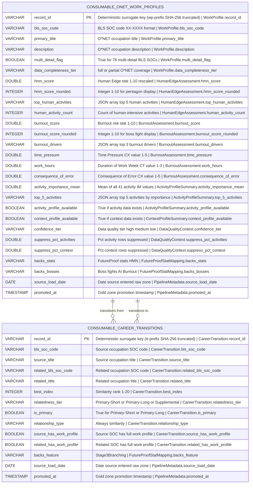

# Physical Model: gold-onet-profiles

**Status:** APPROVED (physical models do not require human approval gate)
**Mode:** Greenfield
**Zone:** Gold (Consumable)
**Domain:** Occupation Work Characteristics and Career Mobility
**Spec:** docs/specs/gold-onet-profiles.md
**Logical Model:** governance/models/gold-onet-profiles-logical.md
**Conceptual Model:** governance/models/gold-onet-profiles-conceptual.md
**EDA Report:** governance/eda/gold-onet-profiles-eda.md
**DQ Rules:** governance/dq-rules/gold-onet-profiles.json
**Author:** @semantic-modeler
**Date:** 2026-04-08
**Approval:** AUTO-APPROVED (Stage 3 physical model proceeds directly to implementation)

---



---

## Table 1: consumable.onet_work_profiles

### Table Definition

| Property | Value |
|----------|-------|
| **Catalog table** | `consumable.onet_work_profiles` |
| **Format** | Apache Iceberg (v2) |
| **Format version** | 2 (supports row-level deletes, merge-on-read) |
| **Engine** | DuckDB (via `iceberg_scan`) |
| **Grain** | One row per occupation (bls_soc_code) |
| **Natural key** | `bls_soc_code` |
| **Surrogate key** | `record_id` (deterministic SHA-256 hash, prefix `wp`) |
| **Expected row count** | 798 (all Silver base.onet_occupations rows carried forward) |
| **Partition strategy** | None (798 rows fits in a single partition; no partition benefit) |
| **Sort order** | `bls_soc_code ASC` |
| **Write pattern** | Full table replace via `brightsmith.infra.promote.promote()` (idempotent) |

### Iceberg Table Properties

| Property | Value | Rationale |
|----------|-------|-----------|
| `write.format.default` | `parquet` | Standard columnar format for analytical queries |
| `write.parquet.compression-codec` | `zstd` | Best compression ratio for this data profile |
| `format-version` | `2` | Required for Brightsmith promote pattern |
| `write.metadata.delete-after-commit.enabled` | `true` | Clean up old metadata files |
| `write.metadata.previous-versions-max` | `10` | Retain 10 snapshots for time-travel queries |

### Sort Order Rationale

Sort order uses `bls_soc_code ASC` (same as the Silver source table) because the primary query patterns are single-occupation lookups by SOC code (Gemma agent queries) and SOC-range scans (major group filtering). SOC codes sort lexicographically by major group (e.g., all 15-XXXX computer occupations cluster together). The 798-row dataset is small enough that sort order has minimal performance impact, but consistency with Silver and the BLS OOH Gold product reduces cognitive overhead.

---

### Column Definitions

#### Occupation Identity (Carried from Silver)

| Column | DuckDB Type | Nullable | Default | Constraint | Business Term | Is CDE | Is PII | Description |
|--------|-------------|----------|---------|------------|---------------|--------|--------|-------------|
| record_id | VARCHAR | NOT NULL | derived | PRIMARY KEY | BT-015 | false | false | Deterministic surrogate key: `compute_grain_id(row, ['bls_soc_code'], prefix='wp')`. Format: `wp-<16 hex chars>`. Stable across pipeline re-runs. |
| bls_soc_code | VARCHAR | NOT NULL | -- | UNIQUE; CHECK (bls_soc_code ~ '^\d{2}-\d{4}$') | BT-027 | true | false | 6-digit BLS SOC code in XX-XXXX format. Natural key. Primary join key to consumable.occupation_profiles. Source: `base.onet_occupations.bls_soc_code`. |
| primary_title | VARCHAR | NOT NULL | -- | -- | BT-028 | false | false | Occupation title from O*NET. Source: `base.onet_occupations.primary_title`. |
| description | VARCHAR | NOT NULL | -- | -- | BT-028 | false | false | Occupation description from O*NET. Source: `base.onet_occupations.description`. |
| multi_detail_flag | BOOLEAN | NOT NULL | -- | -- | BT-063 | false | false | True for 76 BLS SOCs with multiple O*NET detailed codes aggregated. Source: `base.onet_occupations.multi_detail_flag`. |
| data_completeness_tier | VARCHAR | NOT NULL | -- | CHECK (data_completeness_tier IN ('full', 'partial')) | BT-064 | false | false | "full" (774 rows) or "partial" (24 rows). Source: `base.onet_occupations.data_completeness_tier`. Input to confidence_tier derivation. |

#### Human Edge Assessment (Derived)

| Column | DuckDB Type | Nullable | Default | Constraint | Business Term | Is CDE | Is PII | Description |
|--------|-------------|----------|---------|------------|---------------|--------|--------|-------------|
| hmn_score | DOUBLE | NULLABLE | NULL | CHECK (hmn_score IS NULL OR (hmn_score >= 1.0 AND hmn_score <= 10.0)) | BT-066 | true | false | Human Edge stat on 1-10 scale. Uses min/max rescaling of human_ratio (see HMN Score Derivation). Null for 24 partial-data occupations. Backs the HMN pentagon stat. |
| hmn_score_rounded | INTEGER | NULLABLE | NULL | CHECK (hmn_score_rounded IS NULL OR (hmn_score_rounded >= 1 AND hmn_score_rounded <= 10)) | BT-066 | false | false | Integer 1-10 for pentagon display. ROUND(hmn_score). Null if hmn_score is null. |
| top_human_activities | VARCHAR | NULLABLE | NULL | -- | BT-067 | false | false | JSON array of top 5 human-intensive activities by importance. Format: `[{"activity": "name", "importance": 4.5}, ...]`. Null if no activity profile. |
| human_activity_count | INTEGER | NULLABLE | NULL | CHECK (human_activity_count IS NULL OR (human_activity_count >= 0 AND human_activity_count <= 14)) | BT-067 | false | false | Count of the 14 human-intensive activities with data for this occupation. Always 14 when data present. Null if no activity profile. |

#### Burnout Assessment (Derived)

| Column | DuckDB Type | Nullable | Default | Constraint | Business Term | Is CDE | Is PII | Description |
|--------|-------------|----------|---------|------------|---------------|--------|--------|-------------|
| burnout_score | DOUBLE | NULLABLE | NULL | CHECK (burnout_score IS NULL OR (burnout_score >= 1.0 AND burnout_score <= 10.0)) | BT-068 | true | false | Burnout risk on 1-10 scale. Normalized average of 9 burnout elements mapped to 1-10 (see Burnout Score Derivation). Higher = more burnout risk. Null for 24 partial-data occupations. Backs the Burnout boss fight. |
| burnout_score_rounded | INTEGER | NULLABLE | NULL | CHECK (burnout_score_rounded IS NULL OR (burnout_score_rounded >= 1 AND burnout_score_rounded <= 10)) | BT-068 | false | false | Integer 1-10 for boss fight display. ROUND(burnout_score). Null if burnout_score is null. |
| burnout_drivers | VARCHAR | NULLABLE | NULL | -- | BT-069 | true | false | JSON array of top 3 burnout-contributing elements. Format: `[{"element": "name", "value": 0.85}, ...]`. Null when burnout_score is null. |
| time_pressure | DOUBLE | NULLABLE | NULL | CHECK (time_pressure IS NULL OR (time_pressure >= 1.0 AND time_pressure <= 5.0)) | BT-059 | false | false | Time Pressure (CX scale, 1-5). Direct from Silver context profile for element 4.C.3.d.1. Null if no context profile. |
| work_hours | DOUBLE | NULLABLE | NULL | CHECK (work_hours IS NULL OR (work_hours >= 1.0 AND work_hours <= 3.0)) | BT-059 | false | false | Duration of Typical Work Week (CT scale, 1-3, where 3 = ">40 hrs"). Direct from Silver for element 4.C.3.d.8. Null if no context profile. |
| consequence_of_error | DOUBLE | NULLABLE | NULL | CHECK (consequence_of_error IS NULL OR (consequence_of_error >= 1.0 AND consequence_of_error <= 5.0)) | BT-059 | false | false | Consequence of Error (CX scale, 1-5). Direct from Silver for element 4.C.3.a.1. Null if no context profile. |

#### Activity Profile Summary (Derived)

| Column | DuckDB Type | Nullable | Default | Constraint | Business Term | Is CDE | Is PII | Description |
|--------|-------------|----------|---------|------------|---------------|--------|--------|-------------|
| activity_importance_mean | DOUBLE | NULLABLE | NULL | CHECK (activity_importance_mean IS NULL OR (activity_importance_mean >= 1.0 AND activity_importance_mean <= 5.0)) | BT-072 | false | false | Arithmetic mean of all 41 IM importance values. Measures overall activity intensity. Null when no activity profile. |
| top_5_activities | VARCHAR | NULLABLE | NULL | -- | BT-057 | false | false | JSON array of 5 highest-importance activities. Format: `[{"activity": "name", "importance": 4.2}, ...]`. Null if no activity profile. |
| activity_profile_available | BOOLEAN | NOT NULL | -- | -- | BT-064 | false | false | True if base.onet_activity_profiles has rows for this SOC. False for 24 partial-data occupations. |

#### Context Profile Summary (Derived)

| Column | DuckDB Type | Nullable | Default | Constraint | Business Term | Is CDE | Is PII | Description |
|--------|-------------|----------|---------|------------|---------------|--------|--------|-------------|
| context_profile_available | BOOLEAN | NOT NULL | -- | -- | BT-064 | false | false | True if base.onet_context_profiles has rows for this SOC. False for 24 partial-data occupations. |

#### Data Quality Context (Derived)

| Column | DuckDB Type | Nullable | Default | Constraint | Business Term | Is CDE | Is PII | Description |
|--------|-------------|----------|---------|------------|---------------|--------|--------|-------------|
| confidence_tier | VARCHAR | NOT NULL | -- | CHECK (confidence_tier IN ('high', 'medium', 'low')) | BT-071 | false | false | Three-level quality classification. Expected: 772 high, 2 medium, 24 low. Every row receives a tier. |
| suppress_pct_activities | DOUBLE | NULLABLE | NULL | CHECK (suppress_pct_activities IS NULL OR (suppress_pct_activities >= 0.0 AND suppress_pct_activities <= 100.0)) | BT-062 | false | false | Percentage of activity profile rows with suppress_flag = True. Null if no activity profile (24 rows). |
| suppress_pct_context | DOUBLE | NULLABLE | NULL | CHECK (suppress_pct_context IS NULL OR (suppress_pct_context >= 0.0 AND suppress_pct_context <= 100.0)) | BT-062 | false | false | Percentage of context profile rows with suppress_flag = True. Null if no context profile (24 rows). |

#### FutureProof Stat Mapping (Static)

| Column | DuckDB Type | Nullable | Default | Constraint | Business Term | Is CDE | Is PII | Description |
|--------|-------------|----------|---------|------------|---------------|--------|--------|-------------|
| backs_stats | VARCHAR | NOT NULL | -- | CHECK (backs_stats = 'HMN') | BT-054 | false | false | FutureProof pentagon stats this table feeds. Always "HMN" for all 798 rows. |
| backs_bosses | VARCHAR | NOT NULL | -- | CHECK (backs_bosses = 'AI,Burnout') | BT-054 | false | false | Boss fights this table feeds. Always "AI,Burnout" for all 798 rows. |

#### Pipeline Metadata

| Column | DuckDB Type | Nullable | Default | Constraint | Business Term | Is CDE | Is PII | Description |
|--------|-------------|----------|---------|------------|---------------|--------|--------|-------------|
| source_load_date | DATE | NOT NULL | -- | -- | BT-016 | false | false | Date the source data was loaded into the raw zone. Source: `base.onet_occupations.source_load_date`. |
| promoted_at | TIMESTAMP | NOT NULL | -- | -- | BT-026 | false | false | Timestamp when the row was promoted to Gold. Generated at promotion time via `datetime.now(tz=datetime.timezone.utc)`. |

---

### Column Summary (Table 1)

| Count | Category |
|-------|----------|
| 27 | Total columns |
| 1 | Primary key (record_id) |
| 1 | Natural key component (bls_soc_code) |
| 3 | CDE columns (bls_soc_code, hmn_score, burnout_score) |
| 1 | CDE column (burnout_drivers) |
| 0 | PII columns |
| 14 | Nullable columns |
| 13 | NOT NULL columns |
| 2 | Pipeline metadata (source_load_date carried, promoted_at new) |

---

## Table 2: consumable.career_transitions

### Table Definition

| Property | Value |
|----------|-------|
| **Catalog table** | `consumable.career_transitions` |
| **Format** | Apache Iceberg (v2) |
| **Format version** | 2 |
| **Engine** | DuckDB (via `iceberg_scan`) |
| **Grain** | One row per occupation pair (bls_soc_code x related_bls_soc_code) |
| **Natural key** | `bls_soc_code`, `related_bls_soc_code` |
| **Surrogate key** | `record_id` (deterministic SHA-256 hash, prefix `tr`) |
| **Expected row count** | 15,944 (carried from Silver, enriched) |
| **Partition strategy** | None (15,944 rows does not benefit from partitioning) |
| **Sort order** | `bls_soc_code ASC, best_index ASC` |
| **Write pattern** | Full table replace via `brightsmith.infra.promote.promote()` (idempotent) |

### Iceberg Table Properties

Same as Table 1.

### Sort Order Rationale

Sort by `bls_soc_code ASC, best_index ASC` so that queries for "given occupation X, show related careers ranked by similarity" scan contiguous rows. This is the primary access pattern for Stage 3 branching.

---

### Column Definitions

#### Career Transition Identity (Carried + Enriched)

| Column | DuckDB Type | Nullable | Default | Constraint | Business Term | Is CDE | Is PII | Description |
|--------|-------------|----------|---------|------------|---------------|--------|--------|-------------|
| record_id | VARCHAR | NOT NULL | derived | PRIMARY KEY | BT-015 | false | false | Deterministic surrogate key: `compute_grain_id(row, ['bls_soc_code', 'related_bls_soc_code'], prefix='tr')`. Format: `tr-<16 hex chars>`. |
| bls_soc_code | VARCHAR | NOT NULL | -- | CHECK (bls_soc_code ~ '^\d{2}-\d{4}$') | BT-027 | true | false | Source occupation SOC code. Part of composite natural key. Source: `base.onet_career_transitions.bls_soc_code`. |
| source_title | VARCHAR | NOT NULL | -- | -- | BT-028 | false | false | Source occupation title. Enriched by joining base.onet_occupations on bls_soc_code. |
| related_bls_soc_code | VARCHAR | NOT NULL | -- | CHECK (related_bls_soc_code ~ '^\d{2}-\d{4}$') | BT-027 | true | false | Related occupation SOC code. Part of composite natural key. Source: `base.onet_career_transitions.related_bls_soc_code`. |
| related_title | VARCHAR | NOT NULL | -- | -- | BT-028 | false | false | Related occupation title. Enriched by joining base.onet_occupations on related_bls_soc_code. |

#### Similarity Classification (Carried from Silver)

| Column | DuckDB Type | Nullable | Default | Constraint | Business Term | Is CDE | Is PII | Description |
|--------|-------------|----------|---------|------------|---------------|--------|--------|-------------|
| best_index | INTEGER | NOT NULL | -- | CHECK (best_index >= 1 AND best_index <= 20) | BT-061 | false | false | Similarity rank (1 = most similar). Source: `base.onet_career_transitions.best_index`. |
| relatedness_tier | VARCHAR | NOT NULL | -- | CHECK (relatedness_tier IN ('Primary-Short', 'Primary-Long', 'Supplemental')) | BT-061 | false | false | Three-level classification. Source: `base.onet_career_transitions.relatedness_tier`. |
| is_primary | BOOLEAN | NOT NULL | -- | -- | BT-061 | false | false | True for Primary-Short or Primary-Long. Source: `base.onet_career_transitions.is_primary`. |
| relationship_type | VARCHAR | NOT NULL | -- | CHECK (relationship_type = 'similarity') | BT-060 | false | false | Always "similarity". Source: `base.onet_career_transitions.relationship_type`. |

#### Work Profile Availability (Derived)

| Column | DuckDB Type | Nullable | Default | Constraint | Business Term | Is CDE | Is PII | Description |
|--------|-------------|----------|---------|------------|---------------|--------|--------|-------------|
| source_has_work_profile | BOOLEAN | NOT NULL | -- | -- | BT-070 | false | false | True if bls_soc_code exists in consumable.onet_work_profiles with activity_profile_available = True. Cross-table lookup. |
| related_has_work_profile | BOOLEAN | NOT NULL | -- | -- | BT-070 | false | false | True if related_bls_soc_code exists in consumable.onet_work_profiles with activity_profile_available = True. Cross-table lookup. |

#### FutureProof Stat Mapping (Static)

| Column | DuckDB Type | Nullable | Default | Constraint | Business Term | Is CDE | Is PII | Description |
|--------|-------------|----------|---------|------------|---------------|--------|--------|-------------|
| backs_feature | VARCHAR | NOT NULL | -- | CHECK (backs_feature = 'Stage3Branching') | BT-054 | false | false | FutureProof feature backed by this data. Always "Stage3Branching" for all 15,944 rows. |

#### Pipeline Metadata

| Column | DuckDB Type | Nullable | Default | Constraint | Business Term | Is CDE | Is PII | Description |
|--------|-------------|----------|---------|------------|---------------|--------|--------|-------------|
| source_load_date | DATE | NOT NULL | -- | -- | BT-016 | false | false | Date the source data was loaded into the raw zone. Source: `base.onet_career_transitions.source_load_date`. |
| promoted_at | TIMESTAMP | NOT NULL | -- | -- | BT-026 | false | false | Timestamp when the row was promoted to Gold. Generated at promotion time. |

---

### Column Summary (Table 2)

| Count | Category |
|-------|----------|
| 14 | Total columns |
| 1 | Primary key (record_id) |
| 2 | Natural key components (bls_soc_code, related_bls_soc_code) |
| 2 | CDE columns (bls_soc_code, related_bls_soc_code) |
| 0 | PII columns |
| 0 | Nullable columns |
| 14 | NOT NULL columns |
| 2 | Pipeline metadata |

---

## PyIceberg Schema Definitions

### Table 1: consumable.onet_work_profiles (27 columns)

```python
from pyiceberg.schema import Schema
from pyiceberg.types import (
    BooleanType,
    DateType,
    DoubleType,
    IntegerType,
    NestedField,
    StringType,
    TimestampType,
)

WORK_PROFILES_SCHEMA = Schema(
    # Occupation Identity (Carried from Silver)
    NestedField(1, "record_id", StringType(), required=True),
    NestedField(2, "bls_soc_code", StringType(), required=True),
    NestedField(3, "primary_title", StringType(), required=True),
    NestedField(4, "description", StringType(), required=True),
    NestedField(5, "multi_detail_flag", BooleanType(), required=True),
    NestedField(6, "data_completeness_tier", StringType(), required=True),
    # Human Edge Assessment (Derived)
    NestedField(7, "hmn_score", DoubleType(), required=False),
    NestedField(8, "hmn_score_rounded", IntegerType(), required=False),
    NestedField(9, "top_human_activities", StringType(), required=False),
    NestedField(10, "human_activity_count", IntegerType(), required=False),
    # Burnout Assessment (Derived)
    NestedField(11, "burnout_score", DoubleType(), required=False),
    NestedField(12, "burnout_score_rounded", IntegerType(), required=False),
    NestedField(13, "burnout_drivers", StringType(), required=False),
    NestedField(14, "time_pressure", DoubleType(), required=False),
    NestedField(15, "work_hours", DoubleType(), required=False),
    NestedField(16, "consequence_of_error", DoubleType(), required=False),
    # Activity Profile Summary (Derived)
    NestedField(17, "activity_importance_mean", DoubleType(), required=False),
    NestedField(18, "top_5_activities", StringType(), required=False),
    NestedField(19, "activity_profile_available", BooleanType(), required=True),
    # Context Profile Summary (Derived)
    NestedField(20, "context_profile_available", BooleanType(), required=True),
    # Data Quality Context (Derived)
    NestedField(21, "confidence_tier", StringType(), required=True),
    NestedField(22, "suppress_pct_activities", DoubleType(), required=False),
    NestedField(23, "suppress_pct_context", DoubleType(), required=False),
    # FutureProof Stat Mapping (Static)
    NestedField(24, "backs_stats", StringType(), required=True),
    NestedField(25, "backs_bosses", StringType(), required=True),
    # Pipeline Metadata
    NestedField(26, "source_load_date", DateType(), required=True),
    NestedField(27, "promoted_at", TimestampType(), required=True),
)
```

### Table 2: consumable.career_transitions (14 columns)

```python
CAREER_TRANSITIONS_SCHEMA = Schema(
    # Career Transition Identity (Carried + Enriched)
    NestedField(1, "record_id", StringType(), required=True),
    NestedField(2, "bls_soc_code", StringType(), required=True),
    NestedField(3, "source_title", StringType(), required=True),
    NestedField(4, "related_bls_soc_code", StringType(), required=True),
    NestedField(5, "related_title", StringType(), required=True),
    # Similarity Classification (Carried from Silver)
    NestedField(6, "best_index", IntegerType(), required=True),
    NestedField(7, "relatedness_tier", StringType(), required=True),
    NestedField(8, "is_primary", BooleanType(), required=True),
    NestedField(9, "relationship_type", StringType(), required=True),
    # Work Profile Availability (Derived)
    NestedField(10, "source_has_work_profile", BooleanType(), required=True),
    NestedField(11, "related_has_work_profile", BooleanType(), required=True),
    # FutureProof Stat Mapping (Static)
    NestedField(12, "backs_feature", StringType(), required=True),
    # Pipeline Metadata
    NestedField(13, "source_load_date", DateType(), required=True),
    NestedField(14, "promoted_at", TimestampType(), required=True),
)
```

---

## Score Derivation Rules (Implementation Specifications)

### HMN Score Derivation (UPDATED: Min/Max Rescaling)

The EDA found that the original ratio-based formula (`1.0 + 9.0 * human_ratio`) produces a compressed range of 3.46-4.94, which is unusable for a 1-10 pentagon stat. The approved design change uses min/max rescaling to fill the full 1-10 range.

**Step 1: Classify activities (static, same for all occupations)**

14 of the 41 Generalized Work Activities are classified as "human-intensive." The implementation MUST use the **EDA-corrected element IDs** below (13 of 14 IDs from the original spec were wrong):

| Correct Element ID | Activity Name | Category |
|-------------------|--------------|----------|
| 4.A.4.b.4 | Guiding, Directing, and Motivating Subordinates | Leadership |
| 4.A.4.b.5 | Coaching and Developing Others | Mentorship |
| 4.A.4.a.7 | Resolving Conflicts and Negotiating with Others | Judgment |
| 4.A.4.a.8 | Performing for or Working Directly with the Public | Physical/Social |
| 4.A.4.a.4 | Establishing and Maintaining Interpersonal Relationships | Relationship |
| 4.A.4.b.2 | Developing and Building Teams | Leadership |
| 4.A.4.b.3 | Training and Teaching Others | Interpersonal |
| 4.A.4.a.6 | Selling or Influencing Others | Persuasion |
| 4.A.4.b.1 | Coordinating the Work and Activities of Others | Coordination |
| 4.A.2.b.2 | Thinking Creatively | Creativity |
| 4.A.2.b.1 | Making Decisions and Solving Problems | Judgment |
| 4.A.3.a.1 | Performing General Physical Activities | Physical |
| 4.A.3.a.2 | Handling and Moving Objects | Physical |
| 4.A.4.a.5 | Assisting and Caring for Others | Empathy |

**Implementation constant:**

```python
HUMAN_INTENSIVE_ELEMENT_IDS = [
    "4.A.4.b.4",  # Guiding, Directing, and Motivating Subordinates
    "4.A.4.b.5",  # Coaching and Developing Others
    "4.A.4.a.7",  # Resolving Conflicts and Negotiating with Others
    "4.A.4.a.8",  # Performing for or Working Directly with the Public
    "4.A.4.a.4",  # Establishing and Maintaining Interpersonal Relationships
    "4.A.4.b.2",  # Developing and Building Teams
    "4.A.4.b.3",  # Training and Teaching Others
    "4.A.4.a.6",  # Selling or Influencing Others
    "4.A.4.b.1",  # Coordinating the Work and Activities of Others
    "4.A.2.b.2",  # Thinking Creatively
    "4.A.2.b.1",  # Making Decisions and Solving Problems
    "4.A.3.a.1",  # Performing General Physical Activities
    "4.A.3.a.2",  # Handling and Moving Objects
    "4.A.4.a.5",  # Assisting and Caring for Others
]
```

**Step 2: Compute importance sums (per occupation)**

```python
human_importance_sum = sum(importance for activity in activities if activity.element_id in HUMAN_INTENSIVE_ELEMENT_IDS)
total_importance_sum = sum(importance for activity in activities)  # all 41
human_ratio = human_importance_sum / total_importance_sum
```

**Step 3: Compute observed min/max across all occupations**

```python
observed_min = min(human_ratio for all scored occupations)  # EDA: ~0.273
observed_max = max(human_ratio for all scored occupations)  # EDA: ~0.438
```

**Step 4: Min/max rescale to 1-10, clamped**

```python
hmn_score = 1.0 + 9.0 * (human_ratio - observed_min) / (observed_max - observed_min)
hmn_score = max(1.0, min(10.0, hmn_score))  # clamp to [1.0, 10.0]
```

**EDA-validated expected output:**
- Pre-rescale range: 3.46-4.94 (compressed, unusable)
- Post-rescale range: 1.0-10.0 (full spread)
- Post-rescale std dev: expected > 1.0 (DQ rule GLD-ONP-010)
- Null for 24 partial-data occupations

**Why min/max rescaling:** The ratio-based approach is analytically sound (it measures what fraction of important work is human), but the structural composition of activities (14 of 41 = 34.1% human-intensive) means ratios cluster near 0.27-0.44. Rescaling preserves the relative ordering while producing meaningful differentiation on the 1-10 display scale.

### Burnout Score Derivation (Unchanged)

**Step 1: Identify the 9 burnout elements**

Use `is_burnout_element = true` from Silver context profiles (do NOT hardcode element names, which have documentation errors):

| Element ID | Scale | Range |
|-----------|-------|-------|
| 4.C.3.d.1 | CX | 1-5 |
| 4.C.3.d.8 | CT | 1-3 |
| 4.C.3.a.1 | CX | 1-5 |
| 4.C.3.d.3 | CX | 1-5 |
| 4.C.3.a.2.b | CX | 1-5 |
| 4.C.3.b.4 | CX | 1-5 |
| 4.C.3.b.7 | CX | 1-5 |
| 4.C.3.d.4 | CT | 1-3 |
| 4.C.3.a.2.a | CX | 1-5 |

**Step 2: Normalize each to 0-1**

```python
if scale_id == "CX":
    normalized = (value - 1.0) / 4.0
elif scale_id == "CT":
    normalized = (value - 1.0) / 2.0
```

**Step 3: Compute score**

```python
burnout_score = 1.0 + 9.0 * mean(normalized_values)  # equal weighting
```

**EDA-validated expected output:**
- Range: 3.48-8.32 (healthy spread, no rescaling needed)
- Std dev: 0.778 (> 0.5 DQ threshold)
- Null for 24 partial-data occupations

### Confidence Tier Derivation

Evaluated top-to-bottom; first matching condition wins:

| Tier | Condition |
|------|-----------|
| "low" | data_completeness_tier = "partial" |
| "medium" | data_completeness_tier = "full" AND (suppress_pct_activities >= 5.0 OR suppress_pct_context >= 5.0) |
| "high" | data_completeness_tier = "full" AND suppress_pct_activities < 5.0 AND suppress_pct_context < 5.0 |

**Expected distribution:** 772 high, 2 medium (SOC 29-1241 Ophthalmologists at 10.5% context suppression, SOC 51-2061 at 5.26% context suppression), 24 low.

### Individual Burnout Element Extraction

Direct pivot from Silver context profiles:

| Column | Element ID | Scale |
|--------|-----------|-------|
| time_pressure | 4.C.3.d.1 | CX (1-5) |
| work_hours | 4.C.3.d.8 | CT (1-3) |
| consequence_of_error | 4.C.3.a.1 | CX (1-5) |

### JSON Array Formats

**top_human_activities** (top 5 by importance from the 14 human-intensive activities):
```json
[
  {"activity": "Making Decisions and Solving Problems", "importance": 4.31},
  {"activity": "Thinking Creatively", "importance": 3.87},
  {"activity": "Establishing and Maintaining Interpersonal Relationships", "importance": 3.65},
  {"activity": "Coordinating the Work and Activities of Others", "importance": 3.52},
  {"activity": "Training and Teaching Others", "importance": 3.21}
]
```

**top_5_activities** (top 5 by importance from all 41 activities):
```json
[
  {"activity": "Getting Information", "importance": 4.50},
  {"activity": "Making Decisions and Solving Problems", "importance": 4.31},
  {"activity": "Communicating with Supervisors, Peers, or Subordinates", "importance": 4.12},
  {"activity": "Updating and Using Relevant Knowledge", "importance": 3.95},
  {"activity": "Thinking Creatively", "importance": 3.87}
]
```

**burnout_drivers** (top 3 by normalized value from 9 burnout elements):
```json
[
  {"element": "Time Pressure", "value": 0.85},
  {"element": "Frequency of Decision Making", "value": 0.78},
  {"element": "Duration of Typical Work Week", "value": 0.72}
]
```

---

## Nullability Semantics

### Table 1: consumable.onet_work_profiles

| Pattern | Business Meaning | Count |
|---------|-----------------|-------|
| hmn_score IS NULL | Partial-data occupation, no activity profile | 24 |
| burnout_score IS NULL | Partial-data occupation, no context profile | 24 |
| All 14 nullable columns NULL together | Same 24 partial-data occupations lack ALL profile data | 24 |

**Key invariant:** The same 24 partial-data occupations have ALL nullable fields as null. There is no occupation with activity data but not context data (or vice versa) in O*NET 30.2. confidence_tier = "low" if and only if data_completeness_tier = "partial".

### Table 2: consumable.career_transitions

All 14 columns are NOT NULL. No nullable fields in this table.

---

## Implementation Guide for @primary-agent

### Module Structure

| Module | Table | Function | Grain |
|--------|-------|----------|-------|
| `src/gold/onet_work_profiles.py` | consumable.onet_work_profiles | `transform()` | bls_soc_code |
| `src/gold/onet_career_transitions.py` | consumable.career_transitions | `transform()` | bls_soc_code x related_bls_soc_code |

**Build order:** `onet_work_profiles.py` MUST run before `onet_career_transitions.py` (Table 2 cross-references Table 1 for has_work_profile flags).

### Function Signatures

```python
# src/gold/onet_work_profiles.py
def transform(project_dir: str | Path | None = None) -> dict:
    """Gold zone transformer for consumable.onet_work_profiles.

    Reads base.onet_occupations, base.onet_activity_profiles, and
    base.onet_context_profiles from Silver. Pivots activity/context
    rows into one row per occupation with HMN score (min/max rescaled),
    Burnout score, JSON summaries, and confidence tier. Promotes to
    consumable.onet_work_profiles.

    Returns:
        {"rows_read": N, "rows_derived": N, "promoted": N, "skipped": N}
    """

# src/gold/onet_career_transitions.py
def transform(project_dir: str | Path | None = None) -> dict:
    """Gold zone transformer for consumable.career_transitions.

    Reads base.onet_career_transitions and base.onet_occupations from
    Silver, plus consumable.onet_work_profiles from Gold. Enriches
    transitions with titles and work profile availability flags.
    Promotes to consumable.career_transitions.

    Returns:
        {"rows_read": N, "rows_derived": N, "promoted": N, "skipped": N}
    """
```

### Constants

```python
# src/gold/onet_work_profiles.py

SPEC_NAME = "gold-onet-profiles"
GRAIN_FIELDS = ["bls_soc_code"]
GRAIN_PREFIX = "wp"

HUMAN_INTENSIVE_ELEMENT_IDS = [
    "4.A.4.b.4",  # Guiding, Directing, and Motivating Subordinates
    "4.A.4.b.5",  # Coaching and Developing Others
    "4.A.4.a.7",  # Resolving Conflicts and Negotiating with Others
    "4.A.4.a.8",  # Performing for or Working Directly with the Public
    "4.A.4.a.4",  # Establishing and Maintaining Interpersonal Relationships
    "4.A.4.b.2",  # Developing and Building Teams
    "4.A.4.b.3",  # Training and Teaching Others
    "4.A.4.a.6",  # Selling or Influencing Others
    "4.A.4.b.1",  # Coordinating the Work and Activities of Others
    "4.A.2.b.2",  # Thinking Creatively
    "4.A.2.b.1",  # Making Decisions and Solving Problems
    "4.A.3.a.1",  # Performing General Physical Activities
    "4.A.3.a.2",  # Handling and Moving Objects
    "4.A.4.a.5",  # Assisting and Caring for Others
]

# Burnout elements identified by is_burnout_element flag in Silver,
# but listed here for documentation. Use the flag, not this list.
BURNOUT_ELEMENT_IDS = [
    "4.C.3.d.1",   # Time Pressure (CX)
    "4.C.3.d.8",   # Duration of Typical Work Week (CT)
    "4.C.3.a.1",   # Consequence of Error (CX)
    "4.C.3.d.3",   # Pace Determined by Speed of Equipment (CX)
    "4.C.3.a.2.b", # Frequency of Decision Making (CX)
    "4.C.3.b.4",   # Importance of Being Exact or Accurate (CX)
    "4.C.3.b.7",   # Importance of Repeating Same Tasks (CX)
    "4.C.3.d.4",   # Work Schedules (CT)
    "4.C.3.a.2.a", # Impact of Decisions on Co-workers (CX)
]
```

```python
# src/gold/onet_career_transitions.py

SPEC_NAME = "gold-onet-profiles"
GRAIN_FIELDS = ["bls_soc_code", "related_bls_soc_code"]
GRAIN_PREFIX = "tr"
```

### Transformation Algorithm (Table 1: onet_work_profiles)

```
1. Read base.onet_occupations (798 rows)
2. Read base.onet_activity_profiles (31,734 rows)
3. Read base.onet_context_profiles (44,118 rows)

4. For each bls_soc_code in occupations:
   a. Get activity rows for this SOC (41 rows, or 0 if partial)
   b. Get context rows for this SOC (57 rows, or 0 if partial)

   c. If activity data present:
      - Compute human_importance_sum, total_importance_sum, human_ratio
      - Compute activity_importance_mean = mean(all 41 importance values)
      - Build top_5_activities JSON (top 5 by importance)
      - Build top_human_activities JSON (top 5 from human-intensive by importance)
      - Set human_activity_count = count of human-intensive element_ids present
      - Set activity_profile_available = True
      - Compute suppress_pct_activities

   d. If context data present:
      - Filter to burnout elements (is_burnout_element = true)
      - Normalize each (CX: (v-1)/4, CT: (v-1)/2)
      - Compute burnout_score = 1.0 + 9.0 * mean(normalized)
      - Build burnout_drivers JSON (top 3 by normalized value)
      - Extract time_pressure, work_hours, consequence_of_error
      - Set context_profile_available = True
      - Compute suppress_pct_context

5. After processing all occupations:
   - Compute observed_min and observed_max of human_ratio across all scored occupations
   - For each scored occupation: hmn_score = 1.0 + 9.0 * (human_ratio - observed_min) / (observed_max - observed_min)
   - Clamp hmn_score to [1.0, 10.0]
   - Compute hmn_score_rounded = round(hmn_score)
   - Compute burnout_score_rounded = round(burnout_score)

6. Compute confidence_tier for each row

7. Set static fields: backs_stats = "HMN", backs_bosses = "AI,Burnout"

8. Compute record_id via compute_grain_id(row, ['bls_soc_code'], prefix='wp')
9. Set promoted_at = current UTC timestamp
10. Promote to consumable.onet_work_profiles
```

**Critical note on HMN score:** Steps 4c and 5 are sequential. You must compute ALL human_ratios first (step 4c), then find min/max across the cohort (step 5), then rescale. Do NOT compute hmn_score inside the per-occupation loop.

### Transformation Algorithm (Table 2: career_transitions)

```
1. Read base.onet_career_transitions (15,944 rows)
2. Read base.onet_occupations (798 rows) -- for title lookup
3. Read consumable.onet_work_profiles (798 rows) -- for has_work_profile flags

4. Build lookup: bls_soc_code -> primary_title (from occupations)
5. Build lookup: bls_soc_code -> activity_profile_available (from work_profiles)

6. For each career transition row:
   a. Enrich source_title from occupations lookup
   b. Enrich related_title from occupations lookup
   c. Set source_has_work_profile = lookup[bls_soc_code] (default False)
   d. Set related_has_work_profile = lookup[related_bls_soc_code] (default False)
   e. Set backs_feature = "Stage3Branching"

7. Compute record_id via compute_grain_id(row, ['bls_soc_code', 'related_bls_soc_code'], prefix='tr')
8. Set promoted_at = current UTC timestamp
9. Promote to consumable.career_transitions
```

### Promote Pattern

Both tables follow the established Brightsmith promote pattern (see `src/gold/bls_ooh_occupation_profiles.py` for reference):

```python
from brightsmith.infra.grain import compute_grain_id
from brightsmith.infra.iceberg_setup import get_catalog, get_or_create_table
from brightsmith.infra.promote import promote

# ...
gold_catalog = get_catalog(gold_warehouse, catalog_path)
gold_table = get_or_create_table(
    gold_catalog, "consumable", "onet_work_profiles", get_gold_schema()
)
result = promote(
    gold_table,
    gold_rows,
    id_field="record_id",
    spec_name=SPEC_NAME,
    agent_name="@primary-agent",
)
```

---

## Dropped Fields (from Silver, with justification)

### From base.onet_occupations

| Silver Attribute | Dropped? | Justification |
|-----------------|----------|---------------|
| record_id (prefix 'on') | Recomputed | Prefix changes from Silver's 'on' to Gold's 'wp'. |
| onet_soc_codes | Dropped | O*NET detail codes not needed by Gold consumers. |
| detail_count | Dropped | Subsumed by multi_detail_flag boolean. |
| ingested_at | Dropped | Silver metadata replaced by promoted_at in Gold. |

### From base.onet_activity_profiles / base.onet_context_profiles

Pivoted (many-to-one aggregation) -- 41+57 rows per occupation collapsed into one row:

| Silver Attribute | Gold Disposition |
|-----------------|-----------------|
| element_id | Used as filter/group key during pivot. Not persisted. |
| element_name | Used for JSON array content. Not a standalone Gold field. |
| importance_value | Aggregated into hmn_score, activity_importance_mean, top_5_activities. |
| importance_rank | Used for top-5 ranking. Not persisted separately. |
| context_value | Aggregated into burnout_score, individual elements. |
| scale_id | Used for normalization logic (CX vs CT). Not persisted. |
| suppress_flag | Aggregated into suppress_pct_activities / suppress_pct_context. |
| is_burnout_element | Used as element filter. Not persisted. |
| ingested_at | Replaced by promoted_at. |

### From base.onet_career_transitions

| Silver Attribute | Dropped? | Justification |
|-----------------|----------|---------------|
| record_id (prefix 'on') | Recomputed | Prefix changes to 'tr'. |
| ingested_at | Dropped | Replaced by promoted_at. |

---

## Traceability: Logical to Physical

### Table 1: consumable.onet_work_profiles

| Logical Entity | Logical Attribute | Physical Column | Physical Type | Mapping Notes |
|---------------|-------------------|-----------------|---------------|---------------|
| Work Profile | record_id | record_id | VARCHAR | Prefix changes to 'wp' |
| Work Profile | bls_soc_code | bls_soc_code | VARCHAR | Verbatim |
| Work Profile | primary_title | primary_title | VARCHAR | Verbatim |
| Work Profile | description | description | VARCHAR | Verbatim |
| Work Profile | multi_detail_flag | multi_detail_flag | BOOLEAN | Verbatim |
| Work Profile | data_completeness_tier | data_completeness_tier | VARCHAR | Verbatim |
| Human Edge Assessment | hmn_score | hmn_score | DOUBLE | numeric -> DOUBLE |
| Human Edge Assessment | hmn_score_rounded | hmn_score_rounded | INTEGER | numeric -> INTEGER |
| Human Edge Assessment | top_human_activities | top_human_activities | VARCHAR | text -> VARCHAR (JSON) |
| Human Edge Assessment | human_activity_count | human_activity_count | INTEGER | numeric -> INTEGER |
| Burnout Assessment | burnout_score | burnout_score | DOUBLE | numeric -> DOUBLE |
| Burnout Assessment | burnout_score_rounded | burnout_score_rounded | INTEGER | numeric -> INTEGER |
| Burnout Assessment | burnout_drivers | burnout_drivers | VARCHAR | text -> VARCHAR (JSON) |
| Burnout Assessment | time_pressure | time_pressure | DOUBLE | numeric -> DOUBLE |
| Burnout Assessment | work_hours | work_hours | DOUBLE | numeric -> DOUBLE |
| Burnout Assessment | consequence_of_error | consequence_of_error | DOUBLE | numeric -> DOUBLE |
| Activity Profile Summary | activity_importance_mean | activity_importance_mean | DOUBLE | numeric -> DOUBLE |
| Activity Profile Summary | top_5_activities | top_5_activities | VARCHAR | text -> VARCHAR (JSON) |
| Activity Profile Summary | activity_profile_available | activity_profile_available | BOOLEAN | Verbatim |
| Context Profile Summary | context_profile_available | context_profile_available | BOOLEAN | Verbatim |
| Data Quality Context | confidence_tier | confidence_tier | VARCHAR | text -> VARCHAR |
| Data Quality Context | suppress_pct_activities | suppress_pct_activities | DOUBLE | numeric -> DOUBLE |
| Data Quality Context | suppress_pct_context | suppress_pct_context | DOUBLE | numeric -> DOUBLE |
| FutureProof Stat Mapping | backs_stats | backs_stats | VARCHAR | text -> VARCHAR |
| FutureProof Stat Mapping | backs_bosses | backs_bosses | VARCHAR | text -> VARCHAR |
| Pipeline Metadata | source_load_date | source_load_date | DATE | date -> DATE |
| Pipeline Metadata | promoted_at | promoted_at | TIMESTAMP | timestamp -> TIMESTAMP |

### Table 2: consumable.career_transitions

| Logical Entity | Logical Attribute | Physical Column | Physical Type |
|---------------|-------------------|-----------------|---------------|
| Career Transition | record_id | record_id | VARCHAR |
| Career Transition | bls_soc_code | bls_soc_code | VARCHAR |
| Career Transition | source_title | source_title | VARCHAR |
| Career Transition | related_bls_soc_code | related_bls_soc_code | VARCHAR |
| Career Transition | related_title | related_title | VARCHAR |
| Career Transition | best_index | best_index | INTEGER |
| Career Transition | relatedness_tier | relatedness_tier | VARCHAR |
| Career Transition | is_primary | is_primary | BOOLEAN |
| Career Transition | relationship_type | relationship_type | VARCHAR |
| Career Transition | source_has_work_profile | source_has_work_profile | BOOLEAN |
| Career Transition | related_has_work_profile | related_has_work_profile | BOOLEAN |
| FutureProof Stat Mapping | backs_feature | backs_feature | VARCHAR |
| Pipeline Metadata | source_load_date | source_load_date | DATE |
| Pipeline Metadata | promoted_at | promoted_at | TIMESTAMP |

---

## DQ Rule Alignment

This physical model is designed to satisfy all 30+ DQ rules in `governance/dq-rules/gold-onet-profiles.json`. Key alignments:

| DQ Rule | Physical Constraint |
|---------|-------------------|
| GLD-ONP-001 (grain uniqueness) | bls_soc_code UNIQUE on Table 1 |
| GLD-ONP-003 (row count 798) | 1:1 carry from base.onet_occupations |
| GLD-ONP-004 (SOC format) | CHECK (bls_soc_code ~ '^\d{2}-\d{4}$') |
| GLD-ONP-005 (HMN range 1-10) | CHECK (hmn_score >= 1.0 AND hmn_score <= 10.0) + clamp in derivation |
| GLD-ONP-006 (HMN null = 24) | Null for partial-data occupations only |
| GLD-ONP-007 (Burnout range 1-10) | CHECK (burnout_score >= 1.0 AND burnout_score <= 10.0) |
| GLD-ONP-009 (HMN/Burnout null together) | Same 24 occupations lack both profiles |
| GLD-ONP-010 (HMN std > 1.0) | Min/max rescaling ensures full 1-10 spread |
| GLD-ONP-019 (confidence distribution) | Tier logic matches EDA findings |
| GLD-ONP-029 (career transitions row count) | 1:1 carry from Silver + enrichment |
| GLD-ONP-030 (no self-references) | Inherited from Silver (already validated) |

---

## Modeling Decisions (Physical)

1. **VARCHAR for JSON columns** (top_human_activities, top_5_activities, burnout_drivers). DuckDB supports a JSON type, but VARCHAR with JSON content is more portable across Iceberg readers and consistent with the established pattern in consumable.career_outcomes.

2. **DOUBLE for all score fields.** HMN and burnout scores are continuous on 1-10. Using DOUBLE (not FLOAT) for full precision in intermediate calculations. The rescaling formula involves division that benefits from 64-bit precision.

3. **INTEGER for rounded scores and counts.** hmn_score_rounded, burnout_score_rounded, human_activity_count, and best_index are always whole numbers. INTEGER (32-bit) is sufficient and more memory-efficient than BIGINT.

4. **No partitioning.** 798 rows (Table 1) and 15,944 rows (Table 2) are too small to benefit from partitioning. A single Parquet file per table is optimal.

5. **Sort order matches query patterns.** Table 1 sorts by bls_soc_code (single-occupation lookups). Table 2 sorts by bls_soc_code + best_index (show related careers for an occupation, ordered by similarity).

6. **HMN score uses min/max rescaling (design change from spec).** The spec's original formula (`1.0 + 9.0 * human_ratio`) produces a 1.5-point range. The EDA identified this as unusable. The approved design change uses min/max rescaling of human_ratio to fill the 1-10 range. This preserves the relative ordering of occupations while producing meaningful pentagon stats.

7. **Burnout elements identified by Silver flag, not hardcoded names.** The EDA found 3 element name mismatches between the spec and actual data. Element IDs are correct. The implementation should use `is_burnout_element = true` from Silver context profiles for robustness.
