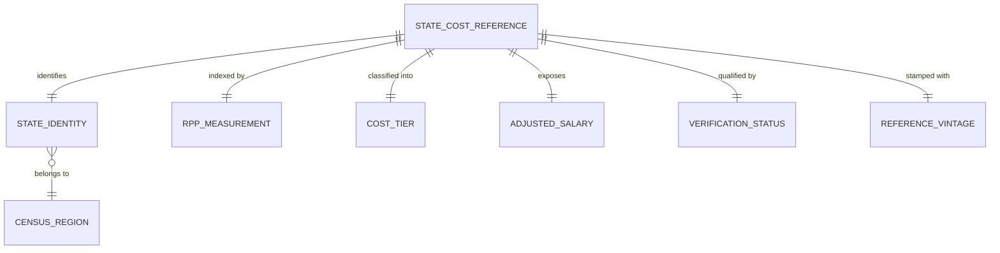

# Conceptual Model: gold-regional-price-parities

**Status:** PROPOSED
**Mode:** Greenfield
**Zone:** Gold (Consumable)
**Domain:** Regional Economic Reference / Cost of Living Adjustment
**Spec:** docs/specs/gold-regional-price-parities.md
**Author:** @semantic-modeler
**Date:** 2026-04-11
**Approval:** Pending human review (REQUIRE_HUMAN_APPROVAL = true)
**Source Model:** governance/models/silver-base-bea-rpp-conceptual.md

---

---

## Entity Descriptions

| Entity | Business Concept | Business Term | Is CDE | Is PII |
|--------|-----------------|---------------|--------|--------|
| State Cost-of-Living Reference | The central consumable entity: a display-ready, self-contained cost-of-living profile for a single U.S. state (or DC) that powers every salary purchasing-power adjustment surfaced by FutureProof. One row per state; the row grain of `consumable.regional_price_parities`. | BT-098 | true | false |
| State Identity | The dimensional context identifying which state a reference row describes — FIPS code, full state name, USPS abbreviation, and Census region. Carried from Silver without transformation. Answers "what state is this?" | BT-100 | true | false |
| Census Region | The U.S. Census Bureau four-region grouping that classifies each state — Northeast, Midwest, South, West. An external reference taxonomy inherited from Silver; stays as an attribute of State Identity in the physical flattening. | BT-104 | false | false |
| RPP Measurement | The BEA Regional Price Parity index value for the state plus the pre-computed purchasing-power multiplier. Carried verbatim from Silver. This is the raw analytical payload on top of which all Gold derivations are built. | BT-098 | true | false |
| Cost Tier | A FutureProof editorial five-bucket classification (`very_high`, `high`, `average`, `low`, `very_low`) of the state's cost of living, derived from `rpp_all_items` via fixed left-closed breakpoints at 108, 103, 97, 91. A closed enum taxonomy dependent on RPP Measurement, never independently managed. Powers frontend color coding, boss-fight difficulty selection, and regional narrative prompts. | BT-106 | false | false |
| Adjusted Salary | A measure group of four pre-computed national-to-local salary conversions at the $30K, $50K, $75K, and $100K benchmark levels. Each is `national_salary × purchasing_power_multiplier`, rounded to cents. The group exists so the frontend and Gemma agent display purchasing-power-adjusted salaries without client-side math. Conceptually one measure evaluated at four pre-selected inputs, not four distinct attributes. | BT-107 | true | false |
| Verification Status | The per-row provenance qualifier (`bea_official` or `estimate`) carried forward unchanged from Silver per Bronze staff-review Condition 7. Exists so downstream consumers (MCP tools, frontend) can hedge or refuse unverified rows on a per-state basis. | BT-105 | false | false |
| Reference Vintage | The year the RPP measurement represents. All 51 rows share vintage 2024. Single-vintage invariant; full-table replacement on refresh, not SCD2. | BT-102 | false | false |

---

## Relationship Descriptions

| Relationship | From | To | Cardinality | Description |
|-------------|------|-----|-------------|-------------|
| identifies | State Cost-of-Living Reference | State Identity | one-to-one | Every reference row has exactly one state identity (FIPS, name, abbreviation). The reference IS the enriched view of that state. |
| indexed by | State Cost-of-Living Reference | RPP Measurement | one-to-one | Every reference row has exactly one RPP measurement (`rpp_all_items` plus `purchasing_power_multiplier`). Both values carried verbatim from Silver. |
| classified into | State Cost-of-Living Reference | Cost Tier | one-to-one | Every reference row resolves to exactly one of the five cost tier buckets. The classification is a pure function of `rpp_all_items`; there is no case where a row maps to zero or more than one tier. |
| exposes | State Cost-of-Living Reference | Adjusted Salary | one-to-one | Every reference row exposes exactly one Adjusted Salary measure group evaluated at the four pre-selected benchmark inputs ($30K, $50K, $75K, $100K). The measure group is conceptually a single entity containing four bound evaluations. |
| qualified by | State Cost-of-Living Reference | Verification Status | one-to-one | Every reference row carries exactly one verification status flag forwarded from Silver. 8 of 51 rows are `bea_official`; 43 are `estimate`. |
| stamped with | State Cost-of-Living Reference | Reference Vintage | one-to-one | Every reference row is tagged with the vintage year of the underlying RPP estimate (currently 2024). Full-table replacement on refresh. |
| belongs to | State Identity | Census Region | many-to-one | Each state belongs to exactly one Census region; each region contains many states. Static Census convention; DC → South. |

---

## Key Business Concepts

### Grain

The fundamental unit is **one U.S. state (or DC) in a single RPP vintage**, identical to the Silver grain. Exactly 51 rows; FIPS code is the canonical key. Gold adds derived columns (Cost Tier, Adjusted Salary group) and forwards provenance (Verification Status) but does not change the row count or the grain.

### Cost Tier as a Dependent Taxonomy (BT-106)

Cost Tier is a closed five-value editorial enum — `very_high`, `high`, `average`, `low`, `very_low` — derived from `rpp_all_items` via fixed left-closed breakpoints (108, 103, 97, 91). It is modeled as a **dependent entity** rather than a simple attribute to make three properties visible at the conceptual level:

1. **It is a classification taxonomy, not a measurement.** The tier is an editorial bucket, not a scientific cut; the breakpoints are a FutureProof convention calibrated for the 51-row universe, not a BEA publication. Treating it as an entity flags it as governance-owned: any breakpoint change is a breaking change to downstream consumers.
2. **It has a closed, enumerable value set.** Downstream consumers (frontend color coding, boss-fight difficulty, narrative prompts) bind their own UI and logic to the five literal values. The enum is the contract.
3. **It is a pure derivation.** There is zero independence from `rpp_all_items`; the relationship is deterministic and 1:1. Modeling Cost Tier as an entity dependent on RPP Measurement documents that the values are computed, not sourced.

Physically, Cost Tier is flattened to a single string column `cost_tier` on the Gold table. The "entity" status is a conceptual governance device, not a structural split.

### Adjusted Salary as a Measure Group (BT-107)

Adjusted Salary is a group of four pre-computed evaluations of one underlying formula: `national_salary × purchasing_power_multiplier`, evaluated at the four benchmark inputs $30,000, $50,000, $75,000, and $100,000. It is modeled as a **dependent measure group** (one entity containing four bound evaluations) rather than four unrelated attributes to make three properties visible at the conceptual level:

1. **The four values are a single measure, not four measures.** They share a formula, a vintage, a unit (USD), and a rounding rule (2 decimal places). Treating them as a group clarifies that any future benchmark additions (e.g., $150K, $200K) would extend the same measure group, not add new entities.
2. **The four benchmarks are a display contract, not an analytic range.** The values exist because the frontend and Gemma agent display salaries at four canonical anchor points, not because $30K, $50K, $75K, and $100K are statistically meaningful boundaries. Grouping them in the conceptual model signals that the four-point set is a consumer contract negotiated with the frontend, not a derivation open to downstream reinterpretation.
3. **Client-side math is explicitly disallowed.** The reason these four values are pre-computed is that every consumer must read the same number. If adjustment were a free attribute, a client could compute `adjusted_45k` locally and silently disagree with another client doing the same thing. Modeling Adjusted Salary as a measure group documents that the Gold table is the single source of truth for the four supported values.

Physically, the measure group is flattened to four sibling columns: `adjusted_30k`, `adjusted_50k`, `adjusted_75k`, `adjusted_100k`. The "entity" status is a conceptual governance device. Alternatives considered (struct/map) are documented in the physical model.

### Verification Status Carry-Forward (BT-105)

Verification Status is not a new concept at Gold — it was introduced at Silver to close Bronze HIGH-3 / staff-review Condition 6, and it is carried forward to Gold per staff-review Condition 7. Its presence at Gold is a deliberate governance decision: surfacing provenance on every downstream read is required so that MCP tools can refuse unverified rows in strict mode and so that Gemma can hedge numeric precision when narrating results. The column is forwarded column-for-column from Silver and its allow-list semantics (8-of-51 `bea_official`, 43-of-51 `estimate`) are preserved intact.

### Regional Price Parity and Purchasing Power Multiplier

Both values are carried verbatim from Silver with no rescaling. Silver is the single source of truth; Gold is a pure shaping layer. This means:

- The passthrough invariant is a P0 DQ rule: every Gold `rpp_all_items` must equal the Silver row for the same `state_fips`.
- The inverse invariant `purchasing_power_multiplier × rpp_all_items ≈ 100.0 ± 0.01` is enforced at Gold too.
- All four `adjusted_Nk` columns must be consistent with `N × 1000 × purchasing_power_multiplier` within cents tolerance.

---

## Cross-Source Integration Role

**None.** This table is orthogonal to the SOC/CIP join graph. It does not participate in any cross-source joins at pipeline build time. The join happens at query time in the consuming layer, keyed on the student's selected state (USPS abbreviation or FIPS code):

| Consumer | Join Key | Role |
|----------|----------|------|
| MCP tool `get_regional_price_parity` | state_abbr | Lookup for frontend display; reads `rpp_all_items`, `purchasing_power_multiplier`, `cost_tier`, all four `adjusted_Nk`, and `verification_status` in a single row fetch. |
| MCP tool `compare_purchasing_power` | state_abbr (pair) | Pair lookup for cross-state salary comparison; reads `purchasing_power_multiplier` and `cost_tier` for two rows. |
| Frontend salary display | state_abbr | Reads the four `adjusted_Nk` values directly; reads `cost_tier` for color coding. |
| Fight Location Lock boss (stretch) | state_abbr | Reads `cost_tier` to select boss difficulty. |

Every career shown to a student is adjusted by the `purchasing_power_multiplier` corresponding to their selected state. There is no SOC or CIP dependency anywhere in this model.

---

## Modeling Decisions

1. **State Cost-of-Living Reference as the anchor entity, not State.** Silver used `State` as its anchor because the table was a canonical reference of states; Gold's anchor is the *enriched consumable profile* of a state's cost-of-living information. The rename clarifies that this is the Gold layer and its focus is the consumer-ready product, not the raw state catalog.

2. **Cost Tier as a dependent entity rather than a plain attribute.** The tier is a classification taxonomy with a closed enum, governance-owned breakpoints, and strict downstream binding. Modeling it as an entity (rather than burying it as a string attribute) makes the governance intent visible at the conceptual level — any breakpoint change is a breaking change. Physically it collapses to one column. See "Key Business Concepts" for the full rationale.

3. **Adjusted Salary as a dependent measure group rather than four independent attributes.** The four benchmarks share a formula, vintage, unit, and rounding rule, and exist as a display contract with the frontend. Modeling them as a group clarifies extensibility (future benchmarks extend the group) and documents that client-side math on intermediate salaries is explicitly disallowed. Physically it collapses to four sibling double columns. See the physical model for the struct/map alternative analysis.

4. **Verification Status as a first-class entity, not a quality flag.** Same reasoning as Silver: Bronze staff-review elevated per-row provenance to a governance requirement, and the Gold carry-forward obligation (Condition 7) makes the entity status explicit. Modeling it as a distinct entity — rather than as an attribute of RPP Measurement — makes the carry-forward obligation visible to every downstream consumer.

5. **No new relationships across the SOC/CIP join graph.** Gold BEA RPP is orthogonal to every other Gold product. The conceptual model contains zero edges to `Occupation Profile`, `Career Outcome`, `Futureproof Score`, etc. The integration is query-time, not pipeline-time.

6. **Census Region remains an attribute of State Identity.** Silver treated Census Region as a separate conceptual entity with a belongs-to relationship from State. At Gold we collapse it into State Identity because the conceptual model is consumer-oriented: the downstream reader cares "what is this state?" which includes its region, not "what region does this state belong to?" separately. The relationship from State Identity to Census Region is preserved on the diagram as a many-to-one edge for documentation purposes, but no separate entity attribute block is needed.

7. **Reference Vintage retained as a distinct entity despite being a single column.** The single-vintage invariant is a P0 contract (`COUNT(DISTINCT data_year) = 1`), and the supersession strategy (full-table replace, not SCD2) is load-bearing for every consumer. Keeping Reference Vintage as an entity flags the vintage as a governance concept, not just a column.

8. **No temporal history.** There is no SCD2, no versioning, no bitemporal modeling. Refreshes replace the table wholesale. This matches the Silver treatment and the single-vintage nature of the underlying BEA publication cycle (annual).

9. **No PII.** Zero PII columns. State-level geographic data is not personal information. All CDE flags follow the Silver parent: `state_fips`, `rpp_all_items`, `purchasing_power_multiplier`, plus `adjusted_Nk` values which inherit CDE status through derivation from `purchasing_power_multiplier`.

---

## Scope and Boundaries

- This conceptual model covers `consumable.regional_price_parities` in the Gold zone only.
- The Silver parent `base.bea_rpp` is the exclusive source; no other inputs participate.
- MCP tools and frontend are downstream consumers, not part of this model.
- The Census region assignments, USPS abbreviations, and BEA verification allow-list are inherited from Silver and are not re-derived here.
- The 51-row row count is closed. There is no growth path for this table beyond refreshing the 51 values annually.
- Cost Tier breakpoints (108, 103, 97, 91) are frozen in this model. Any change is a breaking change to downstream consumers.
- The four Adjusted Salary benchmarks ($30K, $50K, $75K, $100K) are frozen in this model. Adding a fifth is a non-breaking additive change; removing one is a breaking change.
