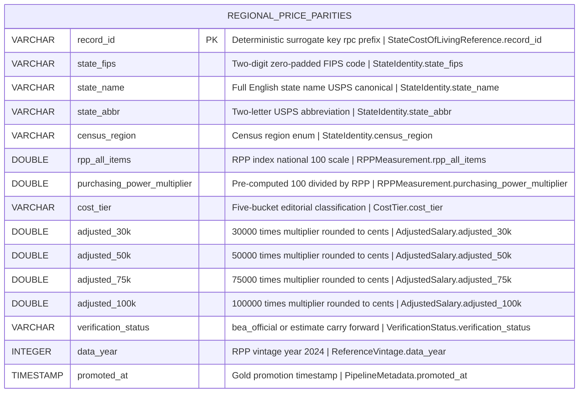

# Physical Model: gold-regional-price-parities

**Status:** PROPOSED
**Mode:** Greenfield
**Zone:** Gold (Consumable)
**Domain:** Regional Economic Reference / Cost of Living Adjustment
**Spec:** docs/specs/gold-regional-price-parities.md
**Logical Model:** governance/models/gold-regional-price-parities-logical.md
**Conceptual Model:** governance/models/gold-regional-price-parities-conceptual.md
**Author:** @semantic-modeler
**Date:** 2026-04-11
**Approval:** Pending human review (REQUIRE_HUMAN_APPROVAL = true)
**Source Model:** governance/models/silver-base-bea-rpp-physical.md

---



---

## Table Definition

| Property | Value |
|----------|-------|
| **Catalog table** | `consumable.regional_price_parities` |
| **Format** | Apache Iceberg (v2) |
| **Engine** | DuckDB (via `iceberg_scan`) |
| **Grain** | One row per U.S. state or DC (`state_fips`) for the current RPP vintage |
| **Natural key** | `state_fips` (UNIQUE, NOT NULL) |
| **Surrogate key** | `record_id` (deterministic SHA-256 hash, prefix `rpc`) |
| **Dedup grain** | `['state_fips']` |
| **Expected row count** | Exactly 51 rows (50 states + DC). Closed set. |
| **Partition strategy** | **None** (unpartitioned). 51 rows — see rationale below. |
| **Sort order** | `state_fips ASC` |
| **Write pattern** | Full-table replace via `brightsmith.infra.promote.promote()` with `dedup_on=['state_fips']` (idempotent; re-running produces 0 new rows) |
| **Supersession** | Full-table replacement on refresh. Not SCD2. Matches Silver. |
| **Upstream** | `base.bea_rpp` (Silver) — row-for-row source with 4 added derivations and 1 carry-forward |

---

## Column Definitions

All 15 columns below are NOT NULL. Column order matches the spec and the logical model exactly.

### 1. Surrogate Key

| Column | DuckDB Type | Nullable | Default | Constraint | Business Term | Is CDE | Is PII | Description |
|--------|-------------|----------|---------|------------|---------------|--------|--------|-------------|
| record_id | VARCHAR | NOT NULL | derived | PRIMARY KEY | BT-015 | false | false | Deterministic surrogate key: `compute_grain_id(row, ['state_fips'], prefix='rpc')`. Format: `rpc-<16 hex chars>`. Stable across pipeline re-runs. Prefix `rpc` distinguishes Gold consumable record_ids from Silver's `rpp-` prefix. |

### 2. State Identity

| Column | DuckDB Type | Nullable | Default | Constraint | Business Term | Is CDE | Is PII | Description |
|--------|-------------|----------|---------|------------|---------------|--------|--------|-------------|
| state_fips | VARCHAR | NOT NULL | -- | UNIQUE; CHECK (state_fips ~ '^\d{2}$') | BT-100 | true | false | Two-digit zero-padded FIPS code (e.g., `06` California, `11` DC). Canonical geographic key and dedup grain. Carried verbatim from Silver `base.bea_rpp.state_fips`. |
| state_name | VARCHAR | NOT NULL | -- | UNIQUE | BT-101 | false | false | Full English name in USPS canonical form (e.g., `California`, `District of Columbia`). Carried verbatim from Silver. Display-only. |
| state_abbr | VARCHAR | NOT NULL | -- | UNIQUE; CHECK (state_abbr ~ '^[A-Z]{2}$') | BT-103 | true | false | Two-letter uppercase USPS abbreviation (e.g., `CA`, `IA`, `DC`). Carried verbatim from Silver. Primary key used by frontend and MCP tool signatures. |
| census_region | VARCHAR | NOT NULL | -- | CHECK (census_region IN ('Northeast','Midwest','South','West')) | BT-104 | false | false | U.S. Census Bureau region. Carried verbatim from Silver. DC is assigned to `South` per Census convention. |

### 3. RPP Measurement

| Column | DuckDB Type | Nullable | Default | Constraint | Business Term | Is CDE | Is PII | Description |
|--------|-------------|----------|---------|------------|---------------|--------|--------|-------------|
| rpp_all_items | DOUBLE | NOT NULL | -- | CHECK (rpp_all_items BETWEEN 70.0 AND 130.0) | BT-098 | true | false | Regional Price Parity index on the national=100.0 scale. Carried verbatim from Silver. Passthrough invariant enforced by DQ: every Gold value equals the Silver value for the same `state_fips`. |
| purchasing_power_multiplier | DOUBLE | NOT NULL | -- | CHECK (purchasing_power_multiplier BETWEEN 0.7 AND 1.3) | BT-099 | true | false | Pre-computed salary scaling factor `100.0 / rpp_all_items`. Carried verbatim from Silver (not recomputed at Gold). Inverse invariant: `purchasing_power_multiplier * rpp_all_items ≈ 100.0` within tolerance 0.01 (P0 DQ rule). |

### 4. Cost Tier (derived at Gold)

| Column | DuckDB Type | Nullable | Default | Constraint | Business Term | Is CDE | Is PII | Description |
|--------|-------------|----------|---------|------------|---------------|--------|--------|-------------|
| cost_tier | VARCHAR | NOT NULL | derived | CHECK (cost_tier IN ('very_high','high','average','low','very_low')) | BT-106 | false | false | Five-bucket editorial classification derived from `rpp_all_items` via the frozen CASE expression (see "Cost Tier Derivation" below). Breakpoints: 108, 103, 97, 91 (left-closed). Values: `very_high` ≥ 108; `high` [103, 108); `average` [97, 103); `low` [91, 97); `very_low` < 91. |

### 5. Adjusted Salary Measure Group (derived at Gold)

| Column | DuckDB Type | Nullable | Default | Constraint | Business Term | Is CDE | Is PII | Description |
|--------|-------------|----------|---------|------------|---------------|--------|--------|-------------|
| adjusted_30k | DOUBLE | NOT NULL | derived | CHECK (abs(adjusted_30k - round(30000.0 * purchasing_power_multiplier, 2)) <= 0.01) | BT-107 | true | false | Pre-computed adjusted salary at the $30K national benchmark: `round(30000.0 * purchasing_power_multiplier, 2)`. USD, cents precision. |
| adjusted_50k | DOUBLE | NOT NULL | derived | CHECK (abs(adjusted_50k - round(50000.0 * purchasing_power_multiplier, 2)) <= 0.01) | BT-107 | true | false | Pre-computed adjusted salary at the $50K national benchmark: `round(50000.0 * purchasing_power_multiplier, 2)`. USD, cents precision. |
| adjusted_75k | DOUBLE | NOT NULL | derived | CHECK (abs(adjusted_75k - round(75000.0 * purchasing_power_multiplier, 2)) <= 0.01) | BT-107 | true | false | Pre-computed adjusted salary at the $75K national benchmark: `round(75000.0 * purchasing_power_multiplier, 2)`. USD, cents precision. |
| adjusted_100k | DOUBLE | NOT NULL | derived | CHECK (abs(adjusted_100k - round(100000.0 * purchasing_power_multiplier, 2)) <= 0.01) | BT-107 | true | false | Pre-computed adjusted salary at the $100K national benchmark: `round(100000.0 * purchasing_power_multiplier, 2)`. USD, cents precision. |

### 6. Verification Status (carry-forward from Silver per Condition 7)

| Column | DuckDB Type | Nullable | Default | Constraint | Business Term | Is CDE | Is PII | Description |
|--------|-------------|----------|---------|------------|---------------|--------|--------|-------------|
| verification_status | VARCHAR | NOT NULL | -- | CHECK (verification_status IN ('bea_official','estimate')) | BT-105 | false | false | Per-row provenance qualifier carried verbatim from Silver per Bronze staff-review Condition 7. Current allocation: 8 `bea_official` (CA, HI, DC, NJ, AR, MS, IA, OK), 43 `estimate`. The allow-list subset rule (`bea_official` rows must have `state_fips` in the 8-code canonical set) is re-asserted at Gold as a P0 DQ rule. |

### 7. Reference Vintage

| Column | DuckDB Type | Nullable | Default | Constraint | Business Term | Is CDE | Is PII | Description |
|--------|-------------|----------|---------|------------|---------------|--------|--------|-------------|
| data_year | INTEGER | NOT NULL | -- | CHECK (data_year = 2024) | BT-102 | false | false | RPP vintage year. Constant `2024` in the current snapshot. Carried verbatim from Silver. `COUNT(DISTINCT data_year) = 1` is a P0 invariant. |

### 8. Pipeline Metadata

| Column | DuckDB Type | Nullable | Default | Constraint | Business Term | Is CDE | Is PII | Description |
|--------|-------------|----------|---------|------------|---------------|--------|--------|-------------|
| promoted_at | TIMESTAMP | NOT NULL | derived | -- | BT-017 | false | false | Timestamp when the row was written to the Gold consumable zone. Generated at transformation time via `datetime.now()`. Replaces Silver's `ingested_at` / `source_load_date` metadata pair. |

---

## Column Summary

| Count | Category |
|-------|----------|
| 15 | Total columns |
| 1 | Primary key (record_id) |
| 1 | Natural key (state_fips) |
| 8 | CDE columns (state_fips, state_abbr, rpp_all_items, purchasing_power_multiplier, adjusted_30k, adjusted_50k, adjusted_75k, adjusted_100k) |
| 0 | PII columns |
| 0 | Nullable columns |
| 15 | NOT NULL columns |
| 6 | Derived at Gold (record_id, cost_tier, adjusted_30k, adjusted_50k, adjusted_75k, adjusted_100k) |
| 8 | Passthrough / carry-forward from Silver (state_fips, state_name, state_abbr, census_region, rpp_all_items, purchasing_power_multiplier, verification_status, data_year) |
| 1 | Generated metadata (promoted_at) |

---

## PyIceberg Schema Definition

This is the exact schema the Gold transformer must use when creating the Iceberg table via `promote()`. NestedField IDs are sequential 1-15 matching the column order in the spec.

```python
from pyiceberg.schema import Schema
from pyiceberg.types import (
    DoubleType,
    IntegerType,
    NestedField,
    StringType,
    TimestampType,
)

SCHEMA = Schema(
    NestedField(1,  "record_id",                   StringType(),    required=True),
    NestedField(2,  "state_fips",                  StringType(),    required=True),
    NestedField(3,  "state_name",                  StringType(),    required=True),
    NestedField(4,  "state_abbr",                  StringType(),    required=True),
    NestedField(5,  "census_region",               StringType(),    required=True),
    NestedField(6,  "rpp_all_items",               DoubleType(),    required=True),
    NestedField(7,  "purchasing_power_multiplier", DoubleType(),    required=True),
    NestedField(8,  "cost_tier",                   StringType(),    required=True),
    NestedField(9,  "adjusted_30k",                DoubleType(),    required=True),
    NestedField(10, "adjusted_50k",                DoubleType(),    required=True),
    NestedField(11, "adjusted_75k",                DoubleType(),    required=True),
    NestedField(12, "adjusted_100k",               DoubleType(),    required=True),
    NestedField(13, "verification_status",         StringType(),    required=True),
    NestedField(14, "data_year",                   IntegerType(),   required=True),
    NestedField(15, "promoted_at",                 TimestampType(), required=True),
)
```

---

## Cost Tier Derivation (Frozen in this Model)

### The canonical CASE expression

```sql
cost_tier = CASE
  WHEN rpp_all_items >= 108.0 THEN 'very_high'
  WHEN rpp_all_items >= 103.0 THEN 'high'
  WHEN rpp_all_items >= 97.0  THEN 'average'
  WHEN rpp_all_items >= 91.0  THEN 'low'
  ELSE                             'very_low'
END
```

Breakpoints are inclusive on the lower bound and exclusive on the upper bound (standard left-closed `[lo, hi)` convention). The CASE is evaluated top-down so the highest-matching bucket wins.

### Python reference implementation

```python
def derive_cost_tier(rpp_all_items: float) -> str:
    """Frozen Gold-layer cost tier classifier.

    Breakpoints: 108, 103, 97, 91 (left-closed).
    Any change is a breaking change per BT-106.
    """
    if rpp_all_items >= 108.0:
        return "very_high"
    if rpp_all_items >= 103.0:
        return "high"
    if rpp_all_items >= 97.0:
        return "average"
    if rpp_all_items >= 91.0:
        return "low"
    return "very_low"
```

### Bucket ranges (left-closed)

| Tier | Range | Examples from 8 BEA-verified states |
|------|-------|-------------------------------------|
| `very_high` | rpp_all_items ≥ 108.0 | CA (110.7), HI (110.0), DC (109.9), NJ (108.8) |
| `high` | 103.0 ≤ rpp_all_items < 108.0 | (none in the 8-verified set) |
| `average` | 97.0 ≤ rpp_all_items < 103.0 | (none in the 8-verified set) |
| `low` | 91.0 ≤ rpp_all_items < 97.0 | (none in the 8-verified set) |
| `very_low` | rpp_all_items < 91.0 | AR (86.9), MS (87.0), IA (87.8), OK (87.8) |

### Cost tier as lookup table — rejected

A two-column lookup table `cost_tier_breakpoints(tier, lower_bound)` was considered and rejected:

1. A range join over a continuous column is more expensive and harder to audit than a CASE.
2. Breakpoints are governance-frozen. A table invites the illusion that they are editable data.
3. Downstream consumers bind to the five literal values, not to the table. A lookup table changes none of their code.

The CASE is frozen in this physical model and in the transformer implementation. Any change to the breakpoints requires a new spec.

---

## Adjusted Salary Derivation

### Canonical expressions

```python
adjusted_30k  = round(30000.0  * purchasing_power_multiplier, 2)
adjusted_50k  = round(50000.0  * purchasing_power_multiplier, 2)
adjusted_75k  = round(75000.0  * purchasing_power_multiplier, 2)
adjusted_100k = round(100000.0 * purchasing_power_multiplier, 2)
```

**Rounding mode:** Python `round()` / numpy `round()` — banker's rounding (IEEE 754 round-half-to-even). DuckDB `round()` uses the same convention by default. Consistency across transformer, DQ engine, and database is required so the invariant `abs(adjusted_Nk - round(N*1000*multiplier, 2)) ≤ 0.01` holds on both sides.

### Spot checks (8 BEA-verified states)

| state_fips | state | multiplier ≈ | adjusted_30k | adjusted_50k | adjusted_75k | adjusted_100k |
|---|---|---|---|---|---|---|
| 06 | CA (110.7) | 0.903342 | 27100.27 | 45167.12 | 67750.68 | 90334.24 |
| 15 | HI (110.0) | 0.909091 | 27272.73 | 45454.55 | 68181.82 | 90909.09 |
| 11 | DC (109.9) | 0.909918 | 27297.54 | 45495.91 | 68243.86 | 90991.81 |
| 34 | NJ (108.8) | 0.919118 | 27573.53 | 45955.88 | 68933.82 | 91911.76 |
| 05 | AR (86.9)  | 1.150748 | 34522.44 | 57537.40 | 86306.10 | 115074.80 |
| 28 | MS (87.0)  | 1.149425 | 34482.76 | 57471.26 | 86206.90 | 114942.53 |
| 19 | IA (87.8)  | 1.138952 | 34168.56 | 56947.61 | 85421.41 | 113895.22 |
| 40 | OK (87.8)  | 1.138952 | 34168.56 | 56947.61 | 85421.41 | 113895.22 |

The $50K column matches the spec's P0 spot-check table exactly.

### Four columns vs. struct/map — rejected alternatives

**STRUCT rejected:** Adds a field-access layer at every consumer read site with zero benefit for a fixed 4-field closed set. DQ rules against flat columns are simpler than struct-field references.

**MAP rejected:** A map semantically invites arbitrary keys, which is the opposite of the governance intent. The four benchmarks are a closed display contract; the whole point of pre-computation is to prevent client-side math on arbitrary salaries. Maps also have inconsistent range-query support across engines and awkward DQ rule expression.

**Extension path:** A future spec adding `adjusted_150k` appends a column at position 13 (shifting `verification_status` to 14, `data_year` to 15, `promoted_at` to 16). Additive schema change, backwards compatible, no struct migration needed.

---

## Source-to-Target Mapping

| # | Physical Column | DuckDB Type | Source Table | Source Column | Transformation |
|---|-----------------|-------------|--------------|---------------|----------------|
| 1 | record_id | VARCHAR | -- | derived | `compute_grain_id(row, ['state_fips'], prefix='rpc')` |
| 2 | state_fips | VARCHAR | base.bea_rpp | state_fips | Direct passthrough |
| 3 | state_name | VARCHAR | base.bea_rpp | state_name | Direct passthrough |
| 4 | state_abbr | VARCHAR | base.bea_rpp | state_abbr | Direct passthrough |
| 5 | census_region | VARCHAR | base.bea_rpp | census_region | Direct passthrough |
| 6 | rpp_all_items | DOUBLE | base.bea_rpp | rpp_all_items | Direct passthrough (passthrough invariant enforced by DQ) |
| 7 | purchasing_power_multiplier | DOUBLE | base.bea_rpp | purchasing_power_multiplier | Direct passthrough (not recomputed at Gold) |
| 8 | cost_tier | VARCHAR | -- | derived | Frozen CASE on `rpp_all_items` (breakpoints 108/103/97/91) |
| 9 | adjusted_30k | DOUBLE | -- | derived | `round(30000.0 * purchasing_power_multiplier, 2)` |
| 10 | adjusted_50k | DOUBLE | -- | derived | `round(50000.0 * purchasing_power_multiplier, 2)` |
| 11 | adjusted_75k | DOUBLE | -- | derived | `round(75000.0 * purchasing_power_multiplier, 2)` |
| 12 | adjusted_100k | DOUBLE | -- | derived | `round(100000.0 * purchasing_power_multiplier, 2)` |
| 13 | verification_status | VARCHAR | base.bea_rpp | verification_status | Direct passthrough (Condition 7 carry-forward) |
| 14 | data_year | INTEGER | base.bea_rpp | data_year | Direct passthrough |
| 15 | promoted_at | TIMESTAMP | -- | generated | `datetime.now()` at transformation time |

Silver columns **not** carried forward: `source_load_date`, `ingested_at`. Replaced by Gold's single `promoted_at` timestamp.

---

## Idempotent Promote Pattern

This table is written via `brightsmith.infra.promote.promote()` which guarantees idempotency at the row and run level.

```python
from datetime import datetime
from brightsmith.infra.promote import promote
from brightsmith.infra.grain import compute_grain_id

# Frozen at this model — do not move, do not edit breakpoints.
COST_TIER_BREAKPOINTS = (
    (108.0, "very_high"),
    (103.0, "high"),
    (97.0,  "average"),
    (91.0,  "low"),
)

def derive_cost_tier(rpp: float) -> str:
    for threshold, tier in COST_TIER_BREAKPOINTS:
        if rpp >= threshold:
            return tier
    return "very_low"

def transform_gold_regional_price_parities(silver_df):
    # 1. Start from the Silver parent
    df = silver_df[[
        "state_fips", "state_name", "state_abbr", "census_region",
        "rpp_all_items", "purchasing_power_multiplier",
        "verification_status", "data_year",
    ]].copy()

    # 2. Derive cost_tier (frozen CASE)
    df["cost_tier"] = df["rpp_all_items"].apply(derive_cost_tier)

    # 3. Derive adjusted salary measure group (round to 2 decimals)
    multiplier = df["purchasing_power_multiplier"]
    df["adjusted_30k"]  = (30000.0  * multiplier).round(2)
    df["adjusted_50k"]  = (50000.0  * multiplier).round(2)
    df["adjusted_75k"]  = (75000.0  * multiplier).round(2)
    df["adjusted_100k"] = (100000.0 * multiplier).round(2)

    # 4. Pipeline metadata
    df["promoted_at"] = datetime.now()

    # 5. Deterministic record_id (note: prefix is 'rpc', not Silver's 'rpp')
    df["record_id"] = df.apply(
        lambda row: compute_grain_id(row, ["state_fips"], prefix="rpc"),
        axis=1,
    )

    # 6. Column order MUST match SCHEMA exactly
    df = df[[
        "record_id",
        "state_fips", "state_name", "state_abbr", "census_region",
        "rpp_all_items", "purchasing_power_multiplier",
        "cost_tier",
        "adjusted_30k", "adjusted_50k", "adjusted_75k", "adjusted_100k",
        "verification_status",
        "data_year",
        "promoted_at",
    ]]

    # 7. Idempotent promote
    promote(
        df,
        table="consumable.regional_price_parities",
        schema=SCHEMA,
        dedup_on=["state_fips"],
    )
```

### Idempotency guarantees

- **Determinism of record_id:** `compute_grain_id` is a pure function of `state_fips` with a constant prefix `rpc`. Re-running against unchanged Silver yields identical hashes.
- **Dedup grain `['state_fips']`:** A re-run with identical Silver input produces zero new rows. The dedup grain matches the natural key; there is no possibility of duplicate keys post-promote.
- **Deterministic derivations:** `cost_tier` and all four `adjusted_Nk` columns are pure functions of Silver columns. Re-running yields identical values.
- **Full-table replace semantics:** When Silver refreshes, Gold is replaced wholesale. No SCD2, no history. Matches the Silver supersession strategy.
- **Row count invariant:** Exactly 51 rows post-promote. P0 DQ rule.
- **Non-deterministic field:** `promoted_at` is the only non-deterministic column. It is metadata only, never a join or grouping key, and does not affect downstream correctness.

### Re-run behavior

| Scenario | Result |
|---|---|
| Re-run against unchanged Silver | 51 rows in, 51 rows out; `record_id` values identical; only `promoted_at` updates |
| Re-run after Silver refresh with new `rpp_all_items` | `cost_tier`, `purchasing_power_multiplier` (via Silver), and all four `adjusted_Nk` update; `state_fips` keys preserved; `record_id` preserved (pure function of state_fips) |
| Re-run after Silver adds verification_status flip (BEA refresh) | `verification_status` updates row-by-row; DQ rule `COUNT(bea_official)=8` updates to `=51` in lockstep |
| Partial re-run | Not supported — promote() is all-or-nothing at the table level |

---

## Partition Strategy

**None (unpartitioned).**

Rationale:
- 51 rows is smaller than any reasonable partition boundary. Partitioning adds metadata overhead with zero scan-pruning benefit.
- There is no dimension to partition on: not by region (4 groups of 9-17 rows each is still trivial), not by vintage (single vintage), not by verification (8/43 split is meaningless for a 51-row table), not by cost_tier (5 groups with skewed distribution).
- Sort order `state_fips ASC` gives natural index-like lookup behavior across all 51 rows.
- Matches the Silver parent partition strategy and every other small reference table in the project.
- Consumer access patterns are point lookups by `state_abbr` (MCP tools) or full-table scans for frontend (51 rows fit in a single network response). Neither benefits from partitioning.

---

## Sort Order

`state_fips ASC`

Rationale: `state_fips` is the natural key and the most common lookup dimension. Sorting by it gives ordered output for downstream scans, enables efficient range lookups, and is the least-surprising default for a reference table keyed by FIPS. Matches Silver.

---

## Nullability Semantics

All 15 columns are NOT NULL. This is a complete closed-set consumable reference table. The Gold data contract guarantees **0% nulls on all 15 columns**.

There are no optional fields, no soft nulls, no "unknown" states. The only per-row softness is `verification_status = 'estimate'` on 43 of 51 rows, which is a first-class value in its closed enum — not missing data.

---

## DDL (Reference)

This DDL is for documentation. The actual table is created via `brightsmith.infra.promote.promote()`.

```sql
-- Reference DDL for consumable.regional_price_parities
-- Engine: DuckDB + Iceberg v2
-- Do not execute directly -- use promote() pattern

CREATE TABLE IF NOT EXISTS consumable.regional_price_parities (
    record_id                       VARCHAR     NOT NULL,
    state_fips                      VARCHAR     NOT NULL,
    state_name                      VARCHAR     NOT NULL,
    state_abbr                      VARCHAR     NOT NULL,
    census_region                   VARCHAR     NOT NULL,
    rpp_all_items                   DOUBLE      NOT NULL,
    purchasing_power_multiplier     DOUBLE      NOT NULL,
    cost_tier                       VARCHAR     NOT NULL,
    adjusted_30k                    DOUBLE      NOT NULL,
    adjusted_50k                    DOUBLE      NOT NULL,
    adjusted_75k                    DOUBLE      NOT NULL,
    adjusted_100k                   DOUBLE      NOT NULL,
    verification_status             VARCHAR     NOT NULL,
    data_year                       INTEGER     NOT NULL,
    promoted_at                     TIMESTAMP   NOT NULL,

    -- Surrogate key
    PRIMARY KEY (record_id),

    -- Natural key and synonym uniqueness
    UNIQUE (state_fips),
    UNIQUE (state_abbr),
    UNIQUE (state_name),

    -- Domain constraints (identity)
    CHECK (state_fips ~ '^\d{2}$'),
    CHECK (state_abbr ~ '^[A-Z]{2}$'),
    CHECK (census_region IN ('Northeast','Midwest','South','West')),

    -- Domain constraints (measurement)
    CHECK (rpp_all_items BETWEEN 70.0 AND 130.0),
    CHECK (purchasing_power_multiplier BETWEEN 0.7 AND 1.3),

    -- Domain constraints (Gold derivations)
    CHECK (cost_tier IN ('very_high','high','average','low','very_low')),

    -- Cost tier derivation correctness (frozen CASE)
    CHECK (
        (rpp_all_items >= 108.0 AND cost_tier = 'very_high') OR
        (rpp_all_items >= 103.0 AND rpp_all_items < 108.0 AND cost_tier = 'high') OR
        (rpp_all_items >= 97.0  AND rpp_all_items < 103.0 AND cost_tier = 'average') OR
        (rpp_all_items >= 91.0  AND rpp_all_items < 97.0  AND cost_tier = 'low') OR
        (rpp_all_items < 91.0   AND cost_tier = 'very_low')
    ),

    -- Adjusted salary derivation correctness
    CHECK (abs(adjusted_30k  - round(30000.0  * purchasing_power_multiplier, 2)) <= 0.01),
    CHECK (abs(adjusted_50k  - round(50000.0  * purchasing_power_multiplier, 2)) <= 0.01),
    CHECK (abs(adjusted_75k  - round(75000.0  * purchasing_power_multiplier, 2)) <= 0.01),
    CHECK (abs(adjusted_100k - round(100000.0 * purchasing_power_multiplier, 2)) <= 0.01),

    -- Domain constraints (provenance + vintage)
    CHECK (verification_status IN ('bea_official','estimate')),
    CHECK (data_year = 2024)
);
```

---

## DQ Rule Alignment

All rule IDs reference `governance/dq-rules/gold-regional-price-parities.json` (55 rules, 51 P0 + 4 P1). Verified 2026-04-11 post-adversarial-audit HIGH-1 remediation.

The DQ rules align with this physical model as follows. Every GLD-RPP-* below is authoritative — the rule file is the source of truth; this table mirrors it 1:1.

| Physical Constraint / Concern | DQ Rule ID | Priority | Description |
|-------------------------------|------------|----------|-------------|
| Row count = 51 (50 states + DC) | GLD-RPP-001 | P0 | Row count exactly 51 (closed set) |
| state_fips NOT NULL | GLD-RPP-002 | P0 | state_fips non-null |
| state_fips UNIQUE (natural key) | GLD-RPP-003 | P0 | state_fips uniqueness |
| state_fips format `^\d{2}$` | GLD-RPP-004 | P0 | 2-digit zero-padded numeric string |
| state_fips in canonical 51-member FIPS set | GLD-RPP-005 | P0 | Closed NIST FIPS 5-2 state+DC allocation (closes Silver chaos Gap 2) |
| state_name NOT NULL | GLD-RPP-006 | P0 | state_name non-null |
| state_fips ↔ state_name bijection | GLD-RPP-007 | P0 | Equal distinct counts = 51 |
| state_abbr NOT NULL | GLD-RPP-008 | P0 | state_abbr non-null |
| state_abbr format `^[A-Z]{2}$` | GLD-RPP-009 | P0 | Exactly 2 uppercase letters |
| state_abbr in canonical USPS-51 set | GLD-RPP-010 | P0 | Closed 50 states + DC, rejects territories |
| state_abbr UNIQUE (51 distinct) | GLD-RPP-011 | P0 | USPS abbreviation uniqueness |
| state_fips ↔ state_abbr bijection | GLD-RPP-012 | P0 | Equal distinct counts = 51 |
| census_region NOT NULL | GLD-RPP-013 | P0 | census_region non-null |
| census_region enum membership | GLD-RPP-014 | P0 | IN {Northeast, Midwest, South, West} |
| All 4 census regions represented | GLD-RPP-015 | P0 | Coverage across Census regions |
| rpp_all_items NOT NULL | GLD-RPP-016 | P0 | rpp_all_items non-null |
| rpp_all_items range [70.0, 130.0] | GLD-RPP-017 | P0 | Sanity bound |
| purchasing_power_multiplier NOT NULL | GLD-RPP-018 | P0 | purchasing_power_multiplier non-null |
| purchasing_power_multiplier range [0.7, 1.3] | GLD-RPP-019 | P0 | Sanity bound |
| Inverse invariant: multiplier × rpp ≈ 100.0 (tol 0.01) | GLD-RPP-020 | P0 | Derivation correctness |
| cost_tier NOT NULL | GLD-RPP-021 | P0 | cost_tier non-null |
| cost_tier enum membership | GLD-RPP-022 | P0 | IN {very_high, high, average, low, very_low} |
| cost_tier classification correctness | GLD-RPP-023 | P0 | Re-runs canonical CASE expression in SQL, asserts zero mismatches |
| cost_tier left-closed boundary witness | GLD-RPP-024 | P0 | TN at rpp=91.0 exactly is 'low' (hardens left-closed semantics) |
| adjusted_30k NOT NULL | GLD-RPP-025 | P0 | adjusted_30k non-null |
| adjusted_30k derivation purity (tol 0.01) | GLD-RPP-026 | P0 | Within 1 cent of `round(30000 * multiplier, 2)` |
| adjusted_50k NOT NULL | GLD-RPP-027 | P0 | adjusted_50k non-null |
| adjusted_50k derivation purity (tol 0.01) | GLD-RPP-028 | P0 | Within 1 cent of `round(50000 * multiplier, 2)` |
| adjusted_75k NOT NULL | GLD-RPP-029 | P0 | adjusted_75k non-null |
| adjusted_75k derivation purity (tol 0.01) | GLD-RPP-030 | P0 | Within 1 cent of `round(75000 * multiplier, 2)` |
| adjusted_100k NOT NULL | GLD-RPP-031 | P0 | adjusted_100k non-null |
| adjusted_100k derivation purity (tol 0.01) | GLD-RPP-032 | P0 | Within 1 cent of `round(100000 * multiplier, 2)` |
| CA high-cost sanity: adjusted_50k < 50000 | GLD-RPP-033 | P0 | High-cost directional invariant |
| IA low-cost sanity: adjusted_50k > 50000 | GLD-RPP-034 | P0 | Low-cost directional invariant |
| verification_status enum membership | GLD-RPP-035 | P0 | IN {bea_official, estimate} |
| Exactly 8 rows are bea_official | GLD-RPP-036 | P0 | Condition 7 carry-forward (flips to =51 post-BEA-refresh) |
| bea_official allow-list by state_fips | GLD-RPP-037 | P0 | Every bea_official row's state_fips is in the 8-state allow-list |
| record_id NOT NULL | GLD-RPP-038 | P0 | Surrogate key non-null |
| record_id UNIQUE | GLD-RPP-039 | P0 | Surrogate key uniqueness |
| record_id format `rpc-<16 hex>` | GLD-RPP-040 | P0 | Deterministic surrogate key format |
| data_year = 2024 | GLD-RPP-041 | P0 | Single-vintage invariant |
| COUNT(DISTINCT data_year) = 1 | GLD-RPP-042 | P0 | Supersession contract |
| Passthrough integrity to Silver | GLD-RPP-043 | P0 | Gold carry-forward columns equal Silver (evaluation_mode=production_only, chaos_exclude=true) |
| Spot check: CA (FIPS 06) — adjusted_50k=45167.12 | GLD-RPP-044 | P0 | BEA-verified very_high, bea_official |
| Spot check: HI (FIPS 15) — adjusted_50k=45454.55 | GLD-RPP-045 | P0 | BEA-verified very_high, bea_official |
| Spot check: DC (FIPS 11) — adjusted_50k=45495.91 | GLD-RPP-046 | P0 | BEA-verified very_high, bea_official |
| Spot check: NJ (FIPS 34) — adjusted_50k=45955.88 | GLD-RPP-047 | P0 | BEA-verified very_high, bea_official |
| Spot check: AR (FIPS 05) — adjusted_50k=57537.40 | GLD-RPP-048 | P0 | BEA-verified very_low, bea_official |
| Spot check: MS (FIPS 28) — adjusted_50k=57471.26 | GLD-RPP-049 | P0 | BEA-verified very_low, bea_official |
| Spot check: IA (FIPS 19) — adjusted_50k=56947.61 | GLD-RPP-050 | P0 | BEA-verified very_low, bea_official |
| Spot check: OK (FIPS 40) — adjusted_50k=56947.61 | GLD-RPP-051 | P0 | BEA-verified very_low, bea_official |
| All 5 cost_tier values materialize | GLD-RPP-052 | P1 | Soft distribution expectation (post-BEA-refresh) |
| Each cost_tier has at least 1 row | GLD-RPP-053 | P1 | Coverage soft rule |
| promoted_at NOT NULL | GLD-RPP-054 | P1 | Pipeline metadata completeness |
| Source Silver freshness ≤ 400 days | GLD-RPP-055 | P1 | Upstream staleness guard |

**Summary:** 55 total rules — 51 P0 + 4 P1 — matching the data contract's `total_rules`, `p0_count`, and `p1_count` claims exactly.

---

## Traceability: Logical to Physical

| Logical Attribute | Logical Type Domain | Physical Column | Physical DuckDB Type | PyIceberg Type | NestedField ID | Mapping Notes |
|-------------------|--------------------|-----------------|--------------------|----------------|----------------|---------------|
| record_id | identifier | record_id | VARCHAR | StringType | 1 | Hash output is always a string; prefix `rpc` |
| state_fips | identifier | state_fips | VARCHAR | StringType | 2 | Zero-padded 2-digit string |
| state_name | text | state_name | VARCHAR | StringType | 3 | Direct mapping |
| state_abbr | identifier | state_abbr | VARCHAR | StringType | 4 | 2-char uppercase enum |
| census_region | text | census_region | VARCHAR | StringType | 5 | 4-value enum stored as string |
| rpp_all_items | numeric | rpp_all_items | DOUBLE | DoubleType | 6 | Continuous measure |
| purchasing_power_multiplier | numeric | purchasing_power_multiplier | DOUBLE | DoubleType | 7 | Continuous derivation |
| cost_tier | text | cost_tier | VARCHAR | StringType | 8 | 5-value enum stored as string |
| adjusted_30k | numeric | adjusted_30k | DOUBLE | DoubleType | 9 | USD cents precision via round(·, 2) |
| adjusted_50k | numeric | adjusted_50k | DOUBLE | DoubleType | 10 | USD cents precision via round(·, 2) |
| adjusted_75k | numeric | adjusted_75k | DOUBLE | DoubleType | 11 | USD cents precision via round(·, 2) |
| adjusted_100k | numeric | adjusted_100k | DOUBLE | DoubleType | 12 | USD cents precision via round(·, 2) |
| verification_status | text | verification_status | VARCHAR | StringType | 13 | 2-value enum stored as string |
| data_year | numeric | data_year | INTEGER | IntegerType | 14 | Calendar year value, not DATE |
| promoted_at | timestamp | promoted_at | TIMESTAMP | TimestampType | 15 | Direct mapping |

---

## Implementation Notes

### Column order is load-bearing

The 15-column order exactly matches the spec's Gold Schema table and the logical model. The `promote()` call, the SCHEMA definition, and the DataFrame column selection in the transformer must all agree. A mismatch is a P0 build failure.

Specifically: `cost_tier` (column 8) sits between `purchasing_power_multiplier` (7) and `adjusted_30k` (9) — derivations are grouped together. `verification_status` (13) sits after all derivations and before `data_year` (14) and `promoted_at` (15). This grouping follows the spec's intent of "derivations, then qualifier, then vintage, then metadata".

### FIPS stored as VARCHAR, not INTEGER

`state_fips` must be stored as VARCHAR to preserve zero-padding for codes `01`-`09`. Same rule as Silver and as CIPCODE elsewhere in the project.

### DOUBLE, not DECIMAL, for all numeric columns

RPP values, the multiplier, and the four `adjusted_Nk` columns are all DOUBLE. Rationale:
- RPP is an approximate index with one decimal place of source precision.
- The multiplier is derived from RPP; DECIMAL would add storage cost without gaining precision.
- `adjusted_Nk` values are rounded to 2 decimals at write time. The ±0.01 tolerance DQ rule accommodates any IEEE 754 representation imprecision.
- Matches Silver's DOUBLE typing.
- DECIMAL would require a precision/scale decision that adds false certainty for a state-level aggregate index.

### data_year as INTEGER, not DATE

Same reasoning as Silver: calendar-year value used for filtering and the single-vintage invariant. Not a date for arithmetic. INTEGER is simpler and faster.

### promoted_at vs. Silver's dual-timestamp pattern

Gold exposes a single `promoted_at` timestamp, not Silver's `source_load_date` + `ingested_at` pair. The Gold consumable contract is: "when was this row promoted to the consumable layer?" — the full ingest chain is an infrastructure concern tracked separately in OpenLineage, not in the consumable schema. This keeps Gold consumers uncluttered by upstream pipeline metadata.

### Cost tier CHECK constraint in DDL

The `cost_tier` CASE correctness CHECK in the DDL is a compiled form of the frozen CASE. DuckDB supports multi-branch CHECK constraints; the constraint fires if any row's `cost_tier` disagrees with its `rpp_all_items` classification. This is defense-in-depth — the transformer computes `cost_tier` via the same frozen function, and the DQ engine re-verifies it as GLD-RPP-023 (classification correctness) plus GLD-RPP-024 (left-closed boundary witness at rpp=91.0), but the database-level CHECK catches any bypass.

### Adjusted salary CHECK constraints and rounding

The four `adjusted_Nk` CHECK constraints compare each stored value against `round(N*1000*purchasing_power_multiplier, 2)` with a ±0.01 tolerance. The tolerance absorbs:
- IEEE 754 floating-point representation error in the multiplication
- Differences between Python `round()` and DuckDB `round()` (both use banker's rounding but may differ at exact half-even cases due to float representation)
- The `purchasing_power_multiplier` input itself being a Silver-computed float

A tighter tolerance (e.g., 0.001) would be unnecessarily strict for a cents-precision display value.

### Future BEA refresh path — schema stable

When the live BEA API refresh lands post-hackathon, the Silver `verification_status` allow-list expands from 8 to 51. Gold requires **zero schema changes**:
1. Silver flips all 51 rows to `bea_official`.
2. Gold promote carries the flip forward unchanged.
3. The Gold DQ rule `COUNT(bea_official) = 8` updates to `= 51` in lockstep.
4. No column additions, no type changes, no DDL migration.

This refresh path is schema-stable by design — the carry-forward column exists precisely so the refresh is a data change, not a schema change.

### Future benchmark expansion — additive only

If a future spec adds `adjusted_150k` or similar:
1. Insert the new column at the end of the Adjusted Salary group (position 13).
2. Renumber `verification_status`, `data_year`, `promoted_at` to positions 14, 15, 16.
3. Add a new PyIceberg NestedField with ID 16 (IDs are never reused; use the next available).
4. Update the SCHEMA, the transformer, the DQ rules, the data contract.
5. Existing consumers that read `adjusted_30k/50k/75k/100k` continue working unchanged.

The struct/map alternative would require a migration of every consumer. Sibling columns were chosen explicitly to preserve this additive extension path.

---

## Open Issues (Carried from Logical)

| # | Issue | Status | Resolution |
|---|-------|--------|------------|
| 1 | Cost Tier distribution may leave some tiers empty with current estimates | RESOLVED | P1 DQ rule: at least 3 distinct tiers required. Full 5-tier coverage is a post-refresh expectation. |
| 2 | Rounding mode for adjusted_Nk | RESOLVED | Python banker's rounding (IEEE 754 round-half-to-even). DuckDB matches. ±0.01 tolerance in DQ rules absorbs any residual float imprecision. |
| 3 | Future benchmark expansion (adjusted_150k, etc.) | OPEN (non-blocking) | Additive column path documented. No action required for this spec. |
| 4 | `cost_tier` DDL CHECK constraint complexity | RESOLVED | Multi-branch CHECK in DDL is defense-in-depth alongside the GLD-RPP-023 classification-correctness DQ rule (and GLD-RPP-024 boundary witness). |
