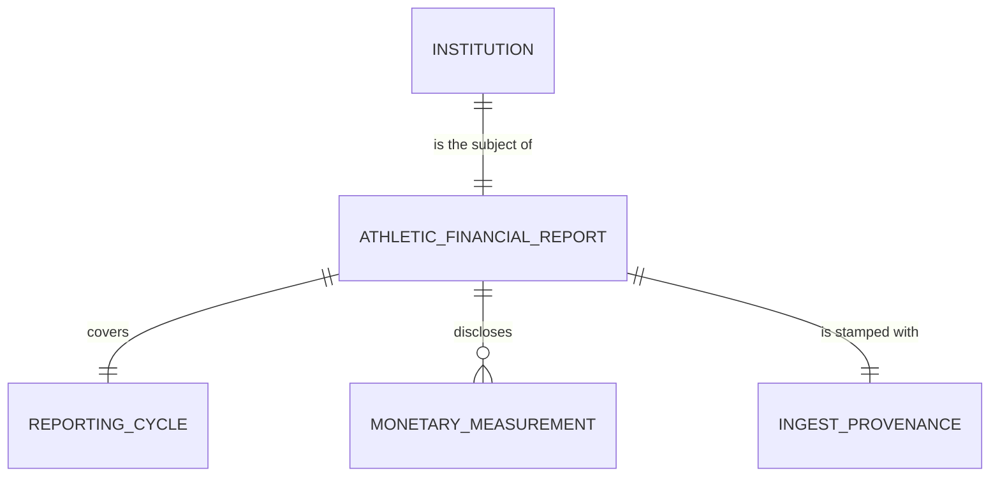

# Conceptual Model: raw-eada

**Status:** PROPOSED
**Mode:** Greenfield
**Zone:** Bronze (Raw)
**Domain:** U.S. higher-education intercollegiate athletics financial reporting
**Spec:** [docs/specs/full-pipeline-eada.md](../../docs/specs/full-pipeline-eada.md) §3 + §4
**Author:** @doc-generator
**Date:** 2026-04-30
**Approval:** Pending human review (REQUIRE_HUMAN_APPROVAL = true)

---

---

## Entity Descriptions

| Entity | Business Concept | Business Term | Is CDE | Is PII |
|--------|-----------------|---------------|--------|--------|
| Institution | A U.S. postsecondary institution that operates at least one intercollegiate athletics program and receives federal Title IV funds (mandated to disclose under §485g of the Higher Education Act). Identified by the IPEDS UNITID (the canonical key joining EADA to every other institution-keyed table in the pipeline) and an institution name (display only). | BT-001 (UNITID), BT-002 (Institution Name) | true (UNITID) | false |
| Athletic Financial Report | The institution-level row in the EADA Athletics Disclosure Survey for a single academic year. Each report rolls up every sport the institution operates into grand totals and is the unit of disclosure required by federal law. The report is the subject of the table — exactly one report per institution per reporting cycle. | (proposed) BT-119 — Athletic Financial Report | false | false |
| Reporting Cycle | The academic year (Jul–Jun) the report covers. EADA submissions are due by Oct 15 of the year following the cycle (e.g., the 2022–23 cycle was due 2023-10-15, published Mar 2024). The cycle is encoded in the source filename (`EADA_<YYYY-YYYY>.zip`) and stamped by the ingestor as `reporting_year = academic_year_start`. | (proposed) BT-120 — EADA Reporting Cycle | false | false |
| Monetary Measurement | A dollar-denominated grand-total disclosed on the report. Three measurements are ingested: total athletic expenses, total athletic revenue, and recruiting expenses. Each is at the institution-grand-total grain (already aggregated upstream by the institution before it reaches EADA). All three are USD, all three are non-negative when present, and 17.8% of recruiting-expense values are real reported zeros (institutions that don't recruit off-campus). | (proposed) BT-EAD-ATHLETIC-SUBSIDY-RATIO is computed downstream from two of these (expenses, revenue) | true (all three are CDE candidates per spec §6 Data Contract; the EADA-side aura input lives downstream as `athletic_spend_per_fte`) | false |
| Ingest Provenance | The pipeline-stamped record of where each row came from, how it was fetched, when, and on what calendar date. Required on every Bronze row by the FutureProof governance contract — no row enters Iceberg without provenance. Used by lineage, audit, and freshness DQ rules. | — | false | false |

---

## Relationship Descriptions

| Relationship | From | To | Cardinality | Description |
|-------------|------|-----|-------------|-------------|
| is the subject of | Institution | Athletic Financial Report | one-to-one (per cycle) | Every institution that operates intercollegiate athletics submits exactly one institution-totals report per reporting cycle. The Bronze table is loaded for one cycle at a time, so the relationship is functionally one-to-one within a single load. |
| covers | Athletic Financial Report | Reporting Cycle | many-to-one | Multiple institutions' reports cover the same academic year. The current Bronze load covers reporting_year=2022 (the 2022–23 cycle); future loads will add reports for additional cycles, but every row in a single load shares one cycle (enforced by RAW-EAD-010, P0). |
| discloses | Athletic Financial Report | Monetary Measurement | one-to-many (3 measurements) | Each report discloses three institution-grand-total monetary measurements: `total_athletic_expenses`, `total_athletic_revenue`, `recruiting_expenses`. EADA actually publishes ~165 additional fields (per-sport breakdowns, coach counts, scholarships, etc.) — we deliberately scope to the three that drive the downstream `aura_score` and `athletic_subsidy_ratio` per spec §3. |
| is stamped with | Athletic Financial Report | Ingest Provenance | one-to-one | Every row carries exactly one provenance stamp recording the source URL (the EADA Custom Data landing page), the fetch method (`csv_cache` from a pre-converted `InstLevel.xlsx`), the ingest timestamp (UTC), and the load date. Stamps are identical across all rows in a single batch. |

---

## Key Business Concepts

### Grain

The fundamental unit is **one institution in a single EADA reporting cycle**. The current Bronze load (2022–23 cycle) has 2,040 rows — one per IPEDS UNITID that submitted an EADA disclosure. Grain is enforced by RAW-EAD-003 (UNITID uniqueness, P0) and RAW-EAD-012 (row count ≈ distinct UNITIDs within 1%, P0).

### Institution-Totals File vs. Per-Team File

EADA publishes two parallel files for every cycle:

- `InstLevel.xlsx` — institution-grand-total rows. **This is what we ingest.**
- `Schools.xlsx` — per-team rows keyed `(UNITID, SPORTSCODE)`. NOT ingested.

The institution-totals file is already one-row-per-UNITID by construction; no in-pipeline filter is required. EDA confirmed 2026-04-30 that the legacy "filter on `SPORT_CODE IS NULL`" mental model — common in older EADA pipelines that consumed mixed files — does not apply here. RAW-EAD-012 remains as a regression tripwire against any future per-team leak.

### Suppression Sentinels

EADA uses `""` (blank), `-1`, and `-2` as suppression markers in the per-team file (`Schools.xlsx`) where small-program enrollment counts are privacy-suppressed under §485g privacy thresholds. **The institution-totals file (`InstLevel.xlsx`) contains zero such sentinels** — institution grand totals are always populated. The ingestor scrubs sentinels to NULL anyway, before type coercion, as a safety net against future cycle drift. EDA observed 0/2,040 sentinel hits in the 2022–23 file.

### Recruiting Zero-Rate

17.8% of institutions (363/2,040) report exactly `$0` recruiting expenses. These are **real reported zeros** (mostly NJCAA II/III, CCCAA, and NWAC programs that don't recruit off-campus), not suppressions. RAW-EAD-006 (`recruiting_expenses ≥ 0`) is the right rule; any rule expecting `> 0` would generate false positives.

### Reporting Year Encoding

The EADA file does not carry an in-row reporting_year column. The academic year is encoded only in the source filename (`EADA_2022-2023.zip` → 2022). The ingestor stamps `reporting_year` from a constructor argument or `DEFAULT_REPORTING_YEAR` (2022 for the 2022–23 cycle), matching the College Scorecard / IPEDS Finance year convention (`academic_year_start`). RAW-EAD-010 (single-value-across-rows, P0) holds trivially because the ingestor stamps the constant.

---

## Cross-Source Integration Role

This Bronze table is the canonical landing zone for EADA. It joins downstream into the FutureProof graph at two points:

| Consumer | Join Key | Role |
|----------|----------|------|
| `base.eada` | `unitid` | 1:1 promotion with derivations (`athletic_spend_per_fte`, `athletic_revenue_per_fte`, `recruiting_per_fte`, `athletic_subsidy_ratio`) and a LEFT JOIN to `base.ipeds_finance` for the FTE denominator |
| `consumable.institution_aura` | `unitid` (via `base.eada`) | Athletic-side input to the `aura_score` composite (specifically `athletic_spend_per_fte`); also carries `athletic_subsidy_ratio` as a context column (intentionally **not** an aura input — see spec §2 Decision 11) |

UNITID overlap with `bronze.college_scorecard_institution` is **74.5%** (1,519 / 2,040). The 521 missing institutions are concentrated in 2-year community/junior colleges (NJCAA, CCCAA, NWAC, USCAA) — College Scorecard is 4-year-skewed by design, and IPEDS Finance has a similar skew. This calibrates the BSE-EAD-009 cross-source threshold downstream.

---

## Modeling Decisions

1. **`Institution` as the anchor entity, not `Athletic Program`.** The grain is one row per institution. EADA does publish per-team detail (`Schools.xlsx`) where the natural anchor would be `(Institution, Sport)`, but we deliberately do not ingest that file. Modeling at the institution level keeps the conceptual story simple and matches the row grain.

2. **`Athletic Financial Report` as a distinct entity from `Institution`.** Although the table has one row per institution per cycle and could be modeled as a flat institution-with-money entity, the report is conceptually a distinct business object: it has its own provenance (federal disclosure mandate), its own cycle, and its own measurements. Separating them clarifies that a report is a disclosure event the institution is obligated to make, not a property of the institution itself.

3. **`Monetary Measurement` as a single entity for all three dollar columns.** Total expenses, total revenue, and recruiting expenses share the same shape (USD, non-negative, institution-grand-total grain). Splitting them into three entity types would add no resolvable structure. They are distinguished by attribute (the `field_name`) at the logical/physical layer.

4. **No `Sport` entity in scope.** EADA's `SPORTSCODE` (37 distinct values, codebook `SchoolsDoc2023.doc`) is a meaningful taxonomy in the per-team file but absent from the institution-totals file we ingest. Modeling it would be aspirational — there are zero `Sport`-keyed rows in the Bronze table.

5. **`Reporting Cycle` as a first-class entity, not a soft year attribute.** The cycle has structure (Jul–Jun academic year, Oct 15 submission deadline, ~6-month publication lag) and downstream tables key off `reporting_year` for vintage comparisons. Modeling it as an entity makes the temporal grain explicit.

6. **`Ingest Provenance` modeled as an entity, not buried as four free-floating attributes.** Lineage, freshness DQ, and audit consume `source_url` / `source_method` / `ingested_at` / `load_date` together. Treating them as one entity makes the governance obligation visible at the conceptual level.

7. **No taxonomy entity for `classification_name` (NCAA Division, etc.).** EADA's classification taxonomy has 19 distinct values in the 2022–23 cycle (NCAA D1-FBS / D1-FCS / D2 / D3, NAIA, NJCAA, CCCAA, NWAC, NCCAA, USCAA, Independent) and is potentially useful for downstream segmentation. We do **not** carry it through Bronze because it is not in scope per spec §3 (the spec scopes Bronze to the three monetary fields plus identity + provenance). Future amendment may pull it in; the conceptual model leaves the door open.

---

## Scope and Boundaries

- This conceptual model covers the `raw.eada` (Iceberg `bronze.eada`) table only.
- The companion per-team file (`Schools.xlsx`) is **not ingested** by this pipeline and is not in this model.
- The 165+ additional fields in `InstLevel.xlsx` (per-sport breakdowns, coach counts, athletic scholarships, FTE counts in EADA itself, etc.) are out of scope for this Bronze ingest. The aura_score downstream only requires the three monetary grand totals plus an FTE denominator (joined from `base.ipeds_finance` at Silver).
- Silver-zone derivations (`base.eada` per-FTE values, `athletic_subsidy_ratio`) and the Gold-zone composite (`consumable.institution_aura.aura_score`) are downstream consumers, not part of this model.
- PII: None. EADA is institution-level by design; no individual identifiers are present.
