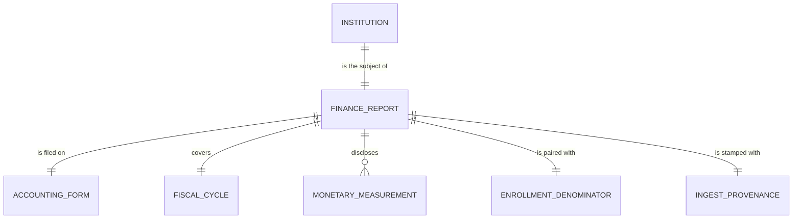

# Conceptual Model: raw-ipeds-finance

**Status:** PROPOSED
**Mode:** Greenfield
**Zone:** Bronze (Raw)
**Domain:** U.S. higher-education institutional finance reporting (IPEDS Finance Survey)
**Spec:** [docs/specs/full-pipeline-ipeds-finance.md](../../docs/specs/full-pipeline-ipeds-finance.md) §3 + §4
**Author:** @doc-generator
**Date:** 2026-04-30
**Approval:** Pending human review (REQUIRE_HUMAN_APPROVAL = true)

---

---

## Entity Descriptions

| Entity | Business Concept | Business Term | Is CDE | Is PII |
|--------|-----------------|---------------|--------|--------|
| Institution | A 4-year postsecondary institution that grants a bachelor's degree or higher and reports to IPEDS. Identified by the IPEDS UNITID — the canonical key joining IPEDS Finance to every other institution-keyed table in the pipeline (College Scorecard, EADA, EFIA, HD). The entity is filtered at ingest time to `ICLEVEL = 1 AND HLOFFER >= 5` (IPEDS-native "4-year, bachelor's-or-above"); 2-year and certificate-only institutions are out of scope. | BT-001 (UNITID), BT-002 (Institution Name) | true (UNITID) | false |
| Finance Report | The institution-level row in the IPEDS Finance Survey for a single fiscal year. Each report rolls up the institution's full financial statements into the IPEDS standard schedule and is the subject of the table — exactly one report per institution per fiscal cycle, on exactly one accounting form. The FY23 cycle is the operative load (FY24 not yet released by NCES as of 2026-04-30). | (proposed) BT-IPF-FINANCE-REPORT | false | false |
| Accounting Form | The IPEDS form variant the institution files on, dictated by sector and accounting basis: F1A (public, GASB), F2 (private nonprofit, FASB), or F3 (private for-profit). The four target fields exist on all three forms but use different column codes (e.g., instruction is `F1C011` / `F2E011` / `F3E011`). The `report_form` column tags each row with its form-of-origin so that downstream consumers can segment by GASB vs FASB vs for-profit. | (proposed) BT-IPF-ACCOUNTING-FORM | false | false |
| Fiscal Cycle | The IPEDS fiscal year the report covers (e.g., FY23 = academic year 2022–23, ending June 30 2023). The cycle is encoded in the source ZIP filename (`F2223_F1A.zip`) and stamped by the ingestor as `fiscal_year = 2023` for the FY23 cycle. NCES typically publishes a cycle ~12–18 months after fiscal close (FY23 published Mar 2025; FY24 expected Sep 2026). | (proposed) BT-IPF-FISCAL-CYCLE | false | false |
| Monetary Measurement | A dollar-denominated financial measurement disclosed on the report. Three measurements are ingested: instruction expenses (the educational product), institutional support expenses (administration / fundraising / executive direction — the marketing-and-overhead signal), and endowment value end-of-year. All three are USD, all three are non-negative when present. F3 institutions structurally do not report endowment (no `F3H` family on the for-profit schedule) — the column is NULL for 100% of F3 rows by design, not a data quality failure. | BT-IPF-INSTRUCTION-EXPENSES, BT-IPF-INSTITUTIONAL-SUPPORT-EXPENSES, BT-IPF-ENDOWMENT-VALUE | true (all three are CDE candidates per spec §6 Data Contract; per-FTE derivations downstream feed the institution-finance profile) | false |
| Enrollment Denominator | The 12-month total FTE enrollment from the IPEDS EFIA (12-Month Instructional Activity) survey, computed as the NULL-safe sum `COALESCE(FTEUG,0) + COALESCE(FTEGD,0) + COALESCE(FTEDPP,0)`, joined to the Finance Report on UNITID. EFIA publishes one row per UNITID — no dedup filter is required (verified 5,959/5,959 unique on EFIA2023). The denominator is paired with the report at ingest time so per-FTE derivations downstream do not need a separate join. **Critical taxonomy note:** the FTE source is **EFIA**, NOT EFFY (which is unduplicated 12-month *headcount*, broken out by `EFFYALEV` and at the wrong grain) and NOT EF Part A `EFTOTLT` (which is fall-snapshot headcount). | BT-IPF-PER-FTE (the convention; the column itself has no separate term) | true (denominator for every per-FTE derivation downstream) | false |
| Ingest Provenance | The pipeline-stamped record of where each row came from, how it was fetched, when, and on what calendar date. Required on every Bronze row by the FutureProof governance contract. The Finance ingest fans out across five files (F1A, F2, F3 finance ZIPs + EFIA + HD) — the `source_url` column is a pipe-delimited list reflecting that fan-out. | — | false | false |
| Imputation Provenance (v1.4) | The IPEDS-published flag indicating how the `endowment_value` measurement was sourced for this institution-cycle. Authoritative semantics (corrected v1.2 against the v1.3-EDA-§7 narrative inversion): `R` = Reported by institution; `A` = **Not applicable** (no endowment fund — exact `A`↔NULL coupling on the corresponding measurement); `N` = Imputed using Nearest Neighbor; `P` = Imputed prior year; `Z` = Imputed zero. NULL on F3 by structure (no `F3H` family). The observed FY2023 domain `{R, A, P, Z, N}` is a strict subset of the IPEDS dictionary's 13-code shared `Xvarname` lookup; future-cycle appearance of any of the 8 unobserved codes is a Significant escalation per RAW-IPF-015. | (proposed) BT-IPF-ENDOWMENT-PROVENANCE | false at raw (becomes CDE at consumable as `endowment_value_provenance`) | false |

---

## Relationship Descriptions

| Relationship | From | To | Cardinality | Description |
|-------------|------|-----|-------------|-------------|
| is the subject of | Institution | Finance Report | one-to-one (per fiscal cycle) | Every 4-year bachelor's-granting institution that reports to IPEDS files exactly one Finance report per fiscal year, on exactly one form. The Bronze table is loaded for one fiscal cycle at a time, so the relationship is functionally one-to-one within a single load. |
| is filed on | Finance Report | Accounting Form | many-to-one | Multiple reports share the same form. The FY23 mix is F1A 30.6% (819) / F2 59.0% (1,579) / F3 10.4% (277). An institution's form assignment is sticky across years (sector conversions are rare); a future cycle showing a sharp form-mix shift would trip a regression tripwire. |
| covers | Finance Report | Fiscal Cycle | many-to-one | Multiple institutions' reports cover the same fiscal year. The current Bronze load covers `fiscal_year=2023` (the FY23 cycle); future loads will add reports for additional cycles, but every row in a single load shares one cycle (enforced by RAW-IPF-013, P0). |
| discloses | Finance Report | Monetary Measurement | one-to-many (3 measurements) | Each report discloses three monetary measurements: `instruction_expenses`, `institutional_support_expenses`, `endowment_value`. IPEDS Finance actually publishes hundreds of additional fields (per-functional-category breakdowns, revenue by source, debt, scholarships, etc.) — we deliberately scope to the three that drive the downstream `marketing_ratio` plus per-FTE derivations per spec §3. F3 endowment is structurally NULL (no `F3H` family) — three measurements logically, two physically present on F3 rows. |
| is paired with | Finance Report | Enrollment Denominator | one-to-one (LEFT JOIN, optional) | Every report joins LEFT to EFIA on UNITID for the FTE denominator. 97.94% of FY23 rows (2,620/2,675) match — the 55 unmatched are typically newly-opened institutions or late EFIA filers. The pairing is optional at the schema level (`total_fte_enrollment` is NULL when EFIA has no row); per-FTE derivations downstream return NULL for the unmatched cohort, which is correct behavior. |
| is stamped with | Finance Report | Ingest Provenance | one-to-one | Every row carries exactly one provenance stamp recording the per-file source URLs (pipe-delimited list of all five files: F1A, F2, F3, EFIA, HD), the fetch method (`bulk_csv_download`), the ingest timestamp (UTC), and the load date. Stamps are identical across all rows in a single batch. |
| carries the imputation provenance for | Finance Report | Imputation Provenance (v1.4) | one-to-one (NULL-allowed; F1A/F2 only) | Each F1A/F2 report carries exactly one imputation flag value for `endowment_value` (NULL when the source CSV cell is blank/`.`/`PrivacySuppressed`; otherwise one of `{R, A, P, Z, N}`). F3 reports carry NULL by structure — no `F3H` family on the for-profit schedule. Validated by RAW-IPF-015 (P0). |

---

## Key Business Concepts

### Grain

The fundamental unit is **one institution in a single IPEDS fiscal cycle**. The current Bronze load (FY23) has 2,675 rows — one per UNITID that filed a Finance survey on F1A, F2, or F3 and passed the `ICLEVEL = 1 AND HLOFFER >= 5` filter. Grain is enforced by RAW-IPF-003 (UNITID uniqueness, P0) and the dedup grain `[unitid]`.

### Three Forms, One Concept

IPEDS publishes three parallel finance forms, mapping to GAAP-equivalent accounting bases:

- **F1A** — public institutions, GASB (Governmental Accounting Standards Board) basis.
- **F2** — private nonprofit, FASB (Financial Accounting Standards Board) basis.
- **F3** — private for-profit (proprietary), simplified schedule.

The four target fields exist on all three forms but use different column codes (see §3 column table in the spec). Coalescing into four canonical raw columns plus a `report_form` tag is the right modeling decision: GASB and FASB produce different *totals* at the institutional level (different fund-accounting conventions), but the *line-item* definitions (instruction = teaching delivery; institutional support = administration / fundraising / executive direction) are byte-equivalent across forms (verified against the IPEDS dictionary varlists, EDA §3). Cross-form per-FTE comparison is sound at the line-item level even though across-form totals are not.

### Two Surveys, Joined at Bronze

Unlike the College Scorecard ingest (single source) or the BEA RPP ingest (single source), this Bronze table joins two IPEDS surveys at ingest time:

- The **Finance Survey** (F1A / F2 / F3) provides expense and endowment dollars.
- The **EFIA (12-Month Instructional Activity)** survey provides the FTE denominator.

The join is done at Bronze (not deferred to Silver) because FTE is a raw upstream attribute of the institution-fiscal-year, not a derivation — every per-FTE rate downstream depends on it. Doing the join at Bronze keeps the Silver derivations (`*_per_fte`, `marketing_ratio`) clean.

### EFIA vs EFFY vs EFTOTLT — The Three-Way Naming Trap

This is the single most load-bearing taxonomy clarification in the spec:

- **`EFIA{YYYY}`** — 12-Month Instructional Activity. **Carries FTE.** One row per UNITID. *This is what we ingest.*
- **`EFFY{YYYY}`** — 12-Month Unduplicated Headcount. *Wrong grain* (broken out by `EFFYALEV` student-level breakdown). Joining naïvely fans out finance rows.
- **EF Part A `EFTOTLT`** — Fall-snapshot headcount. *Wrong concept* (headcount, not FTE; fall snapshot, not 12-month).

Spec v1.0 originally pointed at `EFTOTLT` (a wrong-field bug that would have systematically deflated per-FTE values for institutions with large part-time populations); v1.1 corrected to "EFFY/E12 directly-reported FTE"; v1.3 pre-flight discovered that the operative file is actually `EFIA` (not EFFY at all). The conceptual model uses **Enrollment Denominator** to capture all of this — the entity is "the FTE that pairs with this Finance Report" regardless of which IPEDS file currently carries it.

### F3 Structural NULL on Endowment

For-profit institutions (F3) do not maintain endowments by design — the F3 schedule has no `F3H` family. `endowment_value` is therefore NULL for 100% of F3 rows (277 of 277 in FY23). This is **structural NULL**, not missing data. Two implications:

- RAW-IPF-007 (`endowment_value ≥ 0`) is written **`where non-null`** so it does not trip on the structural absence.
- Spec §6 `data_completeness_tier` correctly classifies F3 rows as `medium` (one structurally absent field of four), not `low` — and this is why the v1.1 tier reformulation moved away from counting derived signals.

### Suppression Sentinels

IPEDS uses `-1`, `-2`, `.` (single period — legacy "not applicable" marker still appearing in modern releases), `""` (blank), and `"PrivacySuppressed"` as suppression markers across numeric columns. The ingestor scrubs all five sentinels to NULL **before type coercion**. EDA observed zero sentinel hits in the FY23 institution-level finance fields (sentinels are predominantly a per-program / per-race-ethnicity phenomenon; institution-totals are essentially always populated when the institution reports). The pre-coercion scrub remains as a safety net against future cycle drift.

### Bureau-Imputed Values

Per §2 Decision #8, NCES bureau-imputed values are accepted as raw values and the parallel imputation-flag columns (`X*` prefix) are NOT stored. Imputation occurs upstream-of-source by NCES, so the raw-zone "faithful to source" rule applies to what NCES publishes (which already includes the imputations), not to what NCES imputed prior to publication. EDA Req 7 measured prevalence ≤1.22% on every analytical field — well-calibrated; the policy should not flip in v1.3.

### Filter: 4-Year Bachelor's-Granting Only

The `ICLEVEL = 1 AND HLOFFER >= 5` filter is applied via a LEFT JOIN to HD2023 (IPEDS Header). This is the IPEDS-native "4-year, bachelor's-or-above" definition:

- `ICLEVEL = 1` — "4 or more years."
- `HLOFFER >= 5` — bachelor's (5), post-bacc cert (6), master's (7), post-master's cert (8), doctorate (9).

Spec v1.0 used `PREDDEG = 3 OR ICLEVEL = 1`, which mixed College Scorecard and IPEDS taxonomies and admitted graduate-only schools that don't grant bachelor's. v1.1 corrected to the IPEDS-native form. The filter narrows 6,163 IPEDS UNITIDs to 2,864, which after joining to the finance forms produces 2,675 surviving rows.

---

## Cross-Source Integration Role

This Bronze table is the canonical landing zone for IPEDS Finance + EFIA + HD. It joins downstream into the FutureProof graph at three points:

| Consumer | Join Key | Role |
|----------|----------|------|
| `base.ipeds_finance` | `unitid` | 1:1 promotion with derivations (`institutional_support_per_fte`, `instruction_per_fte`, `endowment_per_fte`, `marketing_ratio`) |
| `consumable.ipeds_finance_profile` | `unitid` (via `base.ipeds_finance`) | Institution-finance profile with `data_completeness_tier`, raw-dollar passthroughs for downstream EADA composite ratios |
| `consumable.institution_aura` (downstream spec `full-pipeline-eada.md`) | `unitid` (via `base.ipeds_finance`) | Provides the FTE denominator that turns EADA athletic dollars into `athletic_spend_per_fte` (the EADA-side aura input); also provides the per-FTE finance signals that pair with the EADA-side aura inputs |

UNITID overlap with `bronze.college_scorecard_institution` is **98.0%** (2,621 / 2,675). The 54 missing institutions (2.0%) are mostly small religious or specialty institutions that opted out of Title IV reporting (or have suppressed Scorecard rows). The 418 Scorecard-only UNITIDs are predominantly 2-year and certificate-granting institutions correctly excluded by the `ICLEVEL = 1 AND HLOFFER >= 5` filter. This 98% overlap calibrates the downstream silver-zone cross-source coverage threshold to ≥97% (notably higher than the 74.5% EADA overlap — IPEDS Finance is far more comprehensive in 4-year coverage than EADA, which leans heavily on 2-year athletic programs).

---

## Modeling Decisions

1. **`Institution` as the anchor entity.** The grain is one row per institution per fiscal cycle. IPEDS publishes program-level and account-level breakdowns elsewhere — we deliberately do not ingest those. Modeling at the institution level keeps the conceptual story aligned with the row grain.

2. **`Finance Report` as a distinct entity from `Institution`.** Although the table has one row per institution per cycle and could be modeled as a flat "institution with money" entity, the report is conceptually a distinct business object: it has its own provenance (IPEDS reporting mandate), its own form variant, its own cycle, its own measurements, and its own EFIA pairing. Separating them clarifies that a report is a disclosure event the institution makes, not a property of the institution itself.

3. **`Accounting Form` modeled as a first-class entity, not a soft category attribute.** The form has structure (GASB vs FASB vs for-profit), drives column-code coalescing, and segments downstream analysis. EDA §3 confirmed that the line-item definitions are byte-equivalent across forms but the form-level totals are not — modeling the form as an entity makes the segmentation cue explicit.

4. **`Monetary Measurement` as a single entity for all three dollar columns.** Instruction expenses, institutional support expenses, and endowment value share the same shape (USD, non-negative, institution-totals grain). Splitting them into three entity types would add no resolvable structure. They are distinguished by attribute (the `field_name`) at the logical/physical layer.

5. **`Enrollment Denominator` as a distinct entity, not buried as a "FTE attribute" of Finance Report.** The denominator has its own source survey (EFIA, separate from the finance forms), its own grain (one row per UNITID, no `(unitid, fiscal_year)` requirement because EFIA is published once per cycle), and its own integration semantics (LEFT JOIN, NULL-safe sum across three component columns). Modeling it as an entity makes the cross-survey integration visible at the conceptual level — and prevents the recurring naming trap (EFIA vs EFFY vs EFTOTLT) from being papered over as "just an FTE column."

6. **`Fiscal Cycle` as a first-class entity, not a soft year attribute.** The cycle has structure (IPEDS fiscal year, July–June for academic-aligned institutions; calendar year for some F3 institutions) and downstream tables key off `fiscal_year` for vintage comparisons. Modeling it as an entity makes the temporal grain explicit.

7. **`Ingest Provenance` modeled as an entity, not buried as four free-floating attributes.** Lineage, freshness DQ, and audit consume `source_url` / `source_method` / `ingested_at` / `load_date` together. Treating them as one entity makes the governance obligation visible at the conceptual level. Note the URL fan-out (5 files, pipe-delimited) is a property of this Bronze ingest because the join happens at Bronze.

8. **No `Sector` / `Control` / `ICLEVEL` / `HLOFFER` entities in scope.** HD carries useful institution metadata (sector, control, accreditation, region), but spec §3 scopes Bronze to UNITID + institution name + the four finance-survey concepts + the four target fields + provenance. HD is consumed only as a *filter* (the `ICLEVEL = 1 AND HLOFFER >= 5` predicate); its other columns are not landed. Future amendment may pull HD-derived columns into Bronze; the conceptual model leaves the door open.

9. **No `Imputation Flag` entity at v1.0–v1.3 (revised v1.4 — narrowly).** Per v1.3 §2 Decision #8, IPEDS publishes parallel `X*`-prefixed columns indicating whether NCES bureau-imputed each value. v1.0–v1.3 deliberately did not store these flags (≤1.22% prevalence on instruction / institutional support — schema-change cost outweighed the marginal completeness gain). **v1.4 amends this narrowly for the endowment-flag pair only:** the `XF1H02` / `XF2H02` columns are captured at bronze as `endowment_value_flag` because endowment imputation prevalence is meaningfully higher (25–31% on F1A/F2 — decision-relevant for longitudinal consumers, immaterial only at the snapshot grain). The v1.4 amendment introduces the **Imputation Provenance** entity scoped to the endowment-flag column; it is *not* a generic Imputation Flag entity covering all `X*` columns. The other `X*` flag columns remain unstored.

10. **v1.4 — `A`/`N` semantic correction.** The v1.3 EDA §7 narrative inverted the meanings of the `A` and `N` codes (it described `A` as "model-imputed" and `N` as "Not applicable"). The IPEDS Finance FY2023 dictionary is the AUTHORITATIVE source — `A` = **Not applicable** (institution has no endowment fund — exact `A`↔NULL coupling) and `N` = **Imputed using Nearest Neighbor procedure**. Every entry in this conceptual model and every downstream artifact uses the corrected semantics; the v1.3-EDA wording must NOT be propagated.

---

## Scope and Boundaries

- This conceptual model covers the `raw.ipeds_finance` (Iceberg `bronze.ipeds_finance`) table only.
- The companion programs file (`C{YYYY}_A` Completions) and account-level breakdowns are **not ingested** by this pipeline and are not in this model.
- The hundreds of additional fields in F1A / F2 / F3 (per-functional-category breakdowns, revenue by source, debt, scholarships, salaries by category) are out of scope for this Bronze ingest. The marketing-ratio and per-FTE-cost insights downstream only require the four target fields plus the FTE denominator.
- Silver-zone derivations (`base.ipeds_finance.*_per_fte`, `marketing_ratio`) and the Gold-zone profile (`consumable.ipeds_finance_profile.data_completeness_tier`) are downstream consumers, not part of this model.
- The downstream fusion with EADA to produce `consumable.institution_aura` lives in the separate spec `full-pipeline-eada.md` and is not in this model.
- PII: None. IPEDS Finance is institution-level reporting by design; no individual identifiers are present.
