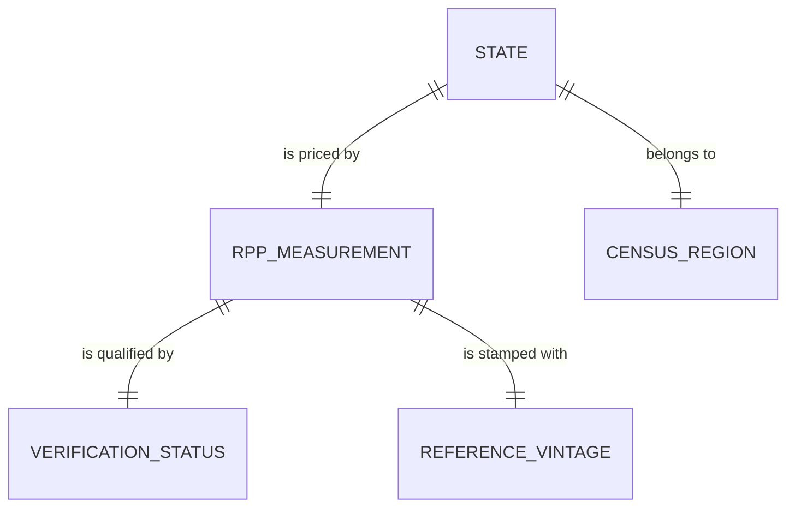

# Conceptual Model: silver-base-bea-rpp

**Status:** PROPOSED
**Mode:** Greenfield
**Zone:** Silver (Base)
**Domain:** Regional Economic Reference / Cost of Living Adjustment
**Spec:** docs/specs/silver-base-bea-rpp.md
**Author:** @semantic-modeler
**Date:** 2026-04-10
**Approval:** Pending human review (REQUIRE_HUMAN_APPROVAL = true)

---

---

## Entity Descriptions

| Entity | Business Concept | Business Term | Is CDE | Is PII |
|--------|-----------------|---------------|--------|--------|
| State | A U.S. state or the District of Columbia, treated uniformly as a geographic unit for regional price comparison. Identified by a FIPS code (the canonical geographic key), a full state name (display form), and a two-letter USPS abbreviation (frontend/MCP tool key). The 51-member set is closed: 50 states plus DC. | BT-100 | true | false |
| RPP Measurement | A regional price parity index value expressing the overall price level of goods and services in a state relative to the national average (national = 100.0). Produced by the U.S. Bureau of Economic Analysis. Each measurement yields a derived Purchasing Power Multiplier (100.0 / rpp_all_items) that scales a national salary to local purchasing power. The measurement is inseparable from its state — one state, one RPP value per vintage. | BT-098 | true | false |
| Census Region | A U.S. Census Bureau grouping of states into one of four regions — Northeast, Midwest, South, West — used to aggregate states for regional comparison. The four-value set is closed and the state-to-region mapping is static Census convention. DC is assigned to South by Census convention despite its Northeast-like RPP (documented quirk, not a bug). | BT-104 | false | false |
| Verification Status | The provenance qualifier on an RPP Measurement that records whether the value came from a live BEA source (`bea_official`) or is a primary-agent estimate pending a BEA refresh (`estimate`). Per-row provenance is required so downstream consumers (Gold, MCP tools, frontend) can surface data quality on a per-state basis. This entity exists to close Bronze HIGH-3 / staff-review Ruling 2 / Condition 6. | BT-105 | false | false |
| Reference Vintage | The year the RPP measurement represents. For the current snapshot all 51 rows share a single vintage (2024). Full-table replacement on refresh (not SCD2) is the supersession strategy. | BT-102 | false | false |

---

## Relationship Descriptions

| Relationship | From | To | Cardinality | Description |
|-------------|------|-----|-------------|-------------|
| is priced by | State | RPP Measurement | one-to-one | Every state has exactly one RPP measurement per vintage. The measurement is the state's cost-of-living signal; the state is the measurement's subject. The bijection is total across the 51-member state set. |
| belongs to | State | Census Region | one-to-one | Every state is assigned to exactly one Census region. The mapping is a static property of U.S. geography. Many states map to each region; the reverse cardinality is one-to-many, but from the state's perspective it is one-to-one. |
| is qualified by | RPP Measurement | Verification Status | one-to-one | Every measurement carries exactly one verification status. Currently 8 measurements are `bea_official` and 43 are `estimate`. When the BEA refresh lands, all 51 become `bea_official`. |
| is stamped with | RPP Measurement | Reference Vintage | one-to-one | Every measurement is tagged with the year it represents. In the current snapshot all 51 measurements share vintage 2024. Future refreshes replace the table wholesale with a new vintage. |

---

## Key Business Concepts

### Grain

The fundamental unit is **one U.S. state (or DC) in a single RPP vintage**. The table has exactly 51 rows: 50 states plus the District of Columbia. FIPS code is the canonical key; state abbreviation and state name are 1:1 synonyms for display and frontend selection. The grain is stable — refreshes replace the table wholesale, never append new rows.

### Regional Price Parity (BT-098)

A BEA-published index where 100.0 represents the national price level. A value of 110.7 (California) means goods and services cost 10.7% more than the national average; a value of 86.9 (Arkansas) means they cost 13.1% less. The index is all-items (not sector-specific) and is the input to the Purchasing Power Multiplier derivation.

### Purchasing Power Multiplier (BT-099)

A pre-computed scalar equal to `100.0 / rpp_all_items`. Multiplying a national salary by this value yields its local purchasing-power equivalent. Pre-computing this in Silver ensures every downstream consumer — Gold, MCP tools, frontend display — reads the same value and never recomputes the formula independently. This is the single source of truth for salary adjustment across the pipeline.

### USPS State Abbreviation (BT-103)

The two-letter uppercase postal code assigned by the USPS for each state and DC (e.g., `CA`, `IA`, `DC`). The 51-member set is closed. This is the key the frontend and MCP tool signatures use to identify a state — not FIPS, not state name. The mapping from FIPS to USPS is a static property of U.S. geography and is derived in Silver via an in-code lookup constant.

### Census Region (BT-104)

One of four U.S. Census Bureau groupings — Northeast, Midwest, South, West — used for regional aggregation. The DC-in-South assignment is a Census convention and not a data quality issue. All four regions must be represented in the 51-row table (DQ P0 rule).

### Verification Status (BT-105)

A per-row provenance label with two values: `bea_official` (the RPP value was obtained from BEA and is authoritative) and `estimate` (the RPP value is a primary-agent estimate pending a BEA refresh). This column was added as a direct response to Bronze HIGH-3 / staff-review Ruling 2 / Condition 6 so that every downstream consumer can surface per-row data quality. In the current snapshot 8 rows are `bea_official` (CA, HI, DC, NJ, AR, MS, IA, OK) and 43 are `estimate`. When the live BEA API refresh lands, all 51 flip to `bea_official` and the P0 DQ rule `COUNT(*) WHERE verification_status='bea_official' = 8` updates to `= 51`.

### Reference Vintage (BT-102)

The year the RPP estimate represents. All 51 rows share vintage 2024. The temporal strategy is full-table replacement on refresh — not SCD2 — so `COUNT(DISTINCT data_year) = 1` is a P0 invariant on the table.

---

## Cross-Source Integration Role

This table is **orthogonal** to the SOC/CIP join graph. It does not participate in cross-source joins at pipeline build time. The join happens at query time in the consuming layer, keyed on the student's selected state (USPS abbreviation or FIPS code):

| Consumer | Join Key | Role |
|----------|----------|------|
| Gold `consumable.regional_price_parities` | state_fips | Direct passthrough with a small reshape; carries verification_status forward per Bronze Condition 7 |
| MCP tool `get_regional_price_parity` | state_abbr | Lookup for frontend display |
| MCP tool `compare_purchasing_power` | state_abbr (pair) | Pair lookup for cross-state comparison |
| Frontend salary-adjustment display | state_abbr | Selects the purchasing_power_multiplier for the student's chosen state |

Every career shown to a student is adjusted by the purchasing_power_multiplier corresponding to their selected state. There is no SOC or CIP dependency.

---

## Modeling Decisions

1. **`State` as the anchor entity, not `Region`.** The row grain is one per state. Region is an attribute that classifies the state, not the primary subject. We chose `State` as the top-level entity name (more business-friendly than `GeographicUnit` and more specific than `Region`, which in this model refers to the Census aggregation, not the row grain).

2. **`state_abbr` as an attribute of `State`, not a separate entity.** Abbreviation is a 1:1 synonym for FIPS — a second identifier that functions as a display/lookup key. It does not carry independent relationships, so promoting it to an entity would add no resolvable structure and would complicate the ER picture. It stays as an attribute of `State` with `BT-103` as its business term. Same treatment for `state_name`.

3. **`RPP Measurement` as a distinct entity from `State`.** Although the table is a single flat row per state, the measurement is conceptually a distinct business object: it has its own provenance (BEA source), its own vintage, its own derived value (the multiplier), and its own verification status. Separating `State` from `RPP Measurement` in the conceptual model clarifies that the table is a join of identity (who) with measurement (what was priced) — and makes the physical flattening an explicit design decision at the logical/physical stage.

4. **`Verification Status` as a first-class entity.** The Bronze staff-review ruling elevated verification provenance from a nice-to-have to a governance requirement (Condition 6). Modeling it as a distinct entity — rather than burying it as a soft attribute — makes the governance intent visible at the conceptual level and ensures the downstream Gold and MCP specs inherit the obligation to carry it forward.

5. **`Census Region` as an external reference entity.** The four-region set is a Census Bureau artifact, not data owned by this pipeline. It is modeled as a reference entity the state belongs to. We do not store the region catalog in any table — the mapping lives in code.

6. **No temporal entity beyond Reference Vintage.** There is a single vintage (2024). The table is replaced wholesale on refresh. This mirrors the BLS OOH modeling decision: static snapshot, single-vintage, no SCD2.

7. **No join-graph modeling.** Unlike BLS OOH or College Scorecard, this table has no SOC or CIP relationships. The join is a query-time concern in the consuming layer, not a pipeline-time join. The conceptual model reflects that absence.

---

## Scope and Boundaries

- This conceptual model covers the `base.bea_rpp` table in the Silver zone only.
- Bronze zone raw data (`bronze.bea_rpp`) is the source but is not modeled here (raw is physical-only per Brightsmith rules).
- Gold zone products (`consumable.regional_price_parities`) are downstream consumers, not part of this model.
- The Census region assignments and USPS abbreviations are static geographic facts, not pipeline-managed data.
- The 51-row row count is closed. There is no growth path for this table beyond refreshing the 51 values.
