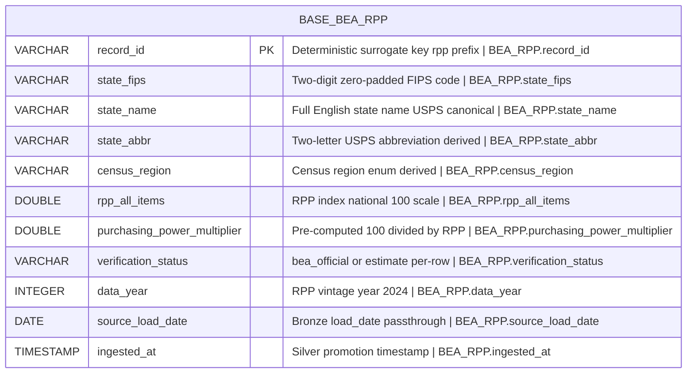

# Physical Model: silver-base-bea-rpp

**Status:** PROPOSED
**Mode:** Greenfield
**Zone:** Silver (Base)
**Domain:** Regional Economic Reference / Cost of Living Adjustment
**Spec:** docs/specs/silver-base-bea-rpp.md
**Logical Model:** governance/models/silver-base-bea-rpp-logical.md
**Conceptual Model:** governance/models/silver-base-bea-rpp-conceptual.md
**Author:** @semantic-modeler
**Date:** 2026-04-10
**Approval:** Pending human review (REQUIRE_HUMAN_APPROVAL = true)

---



---

## Table Definition

| Property | Value |
|----------|-------|
| **Catalog table** | `base.bea_rpp` |
| **Format** | Apache Iceberg (v2) |
| **Engine** | DuckDB (via `iceberg_scan`) |
| **Grain** | One row per U.S. state or DC (`state_fips`) for the current RPP vintage |
| **Natural key** | `state_fips` (UNIQUE, NOT NULL) |
| **Surrogate key** | `record_id` (deterministic SHA-256 hash, prefix `rpp`) |
| **Expected row count** | Exactly 51 rows (50 states + DC). Closed set. |
| **Partition strategy** | **None** (unpartitioned). 51 rows fit in a single partition trivially; partitioning would be pure overhead. |
| **Sort order** | `state_fips ASC` |
| **Write pattern** | Full-table replace via `brightsmith.infra.promote.promote()` (idempotent; re-running produces 0 new rows) |
| **Supersession** | Full-table replacement on refresh. Not SCD2. |

---

## Column Definitions

### State Identity

| Column | DuckDB Type | Nullable | Default | Constraint | Business Term | Is CDE | Is PII | Description |
|--------|-------------|----------|---------|------------|---------------|--------|--------|-------------|
| record_id | VARCHAR | NOT NULL | derived | PRIMARY KEY | BT-015 | false | false | Deterministic surrogate key: `compute_grain_id(row, ['state_fips'], prefix='rpp')`. Format: `rpp-<16 hex chars>`. Stable across pipeline re-runs. |
| state_fips | VARCHAR | NOT NULL | -- | UNIQUE; CHECK (state_fips ~ '^\d{2}$') | BT-100 | true | false | Two-digit zero-padded FIPS code (e.g., `06` California, `11` DC). Canonical geographic key. Carried from `bronze.bea_rpp.geo_fips` (renamed). |
| state_name | VARCHAR | NOT NULL | -- | UNIQUE | BT-101 | false | false | Full English name in USPS canonical form (e.g., `California`, `District of Columbia`). Carried from `bronze.bea_rpp.geo_name` (renamed). Display-only. |
| state_abbr | VARCHAR | NOT NULL | derived | UNIQUE; CHECK (state_abbr ~ '^[A-Z]{2}$') | BT-103 | true | false | Two-letter uppercase USPS abbreviation (e.g., `CA`, `IA`, `DC`). Derived via in-code static FIPS-to-USPS lookup (51-entry closed set). Primary key for frontend and MCP tool signatures. |
| census_region | VARCHAR | NOT NULL | derived | CHECK (census_region IN ('Northeast','Midwest','South','West')) | BT-104 | false | false | U.S. Census Bureau region. Derived via in-code static FIPS-to-region lookup. DC is assigned to `South` per Census convention. |

### RPP Measurement

| Column | DuckDB Type | Nullable | Default | Constraint | Business Term | Is CDE | Is PII | Description |
|--------|-------------|----------|---------|------------|---------------|--------|--------|-------------|
| rpp_all_items | DOUBLE | NOT NULL | -- | CHECK (rpp_all_items BETWEEN 70.0 AND 130.0) | BT-098 | true | false | Regional Price Parity index on the national=100.0 scale. Carried verbatim from Bronze with no rescaling. Passthrough invariant enforced by DQ: every Silver value equals the Bronze value for the same `state_fips`. |
| purchasing_power_multiplier | DOUBLE | NOT NULL | derived | CHECK (purchasing_power_multiplier BETWEEN 0.7 AND 1.3) | BT-099 | true | false | Pre-computed salary scaling factor `100.0 / rpp_all_items`. Single source of truth for salary adjustment across the pipeline. Inverse invariant: `purchasing_power_multiplier * rpp_all_items ≈ 100.0` within tolerance 0.01 (P0 DQ rule). |

### Verification Status

| Column | DuckDB Type | Nullable | Default | Constraint | Business Term | Is CDE | Is PII | Description |
|--------|-------------|----------|---------|------------|---------------|--------|--------|-------------|
| verification_status | VARCHAR | NOT NULL | derived | CHECK (verification_status IN ('bea_official','estimate')) | BT-105 | false | false | Per-row provenance qualifier. Derived from the 8-state BEA-verified allow-list `{'06','15','11','34','05','28','19','40'}` (CA, HI, DC, NJ, AR, MS, IA, OK) → `bea_official`; all 43 others → `estimate`. Closes Bronze HIGH-3 per staff-review Ruling 2 / Condition 6. When the live BEA API refresh lands, all 51 flip to `bea_official` and the P0 DQ rule updates from `= 8` to `= 51`. |

### Reference Vintage

| Column | DuckDB Type | Nullable | Default | Constraint | Business Term | Is CDE | Is PII | Description |
|--------|-------------|----------|---------|------------|---------------|--------|--------|-------------|
| data_year | INTEGER | NOT NULL | -- | CHECK (data_year = 2024) | BT-102 | false | false | RPP vintage year. Constant `2024` in the current snapshot. `COUNT(DISTINCT data_year) = 1` is a P0 invariant — the supersession strategy is full-table replacement, not SCD2. |

### Pipeline Metadata

| Column | DuckDB Type | Nullable | Default | Constraint | Business Term | Is CDE | Is PII | Description |
|--------|-------------|----------|---------|------------|---------------|--------|--------|-------------|
| source_load_date | DATE | NOT NULL | -- | -- | BT-016 | false | false | Date the source data was loaded into the Bronze zone. Carried from `bronze.bea_rpp.load_date` (cast to DATE). |
| ingested_at | TIMESTAMP | NOT NULL | -- | -- | BT-017 | false | false | Timestamp when the row was written to the Silver zone base table. Generated at transformation time via `datetime.now()`. |

---

## Column Summary

| Count | Category |
|-------|----------|
| 11 | Total columns |
| 1 | Primary key (record_id) |
| 1 | Natural key (state_fips) |
| 4 | CDE columns (state_fips, state_abbr, rpp_all_items, purchasing_power_multiplier) |
| 0 | PII columns |
| 0 | Nullable columns |
| 11 | NOT NULL columns |
| 5 | Derived columns (record_id, state_abbr, census_region, purchasing_power_multiplier, verification_status) |
| 3 | Passthrough columns (state_fips, state_name, rpp_all_items) |

---

## PyIceberg Schema Definition

This is the exact schema the Silver transformer must use when creating the Iceberg table via `promote()`.

```python
from pyiceberg.schema import Schema
from pyiceberg.types import (
    DateType,
    DoubleType,
    IntegerType,
    NestedField,
    StringType,
    TimestampType,
)

SCHEMA = Schema(
    NestedField(1, "record_id", StringType(), required=True),
    NestedField(2, "state_fips", StringType(), required=True),
    NestedField(3, "state_name", StringType(), required=True),
    NestedField(4, "state_abbr", StringType(), required=True),
    NestedField(5, "census_region", StringType(), required=True),
    NestedField(6, "rpp_all_items", DoubleType(), required=True),
    NestedField(7, "purchasing_power_multiplier", DoubleType(), required=True),
    NestedField(8, "verification_status", StringType(), required=True),
    NestedField(9, "data_year", IntegerType(), required=True),
    NestedField(10, "source_load_date", DateType(), required=True),
    NestedField(11, "ingested_at", TimestampType(), required=True),
)
```

---

## Derivation Rules (Implementation Expressions)

These are the exact expressions the Silver transformer must implement.

| Column | Expression | Source Fields | Notes |
|--------|-----------|---------------|-------|
| record_id | `compute_grain_id(row, ['state_fips'], prefix='rpp')` | state_fips | SHA-256 truncated to 16 hex chars. Output format: `rpp-<hex>`. Import: `from brightsmith.infra.grain import compute_grain_id` |
| state_fips | Validate zero-padded 2-digit string; strip whitespace; confirm all 51 expected codes present | bronze.bea_rpp.geo_fips | Renamed from Bronze `geo_fips`. |
| state_name | Direct passthrough | bronze.bea_rpp.geo_name | Renamed from Bronze `geo_name`. |
| state_abbr | `FIPS_TO_USPS[state_fips]` — in-code lookup dict | state_fips | Closed 51-entry mapping. See "In-Code Lookup Constants" section below. |
| census_region | `FIPS_TO_CENSUS_REGION[state_fips]` — in-code lookup dict | state_fips | Closed 51-entry mapping. DC → `South`. |
| rpp_all_items | Direct passthrough (cast to DOUBLE) | bronze.bea_rpp.rpp_all_items | Passthrough invariant enforced by DQ. |
| purchasing_power_multiplier | `100.0 / row['rpp_all_items']` | rpp_all_items | Computed in Silver, not Gold. Single source of truth. |
| verification_status | `'bea_official' if state_fips in BEA_VERIFIED_FIPS else 'estimate'` | state_fips | `BEA_VERIFIED_FIPS = {'06','15','11','34','05','28','19','40'}`. |
| data_year | Constant `2024` (or carried from Bronze if materialized there) | -- | Single-vintage invariant. |
| source_load_date | `CAST(bronze_row['load_date'] AS DATE)` | bronze.bea_rpp.load_date | Renamed and cast. |
| ingested_at | `datetime.now()` at transformation time | -- | Generated per run. |

---

## Source-to-Target Mapping

| Physical Column | DuckDB Type | Source Table | Source Field | Transformation |
|-----------------|-------------|--------------|--------------|----------------|
| record_id | VARCHAR | -- | derived | `compute_grain_id(row, ['state_fips'], prefix='rpp')` |
| state_fips | VARCHAR | bronze.bea_rpp | geo_fips | Rename; validate zero-padded 2-digit string |
| state_name | VARCHAR | bronze.bea_rpp | geo_name | Rename; direct passthrough |
| state_abbr | VARCHAR | -- | derived | Static FIPS-to-USPS lookup |
| census_region | VARCHAR | -- | derived | Static FIPS-to-region lookup |
| rpp_all_items | DOUBLE | bronze.bea_rpp | rpp_all_items | Direct passthrough, cast to DOUBLE |
| purchasing_power_multiplier | DOUBLE | -- | derived | `100.0 / rpp_all_items` |
| verification_status | VARCHAR | -- | derived | 8-state allow-list lookup |
| data_year | INTEGER | bronze.bea_rpp | data_year (or constant 2024) | Direct passthrough or constant |
| source_load_date | DATE | bronze.bea_rpp | load_date | Rename, cast to DATE |
| ingested_at | TIMESTAMP | -- | generated | `datetime.now()` at transformation time |

---

## In-Code Lookup Constants

Three static 51-entry or 8-entry constants power the Silver derivations. They are structural properties of U.S. geography and the current verification state — not business-managed entity data — and therefore belong in code, not in a reference table.

### FIPS_TO_USPS (51 entries)

```python
FIPS_TO_USPS = {
    "01": "AL", "02": "AK", "04": "AZ", "05": "AR", "06": "CA", "08": "CO",
    "09": "CT", "10": "DE", "11": "DC", "12": "FL", "13": "GA", "15": "HI",
    "16": "ID", "17": "IL", "18": "IN", "19": "IA", "20": "KS", "21": "KY",
    "22": "LA", "23": "ME", "24": "MD", "25": "MA", "26": "MI", "27": "MN",
    "28": "MS", "29": "MO", "30": "MT", "31": "NE", "32": "NV", "33": "NH",
    "34": "NJ", "35": "NM", "36": "NY", "37": "NC", "38": "ND", "39": "OH",
    "40": "OK", "41": "OR", "42": "PA", "44": "RI", "45": "SC", "46": "SD",
    "47": "TN", "48": "TX", "49": "UT", "50": "VT", "51": "VA", "53": "WA",
    "54": "WV", "55": "WI", "56": "WY",
}
```

### FIPS_TO_CENSUS_REGION (51 entries)

```python
# Canonical U.S. Census Bureau four-region assignment.
# DC is assigned to South per Census convention (documented quirk).
FIPS_TO_CENSUS_REGION = {
    # Northeast (9)
    "09": "Northeast", "23": "Northeast", "25": "Northeast", "33": "Northeast",
    "44": "Northeast", "50": "Northeast", "34": "Northeast", "36": "Northeast",
    "42": "Northeast",
    # Midwest (12)
    "17": "Midwest", "18": "Midwest", "26": "Midwest", "39": "Midwest",
    "55": "Midwest", "19": "Midwest", "20": "Midwest", "27": "Midwest",
    "29": "Midwest", "31": "Midwest", "38": "Midwest", "46": "Midwest",
    # South (17) -- includes DC per Census convention
    "10": "South", "11": "South", "12": "South", "13": "South", "24": "South",
    "37": "South", "45": "South", "51": "South", "54": "South",
    "01": "South", "21": "South", "28": "South", "47": "South",
    "05": "South", "22": "South", "40": "South", "48": "South",
    # West (13)
    "04": "West", "08": "West", "16": "West", "30": "West", "32": "West",
    "35": "West", "49": "West", "56": "West", "02": "West", "06": "West",
    "15": "West", "41": "West", "53": "West",
}
```

### BEA_VERIFIED_FIPS (8 entries)

```python
# The 8 state_fips codes whose RPP values came from a BEA source.
# Closes Bronze HIGH-3 / staff-review Condition 6.
# When the live BEA API refresh lands, this set becomes all 51 codes.
BEA_VERIFIED_FIPS = frozenset({
    "06",  # CA
    "15",  # HI
    "11",  # DC
    "34",  # NJ
    "05",  # AR
    "28",  # MS
    "19",  # IA
    "40",  # OK
})
```

**Exception note:** These lookups fall under the "static structural reference data" exception. If the project's `governance/exceptions/` convention requires a formal filing, @primary-agent should file a short notice at implementation time. The @data-steward has been advised.

---

## Idempotent Promote Pattern

This table is written via `brightsmith.infra.promote.promote()` which guarantees idempotency:

```python
from brightsmith.infra.promote import promote
from brightsmith.infra.grain import compute_grain_id

def transform_silver_bea_rpp(bronze_df):
    # 1. Rename and passthrough
    df = bronze_df.rename(columns={'geo_fips': 'state_fips', 'geo_name': 'state_name'})

    # 2. Derive state_abbr, census_region, verification_status
    df['state_abbr'] = df['state_fips'].map(FIPS_TO_USPS)
    df['census_region'] = df['state_fips'].map(FIPS_TO_CENSUS_REGION)
    df['verification_status'] = df['state_fips'].apply(
        lambda s: 'bea_official' if s in BEA_VERIFIED_FIPS else 'estimate'
    )

    # 3. Pre-compute purchasing_power_multiplier
    df['purchasing_power_multiplier'] = 100.0 / df['rpp_all_items']

    # 4. Constants and metadata
    df['data_year'] = 2024
    df['ingested_at'] = datetime.now()
    df['source_load_date'] = pd.to_datetime(df['load_date']).dt.date

    # 5. Deterministic record_id
    df['record_id'] = df.apply(
        lambda row: compute_grain_id(row, ['state_fips'], prefix='rpp'), axis=1
    )

    # 6. Column order matches SCHEMA
    df = df[[
        'record_id', 'state_fips', 'state_name', 'state_abbr', 'census_region',
        'rpp_all_items', 'purchasing_power_multiplier', 'verification_status',
        'data_year', 'source_load_date', 'ingested_at',
    ]]

    # 7. Idempotent promote
    promote(df, table='base.bea_rpp', schema=SCHEMA, dedup_on=['state_fips'])
```

Idempotency guarantees:
- **Determinism:** `record_id` is a pure function of `state_fips` with a constant prefix. Re-running yields identical hashes.
- **Dedup grain:** `[state_fips]` ensures a re-run with identical input produces zero new rows.
- **Full-table replace semantics:** If the Bronze data changes (refresh), the Silver table is replaced wholesale. No SCD2, no history.
- **Row count invariant:** Exactly 51 rows post-promote. A P0 DQ rule enforces this.

---

## Partition Strategy

**None (unpartitioned).**

Rationale:
- 51 rows is smaller than any reasonable partition boundary. Partitioning adds metadata overhead with zero scan-pruning benefit.
- There is no dimension to partition on: not by region (4 groups of 9–17 rows each is still trivial), not by vintage (single vintage), not by verification (8/43 split is meaningless for a 51-row table).
- Sort order `state_fips ASC` gives natural index-like lookup behavior for the 51 rows without requiring partitioning.
- Matches the pattern for other small reference tables in the project.

---

## Sort Order

`state_fips ASC`

Rationale: state_fips is the natural key and the most common lookup dimension. Sorting by it gives ordered output for downstream scans and is the least-surprising default for a reference table keyed by FIPS.

---

## Nullability Semantics

All 11 columns are NOT NULL. This is a complete closed-set reference table. There are no optional fields, no soft nulls, no "unknown" states. The only per-row softness is the `verification_status = 'estimate'` provenance qualifier on 43 of 51 rows, which is a first-class value in its enum — not missing data.

---

## DDL (Reference)

This DDL is for documentation. The actual table is created via `brightsmith.infra.promote.promote()` which handles Iceberg table creation and idempotent writes.

```sql
-- Reference DDL for base.bea_rpp
-- Engine: DuckDB + Iceberg v2
-- Do not execute directly -- use promote() pattern

CREATE TABLE IF NOT EXISTS base.bea_rpp (
    record_id                       VARCHAR     NOT NULL,
    state_fips                      VARCHAR     NOT NULL,
    state_name                      VARCHAR     NOT NULL,
    state_abbr                      VARCHAR     NOT NULL,
    census_region                   VARCHAR     NOT NULL,
    rpp_all_items                   DOUBLE      NOT NULL,
    purchasing_power_multiplier     DOUBLE      NOT NULL,
    verification_status             VARCHAR     NOT NULL,
    data_year                       INTEGER     NOT NULL,
    source_load_date                DATE        NOT NULL,
    ingested_at                     TIMESTAMP   NOT NULL,

    -- Surrogate key
    PRIMARY KEY (record_id),

    -- Natural key and synonym uniqueness
    UNIQUE (state_fips),
    UNIQUE (state_abbr),
    UNIQUE (state_name),

    -- Domain constraints
    CHECK (state_fips ~ '^\d{2}$'),
    CHECK (state_abbr ~ '^[A-Z]{2}$'),
    CHECK (census_region IN ('Northeast','Midwest','South','West')),
    CHECK (verification_status IN ('bea_official','estimate')),
    CHECK (rpp_all_items BETWEEN 70.0 AND 130.0),
    CHECK (purchasing_power_multiplier BETWEEN 0.7 AND 1.3),
    CHECK (data_year = 2024)
);
```

---

## DQ Rule Alignment

The DQ rules at `governance/dq-rules/silver-base-bea-rpp.json` should align with this physical model. Key constraint correspondences:

| Physical Constraint | Expected DQ Rule ID | Description |
|--------------------|---------------------|-------------|
| Row count = 51 | SLV-BEA-001 | Exactly 51 rows (50 states + DC) |
| state_fips UNIQUE, NOT NULL | SLV-BEA-002 | Natural key integrity |
| state_fips format `^\d{2}$` | SLV-BEA-003 | Two-digit zero-padded string |
| state_abbr NOT NULL, 2 chars, uppercase, canonical 51-set | SLV-BEA-004 | USPS abbreviation validity |
| state_abbr UNIQUE | SLV-BEA-005 | FIPS-to-abbr bijection |
| census_region IN ('Northeast','Midwest','South','West') | SLV-BEA-006 | Closed enum |
| All 4 census regions represented | SLV-BEA-007 | Coverage check |
| rpp_all_items passthrough invariant vs Bronze | SLV-BEA-008 | Referential integrity to source |
| purchasing_power_multiplier range 0.7-1.3 | SLV-BEA-009 | Inverse-of-RPP sanity bound |
| Inverse invariant: multiplier × rpp_all_items ≈ 100.0 ± 0.01 | SLV-BEA-010 | Derivation correctness |
| verification_status IN ('bea_official','estimate') | SLV-BEA-011 | Closed enum |
| COUNT(*) WHERE verification_status='bea_official' = 8 | SLV-BEA-012 | Current Bronze verification state |
| bea_official rows have state_fips in the 8-code allow-list | SLV-BEA-013 | Verification allow-list integrity |
| data_year = 2024 | SLV-BEA-014 | Single-vintage invariant |
| COUNT(DISTINCT data_year) = 1 | SLV-BEA-015 | Supersession contract |
| record_id NOT NULL + UNIQUE | SLV-BEA-016 | Surrogate key integrity |
| state_fips bijection with state_name | SLV-BEA-017 | P1 |
| state_fips bijection with state_abbr | SLV-BEA-018 | P1 |

---

## Traceability: Logical to Physical

| Logical Attribute | Logical Type Domain | Physical Column | Physical DuckDB Type | PyIceberg Type | NestedField ID | Mapping Notes |
|-------------------|--------------------|-----------------|--------------------|----------------|----------------|---------------|
| record_id | identifier | record_id | VARCHAR | StringType | 1 | Hash output is always a string |
| state_fips | identifier | state_fips | VARCHAR | StringType | 2 | Zero-padded 2-digit string, not integer |
| state_name | text | state_name | VARCHAR | StringType | 3 | Direct mapping |
| state_abbr | identifier | state_abbr | VARCHAR | StringType | 4 | 2-char uppercase enum |
| census_region | text | census_region | VARCHAR | StringType | 5 | 4-value enum stored as string |
| rpp_all_items | numeric | rpp_all_items | DOUBLE | DoubleType | 6 | Continuous measure, not integer |
| purchasing_power_multiplier | numeric | purchasing_power_multiplier | DOUBLE | DoubleType | 7 | Continuous derivation, not integer |
| verification_status | text | verification_status | VARCHAR | StringType | 8 | 2-value enum stored as string |
| data_year | numeric | data_year | INTEGER | IntegerType | 9 | Calendar year value, not DATE |
| source_load_date | date | source_load_date | DATE | DateType | 10 | Direct mapping |
| ingested_at | timestamp | ingested_at | TIMESTAMP | TimestampType | 11 | Direct mapping |

---

## Implementation Notes

### Column order

The column order in the physical schema matches the order specified in the spec exactly:
`record_id, state_fips, state_name, state_abbr, census_region, rpp_all_items, purchasing_power_multiplier, verification_status, data_year, source_load_date, ingested_at`.

Note that `verification_status` precedes `data_year` in this order — the spec places it as column 8 of 11, immediately after the derived RPP values and before the vintage metadata. This groups derivations together and keeps the provenance flag next to the measurement it qualifies.

### FIPS stored as string, not integer

`state_fips` must be stored as VARCHAR (not INTEGER) to preserve the zero-padding for codes `01` through `09`. Casting to integer would lose the leading zero and break joins with every other FIPS-keyed table in the ecosystem. This is the same rule already enforced for CIPCODE in the project (`CIPCODE must always be treated as string type`).

### Data_year as INTEGER, not DATE

`data_year` is a calendar-year value used for filtering and for the single-vintage invariant. It is not a date that supports arithmetic. Storing it as INTEGER avoids false precision and makes the `COUNT(DISTINCT data_year) = 1` rule simpler and faster.

### Why both DOUBLE columns are DOUBLE and not DECIMAL

RPP values and the derived multiplier are approximate measures, not currency. BEA publishes RPP with one decimal place of precision. DOUBLE is sufficient for the inverse invariant tolerance of 0.01 and matches the spec type table (`double`).

### verification_status column placement

The column is positioned at index 8 (between `purchasing_power_multiplier` and `data_year`) per the spec. This is the canonical location: immediately after the measurement derivations and before the vintage metadata. Downstream consumers (Gold, MCP) must preserve this ordering per Bronze staff-review Condition 7.

### Future BEA refresh path

When the live BEA API refresh lands post-hackathon:
1. `BEA_VERIFIED_FIPS` expands to all 51 codes.
2. The DQ rule `COUNT(*) WHERE verification_status='bea_official' = 8` flips to `= 51`.
3. Every row's `verification_status` becomes `bea_official`.
4. No schema changes are required.
5. Gold and MCP specs inherit the flipped state automatically via passthrough.

This refresh path is schema-stable by design — the `verification_status` column exists precisely so the refresh is a data change, not a schema change.

---

## Open Issues (Carried from Logical)

| # | Issue | Status | Resolution |
|---|-------|--------|------------|
| 1 | In-code lookup exception filing | OPEN (non-blocking) | @primary-agent to file a short exception note at `governance/exceptions/` if the project convention requires it. The lookups are static structural reference data, not business-managed entity data. |
| 2 | `data_year` as INTEGER vs DATE | RESOLVED | INTEGER. Calendar year value, not a date for arithmetic. |
| 3 | DC's Census region = `South` | RESOLVED | Documented Census convention. DQ rules must accept DC-in-South as valid. |
