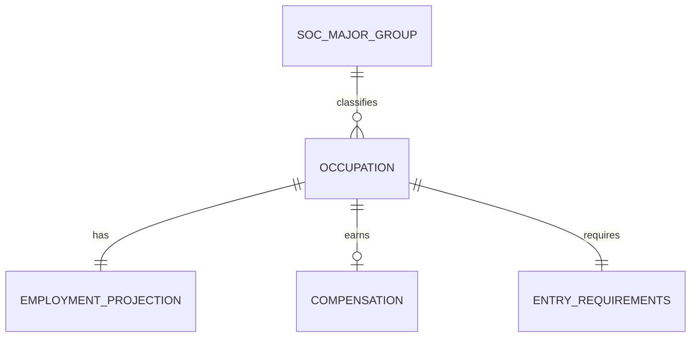

# Conceptual Model: silver-base-bls-ooh

**Status:** APPROVED
**Mode:** Greenfield
**Zone:** Silver (Base)
**Domain:** Occupational Employment Projections
**Spec:** docs/specs/silver-base-bls-ooh.md
**Author:** @semantic-modeler
**Date:** 2026-04-07
**Approval:** Pending human review (REQUIRE_HUMAN_APPROVAL = true)

---

---

## Entity Descriptions

| Entity | Business Concept | Business Term | Is CDE | Is PII |
|--------|-----------------|---------------|--------|--------|
| Occupation | A distinct job category identified by a unique SOC code in the BLS Employment Projections. Represents a single occupation at the detailed or broad level. Each occupation is classified as either a standard detailed occupation, a rolled-up broad occupation (7 codes that aggregate multiple O*NET detailed codes), or a catchall residual category (70 "all other" entries per Silver EDA). This is the SOC-side anchor for the CIP-to-SOC crosswalk that bridges academic programs to career outcomes. | BT-027 | true | false |
| SOC Major Group | One of 22 broad occupation families derived from the 2-digit SOC code prefix (e.g., 15 = Computer and Mathematical, 29 = Healthcare Practitioners and Technical). Provides a higher-level classification for aggregation and fallback grouping when detailed crosswalk matches fail. | BT-029 | false | false |
| Employment Projection | The 10-year employment outlook for an occupation within a single BLS projection cycle. Includes current employment, projected employment, absolute and percentage change, annual average openings, and a derived growth category that buckets the percentage change into human-readable tiers (declining_fast through booming). | BT-031 | true | false |
| Compensation | The median annual wage for an occupation as reported by BLS. Null for 23 occupations where wage data is unavailable (elected officials, self-employed-dominated fields). Includes a wage-capped flag to indicate BLS top-coding and a wage-available convenience flag. This entity backs the ERN stat in the Gold zone. | BT-036 | true | false |
| Entry Requirements | The typical education, work experience, and on-the-job training needed to enter an occupation, as classified by BLS. Each dimension uses a coded integer (education 1-8, experience 1-3, training 1-6) with a corresponding human-readable label. | BT-038 | false | false |

---

## Relationship Descriptions

| Relationship | From | To | Cardinality | Description |
|-------------|------|-----|-------------|-------------|
| classifies | SOC Major Group | Occupation | one-to-many | A SOC major group contains many occupations. Each occupation belongs to exactly one major group (derived from the first 2 digits of its SOC code). The 22 major groups span all 832 occupations. |
| has | Occupation | Employment Projection | one-to-one | Every occupation has exactly one employment projection for a given projection cycle. The current dataset covers the 2024-2034 cycle. |
| earns | Occupation | Compensation | one-to-zero-or-one | An occupation may have compensation data, or it may be null. 23 of 832 occupations lack wage data. Occupations without wages are preserved with a flag rather than dropped. |
| requires | Occupation | Entry Requirements | one-to-one | Every occupation has entry requirement classifications (education, experience, training). These are BLS-assigned codes, not derived. |

---

## Key Business Concepts

### Grain
The fundamental unit of analysis is the **Occupation**: a single SOC code representing one occupation in the BLS Employment Projections. Every row in the base table represents one occupation. The grain is enforced as `soc_code` with zero duplicates allowed (832 unique occupations).

### SOC Code Hierarchy
Occupations are classified using the OMB Standard Occupational Classification (SOC 2018) taxonomy. The hierarchy relevant to this model is:
- **SOC Major Group** (2-digit): Broad occupation family (e.g., 15 = Computer and Mathematical)
- **SOC Code** (XX-XXXX): Specific occupation (e.g., 15-1252 = Software Developers)

The Silver zone preserves the XX-XXXX format from Bronze and derives the major group from the first two characters.

### Broad Occupation Flag (BT-040)
Seven SOC codes in the dataset represent rolled-up/broad occupation categories rather than individual detailed occupations. These aggregate multiple O*NET detailed codes under a single BLS entry. They require special handling in the CIP-to-SOC crosswalk because a single broad code may fan out to multiple detailed O*NET children, producing lower-confidence career guidance.

### Catchall Flag (BT-043)
Approximately 70 occupations are BLS residual categories with titles containing "all other" (e.g., "Managers, all other"). These are legitimate categories with real data, but they represent inherently heterogeneous groupings. Career guidance derived from catchall occupations should carry lower confidence because the occupation mapping is less specific.

### Growth Category (BT-041)
A derived classification that buckets employment change percentage into six human-readable tiers: declining_fast, declining, stable, growing, growing_fast, and booming. Thresholds are based on BLS convention where average 10-year growth is typically 3-5%. This enables intuitive communication of occupation growth prospects in downstream career guidance products.

### Null-Wage Occupations
23 occupations (physicians/surgeons, performers, fishing/hunting workers) lack BLS wage data. These are preserved in the dataset with a `wage_available` flag rather than dropped, because they represent real occupations that students may pursue. The Gold zone must decide how to handle the ERN stat for careers that map to null-wage occupations.

### Projection Cycle (BT-046)
The dataset represents a single BLS projection cycle (2024-2034). BLS releases new projections biennially as a complete replacement. There is no time-series dimension within this dataset; temporal tracking may be added in a future iteration if multiple cycles are retained.

---

## Cross-Source Integration Role

This table is the **SOC-side anchor** for the CIP-to-SOC crosswalk, which is the central integration mechanism in the FutureProof pipeline:

| Table | Taxonomy | Role in Crosswalk |
|-------|----------|-------------------|
| base.college_scorecard | CIP codes (XX.XXXX) | Program side -- what students study |
| **base.bls_ooh** (this model) | **SOC codes (XX-XXXX)** | **Occupation side -- where graduates work** |
| CIP-SOC crosswalk (future spec) | CIP + SOC | Bridge table joining the two |

The broad occupation flag and catchall flag directly serve the crosswalk by signaling which occupations produce lower-confidence joins. The SOC major group enables fallback grouping when detailed crosswalk matches fail.

---

## Modeling Decisions

1. **Occupation as the central entity.** The grain of the source data (one row per SOC code) naturally maps to a single "Occupation" entity. Unlike the College Scorecard model (which has a multi-field composite grain), this table has a simple single-field grain.

2. **Employment Projection as a separate entity.** Employment figures (current, projected, change, growth category) form a cohesive concept -- the 10-year outlook for an occupation. Modeling them as a distinct entity from Occupation identity clarifies the boundary between "what the occupation is" and "how its employment is changing."

3. **Compensation as an optional entity.** 23 of 832 occupations have null wages. Modeling compensation as one-to-zero-or-one (rather than embedding it in Occupation) makes the optionality explicit and signals to downstream consumers that wage data is not universal. The `wage_available` and `median_wage_capped` flags are part of this entity because they qualify the wage value.

4. **Entry Requirements as a separate entity.** Education, experience, and training form a distinct business concept -- the barriers to entry for an occupation. Each has both a coded integer and a human-readable label. Grouping them preserves the semantic relationship between these three dimensions of workforce readiness.

5. **SOC Major Group as a classification entity.** Like CIP Family in the College Scorecard model, SOC Major Group is derived from the SOC code but represents a meaningful business grouping used for aggregation, fallback matching, and dashboard segmentation. The 22 major groups are a well-established BLS taxonomy.

6. **No temporal entity.** The dataset is a single projection cycle snapshot (2024-2034). Source Load Date and Ingestion Timestamp are pipeline metadata attributes on Occupation, not a separate time dimension. This mirrors the College Scorecard modeling decision and may evolve if multiple projection cycles are retained.

7. **Classification flags on Occupation, not separate entities.** The broad_occupation_flag and catchall_flag are attributes of Occupation rather than separate entities because they describe the nature of the occupation record itself (broad vs. detailed, catchall vs. specific). They do not represent independent business concepts with their own identity or relationships.

---

## Scope and Boundaries

- This conceptual model covers the `base.bls_ooh` table in the Silver zone only
- Bronze zone raw data (`raw.bls_ooh`) is the source but is not modeled here (raw is physical-only per Brightsmith rules)
- Gold zone products (ERN stat, GRW stat, boss fights) are downstream consumers, not part of this model
- The CIP-to-SOC crosswalk is a separate Silver spec and not included here
- O*NET data (task-level occupation detail) is a separate future source and not included here
- This model assumes 832 rows (all occupations from Bronze, including broad and catchall categories)
