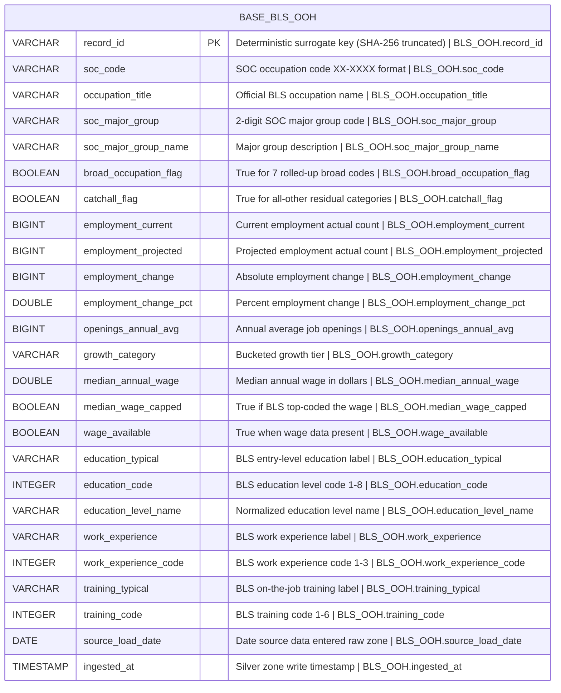

# Physical Model: silver-base-bls-ooh

**Status:** APPROVED
**Mode:** Greenfield
**Zone:** Silver (Base)
**Domain:** Occupational Employment Projections
**Spec:** docs/specs/silver-base-bls-ooh.md
**Logical Model:** governance/models/silver-base-bls-ooh-logical.md
**Conceptual Model:** governance/models/silver-base-bls-ooh-conceptual.md
**Author:** @semantic-modeler
**Date:** 2026-04-07
**Approval:** Pending human review (REQUIRE_HUMAN_APPROVAL = true)

---



---

## Table Definition

| Property | Value |
|----------|-------|
| **Catalog table** | `base.bls_ooh` |
| **Format** | Apache Iceberg (v2) |
| **Engine** | DuckDB (via `iceberg_scan`) |
| **Grain** | One row per occupation (soc_code) |
| **Natural key** | `soc_code` |
| **Surrogate key** | `record_id` (deterministic SHA-256 hash, prefix `ooh`) |
| **Expected row count** | 832 |
| **Partition strategy** | None (832 rows fits in a single partition) |
| **Sort order** | `soc_code ASC` |
| **Write pattern** | Full table replace via `brightsmith.infra.promote.promote()` (idempotent) |

---

## Column Definitions

### Occupation (Core Identity)

| Column | DuckDB Type | Nullable | Default | Constraint | Business Term | Is CDE | Is PII | Description |
|--------|-------------|----------|---------|------------|---------------|--------|--------|-------------|
| record_id | VARCHAR | NOT NULL | derived | PRIMARY KEY | BT-015 | false | false | Deterministic surrogate key: `compute_grain_id(row, ['soc_code'], prefix='ooh')`. Format: `ooh-<16 hex chars>`. Stable across pipeline re-runs. |
| soc_code | VARCHAR | NOT NULL | -- | UNIQUE; CHECK (soc_code ~ '^\d{2}-\d{4}$') | BT-027 | true | false | SOC occupation code in XX-XXXX format. Natural key. Primary join key for O*NET and CIP-SOC crosswalk. Source field: `soc_code`. |
| occupation_title | VARCHAR | NOT NULL | -- | -- | BT-028 | false | false | Official BLS occupation name. Each SOC code maps to exactly one title. Source field: `occupation_title`. |

### SOC Major Group (Classification)

| Column | DuckDB Type | Nullable | Default | Constraint | Business Term | Is CDE | Is PII | Description |
|--------|-------------|----------|---------|------------|---------------|--------|--------|-------------|
| soc_major_group | VARCHAR | NOT NULL | -- | CHECK (soc_major_group IN ('11','13','15','17','19','21','23','25','27','29','31','33','35','37','39','41','43','45','47','49','51','53')) | BT-029 | false | false | 2-digit SOC major group code. Derived: first 2 characters of soc_code. One of 22 valid codes. |
| soc_major_group_name | VARCHAR | NOT NULL | -- | -- | BT-030 | false | false | Human-readable label for the SOC major group. Derived via lookup from soc_major_group against 22-group SOC taxonomy. |

### Classification Flags

| Column | DuckDB Type | Nullable | Default | Constraint | Business Term | Is CDE | Is PII | Description |
|--------|-------------|----------|---------|------------|---------------|--------|--------|-------------|
| broad_occupation_flag | BOOLEAN | NOT NULL | -- | -- | BT-040 | false | false | True for 7 rolled-up/broad occupation codes (13-1020, 13-2020, 29-2010, 31-1120, 39-7010, 47-4090, 51-2090). Derived from hardcoded SOC list. |
| catchall_flag | BOOLEAN | NOT NULL | -- | -- | BT-043 | false | false | True for occupations with "all other" in title (case-insensitive). Derived from occupation_title substring match. |

### Employment & Projections

| Column | DuckDB Type | Nullable | Default | Constraint | Business Term | Is CDE | Is PII | Description |
|--------|-------------|----------|---------|------------|---------------|--------|--------|-------------|
| employment_current | BIGINT | NULLABLE | NULL | CHECK (employment_current IS NULL OR employment_current > 0) | BT-031 | true | false | Current employment (actual count, converted from thousands in Bronze). Source field: `employment_current`. |
| employment_projected | BIGINT | NULLABLE | NULL | CHECK (employment_projected IS NULL OR employment_projected > 0) | BT-032 | true | false | Projected employment at end of 10-year horizon (actual count). Source field: `employment_projected`. |
| employment_change | BIGINT | NULLABLE | NULL | -- | BT-033 | false | false | Absolute change in employment (projected minus current). Can be negative for declining occupations. Source field: `employment_change`. |
| employment_change_pct | DOUBLE | NULLABLE | NULL | CHECK (employment_change_pct IS NULL OR (employment_change_pct >= -50.0 AND employment_change_pct <= 60.0)) | BT-034 | true | false | Percentage change in employment over projection cycle. Can be negative. Backs GRW stat. Source field: `employment_change_pct`. |
| openings_annual_avg | BIGINT | NULLABLE | NULL | CHECK (openings_annual_avg IS NULL OR openings_annual_avg >= 0) | BT-035 | false | false | Projected annual average job openings (growth + replacement). Non-negative. Source field: `openings_annual_avg`. |
| growth_category | VARCHAR | NULLABLE | NULL | CHECK (growth_category IS NULL OR growth_category IN ('declining_fast', 'declining', 'stable', 'growing', 'growing_fast', 'booming')) | BT-041 | false | false | Derived categorical growth tier bucketing employment_change_pct. Null only when employment_change_pct is null. |

### Compensation

| Column | DuckDB Type | Nullable | Default | Constraint | Business Term | Is CDE | Is PII | Description |
|--------|-------------|----------|---------|------------|---------------|--------|--------|-------------|
| median_annual_wage | DOUBLE | NULLABLE | NULL | CHECK (median_annual_wage IS NULL OR (median_annual_wage >= 25000 AND median_annual_wage <= 250000)) | BT-036 | true | false | Median annual wage in dollars. Null for 23 occupations where BLS does not report wage data. Backs ERN stat. Source field: `median_annual_wage`. |
| median_wage_capped | BOOLEAN | NOT NULL | -- | -- | BT-037 | false | false | True if BLS top-coded the wage at $239,200. Currently 0 True values in the interactive export. Source field: `median_wage_capped`. |
| wage_available | BOOLEAN | NOT NULL | -- | -- | BT-042 | false | false | Derived convenience flag: True when median_annual_wage is not null. 809 True, 23 False expected. |

### Education & Entry Requirements

| Column | DuckDB Type | Nullable | Default | Constraint | Business Term | Is CDE | Is PII | Description |
|--------|-------------|----------|---------|------------|---------------|--------|--------|-------------|
| education_typical | VARCHAR | NULLABLE | NULL | -- | -- | false | false | Typical entry-level education label as reported by BLS (original text). Source field: `education_typical`. |
| education_code | INTEGER | NULLABLE | NULL | CHECK (education_code IS NULL OR (education_code >= 1 AND education_code <= 8)) | BT-038 | false | false | BLS education level code (1=Doctoral through 8=No formal credential). Categorical, not aggregatable. Source field: `education_code`. |
| education_level_name | VARCHAR | NULLABLE | NULL | CHECK (education_level_name IS NULL OR education_level_name IN ('Doctoral or professional degree', 'Master''s degree', 'Bachelor''s degree', 'Associate''s degree', 'Postsecondary nondegree award', 'Some college, no degree', 'High school diploma or equivalent', 'No formal educational credential')) | BT-039 | false | false | Normalized education level label derived from education_code via lookup. |
| work_experience | VARCHAR | NULLABLE | NULL | -- | -- | false | false | Work experience requirement label as reported by BLS (original text). Source field: `work_experience`. |
| work_experience_code | INTEGER | NULLABLE | NULL | CHECK (work_experience_code IS NULL OR (work_experience_code >= 1 AND work_experience_code <= 3)) | BT-044 | false | false | BLS work experience code (1=5+ years, 2=Less than 5 years, 3=None). Source field: `work_experience_code`. |
| training_typical | VARCHAR | NULLABLE | NULL | -- | -- | false | false | Typical on-the-job training label as reported by BLS (original text). Source field: `training_typical`. |
| training_code | INTEGER | NULLABLE | NULL | CHECK (training_code IS NULL OR (training_code >= 1 AND training_code <= 6)) | BT-045 | false | false | BLS training code (1=Internship/residency through 6=None). Source field: `training_code`. |

### Pipeline Metadata

| Column | DuckDB Type | Nullable | Default | Constraint | Business Term | Is CDE | Is PII | Description |
|--------|-------------|----------|---------|------------|---------------|--------|--------|-------------|
| source_load_date | DATE | NOT NULL | -- | -- | BT-016 | false | false | Date the source data was loaded into the raw zone. Source field: `load_date` (renamed). |
| ingested_at | TIMESTAMP | NOT NULL | -- | -- | BT-017 | false | false | Timestamp when the row was written to the Silver zone base table. Generated at transformation time via `datetime.now()`. |

---

## Column Summary

| Count | Category |
|-------|----------|
| 25 | Total columns |
| 1 | Primary key (record_id) |
| 1 | Natural key component (soc_code) |
| 5 | CDE columns (soc_code, employment_current, employment_projected, employment_change_pct, median_annual_wage) |
| 0 | PII columns |
| 12 | Nullable columns |
| 13 | NOT NULL columns |
| 8 | Derived columns (record_id, soc_major_group, soc_major_group_name, broad_occupation_flag, catchall_flag, growth_category, wage_available, education_level_name) |

---

## PyIceberg Schema Definition

This is the exact schema the Silver transformer must use when creating the Iceberg table via `promote()`.

```python
from pyiceberg.schema import Schema
from pyiceberg.types import (
    BooleanType,
    DateType,
    DoubleType,
    IntegerType,
    LongType,
    NestedField,
    StringType,
    TimestampType,
)

SCHEMA = Schema(
    NestedField(1, "record_id", StringType(), required=True),
    NestedField(2, "soc_code", StringType(), required=True),
    NestedField(3, "occupation_title", StringType(), required=True),
    NestedField(4, "soc_major_group", StringType(), required=True),
    NestedField(5, "soc_major_group_name", StringType(), required=True),
    NestedField(6, "broad_occupation_flag", BooleanType(), required=True),
    NestedField(7, "catchall_flag", BooleanType(), required=True),
    NestedField(8, "employment_current", LongType(), required=False),
    NestedField(9, "employment_projected", LongType(), required=False),
    NestedField(10, "employment_change", LongType(), required=False),
    NestedField(11, "employment_change_pct", DoubleType(), required=False),
    NestedField(12, "openings_annual_avg", LongType(), required=False),
    NestedField(13, "growth_category", StringType(), required=False),
    NestedField(14, "median_annual_wage", DoubleType(), required=False),
    NestedField(15, "median_wage_capped", BooleanType(), required=True),
    NestedField(16, "wage_available", BooleanType(), required=True),
    NestedField(17, "education_typical", StringType(), required=False),
    NestedField(18, "education_code", IntegerType(), required=False),
    NestedField(19, "education_level_name", StringType(), required=False),
    NestedField(20, "work_experience", StringType(), required=False),
    NestedField(21, "work_experience_code", IntegerType(), required=False),
    NestedField(22, "training_typical", StringType(), required=False),
    NestedField(23, "training_code", IntegerType(), required=False),
    NestedField(24, "source_load_date", DateType(), required=True),
    NestedField(25, "ingested_at", TimestampType(), required=True),
)
```

---

## Derivation Rules (Implementation Expressions)

These are the exact expressions the Silver transformer must implement.

| Column | Expression | Source Fields | Notes |
|--------|-----------|---------------|-------|
| record_id | `compute_grain_id(row, ['soc_code'], prefix='ooh')` | soc_code | SHA-256 truncated to 16 hex chars. Output format: `ooh-<hex>`. Import: `from brightsmith.infra.grain import compute_grain_id` |
| soc_major_group | `soc_code[:2]` | soc_code | First 2 characters of the XX-XXXX SOC code. |
| soc_major_group_name | `SOC_MAJOR_GROUP_LOOKUP[soc_major_group]` | soc_major_group | Lookup against 22-group SOC taxonomy dictionary. All 22 codes must resolve. |
| broad_occupation_flag | `soc_code IN ('13-1020','13-2020','29-2010','31-1120','39-7010','47-4090','51-2090')` | soc_code | Hardcoded list from Bronze SOC audit. Do NOT pattern-match. |
| catchall_flag | `'all other' in occupation_title.lower()` | occupation_title | Case-insensitive substring match. |
| growth_category | `CASE WHEN pct < -10 THEN 'declining_fast' WHEN pct < -1 THEN 'declining' WHEN pct < 1 THEN 'stable' WHEN pct < 10 THEN 'growing' WHEN pct < 20 THEN 'growing_fast' ELSE 'booming' END` | employment_change_pct | Half-open intervals. Null when employment_change_pct is null. |
| wage_available | `median_annual_wage IS NOT NULL` | median_annual_wage | SQL: `CASE WHEN median_annual_wage IS NOT NULL THEN TRUE ELSE FALSE END` |
| education_level_name | `EDUCATION_LEVEL_LOOKUP[education_code]` | education_code | 8-row lookup: 1=Doctoral or professional degree, 2=Master's degree, 3=Bachelor's degree, 4=Associate's degree, 5=Postsecondary nondegree award, 6=Some college no degree, 7=High school diploma or equivalent, 8=No formal educational credential. Null when education_code is null. |
| source_load_date | `CAST(raw_load_date AS DATE)` | load_date (raw) | Renamed from Bronze `load_date`. |
| ingested_at | `CURRENT_TIMESTAMP` | -- | Generated at Silver transformation time. |

---

## DDL (Reference)

This DDL is for documentation. The actual table is created via `brightsmith.infra.promote.promote()` which handles Iceberg table creation and idempotent writes.

```sql
-- Reference DDL for base.bls_ooh
-- Engine: DuckDB + Iceberg v2
-- Do not execute directly -- use promote() pattern

CREATE TABLE IF NOT EXISTS base.bls_ooh (
    record_id               VARCHAR     NOT NULL,
    soc_code                VARCHAR     NOT NULL,
    occupation_title        VARCHAR     NOT NULL,
    soc_major_group         VARCHAR     NOT NULL,
    soc_major_group_name    VARCHAR     NOT NULL,
    broad_occupation_flag   BOOLEAN     NOT NULL,
    catchall_flag           BOOLEAN     NOT NULL,
    employment_current      BIGINT,
    employment_projected    BIGINT,
    employment_change       BIGINT,
    employment_change_pct   DOUBLE,
    openings_annual_avg     BIGINT,
    growth_category         VARCHAR,
    median_annual_wage      DOUBLE,
    median_wage_capped      BOOLEAN     NOT NULL,
    wage_available          BOOLEAN     NOT NULL,
    education_typical       VARCHAR,
    education_code          INTEGER,
    education_level_name    VARCHAR,
    work_experience         VARCHAR,
    work_experience_code    INTEGER,
    training_typical        VARCHAR,
    training_code           INTEGER,
    source_load_date        DATE        NOT NULL,
    ingested_at             TIMESTAMP   NOT NULL,

    -- Surrogate key
    PRIMARY KEY (record_id),

    -- Natural key uniqueness (enforced at load time, not by Iceberg)
    UNIQUE (soc_code),

    -- Domain constraints
    CHECK (soc_code ~ '^\d{2}-\d{4}$'),
    CHECK (soc_major_group IN ('11','13','15','17','19','21','23','25','27','29','31','33','35','37','39','41','43','45','47','49','51','53')),
    CHECK (employment_current IS NULL OR employment_current > 0),
    CHECK (employment_projected IS NULL OR employment_projected > 0),
    CHECK (employment_change_pct IS NULL OR (employment_change_pct >= -50.0 AND employment_change_pct <= 60.0)),
    CHECK (openings_annual_avg IS NULL OR openings_annual_avg >= 0),
    CHECK (growth_category IS NULL OR growth_category IN ('declining_fast', 'declining', 'stable', 'growing', 'growing_fast', 'booming')),
    CHECK (median_annual_wage IS NULL OR (median_annual_wage >= 25000 AND median_annual_wage <= 250000)),
    CHECK (education_code IS NULL OR (education_code >= 1 AND education_code <= 8)),
    CHECK (education_level_name IS NULL OR education_level_name IN (
        'Doctoral or professional degree', 'Master''s degree', 'Bachelor''s degree',
        'Associate''s degree', 'Postsecondary nondegree award', 'Some college, no degree',
        'High school diploma or equivalent', 'No formal educational credential'
    )),
    CHECK (work_experience_code IS NULL OR (work_experience_code >= 1 AND work_experience_code <= 3)),
    CHECK (training_code IS NULL OR (training_code >= 1 AND training_code <= 6))
);
```

---

## Source-to-Target Mapping

| Physical Column | DuckDB Type | Source Table | Source Field | Transformation |
|-----------------|-------------|-------------|--------------|----------------|
| record_id | VARCHAR | -- | derived | `compute_grain_id(row, ['soc_code'], prefix='ooh')` |
| soc_code | VARCHAR | raw.bls_ooh | soc_code | Direct (pass through, already XX-XXXX format) |
| occupation_title | VARCHAR | raw.bls_ooh | occupation_title | Direct |
| soc_major_group | VARCHAR | -- | derived from soc_code | `soc_code[:2]` |
| soc_major_group_name | VARCHAR | -- | derived from soc_major_group | SOC 22-group taxonomy lookup |
| broad_occupation_flag | BOOLEAN | -- | derived from soc_code | Hardcoded 7-code list membership test |
| catchall_flag | BOOLEAN | -- | derived from occupation_title | Case-insensitive "all other" substring match |
| employment_current | BIGINT | raw.bls_ooh | employment_current | Direct (already actual count from Bronze) |
| employment_projected | BIGINT | raw.bls_ooh | employment_projected | Direct (already actual count from Bronze) |
| employment_change | BIGINT | raw.bls_ooh | employment_change | Direct (already actual count from Bronze) |
| employment_change_pct | DOUBLE | raw.bls_ooh | employment_change_pct | Direct |
| openings_annual_avg | BIGINT | raw.bls_ooh | openings_annual_avg | Direct (already actual count from Bronze) |
| growth_category | VARCHAR | -- | derived from employment_change_pct | 6-tier bucketing per threshold table |
| median_annual_wage | DOUBLE | raw.bls_ooh | median_annual_wage | Direct (NULL preserved) |
| median_wage_capped | BOOLEAN | raw.bls_ooh | median_wage_capped | Direct |
| wage_available | BOOLEAN | -- | derived from median_annual_wage | `median_annual_wage IS NOT NULL` |
| education_typical | VARCHAR | raw.bls_ooh | education_typical | Direct |
| education_code | INTEGER | raw.bls_ooh | education_code | Direct (cast to INTEGER) |
| education_level_name | VARCHAR | -- | derived from education_code | 8-row education level lookup |
| work_experience | VARCHAR | raw.bls_ooh | work_experience | Direct |
| work_experience_code | INTEGER | raw.bls_ooh | work_experience_code | Direct (cast to INTEGER) |
| training_typical | VARCHAR | raw.bls_ooh | training_typical | Direct |
| training_code | INTEGER | raw.bls_ooh | training_code | Direct (cast to INTEGER) |
| source_load_date | DATE | raw.bls_ooh | load_date | Renamed, cast to DATE |
| ingested_at | TIMESTAMP | -- | generated | `CURRENT_TIMESTAMP` at transformation time |

---

## Nullability Semantics

Null values carry specific business meaning in this table:

| Column | NULL Means |
|--------|-----------|
| employment_current | BLS did not provide employment data for this occupation (defensive; 0 nulls expected in current cycle) |
| employment_projected | BLS did not provide projected employment for this occupation (defensive; 0 nulls expected) |
| employment_change | BLS did not provide change data (defensive; 0 nulls expected) |
| employment_change_pct | Insufficient data for projection percentage (defensive; 0 nulls expected) |
| openings_annual_avg | BLS did not provide openings data (defensive; 0 nulls expected) |
| growth_category | employment_change_pct is null, so no tier can be assigned |
| median_annual_wage | BLS does not report wage data for this occupation (23 occupations: physicians/surgeons, performers, dental specialists, fishing/hunting) |
| education_typical | BLS did not classify this occupation's education requirement (defensive; 0 nulls expected) |
| education_code | BLS did not provide an education level code (defensive; 0 nulls expected) |
| education_level_name | education_code is null, so no label can be derived |
| work_experience | BLS did not classify this occupation's experience requirement (defensive; 0 nulls expected) |
| work_experience_code | BLS did not provide a work experience code (defensive; 0 nulls expected) |
| training_typical | BLS did not classify this occupation's training requirement (defensive; 0 nulls expected) |
| training_code | BLS did not provide a training code (defensive; 0 nulls expected) |

Expected null rates from EDA:
- median_annual_wage: 2.8% (23 of 832)
- All other nullable fields: 0% in current data (nullable as defensive measure)

---

## DQ Rule Alignment

The DQ rules at `governance/dq-rules/silver-base-bls-ooh.json` are aligned with this physical model. Key constraint correspondences:

| Physical Constraint | DQ Rule |
|--------------------|---------|
| soc_code UNIQUE | SLV-OOH-001 |
| soc_code format regex | SLV-OOH-002 |
| Row count = 832 | SLV-OOH-003 |
| soc_major_group valid 22 codes | SLV-OOH-004 |
| soc_major_group derived correctly | SLV-OOH-006 |
| record_id NOT NULL + unique | SLV-OOH-007 |
| broad_occupation_flag = 7 True | SLV-OOH-010 |
| catchall_flag = 70 True | SLV-OOH-011 |
| employment_current > 0 | SLV-OOH-015 |
| employment_projected > 0 | SLV-OOH-016 |
| employment_change_pct range | SLV-OOH-017 |
| openings_annual_avg >= 0 | SLV-OOH-018 |
| growth_category valid enum | SLV-OOH-019 |
| growth_category bucketing correct | SLV-OOH-021 |
| median_annual_wage range | SLV-OOH-022 |
| median_annual_wage 23 nulls | SLV-OOH-023 |
| wage_available = (wage IS NOT NULL) | SLV-OOH-024 |
| education_code range 1-8 | SLV-OOH-028 |
| work_experience_code range 1-3 | SLV-OOH-029 |
| training_code range 1-6 | SLV-OOH-030 |
| education_level_name referential integrity | SLV-OOH-031 |

---

## Traceability: Logical to Physical

| Logical Attribute | Logical Type Domain | Physical Column | Physical DuckDB Type | PyIceberg Type | NestedField ID | Mapping Notes |
|-------------------|--------------------|-----------------|--------------------|----------------|----------------|---------------|
| record_id | identifier | record_id | VARCHAR | StringType | 1 | Hash output is always a string |
| soc_code | identifier | soc_code | VARCHAR | StringType | 2 | XX-XXXX format requires string |
| occupation_title | text | occupation_title | VARCHAR | StringType | 3 | Direct mapping |
| soc_major_group | identifier | soc_major_group | VARCHAR | StringType | 4 | 2-digit code kept as string for leading zeros |
| soc_major_group_name | text | soc_major_group_name | VARCHAR | StringType | 5 | Direct mapping |
| broad_occupation_flag | boolean | broad_occupation_flag | BOOLEAN | BooleanType | 6 | Direct mapping |
| catchall_flag | boolean | catchall_flag | BOOLEAN | BooleanType | 7 | Direct mapping |
| employment_current | numeric | employment_current | BIGINT | LongType | 8 | Integer counts use BIGINT/LongType |
| employment_projected | numeric | employment_projected | BIGINT | LongType | 9 | Integer counts use BIGINT/LongType |
| employment_change | numeric | employment_change | BIGINT | LongType | 10 | Integer counts use BIGINT/LongType |
| employment_change_pct | numeric | employment_change_pct | DOUBLE | DoubleType | 11 | Percentage uses DOUBLE |
| openings_annual_avg | numeric | openings_annual_avg | BIGINT | LongType | 12 | Integer counts use BIGINT/LongType |
| growth_category | text | growth_category | VARCHAR | StringType | 13 | Enum stored as string |
| median_annual_wage | numeric | median_annual_wage | DOUBLE | DoubleType | 14 | Monetary values use DOUBLE |
| median_wage_capped | boolean | median_wage_capped | BOOLEAN | BooleanType | 15 | Direct mapping |
| wage_available | boolean | wage_available | BOOLEAN | BooleanType | 16 | Direct mapping |
| education_typical | text | education_typical | VARCHAR | StringType | 17 | Direct mapping |
| education_code | numeric | education_code | INTEGER | IntegerType | 18 | Categorical code, not aggregatable |
| education_level_name | text | education_level_name | VARCHAR | StringType | 19 | Direct mapping |
| work_experience | text | work_experience | VARCHAR | StringType | 20 | Direct mapping |
| work_experience_code | numeric | work_experience_code | INTEGER | IntegerType | 21 | Categorical code, not aggregatable |
| training_typical | text | training_typical | VARCHAR | StringType | 22 | Direct mapping |
| training_code | numeric | training_code | INTEGER | IntegerType | 23 | Categorical code, not aggregatable |
| source_load_date | date | source_load_date | DATE | DateType | 24 | Direct mapping |
| ingested_at | timestamp | ingested_at | TIMESTAMP | TimestampType | 25 | Direct mapping |

---

## Implementation Notes

### Sort order rationale

Sort order `soc_code ASC` aligns with the natural key and supports efficient range scans when filtering by occupation or SOC major group (since SOC codes sort lexicographically by major group). This is the most common access pattern for downstream Gold zone queries and CIP-SOC crosswalk joins.

### Integer codes are categorical, not aggregatable

`education_code`, `work_experience_code`, and `training_code` are typed as INTEGER (not DOUBLE) because they are categorical classification codes. Values represent discrete levels, not continuous measures. Do not SUM, AVG, or otherwise aggregate these fields.

### Spec type mapping decisions

The spec uses shorthand type names that map to PyIceberg types as follows:
- `string` = StringType (DuckDB VARCHAR)
- `long` = LongType (DuckDB BIGINT)
- `double` = DoubleType (DuckDB DOUBLE)
- `boolean` = BooleanType (DuckDB BOOLEAN)
- `int` = IntegerType (DuckDB INTEGER)
- `date` = DateType (DuckDB DATE)
- `timestamp` = TimestampType (DuckDB TIMESTAMP)

### Wage range bounds from DQ rules

The median_annual_wage CHECK constraint uses $25,000-$250,000 bounds from DQ rule SLV-OOH-022, which set a wider range than the EDA-observed $30,160-$238,380 for robustness against future data changes.

### Employment change percentage range from DQ rules

The employment_change_pct CHECK constraint uses -50.0 to +60.0 bounds from DQ rule SLV-OOH-017, which provides ~40% headroom beyond the EDA-observed range of -36.1 to +49.9.

---

## Open Issues (Carried from Logical)

| # | Issue | Status | Resolution |
|---|-------|--------|------------|
| 1 | education_typical, work_experience, training_typical have no business glossary terms | OPEN (non-blocking) | Original BLS text labels. Coded/normalized versions have terms. @data-steward may propose terms if needed downstream. |
| 2 | record_id uses BT-015, source_load_date uses BT-016, ingested_at uses BT-017 (shared with College Scorecard) | RESOLVED | These are cross-model pipeline infrastructure terms. Reuse confirmed since they have identical semantics. |
