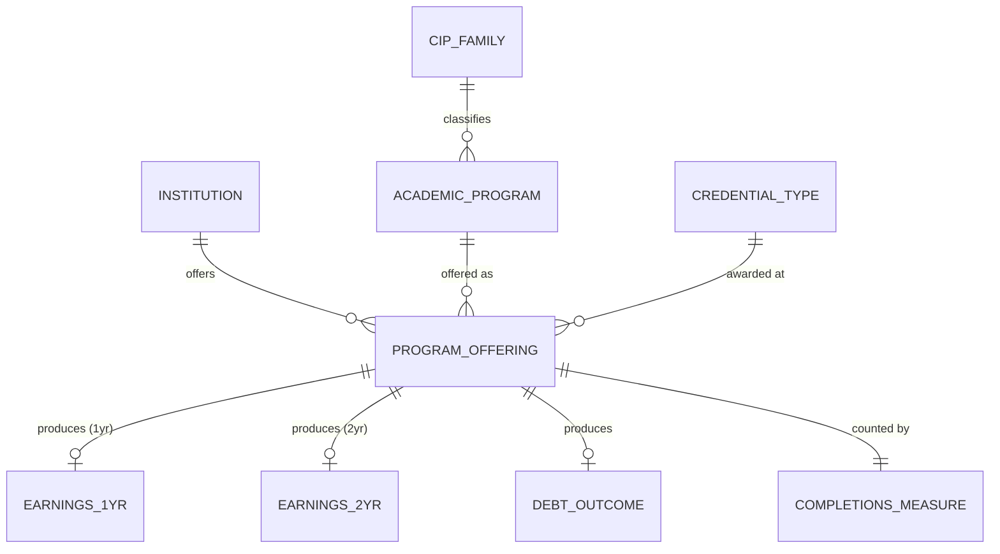

# Conceptual Model: silver-base-college-scorecard

**Status:** PROPOSED (Rev 2 — incorporates human feedback)
**Mode:** Greenfield
**Zone:** Silver (Base)
**Domain:** Higher Education Outcomes
**Spec:** docs/specs/silver-base-college-scorecard.md
**Author:** @semantic-modeler
**Date:** 2026-04-06
**Approval:** Pending human review (REQUIRE_HUMAN_APPROVAL = true)

---

---

## Entity Descriptions

| Entity | Business Concept | Business Term | Is CDE | Is PII |
|--------|-----------------|---------------|--------|--------|
| Institution | A postsecondary institution identified by a unique IPEDS identifier. Represents a single campus or branch. Includes control type (public, private nonprofit, private for-profit) for downstream segmentation. | BT-001 | true | false |
| Academic Program | A field of study classified by a CIP code. Represents what students study, independent of where or at what level. | BT-003 | false | false |
| CIP Family | A broad discipline grouping derived from the 2-digit CIP code prefix. Provides a higher-level classification of academic programs (e.g., Business, Health, Engineering). | BT-005 | false | false |
| Credential Type | The level of academic credential awarded (e.g., Bachelor's Degree). Classifies the award tier of a program offering. | BT-007 | false | false |
| Program Offering | The central business entity: a specific academic program offered at a specific institution at a specific credential level. This is the grain of the College Scorecard dataset (unitid x cipcode x credlev). Each offering has a deterministic Record ID. | BT-015 | false | false |
| Earnings 1yr | Post-completion earnings for graduates measured 1 year after completion. Cohort-level aggregate, subject to independent privacy suppression. 3,050 rows have 1yr data without 2yr data. | BT-009 | true | false |
| Earnings 2yr | Post-completion earnings for graduates measured 2 years after completion. Different cohort than 1yr (not longitudinal). Suppresses independently — 5,535 rows have 2yr data without 1yr data. | BT-010 | true | false |
| Debt Outcome | Median cumulative federal loan debt for graduates of a program offering. Subject to privacy suppression when cohorts are small. | BT-011 | true | false |
| Completions Measure | IPEDS-reported count of students completing a program offering, with two measurement windows. Drives the Small Cohort Flag, which indicates programs with fewer than 30 completers whose outcome data may be privacy-suppressed. | BT-012 | false | false |

---

## Relationship Descriptions

| Relationship | From | To | Cardinality | Description |
|-------------|------|-----|-------------|-------------|
| offers | Institution | Program Offering | one-to-many | An institution offers many program offerings. Each program offering belongs to exactly one institution. |
| offered as | Academic Program | Program Offering | one-to-many | An academic program can be offered at many institutions. Each program offering maps to exactly one academic program. |
| awarded at | Credential Type | Program Offering | one-to-many | A credential type applies to many program offerings. Each program offering awards exactly one credential type. In MVP, only Bachelor's (level 3) is present. |
| classifies | CIP Family | Academic Program | one-to-many | A CIP family groups many academic programs. Each academic program belongs to exactly one CIP family (derived from the first 2 digits of the CIP code). |
| produces (1yr) | Program Offering | Earnings 1yr | one-to-zero-or-one | A program offering may have 1-year post-completion earnings, or null due to privacy suppression. Suppresses independently from 2yr — 12.3% of rows have data for one window but not the other. |
| produces (2yr) | Program Offering | Earnings 2yr | one-to-zero-or-one | A program offering may have 2-year post-completion earnings, or null due to privacy suppression. Different cohort from 1yr (not longitudinal tracking). |
| produces (debt) | Program Offering | Debt Outcome | one-to-zero-or-one | A program offering may have debt data, or it may be null due to privacy suppression. |
| counted by | Program Offering | Completions Measure | one-to-one | Every program offering has completions counts (which may be zero or null). The small cohort flag is derived from these counts. |

---

## Key Business Concepts

### Grain
The fundamental unit of analysis is the **Program Offering**: a specific academic program at a specific institution at a specific credential level. Every row in the base table represents one program offering. The grain is enforced as `unitid x cipcode x credlev` with zero duplicates allowed.

### Privacy Suppression (BT-013)
The U.S. Department of Education suppresses earnings and debt data when program cohorts are too small to protect student privacy under FERPA. The effective threshold is approximately 30 completers. Programs with 30+ completers have ~89% earnings data availability; programs below 10 completers have under 11%. Suppressed values appear as null -- they are not removed from the dataset.

### Small Cohort Flag (BT-014)
A derived indicator that flags program offerings with fewer than 30 completers. These programs are retained in the dataset but marked as having potentially unreliable or suppressed outcome data. This flag supports downstream consumers in filtering or caveating low-confidence results.

### CIP Code Hierarchy
Academic programs are classified using the NCES Classification of Instructional Programs taxonomy. The hierarchy is:
- **CIP Family** (2-digit): Broad discipline area (e.g., 52 = Business)
- **CIP Code** (XX.XXXX): Specific program (e.g., 52.0201 = Business Administration)

The Silver zone normalizes raw 4-digit codes into the standard XX.XXXX format and derives the CIP family from the first two characters.

### Earnings Measurement Windows
The 1-year and 2-year earnings figures come from different graduating cohorts measured at different time points. They are NOT the same individuals tracked longitudinally. It is valid for 2-year earnings to be lower than 1-year earnings.

**Suppression independence confirmed from Bronze data:**
| Pattern | Count | Pct |
|---------|-------|-----|
| Both present | 22,146 | 31.7% |
| Both null | 39,216 | 56.1% |
| 1yr only | 3,050 | 4.4% |
| 2yr only | 5,535 | 7.9% |

12.3% of rows have data for one window but not the other. This is why they are modeled as separate entities.

---

## Modeling Decisions

1. **Program Offering as the central entity.** The grain of the source data (unitid x cipcode x credlev) naturally maps to a "program offering" concept -- the intersection of institution, program, and credential level.

2. **Earnings split into 1yr and 2yr entities.** Bronze data confirms independent suppression: 3,050 rows have 1yr only, 5,535 have 2yr only (12.3% differ). Since they suppress independently AND come from different cohorts, they are modeled as separate optional entities rather than a single Earnings Outcome. This prevents downstream consumers from incorrectly treating them as always-together or longitudinal.

2b. **Institution control type added.** The Institution entity now includes control type (public / private nonprofit / private for-profit). This field exists in the College Scorecard source data (CONTROL field) and is required for Gold zone segmentation — career outcome distributions vary significantly by institution type.

3. **CIP Family as a distinct entity.** CIP Family is derived from CIP Code but represents a meaningful business grouping used for aggregation and filtering in downstream Gold zone products. Modeling it separately captures the classification hierarchy.

4. **Completions as a separate entity.** Completions counts drive the Small Cohort Flag and the privacy suppression behavior. They are a measurement concept distinct from the outcomes they gatekeep.

5. **Credential Type kept as an entity** even though MVP has only one value (Bachelor's = 3). The data model should support future credential levels without restructuring.

6. **No temporal entity.** The current dataset is a point-in-time snapshot (single load date). Source Load Date and Ingestion Timestamp are pipeline metadata attributes on Program Offering, not a separate time dimension. This may evolve if the spec adds historical tracking.

---

## Scope and Boundaries

- This conceptual model covers the `base.college_scorecard` table in the Silver zone only
- Bronze zone raw data is the source but is not modeled here (raw is physical-only per Brightsmith rules)
- Gold zone products (debt-to-earnings ratios, rankings) are downstream consumers, not part of this model
- CIP-to-SOC crosswalk is a separate Silver spec and not included here
- The model assumes the `md_earn_wne` field has been dropped per spec (confirmed structurally empty at this grain)
