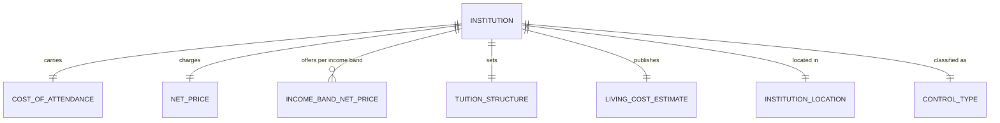

# Conceptual Model: silver-base-college-scorecard-institution

**Status:** PROPOSED
**Mode:** Greenfield
**Zone:** Silver (Base)
**Domain:** Higher Education Institutional Finance
**Spec:** docs/specs/raw-ingest-college-scorecard-institution.md
**Author:** @semantic-modeler
**Date:** 2026-04-14
**Approval:** Pending human review (REQUIRE_HUMAN_APPROVAL = true)

---

---

## Entity Descriptions

| Entity | Business Concept | Business Term | Is CDE | Is PII |
|--------|-----------------|---------------|--------|--------|
| Institution | A Title IV postsecondary institution offering a predominantly bachelor's degree program, identified by IPEDS UNITID. This model is scoped to 4-year institutions only (PREDDEG=3 or ICLEVEL=1). One row per institution is the grain. | BT-001 | true | false |
| Control Type | The governance classification of an institution: Public, Private nonprofit, or Private for-profit. This label is the routing key that decides which net-price population applies (public vs private) and segments Gold zone aggregates. | *pending* | false | false |
| Institution Location | The U.S. state where the institution is physically located, represented by a 2-letter USPS state abbreviation. Drives regional comparisons (e.g., BEA RPP joins) and state-level filters in the Gold zone. | BT-103 | false | false |
| Cost of Attendance | The full annual "sticker price" of attending an institution -- tuition, fees, books, supplies, room & board, and living expenses combined. Represents the cost before any financial aid is applied. Two raw variants exist (academic-year vs program-year); the Silver zone exposes a single unified annual figure plus a 4-year total. | BT-110 | true | false |
| Net Price | The average annual out-of-pocket cost a student actually pays after grants and scholarships are subtracted from Cost of Attendance. The authoritative figure students use to plan savings, earnings, and loans. The raw data splits this across two populations (public-school population, private-school population); the Silver zone routes each institution to the correct population using Control Type and exposes a single unified figure plus a 4-year total. | BT-111 | true | false |
| Income Band Net Price | Net Price broken down by the student's family-income bracket. Five ordered bands span from the lowest income quintile ($0-$30K) to the highest ($110K+). Lower-income families typically receive more aid and therefore face lower net prices. The raw data splits each band across public/private populations; the Silver zone exposes a single unified figure per band using Control Type to route. | BT-112 | true | false |
| Tuition Structure | The published tuition-and-fees price for an institution, reported separately for in-state and out-of-state residents. Tuition is a *component* of Cost of Attendance, not a substitute for it -- it excludes books, supplies, housing, and living expenses. Carried through for receipt/provenance display in the Gold zone. | BT-110 | false | false |
| Living Cost Estimate | The institution-published estimates of non-tuition living costs: on-campus room & board, off-campus room & board, and books & supplies. Carried through alongside Tuition Structure to reconstruct the Cost of Attendance total on demand. | BT-110 | false | false |

---

## Relationship Descriptions

| Relationship | From | To | Cardinality | Description |
|-------------|------|-----|-------------|-------------|
| classified as | Institution | Control Type | one-to-one | Every institution has exactly one control classification. This label is the routing key for Net Price and Income Band Net Price (public institutions read the public net-price population; private nonprofit and private for-profit both read the private net-price population). |
| located in | Institution | Institution Location | one-to-one | Every institution reports exactly one U.S. state via 2-letter USPS abbreviation. Required, never null. |
| carries | Institution | Cost of Attendance | one-to-one | Every institution has exactly one unified Cost of Attendance annual figure in the model. The underlying source offers two variants (academic-year, program-year); the Silver zone picks the available one via COALESCE. The measure itself can be null when the institution reports neither variant. |
| charges | Institution | Net Price | one-to-one | Every institution has exactly one unified Net Price annual figure. The value is null when the institution did not report the relevant (public or private) net-price population. |
| offers per income band | Institution | Income Band Net Price | one-to-many (5) | Every institution has up to 5 Income Band Net Price measures, one per income bracket. Each band is independently nullable -- suppression and reporting gaps occur per bracket. |
| sets | Institution | Tuition Structure | one-to-one | Every institution has one Tuition Structure, comprising in-state and out-of-state tuition. Both components are independently nullable. |
| publishes | Institution | Living Cost Estimate | one-to-one | Every institution has one Living Cost Estimate, comprising on-campus room & board, off-campus room & board, and books & supplies. Each component is independently nullable. |

---

## Key Business Concepts

### Grain
The fundamental unit of analysis is the **Institution**. Every row in `base.college_scorecard_institution` represents exactly one institution identified by UNITID. The grain is enforced as `unitid` with zero duplicates allowed.

### Scope: Bachelor's-Granting 4-Year Institutions
Only institutions with `PREDDEG=3` (predominantly bachelor's) OR `ICLEVEL=1` (4-year institution) are included. Community colleges, certificate mills, and graduate-only institutions are filtered out at the Bronze zone. Expected cardinality: ~6,500 institutions.

### Control-Based Net-Price Routing
The College Scorecard reports Net Price in two separate populations:
- `NPT4_PUB` — net price computed over students at public institutions
- `NPT4_PRIV` — net price computed over students at private institutions

A given institution has a value in only one population. The Silver zone uses `Control Type` as the routing key to produce a single `net_price_annual` attribute per institution:

| Control Type | Source Population |
|--------------|------------------|
| Public | `NPT4_PUB` |
| Private nonprofit | `NPT4_PRIV` |
| Private for-profit | `NPT4_PRIV` |

The same routing rule applies to all five Income Band Net Price measures (`npt41_*` through `npt45_*`). This is a modeling decision, not a derivation artifact -- the conceptual model exposes one Net Price entity per institution, not two.

### Cost of Attendance Coalescing
The source reports Cost of Attendance in two variants that are mutually exclusive per institution:
- `COSTT4_A` — academic-year calendar institutions
- `COSTT4_P` — program-year calendar institutions

The Silver zone exposes a single `cost_of_attendance_annual` via `COALESCE(costt4_a, costt4_p)`. Conceptually both variants represent the same business concept; the split is a calendar artifact at the source and is flattened in Silver.

### 4-Year Horizon Totals
Students borrow and plan over a 4-year enrollment horizon. The Silver zone derives 4-year totals (`net_price_4yr = net_price_annual × 4`, `cost_of_attendance_4yr = cost_of_attendance_annual × 4`) as first-class measures so the Gold ROI formula can use them directly without re-multiplying. The multiplication assumes flat year-over-year pricing, which is a documented simplification (real-world tuition inflates).

### Sticker Price vs Net Price
The two measures answer different questions:
- **Cost of Attendance** — "What does the school charge?" (sticker price, pre-aid)
- **Net Price** — "What do students actually pay?" (post-aid, out-of-pocket)

Net Price is strictly less than or equal to Cost of Attendance for any given institution -- this is a tolerance rule enforced in DQ at Silver.

### Tuition is Not COA
Tuition Structure (`tuitionfee_in`, `tuitionfee_out`) is carried through for display/receipts but is **not** the same thing as Cost of Attendance. Tuition excludes books, supplies, housing, and living expenses. Downstream consumers MUST use `cost_of_attendance_annual` or `net_price_annual` for total-cost calculations. Tuition fields exist only so receipts can show the cost breakdown.

### Privacy and Suppression
Unlike the field-of-study file, the institution-level file does not apply aggressive privacy suppression (there is no small-cohort dimension at the institution grain). However, missing values still occur:
- Institutions may not report a figure to IPEDS in a given cycle
- Institutions classified as one control type may have nulls in the opposing population's fields (public institutions have null `npt4_priv` by design)

The Silver zone preserves nulls as nulls -- the control-based routing guarantees the unified `net_price_annual` selects the correct population. Null in `net_price_annual` means the institution did not report to its own population.

### Cross-Source Join Contract
`unitid` is the authoritative join key to the field-of-study file (`base.college_scorecard`). The Gold zone relies on a LEFT JOIN from `consumable.career_outcomes` (program grain: unitid × cipcode × credlev) onto this table (institution grain: unitid). Every institution in this model may match many rows in the field-of-study data; a row here may have zero matches if the institution offers no bachelor's-level programs with reported outcomes.

---

## Modeling Decisions

1. **Institution as the single central entity.** The source file is already at institution grain with one row per UNITID. No splitting is needed -- all cost/price/tuition measures attach to the Institution entity as satellite concepts.

2. **Control Type modeled as its own entity rather than a plain attribute.** Control Type is not just a label -- it is the **routing key** that determines how Net Price and Income Band Net Price are resolved from the raw data. Elevating it to an entity makes this business semantics explicit and preserves it across the logical → physical transition.

3. **Cost of Attendance modeled as a single entity, not two.** Although the source splits into `costt4_a` and `costt4_p`, these are mutually exclusive per institution (a school is either academic-year or program-year) and represent the same business concept. The Silver zone coalesces them. Raw fields are carried through for provenance.

4. **Net Price modeled as a single entity, not two.** Same rationale as Cost of Attendance: the public/private split is a population artifact at the source, not a business distinction. Every institution belongs to exactly one population. The unified Net Price is the business-meaningful measure; the raw pub/priv fields are carried through for provenance and governance audit.

5. **Income Band Net Price as a single entity spanning 5 bands.** An alternative was to model 5 separate entities (one per band). Rejected: the bands are strictly ordered slices of the same measure -- modeling them as a 5-valued entity keeps the conceptual model readable and matches how downstream consumers use them (a monotone lookup by income bracket).

6. **Tuition Structure and Living Cost Estimate modeled separately from Cost of Attendance.** Tuition is a *component* of COA, not a substitute for it. Surfacing Tuition Structure as its own entity makes it impossible for a downstream consumer to accidentally treat `tuitionfee_in` as a total-cost figure. Same reasoning for Living Cost Estimate (room & board, books).

7. **4-year totals modeled as derived attributes, not their own entities.** `net_price_4yr` and `cost_of_attendance_4yr` are pure multiplicative derivations of the annual figures and do not carry independent semantics. They live on the Cost of Attendance and Net Price entities as computed attributes.

8. **No temporal entity.** The current dataset is a point-in-time snapshot (single `load_date`). Source Load Date and Ingestion Timestamp are pipeline metadata attributes on the Institution entity, not a separate time dimension. Consistent with `silver-base-college-scorecard`.

9. **Raw pub/priv fields carried through.** Per governance reviewer feedback, all 10 raw quintile fields (`npt41_pub` … `npt45_priv`) and both raw average net price fields (`npt4_pub`, `npt4_priv`) and both raw COA fields (`costt4_a`, `costt4_p`) are carried through to Silver as-is alongside the unified/derived fields. This preserves the provenance chain for audit and chaos-monkey verification -- no information is destroyed during Silver transformation. This is reflected in the logical and physical models; at the conceptual level these provenance fields are implementation detail and are not separately modeled.

---

## Scope and Boundaries

- This conceptual model covers the `base.college_scorecard_institution` table in the Silver zone only.
- Bronze zone raw data (`raw.college_scorecard_institution`) is the source but is not modeled here (raw is physical-only per Brightsmith rules).
- The LEFT JOIN enrichment of `consumable.career_outcomes` happens in the Gold zone and is a downstream concern, not part of this model.
- Cross-cycle historical tracking is out of scope -- this model assumes a single snapshot per load date.
- The model does not cover non-cost institution attributes (admissions, test scores, completion rates, demographics). Those may be added in future specs if needed.

---

## Open Issues

| # | Issue | Impact | Resolution Path |
|---|-------|--------|----------------|
| 1 | `Control Type` has no dedicated business term in the glossary | Cannot assign a BT-XXX reference to the Control Type entity. Glossary contains BT-001 (UNITID), BT-110/111/112 (cost terms), and BT-103 (State Abbreviation) but no "Institution Control Type" term. | @data-steward should propose a new business term (e.g., "Institution Control Type") before physical model is marked APPROVED. Non-blocking for logical/physical draft -- placeholder `*pending*` is used. |
