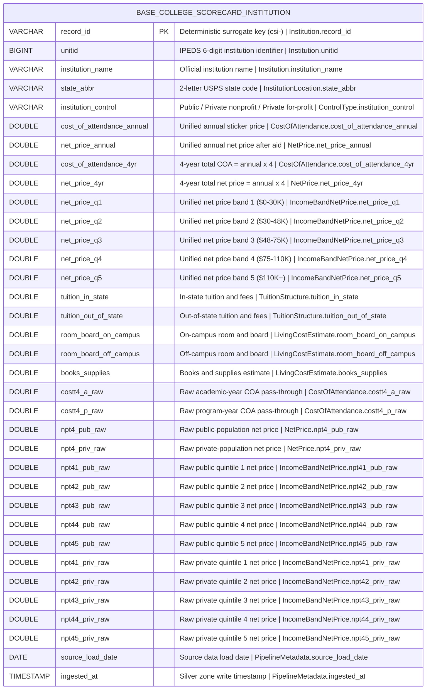

# Physical Model: silver-base-college-scorecard-institution

**Status:** PROPOSED
**Mode:** Greenfield
**Zone:** Silver (Base)
**Domain:** Higher Education Institutional Finance
**Spec:** docs/specs/raw-ingest-college-scorecard-institution.md
**Logical Model:** governance/models/silver-base-college-scorecard-institution-logical.md
**Conceptual Model:** governance/models/silver-base-college-scorecard-institution-conceptual.md
**Author:** @semantic-modeler
**Date:** 2026-04-14
**Approval:** Pending human review (REQUIRE_HUMAN_APPROVAL = true)

---



---

## Table Definition

| Property | Value |
|----------|-------|
| **Catalog table** | `base.college_scorecard_institution` |
| **Format** | Apache Iceberg (v2) |
| **Engine** | DuckDB (via `iceberg_scan`) / PyIceberg writer |
| **Grain** | One row per institution (UNITID) |
| **Natural key** | `unitid` |
| **Surrogate key** | `record_id` (deterministic SHA-256 hash, prefix `csi`) |
| **Expected row count** | ~6,500 (after PREDDEG=3 / ICLEVEL=1 filter) |
| **Partition strategy** | None (dataset is small; single partition). Optional future: `bucket(16, unitid)` if join performance becomes a bottleneck. |
| **Sort order** | `unitid ASC` |
| **Write pattern** | Full table replace via `brightsmith.infra.promote.promote()` (idempotent) |

---

## Column Definitions

### Institution (Core Identity)

| Column | DuckDB Type | PyIceberg Type | Nullable | Default | Constraint | Business Term | Is CDE | Is PII | Description |
|--------|-------------|----------------|----------|---------|------------|---------------|--------|--------|-------------|
| record_id | VARCHAR | StringType | NOT NULL | derived | PRIMARY KEY | BT-001 | false | false | Deterministic surrogate: `compute_grain_id(row, ['unitid'], prefix='csi')`. Format: `csi-<16 hex chars>`. |
| unitid | BIGINT | LongType | NOT NULL | -- | UNIQUE; CHECK (unitid > 0) | BT-001 | true | false | IPEDS 6-digit institution identifier. Natural key. Source field: `unitid`. |
| institution_name | VARCHAR | StringType | NOT NULL | -- | -- | BT-002 | false | false | Official institution name as reported to IPEDS. Source field: `instnm`. |

### Institution Location

| Column | DuckDB Type | PyIceberg Type | Nullable | Default | Constraint | Business Term | Is CDE | Is PII | Description |
|--------|-------------|----------------|----------|---------|------------|---------------|--------|--------|-------------|
| state_abbr | VARCHAR | StringType | NOT NULL | -- | CHECK (state_abbr ~ '^[A-Z]{2}$') | BT-103 | false | false | 2-letter USPS state abbreviation. Source field: `stabbr`. |

### Control Type

| Column | DuckDB Type | PyIceberg Type | Nullable | Default | Constraint | Business Term | Is CDE | Is PII | Description |
|--------|-------------|----------------|----------|---------|------------|---------------|--------|--------|-------------|
| institution_control | VARCHAR | StringType | NOT NULL | -- | CHECK (institution_control IN ('Public','Private nonprofit','Private for-profit')) | *pending* | false | false | Governance classification. Derived from raw integer `control`: 1→'Public', 2→'Private nonprofit', 3→'Private for-profit'. Drives public/private routing for Net Price and Income Band Net Price. |

### Cost of Attendance

| Column | DuckDB Type | PyIceberg Type | Nullable | Default | Constraint | Business Term | Is CDE | Is PII | Description |
|--------|-------------|----------------|----------|---------|------------|---------------|--------|--------|-------------|
| cost_of_attendance_annual | DOUBLE | DoubleType | NULLABLE | NULL | CHECK (cost_of_attendance_annual IS NULL OR (cost_of_attendance_annual BETWEEN 5000 AND 100000)) | BT-110 | true | false | Unified annual COA. Derived: `COALESCE(costt4_a, costt4_p)`. |
| cost_of_attendance_4yr | DOUBLE | DoubleType | NULLABLE | NULL | CHECK (cost_of_attendance_4yr IS NULL OR (cost_of_attendance_4yr BETWEEN 20000 AND 400000)) | BT-110 | true | false | 4-year total COA = `cost_of_attendance_annual × 4`. Null iff annual is null. |
| costt4_a_raw | DOUBLE | DoubleType | NULLABLE | NULL | CHECK (costt4_a_raw IS NULL OR costt4_a_raw >= 0) | BT-110 | false | false | Raw academic-year COA pass-through. Source: `costt4_a`. |
| costt4_p_raw | DOUBLE | DoubleType | NULLABLE | NULL | CHECK (costt4_p_raw IS NULL OR costt4_p_raw >= 0) | BT-110 | false | false | Raw program-year COA pass-through. Source: `costt4_p`. |

### Net Price

| Column | DuckDB Type | PyIceberg Type | Nullable | Default | Constraint | Business Term | Is CDE | Is PII | Description |
|--------|-------------|----------------|----------|---------|------------|---------------|--------|--------|-------------|
| net_price_annual | DOUBLE | DoubleType | NULLABLE | NULL | CHECK (net_price_annual IS NULL OR (net_price_annual BETWEEN 0 AND 80000)); CHECK (net_price_annual IS NULL OR cost_of_attendance_annual IS NULL OR net_price_annual <= cost_of_attendance_annual) | BT-111 | true | false | Unified annual net price. Derived via control-based routing. |
| net_price_4yr | DOUBLE | DoubleType | NULLABLE | NULL | CHECK (net_price_4yr IS NULL OR (net_price_4yr BETWEEN 0 AND 320000)) | BT-111 | true | false | 4-year total net price = `net_price_annual × 4`. |
| npt4_pub_raw | DOUBLE | DoubleType | NULLABLE | NULL | CHECK (npt4_pub_raw IS NULL OR npt4_pub_raw >= 0) | BT-111 | false | false | Raw public-population net price. Source: `npt4_pub`. |
| npt4_priv_raw | DOUBLE | DoubleType | NULLABLE | NULL | CHECK (npt4_priv_raw IS NULL OR npt4_priv_raw >= 0) | BT-111 | false | false | Raw private-population net price. Source: `npt4_priv`. |

### Income Band Net Price (Unified)

| Column | DuckDB Type | PyIceberg Type | Nullable | Default | Constraint | Business Term | Is CDE | Is PII | Description |
|--------|-------------|----------------|----------|---------|------------|---------------|--------|--------|-------------|
| net_price_q1 | DOUBLE | DoubleType | NULLABLE | NULL | CHECK (net_price_q1 IS NULL OR (net_price_q1 BETWEEN 0 AND 80000)) | BT-112 | true | false | Unified net price, $0–$30K family income band. |
| net_price_q2 | DOUBLE | DoubleType | NULLABLE | NULL | CHECK (net_price_q2 IS NULL OR (net_price_q2 BETWEEN 0 AND 80000)) | BT-112 | true | false | Unified net price, $30K–$48K family income band. |
| net_price_q3 | DOUBLE | DoubleType | NULLABLE | NULL | CHECK (net_price_q3 IS NULL OR (net_price_q3 BETWEEN 0 AND 80000)) | BT-112 | true | false | Unified net price, $48K–$75K family income band. |
| net_price_q4 | DOUBLE | DoubleType | NULLABLE | NULL | CHECK (net_price_q4 IS NULL OR (net_price_q4 BETWEEN 0 AND 80000)) | BT-112 | true | false | Unified net price, $75K–$110K family income band. |
| net_price_q5 | DOUBLE | DoubleType | NULLABLE | NULL | CHECK (net_price_q5 IS NULL OR (net_price_q5 BETWEEN 0 AND 80000)) | BT-112 | true | false | Unified net price, $110K+ family income band. |

### Income Band Net Price (Raw Pass-Through)

| Column | DuckDB Type | PyIceberg Type | Nullable | Default | Constraint | Business Term | Is CDE | Is PII | Description |
|--------|-------------|----------------|----------|---------|------------|---------------|--------|--------|-------------|
| npt41_pub_raw | DOUBLE | DoubleType | NULLABLE | NULL | CHECK (npt41_pub_raw IS NULL OR npt41_pub_raw >= 0) | BT-112 | false | false | Raw public-population quintile 1. Source: `npt41_pub`. |
| npt42_pub_raw | DOUBLE | DoubleType | NULLABLE | NULL | CHECK (npt42_pub_raw IS NULL OR npt42_pub_raw >= 0) | BT-112 | false | false | Raw public-population quintile 2. Source: `npt42_pub`. |
| npt43_pub_raw | DOUBLE | DoubleType | NULLABLE | NULL | CHECK (npt43_pub_raw IS NULL OR npt43_pub_raw >= 0) | BT-112 | false | false | Raw public-population quintile 3. Source: `npt43_pub`. |
| npt44_pub_raw | DOUBLE | DoubleType | NULLABLE | NULL | CHECK (npt44_pub_raw IS NULL OR npt44_pub_raw >= 0) | BT-112 | false | false | Raw public-population quintile 4. Source: `npt44_pub`. |
| npt45_pub_raw | DOUBLE | DoubleType | NULLABLE | NULL | CHECK (npt45_pub_raw IS NULL OR npt45_pub_raw >= 0) | BT-112 | false | false | Raw public-population quintile 5. Source: `npt45_pub`. |
| npt41_priv_raw | DOUBLE | DoubleType | NULLABLE | NULL | CHECK (npt41_priv_raw IS NULL OR npt41_priv_raw >= 0) | BT-112 | false | false | Raw private-population quintile 1. Source: `npt41_priv`. |
| npt42_priv_raw | DOUBLE | DoubleType | NULLABLE | NULL | CHECK (npt42_priv_raw IS NULL OR npt42_priv_raw >= 0) | BT-112 | false | false | Raw private-population quintile 2. Source: `npt42_priv`. |
| npt43_priv_raw | DOUBLE | DoubleType | NULLABLE | NULL | CHECK (npt43_priv_raw IS NULL OR npt43_priv_raw >= 0) | BT-112 | false | false | Raw private-population quintile 3. Source: `npt43_priv`. |
| npt44_priv_raw | DOUBLE | DoubleType | NULLABLE | NULL | CHECK (npt44_priv_raw IS NULL OR npt44_priv_raw >= 0) | BT-112 | false | false | Raw private-population quintile 4. Source: `npt44_priv`. |
| npt45_priv_raw | DOUBLE | DoubleType | NULLABLE | NULL | CHECK (npt45_priv_raw IS NULL OR npt45_priv_raw >= 0) | BT-112 | false | false | Raw private-population quintile 5. Source: `npt45_priv`. |

### Tuition Structure

| Column | DuckDB Type | PyIceberg Type | Nullable | Default | Constraint | Business Term | Is CDE | Is PII | Description |
|--------|-------------|----------------|----------|---------|------------|---------------|--------|--------|-------------|
| tuition_in_state | DOUBLE | DoubleType | NULLABLE | NULL | CHECK (tuition_in_state IS NULL OR (tuition_in_state BETWEEN 0 AND 70000)) | BT-110 | false | false | In-state tuition and fees. Source: `tuitionfee_in`. Cap raised from $65K to $70K per post-governance review (EDA Bronze max $69,330). |
| tuition_out_of_state | DOUBLE | DoubleType | NULLABLE | NULL | CHECK (tuition_out_of_state IS NULL OR (tuition_out_of_state BETWEEN 0 AND 75000)) | BT-110 | false | false | Out-of-state tuition and fees. Source: `tuitionfee_out`. Cap tightened from $80K to $75K per post-governance review. |

### Living Cost Estimate

| Column | DuckDB Type | PyIceberg Type | Nullable | Default | Constraint | Business Term | Is CDE | Is PII | Description |
|--------|-------------|----------------|----------|---------|------------|---------------|--------|--------|-------------|
| room_board_on_campus | DOUBLE | DoubleType | NULLABLE | NULL | CHECK (room_board_on_campus IS NULL OR (room_board_on_campus BETWEEN 1000 AND 30000)) | BT-110 | false | false | On-campus room and board. Source: `roomboard_on`. Range widened from [3000, 25000] to [1000, 30000] per post-governance review (EDA Bronze min $1,000, max $29,874). |
| room_board_off_campus | DOUBLE | DoubleType | NULLABLE | NULL | CHECK (room_board_off_campus IS NULL OR (room_board_off_campus BETWEEN 1000 AND 40000)) | BT-110 | false | false | Off-campus room and board (not with family). Source: `roomboard_off`. Range widened to [1000, 40000] per DQ re-run (Bronze observed max $39,100 at high-cost metro institutions). |
| books_supplies | DOUBLE | DoubleType | NULLABLE | NULL | CHECK (books_supplies IS NULL OR (books_supplies BETWEEN 0 AND 10000)) | BT-110 | false | false | Books and supplies estimate. Source: `booksupply`. Range widened to [0, 10000] per DQ re-run (Bronze observed max $9,741 at The Citadel). |

### Pipeline Metadata

| Column | DuckDB Type | PyIceberg Type | Nullable | Default | Constraint | Business Term | Is CDE | Is PII | Description |
|--------|-------------|----------------|----------|---------|------------|---------------|--------|--------|-------------|
| source_load_date | DATE | DateType | NOT NULL | -- | -- | BT-016 | false | false | Date the source data was loaded into the raw zone. Source field: `load_date`. |
| ingested_at | TIMESTAMP | TimestampType | NOT NULL | -- | -- | BT-017 | false | false | Timestamp when the row was written to the Silver zone. Generated at transformation time. |

---

## Column Summary

| Count | Category |
|-------|----------|
| 34 | Total columns |
| 1 | Primary key (record_id) |
| 1 | Natural key (unitid) |
| 9 | CDE columns (unitid, cost_of_attendance_annual, cost_of_attendance_4yr, net_price_annual, net_price_4yr, net_price_q1–q5) |
| 0 | PII columns |
| 27 | Nullable columns |
| 7 | NOT NULL columns (record_id, unitid, institution_name, state_abbr, institution_control, source_load_date, ingested_at) |
| 11 | Derived columns (record_id, institution_control, cost_of_attendance_annual, cost_of_attendance_4yr, net_price_annual, net_price_4yr, net_price_q1–q5) |
| 12 | Raw pass-through columns (costt4_a_raw, costt4_p_raw, npt4_pub_raw, npt4_priv_raw, npt41–45_pub_raw, npt41–45_priv_raw) |

---

## Derivation Rules (Implementation Expressions)

These are the exact expressions the Silver transformer must implement.

| Column | Expression | Source Fields | Notes |
|--------|-----------|---------------|-------|
| record_id | `compute_grain_id(row, ['unitid'], prefix='csi')` | unitid | SHA-256 truncated to 16 hex chars. Import: `from brightsmith.infra.grain import compute_grain_id`. |
| institution_control | `{1: 'Public', 2: 'Private nonprofit', 3: 'Private for-profit'}[int(raw_control)]` | control | Raise on unexpected value -- control is NOT NULL and DQ-constrained to {1,2,3}. |
| cost_of_attendance_annual | `costt4_a if costt4_a is not None else costt4_p` (SQL: `COALESCE(costt4_a, costt4_p)`) | costt4_a, costt4_p | Null-propagating: null when both are null. |
| cost_of_attendance_4yr | `None if cost_of_attendance_annual is None else cost_of_attendance_annual * 4` | cost_of_attendance_annual | Null-propagating multiplication. |
| net_price_annual | `npt4_pub if control == 1 else npt4_priv` | control, npt4_pub, npt4_priv | Control is NOT NULL; no else-fallthrough required but defensive None guard recommended in Python. |
| net_price_4yr | `None if net_price_annual is None else net_price_annual * 4` | net_price_annual | Null-propagating multiplication. |
| net_price_q1 | `npt41_pub if control == 1 else npt41_priv` | control, npt41_pub, npt41_priv | |
| net_price_q2 | `npt42_pub if control == 1 else npt42_priv` | control, npt42_pub, npt42_priv | |
| net_price_q3 | `npt43_pub if control == 1 else npt43_priv` | control, npt43_pub, npt43_priv | |
| net_price_q4 | `npt44_pub if control == 1 else npt44_priv` | control, npt44_pub, npt44_priv | |
| net_price_q5 | `npt45_pub if control == 1 else npt45_priv` | control, npt45_pub, npt45_priv | |
| source_load_date | `CAST(raw_load_date AS DATE)` | load_date | Pass through from raw. |
| ingested_at | `datetime.now()` (UTC) at transformation time | -- | Generated per row at Silver promotion. |

All raw pass-through columns (`costt4_a_raw`, `costt4_p_raw`, `npt4_pub_raw`, `npt4_priv_raw`, `npt41_pub_raw`–`npt45_pub_raw`, `npt41_priv_raw`–`npt45_priv_raw`) are direct copies of the corresponding raw fields without transformation. They preserve raw provenance alongside the unified derived fields.

---

## PyIceberg Schema (Reference)

This is the PyIceberg `Schema` for `base.college_scorecard_institution`. The actual table is created via `brightsmith.infra.promote.promote()` which handles Iceberg v2 table creation and idempotent writes.

```python
from pyiceberg.schema import Schema
from pyiceberg.types import (
    DateType,
    DoubleType,
    LongType,
    NestedField,
    StringType,
    TimestampType,
)

SILVER_BASE_COLLEGE_SCORECARD_INSTITUTION_SCHEMA = Schema(
    # Core identity
    NestedField(1,  "record_id",                  StringType(),    required=True),
    NestedField(2,  "unitid",                     LongType(),      required=True),
    NestedField(3,  "institution_name",           StringType(),    required=True),
    NestedField(4,  "state_abbr",                 StringType(),    required=True),
    NestedField(5,  "institution_control",        StringType(),    required=True),
    # Unified cost of attendance
    NestedField(6,  "cost_of_attendance_annual",  DoubleType(),    required=False),
    NestedField(7,  "cost_of_attendance_4yr",     DoubleType(),    required=False),
    # Unified net price
    NestedField(8,  "net_price_annual",           DoubleType(),    required=False),
    NestedField(9,  "net_price_4yr",              DoubleType(),    required=False),
    # Unified net price by income quintile
    NestedField(10, "net_price_q1",               DoubleType(),    required=False),
    NestedField(11, "net_price_q2",               DoubleType(),    required=False),
    NestedField(12, "net_price_q3",               DoubleType(),    required=False),
    NestedField(13, "net_price_q4",               DoubleType(),    required=False),
    NestedField(14, "net_price_q5",               DoubleType(),    required=False),
    # Tuition structure
    NestedField(15, "tuition_in_state",           DoubleType(),    required=False),
    NestedField(16, "tuition_out_of_state",       DoubleType(),    required=False),
    # Living cost estimate
    NestedField(17, "room_board_on_campus",       DoubleType(),    required=False),
    NestedField(18, "room_board_off_campus",      DoubleType(),    required=False),
    NestedField(19, "books_supplies",             DoubleType(),    required=False),
    # Raw COA pass-through (provenance)
    NestedField(20, "costt4_a_raw",               DoubleType(),    required=False),
    NestedField(21, "costt4_p_raw",               DoubleType(),    required=False),
    # Raw average net price pass-through (provenance)
    NestedField(22, "npt4_pub_raw",               DoubleType(),    required=False),
    NestedField(23, "npt4_priv_raw",              DoubleType(),    required=False),
    # Raw public quintile pass-through (provenance)
    NestedField(24, "npt41_pub_raw",              DoubleType(),    required=False),
    NestedField(25, "npt42_pub_raw",              DoubleType(),    required=False),
    NestedField(26, "npt43_pub_raw",              DoubleType(),    required=False),
    NestedField(27, "npt44_pub_raw",              DoubleType(),    required=False),
    NestedField(28, "npt45_pub_raw",              DoubleType(),    required=False),
    # Raw private quintile pass-through (provenance)
    NestedField(29, "npt41_priv_raw",             DoubleType(),    required=False),
    NestedField(30, "npt42_priv_raw",             DoubleType(),    required=False),
    NestedField(31, "npt43_priv_raw",             DoubleType(),    required=False),
    NestedField(32, "npt44_priv_raw",             DoubleType(),    required=False),
    NestedField(33, "npt45_priv_raw",             DoubleType(),    required=False),
    # Pipeline metadata
    NestedField(34, "source_load_date",           DateType(),      required=True),
    NestedField(35, "ingested_at",                TimestampType(), required=True),
)
```

**Field ID stability:** Iceberg field IDs are stable across schema evolution. The IDs above are reserved for this table and must not be reused or reassigned even if columns are dropped in a later revision. New columns added in future revisions start at ID 36.

---

## Partition Spec and Sort Order

```python
from pyiceberg.partitioning import PartitionSpec
from pyiceberg.table.sorting import SortOrder, SortField
from pyiceberg.transforms import IdentityTransform

# Partitioning: none. Dataset is ~6,500 rows, fits comfortably in a single
# partition. Iceberg metadata overhead outweighs query benefit at this size.
PARTITION_SPEC = PartitionSpec()  # unpartitioned

# Sort order: unitid ascending.
# Rationale: the natural key is unitid; downstream Gold LEFT JOIN is keyed on
# unitid; range scans benefit from sorted order. No secondary sort needed at
# institution grain (one row per unitid).
SORT_ORDER = SortOrder(
    SortField(
        source_id=2,  # unitid field ID
        transform=IdentityTransform(),
        direction="asc",
        null_order="nulls-last",
    )
)
```

---

## Record ID Generation

Grain hash is produced at the Silver transformation step using the Brightsmith helper:

```python
from brightsmith.infra.grain import compute_grain_id

row["record_id"] = compute_grain_id(row, ["unitid"], prefix="csi")
# Example output: "csi-3f9a8b7c1d2e4f50"
```

**Properties:**
- **Deterministic** — same `unitid` always produces the same `record_id`.
- **Collision-resistant** — SHA-256 truncated to 16 hex chars gives 64 bits of entropy, safely covering ~6,500 institutions.
- **Prefixed** — `csi` distinguishes this table from `cs` (`silver-base-college-scorecard`, program grain) so cross-table record IDs cannot collide by accident.
- **Idempotent promote** — re-running the Silver transformer produces identical record_ids, so the `promote()` call is idempotent.

---

## DDL (Reference)

This DDL is for documentation. The actual table is created via `brightsmith.infra.promote.promote()` using the PyIceberg schema above. Do not execute directly against DuckDB.

```sql
-- Reference DDL for base.college_scorecard_institution
-- Engine: DuckDB + Iceberg v2
-- Grain: one row per UNITID (institution)

CREATE TABLE IF NOT EXISTS base.college_scorecard_institution (
    record_id                  VARCHAR   NOT NULL,
    unitid                     BIGINT    NOT NULL,
    institution_name           VARCHAR   NOT NULL,
    state_abbr                 VARCHAR   NOT NULL,
    institution_control        VARCHAR   NOT NULL,
    cost_of_attendance_annual  DOUBLE,
    cost_of_attendance_4yr     DOUBLE,
    net_price_annual           DOUBLE,
    net_price_4yr              DOUBLE,
    net_price_q1               DOUBLE,
    net_price_q2               DOUBLE,
    net_price_q3               DOUBLE,
    net_price_q4               DOUBLE,
    net_price_q5               DOUBLE,
    tuition_in_state           DOUBLE,
    tuition_out_of_state       DOUBLE,
    room_board_on_campus       DOUBLE,
    room_board_off_campus      DOUBLE,
    books_supplies             DOUBLE,
    costt4_a_raw               DOUBLE,
    costt4_p_raw               DOUBLE,
    npt4_pub_raw               DOUBLE,
    npt4_priv_raw              DOUBLE,
    npt41_pub_raw              DOUBLE,
    npt42_pub_raw              DOUBLE,
    npt43_pub_raw              DOUBLE,
    npt44_pub_raw              DOUBLE,
    npt45_pub_raw              DOUBLE,
    npt41_priv_raw             DOUBLE,
    npt42_priv_raw             DOUBLE,
    npt43_priv_raw             DOUBLE,
    npt44_priv_raw             DOUBLE,
    npt45_priv_raw             DOUBLE,
    source_load_date           DATE      NOT NULL,
    ingested_at                TIMESTAMP NOT NULL,

    -- Surrogate key
    PRIMARY KEY (record_id),

    -- Natural key uniqueness (enforced at load time)
    UNIQUE (unitid),

    -- Domain constraints
    CHECK (unitid > 0),
    CHECK (state_abbr ~ '^[A-Z]{2}$'),
    CHECK (institution_control IN ('Public', 'Private nonprofit', 'Private for-profit')),

    -- Range constraints
    CHECK (cost_of_attendance_annual IS NULL OR (cost_of_attendance_annual BETWEEN 5000 AND 100000)),
    CHECK (cost_of_attendance_4yr    IS NULL OR (cost_of_attendance_4yr    BETWEEN 20000 AND 400000)),
    CHECK (net_price_annual          IS NULL OR (net_price_annual          BETWEEN 0 AND 80000)),
    CHECK (net_price_4yr             IS NULL OR (net_price_4yr             BETWEEN 0 AND 320000)),
    CHECK (net_price_q1 IS NULL OR (net_price_q1 BETWEEN 0 AND 80000)),
    CHECK (net_price_q2 IS NULL OR (net_price_q2 BETWEEN 0 AND 80000)),
    CHECK (net_price_q3 IS NULL OR (net_price_q3 BETWEEN 0 AND 80000)),
    CHECK (net_price_q4 IS NULL OR (net_price_q4 BETWEEN 0 AND 80000)),
    CHECK (net_price_q5 IS NULL OR (net_price_q5 BETWEEN 0 AND 80000)),
    CHECK (tuition_in_state      IS NULL OR (tuition_in_state      BETWEEN 0 AND 70000)),
    CHECK (tuition_out_of_state  IS NULL OR (tuition_out_of_state  BETWEEN 0 AND 75000)),
    CHECK (room_board_on_campus  IS NULL OR (room_board_on_campus  BETWEEN 1000 AND 30000)),
    CHECK (room_board_off_campus IS NULL OR (room_board_off_campus BETWEEN 1000 AND 40000)),
    CHECK (books_supplies        IS NULL OR (books_supplies        BETWEEN 0 AND 10000)),

    -- Cross-field tolerance (enforced by DQ; advisory at DDL)
    CHECK (net_price_annual IS NULL OR cost_of_attendance_annual IS NULL
           OR net_price_annual <= cost_of_attendance_annual),
    CHECK (net_price_4yr IS NULL OR net_price_annual IS NULL
           OR ABS(net_price_4yr - net_price_annual * 4) < 1),
    CHECK (cost_of_attendance_4yr IS NULL OR cost_of_attendance_annual IS NULL
           OR ABS(cost_of_attendance_4yr - cost_of_attendance_annual * 4) < 1)
);
```

---

## Source-to-Target Mapping

| Physical Column | DuckDB Type | Source Table | Source Field | Transformation |
|-----------------|-------------|-------------|--------------|----------------|
| record_id | VARCHAR | -- | derived | `compute_grain_id(row, ['unitid'], prefix='csi')` |
| unitid | BIGINT | raw.college_scorecard_institution | unitid | Direct (cast to BIGINT) |
| institution_name | VARCHAR | raw.college_scorecard_institution | instnm | Direct |
| state_abbr | VARCHAR | raw.college_scorecard_institution | stabbr | Direct |
| institution_control | VARCHAR | raw.college_scorecard_institution | control | Map: 1='Public', 2='Private nonprofit', 3='Private for-profit' |
| cost_of_attendance_annual | DOUBLE | raw.college_scorecard_institution | costt4_a, costt4_p | `COALESCE(costt4_a, costt4_p)` |
| cost_of_attendance_4yr | DOUBLE | -- | derived | `cost_of_attendance_annual × 4` (null-preserving) |
| net_price_annual | DOUBLE | raw.college_scorecard_institution | control, npt4_pub, npt4_priv | `CASE WHEN control=1 THEN npt4_pub ELSE npt4_priv END` |
| net_price_4yr | DOUBLE | -- | derived | `net_price_annual × 4` (null-preserving) |
| net_price_q1 | DOUBLE | raw.college_scorecard_institution | control, npt41_pub, npt41_priv | `CASE WHEN control=1 THEN npt41_pub ELSE npt41_priv END` |
| net_price_q2 | DOUBLE | raw.college_scorecard_institution | control, npt42_pub, npt42_priv | `CASE WHEN control=1 THEN npt42_pub ELSE npt42_priv END` |
| net_price_q3 | DOUBLE | raw.college_scorecard_institution | control, npt43_pub, npt43_priv | `CASE WHEN control=1 THEN npt43_pub ELSE npt43_priv END` |
| net_price_q4 | DOUBLE | raw.college_scorecard_institution | control, npt44_pub, npt44_priv | `CASE WHEN control=1 THEN npt44_pub ELSE npt44_priv END` |
| net_price_q5 | DOUBLE | raw.college_scorecard_institution | control, npt45_pub, npt45_priv | `CASE WHEN control=1 THEN npt45_pub ELSE npt45_priv END` |
| tuition_in_state | DOUBLE | raw.college_scorecard_institution | tuitionfee_in | Direct |
| tuition_out_of_state | DOUBLE | raw.college_scorecard_institution | tuitionfee_out | Direct |
| room_board_on_campus | DOUBLE | raw.college_scorecard_institution | roomboard_on | Direct |
| room_board_off_campus | DOUBLE | raw.college_scorecard_institution | roomboard_off | Direct |
| books_supplies | DOUBLE | raw.college_scorecard_institution | booksupply | Direct |
| costt4_a_raw | DOUBLE | raw.college_scorecard_institution | costt4_a | Direct pass-through |
| costt4_p_raw | DOUBLE | raw.college_scorecard_institution | costt4_p | Direct pass-through |
| npt4_pub_raw | DOUBLE | raw.college_scorecard_institution | npt4_pub | Direct pass-through |
| npt4_priv_raw | DOUBLE | raw.college_scorecard_institution | npt4_priv | Direct pass-through |
| npt41_pub_raw … npt45_pub_raw | DOUBLE | raw.college_scorecard_institution | npt41_pub … npt45_pub | Direct pass-through |
| npt41_priv_raw … npt45_priv_raw | DOUBLE | raw.college_scorecard_institution | npt41_priv … npt45_priv | Direct pass-through |
| source_load_date | DATE | raw.college_scorecard_institution | load_date | Cast to DATE |
| ingested_at | TIMESTAMP | -- | generated | `datetime.now()` at transformation time |

---

## Implementation Notes

### Control-based routing is the load-bearing pattern
Every unified measure (`net_price_annual`, `net_price_q1`..`net_price_q5`) uses the same routing rule keyed on `control`. Implementing this once as a helper is encouraged:

```python
def pick_by_control(control: int, pub_val, priv_val):
    return pub_val if control == 1 else priv_val
```

Control is guaranteed to be `1`, `2`, or `3` by the Bronze DQ rule, so an explicit `else` for `priv_val` correctly covers both 2 and 3 without a third branch.

### 4-year totals are first-class columns, not views
`net_price_4yr` and `cost_of_attendance_4yr` are stored columns, not computed views, so Gold queries can read them without re-multiplying. The tolerance DQ rule ensures they stay consistent with the annual fields.

### Raw pass-through columns preserve provenance
Per the governance reviewer: the 12 raw pass-through columns (`costt4_a_raw`, `costt4_p_raw`, `npt4_pub_raw`, `npt4_priv_raw`, 10 quintile raw fields) are carried through Silver unchanged. This allows the Gold/governance auditors to reconstruct the routing decision for any row without going back to Bronze. It costs ~12 × 8 bytes × 6,500 rows ≈ 625 KB -- negligible.

### Bachelor's filter applied at Bronze, not Silver
The PREDDEG=3 / ICLEVEL=1 filter is a Bronze-zone concern -- Silver inherits an already-filtered row set. Silver does not include `preddeg` in the schema because all rows have `preddeg=3` (or `iclevel=1`) by construction.

### Sort order rationale
`unitid ASC` aligns with the natural key and with the join predicate used by `consumable.career_outcomes` in Gold. At ~6,500 rows, sort order has negligible read-time impact but keeps file layout predictable for Iceberg compaction.

---

## Traceability: Logical to Physical

| Logical Attribute | Logical Type Domain | Physical Column | Physical DuckDB Type | PyIceberg Type | Mapping Notes |
|-------------------|--------------------|-----------------|--------------------|----------------|---------------|
| record_id | identifier | record_id | VARCHAR | StringType | Hash output is a string |
| unitid | identifier | unitid | BIGINT | LongType | 6-digit numeric ID fits BIGINT/LongType |
| institution_name | text | institution_name | VARCHAR | StringType | Direct |
| state_abbr | text | state_abbr | VARCHAR | StringType | Regex-constrained to 2-letter USPS |
| institution_control | text | institution_control | VARCHAR | StringType | Derived from integer control code |
| cost_of_attendance_annual | numeric | cost_of_attendance_annual | DOUBLE | DoubleType | Monetary |
| cost_of_attendance_4yr | numeric | cost_of_attendance_4yr | DOUBLE | DoubleType | Monetary, derived |
| net_price_annual | numeric | net_price_annual | DOUBLE | DoubleType | Monetary, routed by control |
| net_price_4yr | numeric | net_price_4yr | DOUBLE | DoubleType | Monetary, derived |
| net_price_q1 … net_price_q5 | numeric | net_price_q1 … net_price_q5 | DOUBLE | DoubleType | Monetary, routed by control |
| tuition_in_state, tuition_out_of_state | numeric | (same) | DOUBLE | DoubleType | Monetary |
| room_board_on_campus, room_board_off_campus, books_supplies | numeric | (same) | DOUBLE | DoubleType | Monetary |
| costt4_a_raw, costt4_p_raw | numeric | (same) | DOUBLE | DoubleType | Raw pass-through |
| npt4_pub_raw, npt4_priv_raw | numeric | (same) | DOUBLE | DoubleType | Raw pass-through |
| npt4{1–5}_pub_raw, npt4{1–5}_priv_raw | numeric | (same) | DOUBLE | DoubleType | Raw pass-through (10 fields) |
| source_load_date | date | source_load_date | DATE | DateType | Direct |
| ingested_at | timestamp | ingested_at | TIMESTAMP | TimestampType | Direct |

---

## Open Issues (Carried from Logical)

| # | Issue | Status | Resolution |
|---|-------|--------|------------|
| 1 | `institution_control` has no dedicated business term | OPEN (non-blocking) | Physical model uses `*pending*` placeholder. @data-steward to propose a dedicated "Institution Control Type" term before the data contract is stamped. |
| 2 | Raw pub/priv pass-through increases schema width (34 columns) | RESOLVED | Governance reviewer finding accepted. Provenance value outweighs the negligible storage cost at ~6,500 rows. |
