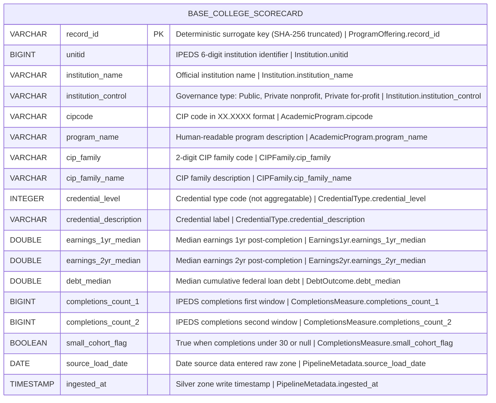

# Physical Model: silver-base-college-scorecard

**Status:** APPROVED (generated from approved logical model)
**Mode:** Greenfield
**Zone:** Silver (Base)
**Domain:** Higher Education Outcomes
**Spec:** docs/specs/silver-base-college-scorecard.md
**Logical Model:** governance/models/silver-base-college-scorecard-logical.md
**Conceptual Model:** governance/models/silver-base-college-scorecard-conceptual.md
**Author:** @semantic-modeler
**Date:** 2026-04-06

---



---

## Table Definition

| Property | Value |
|----------|-------|
| **Catalog table** | `base.college_scorecard` |
| **Format** | Apache Iceberg (v2) |
| **Engine** | DuckDB (via `iceberg_scan`) |
| **Grain** | One row per institution x program x credential level |
| **Natural key** | `unitid` + `cipcode` + `credential_level` |
| **Surrogate key** | `record_id` (deterministic SHA-256 hash, prefix `cs`) |
| **Expected row count** | 69,947 (MVP) |
| **Partition strategy** | None (dataset fits in a single partition; < 100K rows) |
| **Sort order** | `unitid ASC, cipcode ASC, credential_level ASC` |
| **Write pattern** | Full table replace via `brightsmith.infra.promote.promote()` (idempotent) |

---

## Column Definitions

### Program Offering (Core Identity)

| Column | DuckDB Type | Nullable | Default | Constraint | Business Term | Is CDE | Is PII | Description |
|--------|-------------|----------|---------|------------|---------------|--------|--------|-------------|
| record_id | VARCHAR | NOT NULL | derived | PRIMARY KEY | BT-015 | false | false | Deterministic surrogate key: `compute_grain_id(row, ['unitid', 'cipcode', 'credlev'], prefix='cs')`. Format: `cs-<16 hex chars>`. Stable across pipeline re-runs. |

### Institution

| Column | DuckDB Type | Nullable | Default | Constraint | Business Term | Is CDE | Is PII | Description |
|--------|-------------|----------|---------|------------|---------------|--------|--------|-------------|
| unitid | BIGINT | NOT NULL | -- | UNIQUE (composite with cipcode, credential_level) | BT-001 | true | false | IPEDS 6-digit institution identifier. Natural key component. Source field: `unitid`. |
| institution_name | VARCHAR | NOT NULL | -- | -- | BT-002 | false | false | Official institution name as reported to IPEDS. Source field: `instnm`. |
| institution_control | VARCHAR | NOT NULL | -- | CHECK (institution_control IN ('Public', 'Private nonprofit', 'Private for-profit')) | *pending BT-018* | false | false | Type of institutional governance. Derived from raw CONTROL field: 1='Public', 2='Private nonprofit', 3='Private for-profit'. Required for Gold zone segmentation. |

### Academic Program

| Column | DuckDB Type | Nullable | Default | Constraint | Business Term | Is CDE | Is PII | Description |
|--------|-------------|----------|---------|------------|---------------|--------|--------|-------------|
| cipcode | VARCHAR | NOT NULL | -- | UNIQUE (composite with unitid, credential_level); CHECK (cipcode ~ '^\d{2}\.\d{2,4}$') | BT-003 | false | false | CIP code normalized to XX.XXXX format. Natural key component. Source field: `cipcode` (raw 4-digit, dot inserted at position 2). |
| program_name | VARCHAR | NOT NULL | -- | -- | BT-004 | false | false | Human-readable program description. Source field: `cipdesc`. |

### CIP Family

| Column | DuckDB Type | Nullable | Default | Constraint | Business Term | Is CDE | Is PII | Description |
|--------|-------------|----------|---------|------------|---------------|--------|--------|-------------|
| cip_family | VARCHAR | NOT NULL | -- | CHECK (cip_family ~ '^\d{2}$') | BT-005 | false | false | 2-digit CIP family code. Derived: first 2 characters of normalized cipcode. |
| cip_family_name | VARCHAR | NOT NULL | -- | -- | BT-006 | false | false | Human-readable label for the CIP family. Derived via CIP 2020 taxonomy lookup on cip_family. |

### Credential Type

| Column | DuckDB Type | Nullable | Default | Constraint | Business Term | Is CDE | Is PII | Description |
|--------|-------------|----------|---------|------------|---------------|--------|--------|-------------|
| credential_level | INTEGER | NOT NULL | -- | UNIQUE (composite with unitid, cipcode); CHECK (credential_level BETWEEN 1 AND 8) | BT-007 | false | false | Integer code for credential type. **Categorical, not aggregatable** -- do not SUM or AVG this field. MVP value: 3 (Bachelor's). Natural key component. Source field: `credlev`. |
| credential_description | VARCHAR | NOT NULL | -- | -- | BT-008 | false | false | Human-readable credential label. Source field: `creddesc`. |

### Earnings 1yr

| Column | DuckDB Type | Nullable | Default | Constraint | Business Term | Is CDE | Is PII | Description |
|--------|-------------|----------|---------|------------|---------------|--------|--------|-------------|
| earnings_1yr_median | DOUBLE | NULLABLE | NULL | CHECK (earnings_1yr_median IS NULL OR (earnings_1yr_median >= 1000 AND earnings_1yr_median <= 250000)) | BT-009 | true | false | Median earnings (high estimate) 1 year post-completion. NULL when privacy-suppressed. Cohort-level aggregate. Source field: `earn_mdn_hi_1yr`. |

### Earnings 2yr

| Column | DuckDB Type | Nullable | Default | Constraint | Business Term | Is CDE | Is PII | Description |
|--------|-------------|----------|---------|------------|---------------|--------|--------|-------------|
| earnings_2yr_median | DOUBLE | NULLABLE | NULL | CHECK (earnings_2yr_median IS NULL OR (earnings_2yr_median >= 1000 AND earnings_2yr_median <= 250000)) | BT-010 | true | false | Median earnings (high estimate) 2 years post-completion. Different cohort from 1yr (not longitudinal). NULL when privacy-suppressed. Source field: `earn_mdn_hi_2yr`. |

### Debt Outcome

| Column | DuckDB Type | Nullable | Default | Constraint | Business Term | Is CDE | Is PII | Description |
|--------|-------------|----------|---------|------------|---------------|--------|--------|-------------|
| debt_median | DOUBLE | NULLABLE | NULL | CHECK (debt_median IS NULL OR (debt_median >= 1000 AND debt_median <= 100000)) | BT-011 | true | false | Median cumulative federal loan debt at completion. NULL when privacy-suppressed. Source field: `debt_all_stgp_eval_mdn`. |

### Completions Measure

| Column | DuckDB Type | Nullable | Default | Constraint | Business Term | Is CDE | Is PII | Description |
|--------|-------------|----------|---------|------------|---------------|--------|--------|-------------|
| completions_count_1 | BIGINT | NULLABLE | NULL | CHECK (completions_count_1 IS NULL OR completions_count_1 >= 0) | BT-012 | false | false | IPEDS completions count (first major window). Drives small_cohort_flag. Source field: `ipedscount1`. |
| completions_count_2 | BIGINT | NULLABLE | NULL | CHECK (completions_count_2 IS NULL OR completions_count_2 >= 0) | BT-012 | false | false | IPEDS completions count (second major window). Supplementary. Source field: `ipedscount2`. |
| small_cohort_flag | BOOLEAN | NOT NULL | -- | -- | BT-014 | false | false | Derived flag. True when completions_count_1 IS NULL OR completions_count_1 < 30. Conservative default: NULL completions treated as small cohort (approved by human reviewer). |

### Pipeline Metadata

| Column | DuckDB Type | Nullable | Default | Constraint | Business Term | Is CDE | Is PII | Description |
|--------|-------------|----------|---------|------------|---------------|--------|--------|-------------|
| source_load_date | DATE | NOT NULL | -- | -- | BT-016 | false | false | Date the source data was loaded into the raw zone. Source field: `load_date`. |
| ingested_at | TIMESTAMP | NOT NULL | -- | -- | BT-017 | false | false | Timestamp when the row was written to the Silver zone base table. Generated at transformation time via `datetime.now()`. |

---

## Column Summary

| Count | Category |
|-------|----------|
| 18 | Total columns |
| 1 | Primary key (record_id) |
| 3 | Natural key components (unitid, cipcode, credential_level) |
| 4 | CDE columns (unitid, earnings_1yr_median, earnings_2yr_median, debt_median) |
| 0 | PII columns |
| 5 | Nullable columns (earnings_1yr_median, earnings_2yr_median, debt_median, completions_count_1, completions_count_2) |
| 13 | NOT NULL columns |
| 6 | Derived columns (record_id, cipcode normalized, cip_family, cip_family_name, small_cohort_flag, institution_control) |

---

## Derivation Rules (Implementation Expressions)

These are the exact expressions the Silver transformer must implement.

| Column | Expression | Source Fields | Notes |
|--------|-----------|---------------|-------|
| record_id | `compute_grain_id(row, ['unitid', 'cipcode', 'credlev'], prefix='cs')` | unitid, cipcode, credlev (raw names) | SHA-256 truncated to 16 hex chars. Uses raw field names as grain inputs. Output format: `cs-<hex>`. Import: `from brightsmith.infra.grain import compute_grain_id` |
| cipcode | `raw_cipcode[:2] + '.' + raw_cipcode[2:]` | cipcode (raw 4-digit string) | Insert dot at position 2. Input "5202" becomes "52.02". Validate output matches `^\d{2}\.\d{4}$`. |
| cip_family | `normalized_cipcode[:2]` | cipcode (after normalization) | First 2 characters before the dot. |
| cip_family_name | `CIP_FAMILY_LOOKUP[cip_family]` | cip_family | Lookup against CIP 2020 taxonomy dictionary. All 2-digit families must resolve. |
| credential_level | `int(raw_credlev)` | credlev (raw) | Cast to INTEGER. Source is numeric but typed as INTEGER per human feedback (categorical code, not aggregatable). |
| credential_description | `raw_creddesc` | creddesc (raw) | Pass through. Expected: "Bachelor's Degree" for credential_level=3. |
| institution_control | `{1: 'Public', 2: 'Private nonprofit', 3: 'Private for-profit'}[int(raw_control)]` | CONTROL (raw, after ingestor update) | Map integer to text label. Source field CONTROL will be added to raw ingestor per approved option (a). |
| small_cohort_flag | `completions_count_1 IS NULL OR completions_count_1 < 30` | completions_count_1 | Conservative default approved: NULL completions produce True. SQL: `CASE WHEN completions_count_1 IS NULL OR completions_count_1 < 30 THEN TRUE ELSE FALSE END`. |
| source_load_date | `CAST(raw_load_date AS DATE)` | load_date (raw) | Cast from raw string/timestamp to DATE. |
| ingested_at | `CURRENT_TIMESTAMP` | -- | Generated at Silver transformation time. |

---

## DDL (Reference)

This DDL is for documentation. The actual table is created via `brightsmith.infra.promote.promote()` which handles Iceberg table creation and idempotent writes.

```sql
-- Reference DDL for base.college_scorecard
-- Engine: DuckDB + Iceberg v2
-- Do not execute directly — use promote() pattern

CREATE TABLE IF NOT EXISTS base.college_scorecard (
    record_id               VARCHAR     NOT NULL,
    unitid                  BIGINT      NOT NULL,
    institution_name        VARCHAR     NOT NULL,
    institution_control     VARCHAR     NOT NULL,
    cipcode                 VARCHAR     NOT NULL,
    program_name            VARCHAR     NOT NULL,
    cip_family              VARCHAR     NOT NULL,
    cip_family_name         VARCHAR     NOT NULL,
    credential_level        INTEGER     NOT NULL,
    credential_description  VARCHAR     NOT NULL,
    earnings_1yr_median     DOUBLE,
    earnings_2yr_median     DOUBLE,
    debt_median             DOUBLE,
    completions_count_1     BIGINT,
    completions_count_2     BIGINT,
    small_cohort_flag       BOOLEAN     NOT NULL,
    source_load_date        DATE        NOT NULL,
    ingested_at             TIMESTAMP   NOT NULL,

    -- Surrogate key
    PRIMARY KEY (record_id),

    -- Natural key uniqueness (enforced at load time, not by Iceberg)
    UNIQUE (unitid, cipcode, credential_level),

    -- Domain constraints
    CHECK (institution_control IN ('Public', 'Private nonprofit', 'Private for-profit')),
    CHECK (cipcode ~ '^\d{2}\.\d{2,4}$'),
    CHECK (cip_family ~ '^\d{2}$'),
    CHECK (credential_level BETWEEN 1 AND 8),
    CHECK (earnings_1yr_median IS NULL OR (earnings_1yr_median >= 1000 AND earnings_1yr_median <= 250000)),
    CHECK (earnings_2yr_median IS NULL OR (earnings_2yr_median >= 1000 AND earnings_2yr_median <= 250000)),
    CHECK (debt_median IS NULL OR (debt_median >= 1000 AND debt_median <= 100000)),
    CHECK (completions_count_1 IS NULL OR completions_count_1 >= 0),
    CHECK (completions_count_2 IS NULL OR completions_count_2 >= 0)
);
```

---

## Source-to-Target Mapping

| Physical Column | DuckDB Type | Source Table | Source Field | Transformation |
|-----------------|-------------|-------------|--------------|----------------|
| record_id | VARCHAR | -- | derived | `compute_grain_id(row, ['unitid', 'cipcode', 'credlev'], prefix='cs')` |
| unitid | BIGINT | raw.college_scorecard | unitid | Direct (cast to BIGINT) |
| institution_name | VARCHAR | raw.college_scorecard | instnm | Direct |
| institution_control | VARCHAR | raw.college_scorecard | control | Map: 1='Public', 2='Private nonprofit', 3='Private for-profit' |
| cipcode | VARCHAR | raw.college_scorecard | cipcode | Insert dot at position 2: `raw[:2] + '.' + raw[2:]` |
| program_name | VARCHAR | raw.college_scorecard | cipdesc | Direct |
| cip_family | VARCHAR | -- | derived from cipcode | `normalized_cipcode[:2]` |
| cip_family_name | VARCHAR | -- | derived from cip_family | CIP 2020 taxonomy lookup |
| credential_level | INTEGER | raw.college_scorecard | credlev | Cast to INTEGER (categorical code) |
| credential_description | VARCHAR | raw.college_scorecard | creddesc | Direct |
| earnings_1yr_median | DOUBLE | raw.college_scorecard | earn_mdn_hi_1yr | Cast to DOUBLE (NULL preserved) |
| earnings_2yr_median | DOUBLE | raw.college_scorecard | earn_mdn_hi_2yr | Cast to DOUBLE (NULL preserved) |
| debt_median | DOUBLE | raw.college_scorecard | debt_all_stgp_eval_mdn | Cast to DOUBLE (NULL preserved) |
| completions_count_1 | BIGINT | raw.college_scorecard | ipedscount1 | Cast to BIGINT (NULL preserved) |
| completions_count_2 | BIGINT | raw.college_scorecard | ipedscount2 | Cast to BIGINT (NULL preserved) |
| small_cohort_flag | BOOLEAN | -- | derived from completions_count_1 | `completions_count_1 IS NULL OR completions_count_1 < 30` |
| source_load_date | DATE | raw.college_scorecard | load_date | Cast to DATE |
| ingested_at | TIMESTAMP | -- | generated | `CURRENT_TIMESTAMP` at transformation time |

---

## Nullability Semantics

Null values carry specific business meaning related to privacy suppression (BT-013):

| Column | NULL Means |
|--------|-----------|
| earnings_1yr_median | 1-year earnings suppressed for privacy (cohort too small) or data not yet available |
| earnings_2yr_median | 2-year earnings suppressed for privacy (different cohort from 1yr) |
| debt_median | Debt data suppressed for privacy |
| completions_count_1 | Completions count not reported for this measurement window |
| completions_count_2 | Completions count not reported for this measurement window |

Expected null rates from Bronze data analysis:
- earnings_1yr_median: ~64% null
- earnings_2yr_median: ~64% null
- debt_median: ~60% null
- completions_count_1, completions_count_2: low null rate

---

## Implementation Notes

### credential_level is INTEGER, not aggregatable

Per human feedback from logical model approval: `credential_level` is typed as INTEGER (not DOUBLE) because it is a categorical code, not a continuous measure. Values 1-8 represent discrete credential types. Do not SUM, AVG, or otherwise aggregate this field. The CHECK constraint enforces the valid range (1-8) but the semantics are categorical.

### small_cohort_flag conservative default

Per human approval: when `completions_count_1` is NULL, `small_cohort_flag` is set to True. This is the conservative default -- if we cannot confirm the cohort has 30+ completers, we assume it is small and flag it. This protects downstream consumers from treating potentially suppressed data as reliable.

### institution_control dependency on raw schema

The `institution_control` column depends on the CONTROL field being present in `raw.college_scorecard`. Per human approval, option (a) was selected: the raw ingestor will be updated to include the CONTROL field and re-ingest. The Silver transformer should source this from the raw Iceberg table, not from the CSV directly.

### Sort order rationale

Sort order `unitid ASC, cipcode ASC, credential_level ASC` aligns with the natural key and supports efficient range scans when filtering by institution. This is the most common access pattern for downstream Gold zone queries.

---

## Traceability: Logical to Physical

| Logical Attribute | Logical Type Domain | Physical Column | Physical DuckDB Type | Mapping Notes |
|-------------------|--------------------|-----------------|--------------------|---------------|
| record_id | identifier | record_id | VARCHAR | Hash output is always a string |
| unitid | identifier | unitid | BIGINT | 6-digit numeric ID fits BIGINT |
| institution_name | text | institution_name | VARCHAR | Direct mapping |
| institution_control | text | institution_control | VARCHAR | Derived from integer CONTROL code |
| cipcode | identifier | cipcode | VARCHAR | Contains dot separator, must be string |
| program_name | text | program_name | VARCHAR | Direct mapping |
| cip_family | identifier | cip_family | VARCHAR | 2-digit code, kept as string for leading zeros |
| cip_family_name | text | cip_family_name | VARCHAR | Direct mapping |
| credential_level | numeric | credential_level | INTEGER | Human feedback: categorical code, not DOUBLE |
| credential_description | text | credential_description | VARCHAR | Direct mapping |
| earnings_1yr_median | numeric | earnings_1yr_median | DOUBLE | Monetary values use DOUBLE |
| earnings_2yr_median | numeric | earnings_2yr_median | DOUBLE | Monetary values use DOUBLE |
| debt_median | numeric | debt_median | DOUBLE | Monetary values use DOUBLE |
| completions_count_1 | numeric | completions_count_1 | BIGINT | Integer counts use BIGINT |
| completions_count_2 | numeric | completions_count_2 | BIGINT | Integer counts use BIGINT |
| small_cohort_flag | boolean | small_cohort_flag | BOOLEAN | Direct mapping |
| source_load_date | date | source_load_date | DATE | Direct mapping |
| ingested_at | timestamp | ingested_at | TIMESTAMP | Direct mapping |

---

## Open Issues (Carried from Logical)

| # | Issue | Status | Resolution |
|---|-------|--------|------------|
| 1 | `institution_control` has no business term (BT-018 needed) | OPEN (non-blocking) | @data-steward to propose BT-018 "Institution Control Type". Physical model uses `*pending BT-018*` placeholder. |
| 2 | CONTROL field not yet in raw Iceberg table | OPEN (blocking for implementation) | Raw ingestor update approved (option a). Must be completed before Silver transformer can run. |
| 3 | small_cohort_flag when completions NULL | RESOLVED | NULL completions produce True (conservative default). Approved by human reviewer. |
