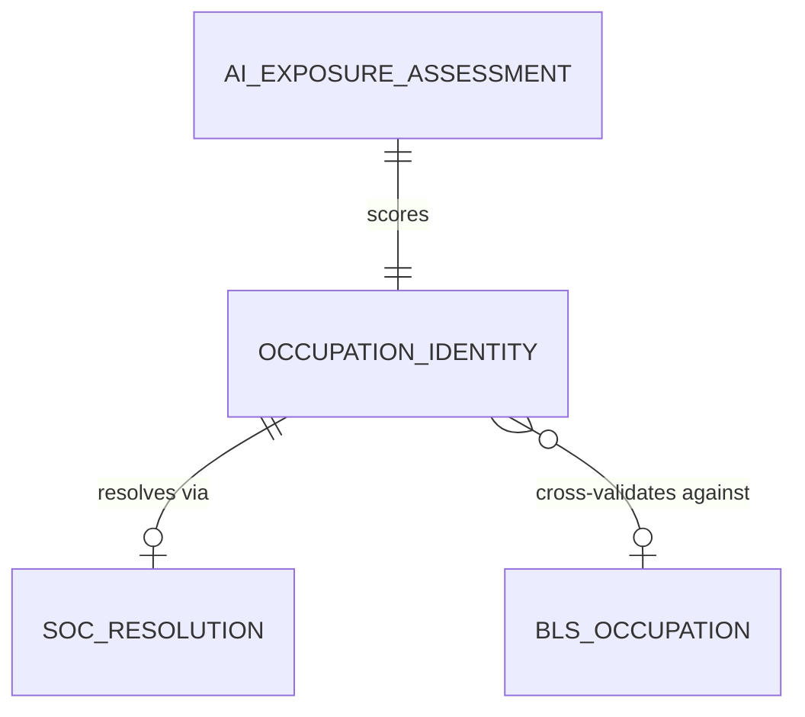

# Conceptual Model: silver-base-karpathy-ai-exposure

**Status:** PROPOSED
**Mode:** Greenfield
**Zone:** Silver (Base)
**Domain:** AI Occupation Exposure Assessment
**Spec:** docs/specs/raw-ingest-karpathy-ai-exposure.md (Zone 2: Silver)
**Author:** @semantic-modeler
**Date:** 2026-04-09
**Approval:** Pending human review (REQUIRE_HUMAN_APPROVAL = true)

---

---

## Entity Descriptions

| Entity | Business Concept | Business Term | Is CDE | Is PII |
|--------|-----------------|---------------|--------|--------|
| AI Exposure Assessment | An LLM-generated estimate of how much current AI will reshape a given occupation, on a 0-10 integer scale. Includes both the numeric score and the textual rationale explaining the scoring factors. This is the core analytical payload of the Karpathy dataset and the source for the FutureProof RES stat and Fight AI boss in the Gold zone. | BT-094 | true | false |
| Occupation Identity | A distinct occupation as identified in the Karpathy dataset, anchored by a slug (source identifier) and optionally resolved to a SOC code (standard taxonomy). The grain shifts from slug (Bronze) to soc_code (Silver) through SOC resolution. Each occupation belongs to one of 25 Karpathy categories derived from BLS occupation groups. | BT-027 | true | false |
| SOC Resolution | The method by which an occupation's SOC code was determined or verified. Four possible outcomes: direct (SOC present in source), title_match (resolved by matching occupation title against BLS data), broad_expansion (propagated from a broad SOC code to its constituent detailed codes), or unresolved (no SOC could be determined). This entity captures the provenance and confidence of the SOC assignment. | BT-096 | false | false |
| BLS Occupation | An external reference entity representing occupations in the FutureProof BLS OOH dataset (base.bls_ooh). Not part of this table -- referenced for cross-validation. The bls_match flag records whether each Karpathy occupation's SOC code exists in BLS OOH, determining downstream joinability. | BT-097 | false | false |

---

## Relationship Descriptions

| Relationship | From | To | Cardinality | Description |
|-------------|------|-----|-------------|-------------|
| scores | AI Exposure Assessment | Occupation Identity | one-to-one | Every occupation has exactly one AI exposure assessment (one score and one rationale). The assessment is inseparable from the occupation it evaluates. |
| resolves via | Occupation Identity | SOC Resolution | one-to-zero-or-one | Every occupation has a resolution method describing how its SOC code was determined. Occupations with null SOC codes still have a resolution method ("unresolved"). This is modeled as optional because the resolution metadata qualifies the SOC assignment, not the occupation itself. |
| cross-validates against | Occupation Identity | BLS Occupation | many-to-zero-or-one | Multiple Karpathy occupations may map to the same BLS occupation (after broad code expansion, several Karpathy slugs can resolve to the same detailed SOC). Some Karpathy occupations have no BLS match (bls_match = false). BLS Occupation is an external entity not stored in this table. |

---

## Key Business Concepts

### Grain
The fundamental unit of analysis is the **Occupation at the SOC code level**: after Silver transformations, each row represents one detailed SOC code with its AI exposure assessment. This is a grain change from Bronze, where the grain is one row per slug (Karpathy's occupation identifier).

The grain change occurs because:
1. **Broad SOC code expansion** (46 Bronze rows with broad codes like XX-XXX0) fans out to multiple detailed codes, creating new rows
2. **Deduplication on SOC code** resolves cases where multiple slugs map to the same detailed SOC (after expansion)
3. The net effect is ~500+ rows in Silver vs. 342 in Bronze

Rows with null SOC codes are preserved (soc_resolved_method = "unresolved") but do not participate in the SOC-level grain uniqueness constraint.

### AI Exposure Score (BT-094)
An integer from 0 to 10 measuring how much current AI will reshape an occupation. Generated by Gemini Flash evaluating BLS occupation descriptions against a structured rubric. Key characteristics:
- Higher score = more exposed to AI reshaping (not necessarily job loss)
- The score uses a heuristic: if a job can be done entirely from a home office on a computer, exposure is 7+
- EDA shows actual range is 1-10 (no zeros observed), with a mode at 7 (20.5% of occupations)
- Carried verbatim through Silver -- no rescaling. Gold zone derives RES stat and boss score from this value.

### AI Exposure Rationale (BT-095)
A 2-3 sentence LLM-generated explanation of the key factors driving the exposure score. Length ranges from 297 to 587 characters (mean 412). All rationales are unique and substantive. This is a display field carried through to the frontend for the Fight AI boss narrative.

### SOC Resolution Method (BT-096)
A classification of how each occupation's SOC code was determined in Silver:
- **direct** (~70%): SOC code present in the source data and matches a detailed BLS code
- **broad_expansion** (~15%): Source had a broad SOC code (XX-XXX0); Silver expanded it to constituent detailed codes and propagated the exposure score
- **title_match** (~10%): Source had no SOC code; Silver resolved it by matching occupation_title against base.bls_ooh
- **unresolved** (~5%): No SOC code could be determined; row preserved with null SOC for completeness

### BLS Match Flag (BT-097)
A boolean indicating whether the occupation's SOC code exists in base.bls_ooh. This is the downstream joinability signal. Only bls_match = true rows are promoted to Gold (consumable.ai_exposure). The DQ target is >= 90% match rate among rows with non-null SOC codes.

### Broad SOC Code Expansion
46 Bronze rows use broad SOC codes (XX-XXX0) that represent rolled-up occupation groups. Silver expands these to their constituent detailed codes by finding all detailed SOC codes in base.bls_ooh that share the same 5-character prefix. The exposure score and rationale are propagated identically to each expanded row. This is the primary driver of the row count increase from 342 (Bronze) to ~500+ (Silver).

### Karpathy Category
One of 25 occupation categories from Karpathy's BLS grouping (e.g., "healthcare", "business-and-financial", "computer-and-information-technology"). Not a standard BLS taxonomy but maps to BLS major occupation groups. Carried forward as a classification attribute for analysis and display.

---

## Cross-Source Integration Role

This table is the **AI exposure anchor** in the FutureProof pipeline. It joins to existing SOC-keyed tables:

| Table | Join Key | Relationship |
|-------|----------|-------------|
| base.bls_ooh | soc_code | Cross-validation (bls_match flag) and downstream Gold zone joins |
| consumable.occupation_profiles | soc_code | Gold zone -- every ai_exposure row must have a matching occupation profile |
| consumable.program_career_paths | soc_code | Gold zone backfill -- fills stat_res and boss_ai_score (previously null) |
| consumable.career_branches | soc_code | Gold zone backfill -- fills stat_res delta between source and target occupations |

This is the fourth data source in the pipeline, completing the five-stat pentagon and full boss gauntlet.

---

## Modeling Decisions

1. **AI Exposure Assessment as the central entity.** The exposure score and rationale form a cohesive analytical concept -- the LLM's judgment of AI impact on an occupation. These are inseparable (the rationale explains the score) and represent the primary value of this dataset.

2. **Occupation Identity as a distinct entity from Assessment.** The occupation's identifying attributes (slug, title, category, SOC code) are conceptually separate from the assessment itself. The slug is the source identity; the SOC code is the normalized identity. This separation clarifies the grain change: Bronze is keyed by slug (source identity), Silver is keyed by SOC code (normalized identity).

3. **SOC Resolution as a provenance entity.** The method by which a SOC code was determined (direct, title_match, broad_expansion, unresolved) is a metadata concept that qualifies the SOC assignment. It is not part of the occupation's identity or its assessment -- it describes the quality of the mapping between the two.

4. **BLS Occupation as an external reference, not an embedded entity.** The bls_match flag captures the cross-validation result without importing BLS data into this model. This keeps the model focused on the Karpathy dataset while recording the joinability signal needed for Gold zone filtering.

5. **No temporal entity.** This is a static snapshot from a single LLM scoring run. source_load_date and ingested_at are pipeline metadata, not a time dimension. This mirrors the BLS OOH modeling decision.

6. **Category as an attribute, not a separate entity.** Karpathy's 25 categories are a classification attribute on Occupation Identity, not a first-class entity with independent relationships. Unlike SOC Major Group in BLS OOH (which has a well-established 22-group taxonomy), Karpathy's categories are non-standard and not used as a join or aggregation key downstream.

---

## Scope and Boundaries

- This conceptual model covers the `base.karpathy_ai_exposure` table in the Silver zone only
- Bronze zone raw data (`bronze.karpathy_ai_exposure`) is the source but is not modeled here (raw is physical-only per Brightsmith rules)
- Gold zone products (`consumable.ai_exposure`, stat_res, boss_ai_score) are downstream consumers, not part of this model
- The BLS OOH table (`base.bls_ooh`) is referenced for cross-validation but not modeled here
- This model assumes ~500+ rows after broad code expansion and deduplication (342 Bronze rows, minus duplicates, plus expansion)
