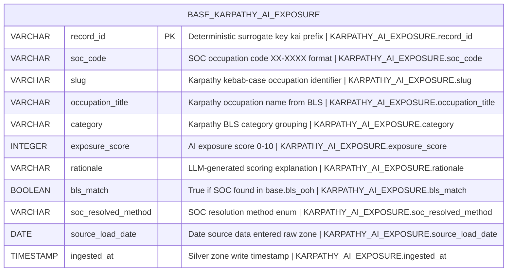

# Physical Model: silver-base-karpathy-ai-exposure

**Status:** PROPOSED
**Mode:** Greenfield
**Zone:** Silver (Base)
**Domain:** AI Occupation Exposure Assessment
**Spec:** docs/specs/raw-ingest-karpathy-ai-exposure.md (Zone 2: Silver)
**Logical Model:** governance/models/silver-base-karpathy-ai-exposure-logical.md
**Conceptual Model:** governance/models/silver-base-karpathy-ai-exposure-conceptual.md
**Author:** @semantic-modeler
**Date:** 2026-04-09
**Approval:** Pending human review (REQUIRE_HUMAN_APPROVAL = true)

---



---

## Table Definition

| Property | Value |
|----------|-------|
| **Catalog table** | `base.karpathy_ai_exposure` |
| **Format** | Apache Iceberg (v2) |
| **Engine** | DuckDB (via `iceberg_scan`) |
| **Grain** | One row per occupation (soc_code where non-null; slug for unresolved rows) |
| **Natural key** | `soc_code` (unique among non-null values) |
| **Surrogate key** | `record_id` (deterministic SHA-256 hash, prefix `kai`) |
| **Expected row count** | ~500+ (342 Bronze rows after broad code expansion and deduplication) |
| **Partition strategy** | None (small table, <1000 rows fits in a single partition) |
| **Sort order** | `soc_code ASC NULLS LAST` |
| **Write pattern** | Full table replace via `brightsmith.infra.promote.promote()` (idempotent) |

---

## Column Definitions

### Occupation Identity (Core)

| Column | DuckDB Type | Nullable | Default | Constraint | Business Term | Is CDE | Is PII | Description |
|--------|-------------|----------|---------|------------|---------------|--------|--------|-------------|
| record_id | VARCHAR | NOT NULL | derived | PRIMARY KEY | BT-015 | false | false | Deterministic surrogate key: `compute_grain_id(row, ['soc_code'], prefix='kai')` when soc_code is non-null; `compute_grain_id(row, ['slug'], prefix='kai')` when soc_code is null. Format: `kai-<16 hex chars>`. Stable across pipeline re-runs. |
| soc_code | VARCHAR | NULLABLE | NULL | UNIQUE (where non-null); CHECK (soc_code IS NULL OR soc_code ~ '^\d{2}-\d{4}$') | BT-027 | true | false | SOC occupation code in XX-XXXX format. Null for unresolved occupations (~5% of rows). Primary join key to base.bls_ooh and downstream consumable tables. |
| slug | VARCHAR | NOT NULL | -- | -- | -- | false | false | Karpathy's kebab-case occupation identifier (e.g., "financial-analysts"). Retained for provenance and traceability to source. Was the Bronze grain key. Source field: `slug`. |
| occupation_title | VARCHAR | NOT NULL | -- | -- | BT-028 | false | false | Karpathy's occupation title from BLS occupation listing. Used for title-based SOC resolution when soc_code is null in Bronze. Source field: `occupation_title`. |
| category | VARCHAR | NOT NULL | -- | -- | -- | false | false | One of 25 Karpathy BLS category groupings (kebab-case). Non-standard taxonomy. Source field: `category`. |

### AI Exposure Assessment

| Column | DuckDB Type | Nullable | Default | Constraint | Business Term | Is CDE | Is PII | Description |
|--------|-------------|----------|---------|------------|---------------|--------|--------|-------------|
| exposure_score | INTEGER | NOT NULL | -- | CHECK (exposure_score >= 0 AND exposure_score <= 10) | BT-094 | true | false | AI exposure score on a 0-10 integer scale. LLM-generated estimate of occupation AI reshaping. Carried verbatim from Bronze. Observed range 1-10 (no zeros in current data). Source field: `exposure_score`. |
| rationale | VARCHAR | NOT NULL | -- | CHECK (LENGTH(rationale) >= 250) | BT-095 | false | false | 2-3 sentence LLM-generated explanation of scoring factors. Length 297-587 chars. Display field for Fight AI boss narrative. Carried verbatim from Bronze. Source field: `rationale`. |

### SOC Resolution

| Column | DuckDB Type | Nullable | Default | Constraint | Business Term | Is CDE | Is PII | Description |
|--------|-------------|----------|---------|------------|---------------|--------|--------|-------------|
| bls_match | BOOLEAN | NOT NULL | -- | -- | BT-097 | false | false | True if soc_code found in base.bls_ooh. False for SOC codes absent from BLS data or null SOC rows. Gold zone filter: only bls_match = true rows are promoted. Derived from lookup against base.bls_ooh. |
| soc_resolved_method | VARCHAR | NOT NULL | -- | CHECK (soc_resolved_method IN ('direct', 'title_match', 'broad_expansion', 'unresolved')) | BT-096 | false | false | Enum describing how the SOC code was determined. Four valid values. Expected distribution: ~70% direct, ~15% broad_expansion, ~10% title_match, ~5% unresolved. Derived from SOC resolution logic. |

### Pipeline Metadata

| Column | DuckDB Type | Nullable | Default | Constraint | Business Term | Is CDE | Is PII | Description |
|--------|-------------|----------|---------|------------|---------------|--------|--------|-------------|
| source_load_date | DATE | NOT NULL | -- | -- | BT-016 | false | false | Date the source data was loaded into the raw zone. Source field: `load_date` (renamed). |
| ingested_at | TIMESTAMP | NOT NULL | -- | -- | BT-017 | false | false | Timestamp when the row was written to the Silver zone base table. Generated at transformation time via `datetime.now()`. |

---

## Column Summary

| Count | Category |
|-------|----------|
| 11 | Total columns |
| 1 | Primary key (record_id) |
| 1 | Natural key component (soc_code) |
| 2 | CDE columns (soc_code, exposure_score) |
| 0 | PII columns |
| 1 | Nullable columns (soc_code) |
| 10 | NOT NULL columns |
| 4 | Derived columns (record_id, bls_match, soc_resolved_method, ingested_at) |

---

## PyIceberg Schema Definition

This is the exact schema the Silver transformer must use when creating the Iceberg table via `promote()`.

```python
from pyiceberg.schema import Schema
from pyiceberg.types import (
    BooleanType,
    DateType,
    IntegerType,
    NestedField,
    StringType,
    TimestampType,
)

SCHEMA = Schema(
    NestedField(1, "record_id", StringType(), required=True),
    NestedField(2, "soc_code", StringType(), required=False),
    NestedField(3, "slug", StringType(), required=True),
    NestedField(4, "occupation_title", StringType(), required=True),
    NestedField(5, "category", StringType(), required=True),
    NestedField(6, "exposure_score", IntegerType(), required=True),
    NestedField(7, "rationale", StringType(), required=True),
    NestedField(8, "bls_match", BooleanType(), required=True),
    NestedField(9, "soc_resolved_method", StringType(), required=True),
    NestedField(10, "source_load_date", DateType(), required=True),
    NestedField(11, "ingested_at", TimestampType(), required=True),
)
```

---

## Derivation Rules (Implementation Expressions)

These are the exact expressions the Silver transformer must implement.

| Column | Expression | Source Fields | Notes |
|--------|-----------|---------------|-------|
| record_id | `compute_grain_id(row, ['soc_code'], prefix='kai')` when soc_code is non-null; `compute_grain_id(row, ['slug'], prefix='kai')` when soc_code is null | soc_code, slug | SHA-256 truncated to 16 hex chars. Output format: `kai-<hex>`. Import: `from brightsmith.infra.grain import compute_grain_id` |
| soc_code | Step 1: Validate XX-XXXX format, strip whitespace. Step 2: For null-SOC Bronze rows, attempt case-insensitive title match against `base.bls_ooh.occupation_title`. Step 3: For broad codes (XX-XXX0), expand to all detailed codes in base.bls_ooh sharing the same 5-char prefix. | raw.soc_code, occupation_title, base.bls_ooh | Null remains null after all resolution attempts. Broad codes produce multiple output rows. |
| slug | Direct passthrough | raw.slug | Unchanged from Bronze. For broad_expansion rows, the original slug of the broad-code row is carried to all expanded detailed-code rows. |
| occupation_title | Direct passthrough | raw.occupation_title | Unchanged from Bronze. |
| category | Direct passthrough | raw.category | Unchanged from Bronze. |
| exposure_score | Direct passthrough | raw.exposure_score | Verbatim. No rescaling. Integer 0-10. |
| rationale | Direct passthrough | raw.rationale | Verbatim. No modification. |
| bls_match | `soc_code IN (SELECT soc_code FROM base.bls_ooh)` | soc_code, base.bls_ooh | False for null soc_code rows. False for SOC codes not in BLS OOH. |
| soc_resolved_method | Classification logic: (1) If Bronze soc_code is non-null and matches a detailed BLS code: "direct". (2) If Bronze soc_code is null but title match succeeded: "title_match". (3) If Bronze soc_code was a broad code and expanded to detailed: "broad_expansion". (4) If soc_code is still null after all resolution: "unresolved". | raw.soc_code, resolution logic | Mutually exclusive enum. Every row gets exactly one value. |
| source_load_date | `CAST(raw_load_date AS DATE)` | load_date (raw) | Renamed from Bronze `load_date`. |
| ingested_at | `CURRENT_TIMESTAMP` | -- | Generated at Silver transformation time. |

---

## Source-to-Target Mapping

| Physical Column | DuckDB Type | Source Table | Source Field | Transformation |
|-----------------|-------------|-------------|--------------|----------------|
| record_id | VARCHAR | -- | derived | `compute_grain_id(row, ['soc_code'], prefix='kai')` or `compute_grain_id(row, ['slug'], prefix='kai')` for null-SOC rows |
| soc_code | VARCHAR | bronze.karpathy_ai_exposure | soc_code | Normalize XX-XXXX, resolve nulls via title match, expand broad codes |
| slug | VARCHAR | bronze.karpathy_ai_exposure | slug | Direct passthrough |
| occupation_title | VARCHAR | bronze.karpathy_ai_exposure | occupation_title | Direct passthrough |
| category | VARCHAR | bronze.karpathy_ai_exposure | category | Direct passthrough |
| exposure_score | INTEGER | bronze.karpathy_ai_exposure | exposure_score | Direct passthrough (cast to INTEGER) |
| rationale | VARCHAR | bronze.karpathy_ai_exposure | rationale | Direct passthrough |
| bls_match | BOOLEAN | -- | derived | Lookup soc_code against base.bls_ooh |
| soc_resolved_method | VARCHAR | -- | derived | Classification from SOC resolution logic |
| source_load_date | DATE | bronze.karpathy_ai_exposure | load_date | Renamed, cast to DATE |
| ingested_at | TIMESTAMP | -- | generated | `CURRENT_TIMESTAMP` at transformation time |

---

## Broad SOC Code Expansion (Row-Level Transformation)

This is the most complex transformation in this pipeline. It changes the row count from Bronze (342) to Silver (~500+).

### Algorithm

```
For each Bronze row:
  1. If soc_code is null:
     a. Attempt title match against base.bls_ooh.occupation_title (case-insensitive exact, then fuzzy)
     b. If match found: set soc_code, soc_resolved_method = "title_match"
     c. If no match: soc_code remains null, soc_resolved_method = "unresolved"
  2. If soc_code matches XX-XXX0 pattern (broad code):
     a. Find all detailed codes in base.bls_ooh where soc_code[:6] matches (same 5-char prefix + hyphen)
     b. For each detailed code found: create a new row with:
        - soc_code = detailed code
        - slug = original slug (provenance)
        - exposure_score = original score (propagated)
        - rationale = original rationale (propagated)
        - soc_resolved_method = "broad_expansion"
        - bls_match = true (by definition, since we found it in BLS)
     c. If zero detailed codes found: keep original broad code, bls_match = false
  3. If soc_code is detailed (not XX-XXX0) and non-null:
     - soc_resolved_method = "direct"
     - bls_match = (soc_code IN base.bls_ooh)
```

### Post-Expansion Deduplication

After expansion, multiple rows may map to the same detailed SOC code (from different slugs or overlapping broad/detailed entries). Deduplication rule:
1. Group by soc_code (non-null only)
2. If duplicates exist: keep the row with the highest `num_jobs_2024` from Bronze (largest employment base)
3. If `num_jobs_2024` is equal or null: keep first alphabetically by slug

---

## Nullability Semantics

| Column | NULL Means |
|--------|-----------|
| soc_code | Occupation could not be resolved to a SOC code after all attempts (title match and broad expansion both failed or not applicable). soc_resolved_method will be "unresolved". Row preserved for completeness but will not join downstream. Expected: ~5% of total rows. |

All other columns are NOT NULL.

---

## DDL (Reference)

This DDL is for documentation. The actual table is created via `brightsmith.infra.promote.promote()` which handles Iceberg table creation and idempotent writes.

```sql
-- Reference DDL for base.karpathy_ai_exposure
-- Engine: DuckDB + Iceberg v2
-- Do not execute directly -- use promote() pattern

CREATE TABLE IF NOT EXISTS base.karpathy_ai_exposure (
    record_id               VARCHAR     NOT NULL,
    soc_code                VARCHAR,
    slug                    VARCHAR     NOT NULL,
    occupation_title        VARCHAR     NOT NULL,
    category                VARCHAR     NOT NULL,
    exposure_score          INTEGER     NOT NULL,
    rationale               VARCHAR     NOT NULL,
    bls_match               BOOLEAN     NOT NULL,
    soc_resolved_method     VARCHAR     NOT NULL,
    source_load_date        DATE        NOT NULL,
    ingested_at             TIMESTAMP   NOT NULL,

    -- Surrogate key
    PRIMARY KEY (record_id),

    -- Natural key uniqueness (non-null soc_code only; enforced at load time)
    -- UNIQUE (soc_code) WHERE soc_code IS NOT NULL,

    -- Domain constraints
    CHECK (soc_code IS NULL OR soc_code ~ '^\d{2}-\d{4}$'),
    CHECK (exposure_score >= 0 AND exposure_score <= 10),
    CHECK (LENGTH(rationale) >= 250),
    CHECK (soc_resolved_method IN ('direct', 'title_match', 'broad_expansion', 'unresolved'))
);
```

---

## DQ Rule Alignment

The DQ rules at `governance/dq-rules/silver-base-karpathy-ai-exposure.json` should be aligned with this physical model. Key constraint correspondences:

| Physical Constraint | Expected DQ Rule ID | Description |
|--------------------|---------------------|-------------|
| soc_code UNIQUE (non-null) | SLV-KAI-001 | Grain uniqueness on soc_code where non-null |
| soc_code format regex | SLV-KAI-002 | SOC code format XX-XXXX where non-null |
| exposure_score range 0-10 | SLV-KAI-003 | Score unchanged from Bronze |
| rationale length >= 250 | SLV-KAI-004 | Minimum rationale length |
| soc_resolved_method enum | SLV-KAI-005 | Valid enum values only |
| bls_match >= 90% true (non-null SOC) | SLV-KAI-006 | BLS cross-validation rate |
| slug NOT NULL | SLV-KAI-007 | Zero null slugs |
| record_id NOT NULL + unique | SLV-KAI-008 | Surrogate key integrity |
| Row count range 400-700 | SLV-KAI-009 | Post-expansion row count |

---

## Traceability: Logical to Physical

| Logical Attribute | Logical Type Domain | Physical Column | Physical DuckDB Type | PyIceberg Type | NestedField ID | Mapping Notes |
|-------------------|--------------------|-----------------|--------------------|----------------|----------------|---------------|
| record_id | identifier | record_id | VARCHAR | StringType | 1 | Hash output is always a string |
| soc_code | identifier | soc_code | VARCHAR | StringType | 2 | XX-XXXX format requires string. Nullable. |
| slug | text | slug | VARCHAR | StringType | 3 | Direct mapping |
| occupation_title | text | occupation_title | VARCHAR | StringType | 4 | Direct mapping |
| category | text | category | VARCHAR | StringType | 5 | Direct mapping |
| exposure_score | numeric | exposure_score | INTEGER | IntegerType | 6 | Integer score 0-10, not aggregatable in the AVG sense but used in arithmetic |
| rationale | text | rationale | VARCHAR | StringType | 7 | Direct mapping |
| bls_match | boolean | bls_match | BOOLEAN | BooleanType | 8 | Direct mapping |
| soc_resolved_method | text | soc_resolved_method | VARCHAR | StringType | 9 | Enum stored as string |
| source_load_date | date | source_load_date | DATE | DateType | 10 | Direct mapping |
| ingested_at | timestamp | ingested_at | TIMESTAMP | TimestampType | 11 | Direct mapping |

---

## Implementation Notes

### Sort order rationale

Sort order `soc_code ASC NULLS LAST` places null-SOC rows at the end and sorts resolved rows by SOC code. This aligns with the natural key and supports efficient range scans for downstream Gold zone queries and joins to base.bls_ooh. Null-SOC rows are grouped at the end since they do not participate in downstream joins.

### record_id fallback for null soc_code

When soc_code is null, `compute_grain_id` uses slug as the hash input instead. This ensures every row has a deterministic, stable record_id even when the natural key is missing. The prefix remains `kai` in both cases. The implementing agent must implement this branching logic:

```python
if row['soc_code'] is not None:
    row['record_id'] = compute_grain_id(row, ['soc_code'], prefix='kai')
else:
    row['record_id'] = compute_grain_id(row, ['slug'], prefix='kai')
```

### Broad expansion creates 1:N rows

The broad SOC code expansion step is a row-multiplying transformation. A single Bronze row with a broad code like `15-1230` may produce 3 Silver rows (`15-1231`, `15-1232`, `15-1234`) if those detailed codes exist in base.bls_ooh. The slug, occupation_title, category, exposure_score, and rationale are duplicated identically across all expanded rows. Only soc_code, record_id, bls_match, and soc_resolved_method differ.

### Spec type mapping decisions

The spec uses shorthand type names that map to PyIceberg types as follows:
- `string` = StringType (DuckDB VARCHAR)
- `int` = IntegerType (DuckDB INTEGER)
- `boolean` = BooleanType (DuckDB BOOLEAN)
- `date` = DateType (DuckDB DATE)
- `timestamp` = TimestampType (DuckDB TIMESTAMP)

### Exposure score range

The CHECK constraint uses 0-10 (per spec) even though EDA shows the current data range is 1-10. The 0 value is valid per the scoring methodology and may appear if the source is rescored in the future. The Gold zone formula `MIN(11 - exposure_score, 10)` correctly handles the 0 case.

---

## Open Issues (Carried from Logical)

| # | Issue | Status | Resolution |
|---|-------|--------|------------|
| 1 | slug and category have no business glossary terms | OPEN (non-blocking) | Source-specific fields. Not CDEs or join keys. @data-steward may propose terms if needed downstream. |
| 2 | record_id fallback for null soc_code | RESOLVED | Physical model specifies: use slug as hash input when soc_code is null. Implementation expression provided above. |
| 3 | Exact row count unknown until implementation | OPEN (non-blocking) | DQ rule uses range 400-700 rather than point estimate. @primary-agent will determine actual count during Silver transformation. |
