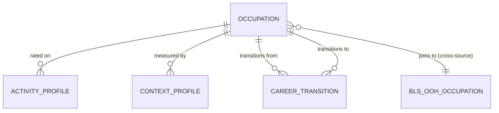

# Conceptual Model: silver-base-onet

**Status:** PROPOSED
**Mode:** Greenfield
**Zone:** Silver (Base)
**Domain:** Occupational Characteristics and Career Pathways
**Spec:** docs/specs/silver-base-onet.md
**Author:** @semantic-modeler
**Date:** 2026-04-08
**Approval:** Pending human review (REQUIRE_HUMAN_APPROVAL = true)

---

---

## Entity Descriptions

| Entity | Business Concept | Business Term | Is CDE | Is PII |
|--------|-----------------|---------------|--------|--------|
| Occupation | A distinct occupation at BLS SOC granularity (XX-XXXX), aggregated from one or more O*NET detailed codes (XX-XXXX.XX). Serves as the master O*NET occupation reference for the FutureProof pipeline. Excludes 93 structurally empty "All Other"/Military occupations. Each occupation carries data completeness flags indicating which child data (activities, context, tasks, related occupations) is available. When multiple O*NET detailed codes map to the same BLS SOC, the occupation aggregates their metadata and flags the multi-detail condition. | BT-027 | true | false |
| Activity Profile | A measurement of how important a specific Generalized Work Activity is for a given occupation. Each occupation has 41 activity ratings on the Importance (IM) scale (1.0-5.0). For multi-detail occupations, importance is the unweighted average across contributing O*NET detailed codes. Activity profiles back the HMN (Human Edge) stat in the FutureProof game system. | BT-057 | true | false |
| Context Profile | A point-estimate measurement of a Work Context dimension for a given occupation. Each occupation has up to 57 context ratings on the CX (1.0-5.0) or CT (1.0-3.0) scales. A subset of approximately 9 elements are flagged as burnout-relevant, directly feeding the Burnout boss fight formula. For multi-detail occupations, context values are unweighted averages. | BT-058 | true | false |
| Career Transition | A directional similarity relationship between two occupations, indicating that they share similar skill/knowledge profiles. Derived from O*NET Related Occupations data, aggregated to BLS SOC level. Each relationship has a relatedness tier (Primary-Short, Primary-Long, Supplemental) based on similarity ranking. These relationships power the Stage 3 career branching tree. Note: these are similarity-based, not observed career transitions. | BT-060 | false | false |

---

## Relationship Descriptions

| Relationship | From | To | Cardinality | Description |
|-------------|------|-----|-------------|-------------|
| rated on | Occupation | Activity Profile | one-to-many | An occupation has up to 41 activity profiles (one per Generalized Work Activity element). Each activity profile belongs to exactly one occupation. The full set of 41 ratings constitutes the occupation's work activity fingerprint for HMN scoring. |
| measured by | Occupation | Context Profile | one-to-many | An occupation has up to 57 context profiles (one per Work Context element on CX/CT scales). Each context profile belongs to exactly one occupation. The subset flagged as burnout elements drives the Burnout boss fight. |
| transitions from | Occupation | Career Transition | one-to-many | An occupation can be the source of many career transitions (typically 10-20 related occupations per source). Each transition has exactly one source occupation. |
| transitions to | Occupation | Career Transition | one-to-many | An occupation can be the target of many career transitions (it may be "related to" by many other occupations). Each transition has exactly one target occupation. Both source and target must exist in the Occupation entity. |
| joins to (cross-source) | Occupation | BLS OOH Occupation | many-to-zero-or-one | An O*NET occupation's bls_soc_code can join to base.bls_ooh.soc_code for employment projections, wages, and entry requirements. Not all O*NET occupations have BLS OOH matches (O*NET has ~867 vs. BLS OOH 832, with partial overlap). This is a cross-source integration relationship, not an intra-model FK. |

---

## Key Business Concepts

### Grain
The fundamental unit of analysis varies by entity:
- **Occupation:** bls_soc_code (one row per BLS-level occupation, ~867 rows)
- **Activity Profile:** bls_soc_code x element_id (one row per occupation per work activity, ~35,500 rows)
- **Context Profile:** bls_soc_code x element_id (one row per occupation per work context element, ~49,400 rows)
- **Career Transition:** bls_soc_code x related_bls_soc_code (one row per directional occupation pair, ~17,000 rows)

### O*NET-SOC to BLS SOC Aggregation (BT-063)
O*NET classifies 1,016 occupations at XX-XXXX.XX granularity. BLS uses XX-XXXX. Silver aggregates O*NET to BLS level because all cross-source joins in the FutureProof pipeline use BLS SOC as the common key. For 867 occupations, the mapping is a simple suffix truncation (.00 codes). For 76 BLS SOCs, multiple O*NET detailed codes (149 total) are averaged together, with the multi-detail condition flagged for downstream awareness.

### Content Model Element Taxonomy (BT-056)
O*NET's Content Model organizes work characteristics into a hierarchical taxonomy. Section 4.A contains 41 Generalized Work Activities (e.g., "Getting Information", "Making Decisions"). Section 4.C contains 57 Work Context dimensions (e.g., "Time Pressure", "Consequence of Error"). Each element has a stable dotted-hierarchical ID (e.g., "4.A.1.a.1", "4.C.3.d.1") that persists across O*NET releases.

### Work Activity Importance and HMN Stat (BT-057)
The Importance (IM) scale rates how important each of 41 work activities is for an occupation on a 1.0-5.0 scale. Activities with importance >= 3.5 are flagged as high-importance. These ratings are the primary input to the HMN (Human Edge) stat, which measures how much a career relies on distinctly human capabilities. The IM scale was chosen over the Level (LV) scale because FutureProof needs "how important" rather than "how complex."

### Work Context and Burnout Boss Fight (BT-058, BT-059)
Work Context point estimates (CX/CT scales) quantify environmental and structural conditions of occupations. Approximately 9 elements are designated as burnout-relevant: Time Pressure, Duration of Typical Work Week, Consequence of Error, Pace Determined by Speed of Equipment, Frequency of Decision Making, Importance of Being Exact or Accurate, Importance of Repeating Same Tasks, Responsibility for Outcomes and Results, and Work Schedules. The burnout element selection is a human-approval decision point -- the exact set may be adjusted based on review.

### Career Transitions and Stage 3 Branching (BT-060, BT-061)
Career transitions represent occupational similarity, not observed career moves. O*NET's Related Occupations data ranks up to 20 similar occupations per source, organized into three tiers: Primary-Short (index 1-5, closest matches), Primary-Long (index 6-10), and Supplemental (index 11-20). The Career Transition entity is a self-referencing graph on Occupation -- both endpoints must exist in the Occupation table. After BLS-level aggregation, self-references are removed and duplicates are resolved by keeping the best (lowest) index.

### Data Completeness Tier (BT-064)
Each occupation is classified as "full" (all 4 data types present: activities, context, tasks, related), "partial" (some present), or "none" (excluded from Silver). The 93 "All Other"/Military occupations with zero data across all child tables are excluded. The 29 partial-data occupations are retained with flags, preserving their useful task and relationship data.

### Suppress Flag (BT-062)
O*NET marks certain occupation-element ratings with recommend_suppress = "Y" when data reliability is below threshold. Silver preserves these rows but flags them, allowing downstream consumers to filter or caveat unreliable ratings. Less than 3% of ratings carry this flag.

---

## Cross-Source Integration Role

This model provides the **O*NET occupation characteristics** that enrich the BLS employment projections with work activity profiles, environmental context, and career pathway data:

| Table | Taxonomy | Role in FutureProof |
|-------|----------|---------------------|
| base.college_scorecard | CIP codes (XX.XXXX) | Program side -- what students study |
| base.bls_ooh | SOC codes (XX-XXXX) | Employment side -- growth, wages, entry requirements |
| **base.onet_occupations** (this model) | **BLS SOC codes (XX-XXXX)** | **Occupation master -- identity and data completeness** |
| **base.onet_activity_profiles** (this model) | **BLS SOC x element** | **HMN stat input -- human skill importance** |
| **base.onet_context_profiles** (this model) | **BLS SOC x element** | **Burnout boss fight input -- work environment stress** |
| **base.onet_career_transitions** (this model) | **BLS SOC x BLS SOC** | **Stage 3 branching -- career similarity graph** |
| CIP-SOC crosswalk (future spec) | CIP + SOC | Bridge table connecting programs to occupations |

The join key between this model and BLS OOH is `bls_soc_code = soc_code`. The join between this model and College Scorecard passes through the CIP-SOC crosswalk.

---

## Modeling Decisions

1. **Occupation as the central dimension entity.** All three fact-like entities (Activity Profile, Context Profile, Career Transition) reference Occupation via bls_soc_code. This star-like topology mirrors the source data structure where O*NET measures multiple dimensions per occupation. Unlike the BLS OOH conceptual model (which embedded employment, compensation, and entry requirements as sub-entities of a single table), this model has four separate tables because the fact-like entities have their own composite grains and significantly different row counts.

2. **Activity Profile and Context Profile as separate entities.** Though structurally similar (occupation x element), they represent fundamentally different concepts: activities measure "what work is done" (behaviors) while context measures "under what conditions" (environment). They use different scale systems, have different element counts (41 vs. 57), and feed different downstream products (HMN stat vs. Burnout boss fight). Combining them would conflate distinct business semantics.

3. **Career Transition as a self-referencing graph entity.** The directional occupation-to-occupation relationship is modeled as a separate entity rather than an attribute of Occupation because: (a) it has its own composite grain (source x target), (b) each occupation has many transitions, and (c) the relationship carries its own attributes (best_index, relatedness_tier). The graph structure enables path traversal for Stage 3 branching.

4. **BLS OOH as a cross-source reference, not an embedded entity.** The relationship between O*NET occupations and BLS OOH occupations is shown as a cross-source join rather than a foreign key within this model. The BLS OOH table has its own conceptual model (silver-base-bls-ooh). The join is not guaranteed to be 1:1 due to taxonomy differences between the two sources.

5. **No temporal entity.** O*NET 30.2 is a single-release snapshot. Source Load Date and Ingestion Timestamp are pipeline metadata on each table. This mirrors the modeling decision in both the College Scorecard and BLS OOH conceptual models.

6. **Burnout element designation as a flag, not a separate entity.** The ~9 burnout-relevant Work Context elements are flagged via is_burnout_element on Context Profile rather than modeled as a separate entity. They are a curated subset of the same element taxonomy, not a distinct business concept. The flag approach allows the burnout element set to be adjusted without schema changes.

7. **93 "All Other"/Military occupations excluded.** These occupations have zero data in all O*NET child tables and overlap with BLS OOH's catchall codes. Excluding them at the Silver level prevents downstream joins from producing empty results. They remain in Bronze for lineage.

---

## Scope and Boundaries

- This conceptual model covers 4 Silver base tables: base.onet_occupations, base.onet_activity_profiles, base.onet_context_profiles, base.onet_career_transitions
- Bronze zone raw data (5 raw.onet_* tables) is the source but is not modeled here (raw is physical-only per Brightsmith rules)
- Task Statements stay in Bronze -- Gemma reads task text directly for narrative generation; Silver does not add value to free-text data
- Work Activities LV (Level) scale and Work Context CXP/CTP (category percentage) data are retained in Bronze for post-hackathon enrichment
- Gold zone products (HMN stat, Burnout boss fight, Stage 3 branching tree) are downstream consumers, not part of this model
- The CIP-to-SOC crosswalk is a separate Silver spec and not included here
- This model assumes O*NET 30.2 as the source release
