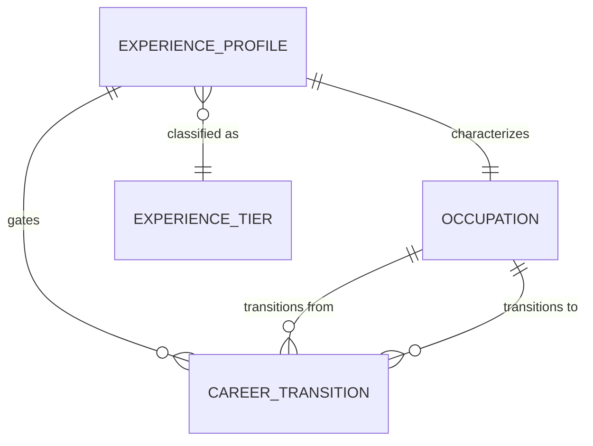

# Conceptual Model: silver-base-onet-experience

**Status:** PROPOSED
**Mode:** Greenfield
**Zone:** Silver (Base)
**Domain:** Occupational Characteristics and Career Pathways
**Spec:** docs/specs/onet-experience-requirements.md
**Author:** @semantic-modeler
**Date:** 2026-04-16
**Approval:** Pending human review (REQUIRE_HUMAN_APPROVAL = true)
**Human Approvals Referenced:** governance/approvals/onet-experience-requirements-open-decisions.md (tier thresholds, 10+ midpoint, multi-detail aggregation -- approved 2026-04-16 by Jeff Cernauske)

---

---

## Entity Descriptions

| Entity | Business Concept | Business Term | Is CDE | Is PII |
|--------|-----------------|---------------|--------|--------|
| Experience Profile | The typical prior work experience required to enter an occupation, expressed at BLS SOC granularity (XX-XXXX). Aggregated from O*NET's Related Work Experience percent frequency distribution (11 duration categories from "None" to "Over 10 years"). Each profile captures a single typical-years estimate, a tier classification, the full distribution for provenance, and a suppression flag when source data reliability is below threshold. Serves as the experience-gate layer for the FutureProof career evolution tree. | BT-117 | true | false |
| Experience Tier | A FutureProof-derived classification of occupations by typical experience requirement. Four tiers: `entry` (0-1 years), `early` (1-4 years), `mid` (4-8 years), `senior` (8+ years). Thresholds are human-approved (see `governance/approvals/onet-experience-requirements-open-decisions.md`). Used to gate career branch visibility in the evolution tree and to support decade-based bucketing ("Your 20s", "Your 30s", "Your 40s") in the frontend. | BT-118 | true | false |
| Occupation | A distinct occupation at BLS SOC granularity (XX-XXXX). Cross-source reference from `silver-base-onet` (base.onet_occupations). Not modeled here -- shown only to anchor the Experience Profile's characterizes relationship and the existing Career Transition edges. | BT-027 | true | false |
| Career Transition | A directional similarity relationship between two occupations. Cross-source reference from `silver-base-onet` (base.onet_career_transitions). Not modeled here -- shown only to anchor the "gates" relationship: Experience Profile on the target occupation determines whether a transition is reachable for a given career stage. | BT-060 | false | false |

---

## Relationship Descriptions

| Relationship | From | To | Cardinality | Description |
|-------------|------|-----|-------------|-------------|
| characterizes | Experience Profile | Occupation | one-to-one | Each occupation has at most one experience profile; each experience profile describes exactly one occupation. Profiles are created only for occupations with sufficient O*NET Related Work Experience data (scale RW, element 3.A.1). Occupations without RW coverage have no profile. |
| classified as | Experience Profile | Experience Tier | many-to-one | Every experience profile falls into exactly one tier. Tiers partition the [0, infinity) years axis into four mutually exclusive ranges. The tier boundaries are the human-approved values captured in the open-decisions approval file. |
| gates | Experience Profile | Career Transition | one-to-many | An experience profile on the target occupation of a career transition determines whether that transition is reachable at a given career stage. The frontend uses `max_experience_years` to filter the tree; each transition inherits the target's profile values. |
| transitions from | Occupation | Career Transition | one-to-many | Shown for context only. An occupation can be the source of many transitions; each transition has exactly one source. See `silver-base-onet-conceptual.md` for the full definition. |
| transitions to | Occupation | Career Transition | one-to-many | Shown for context only. An occupation can be the target of many transitions; each transition has exactly one target. See `silver-base-onet-conceptual.md` for the full definition. |

---

## Business Attributes of Experience Profile

At the conceptual level, an Experience Profile carries the following business concepts (attributes and types are elaborated in the logical model):

| Business Attribute | Description | Business Term | Is CDE | Is PII |
|-------------------|-------------|---------------|--------|--------|
| Occupation Identifier | The BLS SOC code (XX-XXXX) that uniquely identifies the occupation being characterized. Single-field natural key; same taxonomy used across all Silver base tables. | BT-027 | true | false |
| Experience Years Typical | A single scalar summary of the typical prior work experience required, derived as the midpoint of the weighted-median category from O*NET's 11 RW duration buckets. Drives the decade bucketing and unlock progression in the frontend. | BT-117 | true | false |
| Experience Tier | The four-value classification (`entry`, `early`, `mid`, `senior`) derived from Experience Years Typical using human-approved thresholds. Drives branch gating in the career evolution tree. | BT-118 | true | false |
| Experience Distribution | The full percent frequency distribution across all 11 RW duration categories, preserved as structured data for downstream analysts who need to recompute alternative summaries (e.g., different weighting schemes, incumbent-weighted medians). | BT-117 | false | false |
| Provenance -- Suppression | A flag indicating whether any O*NET row contributing to this profile was marked `recommend_suppress = "Y"` by the O*NET Data Collection Program. Signals unreliable aggregate estimates. | -- | false | false |
| Provenance -- Detail Count | The count of O*NET detail codes (XX-XXXX.XX) that contributed to the BLS-level aggregate. Values greater than 1 indicate multi-detail averaging; see human-approved multi-detail aggregation rule (unweighted mean). | -- | false | false |

---

## Key Business Concepts

### Grain
One Experience Profile per BLS SOC occupation. Expected row count: approximately 867, matching the other O*NET Silver tables (some occupations may have no RW coverage and will be absent rather than present with nulls).

### O*NET-SOC to BLS SOC Aggregation (BT-063 -- cross-source)
O*NET publishes Related Work Experience data at XX-XXXX.XX granularity. Silver aggregates to XX-XXXX to match the pipeline's canonical occupation key. When multiple O*NET detail codes map to the same BLS SOC (e.g., `15-1252.00` Software Developers and `15-1252.01` Software Developers, Applications), their `experience_years_typical` values are averaged unweighted. This matches existing O*NET Silver precedent (see `silver-base-onet-conceptual.md` Modeling Decision 7) and is human-approved in `governance/approvals/onet-experience-requirements-open-decisions.md` (Decision 3).

### Weighted Median Derivation (BT-117)
The O*NET Education, Training, and Experience dataset reports percent frequency distributions across 11 duration categories. Silver finds the **weighted median category** -- the category where cumulative frequency first crosses 50% -- then converts the category to a midpoint years value using the approved midpoint table. Tie-breaking at the 50% boundary picks the lower-numbered (more-conservative) category. Edge cases (empty distributions, all-suppressed, single-category-100%) are handled per the test matrix in `docs/specs/onet-experience-requirements.md` §Test Matrix.

### Tier Thresholds (BT-118)
The four-tier classification uses human-approved boundaries:

| Tier | Range (years) |
|------|---------------|
| `entry`  | 0 ≤ years ≤ 1  |
| `early`  | 1 < years ≤ 4  |
| `mid`    | 4 < years ≤ 8  |
| `senior` | years > 8      |

Source of approval: `governance/approvals/onet-experience-requirements-open-decisions.md` (Decision 1). These values are baked into the Silver transformer and DQ spot checks (`11-1011` Chief Executives = `senior`; `41-2031` Retail Salespersons = `entry`).

### "Over 10 years" Midpoint (BT-117)
The open-ended top category (RW category 11, "Over 10 years") resolves to **12 years** for `experience_years_typical`. This value is human-approved (`governance/approvals/onet-experience-requirements-open-decisions.md` Decision 2) and flows through to the Gold `experience_delta_years` range DQ rule (-10 ≤ delta ≤ 15).

### Suppression and Provenance
O*NET marks certain rows `recommend_suppress = "Y"` when data reliability is below threshold. Silver preserves such rows in the weighted-median computation but raises the `suppress_flag` at the profile level when any contributing row is suppressed. This lets downstream consumers filter or caveat estimates without losing the ability to audit which occupations were affected.

---

## Cross-Source Integration Role

This model extends the existing O*NET pipeline with a new experience-gating layer. It does not join to BLS OOH or College Scorecard directly -- its integration surface is the Gold `consumable.career_branches` table.

| Table | Taxonomy | Role in FutureProof |
|-------|----------|---------------------|
| base.onet_occupations (existing) | BLS SOC codes | Occupation master |
| base.onet_career_transitions (existing) | BLS SOC x BLS SOC | Career similarity edges |
| **base.onet_experience_profiles (this model)** | **BLS SOC codes** | **Experience gate per occupation** |
| consumable.career_branches (existing; modified) | BLS SOC x BLS SOC | Gold branch table; joins experience via both `soc_code` and `related_soc_code` |

The join key is `bls_soc_code` on the Silver side. At the Gold level, the same value is joined twice -- once as `soc_code` (source) and once as `related_soc_code` (target) -- producing the four additive columns documented in the Gold physical-model addendum.

---

## Modeling Decisions

1. **Single-entity model, not a star.** Unlike `silver-base-onet` which has four tables (a dimensional `Occupation` and three fact-like children), this spec adds exactly one new entity. The experience data is conceptually a single attribute bundle on each occupation, not a separate grain. Modeling it as a standalone Silver table (rather than an additional column on `base.onet_occupations`) keeps the existing `onet_occupations` table unchanged and isolates the new concern.

2. **Experience Tier as a classification, not a separate entity.** The four tiers are a fixed enumeration derived from `experience_years_typical` using approved thresholds. They are modeled as a classifier attribute on Experience Profile rather than a lookup entity because: (a) the enumeration is small and stable, (b) the relationship is deterministic, and (c) adding a dimension table would not enable any additional queries.

3. **Preserve the full distribution.** The `Experience Distribution` attribute retains the complete 11-category percent frequency distribution. This is optional to consume but essential for auditability -- it lets downstream analysts verify the weighted-median derivation, recompute alternative summaries, or surface the full distribution in a diagnostic UI.

4. **No separate entity for the source Bronze rows.** Bronze (`raw.onet_experience`) carries per-category percent frequencies per occupation per scale. Silver collapses that into one row per BLS SOC. Modeling Bronze entities here would duplicate the Bronze physical model and add no conceptual clarity.

5. **Occupation and Career Transition shown for context only.** Both entities are defined in `silver-base-onet-conceptual.md`. They appear in this model's diagram to anchor the "characterizes" and "gates" relationships but are not re-specified here.

6. **Tier boundaries are inclusive-at-lower, exclusive-at-upper (except senior).** The approved ranges are half-open: `entry` = `[0, 1]`, `early` = `(1, 4]`, `mid` = `(4, 8]`, `senior` = `(8, infinity)`. This avoids boundary-value ambiguity (a value of exactly 4 years is `early`, not `mid`).

---

## Scope and Boundaries

- This conceptual model covers 1 new Silver base table: `base.onet_experience_profiles`.
- The Bronze zone raw table (`raw.onet_experience`, all 4 scales: RL, RW, PT, OJ) is the source but is not modeled here (raw is physical-only per Brightsmith rules). Silver filters to scale `RW` (Related Work Experience) and element `3.A.1` only.
- The Gold-zone consumer is `consumable.career_branches` (4 additive columns). See the Gold physical-model addendum at `governance/models/gold-futureproof-engine-physical.md` for the Gold-side model diff.
- This model assumes O*NET 30.2 as the source release.
- No temporal modeling -- Related Work Experience is a single annual snapshot.
- Non-RW scales in the source file (RL, PT, OJ) are retained in Bronze for possible post-hackathon use but are not surfaced in Silver.
