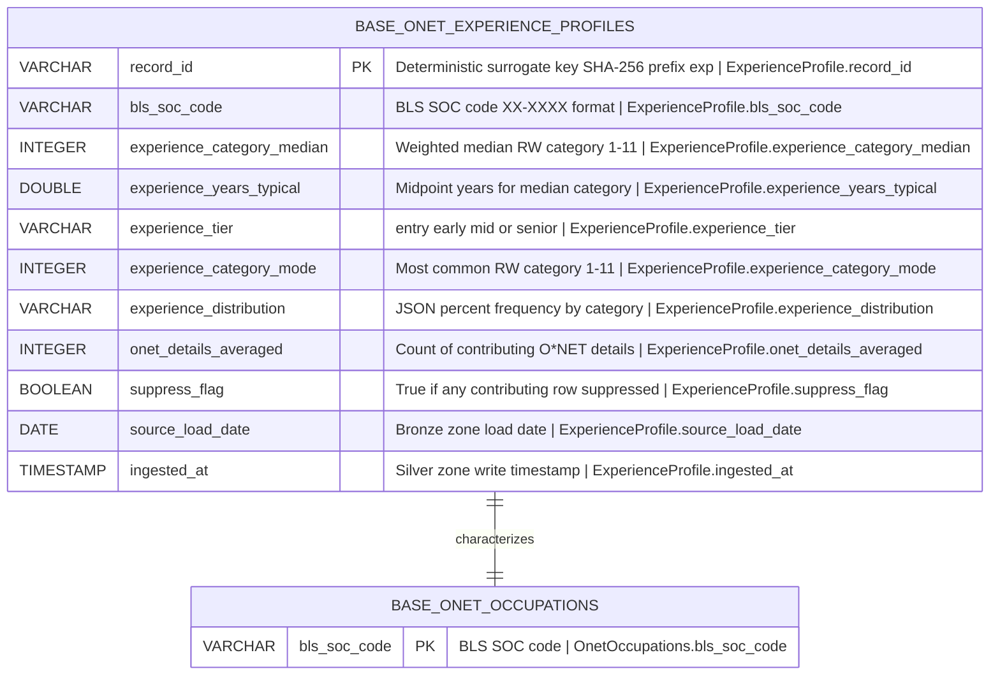

# Physical Model: silver-base-onet-experience

**Status:** PROPOSED
**Mode:** Greenfield
**Zone:** Silver (Base)
**Domain:** Occupational Characteristics and Career Pathways
**Spec:** docs/specs/onet-experience-requirements.md
**Logical Model:** governance/models/silver-base-onet-experience-logical.md
**Conceptual Model:** governance/models/silver-base-onet-experience-conceptual.md
**Author:** @semantic-modeler
**Date:** 2026-04-16
**Approval:** Pending human review (physical model approval captures PyIceberg schema, partitioning, and sort-order decisions)
**Human Approvals Referenced:** governance/approvals/onet-experience-requirements-open-decisions.md

---



---

## Table Definition

| Property | base.onet_experience_profiles |
|----------|-------------------------------|
| **Catalog namespace** | `base` |
| **Catalog table** | `base.onet_experience_profiles` |
| **Format** | Apache Iceberg (v2) |
| **Engine** | DuckDB (via `iceberg_scan`) |
| **Grain** | One row per BLS SOC |
| **Grain fields** | `bls_soc_code` |
| **record_id prefix** | `exp` |
| **Natural key** | `bls_soc_code` |
| **Surrogate key** | `record_id` |
| **Expected row count** | ~867 |
| **Partition strategy** | None (unpartitioned) |
| **Sort order** | `bls_soc_code ASC` |
| **Write pattern** | Full table replace via `promote()` |
| **Writer module** | `src/silver/onet_experience_transformer.py` (to be implemented) |
| **Compaction cadence** | On-demand; no scheduled compaction (single small file per rewrite) |

**Row count note:** The spec estimates ~867 rows. Actual row count may land slightly lower (similar to `onet_occupations` at 798) if some BLS SOCs have zero RW coverage in O*NET 30.2. EDA during Bronze implementation will confirm the exact count.

---

## Column Definitions

| Column | DuckDB Type | Nullable | Constraint | Business Term | Is CDE | Is PII | Description |
|--------|-------------|----------|------------|---------------|--------|--------|-------------|
| record_id | VARCHAR | NOT NULL | PRIMARY KEY | BT-015 | false | false | Deterministic surrogate key: `compute_grain_id(row, ['bls_soc_code'], prefix='exp')`. Format: `exp-<16 hex chars>`. Stable across pipeline re-runs. |
| bls_soc_code | VARCHAR | NOT NULL | UNIQUE; CHECK (bls_soc_code ~ '^\d{2}-\d{4}$') | BT-027 | true | false | 6-digit BLS SOC code (XX-XXXX). Natural key. Primary join key for `base.onet_occupations`, `base.onet_career_transitions`, `base.bls_ooh`, and the Gold `consumable.career_branches` (as both `soc_code` and `related_soc_code`). |
| experience_category_median | INTEGER | NOT NULL | CHECK (experience_category_median >= 1 AND experience_category_median <= 11) | BT-117 | false | false | Weighted median RW category. Range: 1-11. Internal derivation intermediate retained for auditability. Tie-break: lower-numbered category. |
| experience_years_typical | DOUBLE | NOT NULL | CHECK (experience_years_typical >= 0.0 AND experience_years_typical <= 15.0) | BT-117 | true | false | Midpoint years for the median category using the human-approved midpoint table (category 11 = 12.0 years). Range 0.0-12.0 for single-detail; 0.0-12.0 for multi-detail (unweighted mean across details bounded by category-11 midpoint). CHECK bound allows headroom to 15.0 for defensive safety. |
| experience_tier | VARCHAR | NOT NULL | CHECK (experience_tier IN ('entry', 'early', 'mid', 'senior')) | BT-118 | true | false | Four-value classifier derived from `experience_years_typical`. Thresholds human-approved 2026-04-16. Drives the UX gating decision in `career_tree.py` and decade bucketing in the frontend. |
| experience_category_mode | INTEGER | NOT NULL | CHECK (experience_category_mode >= 1 AND experience_category_mode <= 11) | -- | false | false | Most common RW category. Range: 1-11. Diagnostic field; not used in scoring. Useful for detecting bimodal distributions when compared with `experience_category_median`. |
| experience_distribution | VARCHAR | NOT NULL | -- | BT-117 | false | false | JSON object mapping RW category (as string key, "1"-"11") to percent frequency (double). Example: `'{"1": 5.2, "7": 45.3, "8": 30.1}'`. Stored as string; DuckDB can parse via `json_extract()`. |
| onet_details_averaged | INTEGER | NOT NULL | CHECK (onet_details_averaged >= 1) | BT-063 | false | false | Count of distinct O*NET detail codes (XX-XXXX.XX) that contributed to the BLS-level aggregate. 1 for single-detail occupations, 2+ for multi-detail (human-approved unweighted average). |
| suppress_flag | BOOLEAN | NOT NULL | -- | BT-062 | false | false | True if `recommend_suppress = 'Y'` in ANY contributing Bronze row. Expected true rate < 1%. Signals unreliable aggregate estimate. |
| source_load_date | DATE | NOT NULL | -- | BT-016 | false | false | Date the source data was loaded into the Bronze zone. |
| ingested_at | TIMESTAMP | NOT NULL | -- | BT-017 | false | false | Timestamp when the row was written to Silver. Generated at transformation time via `CURRENT_TIMESTAMP`. |

---

## Column Summary

| Count | Category |
|-------|----------|
| 11 | Total columns |
| 1 | Primary key (record_id) |
| 1 | Natural key (bls_soc_code) |
| 3 | CDE columns (bls_soc_code, experience_years_typical, experience_tier) |
| 0 | PII columns |
| 0 | Nullable columns |
| 11 | NOT NULL columns |
| 8 | Derived at this layer |
| 1 | Carried from Bronze (source_load_date) |
| 1 | Generated at write (ingested_at) |

---

## PyIceberg Schema Definition

This is the exact schema the Silver transformer (`src/silver/onet_experience_transformer.py`) must use when creating the Iceberg table via `promote()`. Mirrors the style used in `silver-base-onet-physical.md`.

```python
from pyiceberg.schema import Schema
from pyiceberg.types import (
    BooleanType,
    DateType,
    DoubleType,
    IntegerType,
    NestedField,
    StringType,
    TimestampType,
)

ONET_EXPERIENCE_PROFILES_SCHEMA = Schema(
    NestedField(1, "record_id", StringType(), required=True),
    NestedField(2, "bls_soc_code", StringType(), required=True),
    NestedField(3, "experience_category_median", IntegerType(), required=True),
    NestedField(4, "experience_years_typical", DoubleType(), required=True),
    NestedField(5, "experience_tier", StringType(), required=True),
    NestedField(6, "experience_category_mode", IntegerType(), required=True),
    NestedField(7, "experience_distribution", StringType(), required=True),
    NestedField(8, "onet_details_averaged", IntegerType(), required=True),
    NestedField(9, "suppress_flag", BooleanType(), required=True),
    NestedField(10, "source_load_date", DateType(), required=True),
    NestedField(11, "ingested_at", TimestampType(), required=True),
)
```

---

## Grain Fields for Promote Dedup

| Table | Grain Fields | record_id Computation |
|-------|-------------|----------------------|
| base.onet_experience_profiles | `['bls_soc_code']` | `compute_grain_id(row, ['bls_soc_code'], prefix='exp')` |

Import: `from brightsmith.infra.grain import compute_grain_id`

Precedent: this matches the promote pattern used for `base.onet_occupations` (prefix `on`, same single-field grain). See `raw-ingest-onet.md` and `silver-base-onet-physical.md` for the established pattern; the `exp` prefix is the next free 2-3 letter prefix in the O*NET Silver family (existing prefixes: `on`, `wa`, `wc`, `ct`).

---

## Partitioning Strategy

**None (unpartitioned).**

**Justification:**

| Consideration | Decision |
|---------------|----------|
| Row count | ~867 rows -- trivial size. A single Parquet file of < 100 KB is optimal. |
| Query patterns | Point lookups by `bls_soc_code` (primary) and full-table scans for Gold joins. Neither benefits from partition pruning at this size. |
| Consistency with peers | Every other O*NET Silver table (`onet_occupations` at 798 rows, `onet_activity_profiles` at 31,734, `onet_context_profiles` at 44,118, `onet_career_transitions` at 15,944) is unpartitioned. Matching this convention keeps the Silver layout uniform. |
| Compaction cost | Partitioning a sub-1k-row table would produce tiny file fragments with nontrivial metadata overhead. |

Decision: unpartitioned.

---

## Sort Order

**`bls_soc_code ASC`**

**Justification:** The primary access pattern is by `bls_soc_code` -- both the Gold `consumable.career_branches` join and any ad-hoc single-occupation lookup. Sorting by the natural key clusters related rows in the single data file, enabling efficient range-scan and equality lookup. Identical to the sort order chosen for `base.onet_occupations`.

---

## Dedup Grain

**`[bls_soc_code]`**

Enforced at `promote()`-time via `grain_fields=['bls_soc_code']`. Zero duplicates allowed. If the transformer produces two rows with the same `bls_soc_code`, `promote()` raises an error -- this would indicate a bug in the BLS-level aggregation step (two distinct O*NET aggregations producing the same target row).

---

## Storage Format and Compaction

| Property | Value |
|----------|-------|
| File format | Apache Parquet |
| Compression | Snappy (Iceberg default; inherited from catalog config) |
| Iceberg spec version | v2 |
| Write mode | Full table replace (idempotent via `promote()`) |
| Compaction cadence | On-demand only. Each `promote()` call produces one small data file. Because the table is rewritten end-to-end on each Silver run (~weekly or per-spec), no scheduled compaction is needed. |
| Snapshot retention | Use the catalog default; see `silver-base-onet-physical.md` for project-wide retention decisions. |

---

## Writes

**Transformer module:** `src/silver/onet_experience_transformer.py` (to be implemented by `bs:primary-agent` in Phase 3 step 18 of the agent workflow)

**Invocation pattern (reference -- actual code written by primary-agent):**

```python
from brightsmith.infra.grain import compute_grain_id
from brightsmith.infra.promote import promote
# ... Silver transformer logic producing a DataFrame of 11 columns ...

promote(
    df=result_df,
    table_name='base.onet_experience_profiles',
    grain_fields=['bls_soc_code'],
    prefix='exp',
)
```

The transformer reads from Bronze (`raw.onet_experience`), filters to `scale_id = 'RW'` and `element_id = '3.A.1'`, performs the weighted-median derivation at O*NET-SOC grain, truncates to BLS SOC, performs the human-approved unweighted average across multi-detail codes, and writes the 11-column output via `promote()`.

**Upstream dependency:** `raw.onet_experience` (Bronze; produced by `OnetExperienceIngestor` as the 8th subclass in `src/raw/onet_ingestor.py`, per spec §Zone 1 / §Ingestor).

---

## DDL (Reference)

This DDL is for documentation. The actual table is created via `brightsmith.infra.promote.promote()` which handles Iceberg table creation and idempotent writes.

```sql
-- Reference DDL for base.onet_experience_profiles
-- Engine: DuckDB + Iceberg v2
-- Do not execute directly -- use promote() pattern

CREATE TABLE IF NOT EXISTS base.onet_experience_profiles (
    record_id                   VARCHAR     NOT NULL,
    bls_soc_code                VARCHAR     NOT NULL,
    experience_category_median  INTEGER     NOT NULL,
    experience_years_typical    DOUBLE      NOT NULL,
    experience_tier             VARCHAR     NOT NULL,
    experience_category_mode    INTEGER     NOT NULL,
    experience_distribution     VARCHAR     NOT NULL,
    onet_details_averaged       INTEGER     NOT NULL,
    suppress_flag               BOOLEAN     NOT NULL,
    source_load_date            DATE        NOT NULL,
    ingested_at                 TIMESTAMP   NOT NULL,

    PRIMARY KEY (record_id),
    UNIQUE (bls_soc_code),

    CHECK (bls_soc_code ~ '^\d{2}-\d{4}$'),
    CHECK (experience_category_median >= 1 AND experience_category_median <= 11),
    CHECK (experience_category_mode >= 1 AND experience_category_mode <= 11),
    CHECK (experience_years_typical >= 0.0 AND experience_years_typical <= 15.0),
    CHECK (experience_tier IN ('entry', 'early', 'mid', 'senior')),
    CHECK (onet_details_averaged >= 1)
);
```

---

## Source-to-Target Mapping

| Physical Column | DuckDB Type | Source Table | Source Field | Transformation |
|-----------------|-------------|-------------|--------------|----------------|
| record_id | VARCHAR | -- | derived | `compute_grain_id(row, ['bls_soc_code'], prefix='exp')` |
| bls_soc_code | VARCHAR | raw.onet_experience | onet_soc_code | Truncate to first 7 chars (XX-XXXX) |
| experience_category_median | INTEGER | raw.onet_experience | category, data_value | Weighted median (cumulative frequency >= 50% first category; tie-break: lower) WHERE scale_id = 'RW' AND element_id = '3.A.1' |
| experience_years_typical | DOUBLE | -- | derived | Map `experience_category_median` to midpoint years table; average across details (unweighted) per human-approved Decision 3 |
| experience_tier | VARCHAR | -- | derived | `CASE WHEN years <= 1 THEN 'entry' WHEN years <= 4 THEN 'early' WHEN years <= 8 THEN 'mid' ELSE 'senior' END` |
| experience_category_mode | INTEGER | raw.onet_experience | category, data_value | `ARGMAX(data_value)` over categories per BLS SOC |
| experience_distribution | VARCHAR | raw.onet_experience | category, data_value | `to_json({cat: avg(data_value) for cat in 1..11})` |
| onet_details_averaged | INTEGER | raw.onet_experience | onet_soc_code | `COUNT(DISTINCT onet_soc_code)` per bls_soc_code group |
| suppress_flag | BOOLEAN | raw.onet_experience | recommend_suppress | `MAX(CASE WHEN recommend_suppress = 'Y' THEN 1 ELSE 0 END) = 1` |
| source_load_date | DATE | raw.onet_experience | load_date | Renamed, cast to DATE |
| ingested_at | TIMESTAMP | -- | generated | `CURRENT_TIMESTAMP` |

**Filter applied at the start of the transformation:** `WHERE scale_id = 'RW' AND element_id = '3.A.1'`. This drops the non-RW scales (RL, PT, OJ) and restricts to the single element that carries the Related Work Experience percent frequency distribution.

---

## Filtering Rules (Physical)

| Filter | SQL Expression | Effect |
|--------|---------------|--------|
| RW scale only | `WHERE scale_id = 'RW'` | Excludes RL (Education), PT (On-Site Training), OJ (On-the-Job Training) -- approximately 75% of Bronze rows |
| Related Work Experience element only | `AND element_id = '3.A.1'` | Single element carrying RW distribution |
| Exclude occupations with zero RW coverage | `HAVING COUNT(*) > 0` at O*NET detail level before BLS aggregation | Absent rather than null (documented in nullability semantics) |

---

## Nullability Semantics

All 11 columns are NOT NULL. Possible because:

| Pattern | Reason |
|---------|--------|
| Identifier/key fields | Grain and surrogate keys always present by construction. |
| Derived scalars | O*NET RW data is complete for all retained occupations. Occupations without RW coverage are excluded entirely. |
| Distribution JSON | Always populated (empty-distribution edge case produces no row per §Test Matrix in spec). |
| Provenance fields | `onet_details_averaged >= 1` by construction; `suppress_flag` defaults to `false`. |
| Metadata | `source_load_date` always carried from Bronze; `ingested_at` always generated at write time. |

If a row exists in this table, all fields are populated. Occupations with no RW data in Bronze simply do not appear.

---

## Foreign Key Relationships (Physical)

| Source Table | Source Column | Target Table | Target Column | Enforcement |
|-------------|-------------|-------------|--------------|-------------|
| base.onet_experience_profiles | bls_soc_code | base.onet_occupations | bls_soc_code | DQ rule (referential integrity check) |

**Gold-zone downstream joins (enforced in Gold DQ, not Silver):**

| Gold Column | Joins To | Produces |
|-------------|----------|----------|
| consumable.career_branches.soc_code | base.onet_experience_profiles.bls_soc_code | `source_experience_years` |
| consumable.career_branches.related_soc_code | base.onet_experience_profiles.bls_soc_code | `related_experience_years`, `related_experience_tier`, and `experience_delta_years` (NULL-propagating) |

---

## Traceability: Logical to Physical

| Logical Attribute | Type Domain | Physical Column | DuckDB Type | PyIceberg Type | NestedField ID |
|-------------------|-----------|-----------------|-------------|----------------|----------------|
| record_id | identifier | record_id | VARCHAR | StringType | 1 |
| bls_soc_code | identifier | bls_soc_code | VARCHAR | StringType | 2 |
| experience_category_median | numeric (count) | experience_category_median | INTEGER | IntegerType | 3 |
| experience_years_typical | numeric (rating) | experience_years_typical | DOUBLE | DoubleType | 4 |
| experience_tier | text | experience_tier | VARCHAR | StringType | 5 |
| experience_category_mode | numeric (count) | experience_category_mode | INTEGER | IntegerType | 6 |
| experience_distribution | text | experience_distribution | VARCHAR | StringType | 7 |
| onet_details_averaged | numeric (count) | onet_details_averaged | INTEGER | IntegerType | 8 |
| suppress_flag | boolean | suppress_flag | BOOLEAN | BooleanType | 9 |
| source_load_date | date | source_load_date | DATE | DateType | 10 |
| ingested_at | timestamp | ingested_at | TIMESTAMP | TimestampType | 11 |

---

## Implementation Notes

### Prefix choice: `exp`

The 2-3 letter prefix `exp` is chosen to match the existing O*NET Silver family (`on`, `wa`, `wc`, `ct`). The 3-letter variant is used here because:
- `ex` is ambiguous and might collide with future abbreviations.
- `exp` is unambiguous (stands for "experience").
- Matches the precedent established in `raw-ingest-onet.md` that new Silver tables in this family use short mnemonic prefixes.

### experience_distribution as JSON string

Stored as a VARCHAR containing a JSON object, not a native nested type. Rationale:
- DuckDB's Iceberg integration is stronger on scalar types than on maps/structs.
- Downstream consumers can use `json_extract()` or `json_extract_path()` for targeted lookups, or `json_parse()` for full deserialization.
- Matches the pattern used in `base.onet_occupations.onet_detail_codes` (JSON array of strings stored as VARCHAR).

### CHECK bound on experience_years_typical

The upper bound `<= 15.0` is intentionally looser than the theoretical maximum of 12.0 (category-11 midpoint). This allows defensive headroom without false-positive failures. The real validation is done in DQ rules (`governance/dq-rules/silver-onet-experience.json`) which enforce tighter, domain-informed bounds and spot checks (e.g., `11-1011 Chief Executives` tier = `senior`, `41-2031 Retail Salespersons` tier = `entry`).

### Tie-breaking at 50% cumulative frequency

When the cumulative frequency reaches exactly 50.0% at a category boundary, the weighted-median algorithm picks the **lower-numbered** (more-conservative) category. This matches the human-approved test-matrix case "Tie at 50%" in `docs/specs/onet-experience-requirements.md` §Test Matrix and is a deliberate choice to avoid overstating experience requirements.

### No chaos-monkey target rows at this layer

Chaos hardening of the weighted-median edge cases (empty distribution, single-category 100%, all-suppressed, tie at 50%, multi-detail aggregation) happens at the Bronze layer (`bs:chaos-monkey` step 9) and in the Silver transformer's test suite. This physical model is deterministic given clean Bronze inputs.

---

## Open Issues

None. All prior open decisions were resolved in `governance/approvals/onet-experience-requirements-open-decisions.md` before this model was authored.
