```mermaid
erDiagram
    BASE_ONET_OCCUPATIONS {
        VARCHAR record_id PK "Deterministic surrogate key SHA-256 prefix on | OnetOccupations.record_id"
        VARCHAR bls_soc_code "BLS SOC code XX-XXXX format | OnetOccupations.bls_soc_code"
        VARCHAR primary_title "Occupation title from base .00 code | OnetOccupations.primary_title"
        VARCHAR description "Occupation functional summary | OnetOccupations.description"
        VARCHAR onet_detail_codes "JSON array of O*NET-SOC codes | OnetOccupations.onet_detail_codes"
        INTEGER onet_detail_count "Count of O*NET details per BLS SOC | OnetOccupations.onet_detail_count"
        BOOLEAN multi_detail_flag "True when onet_detail_count gt 1 | OnetOccupations.multi_detail_flag"
        BOOLEAN has_work_activities "Any detail has Work Activities | OnetOccupations.has_work_activities"
        BOOLEAN has_work_context "Any detail has Work Context | OnetOccupations.has_work_context"
        BOOLEAN has_tasks "Any detail has Task Statements | OnetOccupations.has_tasks"
        BOOLEAN has_related "Any detail has Related Occupations | OnetOccupations.has_related"
        VARCHAR data_completeness_tier "full or partial tier | OnetOccupations.data_completeness_tier"
        DATE source_load_date "Bronze zone load date | OnetOccupations.source_load_date"
        TIMESTAMP ingested_at "Silver zone write timestamp | OnetOccupations.ingested_at"
    }

    BASE_ONET_ACTIVITY_PROFILES {
        VARCHAR record_id PK "Deterministic surrogate key SHA-256 prefix wa | OnetActivityProfiles.record_id"
        VARCHAR bls_soc_code FK "BLS SOC code XX-XXXX format | OnetActivityProfiles.bls_soc_code"
        VARCHAR element_id "Content Model element ID | OnetActivityProfiles.element_id"
        VARCHAR element_name "Human-readable activity name | OnetActivityProfiles.element_name"
        DOUBLE importance "IM scale importance rating 1.0-5.0 | OnetActivityProfiles.importance"
        INTEGER importance_rank "Rank within occupation 1 equals most important | OnetActivityProfiles.importance_rank"
        BOOLEAN is_high_importance "True if importance gte 3.5 | OnetActivityProfiles.is_high_importance"
        INTEGER onet_details_averaged "Count of contributing detail codes | OnetActivityProfiles.onet_details_averaged"
        BOOLEAN suppress_flag "True if any source row suppressed | OnetActivityProfiles.suppress_flag"
        DATE source_load_date "Bronze zone load date | OnetActivityProfiles.source_load_date"
        TIMESTAMP ingested_at "Silver zone write timestamp | OnetActivityProfiles.ingested_at"
    }

    BASE_ONET_CONTEXT_PROFILES {
        VARCHAR record_id PK "Deterministic surrogate key SHA-256 prefix wc | OnetContextProfiles.record_id"
        VARCHAR bls_soc_code FK "BLS SOC code XX-XXXX format | OnetContextProfiles.bls_soc_code"
        VARCHAR element_id "Content Model element ID | OnetContextProfiles.element_id"
        VARCHAR element_name "Human-readable context dimension | OnetContextProfiles.element_name"
        VARCHAR scale_id "Scale identifier CX or CT | OnetContextProfiles.scale_id"
        DOUBLE context_value "CX 1.0-5.0 or CT 1.0-3.0 point estimate | OnetContextProfiles.context_value"
        BOOLEAN is_burnout_element "True for 9 burnout-relevant elements | OnetContextProfiles.is_burnout_element"
        INTEGER onet_details_averaged "Count of contributing detail codes | OnetContextProfiles.onet_details_averaged"
        BOOLEAN suppress_flag "True if any source row suppressed | OnetContextProfiles.suppress_flag"
        DATE source_load_date "Bronze zone load date | OnetContextProfiles.source_load_date"
        TIMESTAMP ingested_at "Silver zone write timestamp | OnetContextProfiles.ingested_at"
    }

    BASE_ONET_CAREER_TRANSITIONS {
        VARCHAR record_id PK "Deterministic surrogate key SHA-256 prefix ct | OnetCareerTransitions.record_id"
        VARCHAR bls_soc_code FK "Source occupation BLS SOC code | OnetCareerTransitions.bls_soc_code"
        VARCHAR related_bls_soc_code FK "Target occupation BLS SOC code | OnetCareerTransitions.related_bls_soc_code"
        INTEGER best_index "Best relatedness index 1-20 lower is more similar | OnetCareerTransitions.best_index"
        VARCHAR relatedness_tier "Primary-Short or Primary-Long or Supplemental | OnetCareerTransitions.relatedness_tier"
        BOOLEAN is_primary "True when tier is Primary-Short or Primary-Long | OnetCareerTransitions.is_primary"
        VARCHAR relationship_type "Always similarity for this source | OnetCareerTransitions.relationship_type"
        DATE source_load_date "Bronze zone load date | OnetCareerTransitions.source_load_date"
        TIMESTAMP ingested_at "Silver zone write timestamp | OnetCareerTransitions.ingested_at"
    }

    BASE_ONET_OCCUPATIONS ||--o{ BASE_ONET_ACTIVITY_PROFILES : "rated on"
    BASE_ONET_OCCUPATIONS ||--o{ BASE_ONET_CONTEXT_PROFILES : "measured by"
    BASE_ONET_OCCUPATIONS ||--o{ BASE_ONET_CAREER_TRANSITIONS : "transitions from"
    BASE_ONET_OCCUPATIONS ||--o{ BASE_ONET_CAREER_TRANSITIONS : "transitions to"
```

# Physical Model: silver-base-onet

**Status:** PROPOSED
**Mode:** Greenfield
**Zone:** Silver (Base)
**Domain:** Occupational Characteristics and Career Pathways
**Spec:** docs/specs/silver-base-onet.md
**Logical Model:** governance/models/silver-base-onet-logical.md
**Conceptual Model:** governance/models/silver-base-onet-conceptual.md
**Author:** @semantic-modeler
**Date:** 2026-04-08
**Approval:** Auto-generated from approved logical model (physical stage does not require human approval)

---



---

## Table Definitions

| Property | base.onet_occupations | base.onet_activity_profiles | base.onet_context_profiles | base.onet_career_transitions |
|----------|----------------------|----------------------------|----------------------------|------------------------------|
| **Catalog table** | `base.onet_occupations` | `base.onet_activity_profiles` | `base.onet_context_profiles` | `base.onet_career_transitions` |
| **Format** | Apache Iceberg (v2) | Apache Iceberg (v2) | Apache Iceberg (v2) | Apache Iceberg (v2) |
| **Engine** | DuckDB (via `iceberg_scan`) | DuckDB (via `iceberg_scan`) | DuckDB (via `iceberg_scan`) | DuckDB (via `iceberg_scan`) |
| **Grain** | One row per BLS SOC | One row per BLS SOC x element | One row per BLS SOC x element | One row per BLS SOC pair |
| **Grain fields** | `bls_soc_code` | `bls_soc_code`, `element_id` | `bls_soc_code`, `element_id` | `bls_soc_code`, `related_bls_soc_code` |
| **record_id prefix** | `on` | `wa` | `wc` | `ct` |
| **Natural key** | `bls_soc_code` | `bls_soc_code`, `element_id` | `bls_soc_code`, `element_id` | `bls_soc_code`, `related_bls_soc_code` |
| **Surrogate key** | `record_id` | `record_id` | `record_id` | `record_id` |
| **Expected row count** | 798 | 31,734 | 44,118 | 15,944 |
| **Partition strategy** | None | None | None | None |
| **Sort order** | `bls_soc_code ASC` | `bls_soc_code ASC, element_id ASC` | `bls_soc_code ASC, element_id ASC` | `bls_soc_code ASC, related_bls_soc_code ASC` |
| **Write pattern** | Full table replace via `promote()` | Full table replace via `promote()` | Full table replace via `promote()` | Full table replace via `promote()` |

**Row count notes (from EDA):**
- onet_occupations: 798 (not ~867 as spec estimates -- 69 BLS SOCs truly empty at BLS level, not 93)
- onet_activity_profiles: 774 BLS SOCs x 41 elements = 31,734 (not ~35,547 -- only 774 of 798 have WA data)
- onet_context_profiles: 774 BLS SOCs x 57 elements = 44,118 (not ~49,419 -- only 774 of 798 have WC data)
- onet_career_transitions: 15,944 (within spec range of ~16,000-18,000)

---

## Table 1: base.onet_occupations

### Column Definitions

| Column | DuckDB Type | Nullable | Constraint | Business Term | Is CDE | Is PII | Description |
|--------|-------------|----------|------------|---------------|--------|--------|-------------|
| record_id | VARCHAR | NOT NULL | PRIMARY KEY | BT-015 | false | false | Deterministic surrogate key: `compute_grain_id(row, ['bls_soc_code'], prefix='on')`. Format: `on-<16 hex chars>`. Stable across re-runs. |
| bls_soc_code | VARCHAR | NOT NULL | UNIQUE; CHECK (bls_soc_code ~ '^\d{2}-\d{4}$') | BT-027 | true | false | 6-digit BLS SOC code (XX-XXXX). Natural key. Primary join key for BLS OOH and CIP-SOC crosswalk. |
| primary_title | VARCHAR | NOT NULL | -- | BT-028 | false | false | Title of the .00 base code, or first detailed code's title if no .00 exists. |
| description | VARCHAR | NOT NULL | -- | -- | false | false | Description of the .00 base code. Functional summary from O*NET. |
| onet_detail_codes | VARCHAR | NOT NULL | -- | BT-055 | false | false | JSON array of all O*NET-SOC codes (XX-XXXX.XX) mapping to this BLS SOC, sorted ascending. |
| onet_detail_count | INTEGER | NOT NULL | CHECK (onet_detail_count >= 1 AND onet_detail_count <= 10) | BT-063 | false | false | Count of O*NET detailed codes mapping to this BLS SOC. Range: 1-10 (max observed: 10 for 15-1299). |
| multi_detail_flag | BOOLEAN | NOT NULL | -- | BT-063 | false | false | True when onet_detail_count > 1. Exactly 76 BLS SOCs have this flag set. |
| has_work_activities | BOOLEAN | NOT NULL | -- | BT-064 | false | false | True if any O*NET detail code for this BLS SOC has Work Activities data in Bronze. |
| has_work_context | BOOLEAN | NOT NULL | -- | BT-064 | false | false | True if any O*NET detail code for this BLS SOC has Work Context data in Bronze. |
| has_tasks | BOOLEAN | NOT NULL | -- | BT-064 | false | false | True if any O*NET detail code for this BLS SOC has Task Statements in Bronze. |
| has_related | BOOLEAN | NOT NULL | -- | BT-064 | false | false | True if any O*NET detail code for this BLS SOC has Related Occupations in Bronze. |
| data_completeness_tier | VARCHAR | NOT NULL | CHECK (data_completeness_tier IN ('full', 'partial')) | BT-064 | true | false | "full" (all 4 data types present) or "partial" (some present). "none" excluded from Silver. |
| source_load_date | DATE | NOT NULL | -- | BT-016 | false | false | Date the source data was loaded into the Bronze zone. |
| ingested_at | TIMESTAMP | NOT NULL | -- | BT-017 | false | false | Timestamp when the row was written to Silver. Generated at transformation time. |

---

## Table 2: base.onet_activity_profiles

### Column Definitions

| Column | DuckDB Type | Nullable | Constraint | Business Term | Is CDE | Is PII | Description |
|--------|-------------|----------|------------|---------------|--------|--------|-------------|
| record_id | VARCHAR | NOT NULL | PRIMARY KEY | BT-015 | false | false | Deterministic surrogate key: `compute_grain_id(row, ['bls_soc_code', 'element_id'], prefix='wa')`. Format: `wa-<16 hex chars>`. |
| bls_soc_code | VARCHAR | NOT NULL | CHECK (bls_soc_code ~ '^\d{2}-\d{4}$') | BT-027 | true | false | 6-digit BLS SOC code. FK to base.onet_occupations.bls_soc_code. |
| element_id | VARCHAR | NOT NULL | -- | BT-056 | true | false | Content Model element ID (e.g., "4.A.1.a.1"). Exactly 41 distinct values. |
| element_name | VARCHAR | NOT NULL | -- | -- | false | false | Human-readable activity name (e.g., "Getting Information"). Denormalized from Bronze. |
| importance | DOUBLE | NOT NULL | CHECK (importance >= 1.0 AND importance <= 5.0) | BT-057 | true | false | IM scale data_value, averaged across O*NET details if multi-detail. Range: 1.0-5.0. Primary HMN stat input. |
| importance_rank | INTEGER | NOT NULL | CHECK (importance_rank >= 1 AND importance_rank <= 41) | BT-065 | false | false | Rank of this activity within occupation (1 = most important, 41 = least). |
| is_high_importance | BOOLEAN | NOT NULL | -- | -- | false | false | True if importance >= 3.5. Convenience threshold flag (~38.6% True). |
| onet_details_averaged | INTEGER | NOT NULL | CHECK (onet_details_averaged >= 1) | BT-063 | false | false | Count of O*NET detail codes that contributed to this importance value. |
| suppress_flag | BOOLEAN | NOT NULL | -- | BT-062 | false | false | True if recommend_suppress = "Y" in any contributing Bronze row. Expected < 0.01% True. |
| source_load_date | DATE | NOT NULL | -- | BT-016 | false | false | Date the source data was loaded into the Bronze zone. |
| ingested_at | TIMESTAMP | NOT NULL | -- | BT-017 | false | false | Timestamp when the row was written to Silver. |

---

## Table 3: base.onet_context_profiles

### Column Definitions

| Column | DuckDB Type | Nullable | Constraint | Business Term | Is CDE | Is PII | Description |
|--------|-------------|----------|------------|---------------|--------|--------|-------------|
| record_id | VARCHAR | NOT NULL | PRIMARY KEY | BT-015 | false | false | Deterministic surrogate key: `compute_grain_id(row, ['bls_soc_code', 'element_id'], prefix='wc')`. Format: `wc-<16 hex chars>`. |
| bls_soc_code | VARCHAR | NOT NULL | CHECK (bls_soc_code ~ '^\d{2}-\d{4}$') | BT-027 | true | false | 6-digit BLS SOC code. FK to base.onet_occupations.bls_soc_code. |
| element_id | VARCHAR | NOT NULL | -- | BT-056 | true | false | Content Model element ID (e.g., "4.C.3.d.1"). Exactly 57 distinct values. |
| element_name | VARCHAR | NOT NULL | -- | -- | false | false | Human-readable context dimension name (e.g., "Time Pressure"). Denormalized from Bronze. |
| scale_id | VARCHAR | NOT NULL | CHECK (scale_id IN ('CX', 'CT')) | -- | false | false | Scale identifier: "CX" (55 elements, range 1.0-5.0) or "CT" (2 elements, range 1.0-3.0). |
| context_value | DOUBLE | NOT NULL | CHECK (context_value >= 1.0 AND context_value <= 5.0) | BT-058 | true | false | Point estimate value. CX: 1.0-5.0, CT: 1.0-3.0 (both within 1.0-5.0 bound). Primary Burnout stat input. |
| is_burnout_element | BOOLEAN | NOT NULL | -- | BT-059 | false | false | True for the 9 burnout-relevant Work Context elements (corrected IDs from EDA validation). |
| onet_details_averaged | INTEGER | NOT NULL | CHECK (onet_details_averaged >= 1) | BT-063 | false | false | Count of O*NET detail codes that contributed to this context value. |
| suppress_flag | BOOLEAN | NOT NULL | -- | BT-062 | false | false | True if recommend_suppress = "Y" in any contributing Bronze row. Expected < 0.05% True. |
| source_load_date | DATE | NOT NULL | -- | BT-016 | false | false | Date the source data was loaded into the Bronze zone. |
| ingested_at | TIMESTAMP | NOT NULL | -- | BT-017 | false | false | Timestamp when the row was written to Silver. |

---

## Table 4: base.onet_career_transitions

### Column Definitions

| Column | DuckDB Type | Nullable | Constraint | Business Term | Is CDE | Is PII | Description |
|--------|-------------|----------|------------|---------------|--------|--------|-------------|
| record_id | VARCHAR | NOT NULL | PRIMARY KEY | BT-015 | false | false | Deterministic surrogate key: `compute_grain_id(row, ['bls_soc_code', 'related_bls_soc_code'], prefix='ct')`. Format: `ct-<16 hex chars>`. |
| bls_soc_code | VARCHAR | NOT NULL | CHECK (bls_soc_code ~ '^\d{2}-\d{4}$') | BT-027 | false | false | Source occupation: 6-digit BLS SOC code. FK to base.onet_occupations.bls_soc_code. |
| related_bls_soc_code | VARCHAR | NOT NULL | CHECK (related_bls_soc_code ~ '^\d{2}-\d{4}$') | BT-027 | false | false | Target occupation: 6-digit BLS SOC code. FK to base.onet_occupations.bls_soc_code. Must differ from bls_soc_code. |
| best_index | INTEGER | NOT NULL | CHECK (best_index >= 1 AND best_index <= 20) | BT-061 | false | false | Best (lowest) relatedness index across O*NET detail pairings. Lower = more similar. |
| relatedness_tier | VARCHAR | NOT NULL | CHECK (relatedness_tier IN ('Primary-Short', 'Primary-Long', 'Supplemental')) | BT-061 | false | false | Tier derived from best_index: 1-5 = "Primary-Short", 6-10 = "Primary-Long", 11-20 = "Supplemental". |
| is_primary | BOOLEAN | NOT NULL | -- | -- | false | false | True when relatedness_tier is "Primary-Short" or "Primary-Long". Convenience filter flag. |
| relationship_type | VARCHAR | NOT NULL | CHECK (relationship_type IN ('similarity')) | BT-060 | false | false | Always "similarity" for O*NET Related Occupations. Future-proofed for transition data. |
| source_load_date | DATE | NOT NULL | -- | BT-016 | false | false | Date the source data was loaded into the Bronze zone. |
| ingested_at | TIMESTAMP | NOT NULL | -- | BT-017 | false | false | Timestamp when the row was written to Silver. |

---

## Column Summary

| Table | Total | PK | NK Fields | CDE | PII | Nullable | NOT NULL |
|-------|-------|----|-----------|-----|-----|----------|----------|
| base.onet_occupations | 14 | 1 | 1 | 2 | 0 | 0 | 14 |
| base.onet_activity_profiles | 11 | 1 | 2 | 3 | 0 | 0 | 11 |
| base.onet_context_profiles | 11 | 1 | 2 | 3 | 0 | 0 | 11 |
| base.onet_career_transitions | 9 | 1 | 2 | 0 | 0 | 0 | 9 |
| **Total** | **45** | **4** | **7** | **8** | **0** | **0** | **45** |

---

## PyIceberg Schema Definitions

These are the exact schemas the Silver transformers must use when creating Iceberg tables via `promote()`.

### base.onet_occupations

```python
from pyiceberg.schema import Schema
from pyiceberg.types import (
    BooleanType,
    DateType,
    IntegerType,
    NestedField,
    StringType,
    TimestampType,
)

ONET_OCCUPATIONS_SCHEMA = Schema(
    NestedField(1, "record_id", StringType(), required=True),
    NestedField(2, "bls_soc_code", StringType(), required=True),
    NestedField(3, "primary_title", StringType(), required=True),
    NestedField(4, "description", StringType(), required=True),
    NestedField(5, "onet_detail_codes", StringType(), required=True),
    NestedField(6, "onet_detail_count", IntegerType(), required=True),
    NestedField(7, "multi_detail_flag", BooleanType(), required=True),
    NestedField(8, "has_work_activities", BooleanType(), required=True),
    NestedField(9, "has_work_context", BooleanType(), required=True),
    NestedField(10, "has_tasks", BooleanType(), required=True),
    NestedField(11, "has_related", BooleanType(), required=True),
    NestedField(12, "data_completeness_tier", StringType(), required=True),
    NestedField(13, "source_load_date", DateType(), required=True),
    NestedField(14, "ingested_at", TimestampType(), required=True),
)
```

### base.onet_activity_profiles

```python
from pyiceberg.schema import Schema
from pyiceberg.types import (
    BooleanType,
    DateType,
    DoubleType,
    IntegerType,
    NestedField,
    StringType,
    TimestampType,
)

ONET_ACTIVITY_PROFILES_SCHEMA = Schema(
    NestedField(1, "record_id", StringType(), required=True),
    NestedField(2, "bls_soc_code", StringType(), required=True),
    NestedField(3, "element_id", StringType(), required=True),
    NestedField(4, "element_name", StringType(), required=True),
    NestedField(5, "importance", DoubleType(), required=True),
    NestedField(6, "importance_rank", IntegerType(), required=True),
    NestedField(7, "is_high_importance", BooleanType(), required=True),
    NestedField(8, "onet_details_averaged", IntegerType(), required=True),
    NestedField(9, "suppress_flag", BooleanType(), required=True),
    NestedField(10, "source_load_date", DateType(), required=True),
    NestedField(11, "ingested_at", TimestampType(), required=True),
)
```

### base.onet_context_profiles

```python
from pyiceberg.schema import Schema
from pyiceberg.types import (
    BooleanType,
    DateType,
    DoubleType,
    IntegerType,
    NestedField,
    StringType,
    TimestampType,
)

ONET_CONTEXT_PROFILES_SCHEMA = Schema(
    NestedField(1, "record_id", StringType(), required=True),
    NestedField(2, "bls_soc_code", StringType(), required=True),
    NestedField(3, "element_id", StringType(), required=True),
    NestedField(4, "element_name", StringType(), required=True),
    NestedField(5, "scale_id", StringType(), required=True),
    NestedField(6, "context_value", DoubleType(), required=True),
    NestedField(7, "is_burnout_element", BooleanType(), required=True),
    NestedField(8, "onet_details_averaged", IntegerType(), required=True),
    NestedField(9, "suppress_flag", BooleanType(), required=True),
    NestedField(10, "source_load_date", DateType(), required=True),
    NestedField(11, "ingested_at", TimestampType(), required=True),
)
```

### base.onet_career_transitions

```python
from pyiceberg.schema import Schema
from pyiceberg.types import (
    BooleanType,
    DateType,
    IntegerType,
    NestedField,
    StringType,
    TimestampType,
)

ONET_CAREER_TRANSITIONS_SCHEMA = Schema(
    NestedField(1, "record_id", StringType(), required=True),
    NestedField(2, "bls_soc_code", StringType(), required=True),
    NestedField(3, "related_bls_soc_code", StringType(), required=True),
    NestedField(4, "best_index", IntegerType(), required=True),
    NestedField(5, "relatedness_tier", StringType(), required=True),
    NestedField(6, "is_primary", BooleanType(), required=True),
    NestedField(7, "relationship_type", StringType(), required=True),
    NestedField(8, "source_load_date", DateType(), required=True),
    NestedField(9, "ingested_at", TimestampType(), required=True),
)
```

---

## Grain Fields for Promote Dedup

These grain fields are passed to `promote()` for deduplication. Zero duplicates enforced on grain fields at load time.

| Table | Grain Fields | record_id Computation |
|-------|-------------|----------------------|
| base.onet_occupations | `['bls_soc_code']` | `compute_grain_id(row, ['bls_soc_code'], prefix='on')` |
| base.onet_activity_profiles | `['bls_soc_code', 'element_id']` | `compute_grain_id(row, ['bls_soc_code', 'element_id'], prefix='wa')` |
| base.onet_context_profiles | `['bls_soc_code', 'element_id']` | `compute_grain_id(row, ['bls_soc_code', 'element_id'], prefix='wc')` |
| base.onet_career_transitions | `['bls_soc_code', 'related_bls_soc_code']` | `compute_grain_id(row, ['bls_soc_code', 'related_bls_soc_code'], prefix='ct')` |

Import: `from brightsmith.infra.grain import compute_grain_id`

---

## Derivation Rules (Implementation Expressions)

### Table 1: base.onet_occupations

| Column | Expression | Source Fields | Notes |
|--------|-----------|---------------|-------|
| record_id | `compute_grain_id(row, ['bls_soc_code'], prefix='on')` | bls_soc_code | SHA-256 truncated to 16 hex chars. Output: `on-<hex>`. |
| bls_soc_code | `onet_soc_code[:7]` | raw.onet_occupations.onetsoc_code | Truncate O*NET-SOC to first 7 chars (XX-XXXX). |
| primary_title | Title from .00 base code; if no .00, first detailed code's title alphabetically | raw.onet_occupations.title | Priority: .00 > first alpha sort of detail codes. |
| description | Description from .00 base code; if no .00, first detailed code's description | raw.onet_occupations.description | Same priority as primary_title. |
| onet_detail_codes | `json_array(sorted(onet_soc_codes))` | raw.onet_occupations.onetsoc_code | JSON array string, sorted ascending. |
| onet_detail_count | `len(onet_detail_codes)` | onet_detail_codes | Integer count of array elements. |
| multi_detail_flag | `onet_detail_count > 1` | onet_detail_count | Boolean. 76 True expected. |
| has_work_activities | `EXISTS(WA data for any detail in this BLS SOC)` | raw.onet_work_activities | Boolean. 774 True, 24 False. |
| has_work_context | `EXISTS(WC data for any detail in this BLS SOC)` | raw.onet_work_context | Boolean. 774 True, 24 False. |
| has_tasks | `EXISTS(Task data for any detail in this BLS SOC)` | raw.onet_task_statements | Boolean. 798 True, 0 False in Silver. |
| has_related | `EXISTS(Related data for any detail in this BLS SOC)` | raw.onet_related_occupations | Boolean. 798 True, 0 False in Silver. |
| data_completeness_tier | `'full'` if all 4 True; `'partial'` if any but not all; `'none'` excluded | has_* flags | Only "full" (774) and "partial" (24) in Silver. |
| source_load_date | `CAST(raw_load_date AS DATE)` | load_date (raw) | Renamed from Bronze `load_date`. |
| ingested_at | `CURRENT_TIMESTAMP` | -- | Generated at Silver transformation time. |

### Table 2: base.onet_activity_profiles

| Column | Expression | Source Fields | Notes |
|--------|-----------|---------------|-------|
| record_id | `compute_grain_id(row, ['bls_soc_code', 'element_id'], prefix='wa')` | bls_soc_code, element_id | SHA-256 truncated to 16 hex chars. |
| bls_soc_code | `onet_soc_code[:7]` | raw.onet_work_activities.onetsoc_code | Truncated. |
| element_id | Direct pass-through | raw.onet_work_activities.element_id | 41 distinct values. |
| element_name | Direct pass-through | raw.onet_work_activities.element_name | Denormalized from Bronze. |
| importance | `AVG(data_value) WHERE scale_id = 'IM'` grouped by bls_soc_code, element_id | raw.onet_work_activities.data_value | Unweighted average across O*NET details. |
| importance_rank | `RANK() OVER (PARTITION BY bls_soc_code ORDER BY importance DESC)` | importance | 1 = most important. |
| is_high_importance | `importance >= 3.5` | importance | ~38.6% True. |
| onet_details_averaged | `COUNT(DISTINCT onet_soc_code)` per group | raw.onet_work_activities.onetsoc_code | 1 for most; 2+ for multi-detail. |
| suppress_flag | `MAX(CASE WHEN recommend_suppress = 'Y' THEN 1 ELSE 0 END) = 1` | raw.onet_work_activities.recommend_suppress | Logical OR. Expected < 0.01% True. |
| source_load_date | `CAST(raw_load_date AS DATE)` | load_date (raw) | Renamed from Bronze. |
| ingested_at | `CURRENT_TIMESTAMP` | -- | Generated at transformation time. |

### Table 3: base.onet_context_profiles

| Column | Expression | Source Fields | Notes |
|--------|-----------|---------------|-------|
| record_id | `compute_grain_id(row, ['bls_soc_code', 'element_id'], prefix='wc')` | bls_soc_code, element_id | SHA-256 truncated to 16 hex chars. |
| bls_soc_code | `onet_soc_code[:7]` | raw.onet_work_context.onetsoc_code | Truncated. |
| element_id | Direct pass-through | raw.onet_work_context.element_id | 57 distinct values. |
| element_name | Direct pass-through | raw.onet_work_context.element_name | Denormalized from Bronze. |
| scale_id | Direct pass-through | raw.onet_work_context.scale_id | "CX" (55 elements) or "CT" (2 elements). |
| context_value | `AVG(data_value) WHERE scale_id IN ('CX', 'CT')` grouped by bls_soc_code, element_id | raw.onet_work_context.data_value | Unweighted average. |
| is_burnout_element | See corrected burnout element list below | element_id | 9 elements (EDA-validated IDs). |
| onet_details_averaged | `COUNT(DISTINCT onet_soc_code)` per group | raw.onet_work_context.onetsoc_code | 1 for most; 2+ for multi-detail. |
| suppress_flag | `MAX(CASE WHEN recommend_suppress = 'Y' THEN 1 ELSE 0 END) = 1` | raw.onet_work_context.recommend_suppress | Logical OR. Expected < 0.05% True. |
| source_load_date | `CAST(raw_load_date AS DATE)` | load_date (raw) | Renamed from Bronze. |
| ingested_at | `CURRENT_TIMESTAMP` | -- | Generated at transformation time. |

**Corrected burnout element IDs (from EDA validation):**

```python
BURNOUT_ELEMENT_IDS = {
    '4.C.3.d.1',    # Time Pressure (CX)
    '4.C.3.d.8',    # Duration of Typical Work Week (CT)
    '4.C.3.a.1',    # Consequence of Error (CX)
    '4.C.3.d.3',    # Pace Determined by Speed of Equipment (CX)
    '4.C.3.a.2.b',  # Frequency of Decision Making (CX)
    '4.C.3.b.4',    # Importance of Being Exact or Accurate (CX)
    '4.C.3.b.7',    # Importance of Repeating Same Tasks (CX)
    '4.C.3.d.4',    # Work Schedules (CT)
    '4.C.3.a.2.a',  # Impact of Decisions on Co-workers or Company Results (CX)
}
```

`is_burnout_element = element_id IN BURNOUT_ELEMENT_IDS`

### Table 4: base.onet_career_transitions

| Column | Expression | Source Fields | Notes |
|--------|-----------|---------------|-------|
| record_id | `compute_grain_id(row, ['bls_soc_code', 'related_bls_soc_code'], prefix='ct')` | bls_soc_code, related_bls_soc_code | SHA-256 truncated to 16 hex chars. |
| bls_soc_code | `onet_soc_code[:7]` | raw.onet_related_occupations.onetsoc_code | Truncated source. |
| related_bls_soc_code | `related_onet_soc_code[:7]` | raw.onet_related_occupations.related_onetsoc_code | Truncated target. |
| best_index | `MIN(related_index)` grouped by bls_soc_code, related_bls_soc_code | raw.onet_related_occupations.related_index | Best (lowest) across O*NET detail pairings. |
| relatedness_tier | `CASE WHEN best_index <= 5 THEN 'Primary-Short' WHEN best_index <= 10 THEN 'Primary-Long' ELSE 'Supplemental' END` | best_index | Tier labels. |
| is_primary | `relatedness_tier IN ('Primary-Short', 'Primary-Long')` | relatedness_tier | ~50.6% True (Primary-Short + Primary-Long). |
| relationship_type | `'similarity'` (static) | -- | Constant for this source. |
| source_load_date | `CAST(raw_load_date AS DATE)` | load_date (raw) | Renamed from Bronze. |
| ingested_at | `CURRENT_TIMESTAMP` | -- | Generated at transformation time. |

---

## DDL (Reference)

These DDL statements are for documentation. Actual tables are created via `brightsmith.infra.promote.promote()` which handles Iceberg table creation and idempotent writes.

### base.onet_occupations

```sql
-- Reference DDL for base.onet_occupations
-- Engine: DuckDB + Iceberg v2
-- Do not execute directly -- use promote() pattern

CREATE TABLE IF NOT EXISTS base.onet_occupations (
    record_id               VARCHAR     NOT NULL,
    bls_soc_code            VARCHAR     NOT NULL,
    primary_title           VARCHAR     NOT NULL,
    description             VARCHAR     NOT NULL,
    onet_detail_codes       VARCHAR     NOT NULL,
    onet_detail_count       INTEGER     NOT NULL,
    multi_detail_flag       BOOLEAN     NOT NULL,
    has_work_activities     BOOLEAN     NOT NULL,
    has_work_context        BOOLEAN     NOT NULL,
    has_tasks               BOOLEAN     NOT NULL,
    has_related             BOOLEAN     NOT NULL,
    data_completeness_tier  VARCHAR     NOT NULL,
    source_load_date        DATE        NOT NULL,
    ingested_at             TIMESTAMP   NOT NULL,

    PRIMARY KEY (record_id),
    UNIQUE (bls_soc_code),

    CHECK (bls_soc_code ~ '^\d{2}-\d{4}$'),
    CHECK (onet_detail_count >= 1 AND onet_detail_count <= 10),
    CHECK (data_completeness_tier IN ('full', 'partial'))
);
```

### base.onet_activity_profiles

```sql
-- Reference DDL for base.onet_activity_profiles
-- Engine: DuckDB + Iceberg v2
-- Do not execute directly -- use promote() pattern

CREATE TABLE IF NOT EXISTS base.onet_activity_profiles (
    record_id               VARCHAR     NOT NULL,
    bls_soc_code            VARCHAR     NOT NULL,
    element_id              VARCHAR     NOT NULL,
    element_name            VARCHAR     NOT NULL,
    importance              DOUBLE      NOT NULL,
    importance_rank         INTEGER     NOT NULL,
    is_high_importance      BOOLEAN     NOT NULL,
    onet_details_averaged   INTEGER     NOT NULL,
    suppress_flag           BOOLEAN     NOT NULL,
    source_load_date        DATE        NOT NULL,
    ingested_at             TIMESTAMP   NOT NULL,

    PRIMARY KEY (record_id),
    UNIQUE (bls_soc_code, element_id),

    CHECK (bls_soc_code ~ '^\d{2}-\d{4}$'),
    CHECK (importance >= 1.0 AND importance <= 5.0),
    CHECK (importance_rank >= 1 AND importance_rank <= 41),
    CHECK (onet_details_averaged >= 1)
);
```

### base.onet_context_profiles

```sql
-- Reference DDL for base.onet_context_profiles
-- Engine: DuckDB + Iceberg v2
-- Do not execute directly -- use promote() pattern

CREATE TABLE IF NOT EXISTS base.onet_context_profiles (
    record_id               VARCHAR     NOT NULL,
    bls_soc_code            VARCHAR     NOT NULL,
    element_id              VARCHAR     NOT NULL,
    element_name            VARCHAR     NOT NULL,
    scale_id                VARCHAR     NOT NULL,
    context_value           DOUBLE      NOT NULL,
    is_burnout_element      BOOLEAN     NOT NULL,
    onet_details_averaged   INTEGER     NOT NULL,
    suppress_flag           BOOLEAN     NOT NULL,
    source_load_date        DATE        NOT NULL,
    ingested_at             TIMESTAMP   NOT NULL,

    PRIMARY KEY (record_id),
    UNIQUE (bls_soc_code, element_id),

    CHECK (bls_soc_code ~ '^\d{2}-\d{4}$'),
    CHECK (scale_id IN ('CX', 'CT')),
    CHECK (context_value >= 1.0 AND context_value <= 5.0),
    CHECK (onet_details_averaged >= 1)
);
```

### base.onet_career_transitions

```sql
-- Reference DDL for base.onet_career_transitions
-- Engine: DuckDB + Iceberg v2
-- Do not execute directly -- use promote() pattern

CREATE TABLE IF NOT EXISTS base.onet_career_transitions (
    record_id               VARCHAR     NOT NULL,
    bls_soc_code            VARCHAR     NOT NULL,
    related_bls_soc_code    VARCHAR     NOT NULL,
    best_index              INTEGER     NOT NULL,
    relatedness_tier        VARCHAR     NOT NULL,
    is_primary              BOOLEAN     NOT NULL,
    relationship_type       VARCHAR     NOT NULL,
    source_load_date        DATE        NOT NULL,
    ingested_at             TIMESTAMP   NOT NULL,

    PRIMARY KEY (record_id),
    UNIQUE (bls_soc_code, related_bls_soc_code),

    CHECK (bls_soc_code ~ '^\d{2}-\d{4}$'),
    CHECK (related_bls_soc_code ~ '^\d{2}-\d{4}$'),
    CHECK (bls_soc_code != related_bls_soc_code),
    CHECK (best_index >= 1 AND best_index <= 20),
    CHECK (relatedness_tier IN ('Primary-Short', 'Primary-Long', 'Supplemental')),
    CHECK (relationship_type IN ('similarity'))
);
```

---

## Source-to-Target Mapping

### base.onet_occupations

| Physical Column | DuckDB Type | Source Table | Source Field | Transformation |
|-----------------|-------------|-------------|--------------|----------------|
| record_id | VARCHAR | -- | derived | `compute_grain_id(row, ['bls_soc_code'], prefix='on')` |
| bls_soc_code | VARCHAR | raw.onet_occupations | onetsoc_code | Truncate to first 7 chars (XX-XXXX) |
| primary_title | VARCHAR | raw.onet_occupations | title | .00 code priority; else first alpha detail |
| description | VARCHAR | raw.onet_occupations | description | .00 code priority; else first alpha detail |
| onet_detail_codes | VARCHAR | raw.onet_occupations | onetsoc_code | JSON array of all codes per BLS SOC, sorted |
| onet_detail_count | INTEGER | -- | derived | `len(onet_detail_codes)` |
| multi_detail_flag | BOOLEAN | -- | derived | `onet_detail_count > 1` |
| has_work_activities | BOOLEAN | raw.onet_work_activities | onetsoc_code | EXISTS check |
| has_work_context | BOOLEAN | raw.onet_work_context | onetsoc_code | EXISTS check |
| has_tasks | BOOLEAN | raw.onet_task_statements | onetsoc_code | EXISTS check |
| has_related | BOOLEAN | raw.onet_related_occupations | onetsoc_code | EXISTS check |
| data_completeness_tier | VARCHAR | -- | derived | 4-flag evaluation |
| source_load_date | DATE | raw.onet_occupations | load_date | Renamed, cast to DATE |
| ingested_at | TIMESTAMP | -- | generated | `CURRENT_TIMESTAMP` |

### base.onet_activity_profiles

| Physical Column | DuckDB Type | Source Table | Source Field | Transformation |
|-----------------|-------------|-------------|--------------|----------------|
| record_id | VARCHAR | -- | derived | `compute_grain_id(row, ['bls_soc_code', 'element_id'], prefix='wa')` |
| bls_soc_code | VARCHAR | raw.onet_work_activities | onetsoc_code | Truncate to XX-XXXX |
| element_id | VARCHAR | raw.onet_work_activities | element_id | Direct (WHERE scale_id = 'IM') |
| element_name | VARCHAR | raw.onet_work_activities | element_name | Direct (from first row in group) |
| importance | DOUBLE | raw.onet_work_activities | data_value | `AVG(data_value)` grouped by bls_soc_code, element_id |
| importance_rank | INTEGER | -- | derived | `RANK() OVER (PARTITION BY bls_soc_code ORDER BY importance DESC)` |
| is_high_importance | BOOLEAN | -- | derived | `importance >= 3.5` |
| onet_details_averaged | INTEGER | raw.onet_work_activities | onetsoc_code | `COUNT(DISTINCT onet_soc_code)` per group |
| suppress_flag | BOOLEAN | raw.onet_work_activities | recommend_suppress | Logical OR (`MAX(Y flag)`) |
| source_load_date | DATE | raw.onet_work_activities | load_date | Renamed, cast to DATE |
| ingested_at | TIMESTAMP | -- | generated | `CURRENT_TIMESTAMP` |

### base.onet_context_profiles

| Physical Column | DuckDB Type | Source Table | Source Field | Transformation |
|-----------------|-------------|-------------|--------------|----------------|
| record_id | VARCHAR | -- | derived | `compute_grain_id(row, ['bls_soc_code', 'element_id'], prefix='wc')` |
| bls_soc_code | VARCHAR | raw.onet_work_context | onetsoc_code | Truncate to XX-XXXX |
| element_id | VARCHAR | raw.onet_work_context | element_id | Direct (WHERE scale_id IN ('CX', 'CT')) |
| element_name | VARCHAR | raw.onet_work_context | element_name | Direct (from first row in group) |
| scale_id | VARCHAR | raw.onet_work_context | scale_id | Direct (each element_id maps to exactly one scale) |
| context_value | DOUBLE | raw.onet_work_context | data_value | `AVG(data_value)` grouped by bls_soc_code, element_id |
| is_burnout_element | BOOLEAN | -- | derived | `element_id IN BURNOUT_ELEMENT_IDS` (9 corrected IDs) |
| onet_details_averaged | INTEGER | raw.onet_work_context | onetsoc_code | `COUNT(DISTINCT onet_soc_code)` per group |
| suppress_flag | BOOLEAN | raw.onet_work_context | recommend_suppress | Logical OR (`MAX(Y flag)`) |
| source_load_date | DATE | raw.onet_work_context | load_date | Renamed, cast to DATE |
| ingested_at | TIMESTAMP | -- | generated | `CURRENT_TIMESTAMP` |

### base.onet_career_transitions

| Physical Column | DuckDB Type | Source Table | Source Field | Transformation |
|-----------------|-------------|-------------|--------------|----------------|
| record_id | VARCHAR | -- | derived | `compute_grain_id(row, ['bls_soc_code', 'related_bls_soc_code'], prefix='ct')` |
| bls_soc_code | VARCHAR | raw.onet_related_occupations | onetsoc_code | Truncate to XX-XXXX |
| related_bls_soc_code | VARCHAR | raw.onet_related_occupations | related_onetsoc_code | Truncate to XX-XXXX |
| best_index | INTEGER | raw.onet_related_occupations | related_index | `MIN(related_index)` per BLS pair |
| relatedness_tier | VARCHAR | -- | derived | Tier from best_index thresholds |
| is_primary | BOOLEAN | -- | derived | `relatedness_tier IN ('Primary-Short', 'Primary-Long')` |
| relationship_type | VARCHAR | -- | static | `'similarity'` |
| source_load_date | DATE | raw.onet_related_occupations | load_date | Renamed, cast to DATE |
| ingested_at | TIMESTAMP | -- | generated | `CURRENT_TIMESTAMP` |

---

## Filtering Rules (Physical)

| Table | Filter | SQL Expression | Rows Removed |
|-------|--------|---------------|-------------|
| onet_occupations | Exclude "none"-tier BLS SOCs | `WHERE data_completeness_tier != 'none'` (applied post-derivation) | 69 BLS SOCs |
| onet_activity_profiles | IM scale only | `WHERE scale_id = 'IM'` | ~50% of Bronze WA rows |
| onet_activity_profiles | Only occupations in onet_occupations | `WHERE bls_soc_code IN (SELECT bls_soc_code FROM base.onet_occupations)` | Profiles for 69 empty SOCs |
| onet_context_profiles | CX/CT scales only | `WHERE scale_id IN ('CX', 'CT')` | ~82.9% of Bronze WC rows |
| onet_context_profiles | Only occupations in onet_occupations | `WHERE bls_soc_code IN (SELECT bls_soc_code FROM base.onet_occupations)` | Profiles for 69 empty SOCs |
| onet_career_transitions | No self-references | `WHERE bls_soc_code != related_bls_soc_code` | 343 rows |
| onet_career_transitions | Only occupations in onet_occupations | Both bls_soc_code and related_bls_soc_code must exist in parent table | 0 additional (none-tier already absent) |
| onet_career_transitions | Dedup after BLS aggregation | Keep `MIN(related_index)` per (bls_soc_code, related_bls_soc_code) | 2,173 duplicate pairs |

---

## Nullability Semantics

All 45 columns across all 4 tables are NOT NULL. This is possible because:

| Pattern | Reason |
|---------|--------|
| Identifier/key fields | Grain fields and surrogate keys always present by construction. |
| Rating values (importance, context_value) | O*NET provides complete ratings for all retained scale/element combinations. Missing rows are absent, not null. |
| Derived flags | Computed from present data; default to False when conditions unmet. |
| Metadata fields | source_load_date and ingested_at always populated by pipeline. |

If a row exists in these Silver tables, all fields are populated. Occupations with missing source data are excluded entirely (69 "none"-tier SOCs) or appear in onet_occupations but not in child tables (24 "partial"-tier SOCs).

---

## Partition Strategy

No partitioning for any of the 4 tables. Rationale:

| Table | Row Count | Justification |
|-------|-----------|---------------|
| onet_occupations | 798 | Trivial size; single partition optimal |
| onet_activity_profiles | 31,734 | Small enough for single partition; scans are fast |
| onet_context_profiles | 44,118 | Small enough for single partition; scans are fast |
| onet_career_transitions | 15,944 | Small enough for single partition; scans are fast |

Total across all 4 tables: ~92,594 rows. All fit comfortably in memory for DuckDB processing.

---

## Foreign Key Relationships (Physical)

| Source Table | Source Column | Target Table | Target Column | Enforcement |
|-------------|-------------|-------------|--------------|-------------|
| base.onet_activity_profiles | bls_soc_code | base.onet_occupations | bls_soc_code | DQ rule (referential integrity check) |
| base.onet_context_profiles | bls_soc_code | base.onet_occupations | bls_soc_code | DQ rule (referential integrity check) |
| base.onet_career_transitions | bls_soc_code | base.onet_occupations | bls_soc_code | DQ rule (referential integrity check) |
| base.onet_career_transitions | related_bls_soc_code | base.onet_occupations | bls_soc_code | DQ rule (referential integrity check) |

**Cross-source join (not enforced as FK):**

| Source Table | Source Column | Target Table | Target Column | Notes |
|-------------|-------------|-------------|--------------|-------|
| base.onet_occupations | bls_soc_code | base.bls_ooh | soc_code | Partial overlap: 798 O*NET vs 832 BLS OOH. Not a strict FK. |

---

## Traceability: Logical to Physical

### base.onet_occupations

| Logical Attribute | Type Domain | Physical Column | DuckDB Type | PyIceberg Type | NestedField ID |
|-------------------|-----------|-----------------|-------------|----------------|----------------|
| record_id | identifier | record_id | VARCHAR | StringType | 1 |
| bls_soc_code | identifier | bls_soc_code | VARCHAR | StringType | 2 |
| primary_title | text | primary_title | VARCHAR | StringType | 3 |
| description | text | description | VARCHAR | StringType | 4 |
| onet_detail_codes | text | onet_detail_codes | VARCHAR | StringType | 5 |
| onet_detail_count | numeric | onet_detail_count | INTEGER | IntegerType | 6 |
| multi_detail_flag | boolean | multi_detail_flag | BOOLEAN | BooleanType | 7 |
| has_work_activities | boolean | has_work_activities | BOOLEAN | BooleanType | 8 |
| has_work_context | boolean | has_work_context | BOOLEAN | BooleanType | 9 |
| has_tasks | boolean | has_tasks | BOOLEAN | BooleanType | 10 |
| has_related | boolean | has_related | BOOLEAN | BooleanType | 11 |
| data_completeness_tier | text | data_completeness_tier | VARCHAR | StringType | 12 |
| source_load_date | date | source_load_date | DATE | DateType | 13 |
| ingested_at | timestamp | ingested_at | TIMESTAMP | TimestampType | 14 |

### base.onet_activity_profiles

| Logical Attribute | Type Domain | Physical Column | DuckDB Type | PyIceberg Type | NestedField ID |
|-------------------|-----------|-----------------|-------------|----------------|----------------|
| record_id | identifier | record_id | VARCHAR | StringType | 1 |
| bls_soc_code | identifier | bls_soc_code | VARCHAR | StringType | 2 |
| element_id | identifier | element_id | VARCHAR | StringType | 3 |
| element_name | text | element_name | VARCHAR | StringType | 4 |
| importance | numeric | importance | DOUBLE | DoubleType | 5 |
| importance_rank | numeric | importance_rank | INTEGER | IntegerType | 6 |
| is_high_importance | boolean | is_high_importance | BOOLEAN | BooleanType | 7 |
| onet_details_averaged | numeric | onet_details_averaged | INTEGER | IntegerType | 8 |
| suppress_flag | boolean | suppress_flag | BOOLEAN | BooleanType | 9 |
| source_load_date | date | source_load_date | DATE | DateType | 10 |
| ingested_at | timestamp | ingested_at | TIMESTAMP | TimestampType | 11 |

### base.onet_context_profiles

| Logical Attribute | Type Domain | Physical Column | DuckDB Type | PyIceberg Type | NestedField ID |
|-------------------|-----------|-----------------|-------------|----------------|----------------|
| record_id | identifier | record_id | VARCHAR | StringType | 1 |
| bls_soc_code | identifier | bls_soc_code | VARCHAR | StringType | 2 |
| element_id | identifier | element_id | VARCHAR | StringType | 3 |
| element_name | text | element_name | VARCHAR | StringType | 4 |
| scale_id | identifier | scale_id | VARCHAR | StringType | 5 |
| context_value | numeric | context_value | DOUBLE | DoubleType | 6 |
| is_burnout_element | boolean | is_burnout_element | BOOLEAN | BooleanType | 7 |
| onet_details_averaged | numeric | onet_details_averaged | INTEGER | IntegerType | 8 |
| suppress_flag | boolean | suppress_flag | BOOLEAN | BooleanType | 9 |
| source_load_date | date | source_load_date | DATE | DateType | 10 |
| ingested_at | timestamp | ingested_at | TIMESTAMP | TimestampType | 11 |

### base.onet_career_transitions

| Logical Attribute | Type Domain | Physical Column | DuckDB Type | PyIceberg Type | NestedField ID |
|-------------------|-----------|-----------------|-------------|----------------|----------------|
| record_id | identifier | record_id | VARCHAR | StringType | 1 |
| bls_soc_code | identifier | bls_soc_code | VARCHAR | StringType | 2 |
| related_bls_soc_code | identifier | related_bls_soc_code | VARCHAR | StringType | 3 |
| best_index | numeric | best_index | INTEGER | IntegerType | 4 |
| relatedness_tier | text | relatedness_tier | VARCHAR | StringType | 5 |
| is_primary | boolean | is_primary | BOOLEAN | BooleanType | 6 |
| relationship_type | text | relationship_type | VARCHAR | StringType | 7 |
| source_load_date | date | source_load_date | DATE | DateType | 8 |
| ingested_at | timestamp | ingested_at | TIMESTAMP | TimestampType | 9 |

---

## Implementation Notes

### Sort order rationale

Sort orders align with natural keys and support efficient range scans for the most common access patterns:
- **onet_occupations:** `bls_soc_code ASC` -- supports SOC-based lookups and BLS OOH joins.
- **onet_activity_profiles/onet_context_profiles:** `bls_soc_code ASC, element_id ASC` -- supports occupation-level scans to fetch all activities/contexts for a given occupation.
- **onet_career_transitions:** `bls_soc_code ASC, related_bls_soc_code ASC` -- supports "find all transitions from occupation X" queries used by Stage 3 branching.

### onet_detail_codes as JSON string

The `onet_detail_codes` column stores a JSON array as a VARCHAR string (e.g., `'["11-1011.00","11-1011.03"]'`). This is a design choice per the logical model: detail codes are lineage metadata, not a joinable dimension. DuckDB can parse JSON strings natively via `json_extract()` if needed.

### Burnout element IDs are EDA-corrected

The physical model uses the **corrected** burnout element IDs from the EDA report, not the original spec IDs. Four of the original 9 IDs were wrong, and one element name did not exist in O*NET. The corrected set of 9 IDs was validated against actual Bronze data. See the Derivation Rules section for the exact set.

### context_value CHECK constraint is conservative

The CHECK constraint `context_value >= 1.0 AND context_value <= 5.0` uses the CX scale max (5.0) as the upper bound for both CX and CT rows. CT values max at 3.0, but using a single bound simplifies the constraint. DQ rules will validate per-scale ranges more precisely.

### Type mapping decisions

| Logical Domain | Physical Type | Rationale |
|---------------|---------------|-----------|
| identifier | VARCHAR | All codes/keys are string-formatted (XX-XXXX, 4.A.1.a.1, hashes) |
| text | VARCHAR | Descriptions, names, labels, JSON strings |
| numeric (counts/ranks) | INTEGER | onet_detail_count, importance_rank, onet_details_averaged, best_index -- all small positive integers |
| numeric (ratings/averages) | DOUBLE | importance, context_value -- continuous values with decimal precision from averaging |
| boolean | BOOLEAN | All derived flags |
| date | DATE | source_load_date |
| timestamp | TIMESTAMP | ingested_at |

---

## EDA-Driven Corrections (Deviations from Logical Model)

| Item | Logical Model Value | Physical Model Value (EDA-corrected) | Source |
|------|-------------------|-------------------------------------|--------|
| onet_occupations row count | ~867 | 798 | EDA: only 69 BLS SOCs truly empty, not 93 |
| onet_activity_profiles row count | ~35,547 | 31,734 | EDA: 774 x 41 (only 774 BLS SOCs have WA data) |
| onet_context_profiles row count | ~49,419 | 44,118 | EDA: 774 x 57 (only 774 BLS SOCs have WC data) |
| partial-tier count | 29 | 24 | EDA: BLS-level aggregation promotes some partial O*NET codes |
| Burnout element IDs | 9 IDs (4 wrong) | 9 corrected IDs | EDA: validated against Bronze data |

---

## Open Issues (Carried from Logical)

| # | Issue | Status | Resolution |
|---|-------|--------|------------|
| 1 | Burnout element IDs need validation | RESOLVED | EDA validated all 9 IDs. 4 were corrected. Physical model uses corrected set. |
| 2 | description attribute has no business glossary term | OPEN (non-blocking) | Low priority. Not used in scoring. |
| 3 | element_name, scale_id, is_high_importance, is_primary, relationship_type have no business glossary terms | OPEN (non-blocking) | Supplementary/convenience attributes. @data-steward to decide. |
