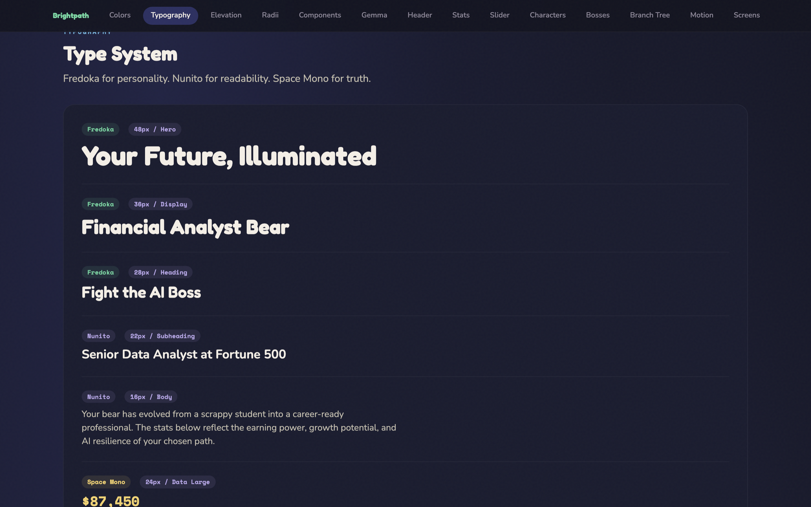
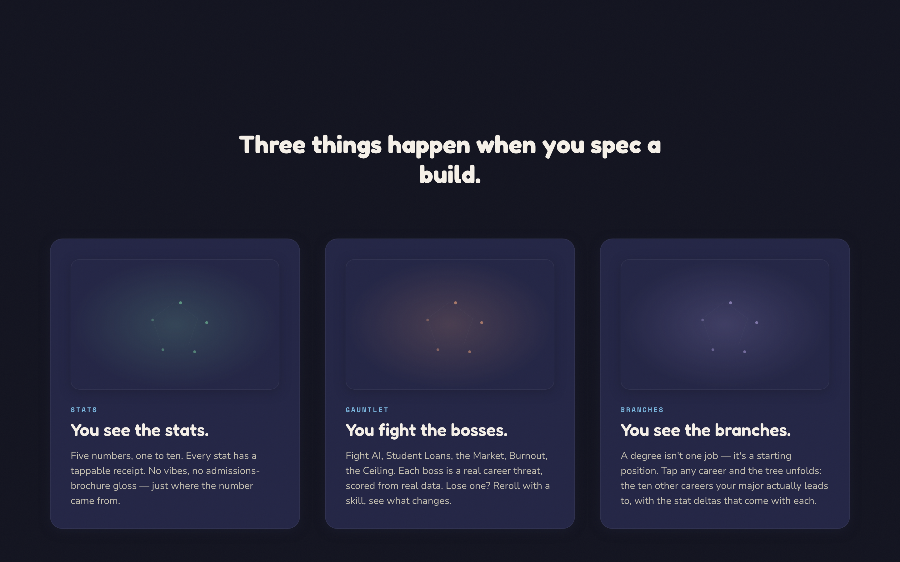
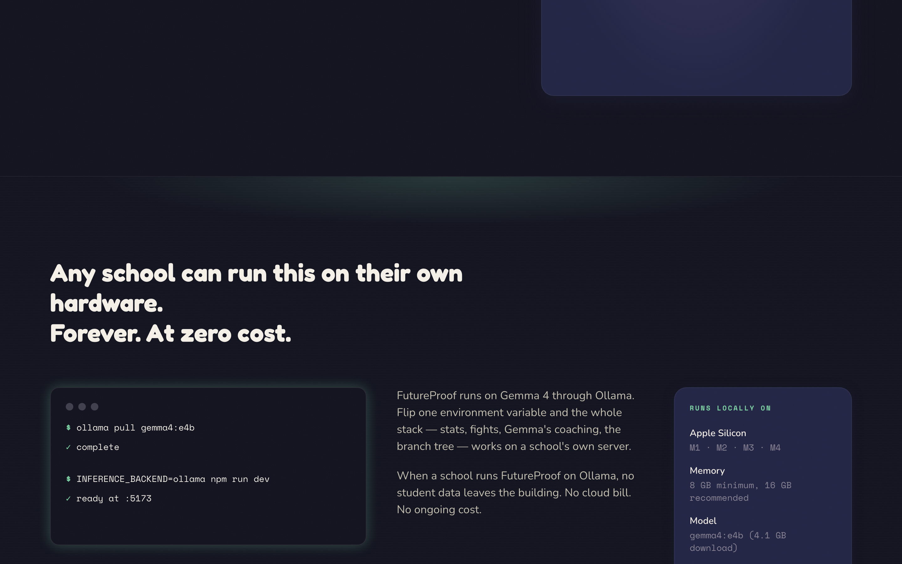

# Landing Page vs. Brightpath v3 Mockup — Visual Audit

**Date:** 2026-04-19
**Author:** Jeff Cernauske + Claude Code
**Triggered by:** "The v3 mockup looks way better than our landing page. Let's discuss why."
**Live page:** `http://localhost:5173/` (built from `frontend/src/pages/Landing.tsx` + `components/landing/*`)
**Mockup:** `docs/mockups/brightpath-design-system-v3.html` (3,622 lines, hand-built reference)
**Screenshots:** `reports/landing-vs-brightpath-v3-2026-04-19/` (Playwright, 1440×900 viewport, 2x DPR)

---

## TL;DR

The bones of the live landing are right — correct sections, vocabulary, and structure. The execution is tentative. The Brightpath design system is being rendered at roughly half intensity on the marketing page, while the v3 mockup uses it at 100%. The user is reacting to **confidence**: v3 reads as "I know what I am," the live landing reads as "I have the right ingredients but I'm whispering them."

The comparison is not strictly apples-to-apples — v3 is a design system reference page, not a marketing landing. But that's the point: a reference page that's *meant to demonstrate components* manages to feel more polished than the actual product's front door, which means we're under-using the design system we already have.

---

## Side-by-side: hero

| | Live landing (`HeroSection.tsx`) | Brightpath v3 hero |
|---|---|---|
| Eye anchor | Pentagon centered, drifting | Persistent top nav with active pill |
| Display type | "A college degree isn't a destination." (very large) | "Brightpath" (medium) + tagline |
| Pre-headline cue | None | `DESIGN SYSTEM v3 — BUILT FROM DESIGN.md` pill badge |
| Sub-content | Subhead + CTA + faint data line | Subhead + micro caption |
| Pentagon use | Decorative, unreadable stat names, no values | (in Stats section) — labeled legend with color-coded values |

**Live hero:**

**v3 hero:**

**What v3 does that live doesn't:** the pill badge, the sticky nav, the layered confidence. Even though v3's hero is *smaller* and *quieter*, it reads as more intentional because the chrome around it is doing supporting work.

---

## What v3 does that the live page doesn't

### 1. Persistent top nav with active state
v3 has a sticky nav (`Brightpath / Colors / Typography / Elevation / Radii / Components / Gemma / Header / Stats / Slider / Characters / Bosses / Branch Tree / Motion / Screens`) with an active pill highlighting the current section. Live page has no nav at all. Eye floats from section to section without anchors.

### 2. Micro-label rhythm above headings
v3 puts a tiny uppercase label above every section heading: `PALETTE` / `TYPE` / `UI KIT` / `INTERACTION` / `SHAPE`. Live page goes straight to big display headings with no editorial cue. The micro-label is what makes v3 feel like a magazine table-of-contents instead of a dump of sections.

### 3. The pentagon does product work in v3
v3's Stats section pairs the pentagon with a labeled legend: yellow ERN 78, green ROI 82, blue RES 65, purple GRW 71, red HMN 59. That's the entire pitch in one composition.

The live hero has the same pentagon, but with unreadable stat-name labels and no values. It's atmospheric drift, not a product demo. **The pentagon in v3 sells the product harder than the pentagon in our actual marketing.**

### 4. Color confidence
v3 uses the five accent stat colors aggressively — color-coded dots in legends, pill badges, character labels, boss labels. The live landing is ~95% white-on-navy. Brightpath has rich accent palette that's barely surfacing in marketing.

### 5. Card density
v3 component cards: colored pill label (`CAREER PATH`) + bold title (`Financial Analyst`) + body copy + value (`$87,450 median`). Tight, evidence-rich, dense.

Live "Three things happen" cards: dim placeholder rectangle at top with nothing readable inside, then small text below. Cards look unfinished.

### 6. Tighter horizontal packing
v3 sections fill their width with content. Live sections (especially the Ollama "any school can run this" section) leave huge horizontal gaps — terminal mockup small-left, big air, info chip pinned far-right. Reads as unfinished layout.

---

## What the live page does that v3 doesn't (give credit)

- Actually has marketing structure (Problem → How It Works → Receipts → Ollama → CTA → Data Sources → Team → Footer). v3 is a design docs page; it doesn't have to convert.
- Bigger, more dramatic display type in the hero
- Real footer with the just-shipped Horizon Footer
- Working CTA + pentagon glow animation + scroll cue choreography

---

## Diagnosis

The user's instinct is correct but slightly mislabeled. v3 isn't "way better as a landing page" — it can't be, it's not a landing page. But v3 *is* a more confident piece of design at the same character budget, and that confidence comes from three things our live page lacks:

1. **Editorial chrome** (top nav, micro-labels, pill badges) that telegraphs "this is a curated experience, not a list of sections"
2. **Visual evidence** (real values, color-coded data, dense cards) that proves the product instead of just describing it
3. **Layout density** (tighter horizontal packing, more accent color, less neutral whitespace) that reads as edited

The marketing page has the *content* but not the *production value*. It's a working draft of a landing page where v3 is a finished portfolio piece.

---

## Recommended fixes (prioritized)

### High leverage (do first)

**1. Make the hero pentagon do product work, not just atmosphere.**
Add the labeled stats legend next to or below the pentagon — the same composition v3 uses. Five color-coded dots, stat names, sample values (78 / 82 / 65 / 71 / 59 from a hero-specific sample build). Right now the pentagon promises something the page never delivers.

*Files: `frontend/src/components/landing/HeroSection.tsx`, `PentagonGlow.tsx`*

**2. Add micro-labels + a top nav.**
- Sticky chrome at the top of the page with section anchors and active state
- Each section gets a tiny uppercase chip above its heading: `PROBLEM` / `HOW IT WORKS` / `RECEIPTS` / `COST` / `DATA SOURCES` / `WHO BUILT THIS`

*Files: new `frontend/src/components/landing/TopNav.tsx`; chip prop added to each section component*

**3. Fill the empty card visuals with real content.**
The "Three things happen when you spec a build" cards have placeholder rectangles. Replace:
- "You see the stats" → tiny pentagon with sample dots
- "You fight the bosses" → small boss avatar (the AI boss or burnout boss)
- "You see the branches" → mini branch tree silhouette

*Files: `frontend/src/components/landing/HowItWorksSection.tsx` (or wherever those three cards live)*

### Medium leverage

**4. Use accent colors aggressively.**
Audit every section for opportunities to use the 5 stat accents (ERN yellow, ROI green, RES blue, GRW purple, HMN red) and the 6 boss colors. Right now we have a rich palette that's mostly unused on this page.

**5. Tighten horizontal layouts.**
Especially the Ollama section. The current "headline-left, terminal-center, info-chip-right" layout has too much air. Tighten to either a 2-column or full-bleed terminal-focal composition.

### Low leverage (nice-to-have)

**6. Add a small "what page am I on" wayfinder** in the top nav (e.g., a progress bar or section dot indicator that fills as you scroll) — borrowed from v3's nav active state.

**7. Add a treaserized version of the BranchTree** somewhere in the page (likely in or near the "You see the branches" beat). The actual BranchTree is the most impressive visual asset in the whole product and it appears nowhere on the landing.

---

## Out of scope for this audit

- Backend changes (none required — all fixes are frontend-only)
- The DESIGN.md token system (already correct; the fixes are about *using* the tokens, not changing them)
- The Horizon Footer (just shipped; performing as designed)
- Mobile-specific gaps (this audit was 1440px desktop; mobile audit is a separate pass)

---

## Open questions for the user

1. Are you OK turning the marketing page into a denser, more reference-page-feeling artifact (closer to v3's editorial polish)? Or do you want to keep the more spacious "scrollable poem" feel and fix density only where it's clearly broken (the empty cards)?
2. Should we go in and start fixing now, or write a spec via `/fp-spec-writer` and run it through the agent pipeline?
3. Is the v3 mockup itself the target — i.e., should the marketing page literally adopt v3's nav + label + density patterns? Or is v3 just a *reference for what Brightpath can look like*, and the marketing page should land somewhere between?

---

---

## Update — 2026-04-19 evening: fixes shipped

All high and medium leverage items from the prioritized list above were implemented in a single iterative session. Tests stayed green (504 pass / 1 skip / 0 fail) and TypeScript stayed clean throughout.

### Status

| # | Item | Status |
|---|------|--------|
| — | Remove `bg-bp-void` page bg (planetarium fix) | ✅ shipped |
| — | Clean redundant section borders + glows | ✅ shipped |
| 1 | Pentagon legend with values | ✅ shipped |
| 2a | Top nav with active state | ✅ shipped |
| 2b | Micro-labels above section headings | ✅ shipped |
| 3 | Thematic card art (pentagon / boss row / branch tree) | ✅ shipped |
| 3b | Receipt-panel mock for the Receipts right column | ✅ shipped |
| 4 | Use accent colors aggressively | ✅ delivered via 1 + 2b + 3 |
| 5 | Tighten Ollama horizontal layout | ✅ shipped (3-col → 2-col, terminal hero) |
| 6 | Wayfinder progress in nav | ✅ already covered by active-pill |
| 7 | Teaserized BranchTree on landing | ✅ already covered by branch constellation in cards |

### Smoking-gun fix that cascaded

The single highest-leverage change was removing `bg-bp-void` from `<main>` in `frontend/src/pages/Landing.tsx:20`. That one opaque class was sitting above the body's planetarium gradient + the `GlobalAmbience` star field, making the entire page render as flat near-black. Removing it unlocked:

- Visible twinkling stars across the entire scroll
- Cyan/purple radial gradient highlights breathing through corners
- Horizon Footer's intended one-tier-of-contrast (page `bp-deep` → footer `bp-void`)
- Cards (`bp-mid`) now actually read as elevated above the page

The "color confidence" critique partially resolved itself once the planetarium became visible. The rest came from the editorial chrome (top nav, micro-labels) and the per-card thematic art replacing identical empty placeholder rectangles.

### After-state evidence

**Hero (after — pentagon now does product work):**

The pentagon is now paired with a labeled stats legend showing concrete values (78 / 82 / 65 / 71 / 59) in their accent colors, captioned `EXAMPLE BUILD`. Top nav is sticky with active-pill state tracking via IntersectionObserver. Stars and gradient backdrop visible across the hero.

**Cards (after — each card has its own thematic visual):**

The three "Three things happen" cards each carry distinct thematic SVG art:
- STATS — small pentagon with 5 color-coded vertex dots and concentric rings
- GAUNTLET — row of 5 boss icons (AI / $ / M / B / C) each with their boss color
- BRANCHES — constellation of 1 root → 3 stems → 6 leaves in insight purple

Each card's label below also color-cycled to its `tone` (thrive/alert/insight) instead of all reading info-blue.

**Receipts (after — phone-shaped receipt panel mock):**

The empty 9:16 column on the right was replaced with a `ReceiptPanelArt` component — a styled DOM mock showing `EARNINGS 78`, then provenance rows for SOURCE / COMPUTATION / CROSS-CHECK, with an "Open full receipt →" tap cue. Sells the receipts story without pretending to be a captured screenshot.

**Ollama (after — terminal is now the focal element):**

Restructured from 3-column (terminal-thin / body / specs-thin) to 2-column (terminal-big / body+specs stacked). Terminal grew from `col-span-5` to `col-span-7`, body+specs grouped vertically on the right.

**Full page after:**

### Files touched

- `frontend/src/pages/Landing.tsx` — removed `bg-bp-void`; mounted `LandingTopNav`
- `frontend/src/components/landing/LandingTopNav.tsx` (new) — sticky nav, active-state via IntersectionObserver
- `frontend/src/components/landing/HeroSection.tsx` — added pentagon stats legend
- `frontend/src/components/landing/ProblemSection.tsx` — removed border + glow; added micro-label
- `frontend/src/components/landing/HowItWorksSection.tsx` — added micro-label; replaced ScreenshotWithFallback with thematic CardArt; per-tone label color
- `frontend/src/components/landing/HowItWorksCardArt.tsx` (new) — `PentagonArt` / `BossRowArt` / `BranchTreeArt` SVGs
- `frontend/src/components/landing/ReceiptsSection.tsx` — removed border + glow; added micro-label; replaced ScreenshotWithFallback with `ReceiptPanelArt`
- `frontend/src/components/landing/ReceiptPanelArt.tsx` (new) — phone-shaped mock receipt panel
- `frontend/src/components/landing/OllamaSection.tsx` — removed border + glow; added micro-label; restructured to 2-column layout
- `frontend/src/components/landing/DataSourcesSection.tsx` — added micro-label
- `frontend/src/components/landing/TeamSection.tsx` — added micro-label
- `frontend/src/components/landing/HowItWorksSection.test.tsx` — updated screenshot assertion to match new card art structure
- `frontend/src/components/landing/ReceiptsSection.test.tsx` — updated screenshot assertion to match `ReceiptPanelArt`

### What was NOT shipped (intentionally deferred)

- **Real product screenshots** — capturing /reveal, /gauntlet, /branches, /receipts captures and replacing the SVG art with actual imagery is a separate task that requires running the app through specific states. The `ScreenshotWithFallback` component still exists in the codebase if a future spec wants to bring it back per-card.
- **Mobile pass** — this audit was 1440px desktop. A mobile audit (especially of the new top nav, which currently hides links below `tablet:`) is a separate pass.
- **`bg-bp-void` audit on in-app screens** — same misuse may exist on `/app/*` screens. Worth a follow-up sweep.

---

## Files referenced

- `/Users/jcernauske/code/bright/futureproof-data/frontend/src/pages/Landing.tsx`
- `/Users/jcernauske/code/bright/futureproof-data/frontend/src/components/landing/HeroSection.tsx`
- `/Users/jcernauske/code/bright/futureproof-data/frontend/src/components/landing/HowItWorksSection.tsx`
- `/Users/jcernauske/code/bright/futureproof-data/frontend/src/components/landing/OllamaSection.tsx`
- `/Users/jcernauske/code/bright/futureproof-data/docs/mockups/brightpath-design-system-v3.html`
- `/Users/jcernauske/code/bright/futureproof-data/DESIGN.md`
- `/Users/jcernauske/code/bright/futureproof-data/reports/landing-vs-brightpath-v3-2026-04-19/` (screenshot inventory)
