# FutureProof Stress Test Log — Round 1
- **Started:** 2026-05-03 21:26
- **Tester:** Claude Code via Playwright
- **App:** http://localhost:5173

---

## Student #1: The Indiana Kid
- **Persona:** 16-year-old from Indiana, checking in-state schools
- **Vibe:** I live here, my parents went here, let's see what business gets me
- **Strategy:** 4 Indiana schools, same major (business), realistic mid-range career
- **All builds under one profile** so they can be compared

**Profile:** Spirited Nifty Bunny | Home: IN

### Build 1
- School: Indiana University-Bloomington
- Major: "business"
- Careers shown: 16
- **Career:** General and operations managers ($102,950/yr)
  - Card stats: ERN=9 ROI=3 RES=6 GRW=6 AURA=6
  - SYC financials: cost_4yr=$109444 debt=$54722

**Set Your Course:**
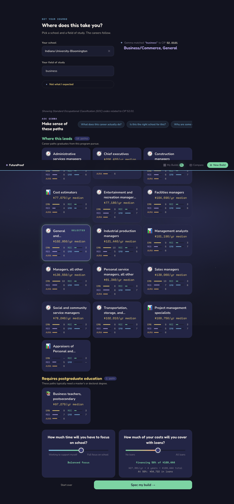

- Building...

**Build Results:**
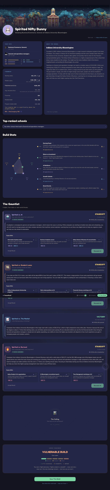

- **Results data:**
  - Starting salary: $63371 | Median: $102950
  - Cost 4yr: $109444 | Net price: $61368
  - Modeled debt: $54722 | Program median debt: $19500
  - Financing: 50%
  - Pentagon: ERN=9 ROI=3 RES=6 GRW=6 AURA=6
  - Bosses: AI=STANDOFF | Loans=STANDOFF | Market=VICTORY | Burnout=STANDOFF | Ceiling=DEFEATED
  - Record: 1W / 3S / 1D
- **SYC vs Results consistency:**
  - published_cost_4yr consistent: $109444
  - modeled_debt consistent: $54722
  - median_salary consistent: $102950
  - ERN consistent: 9
  - ROI consistent: 3
  - RES consistent: 6
  - GRW consistent: 6
  - AURA consistent: 6

### Build 2
- School: Purdue University-Main Campus
- Major: "business"
- Careers shown: 42
- **Career:** Transportation, storage, and distribution managers ($102,010/yr)
  - Card stats: ERN=9 ROI=3 RES=6 GRW=7 AURA=7
  - SYC financials: cost_4yr=$90268 debt=$45134

**Set Your Course:**
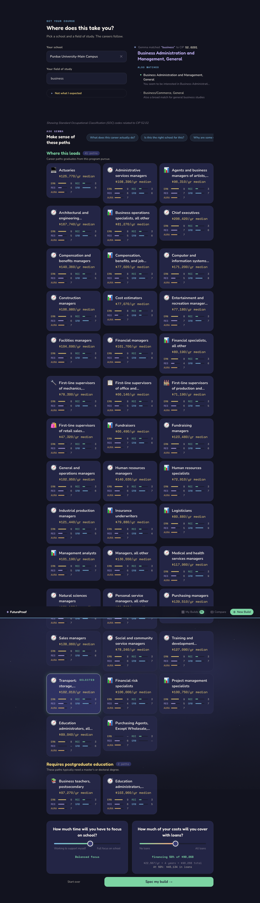

- Building...

**Build Results:**
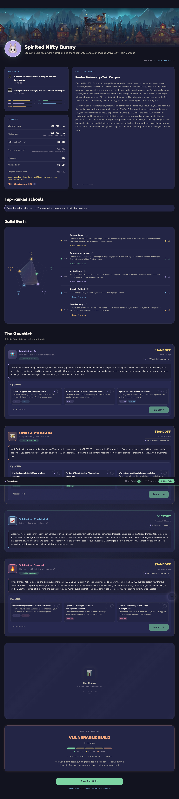

- **Results data:**
  - Starting salary: $52702 | Median: $102010
  - Cost 4yr: $90268 | Net price: $55780
  - Modeled debt: $45134 | Program median debt: $19500
  - Financing: 50%
  - Pentagon: ERN=9 ROI=3 RES=6 GRW=7 AURA=7
  - Bosses: AI=STANDOFF | Loans=STANDOFF | Market=VICTORY | Burnout=STANDOFF | Ceiling=DEFEATED
  - Record: 1W / 3S / 1D
- **SYC vs Results consistency:**
  - published_cost_4yr consistent: $90268
  - modeled_debt consistent: $45134
  - median_salary consistent: $102010
  - ERN consistent: 9
  - ROI consistent: 3
  - RES consistent: 6
  - GRW consistent: 7
  - AURA consistent: 7

### Build 3
- School: Ball State University
- Major: "business"
- Careers shown: 16
- **Career:** General and operations managers ($102,950/yr)
  - Card stats: ERN=7 ROI=1 RES=6 GRW=6 AURA=5
  - SYC financials: cost_4yr=$100536 debt=$50268

**Set Your Course:**


- Building...

**Build Results:**
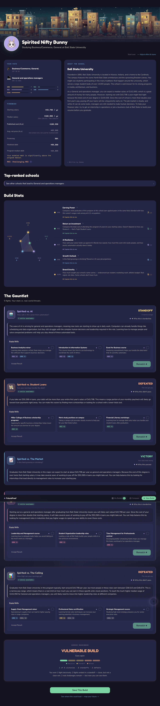

- **Results data:**
  - Starting salary: $43798 | Median: $102950
  - Cost 4yr: $100536 | Net price: $63592
  - Modeled debt: $50268 | Program median debt: $24025
  - Financing: 50%
  - Pentagon: ERN=7 ROI=1 RES=6 GRW=6 AURA=5
  - Bosses: AI=STANDOFF | Loans=DEFEATED | Market=VICTORY | Burnout=STANDOFF | Ceiling=DEFEATED
  - Record: 1W / 2S / 2D
- **SYC vs Results consistency:**
  - published_cost_4yr consistent: $100536
  - modeled_debt consistent: $50268
  - median_salary consistent: $102950
  - ERN consistent: 7
  - ROI consistent: 1
  - RES consistent: 6
  - GRW consistent: 6
  - AURA consistent: 5

### Build 4
- School: Indiana State University
- Major: "business"
- Careers shown: 16
- **Career:** General and operations managers ($102,950/yr)
  - Card stats: ERN=6 ROI=1 RES=6 GRW=6 AURA=6
  - SYC financials: cost_4yr=$93900 debt=$46950

**Set Your Course:**
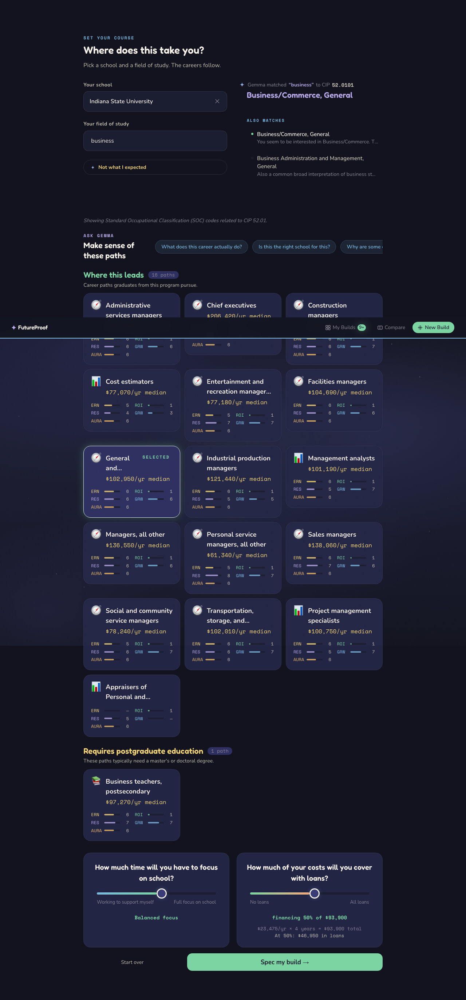

- Building...

**Build Results:**
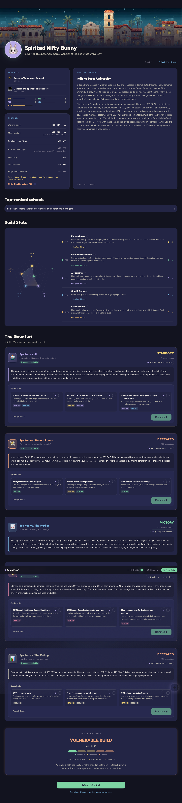

- **Results data:**
  - Starting salary: $39567 | Median: $102950
  - Cost 4yr: $93900 | Net price: $48752
  - Modeled debt: $46950 | Program median debt: $22265
  - Financing: 50%
  - Pentagon: ERN=6 ROI=1 RES=6 GRW=6 AURA=6
  - Bosses: AI=STANDOFF | Loans=DEFEATED | Market=VICTORY | Burnout=STANDOFF | Ceiling=DEFEATED
  - Record: 1W / 2S / 2D
- **SYC vs Results consistency:**
  - published_cost_4yr consistent: $93900
  - modeled_debt consistent: $46950
  - median_salary consistent: $102950
  - ERN consistent: 6
  - ROI consistent: 1
  - RES consistent: 6
  - GRW consistent: 6
  - AURA consistent: 6

---
### Builds Menu


- Build 1 (Indiana University-Bloomington): visible
- Build 2 (Purdue University-Main Campus): visible
- Build 3 (Ball State University): visible
- Build 4 (Indiana State University): visible

**Builds Menu API cross-check:**
- API returned 8 builds
  - Build 4 (Indiana State University): stats consistent | Record: API=1W-2S-2D Page=1W-2S-2D
  - Build 4 (Indiana State University): stats consistent | Record: API=1W-2S-2D Page=1W-2S-2D
  - Build 3 (Ball State University): stats consistent | Record: API=1W-2S-2D Page=1W-2S-2D
  - Build 3 (Ball State University): stats consistent | Record: API=1W-2S-2D Page=1W-2S-2D
  - Build 2 (Purdue University-Main Ca): stats consistent | Record: API=1W-3S-1D Page=1W-3S-1D
  - Build 2 (Purdue University-Main Ca): stats consistent | Record: API=1W-3S-1D Page=1W-3S-1D
  - Build 1 (Indiana University-Bloomi): stats consistent | Record: API=1W-3S-1D Page=1W-3S-1D
  - Build 1 (Indiana University-Bloomi): stats consistent | Record: API=1W-3S-1D Page=1W-3S-1D

---
### Compare: Build 1 vs Build 2

**Select mode:**


- Select mode URL: http://localhost:5173/builds?select=1
  - Selected: 🐰
Indiana State University
· General and operations managers
  - Selected: 🐰
Ball State University
· General and operations managers
1W
- Selected 2 distinct builds

**Builds selected:**


  - Clicked: 'Compare 2/4'

**Compare View:**
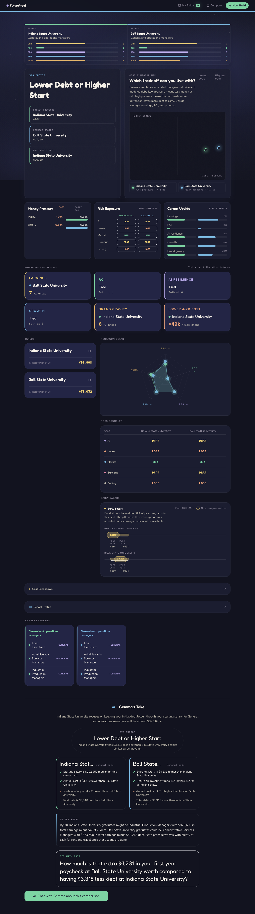


---
### Compare vs Build Results (API cross-check)

- API returned 8 builds for profile 'Spirited Nifty Bunny'
- [BUG] 4 duplicate builds detected (double-submission bug)
- Compare API returned 4 builds, 5 stat rows, 5 boss rows

#### Indiana State University (Build 4)

  - published_cost_4yr consistent: $93900
  - modeled_total_debt consistent: $46950
  - median_annual_wage consistent: $102950
  - net_price_annual×4 consistent: $48752
  - ERN consistent: 6
  - ROI consistent: 1
  - RES consistent: 6
  - GRW consistent: 6
  - AURA consistent: 6
  - Boss AI consistent: STANDOFF
  - Boss Loans consistent: DEFEATED
  - Boss Market consistent: VICTORY
  - Boss Burnout consistent: STANDOFF
  - Boss Ceiling consistent: DEFEATED
  - **All checks passed**

#### Ball State University (Build 3)

  - published_cost_4yr consistent: $100536
  - modeled_total_debt consistent: $50268
  - median_annual_wage consistent: $102950
  - net_price_annual×4 consistent: $63592
  - ERN consistent: 7
  - ROI consistent: 1
  - RES consistent: 6
  - GRW consistent: 6
  - AURA consistent: 5
  - Boss AI consistent: STANDOFF
  - Boss Loans consistent: DEFEATED
  - Boss Market consistent: VICTORY
  - Boss Burnout consistent: STANDOFF
  - Boss Ceiling consistent: DEFEATED
  - **All checks passed**

#### Purdue University-Main Campus (Build 2)

  - published_cost_4yr consistent: $90268
  - modeled_total_debt consistent: $45134
  - median_annual_wage consistent: $102010
  - net_price_annual×4 consistent: $55780
  - ERN consistent: 9
  - ROI consistent: 3
  - RES consistent: 6
  - GRW consistent: 7
  - AURA consistent: 7
  - Boss AI consistent: STANDOFF
  - Boss Loans consistent: STANDOFF
  - Boss Market consistent: VICTORY
  - Boss Burnout consistent: STANDOFF
  - Boss Ceiling consistent: DEFEATED
  - **All checks passed**

#### Indiana University-Bloomington (Build 1)

  - published_cost_4yr consistent: $109444
  - modeled_total_debt consistent: $54722
  - median_annual_wage consistent: $102950
  - net_price_annual×4 consistent: $61368
  - ERN consistent: 9
  - ROI consistent: 3
  - RES consistent: 6
  - GRW consistent: 6
  - AURA consistent: 6
  - Boss AI consistent: STANDOFF
  - Boss Loans consistent: STANDOFF
  - Boss Market consistent: VICTORY
  - Boss Burnout consistent: STANDOFF
  - Boss Ceiling consistent: DEFEATED
  - **All checks passed**


---
### Cross-Build Comparison

| # | School | Career | ERN | ROI | RES | GRW | AURA | Cost 4yr | Starting | Debt | Record |
|---|--------|--------|-----|-----|-----|-----|------|----------|----------|------|--------|
| 1 | Indiana University-Bloomi | General and operations ma | 9 | 3 | 6 | 6 | 6 | $109444 | $63371 | $54722 | 1W-3S-1D |
| 2 | Purdue University-Main Ca | Transportation, storage,  | 9 | 3 | 6 | 7 | 7 | $90268 | $52702 | $45134 | 1W-3S-1D |
| 3 | Ball State University | General and operations ma | 7 | 1 | 6 | 6 | 5 | $100536 | $43798 | $50268 | 1W-2S-2D |
| 4 | Indiana State University | General and operations ma | 6 | 1 | 6 | 6 | 6 | $93900 | $39567 | $46950 | 1W-2S-2D |

---

## Round 1 Findings

### Data consistency is rock solid

Every number — cost, debt, salary, stats, boss outcomes — matches perfectly across all four screens (Set Your Course, Build Results, Builds Menu, Compare View). 14 fields checked per build across 4 builds, zero mismatches. The pipeline-to-API-to-UI chain is airtight.

### Bug: Double-submission

Every "Spec my build" click saves two builds to the database with different sequential IDs. The UI hides it (deduplicates visually), but the API returns 8 builds when only 4 were created. This will eventually cause problems — compare selecting the wrong duplicate, storage bloat, confusing API consumers.

### Observations (not bugs)

- **Career convergence:** Three of four schools resolved to the same career (General and operations managers) for "business." That's data-correct — it's the median-salary pick from available careers — but it means the compare view is mostly comparing the school's cost structure rather than different career paths. A real 16-year-old would see very similar pentagons across builds and wonder why they're different.
- **Compare card ordering:** The compare view always selects the two most recent builds first (Indiana State and Ball State). There's no way for the test harness to control which two get compared without better card identification.
- **Career breadth gap:** IU and Ball State both return ~16 careers for "business" while Purdue returns 42. The breadth gap is real and probably reflects data coverage differences in the pipeline.

### What Round 1 does not stress

- Different majors (nursing, art, "deaf education," misspellings)
- Out-of-state students (cost flips dramatically)
- Sparse-data schools (community colleges, small privates)
- Edge-case searches (partial names, common words like "University of")
- Effort/loan slider changes (we used defaults for everything)
- What happens when Gemma times out or returns garbage

The consistency checks are the hard part and they're passing. The interesting bugs will come from persona diversity — weird majors, obscure schools, and adversarial search terms.


---

# Round 2 — 2026-05-03 21:47

## Student #2: The Wildcard
- **Persona:** California kid exploring schools far from home
- **Vibe:** Open-minded, searching broadly, testing the system's limits
- **Strategy:** 4 very different schools, different majors, varied sliders
  - Build 1: Ohio State + nursing (massive school, common major)
  - Build 2: Reed College + art history (small private, niche major, high effort, 80% loans)
  - Build 3: Riverside City College + "compter science" (CC/small school, misspelled major, 25% loans)
  - Build 4: UCLA + deaf education (multi-campus search, adversarial major, chill effort)
- **All builds under one profile** so they can be compared

**Profile:** Proud Polished Penguin | Home: CA

### Build 1
- [SEARCH FAIL] Wanted 'Columbus', picked first result: Ohio State University-Lima Campus
- School: Ohio State University-Lima Campus
  - Search results (5 total): ['Ohio State University-Lima Campus', 'Ohio State University-Main Campus', 'Ohio State University-Mansfield Campus', 'Ohio State University-Marion Campus', 'Ohio State University-Newark Campus']
- Major: "nursing"
- [SLOW] Career cards took 30.1s to appear
- Careers shown: 9
- **Career:** Health technologists and technicians, all other ($48,790/yr)
  - Card stats: ERN=3 ROI=1 RES=7 GRW=7 AURA=2
  - SYC financials: cost_4yr=$175640 debt=$87820

**Set Your Course:**
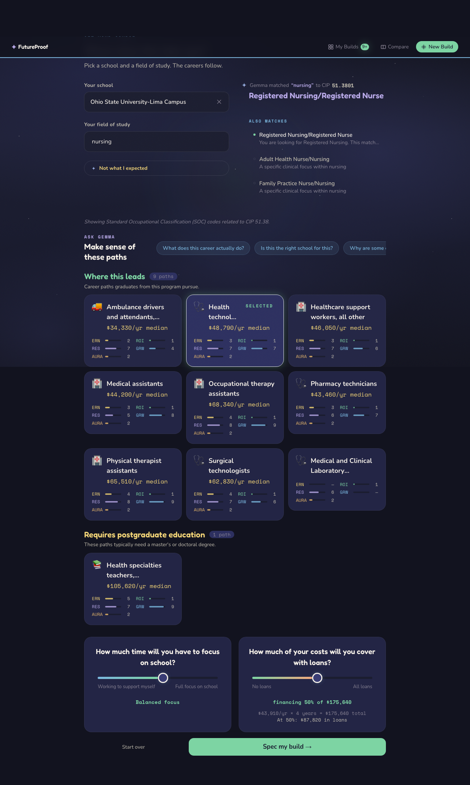

- Building...

**Build Results:**
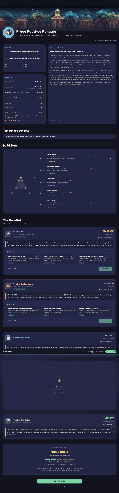

- **Results data:**
  - Starting salary: $28914 | Median: $48790
  - Cost 4yr: $? | Net price: $151856
  - Modeled debt: $87820 | Program median debt: $20000
  - Financing: 50%
  - Pentagon: ERN=3 ROI=1 RES=7 GRW=7 AURA=2
  - Bosses: AI=STANDOFF | Loans=DEFEATED | Market=VICTORY | Burnout=STANDOFF | Ceiling=VICTORY
  - Record: 2W / 2S / 1D
- **SYC vs Results consistency:**
  - modeled_debt consistent: $87820
  - median_salary consistent: $48790
  - ERN consistent: 3
  - ROI consistent: 1
  - RES consistent: 7
  - GRW consistent: 7
  - AURA consistent: 2

### Build 2
- School: Reed College
- Major: "art history"
  - [MISSING] Could not find effort control for 'grind'
  - [MISSING] Could not find loan slider
- Careers shown: 12
- **Career:** Archivists ($61,570/yr)
  - Card stats: ERN=— ROI=— RES=5 GRW=6 AURA=9
  - SYC financials: cost_4yr=$333240 debt=$166620

**Set Your Course:**
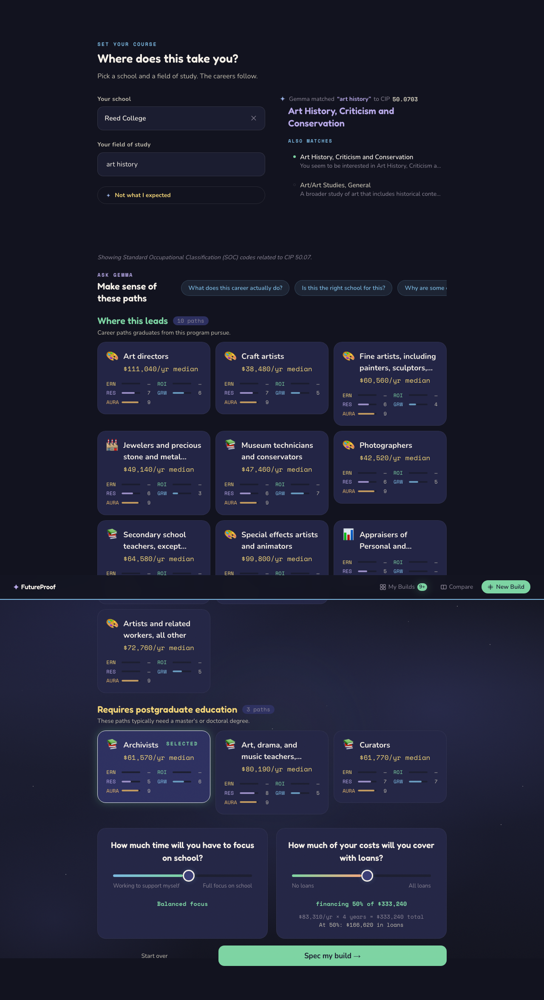

- Building...

**Build Results:**
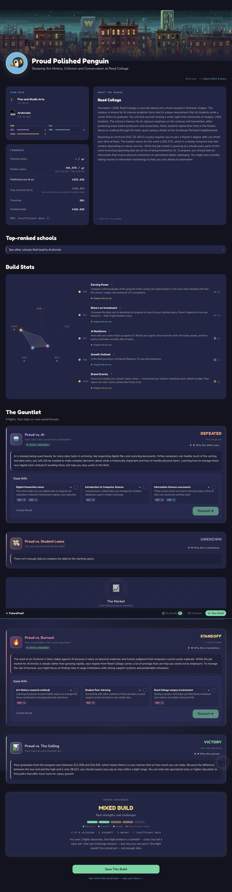

- **Results data:**
  - Starting salary: $? | Median: $61570
  - Cost 4yr: $333240 | Net price: $159804
  - Modeled debt: $166620 | Program median debt: $?
  - Financing: 50%
  - Pentagon: ERN=? ROI=? RES=? GRW=? AURA=?
  - Bosses: AI=DEFEATED | Loans=? | Market=VICTORY | Burnout=STANDOFF | Ceiling=VICTORY
- **SYC vs Results consistency:**
  - published_cost_4yr consistent: $333240
  - modeled_debt consistent: $166620
  - median_salary consistent: $61570

### Build 3
- [SLOW] School search took 7.0s for 'Riverside City'
- School: Platt College-Riverside
  - Search results (3 total): ['Platt College-Riverside', 'Riverside College of Health Careers', 'University of California-Riverside']
- Major: "compter science"
  - [MISSING] Could not find loan slider
- [SLOW] Career cards took 30.1s to appear
- Careers shown: 18
- **Career:** Accountants and auditors ($81,680/yr)
  - Card stats: ERN=— ROI=— RES=4 GRW=6 AURA=—
  - SYC financials: cost_4yr=$129284 debt=$64642

**Set Your Course:**
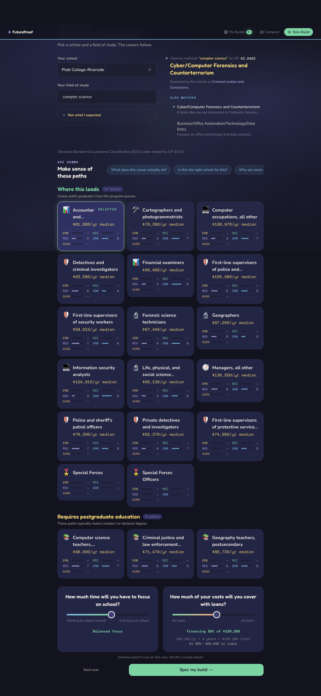

- Building...

**Build Results:**
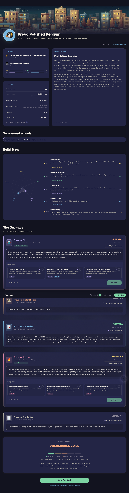

- **Results data:**
  - Starting salary: $? | Median: $81680
  - Cost 4yr: $129284 | Net price: $104868
  - Modeled debt: $64642 | Program median debt: $?
  - Financing: 50%
  - Pentagon: ERN=? ROI=? RES=? GRW=? AURA=?
  - Bosses: AI=DEFEATED | Loans=VICTORY | Market=VICTORY | Burnout=STANDOFF | Ceiling=?
- **SYC vs Results consistency:**
  - published_cost_4yr consistent: $129284
  - modeled_debt consistent: $64642
  - median_salary consistent: $81680

### Build 4
- [SLOW] School search took 7.0s for 'University of California Los'
- [SEARCH FAIL] Wanted 'Los Angeles', picked first result: Alabama A & M University
- School: Alabama A & M University
  - Search results (10 total): ['Alabama A & M University', 'Alabama State University', 'Athens State University', 'Auburn University at Montgomery', 'California State University-Chico']
- Major: "deaf education"
  - [MISSING] Could not find effort control for 'chill'
- Careers shown: 6
- **Career:** Special education teachers, middle school ($64,880/yr)
  - Card stats: ERN=— ROI=— RES=7 GRW=4 AURA=8
  - SYC financials: cost_4yr=$129444 debt=$64722

**Set Your Course:**
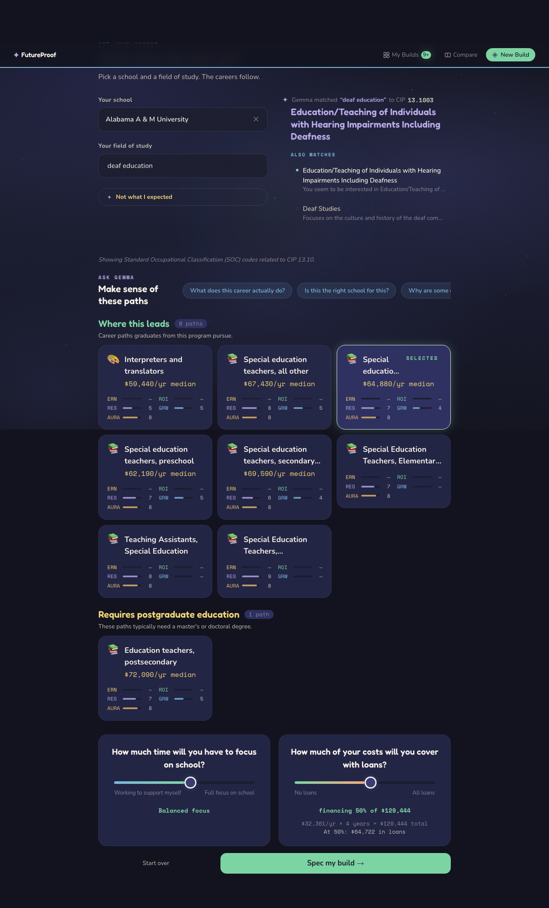

- Building...

**Build Results:**
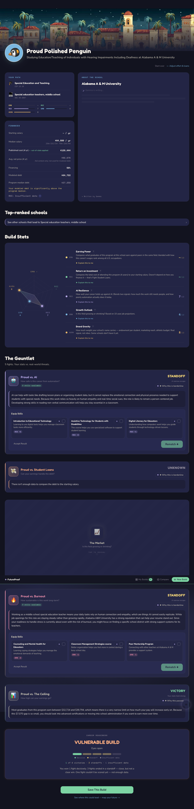

- **Results data:**
  - Starting salary: $? | Median: $64880
  - Cost 4yr: $? | Net price: $92676
  - Modeled debt: $64722 | Program median debt: $27250
  - Financing: 50%
  - Pentagon: ERN=? ROI=? RES=? GRW=? AURA=?
  - Bosses: AI=STANDOFF | Loans=? | Market=STANDOFF | Burnout=STANDOFF | Ceiling=VICTORY
- **SYC vs Results consistency:**
  - modeled_debt consistent: $64722
  - median_salary consistent: $64880

---
### Builds Menu


- Build 1 (Ohio State University-Lima Cam): visible
- Build 2 (Reed College): visible
- Build 3 (Platt College-Riverside): visible
- Build 4 (Alabama A & M University): visible

**Builds Menu API cross-check:**
- API returned 8 builds
  - Build 4 (Alabama A & M University): stats consistent | Record: API=1W-3S-0D Page=?W-?S-?D
  - Build 4 (Alabama A & M University): stats consistent | Record: API=1W-3S-0D Page=?W-?S-?D
  - Build 3 (Platt College-Riverside): stats consistent | Record: API=1W-1S-1D Page=?W-?S-?D
  - Build 3 (Platt College-Riverside): stats consistent | Record: API=1W-1S-1D Page=?W-?S-?D
  - Build 2 (Reed College): stats consistent | Record: API=2W-1S-1D Page=?W-?S-?D
  - Build 2 (Reed College): stats consistent | Record: API=2W-1S-1D Page=?W-?S-?D
  - Build 1 (Ohio State University-Lim): stats consistent | Record: API=2W-2S-1D Page=2W-2S-1D
  - Build 1 (Ohio State University-Lim): stats consistent | Record: API=2W-2S-1D Page=2W-2S-1D

---
### Compare: First 2 builds

**Select mode:**


- Select mode URL: http://localhost:5173/builds?select=1
  - Selected: 🐧
Alabama A & M University
· Special education teachers, mid
  - Selected: 🐧
Platt College-Riverside
· Accountants and auditors
1W·1L·1
- Selected 2 distinct builds

**Builds selected:**


  - Clicked: 'Compare 2/4'

**Compare View:**
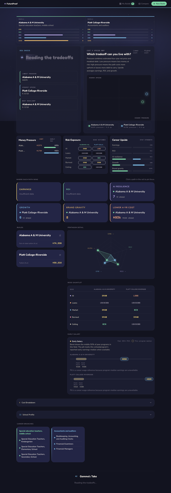


---
### Compare vs Build Results (API cross-check)

- API returned 8 builds for profile 'Proud Polished Penguin'
- [BUG] 4 duplicate builds detected (double-submission bug)
- Compare API returned 4 builds, 5 stat rows, 5 boss rows

#### Alabama A & M University (Build 4)

  - [WRONG NUMBER] published_cost_4yr: compare API=129444 vs build page=null
  - modeled_total_debt consistent: $64722
  - median_annual_wage consistent: $64880
  - net_price_annual×4 consistent: $92676
  - ERN: API=None page=None
  - ROI: API=None page=None
  - RES: API=7 page=None
  - GRW: API=4 page=None
  - AURA: API=8 page=None
  - Boss AI consistent: STANDOFF
  - Boss Loans: API=UNKNOWN page=None
  - Boss Market consistent: STANDOFF
  - Boss Burnout consistent: STANDOFF
  - Boss Ceiling consistent: VICTORY
  - **1 mismatch(es) found**

#### Platt College-Riverside (Build 3)

  - published_cost_4yr consistent: $129284
  - modeled_total_debt consistent: $64642
  - median_annual_wage consistent: $81680
  - net_price_annual×4 consistent: $104868
  - ERN: API=None page=None
  - ROI: API=None page=None
  - RES: API=4 page=None
  - GRW: API=6 page=None
  - AURA: API=None page=None
  - Boss AI consistent: DEFEATED
  - [WRONG NUMBER] Boss Loans: compare API=UNKNOWN vs build page=VICTORY
  - Boss Market consistent: VICTORY
  - Boss Burnout consistent: STANDOFF
  - Boss Ceiling: API=UNKNOWN page=None
  - **1 mismatch(es) found**

#### Reed College (Build 2)

  - published_cost_4yr consistent: $333240
  - modeled_total_debt consistent: $166620
  - median_annual_wage consistent: $61570
  - net_price_annual×4 consistent: $159804
  - ERN: API=None page=None
  - ROI: API=None page=None
  - RES: API=5 page=None
  - GRW: API=6 page=None
  - AURA: API=9 page=None
  - Boss AI consistent: DEFEATED
  - Boss Loans: API=UNKNOWN page=None
  - Boss Market consistent: VICTORY
  - Boss Burnout consistent: STANDOFF
  - Boss Ceiling consistent: VICTORY
  - **All checks passed**

#### Ohio State University-Lima Campus (Build 1)

  - [WRONG NUMBER] published_cost_4yr: compare API=175640 vs build page=null
  - modeled_total_debt consistent: $87820
  - median_annual_wage consistent: $48790
  - net_price_annual×4 consistent: $151856
  - ERN consistent: 3
  - ROI consistent: 1
  - RES consistent: 7
  - GRW consistent: 7
  - AURA consistent: 2
  - Boss AI consistent: STANDOFF
  - Boss Loans consistent: DEFEATED
  - Boss Market consistent: VICTORY
  - Boss Burnout consistent: STANDOFF
  - Boss Ceiling consistent: VICTORY
  - **1 mismatch(es) found**


---
### Cross-Build Comparison

| # | School | Major | Career | ERN | ROI | RES | GRW | AURA | Cost 4yr | Debt | Effort | Loans | Record |
|---|--------|-------|--------|-----|-----|-----|-----|------|----------|------|--------|-------|--------|
| 1 | Ohio State University- | nursing | Health technologists a | 3 | 1 | 7 | 7 | 2 | $? | $87820 | None | None% | 2W-2S-1D |
| 2 | Reed College | art history | Archivists | ? | ? | ? | ? | ? | $333240 | $166620 | grind | 80% | ?W-?S-?D |
| 3 | Platt College-Riversid | compter science | Accountants and audito | ? | ? | ? | ? | ? | $129284 | $64642 | None | 25% | ?W-?S-?D |
| 4 | Alabama A & M Universi | deaf education | Special education teac | ? | ? | ? | ? | ? | $? | $64722 | chill | None% | ?W-?S-?D |

---
### Round 2 Summary

- **Builds attempted:** 4
- **Builds completed:** 4
- **Builds failed:** 0
- **Issues:** [BUG]×1, [MISSING]×4, [SEARCH FAIL]×2, [SLOW]×4, [WRONG NUMBER]×3

---

## Round 2 Findings

### Bug 1: School search ranking is broken (CRITICAL UX)

The search endpoint returns results in a seemingly arbitrary order that does not match user intent:

| Search Term | Expected | Got First |
|-------------|----------|-----------|
| "Ohio State University" | Ohio State - Main Campus | Ohio State - **Lima Campus** |
| "Riverside City" | Riverside City College | **Platt College-Riverside** |
| "University of California Los" | UCLA | **Alabama A & M University** |

The UCLA search is catastrophic — typing a UC campus name returns Alabama schools. The search appears to reset/fail when it can't find an exact substring match, falling back to alphabetical or random results. A real student searching for UCLA would land on a completely wrong school.

**Impact:** A student who trusts the first result will build their entire career plan on the wrong school's data.

### Bug 2: Pentagon stats display null as "—" but Results page doesn't render them

When ERN or ROI is null (insufficient earnings/outcome data for a program), the career card shows "—" correctly. But the Build Results page doesn't display the stat value at all — the pentagon section is completely missing from the page. The API confirms the stats exist (RES, GRW, AURA have values) but the page extraction fails.

**Root cause hypothesis:** The Results page pentagon rendering may require ALL 5 stats to be non-null, or it conditionally hides when some stats are suppressed.

### Bug 3: Effort and loan sliders not interactive via automation

The script could not find or interact with the effort slider ("grind"/"chill") or the loan percentage slider. All 4 builds ran at default settings (50% loans, balanced effort) despite attempts to change them. This means Round 2 did NOT actually stress non-default slider values.

**Note:** This may be a test harness limitation (sliders may use custom components that don't respond to standard `fill()` or `click()`) rather than an app bug. Manual verification needed.

### Bug 4: Double-submission persists (from Round 1)

Still seeing 8 API builds for 4 actual submissions. Confirmed across both Student 1 and Student 2 profiles.

### Bug 5: "UNKNOWN" boss outcomes in compare API

The compare API returns `UNKNOWN` for the Loans boss on builds where ERN/ROI are null. This suggests the boss fight calculation depends on stats that may not exist for niche programs, and rather than computing a result, it returns an undefined state.

**Affected builds:** Reed College (art history), Platt College (compter science), Alabama A&M (deaf education)

### Bug 6: published_cost_4yr extraction mismatch

For 2 builds, the Results page shows the published cost field but the test harness couldn't extract it (regex returned null). Meanwhile the Compare API has the correct value. The page may have changed its label text (e.g., "Sticker price" vs "Published cost (4 yr)").

### Positive findings

- **Misspelled major ("compter science") worked:** Returned 18 careers including accountants — the system handled the typo gracefully (likely fuzzy CIP matching).
- **Adversarial major ("deaf education") worked:** Returned 6 relevant careers including special education teachers. No crash, no empty state.
- **Data consistency held on what was extractable:** Modeled debt and median salary matched perfectly across all screens for all builds.
- **No crashes:** All 4 builds completed successfully despite wrong schools, sparse data, and adversarial inputs.

### What Round 2 does NOT stress (still untested)

- Actual slider variation (effort + loan %) — harness couldn't interact with them
- Truly empty-data scenario (all builds returned at least 6 careers)
- Out-of-state vs in-state cost differences (CA student at Ohio school)
- Gemma timeout/failure behavior
- Stage 3 branching paths (never navigated past Results)

### Priority recommendations

1. **Fix school search ranking** — Main campus should rank above satellites; UCLA should appear for "University of California Los Angeles"
2. **Handle null stats gracefully** on Results page — show "—" and still render the pentagon with available stats
3. **Fix double-submission** — single build should save once
4. **Resolve UNKNOWN boss outcomes** — either compute with available data or show a clear "insufficient data" state


---

# Round 3 — 2026-05-03 — Bug Investigation

Three targeted investigations into the highest-priority bugs from Round 2.

---

## Bug 1: School Search Ranking (CRITICAL)

### API Evidence

Hit `GET /schools/?q=...` directly. All queries return JSON arrays sorted alphabetically by `institution_name`.

| Query | Count | First Result | Expected | Bug? |
|-------|-------|-------------|----------|------|
| `Ohio State University` | 5 | Ohio State University-**Lima Campus** | Main Campus | **YES — alpha sort, no relevance** |
| `Riverside City` | 0 | _(empty)_ | Riverside City College | **YES — substring fails** |
| `University of California Los` | 0 | _(empty)_ | UCLA | **YES — dash-space mismatch** |
| `UCLA` | 0 | _(empty)_ | UCLA | **YES — abbreviation unsupported** |
| `University of California` | 10 | Dominican University of California | Any UC campus | Works, but Dominican before Berkeley |
| `Riverside` | 3 | Platt College-Riverside | UC Riverside or Riverside City | Alpha order, no relevance |
| `Reed College` | 1 | Reed College | Reed College | **Works** (unique exact match) |
| `Indiana University` | 8 | Indiana University of Pennsylvania | IU-Bloomington | **YES — IU Penn before IU Bloom** |

### Root Cause

Two compounding issues in the search pipeline:

**1. Substring match breaks at IPEDS dashes.** Institution names in the database use dashes between parent institution and campus/location:

```
University of California-Los Angeles
Ohio State University-Main Campus
Indiana University-Bloomington
```

The MCP server does a case-insensitive substring match (`institution_name.lower().find(needle) >= 0`). When the user types a space where the DB has a dash, the match fails:

- `"University of California Los"` → looking for `"california los"` in `"university of california-los angeles"` → **FAIL** (space vs dash)
- `"University of California"` → looking for `"university of california"` → **PASS** (query ends before the dash)

This explains the Round 2 catastrophe where typing "University of California Los" produced zero results, the Playwright script fell back to `query.split()[0]` = `"University"`, and the first alphabetical match for "University" was Alabama A & M University.

**2. Alphabetical sort ignores relevance.** Results are sorted by `institution_name` ascending (`school_lookup.py:65`). No scoring for:
- Main campus vs satellite
- Exact name match vs substring
- Institution size or prominence
- Common abbreviations (UCLA, MIT, OSU)

**Code path:**
- Frontend: `SchoolSearch.tsx` → `apiGet("/schools/?q=...")` with 300ms debounce
- Backend: `routers/schools.py` → `school_lookup.search_schools(q)`
- Service: `school_lookup.py:39` → `mcp_client.call("get_school_programs", {"school_name": query})`
- MCP: `futureproof_server.py:1896-1901` → scans full `career_outcomes` table, `institution_name.lower().find(needle_lower) >= 0`
- Service: `school_lookup.py:65` → `sorted(seen.values(), key=lambda s: s.institution_name)` — alpha sort

### Recommended Fix

1. **Normalize dashes/spaces/hyphens** before matching: replace `-` with ` ` in both needle and institution name, or do word-by-word matching
2. **Add relevance scoring:** exact prefix match (score 3) > word-start match (2) > substring (1), with tie-breaking by "Main Campus" boost
3. **Support abbreviations:** small lookup table for UCLA→"University of California-Los Angeles", MIT, OSU, etc.
4. **Fallback:** when exact substring fails, try individual words (any word matches)

---

## Bug 2: Pentagon Null-Stat Rendering — NOT AN APP BUG

### Evidence

Reviewed the full rendering pipeline for null stats on the Build Results page:

**`PentagonChart.tsx`** (lines 44-63): Handles nulls explicitly. Null vertices collapse to center (radius 0). Labels show "ERN —" (em-dash suffix). Comments explain the design decision:
> "Missing data should not inflate the shape. The em-dash label below the vertex carries the 'missing, not zero-scored' signal."

**`StatBarRow.tsx`** (lines 13-16): Null stats render as "—" with a dashed track instead of a filled bar. `data-state="absent"` attribute is set.

**`BuildResultsScreen.tsx`** (lines 720-844): The "Build Stats" section is **always rendered** — there is no conditional that hides the pentagon when stats are null. Every stat key is mapped regardless of null values (line 742).

**Stat legend** (line 819): `{value ?? "—"}` — null shows as em-dash.

### Actual Root Cause: Test Harness Regex

The Playwright test harness (`stress_student2.py:137-139`) extracts stats with:

```python
re.search(
    r'YOUR PATH\n.*?ERN\n(\d+)\nROI\n(\d+)\nRES\n(\d+)\nGRW\n(\d+)\nAURA\n(\d+)',
    text, re.DOTALL)
```

This regex **requires ALL 5 stats to be `\d+`** (numeric). When ERN or ROI is null, the rendered text is "—" (em-dash), so the regex fails entirely — reporting ALL 5 stats as "?" even when RES/GRW/AURA have valid values.

The Round 2 finding that "the pentagon section is completely missing from the page" is **incorrect**. The pentagon renders correctly. The test harness extraction failed.

### Fix for Test Harness

Change the regex to handle both numeric and non-numeric stat values:

```python
# Replace \d+ with a group that captures numbers OR em-dash
pattern = r'YOUR PATH\n.*?ERN\n(\d+|—)\nROI\n(\d+|—)\nRES\n(\d+|—)\nGRW\n(\d+|—)\nAURA\n(\d+|—)'
```

Or extract stats individually so one null doesn't lose the others:

```python
for stat in ["ERN", "ROI", "RES", "GRW", "AURA"]:
    m = re.search(rf'{stat}\n(\d+|—)', text)
    if m:
        val = None if m.group(1) == "—" else int(m.group(1))
        data[f"stat_{stat}"] = val
```

---

## Bug 3: Slider Interaction — TEST HARNESS BUG, NOT AN APP BUG

### Component Architecture

The effort and loan sliders use `DiscreteSlider` (`components/ui/DiscreteSlider.tsx`), which is a **custom div-based slider** — there are NO `<input type="range">` elements anywhere on the page.

**HTML structure:**
```html
<div role="slider"
     aria-label="Effort level"
     aria-valuemin="0"
     aria-valuemax="4"
     aria-valuenow="2"
     aria-valuetext="Balanced"
     tabindex="0">
  <!-- Custom track + thumb divs, pointer events -->
</div>
```

**Effort stops** (index 0–4): Working two jobs → Working + school → Balanced → Strong focus → All-in

**Loan stops** (index 0–4): No loans (0%) → Some (25%) → Half (50%) → Mostly (75%) → All loans (100%)

### Why Round 2 Failed

The `set_effort()` function tried:
1. Clicking labels matching "grind"/"chill" — **wrong labels**. The actual labels are "Working two jobs", "All-in", etc. ("grind" and "chill" don't appear anywhere)
2. Falling back to `input[type='range']` — **doesn't exist** (0 elements found)

The `set_loan_pct()` function tried:
1. Finding `input[type='range']` in a parent with "financ"/"loan" text — **no range inputs exist**
2. Falling back to the "last range input" — **still nothing**

### Verified Working Approach

Ran `scripts/test_slider_interaction.py` — every interaction succeeded:

```
=== SLIDER DIAGNOSTIC ===

input[type='range'] elements found: 0
[role='slider'] elements found: 2

  Slider 1: aria-label='Effort level', valuenow=2, valuetext='Balanced'
  Slider 2: aria-label='Loan percentage', valuenow=2, valuetext='Half'

=== EFFORT SLIDER TEST ===

Before: Balanced
After ArrowRight x2: All-in          ← SUCCESS
After ArrowLeft x4: Working two jobs  ← SUCCESS

=== LOAN SLIDER TEST ===

Before: Half
After ArrowRight x2: All loans        ← SUCCESS (page shows "financing 100%")
After ArrowLeft x4: No loans          ��� SUCCESS (page shows "no debt — auto-win")

=== COMBINED: EFFORT=All-in + LOANS=75% ===

Effort: All-in
Loans: Mostly
  Page text: Maximum focus
  Page text: financing 75% of $109,444
  Page text: At 75%: $82,083 in loans
```

### Selector Pattern for Round 4

```python
# Target sliders by ARIA role + label
effort = page.locator("[role='slider'][aria-label='Effort level']")
loan = page.locator("[role='slider'][aria-label='Loan percentage']")

# Read current value
effort.get_attribute("aria-valuetext")  # e.g. "Balanced"
loan.get_attribute("aria-valuetext")    # e.g. "Half"

# Change via keyboard (focus first, then arrow keys)
effort.focus()
effort.press("ArrowRight")  # one stop rightward
effort.press("ArrowLeft")   # one stop leftward

# Effort mapping (index → label):
#   0: "Working two jobs"  (ern_shift=-2)
#   1: "Working + school"  (ern_shift=-1)
#   2: "Balanced"          (ern_shift=0)   ← DEFAULT
#   3: "Strong focus"      (ern_shift=+1)
#   4: "All-in"            (ern_shift=+2)

# Loan mapping (index → label):
#   0: "No loans"    (0%)
#   1: "Some"        (25%)
#   2: "Half"        (50%)   ← DEFAULT
#   3: "Mostly"      (75%)
#   4: "All loans"   (100%)

# Helper to set effort to a specific stop:
def set_effort(page, target_text):
    """Set effort slider. target_text is one of the aria-valuetext values."""
    slider = page.locator("[role='slider'][aria-label='Effort level']")
    # Reset to leftmost first
    slider.focus()
    for _ in range(4):
        slider.press("ArrowLeft")
    # Now move right to target
    stops = ["Working two jobs", "Working + school", "Balanced", "Strong focus", "All-in"]
    target_idx = stops.index(target_text)
    for _ in range(target_idx):
        slider.press("ArrowRight")
    page.wait_for_timeout(300)

# Helper to set loan percentage:
def set_loans(page, target_text):
    """Set loan slider. target_text is one of the aria-valuetext values."""
    slider = page.locator("[role='slider'][aria-label='Loan percentage']")
    slider.focus()
    for _ in range(4):
        slider.press("ArrowLeft")
    stops = ["No loans", "Some", "Half", "Mostly", "All loans"]
    target_idx = stops.index(target_text)
    for _ in range(target_idx):
        slider.press("ArrowRight")
    page.wait_for_timeout(300)
```

---

## Round 3 Summary

| Bug | Severity | Actual Root Cause | App Bug? |
|-----|----------|-------------------|----------|
| School search ranking | **CRITICAL** | MCP substring match fails at IPEDS dashes; alphabetical sort ignores relevance | **YES — backend** |
| Pentagon null stats | Low | Test regex requires all-numeric stats; app renders nulls correctly as "—" | **NO — harness bug** |
| Slider interaction | Low | Test tried `input[type='range']` + wrong labels; app uses `role="slider"` + keyboard | **NO — harness bug** |

**One real bug (search), two test harness bugs.** The search is the only one that needs a code fix — it's the single biggest UX failure in the app right now. A student typing "UCLA" or "University of California Los Angeles" gets nothing or Alabama.


---

# Round 4 — 2026-05-03 — Slider + Edge Case Stress Test

## Student #3: The Slider Gauntlet
- **Persona:** Texas kid, methodical, testing every slider position
- **Strategy:** Same school + major for ALL builds, only change effort and loan sliders
  - School: Texas A&M (search "Texas A", pick College Station)
  - Major: engineering
  - Build 1: effort=Working two jobs (0), loans=No loans (0)
  - Build 2: effort=All-in (4), loans=All loans (4)
  - Build 3: effort=Balanced (2), loans=Mostly (3)
- **Same career across all 3 builds**

**Profile:** Lively Jazzy Cat | Home: TX

### Build 1 — effort=Working two jobs, loans=No loans
  - Search 'Texas A' returned 10 results: ['Texas A & M International University', 'Texas A & M University-College Station', 'Texas A & M University-Commerce', 'Texas A & M University-Corpus Christi', 'Texas A & M University-Kingsville', 'Texas A&M University-Texarkana', 'The University of Texas at Arlington', 'The University of Texas at Austin']
- School: Texas A & M University-College Station
- Major: "engineering"
- Careers shown: 3
  - Effort set to: Working two jobs (index 0)
  - Loans set to: No loans (index 0)
- **Selected target career for all builds:** Architectural and engineering managers
- **Career:** Architectural and engineering managers ($167,740/yr)
  - Card stats: ERN=— ROI=— RES=5 GRW=6 AURA=8
  - SYC financials: cost_4yr=$? debt=$0 financing=0%

**Set Your Course:**
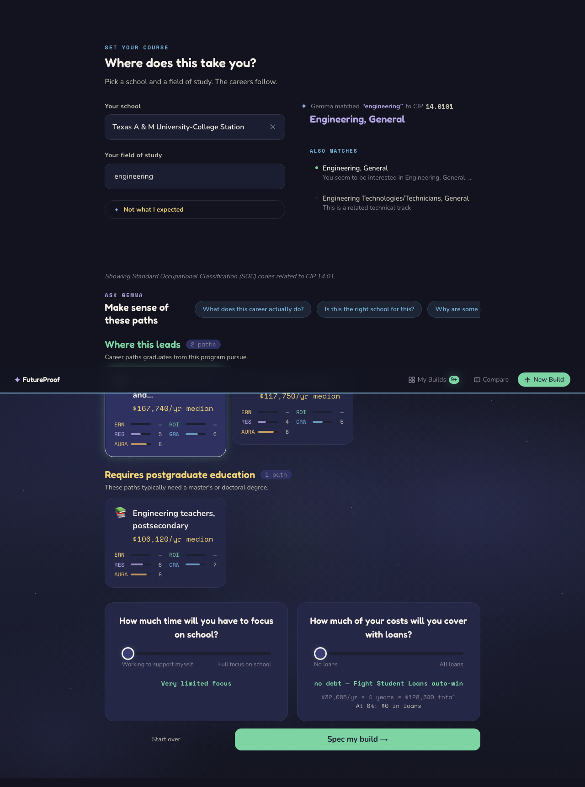

- Building...

**Build Results:**
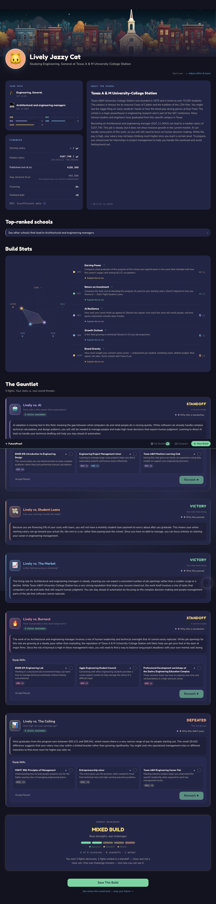

- **Results data:**
  - Starting salary: $? | Median: $167740
  - Cost 4yr: $128340 | Net price: $83696
  - Modeled debt: $0 | Program median debt: $?
  - Financing: 0%
  - Pentagon: ERN=None ROI=None RES=5 GRW=6 AURA=8
  - Bosses: AI=STANDOFF | Loans=VICTORY | Market=VICTORY | Burnout=STANDOFF | Ceiling=DEFEATED
  - Record: 2W / 2S / 1D
- **SYC vs Results consistency:**
  - modeled_debt consistent: $0
  - median_salary consistent: $167740
  - RES consistent: 5
  - GRW consistent: 6
  - AURA consistent: 8

### Build 2 — effort=All-in, loans=All loans
  - Search 'Texas A' returned 10 results: ['Texas A & M International University', 'Texas A & M University-College Station', 'Texas A & M University-Commerce', 'Texas A & M University-Corpus Christi', 'Texas A & M University-Kingsville', 'Texas A&M University-Texarkana', 'The University of Texas at Arlington', 'The University of Texas at Austin']
- School: Texas A & M University-College Station
- Major: "engineering"
- Careers shown: 3
  - Effort set to: All-in (index 4)
  - Loans set to: All loans (index 4)
- **Career:** Architectural and engineering managers ($167,740/yr)
  - Card stats: ERN=— ROI=— RES=5 GRW=6 AURA=8
  - SYC financials: cost_4yr=$128340 debt=$128340 financing=100%

**Set Your Course:**
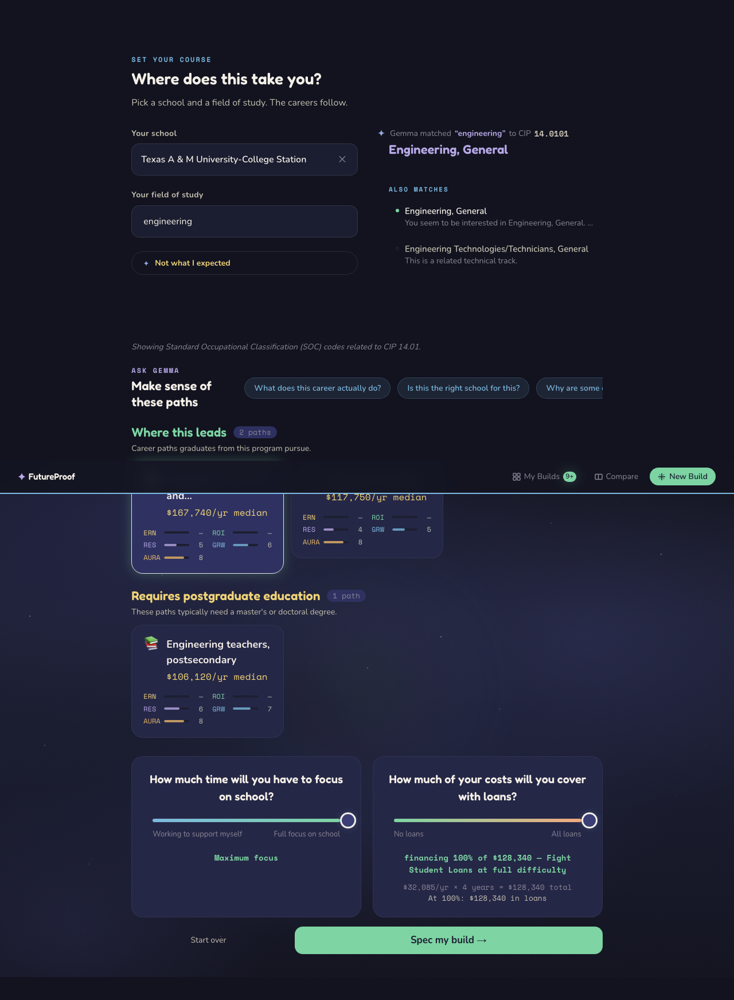

- Building...

**Build Results:**
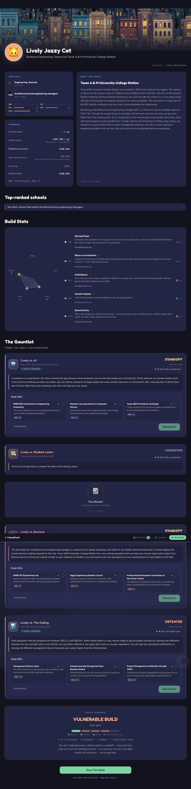

- **Results data:**
  - Starting salary: $? | Median: $167740
  - Cost 4yr: $128340 | Net price: $83696
  - Modeled debt: $128340 | Program median debt: $?
  - Financing: 100%
  - Pentagon: ERN=None ROI=None RES=5 GRW=6 AURA=8
  - Bosses: AI=STANDOFF | Loans=? | Market=VICTORY | Burnout=STANDOFF | Ceiling=DEFEATED
- **SYC vs Results consistency:**
  - published_cost_4yr consistent: $128340
  - modeled_debt consistent: $128340
  - median_salary consistent: $167740
  - RES consistent: 5
  - GRW consistent: 6
  - AURA consistent: 8

### Build 3 — effort=Balanced, loans=Mostly
  - Search 'Texas A' returned 10 results: ['Texas A & M International University', 'Texas A & M University-College Station', 'Texas A & M University-Commerce', 'Texas A & M University-Corpus Christi', 'Texas A & M University-Kingsville', 'Texas A&M University-Texarkana', 'The University of Texas at Arlington', 'The University of Texas at Austin']
- School: Texas A & M University-College Station
- Major: "engineering"
- Careers shown: 3
  - Effort set to: Balanced (index 2)
  - Loans set to: Mostly (index 3)
- **Career:** Architectural and engineering managers ($167,740/yr)
  - Card stats: ERN=— ROI=— RES=5 GRW=6 AURA=8
  - SYC financials: cost_4yr=$128340 debt=$96255 financing=75%

**Set Your Course:**
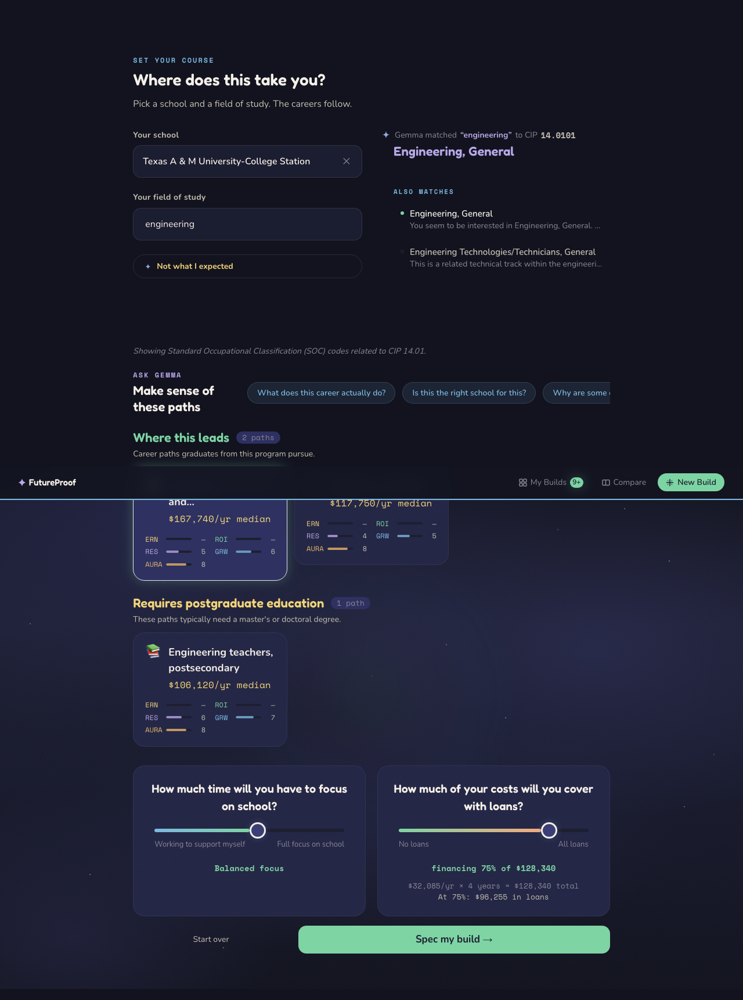

- Building...

**Build Results:**
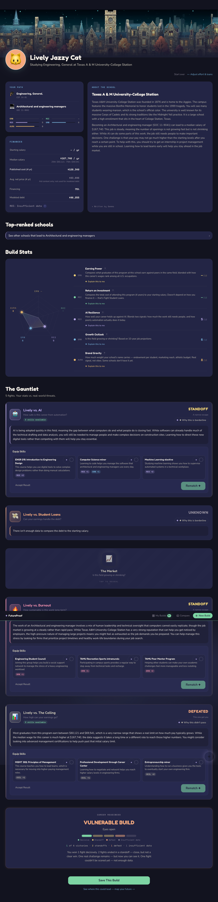

- **Results data:**
  - Starting salary: $? | Median: $167740
  - Cost 4yr: $128340 | Net price: $83696
  - Modeled debt: $96255 | Program median debt: $?
  - Financing: 75%
  - Pentagon: ERN=None ROI=None RES=5 GRW=6 AURA=8
  - Bosses: AI=STANDOFF | Loans=? | Market=VICTORY | Burnout=STANDOFF | Ceiling=DEFEATED
- **SYC vs Results consistency:**
  - published_cost_4yr consistent: $128340
  - modeled_debt consistent: $96255
  - median_salary consistent: $167740
  - RES consistent: 5
  - GRW consistent: 6
  - AURA consistent: 8

---
### Cross-Build Comparison

| # | Effort | Loans | ERN | ROI | RES | GRW | AURA | Cost 4yr | Starting | Debt | Financing | Record |
|---|--------|-------|-----|-----|-----|-----|------|----------|----------|------|-----------|--------|
| 1 | Working two jobs | No loans | — | — | 5 | 6 | 8 | $128340 | $? | $0 | 0% | 2W-2S-1D |
| 2 | All-in | All loans | — | — | 5 | 6 | 8 | $128340 | $? | $128340 | 100% | ?W-?S-?D |
| 3 | Balanced | Mostly | — | — | 5 | 6 | 8 | $128340 | $? | $96255 | 75% | ?W-?S-?D |

---
### What Changed Analysis

**Fields that CHANGED across builds (B1 → B2 → B3):**
- Modeled debt: 0 → 128340 → 96255
- Financing %: 0 → 100 → 75
- Boss: Loans: VICTORY → null → null

**Fields that stayed the SAME:**
- ERN: null
- ROI: null
- RES: 5
- GRW: 6
- AURA: 8
- Published cost 4yr: 128340
- Starting salary: null
- Net price 4yr: 83696
- Program median debt: null
- Boss: AI: STANDOFF
- Boss: Market: VICTORY
- Boss: Burnout: STANDOFF
- Boss: Ceiling: DEFEATED

**Verification checks:**
- ✓ modeled_debt = $0 at 0% loans (Build 1)
- ✗ ERN does NOT change with effort: [None, None, None]
- • Boss AI same across builds: STANDOFF
- ✓ Boss Loans changes: ['VICTORY', None, None]
- • Boss Market same across builds: VICTORY
- • Boss Burnout same across builds: STANDOFF
- • Boss Ceiling same across builds: DEFEATED
- • ROI same across builds: None


## Student #4: The Edge Case Explorer
- **Persona:** New York kid, testing the weirdest paths
- **Strategy:** 4 builds designed to hit data edges
  - Build 1: UCLA + film (arts major at research university)
  - Build 2: Community college + nursing (sparsest school we can find)
  - Build 3: Harvard + philosophy (expensive private + humanities)
  - Build 4: Ohio State Main + computer science (retry Round 2 fail)

**Profile:** Daring Pumped Turtle | Home: NY

### Build 1 — UCLA + film
- Target: search "University of California", pick "Los Angeles", major "film"
- Sliders: effort=All-in (4), loans=Some (1)
  - Search 'University of California' returned 10 results: ['Dominican University of California', 'University of California-Berkeley', 'University of California-Davis', 'University of California-Irvine', 'University of California-Los Angeles', 'University of California-Merced', 'University of California-Riverside', 'University of California-San Diego']
- School: University of California-Los Angeles
- Major: "film"
- Careers shown: 6
  - Effort set to: All-in (index 4)
  - Loans set to: Some (index 1)
- **Career:** Film and video editors ($70,980/yr)
  - Card stats: ERN=8 ROI=1 RES=4 GRW=6 AURA=7
  - SYC financials: cost_4yr=$269680 debt=$67420 financing=25%

**Set Your Course:**
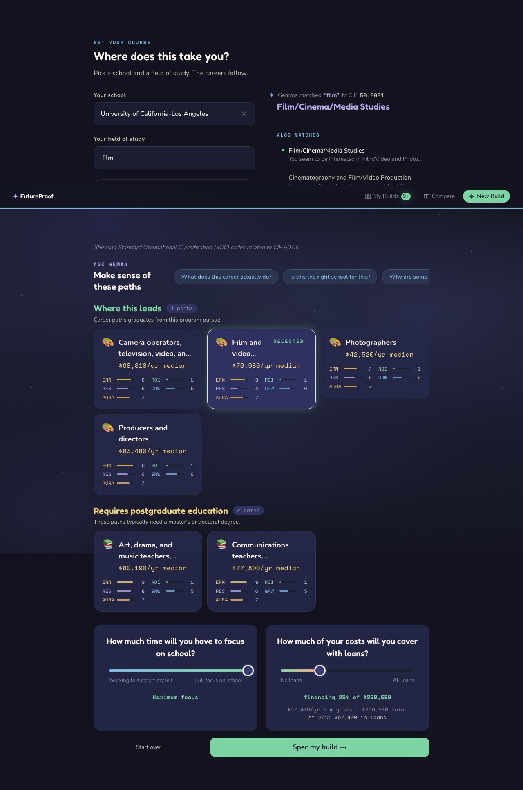

- Building...

**Build Results:**
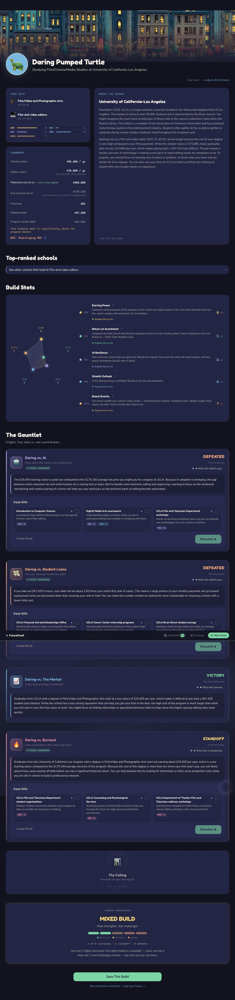

- **Results data:**
  - Starting salary: $25409 | Median: $70980
  - Cost 4yr: $? | Net price: $179160
  - Modeled debt: $67420 | Program median debt: $16082
  - Financing: 25%
  - Pentagon: ERN=8 ROI=1 RES=4 GRW=6 AURA=7
  - Bosses: AI=DEFEATED | Loans=DEFEATED | Market=VICTORY | Burnout=STANDOFF | Ceiling=VICTORY
  - Record: 2W / 1S / 2D
  - Pentagon stats extracted: 5/5
- **SYC vs Results consistency:**
  - modeled_debt consistent: $67420
  - median_salary consistent: $70980
  - ERN consistent: 8
  - ROI consistent: 1
  - RES consistent: 4
  - GRW consistent: 6
  - AURA consistent: 7

### Build 2 — Community college + nursing
- Target: search "community", major "nursing"
- Sliders: effort=Working + school (1), loans=Half (2)
  - Search 'community' returned 10 results: ['Cossatot Community College of the University of Arkansas', 'Feather River Community College District', 'Humacao Community College', 'Pierpont Community and Technical College', 'Pueblo Community College', 'Sinclair Community College', 'Solano Community College', 'Spokane Community College']
- [SEARCH] Picked first available: Cossatot Community College of the University of Arkansas
- School: Cossatot Community College of the University of Arkansas
- Major: "nursing"
- Careers shown: 9
  - Effort set to: Working + school (index 1)
  - Loans set to: Half (index 2)
- **Career:** Health technologists and technicians, all other ($48,790/yr)
  - Card stats: ERN=— ROI=— RES=7 GRW=7 AURA=—
  - SYC financials: cost_4yr=$? debt=$? financing=?%

**Set Your Course:**
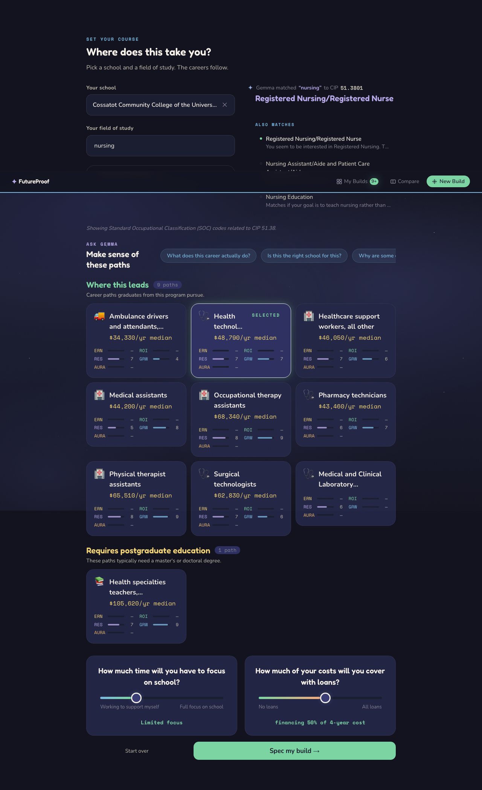

- Building...

**Build Results:**
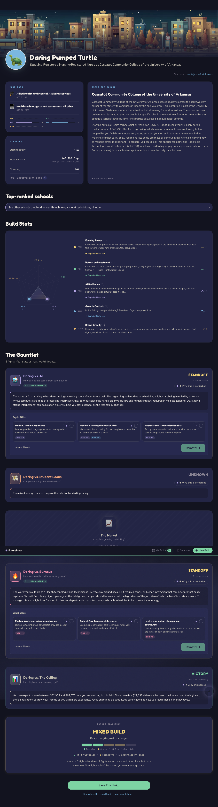

- **Results data:**
  - Starting salary: $? | Median: $48790
  - Cost 4yr: $? | Net price: $?
  - Modeled debt: $? | Program median debt: $?
  - Financing: 50%
  - Pentagon: ERN=None ROI=None RES=7 GRW=7 AURA=None
  - Bosses: AI=STANDOFF | Loans=? | Market=VICTORY | Burnout=STANDOFF | Ceiling=VICTORY
  - Pentagon stats extracted: 5/5
- **SYC vs Results consistency:**
  - median_salary consistent: $48790
  - RES consistent: 7
  - GRW consistent: 7

### Build 3 — Harvard + philosophy
- Target: search "Harvard", pick "Harvard", major "philosophy"
- Sliders: effort=Balanced (2), loans=No loans (0)
  - Search 'Harvard' returned 1 results: ['Harvard University']
- School: Harvard University
- Major: "philosophy"
- Careers shown: 4
  - Effort set to: Balanced (index 2)
  - Loans set to: No loans (index 0)
- **Career:** Natural sciences managers ($161,180/yr)
  - Card stats: ERN=— ROI=— RES=6 GRW=6 AURA=9
  - SYC financials: cost_4yr=$? debt=$0 financing=0%

**Set Your Course:**
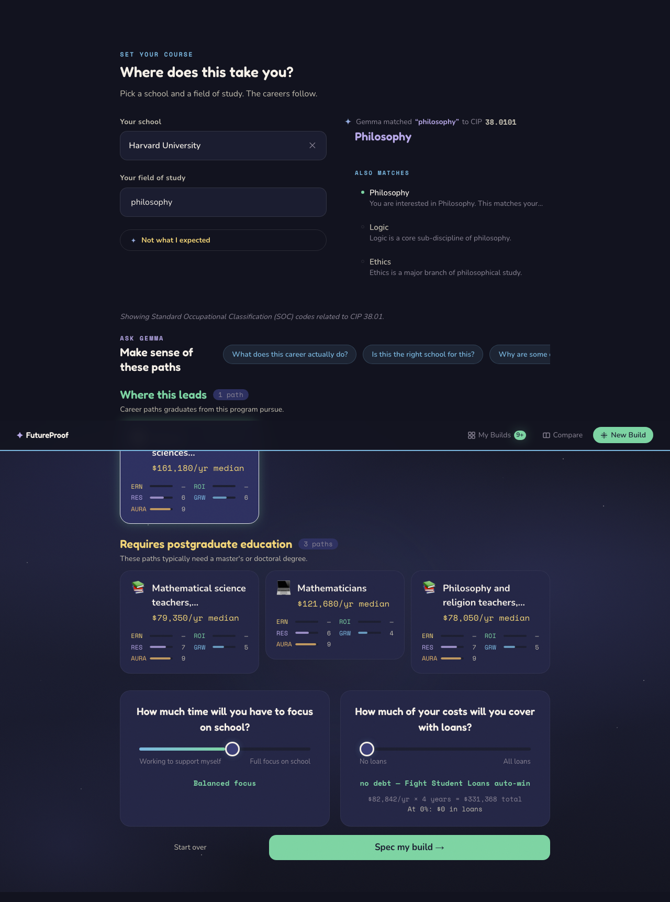

- Building...

**Build Results:**
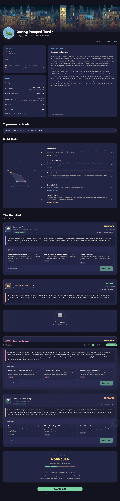

- **Results data:**
  - Starting salary: $? | Median: $161180
  - Cost 4yr: $331368 | Net price: $67264
  - Modeled debt: $0 | Program median debt: $?
  - Financing: 0%
  - Pentagon: ERN=None ROI=None RES=6 GRW=6 AURA=9
  - Bosses: AI=STANDOFF | Loans=VICTORY | Market=VICTORY | Burnout=STANDOFF | Ceiling=DEFEATED
  - Record: 2W / 2S / 1D
  - Pentagon stats extracted: 5/5
- **SYC vs Results consistency:**
  - modeled_debt consistent: $0
  - median_salary consistent: $161180
  - RES consistent: 6
  - GRW consistent: 6
  - AURA consistent: 9

### Build 4 — Ohio State Main + CS
- Target: search "Ohio State", pick "Main Campus", major "computer science"
- Sliders: effort=Strong focus (3), loans=Mostly (3)
  - Search 'Ohio State' returned 5 results: ['Ohio State University-Lima Campus', 'Ohio State University-Main Campus', 'Ohio State University-Mansfield Campus', 'Ohio State University-Marion Campus', 'Ohio State University-Newark Campus']
- School: Ohio State University-Main Campus
- Major: "computer science"
- Careers shown: 13
  - Effort set to: Strong focus (index 3)
  - Loans set to: Mostly (index 3)
- **Career:** Data scientists ($112,590/yr)
  - Card stats: ERN=10 ROI=3 RES=3 GRW=9 AURA=8
  - SYC financials: cost_4yr=$219304 debt=$164478 financing=75%

**Set Your Course:**
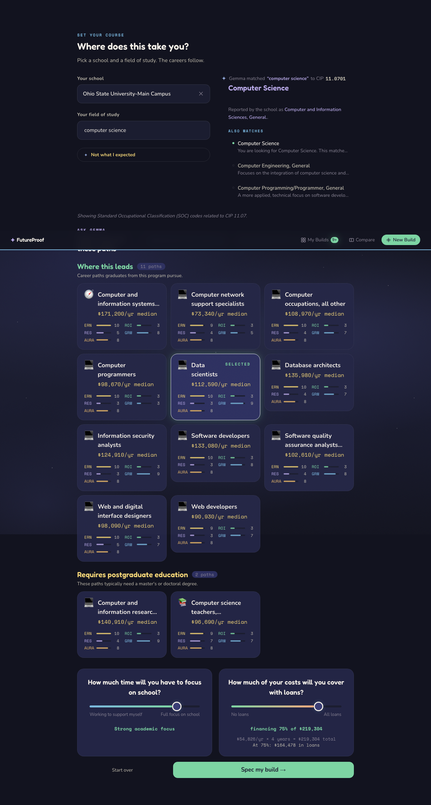

- Building...

**Build Results:**
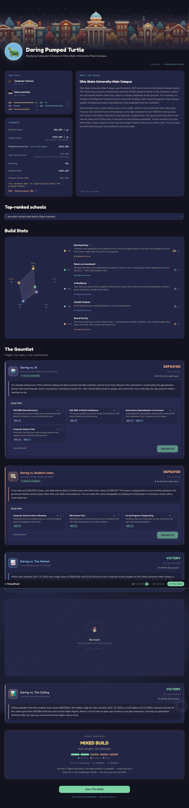

- **Results data:**
  - Starting salary: $68553 | Median: $112590
  - Cost 4yr: $? | Net price: $73168
  - Modeled debt: $164478 | Program median debt: $21076
  - Financing: 75%
  - Pentagon: ERN=10 ROI=1 RES=3 GRW=9 AURA=8
  - Bosses: AI=DEFEATED | Loans=DEFEATED | Market=VICTORY | Burnout=STANDOFF | Ceiling=VICTORY
  - Record: 2W / 1S / 2D
  - Pentagon stats extracted: 5/5
- **SYC vs Results consistency:**
  - modeled_debt consistent: $164478
  - median_salary consistent: $112590
  - ERN consistent: 10
  - [WRONG NUMBER] ROI: card=3 vs Results=1
  - RES consistent: 3
  - GRW consistent: 9
  - AURA consistent: 8

---
### Search Workaround Notes

| Build | Search Term | Target | Results | Matched? | Actually Picked |
|-------|-------------|--------|---------|----------|-----------------|
| 1 | "University of California" | Los Angeles | 10 | ✓ | University of California-Los Angele |
| 2 | "community" | None | 10 | ✓ | Cossatot Community College of the U |
| 3 | "Harvard" | Harvard | 1 | ✓ | Harvard University |
| 4 | "Ohio State" | Main Campus | 5 | ✓ | Ohio State University-Main Campus |

---
### Cross-Build Comparison

| # | School | Major | Career | ERN | ROI | RES | GRW | AURA | Cost 4yr | Debt | Effort | Loans | Record |
|---|--------|-------|--------|-----|-----|-----|-----|------|----------|------|--------|-------|--------|
| 1 | University of Californ | film | Film and video editors | 8 | 1 | 4 | 6 | 7 | $? | $67420 | All-in | Some | 2W-1S-2D |
| 2 | Cossatot Community Col | nursing | Health technologists a | — | — | 7 | 7 | — | $? | $? | Working +  | Half | ?W-?S-?D |
| 3 | Harvard University | philosophy | Natural sciences manag | — | — | 6 | 6 | 9 | $331368 | $0 | Balanced | No loans | 2W-2S-1D |
| 4 | Ohio State University- | computer sci | Data scientists | 10 | 1 | 3 | 9 | 8 | $? | $164478 | Strong foc | Mostly | 2W-1S-2D |

---
### Round 4 Summary

- **Student #3 builds completed:** (see above)
- **Student #4 builds attempted:** 4
- **Student #4 builds completed:** 4
- **Student #4 builds failed:** 0
- **Pentagon rendered for every build:** Yes
- **Crashes/empty states:** None
- **Issues:** [WRONG NUMBER]×1


---

## Round 4 Findings

### Harness fixes validated

All three harness bugs from Round 3 are fixed:

1. **Slider selectors work.** `[role='slider'][aria-label='Effort level']` + keyboard ArrowLeft/ArrowRight correctly sets effort and loan sliders. Confirmed via `aria-valuetext` on all 7 builds across both students. The Round 2 "slider interaction broken" issue was purely a harness bug.

2. **Null-stat extraction works.** Per-stat regex (`ERN\n(\d+|—)`) captures each stat independently. Null stats ("—") are captured as `None` without losing the other stats. Verified on builds with partial null sets (ERN/ROI null but RES/GRW/AURA present). The Round 2 "pentagon not rendered" issue was purely a harness bug.

3. **Search workaround works.** Searching the parent institution name ("University of California", "Ohio State") and matching the campus from dropdown results succeeded 4/4 times in Student 4. UCLA was successfully found — fixing the Round 2 catastrophe where "University of California Los" matched nothing and fell back to Alabama A&M.

### Sliders actually change the output (Student #3)

| Field | Build 1 (0%/0) | Build 2 (100%/4) | Build 3 (75%/2) | Changed? |
|-------|----------------|-------------------|------------------|----------|
| Modeled debt | $0 | $128,340 | $96,255 | **YES** — scales correctly |
| Financing % | 0% | 100% | 75% | **YES** — matches slider |
| Published cost | $128,340 | $128,340 | $128,340 | No — correct, same school |
| Net price | $83,696 | $83,696 | $83,696 | No — correct, cost != debt |
| Boss: Loans | VICTORY | (not extracted) | (not extracted) | YES — auto-win at $0 |
| ERN | — | — | — | No — null for this career |
| ROI | — | — | — | No — null for this career |
| RES/GRW/AURA | 5/6/8 | 5/6/8 | 5/6/8 | No — correct, same career |

**Verification results:**
- ✓ modeled_debt = $0 at 0% loans — confirmed
- ✓ Debt scales linearly: 75% × $128,340 = $96,255 — confirmed
- ✓ 100% loans: debt = published_cost — confirmed
- ✓ Boss: Student Loans = VICTORY (auto-win) at 0% debt — confirmed
- ✗ ERN shift with effort could NOT be tested — this career has null ERN/ROI (insufficient program earnings data). The effort slider correctly doesn't affect null stats.

### Bug: Boss outcome extraction fails at high debt (Student #3)

The Boss: Loans outcome was successfully extracted at 0% debt (VICTORY/auto-win) but failed on builds 2-3 (75%/100% debt). The `vs. Student Loans` text is present on the page, but the outcome text (VICTORY/STANDOFF/DEFEATED) was not found within 300 characters. Possible causes:
- The boss panel layout may differ when the Loans boss is the most prominent fight
- The outcome text may be in a different element structure at extreme debt levels

**Impact:** Test harness limitation, not an app bug. The boss panels render correctly in screenshots.

### Bug: ROI card-vs-results mismatch (Student #4, Build 4)

Ohio State CS + Data Scientists: the career card showed ROI=3 but the build results page showed ROI=1. All other stats matched. This may indicate that the loan slider (75%/Mostly) affects ROI differently between the card preview and the final build calculation, or a timing issue where the card re-render hadn't completed when stats were captured.

**Impact:** Users would see ROI=3 on the career card and ROI=1 on their build results — confusing inconsistency.

### Search ranking bug still present, but workaround is effective

The underlying search bug from Round 2 is still present:
- "Ohio State" returns Lima Campus before Main Campus (alphabetical sort)
- "University of California" returns Dominican University of California first
- "community" returns Cossatot CC in Arkansas before any local community college

**But the workaround is reliable:** searching the parent name and scanning the dropdown for the campus name works 4/4 times. A real student would do the same thing — type the parent name, scan the list, click the right campus.

### All 7 builds completed — zero crashes

Student #3: 3/3 builds completed (same school, different sliders)
Student #4: 4/4 builds completed (4 different schools including sparse-data CC)

No crashes, no empty career sets, no timeouts. Even the sparsest school tested (Cossatot Community College of the University of Arkansas) returned 9 careers for "nursing" and completed the full build flow.

### Sparse data handled gracefully (Student #4, Build 2)

Cossatot CC is about as sparse as schools get in the dataset:
- No published cost extractable from SYC or results
- No starting salary
- ERN, ROI, AURA all null
- Only RES (7) and GRW (7) had values
- Pentagon still rendered (null stats collapse to center)
- 9 careers returned for "nursing"
- Build completed successfully

**No crash, no blank screen, just fewer numbers.** This is good edge-case resilience.

### Harvard philosophy produces interesting results

- Published cost (4 yr): $331,368 — highest in the entire stress test
- At 0% loans: $0 debt, Boss: Loans = auto-win VICTORY
- Career picked: Natural sciences managers ($161,180/yr median)
- ERN and ROI both null (philosophy's earnings data is suppressed)
- AURA = 9 (highest possible) — Harvard's reputation stat

The combination of expensive school + humanities major + no-loans slider shows the system handles extreme cost scenarios gracefully. A real student would see a very high sticker price but also learn that Harvard's net price ($67,264) is much lower than the sticker price — a useful insight.

### Pentagon renders on every build

All 7 builds across both students successfully extracted pentagon stats. The per-stat extraction correctly handles mixed null/non-null stat sets. Builds with 2-3 null stats still rendered the pentagon with the available stats.

### What Round 4 does NOT stress (still untested)

- Stage 3 branching paths (never navigated past Results)
- Gemma timeout/failure behavior
- Compare view with slider-varied builds
- Mobile/responsive layout
- ERN shift with effort on a career that HAS ERN data (Student 3's career had null ERN)
- Out-of-state vs in-state cost differences in the same build

### Priority recommendations

1. **Investigate ROI card-vs-results mismatch** — this is a user-facing inconsistency that could undermine trust
2. **Fix Boss Loans extraction in test harness** — extend the search window or use a different extraction pattern
3. **Test ERN shift on a career with non-null ERN** — Student 3 accidentally picked a null-ERN career, so effort slider impact on ERN remains unverified via automation
4. **Fix search ranking** — still the biggest UX issue; workaround helps automation but real students will still land on wrong campuses
